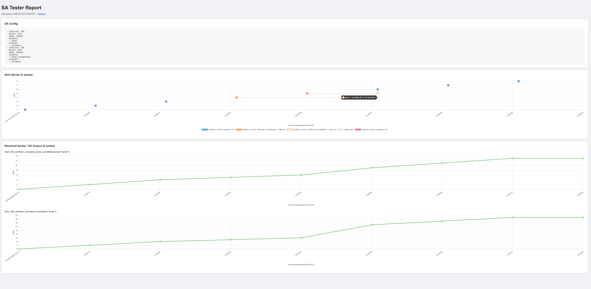

The `sa-tester` provides a stream aggregation config on the `/sa-config` endpoint for an external `vmagent` to read, writes raw series to `vmagent` for aggregation, and receives the output aggregation results from `vmagent`. It will print all the input and output samples in its logs.

See app/test/sa_tester/config.yaml for the supported configs.

**Test steps:**

1. Start the `sa-tester` with the local config file `app/test/sa_tester/config.yaml`.
2. Start a `vmagent` instance using the version you want to test:
   - 2.1. Use `<sa-tester-addr>/api/v1/write` as one of the `-remoteWrite.url` values. You can also add other `remoteWrite` URLs to `vmsingle` to check the aggregation results.
   - 2.2. Use `-streamAggr.config=http://192.168.0.102:8880/sa-config` to make `vmagent` use the stream aggregation config from `sa-tester`.
3. Call `<sa-tester-addr>/start` when you're ready. The `sa-tester` will call the `vmagent` reload endpoint to ensure the stream aggregation config is up to date, and start writing the series to `vmagent` for aggregation.
4. Check results using the `sa-tester` logs, `<sa-tester-addr>/report` page or other remoteWrite destinations. 

**Notes:**

1. You can safely rerun the test without restarting the `vmagent` instance if you changed the stream aggregation config (due to the reload call) or just wait for a while (due to the default staleness interval).
2. You can call `<sa-tester-addr>/reset` to update the `/sa-config` endpoint and `input_series` configs, then call `<sa-tester-addr>/start` to start a new test.
3. You can replace the above `vmagent` with `vmsingle` if you want to check results only in `vmsingle` instead of in the `sa-tester` logs.
4. Do not send extra metrics from vmagent to sa-tester, it will generate a wall of logs:)