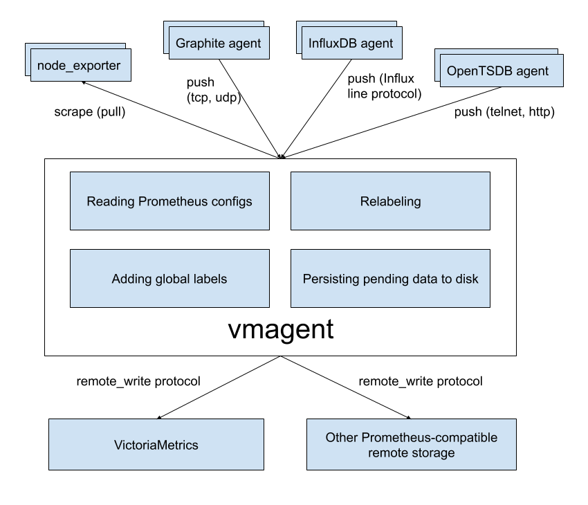

## vmagent

`vmagent` is a tiny but brave agent, which helps you collect metrics from various sources
and stores them in [VictoriaMetrics](https://github.com/VictoriaMetrics/VictoriaMetrics)
or any other Prometheus-compatible storage system that supports the `remote_write` protocol.




### Motivation

While VictoriaMetrics provides an efficient solution to store and observe metrics, our users needed something fast
and RAM friendly to scrape metrics from Prometheus-compatible exporters to VictoriaMetrics.
Also, we found that users’ infrastructure are snowflakes - no two are alike, and we decided to add more flexibility
to `vmagent` (like the ability to push metrics instead of pulling them). We did our best and plan to do even more.


### Features

* Can be used as drop-in replacement for Prometheus for scraping targets such as [node_exporter](https://github.com/prometheus/node_exporter).
  See [Quick Start](#quick-start) for details.
* Can add, remove and modify labels (aka tags) via Prometheus relabeling. Can filter data before sending it to remote storage. See [these docs](#relabeling) for details.
* Accepts data via all the ingestion protocols supported by VictoriaMetrics:
  * Influx line protocol via `http://<vmagent>:8429/write`. See [these docs](https://github.com/VictoriaMetrics/VictoriaMetrics/blob/master/README.md#how-to-send-data-from-influxdb-compatible-agents-such-as-telegraf).
  * Graphite plaintext protocol if `-graphiteListenAddr` command-line flag is set. See [these docs](https://github.com/VictoriaMetrics/VictoriaMetrics/blob/master/README.md#how-to-send-data-from-graphite-compatible-agents-such-as-statsd).
  * OpenTSDB telnet and http protocols if `-opentsdbListenAddr` command-line flag is set. See [these docs](https://github.com/VictoriaMetrics/VictoriaMetrics/blob/master/README.md#how-to-send-data-from-opentsdb-compatible-agents).
  * Prometheus remote write protocol via `http://<vmagent>:8429/api/v1/write`.
  * JSON lines import protocol via `http://<vmagent>:8429/api/v1/import`. See [these docs](https://github.com/VictoriaMetrics/VictoriaMetrics/blob/master/README.md#how-to-import-data-in-json-line-format).
  * Native data import protocol via `http://<vmagent>:8429/api/v1/import/native`. See [these docs](https://github.com/VictoriaMetrics/VictoriaMetrics/blob/master/README.md#how-to-import-data-in-native-format).
  * Data in Prometheus exposition format. See [these docs](https://github.com/VictoriaMetrics/VictoriaMetrics/blob/master/README.md#how-to-import-data-in-prometheus-exposition-format) for details.
  * Arbitrary CSV data via `http://<vmagent>:8429/api/v1/import/csv`. See [these docs](https://github.com/VictoriaMetrics/VictoriaMetrics/blob/master/README.md#how-to-import-csv-data).
* Can replicate collected metrics simultaneously to multiple remote storage systems.
* Works in environments with unstable connections to remote storage. If the remote storage is unavailable, the collected metrics
  are buffered at `-remoteWrite.tmpDataPath`. The buffered metrics are sent to remote storage as soon as connection
  to remote storage is recovered. The maximum disk usage for the buffer can be limited with `-remoteWrite.maxDiskUsagePerURL`.
* Uses lower amounts of RAM, CPU, disk IO and network bandwidth compared to Prometheus.


### Quick Start

Just download `vmutils-*` archive from [releases page](https://github.com/VictoriaMetrics/VictoriaMetrics/releases), unpack it
and pass the following flags to `vmagent` binary in order to start scraping Prometheus targets:

* `-promscrape.config` with the path to Prometheus config file (it is usually located at `/etc/prometheus/prometheus.yml`)
* `-remoteWrite.url` with the remote storage endpoint such as VictoriaMetrics. The `-remoteWrite.url` argument can be specified multiple times in order to replicate data concurrently to an arbitrary number of remote storage systems.

Example command line:

```
/path/to/vmagent -promscrape.config=/path/to/prometheus.yml -remoteWrite.url=https://victoria-metrics-host:8428/api/v1/write
```

If you only need to collect Influx data, then the following is sufficient:

```
/path/to/vmagent -remoteWrite.url=https://victoria-metrics-host:8428/api/v1/write
```

Then send Influx data to `http://vmagent-host:8429`. See [these docs](https://github.com/VictoriaMetrics/VictoriaMetrics/blob/master/README.md#how-to-send-data-from-influxdb-compatible-agents-such-as-telegraf) for more details.

`vmagent` is also available in [docker images](https://hub.docker.com/r/victoriametrics/vmagent/tags).

Pass `-help` to `vmagent` in order to see the full list of supported command-line flags with their descriptions.


### Use cases


#### IoT and Edge monitoring

`vmagent` can run and collect metrics in IoT and industrial networks with unreliable or scheduled connections to the remote storage.
It buffers the collected data in local files until the connection to remote storage becomes available and then sends the buffered
data to the remote storage. It re-tries sending the data to remote storage on any errors.
The maximum buffer size can be limited with `-remoteWrite.maxDiskUsagePerURL`.

`vmagent` works on various architectures from IoT world - 32-bit arm, 64-bit arm, ppc64, 386, amd64.
See [the corresponding Makefile rules](https://github.com/VictoriaMetrics/VictoriaMetrics/blob/master/app/vmagent/Makefile) for details.


#### Drop-in replacement for Prometheus

If you use Prometheus only for scraping metrics from various targets and forwarding these metrics to remote storage,
then `vmagent` can replace such Prometheus setup. Usually `vmagent` requires lower amounts of RAM, CPU and network bandwidth comparing to Prometheus for such a setup.
See [these docs](#how-to-collect-metrics-in-prometheus-format) for details.


#### Replication and high availability

`vmagent` replicates the collected metrics among multiple remote storage instances configured via `-remoteWrite.url` args.
If a single remote storage instance temporarily is out of service, then the collected data remains available in another remote storage instances.
`vmagent` buffers the collected data in files at `-remoteWrite.tmpDataPath` until the remote storage becomes available again.
Then it sends the buffered data to the remote storage in order to prevent data gaps in the remote storage.


#### Relabeling and filtering

`vmagent` can add, remove or update labels on the collected data before sending it to remote storage. Additionally,
it can remove unwanted samples via Prometheus-like relabeling before sending the collected data to remote storage.
See [these docs](#relabeling) for details.


#### Splitting data streams among multiple systems

`vmagent` supports splitting the collected data between muliple destinations with the help of `-remoteWrite.urlRelabelConfig`,
which is applied independently for each configured `-remoteWrite.url` destination. For instance, it is possible to replicate or split
data among long-term remote storage, short-term remote storage and real-time analytical system [built on top of Kafka](https://github.com/Telefonica/prometheus-kafka-adapter).
Note that each destination can receive its own subset of the collected data thanks to per-destination relabeling via `-remoteWrite.urlRelabelConfig`.


#### Prometheus remote_write proxy

`vmagent` may be used as a proxy for Prometheus data sent via Prometheus `remote_write` protocol. It can accept data via `remote_write` API
at `/api/v1/write` endpoint, apply relabeling and filtering and then proxy it to another `remote_write` systems.
The `vmagent` can be configured to encrypt the incoming `remote_write` requests with `-tls*` command-line flags.
Additionally, Basic Auth can be enabled for the incoming `remote_write` requests with `-httpAuth.*` command-line flags.


### How to collect metrics in Prometheus format

Pass the path to `prometheus.yml` to `-promscrape.config` command-line flag. `vmagent` takes into account the following
sections from [Prometheus config file](https://prometheus.io/docs/prometheus/latest/configuration/configuration/):

* `global`
* `scrape_configs`

All the other sections are ignored, including [remote_write](https://prometheus.io/docs/prometheus/latest/configuration/configuration/#remote_write) section.
Use `-remoteWrite.*` command-line flags instead for configuring remote write settings.

The following scrape types in [scrape_config](https://prometheus.io/docs/prometheus/latest/configuration/configuration/#scrape_config) section are supported:

* `static_configs` - for scraping statically defined targets. See [these docs](https://prometheus.io/docs/prometheus/latest/configuration/configuration/#static_config) for details.
* `file_sd_configs` - for scraping targets defined in external files aka file-based service discover.
  See [these docs](https://prometheus.io/docs/prometheus/latest/configuration/configuration/#file_sd_config) for details.
* `kubernetes_sd_configs` - for scraping targets in Kubernetes (k8s).
  See [kubernetes_sd_config](https://prometheus.io/docs/prometheus/latest/configuration/configuration/#kubernetes_sd_config) for details.
* `ec2_sd_configs` - for scraping targets in Amazon EC2.
  See [ec2_sd_config](https://prometheus.io/docs/prometheus/latest/configuration/configuration/#ec2_sd_config) for details.
  `vmagent` doesn't support `profile` config param and aws credentials file yet.
* `gce_sd_configs` - for scraping targets in Google Compute Engine (GCE).
  See [gce_sd_config](https://prometheus.io/docs/prometheus/latest/configuration/configuration/#gce_sd_config) for details.
  `vmagent` provides the following additional functionality for `gce_sd_config`:
  * if `project` arg is missing, then `vmagent` uses the project for the instance where it runs;
  * if `zone` arg is missing, then `vmagent` uses the zone for the instance where it runs;
  * if `zone` arg equals to `"*"`, then `vmagent` discovers all the zones for the given project;
  * `zone` may contain arbitrary number of zones, i.e. `zone: [us-east1-a, us-east1-b]`.
* `consul_sd_configs` - for scraping targets registered in Consul.
  See [consul_sd_config](https://prometheus.io/docs/prometheus/latest/configuration/configuration/#consul_sd_config) for details.
* `dns_sd_configs` - for scraping targets discovered from DNS records (SRV, A and AAAA).
  See [dns_sd_config](https://prometheus.io/docs/prometheus/latest/configuration/configuration/#dns_sd_config) for details.
* `openstack_sd_configs` - for scraping OpenStack targets.
  See [openstack_sd_config](https://prometheus.io/docs/prometheus/latest/configuration/configuration/#openstack_sd_config) for details.
  [OpenStack identity API v3](https://docs.openstack.org/api-ref/identity/v3/) is supported only.
* `dockerswarm_sd_configs` - for scraping Docker Swarm targets.
  See [dockerswarm_sd_config](https://prometheus.io/docs/prometheus/latest/configuration/configuration/#dockerswarm_sd_config) for details.

File feature requests at [our issue tracker](https://github.com/VictoriaMetrics/VictoriaMetrics/issues) if you need other service discovery mechanisms to be supported by `vmagent`.

`vmagent` also support the following additional options in `scrape_config` section:

* `disable_compression: true` - for disabling response compression on a per-job basis. By default `vmagent` requests compressed responses from scrape targets
  in order to save network bandwidth.
* `disable_keepalive: true` - for disabling [HTTP keep-alive connections](https://en.wikipedia.org/wiki/HTTP_persistent_connection) on a per-job basis.
  By default `vmagent` uses keep-alive connections to scrape targets in order to reduce overhead on connection re-establishing.

Note that `vmagent` doesn't support `refresh_interval` option these scrape configs. Use the corresponding `-promscrape.*CheckInterval`
command-line flag instead. For example, `-promscrape.consulSDCheckInterval=60s` sets `refresh_interval` for all the `consul_sd_configs`
entries to 60s. Run `vmagent -help` in order to see default values for `-promscrape.*CheckInterval` flags.

The file pointed by `-promscrape.config` may contain `%{ENV_VAR}` placeholders, which are substituted by the corresponding `ENV_VAR` environment variable values.


### Adding labels to metrics

Labels can be added to metrics via the following mechanisms:

* Via `global -> external_labels` section in `-promscrape.config` file. These labels are added only to metrics scraped from targets configured in `-promscrape.config` file.
* Via `-remoteWrite.label` command-line flag. These labels are added to all the collected metrics before sending them to `-remoteWrite.url`.


### Relabeling

`vmagent` supports [Prometheus relabeling](https://prometheus.io/docs/prometheus/latest/configuration/configuration/#relabel_config).
Additionally it provides the following extra actions:

* `replace_all`: replaces all the occurences of `regex` in the values of `source_labels` with the `replacement` and stores the result in the `target_label`.
* `labelmap_all`: replaces all the occurences of `regex` in all the label names with the `replacement`.
* `keep_if_equal`: keeps the entry if all label values from `source_labels` are equal.
* `drop_if_equal`: drops the entry if all the label values from `source_labels` are equal.

The relabeling can be defined in the following places:

* At `scrape_config -> relabel_configs` section in `-promscrape.config` file. This relabeling is applied to target labels.
* At `scrape_config -> metric_relabel_configs` section in `-promscrape.config` file. This relabeling is applied to all the scraped metrics in the given `scrape_config`.
* At `-remoteWrite.relabelConfig` file. This relabeling is aplied to all the collected metrics before sending them to remote storage.
* At `-remoteWrite.urlRelabelConfig` files. This relabeling is applied to metrics before sending them to the corresponding `-remoteWrite.url`.

Read more about relabeling in the following articles:

* [Life of a label](https://www.robustperception.io/life-of-a-label)
* [Discarding targets and timeseries with relabeling](https://www.robustperception.io/relabelling-can-discard-targets-timeseries-and-alerts)
* [Dropping labels at scrape time](https://www.robustperception.io/dropping-metrics-at-scrape-time-with-prometheus)
* [Extracting labels from legacy metric names](https://www.robustperception.io/extracting-labels-from-legacy-metric-names)
* [relabel_configs vs metric_relabel_configs](https://www.robustperception.io/relabel_configs-vs-metric_relabel_configs)


### Monitoring

`vmagent` exports various metrics in Prometheus exposition format at `http://vmagent-host:8429/metrics` page. It is recommended setting up regular scraping of this page
either via `vmagent` itself or via Prometheus, so the exported metrics could be analyzed later.
Use official [Grafana dashboard](https://grafana.com/grafana/dashboards/12683) for `vmagent` state overview.
If you have suggestions, improvements or found a bug - feel free to open an issue on github or add review to the dashboard.

`vmagent` also exports target statuses at the following handlers:

* `http://vmagent-host:8429/targets`. This handler returns human-readable plaintext status for every active target.
This page is convenient to query from command line with `wget`, `curl` or similar tools.
It accepts optional `show_original_labels=1` query arg, which shows the original labels per each target before applying relabeling.
This information may be useful for debugging target relabeling.
* `http://vmagent-host:8429/api/v1/targets`. This handler returns data compatible with [the corresponding page from Prometheus API](https://prometheus.io/docs/prometheus/latest/querying/api/#targets).

* `http://vmagent-host:8429/ready` - this handler returns http 200 status code when `vmagent` finishes initialization for all service_discovery configs.
  It may be useful, when you have many entries at `-promscrape.config` and want to perform `vmagent` rolling update without scrape loss.

### Troubleshooting

* It is recommended [setting up the official Grafana dashboard](#monitoring) in order to monitor `vmagent` state.

* It is recommended increasing the maximum number of open files in the system (`ulimit -n`) when scraping big number of targets,
  since `vmagent` establishes at least a single TCP connection per each target.

* When `vmagent` scrapes many unreliable targets, it can flood error log with scrape errors. These errors can be suppressed
  by passing `-promscrape.suppressScrapeErrors` command-line flag to `vmagent`. The most recent scrape error per each target can be observed at `http://vmagent-host:8429/targets`
  and `http://vmagent-host:8429/api/v1/targets`.

* The `/api/v1/targets` page could be useful for debugging relabeling process for scrape targets.
  This page contains original labels for targets dropped during relabeling (see "droppedTargets" section in the page output). By default up to `-promscrape.maxDroppedTargets` targets are shown here. If your setup drops more targets during relabeling, then increase `-promscrape.maxDroppedTargets` command-line flag value in order to see all the dropped targets. Note that tracking each dropped target requires up to 10Kb of RAM, so big values for `-promscrape.maxDroppedTargets` may result in increased memory usage if big number of scrape targets are dropped during relabeling.

* If `vmagent` scrapes targets with millions of metrics per each target (for instance, when scraping [federation endpoints](https://prometheus.io/docs/prometheus/latest/federation/)),
  then it is recommended enabling `stream parsing mode` in order to reduce memory usage during scraping. This mode may be enabled either globally for all the scrape targets
  by passing `-promscrape.streamParse` command-line flag or on a per-scrape target basis with `stream_parse: true` option. For example:

  ```yml
  scrape_configs:
  - job_name: 'big-federate'
    stream_parse: true
    static_configs:
    - targets:
      - big-prometeus1
      - big-prometeus2
    honor_labels: true
    metrics_path: /federate
    params:
      'match[]': ['{__name__!=""}']
  ```

* It is recommended to increase `-remoteWrite.queues` if `vmagent_remotewrite_pending_data_bytes` metric exported at `http://vmagent-host:8429/metrics` page constantly grows.

* If you see gaps on the data pushed by `vmagent` to remote storage when `-remoteWrite.maxDiskUsagePerURL` is set, then try increasing `-remoteWrite.queues`.
  Such gaps may appear because `vmagent` cannot keep up with sending the collected data to remote storage, so it starts dropping the buffered data
  if the on-disk buffer size exceeds `-remoteWrite.maxDiskUsagePerURL`.

* `vmagent` buffers scraped data at `-remoteWrite.tmpDataPath` directory until it is sent to `-remoteWrite.url`.
  The directory can grow large when remote storage is unavailable for extended periods of time and if `-remoteWrite.maxDiskUsagePerURL` isn't set.
  If you don't want to send all the data from the directory to remote storage, simply stop `vmagent` and delete the directory.

* By default `vmagent` masks `-remoteWrite.url` with `secret-url` values in logs and at `/metrics` page because
  the url may contain sensitive information such as auth tokens or passwords.
  Pass `-remoteWrite.showURL` command-line flag when starting `vmagent` in order to see all the valid urls.

* If you see `skipping duplicate scrape target with identical labels` errors when scraping Kubernetes pods, then it is likely these pods listen multiple ports
  or they use init container. These errors can be either fixed or suppressed with `-promscrape.suppressDuplicateScrapeTargetErrors` command-line flag.
  See available options below if you prefer fixing the root cause of the error:

  The following `relabel_configs` section may help determining `__meta_*` labels resulting in duplicate targets:
  ```yml
  - action: labelmap
    regex: __meta_(.*)
  ```

  The following relabeling rule may be added to `relabel_configs` section in order to filter out pods with unneeded ports:
  ```yml
  - action: keep_if_equal
    source_labels: [__meta_kubernetes_pod_annotation_prometheus_io_port, __meta_kubernetes_pod_container_port_number]
  ```

  The following relabeling rule may be added to `relabel_configs` section in order to filter out init container pods:
  ```yml
  - action: drop
    source_labels: [__meta_kubernetes_pod_container_init]
    regex: true
  ```


### How to build from sources

It is recommended using [binary releases](https://github.com/VictoriaMetrics/VictoriaMetrics/releases) - `vmagent` is located in `vmutils-*` archives there.


#### Development build

1. [Install Go](https://golang.org/doc/install). The minimum supported version is Go 1.13.
2. Run `make vmagent` from the root folder of the repository.
   It builds `vmagent` binary and puts it into the `bin` folder.

#### Production build

1. [Install docker](https://docs.docker.com/install/).
2. Run `make vmagent-prod` from the root folder of the repository.
   It builds `vmagent-prod` binary and puts it into the `bin` folder.

#### Building docker images

Run `make package-vmagent`. It builds `victoriametrics/vmagent:<PKG_TAG>` docker image locally.
`<PKG_TAG>` is auto-generated image tag, which depends on source code in the repository.
The `<PKG_TAG>` may be manually set via `PKG_TAG=foobar make package-vmagent`.

The base docker image is [alpine](https://hub.docker.com/_/alpine) but it is possible to use any other base image
by setting it via `<ROOT_IMAGE>` environment variable. For example, the following command builds the image on top of [scratch](https://hub.docker.com/_/scratch) image:

```bash
ROOT_IMAGE=scratch make package-vmagent
```

#### ARM build

ARM build may run on Raspberry Pi or on [energy-efficient ARM servers](https://blog.cloudflare.com/arm-takes-wing/).

#### Development ARM build

1. [Install Go](https://golang.org/doc/install). The minimum supported version is Go 1.13.
2. Run `make vmagent-arm` or `make vmagent-arm64` from the root folder of the repository.
   It builds `vmagent-arm` or `vmagent-arm64` binary respectively and puts it into the `bin` folder.

#### Production ARM build

1. [Install docker](https://docs.docker.com/install/).
2. Run `make vmagent-arm-prod` or `make vmagent-arm64-prod` from the root folder of the repository.
   It builds `vmagent-arm-prod` or `vmagent-arm64-prod` binary respectively and puts it into the `bin` folder.


### Profiling

`vmagent` provides handlers for collecting the following [Go profiles](https://blog.golang.org/profiling-go-programs):

* Memory profile. It can be collected with the following command:

```bash
curl -s http://<vmagent-host>:8429/debug/pprof/heap > mem.pprof
```

* CPU profile. It can be collected with the following command:

```bash
curl -s http://<vmagent-host>:8429/debug/pprof/profile > cpu.pprof
```

The command for collecting CPU profile waits for 30 seconds before returning.

The collected profiles may be analyzed with [go tool pprof](https://github.com/google/pprof).
