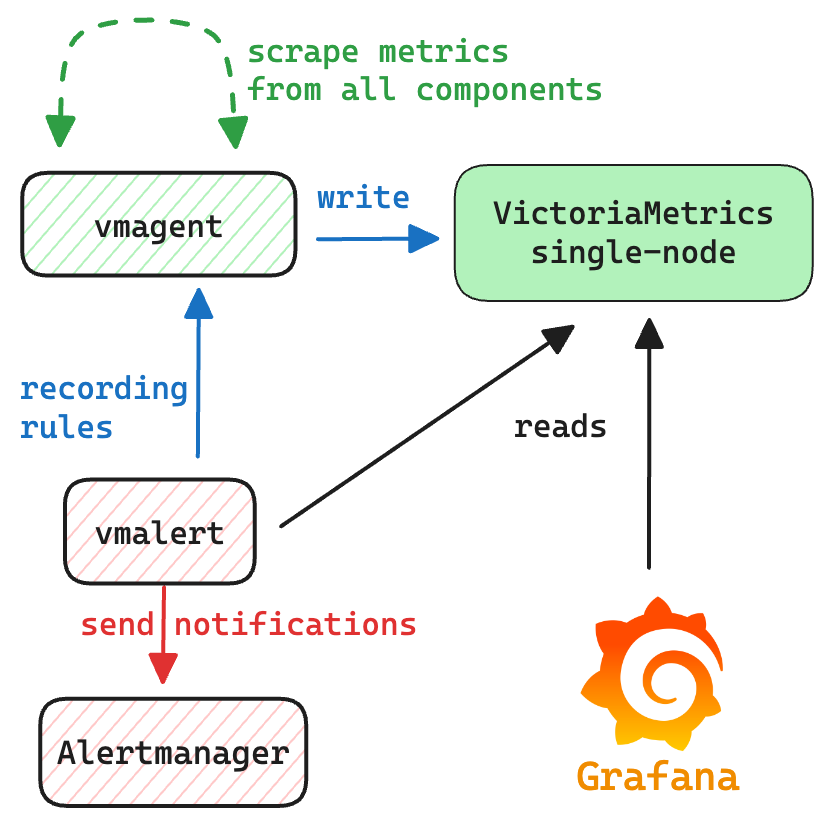
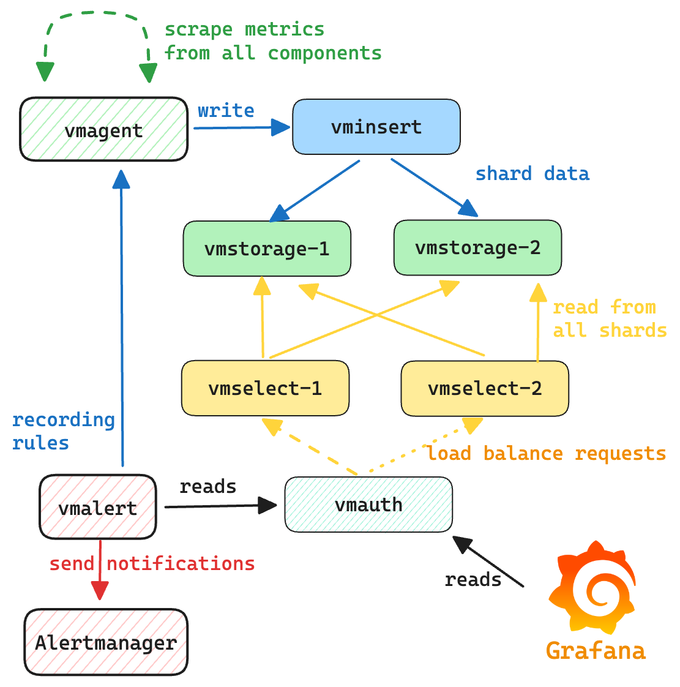

# Docker compose environment for VictoriaMetrics

Docker compose environment for VictoriaMetrics includes VictoriaMetrics components,
[Alertmanager](https://prometheus.io/docs/alerting/latest/alertmanager/) 
and [Grafana](https://grafana.com/).

For starting the docker-compose environment ensure you have docker installed and running and access to the Internet.
**All commands should be executed from the root directory of [the repo](https://github.com/VictoriaMetrics/VictoriaMetrics).**

* [VictoriaMetrics single server](#victoriametrics-single-server)
* [VictoriaMetrics cluster](#victoriametrics-cluster)
* [vmagent](#vmagent)
* [vmauth](#vmauth)
* [vmalert](#vmalert)
* [alertmanager](#alertmanager)
* [Alerts](#alerts)
* [Grafana](#grafana)
* [VictoriaLogs](#victoriaLogs-server)


## VictoriaMetrics single server

To spin-up environment with VictoriaMetrics single server run the following command:
```
make docker-single-up 
```

VictoriaMetrics will be accessible on the following ports:

* `--graphiteListenAddr=:2003`
* `--opentsdbListenAddr=:4242`
* `--httpListenAddr=:8428`

The communication scheme between components is the following:
* [vmagent](#vmagent) sends scraped metrics to `single server VictoriaMetrics`;
* [grafana](#grafana) is configured with datasource pointing to `single server VictoriaMetrics`;
* [vmalert](#vmalert) is configured to query `single server VictoriaMetrics` and send alerts state
  and recording rules back to it;
* [alertmanager](#alertmanager) is configured to receive notifications from `vmalert`.



To access Grafana use link [http://localhost:3000](http://localhost:3000).

To access [vmui](https://docs.victoriametrics.com/single-server-victoriametrics/#vmui)
use link [http://localhost:8428/vmui](http://localhost:8428/vmui).

To access `vmalert` use link [http://localhost:8428/vmalert](http://localhost:8428/vmalert/).

To shutdown environment execute the following command:
```
make docker-single-down
```


## VictoriaMetrics cluster

To spin-up environment with VictoriaMetrics cluster run the following command:
```
make docker-cluster-up
```

VictoriaMetrics cluster environment consists of `vminsert`, `vmstorage` and `vmselect` components.
`vminsert` has exposed port `:8480`, access to `vmselect` components goes through `vmauth` on port `:8427`,
and the rest of components are available only inside the environment.

The communication scheme between components is the following:
* [vmagent](#vmagent) sends scraped metrics to `vminsert`;
* `vminsert` forwards data to `vmstorage`;
* `vmselect`s are connected to `vmstorage` for querying data;
* [vmauth](#vmauth) balances incoming read requests among `vmselect`s;
* [grafana](#grafana) is configured with datasource pointing to `vmauth`;
* [vmalert](#vmalert) is configured to query `vmselect`s via `vmauth` and send alerts state
  and recording rules to `vminsert`;
* [alertmanager](#alertmanager) is configured to receive notifications from `vmalert`.



To access Grafana use link [http://localhost:3000](http://localhost:3000).

To access [vmui](https://docs.victoriametrics.com/single-server-victoriametrics/#vmui)
use link [http://localhost:8427/select/0/prometheus/vmui/](http://localhost:8427/select/0/prometheus/vmui/).

To access `vmalert` use link [http://localhost:8427/select/0/prometheus/vmalert/](http://localhost:8427/select/0/prometheus/vmalert/).

To shutdown environment execute the following command:
```
make docker-cluster-down
```

## vmagent

vmagent is used for scraping and pushing time series to VictoriaMetrics instance. 
It accepts Prometheus-compatible configuration [prometheus.yml](https://github.com/VictoriaMetrics/VictoriaMetrics/blob/master/deployment/docker/prometheus.yml)
with listed targets for scraping.

[Web interface link](http://localhost:8429/).

## vmauth

[vmauth](https://docs.victoriametrics.com/vmauth/) acts as a [balancer](https://docs.victoriametrics.com/vmauth/#load-balancing)
to spread the load across `vmselect`'s. [Grafana](#grafana) and [vmalert](#vmalert) use vmauth for read queries.
vmauth config is available [here](ttps://github.com/VictoriaMetrics/VictoriaMetrics/blob/master/deployment/docker/auth-cluster.yml)


## vmalert

vmalert evaluates alerting rules [alerts.yml](https://github.com/VictoriaMetrics/VictoriaMetrics/blob/master/deployment/docker/alerts.yml)
to track VictoriaMetrics health state. It is connected with AlertManager for firing alerts,
and with VictoriaMetrics for executing queries and storing alert's state.

[Web interface link](http://localhost:8880/).

## alertmanager

AlertManager accepts notifications from `vmalert` and fires alerts.
All notifications are blackholed according to [alertmanager.yml](https://github.com/VictoriaMetrics/VictoriaMetrics/blob/master/deployment/docker/alertmanager.yml) config.

[Web interface link](http://localhost:9093/).

## Grafana

To access service open following [link](http://localhost:3000).

Default credential:

* login - `admin`
* password - `admin`

Grafana is provisioned by default with following entities:

* `VictoriaMetrics` datasource
* `VictoriaMetrics - cluster` datasource
* `VictoriaMetrics overview` dashboard
* `VictoriaMetrics - cluster` dashboard
* `VictoriaMetrics - vmagent` dashboard
* `VictoriaMetrics - vmalert` dashboard

Remember to pick `VictoriaMetrics - cluster` datasource when viewing `VictoriaMetrics - cluster` dashboard.

Optionally, environment with [VictoriaMetrics Grafana datasource](https://github.com/VictoriaMetrics/victoriametrics-datasource)
can be started with the following commands:
```
make docker-single-vm-datasource-up    # start single server
make docker-single-vm-datasource-down  # shut down single server

make docker-cluster-vm-datasource-up   # start cluster
make docker-cluster-vm-datasource-down # shutdown cluster
```

## Alerts

See below a list of recommended alerting rules for various VictoriaMetrics components for running in production. 
Some alerting rules thresholds are just recommendations and could require an adjustment. 
The list of alerting rules is the following:
* [alerts-health.yml](https://github.com/VictoriaMetrics/VictoriaMetrics/blob/master/deployment/docker/alerts-health.yml):
  alerting rules related to all VictoriaMetrics components for tracking their "health" state; 
* [alerts.yml](https://github.com/VictoriaMetrics/VictoriaMetrics/blob/master/deployment/docker/alerts.yml):
  alerting rules related to [single-server VictoriaMetrics](https://docs.victoriametrics.com/single-server-victoriametrics/) installation;
* [alerts-cluster.yml](https://github.com/VictoriaMetrics/VictoriaMetrics/blob/master/deployment/docker/alerts-cluster.yml):
  alerting rules related to [cluster version of VictoriaMetrics](https://docs.victoriametrics.com/cluster-victoriametrics/);
* [alerts-vmagent.yml](https://github.com/VictoriaMetrics/VictoriaMetrics/blob/master/deployment/docker/alerts-vmagent.yml):
  alerting rules related to [vmagent](https://docs.victoriametrics.com/vmagent/) component;
* [alerts-vmalert.yml](https://github.com/VictoriaMetrics/VictoriaMetrics/blob/master/deployment/docker/alerts-vmalert.yml):
  alerting rules related to [vmalert](https://docs.victoriametrics.com/vmalert/) component;
* [alerts-vmauth.yml](https://github.com/VictoriaMetrics/VictoriaMetrics/blob/master/deployment/docker/alerts-vmauth.yml):
  alerting rules related to [vmauth](https://docs.victoriametrics.com/vmauth/) component;

Please, also see [how to monitor](https://docs.victoriametrics.com/single-server-victoriametrics/#monitoring) 
VictoriaMetrics installations.

## VictoriaLogs server

To spin-up environment with VictoriaLogs run the following command:
```
make docker-victorialogs-up
```

VictoriaLogs will be accessible on the `--httpListenAddr=:9428` port.
In addition to VictoriaLogs server, the docker compose contains the following componetns:
* [fluentbit](https://docs.fluentbit.io/manual) service for collecting docker logs and sending them to VictoriaLogs;
* VictoriaMetrics single server to collect metrics from `VictoriaLogs` and `fluentbit`;
* [grafana](#grafana) is configured with [VictoriaLogs datasource](https://github.com/VictoriaMetrics/victorialogs-datasource).

To access Grafana use link [http://localhost:3000](http://localhost:3000).

To access [VictoriaLogs UI](https://docs.victoriametrics.com/victorialogs/querying/#web-ui)
use link [http://localhost:9428/select/vmui](http://localhost:9428/select/vmui).

Please, also see [how to monitor](https://docs.victoriametrics.com/victorialogs/#monitoring) 
VictoriaLogs installations.

To shutdown environment execute the following command:
```
make docker-victorialogs-down
```

Please see more examples on integration of VictoriaLogs with other log shippers below:
* [filebeat-docker](https://github.com/VictoriaMetrics/VictoriaMetrics/tree/master/deployment/docker/victorialogs/filebeat-docker) 
* [filebeat-syslog](https://github.com/VictoriaMetrics/VictoriaMetrics/tree/master/deployment/docker/victorialogs/filebeat-syslog) 
* [fluentbit-docker](https://github.com/VictoriaMetrics/VictoriaMetrics/tree/master/deployment/docker/victorialogs/fluentbit-docker) 
* [logstash](https://github.com/VictoriaMetrics/VictoriaMetrics/tree/master/deployment/docker/victorialogs/logstash) 
* [promtail](https://github.com/VictoriaMetrics/VictoriaMetrics/tree/master/deployment/docker/victorialogs/promtail) 
* [vector-docker](https://github.com/VictoriaMetrics/VictoriaMetrics/tree/master/deployment/docker/victorialogs/vector-docker)
