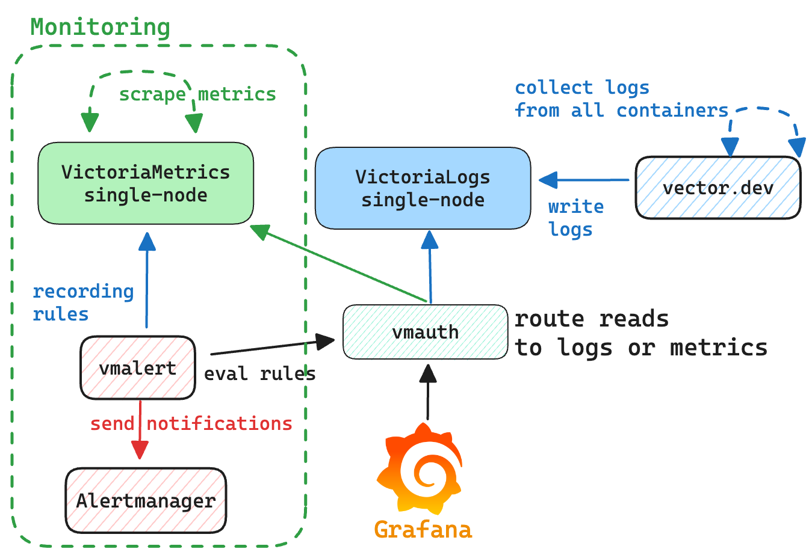
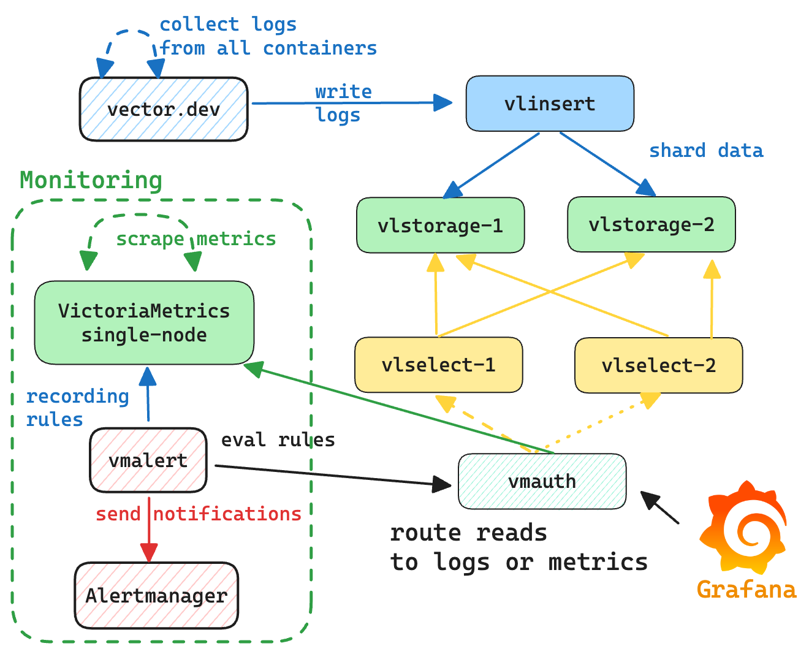

# Docker compose environment for VictoriaMetrics

Docker compose environment for VictoriaMetrics includes VictoriaMetrics and VictoriaLogs components,
[Alertmanager](https://prometheus.io/docs/alerting/latest/alertmanager/) 
and [Grafana](https://grafana.com/).

For starting the docker-compose environment ensure that you have docker installed and running, and that you have access
to the Internet.
**All commands should be executed from the root directory of [the VictoriaMetrics repo](https://github.com/VictoriaMetrics/VictoriaMetrics).**

* Metrics:
  * [VictoriaMetrics single server](#victoriametrics-single-server)
  * [VictoriaMetrics cluster](#victoriametrics-cluster)
  * [vmagent](#vmagent)
* Logs:
  * [VictoriaLogs single server](#victoriaLogs-server)
  * [VictoriaLogs cluster](#victoriaLogs-cluster)
* [Common](#common-components)
  * [vmauth](#vmauth)
  * [vmalert](#vmalert)
  * [alertmanager](#alertmanager)
  * [Grafana](#grafana)
* [Alerts](#alerts)

## VictoriaMetrics single server

To spin-up environment with VictoriaMetrics single server run the following command:
```
make docker-vm-single-up
```

VictoriaMetrics will be accessible on the following ports:
* `--graphiteListenAddr=:2003`
* `--opentsdbListenAddr=:4242`
* `--httpListenAddr=:8428`

The communication scheme between components is the following:
* [vmagent](#vmagent) sends scraped metrics to `VictoriaMetrics single-node`;
* [grafana](#grafana) is configured with datasource pointing to `VictoriaMetrics single-node`;
* [vmalert](#vmalert) is configured to query `VictoriaMetrics single-node`, and send alerts state
  and recording rules results back to `vmagent`;
* [alertmanager](#alertmanager) is configured to receive notifications from `vmalert`.


To access Grafana use link [http://localhost:3000](http://localhost:3000).

To access [vmui](https://docs.victoriametrics.com/single-server-victoriametrics/#vmui)
use link [http://localhost:8428/vmui](http://localhost:8428/vmui).

To access `vmalert` use link [http://localhost:8428/vmalert](http://localhost:8428/vmalert/).

To shutdown environment run:
```
make docker-vm-single-down
```

## VictoriaMetrics cluster

To spin-up environment with VictoriaMetrics cluster run the following command:
```
make docker-vm-cluster-up
```

VictoriaMetrics cluster environment consists of `vminsert`, `vmstorage` and `vmselect` components.
`vminsert` exposes port `:8480` for ingestion. Access to `vmselect` for reads goes through `vmauth` on port `:8427`,
and the rest of components are available only inside the environment.

The communication scheme between components is the following:
* [vmagent](#vmagent) sends scraped metrics to `vminsert`;
* `vminsert` shards and forwards data to `vmstorage`;
* `vmselect`s are connected to `vmstorage` for querying data;
* [vmauth](#vmauth) balances incoming read requests among `vmselect`s;
* [grafana](#grafana) is configured with datasource pointing to `vmauth`;
* [vmalert](#vmalert) is configured to query `vmselect`s via `vmauth` and send alerts state
  and recording rules to `vmagent`;
* [alertmanager](#alertmanager) is configured to receive notifications from `vmalert`.


To access Grafana use link [http://localhost:3000](http://localhost:3000).

To access [vmui](https://docs.victoriametrics.com/single-server-victoriametrics/#vmui)
use link [http://localhost:8427/select/0/prometheus/vmui/](http://localhost:8427/select/0/prometheus/vmui/).

To access `vmalert` use link [http://localhost:8427/select/0/prometheus/vmalert/](http://localhost:8427/select/0/prometheus/vmalert/).

To shutdown environment execute the following command:
```
make docker-vm-cluster-down
```

## vmagent

vmagent is used for scraping and pushing time series to VictoriaMetrics instance. 
It accepts Prometheus-compatible configuration with listed targets for scraping:
* [scraping VictoriaMetrics single-node](https://github.com/VictoriaMetrics/VictoriaMetrics/blob/master/deployment/docker/prometheus-vm-single.yml) services;
* [scraping VictoriaMetrics cluster](https://github.com/VictoriaMetrics/VictoriaMetrics/blob/master/deployment/docker/prometheus-vm-cluster.yml) services;
* [scraping VictoriaLogs single-node](https://github.com/VictoriaMetrics/VictoriaMetrics/blob/master/deployment/docker/prometheus-vl-single.yml) services;
* [scraping VictoriaLogs cluster](https://github.com/VictoriaMetrics/VictoriaMetrics/blob/master/deployment/docker/prometheus-vl-cluster.yml) services;

Web interface link is [http://localhost:8429/](http://localhost:8429/).

## VictoriaLogs server

To spin-up environment with VictoriaLogs run the following command:
```
make docker-vl-single-up
```

VictoriaLogs will be accessible on the `--httpListenAddr=:9428` port.
In addition to VictoriaLogs server, the docker compose contains the following components:
* [vector](https://vector.dev/guides/) service for collecting docker logs and sending them to VictoriaLogs;
* `VictoriaMetrics single-node` to collect metrics from all the components;
* [Grafana](#grafana) is configured with [VictoriaLogs datasource](https://github.com/VictoriaMetrics/victorialogs-datasource).
* [vmalert](#vmalert) is configured to query `VictoriaLogs single-node`, and send alerts state
  and recording rules results to `VictoriaMetrics single-node`;
* [alertmanager](#alertmanager) is configured to receive notifications from `vmalert`.



To access Grafana use link [http://localhost:3000](http://localhost:3000).

To access [VictoriaLogs UI](https://docs.victoriametrics.com/victorialogs/querying/#web-ui)
use link [http://localhost:8427/logs/select/vmui](http://localhost:8427/logs/select/vmui).

Please, also see [how to monitor](https://docs.victoriametrics.com/victorialogs/#monitoring) 
VictoriaLogs installations.

To shutdown environment execute the following command:
```
make docker-vl-single-down
```

## VictoriaLogs cluster

To spin-up environment with VictoriaLogs cluster run the following command:
```
make docker-vl-cluster-up
```

VictoriaLogs cluster environment consists of `vlinsert`, `vlstorage` and `vlselect` components.
`vlinsert` and `vlselect` are available through `vmauth` on port `:8427`:
* `vlselect` - `http://localhost:8427/logs/select`.
* `vlinsert` - `http://localhost:8427/logs/insert`.
and the rest of components are available only inside the environment.

In addition to VictoriaLogs cluster, the docker compose contains the following components:
* [vector](https://vector.dev/guides/) service for collecting docker logs and sending them to `vlinsert`;
* [Grafana](#grafana) is configured with [VictoriaLogs datasource](https://github.com/VictoriaMetrics/victorialogs-datasource) and pointing to `vmauth`.
* `VictoriaMetrics single-node` to collect metrics from all the components;
* `vlinsert` forwards ingested data to `vlstorage`
* `vlselect`s are connected to `vlstorage` for querying data;
* [vmauth](#vmauth) balances incoming read and write requests among `vlselect`s and `vlinsert`s;
* [vmalert](#vmalert) is configured to query `vlselect`s, and send alerts state
  and recording rules results to `VictoriaMetrics single-node`;
* [alertmanager](#alertmanager) is configured to receive notifications from `vmalert`.



To access Grafana use link [http://localhost:3000](http://localhost:3000).

To access [VictoriaLogs UI](https://docs.victoriametrics.com/victorialogs/querying/#web-ui)
use link [http://localhost:8427/logs/select/vmui](http://localhost:8427/logs/select/vmui).

Please, also see [how to monitor](https://docs.victoriametrics.com/victorialogs/#monitoring)
VictoriaLogs installations.

To shutdown environment execute the following command:
```
make docker-vl-cluster-down
```

Please see more examples on integration of VictoriaLogs with other log shippers below:
* [filebeat](https://github.com/VictoriaMetrics/VictoriaMetrics/tree/master/deployment/docker/victorialogs/filebeat) 
* [fluentbit](https://github.com/VictoriaMetrics/VictoriaMetrics/tree/master/deployment/docker/victorialogs/fluentbit) 
* [logstash](https://github.com/VictoriaMetrics/VictoriaMetrics/tree/master/deployment/docker/victorialogs/logstash) 
* [promtail](https://github.com/VictoriaMetrics/VictoriaMetrics/tree/master/deployment/docker/victorialogs/promtail) 
* [vector](https://github.com/VictoriaMetrics/VictoriaMetrics/tree/master/deployment/docker/victorialogs/vector)
* [datadog-agent](https://github.com/VictoriaMetrics/VictoriaMetrics/tree/master/deployment/docker/victorialogs/datadog-agent)
* [journald](https://github.com/VictoriaMetrics/VictoriaMetrics/tree/master/deployment/docker/victorialogs/journald)
* [opentelemetry-collector](https://github.com/VictoriaMetrics/VictoriaMetrics/tree/master/deployment/docker/victorialogs/opentelemetry-collector)
* [telegraf](https://github.com/VictoriaMetrics/VictoriaMetrics/tree/master/deployment/docker/victorialogs/telegraf)
* [fluentd](https://github.com/VictoriaMetrics/VictoriaMetrics/tree/master/deployment/docker/victorialogs/fluentd)
* [datadog-serverless](https://github.com/VictoriaMetrics/VictoriaMetrics/tree/master/deployment/docker/victorialogs/datadog-serverless)

# Common components

## vmauth

[vmauth](https://docs.victoriametrics.com/vmauth/) acts as a [load balancer](https://docs.victoriametrics.com/vmauth/#load-balancing)
to spread the load across `vmselect`'s or `vlselect`'s. [Grafana](#grafana) and [vmalert](#vmalert) use vmauth for read queries.
vmauth routes read queries to VictoriaMetrics or VictoriaLogs depending on requested path.
vmauth config is available here for [VictoriaMetrics](https://github.com/VictoriaMetrics/VictoriaMetrics/blob/master/deployment/docker/auth-vm-cluster.yml),
[VictoriaLogs single-server](https://github.com/VictoriaMetrics/VictoriaMetrics/blob/master/deployment/docker/auth-vl-single.yml),
[VictoriaLogs cluster](https://github.com/VictoriaMetrics/VictoriaMetrics/blob/master/deployment/docker/auth-vl-cluster.yml).


## vmalert

vmalert evaluates various [alerting rules](https://github.com/VictoriaMetrics/VictoriaMetrics/blob/master/deployment/docker/rules).
It is connected with AlertManager for firing alerts, and with VictoriaMetrics or VictoriaLogs for executing queries and storing alert's state.

Web interface link [http://localhost:8880/](http://localhost:8880/).

## alertmanager

AlertManager accepts notifications from `vmalert` and fires alerts.
All notifications are blackholed according to [alertmanager.yml](https://github.com/VictoriaMetrics/VictoriaMetrics/blob/master/deployment/docker/alertmanager.yml) config.

Web interface link [http://localhost:9093/](http://localhost:9093/).

## Grafana

Web interface link [http://localhost:3000](http://localhost:3000).

Default credentials:
* login: `admin`
* password: `admin`

Grafana is provisioned with default dashboards and datasources.

## Alerts

See below a list of recommended alerting rules for various VictoriaMetrics components for running in production.
Some alerting rules thresholds are just recommendations and could require an adjustment.
The list of alerting rules is the following:
* [alerts-health.yml](https://github.com/VictoriaMetrics/VictoriaMetrics/blob/master/deployment/docker/rules/alerts-health.yml):
  alerting rules related to all VictoriaMetrics components for tracking their "health" state;
* [alerts.yml](https://github.com/VictoriaMetrics/VictoriaMetrics/blob/master/deployment/docker/rules/alerts.yml):
  alerting rules related to [single-server VictoriaMetrics](https://docs.victoriametrics.com/single-server-victoriametrics/) installation;
* [alerts-cluster.yml](https://github.com/VictoriaMetrics/VictoriaMetrics/blob/master/deployment/docker/rules/alerts-cluster.yml):
  alerting rules related to [cluster version of VictoriaMetrics](https://docs.victoriametrics.com/cluster-victoriametrics/);
* [alerts-vmagent.yml](https://github.com/VictoriaMetrics/VictoriaMetrics/blob/master/deployment/docker/rules/alerts-vmagent.yml):
  alerting rules related to [vmagent](https://docs.victoriametrics.com/vmagent/) component;
* [alerts-vmalert.yml](https://github.com/VictoriaMetrics/VictoriaMetrics/blob/master/deployment/docker/rules/alerts-vmalert.yml):
  alerting rules related to [vmalert](https://docs.victoriametrics.com/vmalert/) component;
* [alerts-vmauth.yml](https://github.com/VictoriaMetrics/VictoriaMetrics/blob/master/deployment/docker/rules/alerts-vmauth.yml):
  alerting rules related to [vmauth](https://docs.victoriametrics.com/vmauth/) component;
* [alerts-vlogs.yml](https://github.com/VictoriaMetrics/VictoriaMetrics/blob/master/deployment/docker/rules/alerts-vlogs.yml):
  alerting rules related to [VictoriaLogs](https://docs.victoriametrics.com/victorialogs/);
* [alerts-vmanomaly.yml](https://github.com/VictoriaMetrics/VictoriaMetrics/blob/master/deployment/docker/rules/alerts-vmanomaly.yml):
  alerting rules related to [VictoriaMetrics Anomaly Detection](https://docs.victoriametrics.com/anomaly-detection/);

Please, also see [how to monitor VictoriaMetrics installations](https://docs.victoriametrics.com/single-server-victoriametrics/#monitoring) 
and [how to monitor VictoriaLogs installations](https://docs.victoriametrics.com/victorialogs/#monitoring).
