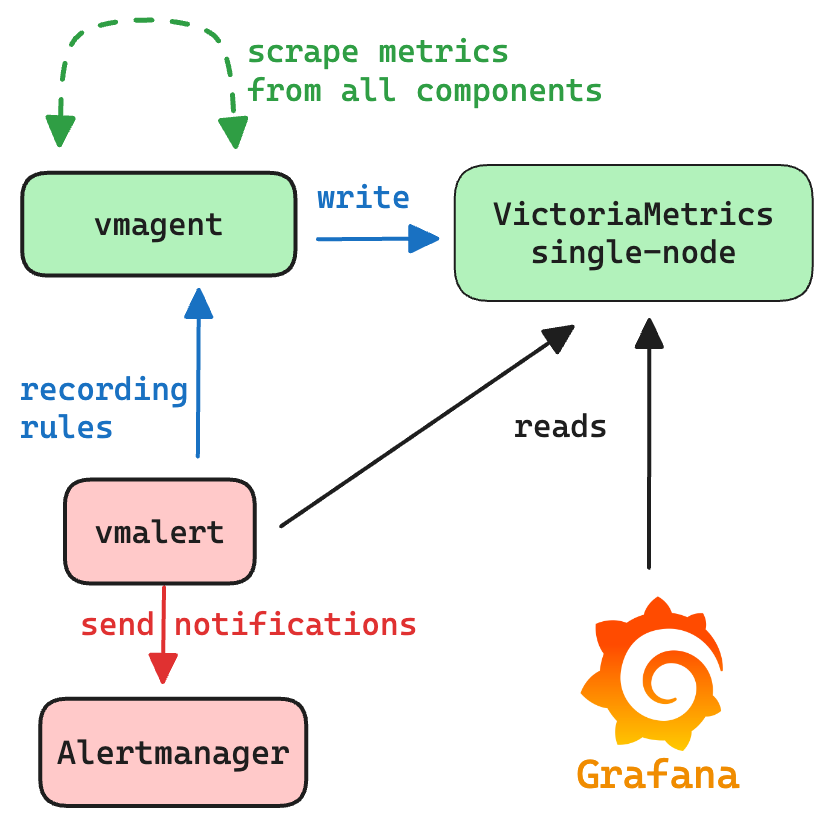

# Docker compose environment for VictoriaMetrics

Docker compose environment for VictoriaMetrics includes VictoriaMetrics components,
[Alertmanager](https://prometheus.io/docs/alerting/latest/alertmanager/) 
and [Grafana](https://grafana.com/).

For starting the docker-compose environment ensure that you have docker installed and running, and that you have access
to the Internet.
**All commands should be executed from the root directory of [the VictoriaMetrics repo](https://github.com/VictoriaMetrics/VictoriaMetrics).**

* Metrics:
  * [VictoriaMetrics single server](#victoriametrics-single-server)
  * [VictoriaMetrics cluster](#victoriametrics-cluster)
  * [vmagent](#vmagent)
* [Common](#common-components)
  * [vmauth](#vmauth)
  * [vmalert](#vmalert)
  * [alertmanager](#alertmanager)
  * [Grafana](#grafana)
* [Alerts](#alerts)
* [Troubleshooting](#troubleshooting)

## VictoriaMetrics single server

To spin-up environment with VictoriaMetrics single server run the following command:
```
make docker-vm-single-up
```
_See [compose-vm-single.yml](https://github.com/VictoriaMetrics/VictoriaMetrics/blob/master/deployment/docker/compose-vm-single.yml)_

VictoriaMetrics will be accessible on the following ports:
* `--graphiteListenAddr=:2003`
* `--opentsdbListenAddr=:4242`
* `--httpListenAddr=:8428`

The communication scheme between components is the following:
* [vmagent](#vmagent) sends scraped metrics to `VictoriaMetrics single-node`;
* [grafana](#grafana) is configured with datasource pointing to `VictoriaMetrics single-node`;
* [vmalert](#vmalert) is configured to query `VictoriaMetrics single-node`, and send alerts state
  and recording rules results back to `vmagent`;
* [alertmanager](#alertmanager) is configured to receive notifications from `vmalert`.

<picture>
  <source srcset="assets/vm-single-server-dark.png" media="(prefers-color-scheme: dark)">
  <source srcset="assets/vm-single-server-light.png" media="(prefers-color-scheme: light)">
  
</picture>

To access Grafana use link [http://localhost:3000](http://localhost:3000).

To access [vmui](https://docs.victoriametrics.com/victoriametrics/single-server-victoriametrics/#vmui)
use link [http://localhost:8428/vmui](http://localhost:8428/vmui).

To access `vmalert` use link [http://localhost:8428/vmalert](http://localhost:8428/vmalert/).

To shutdown environment run:
```
make docker-vm-single-down
```

See [troubleshooting](#troubleshooting) in case if issues.

## VictoriaMetrics cluster

To spin-up environment with VictoriaMetrics cluster run the following command:
```
make docker-vm-cluster-up
```
_See [compose-vm-cluster.yml](https://github.com/VictoriaMetrics/VictoriaMetrics/blob/master/deployment/docker/compose-vm-cluster.yml)_

VictoriaMetrics cluster environment consists of `vminsert`, `vmstorage` and `vmselect` components.
`vminsert` exposes port `:8480` for ingestion. Access to `vmselect` for reads goes through `vmauth` on port `:8427`,
and the rest of components are available only inside the environment.

The communication scheme between components is the following:
* [vmagent](#vmagent) sends scraped metrics to `vminsert`;
* `vminsert` shards and forwards data to `vmstorage`;
* `vmselect`s are connected to `vmstorage` for querying data;
* [vmauth](#vmauth) balances incoming read requests among `vmselect`s;
* [grafana](#grafana) is configured with datasource pointing to `vmauth`;
* [vmalert](#vmalert) is configured to query `vmselect`s via `vmauth` and send alerts state
  and recording rules to `vmagent`;
* [alertmanager](#alertmanager) is configured to receive notifications from `vmalert`.

<picture>
  <source srcset="assets/vm-cluster-dark.png" media="(prefers-color-scheme: dark)">
  <source srcset="assets/vm-cluster-light.png" media="(prefers-color-scheme: light)">
  
</picture>

To access Grafana use link [http://localhost:3000](http://localhost:3000).

To access [vmui](https://docs.victoriametrics.com/victoriametrics/single-server-victoriametrics/#vmui)
use link [http://localhost:8427/select/0/prometheus/vmui/](http://localhost:8427/select/0/prometheus/vmui/).

To access `vmalert` use link [http://localhost:8427/select/0/prometheus/vmalert/](http://localhost:8427/select/0/prometheus/vmalert/).

To shutdown environment execute the following command:
```
make docker-vm-cluster-down
```

See [troubleshooting](#troubleshooting) in case if issues.

## vmagent

vmagent is used for scraping and pushing time series to VictoriaMetrics instance. 
It accepts Prometheus-compatible configuration with listed targets for scraping:
* [scraping VictoriaMetrics single-node](https://github.com/VictoriaMetrics/VictoriaMetrics/blob/master/deployment/docker/prometheus-vm-single.yml) services;
* [scraping VictoriaMetrics cluster](https://github.com/VictoriaMetrics/VictoriaMetrics/blob/master/deployment/docker/prometheus-vm-cluster.yml) services;

Web interface link is [http://localhost:8429/](http://localhost:8429/).

# Common components

## vmauth

[vmauth](https://docs.victoriametrics.com/victoriametrics/vmauth/) acts as a [load balancer](https://docs.victoriametrics.com/victoriametrics/vmauth/#load-balancing)
to spread the load across `vmselect`'s or `vlselect`'s. [Grafana](#grafana) and [vmalert](#vmalert) use vmauth for read queries.
vmauth routes read queries to VictoriaMetrics depending on requested path.
vmauth config is available here for [VictoriaMetrics](https://github.com/VictoriaMetrics/VictoriaMetrics/blob/master/deployment/docker/auth-vm-cluster.yml).

## vmalert

vmalert evaluates various [alerting rules](https://github.com/VictoriaMetrics/VictoriaMetrics/blob/master/deployment/docker/rules).
It is connected with AlertManager for firing alerts, and with VictoriaMetrics for executing queries and storing alert's state.

Web interface link [http://localhost:8880/](http://localhost:8880/).

## alertmanager

AlertManager accepts notifications from `vmalert` and fires alerts.
All notifications are blackholed according to [alertmanager.yml](https://github.com/VictoriaMetrics/VictoriaMetrics/blob/master/deployment/docker/alertmanager.yml) config.

Web interface link [http://localhost:9093/](http://localhost:9093/).

## Grafana

Web interface link [http://localhost:3000](http://localhost:3000).

Default credentials:
* login: `admin`
* password: `admin`

Grafana is provisioned with default dashboards and datasources.

## Alerts

See below a list of recommended alerting rules for various VictoriaMetrics components for running in production.
Some alerting rules thresholds are just recommendations and could require an adjustment.
The list of alerting rules is the following:
* [alerts-health.yml](https://github.com/VictoriaMetrics/VictoriaMetrics/blob/master/deployment/docker/rules/alerts-health.yml):
  alerting rules related to all VictoriaMetrics components for tracking their "health" state;
* [alerts.yml](https://github.com/VictoriaMetrics/VictoriaMetrics/blob/master/deployment/docker/rules/alerts.yml):
  alerting rules related to [single-server VictoriaMetrics](https://docs.victoriametrics.com/victoriametrics/single-server-victoriametrics/) installation;
* [alerts-cluster.yml](https://github.com/VictoriaMetrics/VictoriaMetrics/blob/master/deployment/docker/rules/alerts-cluster.yml):
  alerting rules related to [cluster version of VictoriaMetrics](https://docs.victoriametrics.com/victoriametrics/cluster-victoriametrics/);
* [alerts-vmagent.yml](https://github.com/VictoriaMetrics/VictoriaMetrics/blob/master/deployment/docker/rules/alerts-vmagent.yml):
  alerting rules related to [vmagent](https://docs.victoriametrics.com/victoriametrics/vmagent/) component;
* [alerts-vmalert.yml](https://github.com/VictoriaMetrics/VictoriaMetrics/blob/master/deployment/docker/rules/alerts-vmalert.yml):
  alerting rules related to [vmalert](https://docs.victoriametrics.com/victoriametrics/vmalert/) component;
* [alerts-vmauth.yml](https://github.com/VictoriaMetrics/VictoriaMetrics/blob/master/deployment/docker/rules/alerts-vmauth.yml):
  alerting rules related to [vmauth](https://docs.victoriametrics.com/victoriametrics/vmauth/) component;
* [alerts-vmanomaly.yml](https://github.com/VictoriaMetrics/VictoriaMetrics/blob/master/deployment/docker/rules/alerts-vmanomaly.yml):
  alerting rules related to [VictoriaMetrics Anomaly Detection](https://docs.victoriametrics.com/anomaly-detection/);

Please, also see [how to monitor VictoriaMetrics installations](https://docs.victoriametrics.com/victoriametrics/single-server-victoriametrics/#monitoring).
## Troubleshooting

This environment has the following requirements:
* installed [docker compose](https://docs.docker.com/compose/);
* access to the Internet for downloading docker images;
* **All commands should be executed from the root directory of [the VictoriaMetrics repo](https://github.com/VictoriaMetrics/VictoriaMetrics).**

The expected output of running a command like `make docker-vm-single-up` is the following:
```sh
 make docker-vm-single-up                                                                                                           :(
docker compose -f deployment/docker/compose-vm-single.yml up -d
[+] Running 9/9
 ✔ Network docker_default              Created                                                                                                                                                                                     0.0s 
 ✔ Volume "docker_vmagentdata"         Created                                                                                                                                                                                     0.0s 
 ✔ Container docker-alertmanager-1     Started                                                                                                                                                                                     0.3s 
 ✔ Container docker-victoriametrics-1  Started                                                                                                                                                                                     0.3s 
...  
 ```

Containers are started in [--detach mode](https://docs.docker.com/reference/cli/docker/compose/up/), meaning they run in the background. 
As a result, you won't see their logs or exit status directly in the terminal.

If something isn’t working as expected, try the following troubleshooting steps:
1. Run from the correct directory. Make sure you're running the command from the root of the [VictoriaMetrics repository](https://github.com/VictoriaMetrics/VictoriaMetrics).
2. Check container status. Run `docker ps -a` to list all containers and their status. Healthy and running containers should have `STATUS` set to `Up`.
3. View container logs. To inspect logs for a specific container, get its container ID from step p2 and run: `docker logs -f <containerID>`.
4. Read the logs carefully and follow any suggested actions.
5. Check for port conflicts. Some containers (e.g., Grafana) expose HTTP ports. If a port (like `:3000`) is already in use, the container may fail to start. Stop the conflicting process or change the exposed port in the Docker Compose file.
6. Shut down the deployment. To tear down the environment, run: `make <environment>-down` (i.e. `make docker-vm-single-down`). 
   Note, this command also removes all attached volumes, so all the temporary created data will be removed too (i.e. Grafana dashboards or collected metrics).
