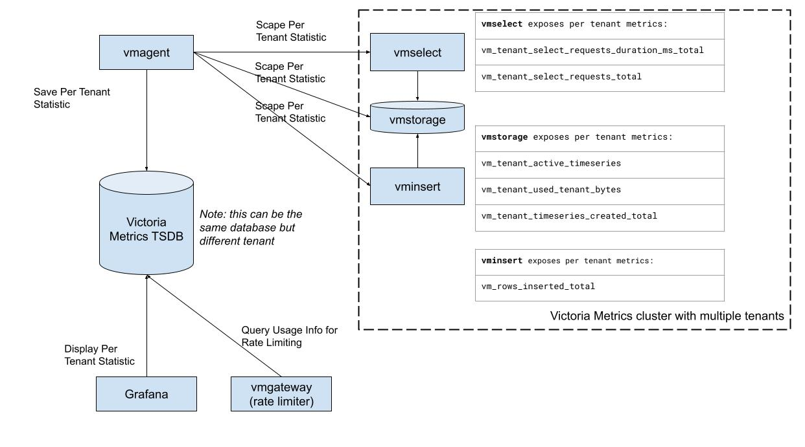

## Victoria Metrics Cluster Per Tenant Statistic



Enterprise version of Victoria Metrics Cluster exposes usage statistic for each tenant.

The next statistic is exposed:

- `vminsert`

    * `vm_tenant_inserted_rows_total` -  the ingestion rate by tenant
- `vmselect`

    * `vm_tenant_select_requests_duration_ms_total` -  query latency by tenant. It can be usefull for identifing tenant with the most heaviest queries
    * `vm_tenant_select_requests_total` - total requests. You can calculate request rate (qps) by using this metric

- `vmstorage`
    * `vm_tenant_active_timeseries`  - the number of active timeseries
    * `vm_tenant_used_tenant_bytes` - the disk spaces is consumed by metrics for particular tenant
    * `vm_tenant_timeseries_created_total` - the total number for timeseries by tenant


The information should be scrapped by the agent (`vmagent`, `victoriametrics`, prometheus, etc) and stored in TSDB. This can be the same cluster but a different tenant, but we encourage to use one more instance of TSDB (more lightweight, eg. VM single) for monitoring of monitoring.

the config example for statistic scrapping

```yaml
scrape_configs:
  - job_name: cluster
    scrape_interval: 10s
    static_configs:
    - targets: ['vmselect:8481','vmstorage:8482','vminsert:8480']
```

### Visualization

Visualisation of statistic can be done in grafana using this dashboard [link](https://github.com/VictoriaMetrics/VictoriaMetrics/tree/cluster/dashboards/clusterbytenant.json)


### Integration with vmgateway:

Per Tenant Statistic is the source data for `vmgateway` rate limiter. More information can be found [here](https://victoriametrics.github.io/vmgateway.html)

### Integration with vmalert:

You can generate alerts based on each tenant resource usage and notify the system/people about reaching the limits.

here is an example of alert by high churn rate by the tenant

```yaml

- alert: TooHighChurnRate
  expr: |
    (
    sum(rate(vm_tenant_timeseries_created_total[5m])) by(accountID,projectID)
    /
    sum(rate(vm_tenant_inserted_rows_total[5m])) by(accountID,projectID)
    ) > 0.1
  for: 15m
  labels:
    severity: warning
  annotations:
    summary: "Churn rate is more than 10% for the last 15m"
    description: "VM constantly creates new time series at tenant: {{ $labels.accountID }}:{{ $labels.projectID }}.\n
            This effect is known as Churn Rate.\n
            High Churn Rate tightly connected with database performance and may
            result in unexpected OOM's or slow queries."
```
