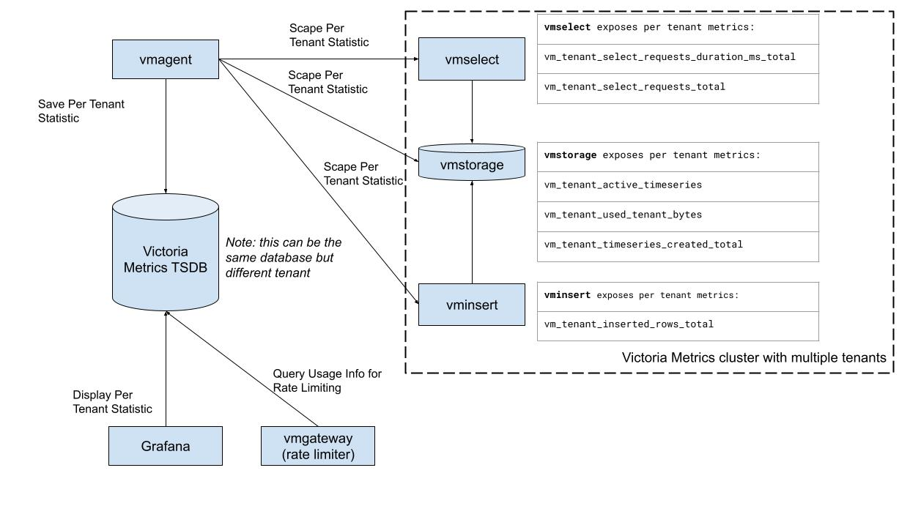

# VictoriaMetrics Cluster Per Tenant Statistic

***The per-tenant statistic is a part of [enterprise package](https://victoriametrics.com/products/enterprise/). It is available for download and evaluation at [releases page](https://github.com/VictoriaMetrics/VictoriaMetrics/releases)***



VictoriaMetrics cluster for enterprise provides various metrics and statistics usage per tenant:
- `vminsert`
    * `vm_tenant_inserted_rows_total` - total number of inserted rows. Find out which tenant
    puts the most of the pressure on the storage. 
    
- `vmselect`
    * `vm_tenant_select_requests_duration_ms_total` - query latency. 
    Helps to identify tenants with the heaviest queries.
    * `vm_tenant_select_requests_total` - total number of requests. 
    Discover which tenant sends the most of the queries and how it changes with time.

- `vmstorage`
    * `vm_tenant_active_timeseries` - number of active time series. 
    This metric correlates with memory usage, so can be used to find the most expensive 
    tenant in terms of memory. 
    * `vm_tenant_used_tenant_bytes` - disk space usage. Helps to track disk space usage
    per tenant.
    * `vm_tenant_timeseries_created_total` - number of new time series created. Helps to track
    the churn rate per tenant, or identify inefficient usage of the system.

Collect the metrics by any scrape agent you like (`vmagent`, `victoriametrics`, Prometheus, etc) and put into TSDB. 
It is ok to use existing cluster for storing such metrics, but make sure to use a different tenant for it to avoid collisions.
Or just run a separate TSDB (VM single, Promethes, etc.) to keep the data isolated from the main cluster. 

Example of the scraping configuration for statistic is the following: 

```yaml
scrape_configs:
  - job_name: cluster
    scrape_interval: 10s
    static_configs:
    - targets: ['vmselect:8481','vmstorage:8482','vminsert:8480']
```

## Visualization

Visualisation of statistics can be done in Grafana using the following 
[dashboard](https://github.com/VictoriaMetrics/VictoriaMetrics/tree/cluster/dashboards/clusterbytenant.json).


## Integration with vmgateway

`vmgateway` supports integration with Per Tenant Statistics data for rate limiting purposes. 
More information can be found [here](https://docs.victoriametrics.com/vmgateway.html)

## Integration with vmalert

You can generate alerts based on each tenant's resource usage and send notifications 
to prevent limits exhaustion.

Here is an alert example for high churn rate by the tenant:

```yaml

- alert: TooHighChurnRate
  expr: |
    (
    sum(rate(vm_tenant_timeseries_created_total[5m])) by(accountID,projectID)
    /
    sum(rate(vm_tenant_inserted_rows_total[5m])) by(accountID,projectID)
    ) > 0.1
  for: 15m
  labels:
    severity: warning
  annotations:
    summary: "Churn rate is more than 10% for the last 15m"
    description: "VM constantly creates new time series in the tenant: {{ $labels.accountID }}:{{ $labels.projectID }}.\n
            This effect is known as Churn Rate.\n
            High Churn Rate is tightly connected with database performance and may
            result in unexpected OOM's or slow queries."
```
