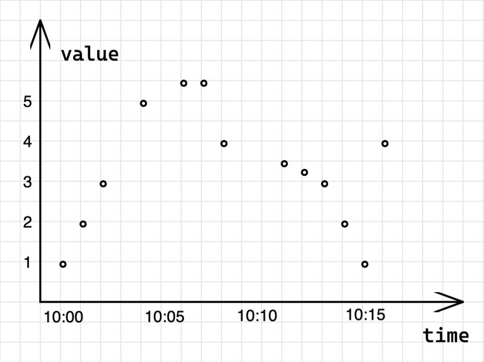
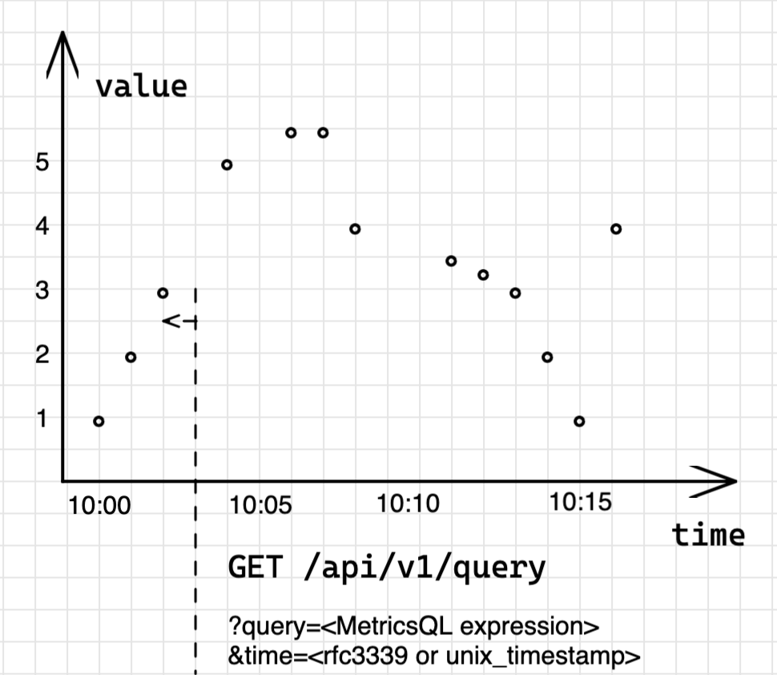

# Quick start

## How to install

VictoriaMetrics is distributed in two forms:
* [Single-server-VictoriaMetrics](https://docs.victoriametrics.com/Single-server-VictoriaMetrics.html) - all-in-one
  binary, which is very easy to use and maintain.
  Single-server-VictoriaMetrics perfectly scales vertically and easily handles millions of metrics/s;
* [VictoriaMetrics Cluster](https://docs.victoriametrics.com/Cluster-VictoriaMetrics.html) - set of components
  for building horizontally scalable clusters.

Single-server-VictoriaMetrics VictoriaMetrics is available as:

* [Managed VictoriaMetrics at AWS](https://aws.amazon.com/marketplace/pp/prodview-4tbfq5icmbmyc)
* [Docker images](https://hub.docker.com/r/victoriametrics/victoria-metrics/)
* [Snap packages](https://snapcraft.io/victoriametrics)
* [Helm Charts](https://github.com/VictoriaMetrics/helm-charts#list-of-charts)
* [Binary releases](https://github.com/VictoriaMetrics/VictoriaMetrics/releases)
* [Source code](https://github.com/VictoriaMetrics/VictoriaMetrics).
  See [How to build from sources](https://docs.victoriametrics.com/Single-server-VictoriaMetrics.html#how-to-build-from-sources)
* [VictoriaMetrics on Linode](https://www.linode.com/marketplace/apps/victoriametrics/victoriametrics/)
* [VictoriaMetrics on DigitalOcean](https://marketplace.digitalocean.com/apps/victoriametrics-single)

Just download VictoriaMetrics and follow
[these instructions](https://docs.victoriametrics.com/Single-server-VictoriaMetrics.html#how-to-start-victoriametrics).
Then read [Prometheus setup](https://docs.victoriametrics.com/Single-server-VictoriaMetrics.html#prometheus-setup)
and [Grafana setup](https://docs.victoriametrics.com/Single-server-VictoriaMetrics.html#grafana-setup) docs.


### Starting VM-Single via Docker

The following commands download the latest available
[Docker image of VictoriaMetrics](https://hub.docker.com/r/victoriametrics/victoria-metrics)
and start it at port 8428, while storing the ingested data at `victoria-metrics-data` subdirectory
under the current directory:

<div class="with-copy" markdown="1">

```bash
docker pull victoriametrics/victoria-metrics:latest
docker run -it --rm -v `pwd`/victoria-metrics-data:/victoria-metrics-data -p 8428:8428 victoriametrics/victoria-metrics:latest
```

</div>

Open <a href="http://localhost:8428">http://localhost:8428</a> in web browser
and read [these docs](https://docs.victoriametrics.com/#operation).

There is also [VictoriaMetrics cluster](https://docs.victoriametrics.com/Cluster-VictoriaMetrics.html)
- horizontally scalable installation, which scales to multiple nodes.

### Starting VM-Cluster via Docker

The following commands clone the latest available
[VictoriaMetrics cluster repository](https://github.com/VictoriaMetrics/VictoriaMetrics/tree/cluster)
and start the docker container via 'docker-compose'. Further customization is possible by editing
the [docker-compose.yaml](https://github.com/VictoriaMetrics/VictoriaMetrics/blob/cluster/deployment/docker/docker-compose.yml)
file.

<div class="with-copy" markdown="1">

```bash
git clone https://github.com/VictoriaMetrics/VictoriaMetrics --branch cluster && 
cd VictoriaMetrics/deployment/docker && 
docker-compose up
```

</div>

* [Cluster setup](https://docs.victoriametrics.com/Cluster-VictoriaMetrics.html#cluster-setup)


## Data model

### What is a metric

Simply put, `metric` - is a measure or observation of something. The measurement can be used to describe the process,
compare it to other processes, perform some calculations with it, or even define events to trigger on reaching
user-defined thresholds.

The most common use-cases for metrics are:
- check how the system behaves at the particular time period;
- correlate behavior changes to other measurements;
- observe or forecast trends;
- trigger events (alerts) if the metric exceeds a threshold.

Collecting and analyzing metrics provides advantages that are difficult to overestimate.

### Structure of a metric

Let's start with an example. To track how many requests our application serves,
we'll define a metric with the name `requests_total`.

You can be more specific here by saying `requests_success_total` (for only successful requests)
or `request_errors_total` (for requests which failed). Choosing a metric name is very important and supposed
to clarify what is actually measured to every person who reads it, just like variable names in programming.

Every metric can contain additional meta information in the form of label-value pairs:
```
requests_total{path="/", code="200"} 
requests_total{path="/", code="403"} 
```

The meta-information (set of `labels` in curly braces) gives us a context for which `path` and with what `code`
the `request` was served. Label-value pairs are always of a `string` type. VictoriaMetrics data model
is schemaless, which means there is no need to define metric names or their labels in advance.
User is free to add or change ingested metrics anytime.

Actually, the metric's name is also a label with a special name `__name__`. So the following two series are identical:
```
requests_total{path="/", code="200"} 
{__name__="requests_total", path="/", code="200"} 
```

A combination of a metric name and its labels defines a `time series`.
For example, `requests_total{path="/", code="200"}` and `requests_total{path="/", code="403"}`
are two different time series.

The number of all unique label combinations for one metric defines its `cardinality`.
For example, if `requests_total` has 3 unique `path` values and 5 unique `code` values,
then its cardinality will be `3*5=15` of unique time series. If you add one more
unique `path` value, cardinality will bump to `20`. See more in
[What is cardinality](https://docs.victoriametrics.com/FAQ.html#what-is-high-cardinality).

Every time series consists of `datapoints` (also called `samples`).
A `datapoint` is value-timestamp pair associated with the specific series:
```
requests_total{path="/", code="200"} <float64 value> <unixtimestamp>
```

In VictoriaMetrics data model, datapoint's value is of type `float64`.
And timestamp is unix time with milliseconds precision. Each series can contain an infinite number of datapoints.


### Types of metrics

Internally, VictoriaMetrics does not have a notion of a metric type. All metrics are the same.
The concept of a metric type exists specifically to help users to understand how the metric was measured.
There are 4 common metric types.

#### Counter

Counter metric type is a [monotonically increasing counter](https://en.wikipedia.org/wiki/Monotonic_function)
used for capturing a number of events.
It represents a cumulative metric whose value never goes down and always shows the current number of captured
events. In other words, `counter` always shows the number of observed events since the application has started.
In programming, `counter` is a variable that you **increment** each time something happens.




`vm_http_requests_total` is a typical example of a counter - a metric which only grows.
The interpretation of a graph above is that time series
`vm_http_requests_total{instance="localhost:8428", job="victoriametrics", path="api/v1/query_range"}`
was rapidly changing from 1:38 pm to 1:39 pm, then there were no changes until 1:41 pm.

Counter is used for measuring a number of events, like a number of requests, errors, logs, messages, etc.
The most common [MetricsQL](#metricsql) functions used with counters are:
* [rate](https://docs.victoriametrics.com/MetricsQL.html#rate) - calculates the speed of metric's change.
  For example, `rate(requests_total)` will show how many requests are served per second;
* [increase](https://docs.victoriametrics.com/MetricsQL.html#increase) - calculates the growth of a metric
  on the given time period. For example, `increase(requests_total[1h])` will show how many requests were
  served over `1h` interval.

#### Gauge

Gauge is used for measuring a value that can go up and down:




The metric `process_resident_memory_anon_bytes` on the graph shows the number of bytes of memory
used by the application during the runtime. It is changing frequently, going up and down showing how
the process allocates and frees the memory.
In programming, `gauge` is a variable to which you **set** a specific value as it changes.

Gauge is used for measuring temperature, memory usage, disk usage, etc. The most common [MetricsQL](#metricsql)
functions used with gauges are [aggregation and grouping functions](#aggregation-and-grouping-functions).

#### Histogram

Histogram is a set of [counter](#counter) metrics with different labels for tracking the dispersion
and [quantiles](https://prometheus.io/docs/practices/histograms/#quantiles) of the observed value.
For example, in VictoriaMetrics we track how many rows is processed per query
using the histogram with the name `vm_per_query_rows_processed_count`.
The exposition format for this histogram has the following form:
```
vm_per_query_rows_processed_count_bucket{vmrange="4.084e+02...4.642e+02"} 2
vm_per_query_rows_processed_count_bucket{vmrange="5.275e+02...5.995e+02"} 1
vm_per_query_rows_processed_count_bucket{vmrange="8.799e+02...1.000e+03"} 1
vm_per_query_rows_processed_count_bucket{vmrange="1.468e+03...1.668e+03"} 3
vm_per_query_rows_processed_count_bucket{vmrange="1.896e+03...2.154e+03"} 4
vm_per_query_rows_processed_count_sum 15582
vm_per_query_rows_processed_count_count 11
```

In practice, histogram `vm_per_query_rows_processed_count` may be used in the following way:
```Go
// define the histogram
perQueryRowsProcessed := metrics.NewHistogram(`vm_per_query_rows_processed_count`)

// use the histogram during processing
for _, query := range queries {
    perQueryRowsProcessed.Update(len(query.Rows))
}
```

Now let's see what happens each time when `perQueryRowsProcessed.Update` is called:
* counter `vm_per_query_rows_processed_count_sum` increments by value of `len(query.Rows)` expression
  and accounts for total sum of all observed values;
* counter `vm_per_query_rows_processed_count_count` increments by 1 and accounts for total number
  of observations;
* counter `vm_per_query_rows_processed_count_bucket` gets incremented only if observed value is within
  the range (`bucket`) defined in `vmrange`.

Such a combination of `counter` metrics allows plotting [Heatmaps in Grafana](https://grafana.com/docs/grafana/latest/visualizations/heatmap/)
and calculating [quantiles](https://prometheus.io/docs/practices/histograms/#quantiles):



Histograms are usually used for measuring latency, sizes of elements (batch size, for example) etc.
There are two implementations of a histogram supported by VictoriaMetrics:
1. [Prometheus histogram](https://prometheus.io/docs/practices/histograms/). The canonical histogram implementation
   supported by most of the [client libraries for metrics instrumentation](https://prometheus.io/docs/instrumenting/clientlibs/).
   Prometheus histogram requires a user to define ranges (`buckets`) statically.
2. [VictoriaMetrics histogram](https://valyala.medium.com/improving-histogram-usability-for-prometheus-and-grafana-bc7e5df0e350)
   supported by [VictoriaMetrics/metrics](https://github.com/VictoriaMetrics/metrics) instrumentation library. Victoriametrics
   histogram automatically adjusts buckets, so users don't need to think about them.

Histograms aren't trivial to learn and use. We recommend reading the following articles before you start:
1. [Prometheus histogram](https://prometheus.io/docs/concepts/metric_types/#histogram)
2. [Histograms and summaries](https://prometheus.io/docs/practices/histograms/)
3. [How does a Prometheus Histogram work?](https://www.robustperception.io/how-does-a-prometheus-histogram-work)
4. [Improving histogram usability for Prometheus and Grafana](https://valyala.medium.com/improving-histogram-usability-for-prometheus-and-grafana-bc7e5df0e350)


#### Summary

Summary is quite similar to [histogram](#histogram) and is used for
[quantiles](https://prometheus.io/docs/practices/histograms/#quantiles) calculations.
The main difference to histograms is that calculations are made on the client-side, so
metrics exposition format already contains pre-calculated quantiles:
```
go_gc_duration_seconds{quantile="0"} 0
go_gc_duration_seconds{quantile="0.25"} 0
go_gc_duration_seconds{quantile="0.5"} 0
go_gc_duration_seconds{quantile="0.75"} 8.0696e-05
go_gc_duration_seconds{quantile="1"} 0.001222168
go_gc_duration_seconds_sum 0.015077078
go_gc_duration_seconds_count 83
```

The visualisation of summaries is pretty straightforward:



Such an approach makes summaries easier to use but also puts significant limitations - summaries can't be aggregated.
The [histogram](#histogram) exposes the raw values via counters. It means a user can aggregate these counters
for different metrics (for example, for metrics with different `instance` label) and **then calculate quantiles**.
For summary, quantiles are already calculated, so they [can't be aggregated](https://latencytipoftheday.blogspot.de/2014/06/latencytipoftheday-you-cant-average.html)
with other metrics.

Summaries are usually used for measuring latency, sizes of elements (batch size, for example) etc.
But taking into account the limitation mentioned above.


#### Instrumenting application with metrics

As was said at the beginning of the section [Types of metrics](#types-of-metrics), metric type defines
how it was measured. VictoriaMetrics TSDB doesn't know about metric types, all it sees are labels,
values, and timestamps. And what are these metrics, what do they measure, and how - all this depends
on the application which emits them.

To instrument your application with metrics compatible with VictoriaMetrics TSDB we recommend
using [VictoriaMetrics/metrics](https://github.com/VictoriaMetrics/metrics) instrumentation library.
See more about how to use it on example of
[How to monitor Go applications with VictoriaMetrics](https://victoriametrics.medium.com/how-to-monitor-go-applications-with-victoriametrics-c04703110870)
article.

VictoriaMetrics is also compatible with
Prometheus [client libraries for metrics instrumentation](https://prometheus.io/docs/instrumenting/clientlibs/).


## Write data

There are two main models in monitoring for data collection: [push](#push-model) and [pull](#pull-model).
Both are used in modern monitoring and both are supported by VictoriaMetrics.

### Push model

Push model is a traditional model of the client sending data to the server:



The client (application) decides when and where to send/ingest its metrics.
VictoriaMetrics supports following protocols for ingesting:
* [Prometheus remote write API](https://docs.victoriametrics.com/Single-server-VictoriaMetrics.html#prometheus-setup).
* [Prometheus exposition format](https://docs.victoriametrics.com/Single-server-VictoriaMetrics.html#how-to-import-data-in-prometheus-exposition-format).
* [InfluxDB line protocol](https://docs.victoriametrics.com/Single-server-VictoriaMetrics.html#how-to-send-data-from-influxdb-compatible-agents-such-as-telegraf) over HTTP, TCP and UDP.
* [Graphite plaintext protocol](https://docs.victoriametrics.com/Single-server-VictoriaMetrics.html#how-to-send-data-from-graphite-compatible-agents-such-as-statsd) with [tags](https://graphite.readthedocs.io/en/latest/tags.html#carbon).
* [OpenTSDB put message](https://docs.victoriametrics.com/Single-server-VictoriaMetrics.html#sending-data-via-telnet-put-protocol).
* [HTTP OpenTSDB /api/put requests](https://docs.victoriametrics.com/Single-server-VictoriaMetrics.html#sending-opentsdb-data-via-http-apiput-requests).
* [JSON line format](https://docs.victoriametrics.com/Single-server-VictoriaMetrics.html#how-to-import-data-in-json-line-format).
* [Arbitrary CSV data](https://docs.victoriametrics.com/Single-server-VictoriaMetrics.html#how-to-import-csv-data).
* [Native binary format](https://docs.victoriametrics.com/Single-server-VictoriaMetrics.html#how-to-import-data-in-native-format).

All of the protocols are fully compatible with VictoriaMetrics [data model](#data-model) and can be used in production.
There are no officially supported clients by VictoriaMetrics team for data ingestion.
We recommend choosing from already existing clients compatible with the listed above protocols
(like [Telegraf](https://github.com/influxdata/telegraf) for [InfluxDB line protocol](https://docs.victoriametrics.com/Single-server-VictoriaMetrics.html#how-to-send-data-from-influxdb-compatible-agents-such-as-telegraf)).

Creating custom clients or instrumenting the application for metrics writing is as easy as sending a POST request:
```bash
curl -d '{"metric":{"__name__":"foo","job":"node_exporter"},"values":[0,1,2],"timestamps":[1549891472010,1549891487724,1549891503438]}' -X POST 'http://localhost:8428/api/v1/import'
```

It is allowed to push/write metrics to [Single-server-VictoriaMetrics](https://docs.victoriametrics.com/Single-server-VictoriaMetrics.html),
[cluster component vminsert](https://docs.victoriametrics.com/Cluster-VictoriaMetrics.html#architecture-overview)
and [vmagent](https://docs.victoriametrics.com/vmagent.html).

The pros of push model:

* application decides how and when to send data;
* with a batch size of which size, at which rate;
* with which retry logic;
* simpler security management, the only access needed for the application is the access to the TSDB.

See [Foiled by the Firewall: A Tale of Transition From Prometheus to VictoriaMetrics](https://www.percona.com/blog/2020/12/01/foiled-by-the-firewall-a-tale-of-transition-from-prometheus-to-victoriametrics/)
elaborating more on why Percona switched from pull to push model.

The cons of push protocol:

* it requires applications to be more complex,
  since they need to be responsible for metrics delivery;
* applications need to be aware of monitoring systems;
* using a monitoring system it is hard to tell whether the application
  went down or just stopped sending metrics for a different reason;
* applications can overload the monitoring system by pushing
  too many metrics.

### Pull model

Pull model is an approach popularized by [Prometheus](https://prometheus.io/),
where the monitoring system decides when and where to pull metrics from:



In pull model, the monitoring system needs to be aware of all the applications it needs
to monitor. The metrics are scraped (pulled) with fixed intervals via HTTP protocol.

For metrics scraping VictoriaMetrics supports [Prometheus exposition format](https://docs.victoriametrics.com/#how-to-scrape-prometheus-exporters-such-as-node-exporter)
and needs to be configured with `-promscrape.config` flag pointing to the file with scrape configuration.
This configuration may include list of static `targets` (applications or services)
or `targets` discovered via various service discoveries.

Metrics scraping is supported by [Single-server-VictoriaMetrics](https://docs.victoriametrics.com/Single-server-VictoriaMetrics.html),
[cluster component vmselect](https://docs.victoriametrics.com/Cluster-VictoriaMetrics.html#architecture-overview)
and [vmagent](https://docs.victoriametrics.com/vmagent.html).

The pros of the pull model:

* monitoring system decides how and when to scrape data,
  so it can't be overloaded;
* applications aren't aware of the monitoring system and don't need
  to implement the logic for delivering metrics;
* the list of all monitored targets belongs to the monitoring system
  and can be quickly checked;
* easy to detect faulty or crashed services when they don't respond.

The cons of the pull model:

* monitoring system needs access to applications it monitors;
* the frequency at which metrics are collected depends on the monitoring system.

### Common approaches for data collection

VictoriaMetrics supports both [Push](#push-model) and [Pull](#pull-model)
models for data collection. Many installations are using
exclusively one or second model, or both at once.

The most common approach for data collection is using both models:



In this approach the additional component is used - [vmagent](https://docs.victoriametrics.com/vmagent.html).
Vmagent is a lightweight agent whose main purpose is to collect and deliver metrics.
It supports all the same mentioned protocols and approaches mentioned for both data collection models.

The basic setup for using VictoriaMetrics and vmagent for monitoring is described
in example of [docker-compose manifest](https://github.com/VictoriaMetrics/VictoriaMetrics/tree/master/deployment/docker).
In this example, vmagent [scrapes a list of targets](https://github.com/VictoriaMetrics/VictoriaMetrics/blob/master/deployment/docker/prometheus.yml)
and [forwards collected data to VictoriaMetrics](https://github.com/VictoriaMetrics/VictoriaMetrics/blob/9d7da130b5a873be334b38c8d8dec702c9e8fac5/deployment/docker/docker-compose.yml#L15).
VictoriaMetrics is then used as a [datasource for Grafana](https://github.com/VictoriaMetrics/VictoriaMetrics/blob/master/deployment/docker/provisioning/datasources/datasource.yml)
installation for querying collected data.

VictoriaMetrics components allow building more advanced topologies.
For example, vmagents pushing metrics from separate datacenters to the central VictoriaMetrics:



VictoriaMetrics in example may be [Single-server-VictoriaMetrics](https://docs.victoriametrics.com/Single-server-VictoriaMetrics.html)
or [VictoriaMetrics Cluster](https://docs.victoriametrics.com/Cluster-VictoriaMetrics.html).
Vmagent also allows to fan-out the same data to multiple destinations.

## Query basics
VictoriaMetrics provides an [HTTP API](https://docs.victoriametrics.com/Single-server-VictoriaMetrics.html#prometheus-querying-api-usage)
for serving read queries. The API is used in various integrations such as
[Grafana](https://docs.victoriametrics.com/Single-server-VictoriaMetrics.html#grafana-setup).
The same API is also used by
[VMUI](https://docs.victoriametrics.com/Single-server-VictoriaMetrics.html#vmui) - graphical User Interface
for querying and visualizing metrics.

The API consists of two main handlers: [instant](#instant-query) and [range queries](#range-query).

### Instant query

Instant query executes the query expression at the given moment of time:
```
GET | POST /api/v1/query

Params:
query - MetricsQL expression, required
time - when (rfc3339 | unix_timestamp) to evaluate the query. If omitted, the current timestamp is used
step - max lookback window if no datapoints found at the given time. If omitted, is set to 5m
```

To understand how instant queries work, let's begin with a data sample:
```
foo_bar 1.00 1652169600000 # 2022-05-10 10:00:00
foo_bar 2.00 1652169660000 # 2022-05-10 10:01:00
foo_bar 3.00 1652169720000 # 2022-05-10 10:02:00
foo_bar 5.00 1652169840000 # 2022-05-10 10:04:00, one point missed
foo_bar 5.50 1652169960000 # 2022-05-10 10:06:00, one point missed
foo_bar 5.50 1652170020000 # 2022-05-10 10:07:00
foo_bar 4.00 1652170080000 # 2022-05-10 10:08:00
foo_bar 3.50 1652170260000 # 2022-05-10 10:11:00, two points missed
foo_bar 3.25 1652170320000 # 2022-05-10 10:12:00
foo_bar 3.00 1652170380000 # 2022-05-10 10:13:00
foo_bar 2.00 1652170440000 # 2022-05-10 10:14:00
foo_bar 1.00 1652170500000 # 2022-05-10 10:15:00
foo_bar 4.00 1652170560000 # 2022-05-10 10:16:00
```

The data sample contains a list of samples for one time series with time intervals between
samples from 1m to 3m. If we plot this data sample on the system of coordinates, it will have the following form:

<p style="text-align: center">
    <a href="Quick-Start_data_samples.png" target="_blank">
        
    </a>
</p>

To get the value of `foo_bar` metric at some specific moment of time, for example `2022-05-10 10:03:00`,
in VictoriaMetrics we need to issue an **instant query**:
```bash
curl "http://<victoria-metrics-addr>/api/v1/query?query=foo_bar&time=2022-05-10T10:03:00.000Z"
```
```json
{"status":"success","data":{"resultType":"vector","result":[{"metric":{"__name__":"foo_bar"},"value":[1652169780,"3"]}]}}
```

In response, VictoriaMetrics returns a single sample-timestamp pair with a value of `3` for the series
`foo_bar` at the given moment of time `2022-05-10 10:03`. But, if we take a look at the original data sample again,
we'll see that there is no data point at `2022-05-10 10:03`. What happens here is if there is no data point at the
requested timestamp, VictoriaMetrics will try to locate the closest sample on the left to the requested timestamp:

<p style="text-align: center">
    <a href="Quick-Start_instant_query.png" target="_blank">
        
    </a>
</p>


The time range at which VictoriaMetrics will try to locate a missing data sample is equal to `5m`
by default and can be overridden via `step` parameter.

Instant query can return multiple time series, but always only one data sample per series.
Instant queries are used in the following scenarios:
* Getting the last recorded value;
* For alerts and recording rules evaluation;
* Plotting Stat or Table panels in Grafana.


### Range query

Range query executes the query expression at the given time range with the given step:
```
GET | POST /api/v1/query_range

Params:
query - MetricsQL expression, required
start - beginning (rfc3339 | unix_timestamp) of the time rage, required
end - end (rfc3339 | unix_timestamp) of the time range. If omitted, current timestamp is used 
step - step in seconds for evaluating query expression on the time range. If omitted, is set to 5m
```

To get the values of `foo_bar` on time range from `2022-05-10 09:59:00` to `2022-05-10 10:17:00`,
in VictoriaMetrics we need to issue a range query:
```bash
curl "http://<victoria-metrics-addr>/api/v1/query_range?query=foo_bar&step=1m&start=2022-05-10T09:59:00.000Z&end=2022-05-10T10:17:00.000Z"
```
```json
{"status":"success","data":{"resultType":"matrix","result":[{"metric":{"__name__":"foo_bar"},"values":[[1652169600,"1"],[1652169660,"2"],[1652169720,"3"],[1652169780,"3"],[1652169840,"7"],[1652169900,"7"],[1652169960,"7.5"],[1652170020,"7.5"],[1652170080,"6"],[1652170140,"6"],[1652170260,"5.5"],[1652170320,"5.25"],[1652170380,"5"],[1652170440,"3"],[1652170500,"1"],[1652170560,"4"],[1652170620,"4"]]}]}}
```

In response, VictoriaMetrics returns `17` sample-timestamp pairs for the series `foo_bar` at the given time range
from  `2022-05-10 09:59:00` to `2022-05-10 10:17:00`. But, if we take a look at the original data sample again,
we'll see that it contains only 13 data points. What happens here is that the range query is actually
an [instant query](#instant-query) executed `(start-end)/step` times on the time range from `start` to `end`.
If we plot this request in VictoriaMetrics the graph will be shown as the following:

<p style="text-align: center">
    <a href="Quick-Start_range_query.png" target="_blank">
        
    </a>
</p>


The blue dotted lines on the pic are the moments when instant query was executed.
Since instant query retains the ability to locate the missing point, the graph contains two types of
points: `real` and `ephemeral` data points. `ephemeral` data point always repeats the left closest
`real` data point (see red arrow on the pic above).

This behavior of adding ephemeral data points comes from the specifics of the [Pull model](#pull-model):
* Metrics are scraped at fixed intervals;
* Scrape may be skipped if the monitoring system is overloaded;
* Scrape may fail due to network issues.

According to these specifics, the range query assumes that if there is a missing data point then it is likely
a missed scrape, so it fills it with the previous data point. The same will work for cases when `step` is
lower than the actual interval between samples. In fact, if we set `step=1s` for the same request, we'll get about
1 thousand data points in response, where most of them are `ephemeral`.

Sometimes, the lookbehind window for locating the datapoint isn't big enough and the graph will contain a gap.
For range queries, lookbehind window isn't equal to the `step` parameter. It is calculated as the median of the
intervals between the first 20 data points in the requested time range. In this way, VictoriaMetrics automatically
adjusts the lookbehind window to fill gaps and detect stale series at the same time.

Range queries are mostly used for plotting time series data over specified time ranges.
These queries are extremely useful in the following scenarios:
* Track the state of a metric on the time interval;
* Correlate changes between multiple metrics on the time interval;
* Observe trends and dynamics of the metric change.

### MetricsQL
VictoriaMetrics provide a special query language for executing read queries - [MetricsQL](https://docs.victoriametrics.com/MetricsQL.html).
MetricsQL is a [PromQL](https://prometheus.io/docs/prometheus/latest/querying/basics/)-like query language
with a powerful set of functions and features for working specifically with time series data.
MetricsQL is backwards-compatible with PromQL, so it shares most of the query concepts.
For example, the basics concepts of PromQL are described [here](https://valyala.medium.com/promql-tutorial-for-beginners-9ab455142085)
are applicable to MetricsQL as well.

#### Filtering

In sections [instant query](#instant-query) and [range query](#range-query) we've already used MetricsQL
to get data for metric `foo_bar`. It is as simple as just writing a metric name in the query:
```MetricsQL
foo_bar
```

A single metric name may correspond to multiple time series with distinct label sets. For example:
```MetricsQL
requests_total{path="/", code="200"} 
requests_total{path="/", code="403"} 
```

To select only time series with specific label value specify the matching condition in curly braces:
```MetricsQL
requests_total{code="200"} 
```

The query above will return all time series with the name `requests_total` and `code="200"`.
We use the operator `=` to match a label value. For negative match use `!=` operator.
Filters also support regex matching `=~` for positive and `!~` for negative matching:
```MetricsQL
requests_total{code=~"2.*"}
```

Filters can also be combined:
```MetricsQL
requests_total{code=~"200|204", path="/home"}
```
The query above will return all time series with a name `requests_total`,
status `code` `200` or `204` and `path="/home"`.

#### Filtering by name

Sometimes it is required to return all the time series for multiple metric names.
As was mentioned in the [data model section](#data-model), the metric name is just an ordinary label with
a special name — `__name__`. So filtering by multiple metric names may be performed by applying regexps
on metric names:
```MetricsQL
{__name__=~"requests_(error|success)_total"}
```
The query above is supposed to return series for two metrics: `requests_error_total` and `requests_success_total`.

#### Arithmetic operations
MetricsQL supports all the basic arithmetic operations:
* addition (+)
* subtraction (-)
* multiplication (*)
* division (/)
* modulo (%)
* power (^)

This allows performing various calculations. For example, the following query will calculate
the percentage of error requests:
```MetricsQL
(requests_error_total / (requests_error_total + requests_success_total)) * 100
```

#### Combining multiple series
Combining multiple time series with arithmetic operations requires an understanding of matching rules.
Otherwise, the query may break or may lead to incorrect results. The basics of the matching rules are simple:
* MetricsQL engine strips metric names from all the time series on the left and right side of the arithmetic
  operation without touching labels.
* For each time series on the left side MetricsQL engine searches for the corresponding time series on
  the right side with the same set of labels, applies the operation for each data point and returns the resulting
  time series with the same set of labels. If there are no matches, then the time series is dropped from the result.
* The matching rules may be augmented with ignoring, on, group_left and group_right modifiers.

This could be complex, but in the majority of cases isn’t needed.

#### Comparison operations

MetricsQL supports the following comparison operators:
* equal (==)
* not equal (!=)
* greater (>)
* greater-or-equal (>=)
* less (<)
* less-or-equal (<=)

These operators may be applied to arbitrary MetricsQL expressions as with arithmetic operators.
The result of the comparison operation is time series with only matching data points.
For instance, the following query would return series only for processes where memory usage is > 100MB:
```MetricsQL
process_resident_memory_bytes > 100*1024*1024
```

#### Aggregation and grouping functions

MetricsQL allows aggregating and grouping time series.
Time series are grouped by the given set of labels and then the given aggregation function is applied
for each group. For instance, the following query would return memory used by various processes grouped
by instances (for the case when multiple processes run on the same instance):
```MetricsQL
sum(process_resident_memory_bytes) by (instance)
```

#### Calculating rates

One of the most widely used functions for [counters](#counter) is [rate](https://docs.victoriametrics.com/MetricsQL.html#rate).
It calculates per-second rate for all the matching time series. For example, the following query will show
how many bytes are received by the network per second:
```MetricsQL
rate(node_network_receive_bytes_total)
```

To calculate the rate, the query engine will need at least two data points to compare.
Simplified rate calculation for each point looks like `(Vcurr-Vprev)/(Tcurr-Tprev)`,
where `Vcurr` is the value at the current point — `Tcurr`, `Vprev` is the value at the point `Tprev=Tcurr-step`.
The range between `Tcurr-Tprev` is usually equal to `step` parameter.
If `step` value is lower than the real interval between data points, then it is ignored and a minimum real interval is used.

The interval on which `rate` needs to be calculated can be specified explicitly as `duration` in square brackets:
```MetricsQL
 rate(node_network_receive_bytes_total[5m])
```
For this query the time duration to look back when calculating per-second rate for each point on the graph
will be equal to `5m`.

`rate` strips metric name while leaving all the labels for the inner time series.
Do not apply `rate` to time series which may go up and down, such as [gauges](#gauge).
`rate` must be applied only to [counters](#counter), which always go up.
Even if counter gets reset (for instance, on service restart), `rate` knows how to deal with it.

### Visualizing time series
VictoriaMetrics has a built-in graphical User Interface for querying and visualizing metrics
[VMUI](https://docs.victoriametrics.com/Single-server-VictoriaMetrics.html#vmui).
Open `http://victoriametrics:8428/vmui` page, type the query and see the results:




VictoriaMetrics supports [Prometheus HTTP API](https://prometheus.io/docs/prometheus/latest/querying/api/)
which makes it possible to [use with Grafana](https://docs.victoriametrics.com/Single-server-VictoriaMetrics.html#grafana-setup).
Play more with Grafana integration in VictoriaMetrics sandbox [https://play-grafana.victoriametrics.com](https://play-grafana.victoriametrics.com).

## Alerting

It is not possible to physically trace all changes on graphs all the time, that is why alerting exists.
In [vmalert](https://docs.victoriametrics.com/vmalert.html) it is possible to create a set of conditions
based on PromQL and MetricsQL queries that will send a notification when such conditions are met.

## Data migration

Migrating data from other TSDBs to VictoriaMetrics is as simple as importing data via any of
[supported formats](#push-model).

The migration might get easier when using [vmctl](https://docs.victoriametrics.com/vmctl.html) - VictoriaMetrics
command line tool. It supports the following databases for migration to VictoriaMetrics:
* [Prometheus using snapshot API](https://docs.victoriametrics.com/vmctl.html#migrating-data-from-prometheus);
* [Thanos](https://docs.victoriametrics.com/vmctl.html#migrating-data-from-thanos);
* [InfluxDB](https://docs.victoriametrics.com/vmctl.html#migrating-data-from-influxdb-1x);
* [OpenTSDB](https://docs.victoriametrics.com/vmctl.html#migrating-data-from-opentsdb);
* [Migrate data between VictoriaMetrics single and cluster versions](https://docs.victoriametrics.com/vmctl.html#migrating-data-from-victoriametrics).

## Productionisation

When going to production with VictoriaMetrics we recommend following the recommendations.

### Monitoring

Each VictoriaMetrics component emits its own metrics with various details regarding performance
and health state. Docs for the components also contain a `Monitoring` section with an explanation
of what and how should be monitored. For example,
[Single-server-VictoriaMetrics Monitoring](https://docs.victoriametrics.com/Cluster-VictoriaMetrics.html#monitoring).

VictoriaMetric team prepared a list of [Grafana dashboards](https://grafana.com/orgs/victoriametrics/dashboards)
for the main components. Each dashboard contains a lot of useful information and tips. It is recommended
to have these dashboards installed and up to date.

The list of alerts for [single](https://github.com/VictoriaMetrics/VictoriaMetrics/blob/master/deployment/docker/alerts.yml)
and [cluster](https://github.com/VictoriaMetrics/VictoriaMetrics/blob/cluster/deployment/docker/alerts.yml)
versions would also help to identify and notify about issues with the system.

The rule of the thumb is to have a separate installation of VictoriaMetrics or any other monitoring system
to monitor the production installation of VictoriaMetrics. This would make monitoring independent and
will help identify problems with the main monitoring installation.


### Capacity planning

See capacity planning sections in [docs](https://docs.victoriametrics.com) for
[Single-server-VictoriaMetrics](https://docs.victoriametrics.com/Single-server-VictoriaMetrics.html#capacity-planning).
and [VictoriaMetrics Cluster](https://docs.victoriametrics.com/Cluster-VictoriaMetrics.html#capacity-planning).

Capacity planning isn't possible without [monitoring](#monitoring), so consider configuring it first.
Understanding resource usage and performance of VictoriaMetrics also requires knowing the tech terms
[active series](https://docs.victoriametrics.com/FAQ.html#what-is-an-active-time-series),
[churn rate](https://docs.victoriametrics.com/FAQ.html#what-is-high-churn-rate),
[cardinality](https://docs.victoriametrics.com/FAQ.html#what-is-high-cardinality),
[slow inserts](https://docs.victoriametrics.com/FAQ.html#what-is-a-slow-insert).
All of them are present in [Grafana dashboards](https://grafana.com/orgs/victoriametrics/dashboards).


### Data safety

It is recommended to read [Replication and data safety](https://docs.victoriametrics.com/Cluster-VictoriaMetrics.html#replication-and-data-safety),
[Why replication doesn’t save from disaster?](https://valyala.medium.com/speeding-up-backups-for-big-time-series-databases-533c1a927883)
and [backups](https://docs.victoriametrics.com/Single-server-VictoriaMetrics.html#backups).


### Configuring limits

To avoid excessive resource usage or performance degradation limits must be in place:
* [Resource usage limits](https://docs.victoriametrics.com/FAQ.html#how-to-set-a-memory-limit-for-victoriametrics-components);
* [Cardinality limiter](https://docs.victoriametrics.com/Single-server-VictoriaMetrics.html#cardinality-limiter).