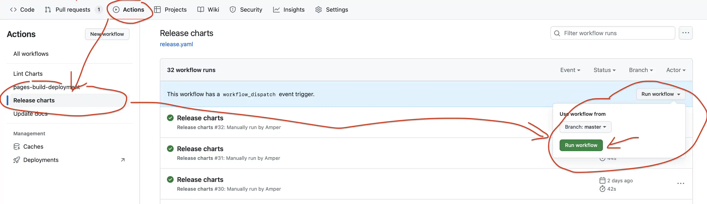

## Pre-reqs

1. Make sure you have enterprise remote configured
```
git remote add enterprise <url>
```
1. Make sure you have singing key configured
1. Make sure you have github token with at least `read:org, repo, write:packages` permissions exported under `GITHUB_TOKEN` env variable.
   You can create token [here](https://github.com/settings/tokens)
1. Make sure you're [authorized](https://hub.docker.com/orgs/victoriametrics/settings/enforce-sign-in/windows) for pushing docker images 

### For MacOS users

Make sure you have GNU version of utilities `zip`, `tar`, `sha256sum`. To install them run the following commands:
```sh
brew install coreutils
brew install gnu-tar
export PATH="/usr/local/opt/coreutils/libexec/gnubin:$PATH"
```

Docker may need additional configuration changes:
```sh 
docker buildx create --use --name=qemu
docker buildx inspect --bootstrap  
```

By default, docker on MacOS has limited amount of resources (CPU, mem) to use. 
Bumping the limits may significantly improve build speed.

## Release version and Docker images

1. Make sure all the changes are documented in [CHANGELOG.md](https://github.com/VictoriaMetrics/VictoriaMetrics/blob/master/docs/CHANGELOG.md).
   Ideally, every change must be documented in the commit with the change. Alternatively, the change must be documented immediately
   after the commit, which adds the change.
1. Run `make vmui-update` and `make vmui-logs-update` commands to re-build static files for `vmui`. See [commit example](https://github.com/VictoriaMetrics/VictoriaMetrics/commit/9dde5b8ee3fdc9d4cd495c8118e04ff4ee32e650). 
1. Make sure all the changes are synced between `master`, `cluster`, `enterprise-single-node` and `enterprise-cluster` branches.
   Changes in these branches must be synced immediately after they are committed in at least a single branch.
1. Make sure that the release branches have no security issues.
1. Update release versions if needed in [SECURITY.md](https://github.com/VictoriaMetrics/VictoriaMetrics/blob/master/SECURITY.md).
1. Add `(available starting from v1.xx.y)` line to feature docs introduced in the upcoming release.
1. Cut new version in [CHANGELOG.md](https://github.com/VictoriaMetrics/VictoriaMetrics/blob/master/docs/CHANGELOG.md)
   and make it merged. See example in this [commit](https://github.com/VictoriaMetrics/VictoriaMetrics/commit/b771152039d23b5ccd637a23ea748bc44a9511a7).
1. Cherry-pick bug fixes relevant for [LTS releases](https://docs.victoriametrics.com/lts-releases/).
1. Make sure you get all changes fetched `git fetch --all`.
1. Create the following release tags:
   * `git tag -s v1.xx.y` in `master` branch
   * `git tag -s v1.xx.y-cluster` in `cluster` branch
   * `git tag -s v1.xx.y-enterprise` in `enterprise-single-node` branch
   * `git tag -s v1.xx.y-enterprise-cluster` in `enterprise-cluster` branch
1. Run `TAG=v1.xx.y make publish-release`. This command performs the following tasks:
   a) Build and package binaries in `*.tar.gz` release archives with the corresponding `_checksums.txt` files inside `bin` directory.
      This step can be run manually with the command `make release` from the needed git tag.
   b) Build and publish [multi-platform Docker images](https://docs.docker.com/build/buildx/multiplatform-images/)
      for the given `TAG`, `TAG-cluster`, `TAG-enterprise` and `TAG-enterprise-cluster`.
      The multi-platform Docker image is built for the following platforms:
      * linux/amd64
      * linux/arm64
      * linux/arm
      * linux/ppc64le
      * linux/386
      This step can be run manually with the command `make publish` from the needed git tag.
1. Verify that created images are stable and don't introduce regressions on [test environment](https://github.com/VictoriaMetrics/VictoriaMetrics-enterprise/blob/master/Release-Guide.md#testing-releases).
1. Push the tags `v1.xx.y` and `v1.xx.y-cluster` created at previous steps to public GitHub repository at https://github.com/VictoriaMetrics/VictoriaMetrics.
   Push the tags `v1.xx.y`, `v1.xx.y-cluster`, `v1.xx.y-enterprise` and `v1.xx.y-enterprise-cluster` to the corresponding
   branches in private repository.
   **Important note:** do not push enterprise tags to public GitHub repository - they must be pushed only to private repository.
1. Run `TAG=v1.xx.y make github-create-release github-upload-assets`. This command performs the following tasks:
   a) Create draft GitHub release with the name `TAG`. This step can be run manually
      with the command `TAG=v1.xx.y make github-create-release`.
      The release id is stored at `/tmp/vm-github-release` file.
   b) Upload all the binaries and checksums created at step `9a` to that release.
      This step can be run manually with the command `make github-upload-assets`.
      It is expected that the needed release id is stored at `/tmp/vm-github-release` file,
      which must be created at the step `a`.
      If the upload process is interrupted by any reason, then the following recovery steps must be performed:
      - To delete the created draft release by running the command `make github-delete-release`.
        This command expects that the id of the release to delete is located at `/tmp/vm-github-release`
        file created at the step `a`.
      - To run the command `TAG=v1.xx.y make github-create-release github-upload-assets`, so new release is created
        and all the needed assets are re-uploaded to it.
1. Test new images on [sandbox](https://github.com/VictoriaMetrics/VictoriaMetrics-enterprise/blob/master/Release-Guide.md#testing-releases).
1. Go to <https://github.com/VictoriaMetrics/VictoriaMetrics/releases> and verify that draft release with the name `TAG` has been created
   and this release contains all the needed binaries and checksums.
1. Update the release description with the content of [CHANGELOG](https://github.com/VictoriaMetrics/VictoriaMetrics/blob/master/docs/CHANGELOG.md) for this release.
1. Publish release by pressing "Publish release" green button in GitHub's UI.
1. Update GitHub tickets related to the new release. Usually, such tickets have label [waiting for release](https://github.com/VictoriaMetrics/VictoriaMetrics/issues?q=is%3Aopen+is%3Aissue+label%3A%22waiting+for+release%22). Close such tickets by mentioning which release they were included into, and remove the label. See example [here](https://github.com/VictoriaMetrics/VictoriaMetrics/issues/6637#issuecomment-2390729511). 
1. Bump VictoriaMetrics version at `deployment/docker/docker-compose.yml` and at `deployment/docker/docker-compose-cluster.yml`.
1. Follow the instructions in [release follow-up](https://github.com/VictoriaMetrics/VictoriaMetrics-enterprise/blob/master/Release-Guide.md).

### Public Announcement

* Publish message in Slack  at <https://victoriametrics.slack.com>
* Post at Twitter at <https://twitter.com/MetricsVictoria>
* Post in Reddit at <https://www.reddit.com/r/VictoriaMetrics/>
* Post in LinkedIn at <https://www.linkedin.com/company/victoriametrics/>
* Publish message in Telegram at <https://t.me/VictoriaMetrics_en> and <https://t.me/VictoriaMetrics_ru1>

## Operator

The operator repository [https://github.com/VictoriaMetrics/operator/](https://github.com/VictoriaMetrics/operator/)

### Bump the version of images

- Bump `Version` field in [file `internal/config/config.go`](https://github.com/VictoriaMetrics/operator/blob/master/internal/config/config.go) with new release version for:
  - `vmalert` in `BaseOperatorConf.VMAlertDefault.Version`,
  - `vmagent` in `BaseOperatorConf.VMAgentDefault.Version`,
  - `vmsingle` in `BaseOperatorConf.VMSingleDefault.Version`,
  - `vmselect` in `BaseOperatorConf.VMClusterDefault.VMSelectDefault.Version`,
  - `vmstorage` in `BaseOperatorConf.VMClusterDefault.VMStorageDefault.Version`,
  - `vminsert` in `BaseOperatorConf.VMClusterDefault.VMInsertDefault.Version`,
  - `vmbackupmanager` in `BaseOperatorConf.VMBackup.Version` (should be enterprise version),
  - `vmauth` in `BaseOperatorConf.VMAuthDefault.Version`.
- Run `make operator-conf`.
- Rename "Next release" section in `docs/CHANGELOG.md` to the *new release version* and create new empty "Next release" section.
- Commit and push changes to `master`.
- Create and push a new tag with the *new release version*.
- Create github release from this tag with "Release notes" from `docs/CHANGELOG.md` for this version in description.

## Helm Charts

The helm chart repository [https://github.com/VictoriaMetrics/helm-charts/](https://github.com/VictoriaMetrics/helm-charts/)

### Bump the version of images

Bump `tag` field in `values.yaml` with new release version.
Bump `appVersion` field in `Chart.yaml` with new release version.
Add new line to "Next release" section in `CHANGELOG.md` about version update (the line must always start with "`-`"). Do **NOT** change headers in `CHANGELOG.md`.
Bump `version` field in `Chart.yaml` with incremental semver version (based on the `CHANGELOG.md` analysis). 

Do these updates to the following charts:

1. Update `vmagent` chart version in [`values.yaml`](https://github.com/VictoriaMetrics/helm-charts/blob/master/charts/victoria-metrics-agent/values.yaml) and [`Chart.yaml`](https://github.com/VictoriaMetrics/helm-charts/blob/master/charts/victoria-metrics-agent/Chart.yaml) 
1. Update `vmalert` chart version in [`values.yaml`](https://github.com/VictoriaMetrics/helm-charts/blob/master/charts/victoria-metrics-alert/values.yaml) and [`Chart.yaml`](https://github.com/VictoriaMetrics/helm-charts/blob/master/charts/victoria-metrics-alert/Chart.yaml)
1. Update `vmauth` chart version in [`values.yaml`](https://github.com/VictoriaMetrics/helm-charts/blob/master/charts/victoria-metrics-auth/values.yaml) and [`Chart.yaml`](https://github.com/VictoriaMetrics/helm-charts/blob/master/charts/victoria-metrics-auth/Chart.yaml)
1. Update `cluster` chart versions in [`values.yaml`](https://github.com/VictoriaMetrics/helm-charts/blob/master/charts/victoria-metrics-cluster/values.yaml), bump version for `vmselect`, `vminsert` and `vmstorage` and [`Chart.yaml`](https://github.com/VictoriaMetrics/helm-charts/blob/master/charts/victoria-metrics-cluster/Chart.yaml)
1. Update `k8s-stack` chart versions in [`values.yaml`](https://github.com/VictoriaMetrics/helm-charts/blob/master/charts/victoria-metrics-k8s-stack/values.yaml), bump version for `vmselect`, `vminsert`, `vmstorage`, `vmsingle`, `vmalert`, `vmagent` and [`Chart.yaml`](https://github.com/VictoriaMetrics/helm-charts/blob/master/charts/victoria-metrics-k8s-stack/Chart.yaml)
1. Update `single-node` chart version in [`values.yaml`](https://github.com/VictoriaMetrics/helm-charts/blob/master/charts/victoria-metrics-single/values.yaml) and [`Chart.yaml`](https://github.com/VictoriaMetrics/helm-charts/blob/master/charts/victoria-metrics-single/Chart.yaml)
1. Update `vmgateway` chart version in [`values.yaml`](https://github.com/VictoriaMetrics/helm-charts/blob/master/charts/victoria-metrics-gateway/values.yaml) and [`Chart.yaml`](https://github.com/VictoriaMetrics/helm-charts/blob/master/charts/victoria-metrics-gateway/Chart.yaml)

Once updated, run the following commands:

1. Commit and push changes to `master`.
1. Run "Release" action on Github:
   
1. Merge new PRs *"Automatic update CHANGELOGs and READMEs"* and *"Synchronize docs"* after pipelines are complete.

## Ansible Roles 

1. Update the version of VictoriaMetrics components at [https://github.com/VictoriaMetrics/ansible-playbooks](https://github.com/VictoriaMetrics/ansible-playbooks).
1. Commit changes.
1. Create a new tag with `git tag -sm <TAG> <TAG>`.
1. Push the changes with the new tag. This automatically publishes the new versions to galaxy.ansible.com.