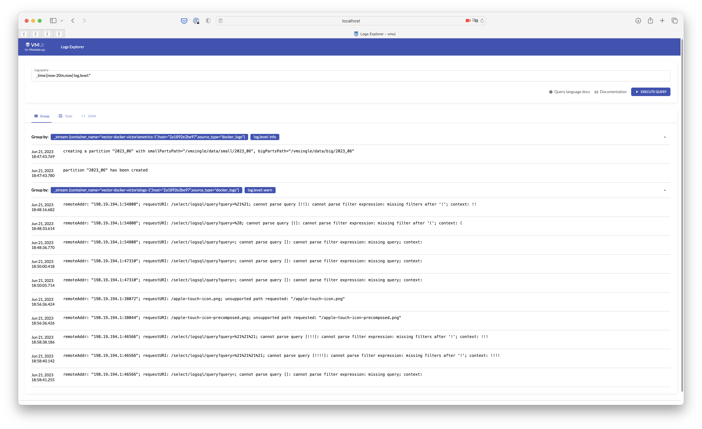

# VictoriaLogs Quick Start

It is recommended to read [README](https://docs.victoriametrics.com/VictoriaLogs/)
and [Key Concepts](https://docs.victoriametrics.com/VictoriaLogs/keyConcepts.html)
before you start working with VictoriaLogs.

## How to install and run VictoriaLogs

There are the following options exist:

- [To run Docker image](#docker-image)
- [To run in Kubernetes with helm-charts](#helm-charts)
- [To build VictoriaLogs from source code](#building-from-source-code)

### Docker image

You can run VictoriaLogs in a Docker container. It is the easiest way to start using VictoriaLogs.
Here is the command to run VictoriaLogs in a Docker container:

```bash
docker run --rm -it -p 9428:9428 -v ./victoria-logs-data:/victoria-logs-data \
  docker.io/victoriametrics/victoria-logs:heads-public-single-node-0-ga638f5e2b
```

### Helm charts

You can run VictoriaLogs in Kubernetes environment
with [helm-charts](https://github.com/VictoriaMetrics/helm-charts/blob/master/charts/victoria-logs-single/README.md).

### Building from source code

Follow the following steps in order to build VictoriaLogs from source code:

- Checkout VictoriaLogs source code. It is located in the VictoriaMetrics repository:

  ```bash
  git clone https://github.com/VictoriaMetrics/VictoriaMetrics
  cd VictoriaMetrics
  ```

- Build VictoriaLogs. The build command requires [Go 1.20](https://golang.org/doc/install).

  ```bash
  make victoria-logs
  ```

- Run the built binary:

  ```bash
  bin/victoria-logs
  ```

VictoriaLogs is ready for [data ingestion](https://docs.victoriametrics.com/VictoriaLogs/data-ingestion/)
and [querying](https://docs.victoriametrics.com/VictoriaLogs/querying/) at the TCP port `9428` now!
It has no any external dependencies, so it may run in various environments without additional setup and configuration.
VictoriaLogs automatically adapts to the available CPU and RAM resources. It also automatically setups and creates
the needed indexes during [data ingestion](https://docs.victoriametrics.com/VictoriaLogs/data-ingestion/).

## How to configure VictoriaLogs

It is possible to change the TCP port via `-httpListenAddr` command-line flag. For example, the following command
starts VictoriaLogs, which accepts incoming requests at port `9200` (aka ElasticSearch HTTP API port):

```bash
/path/to/victoria-logs -httpListenAddr=:9200
```

VictoriaLogs stores the ingested data to the `victoria-logs-data` directory by default. The directory can be changed
via `-storageDataPath` command-line flag. See [these docs](https://docs.victoriametrics.com/VictoriaLogs/#storage) for details.

By default VictoriaLogs stores [log entries](https://docs.victoriametrics.com/VictoriaLogs/keyConcepts.html) with timestamps
in the time range `[now-7d, now]`, while dropping logs outside the given time range.
E.g. it uses the retention of 7 days. Read [these docs](https://docs.victoriametrics.com/VictoriaLogs/#retention) on how to control the retention
for the [ingested](https://docs.victoriametrics.com/VictoriaLogs/data-ingestion/) logs.

It is recommended setting up monitoring of VictoriaLogs according to [these docs](https://docs.victoriametrics.com/VictoriaLogs/#monitoring).

## How to send logs to VictoriaLogs

You can setup data ingestion for VictoriaLogs via the following ways:

- Configure one of the [supported log collectors](https://docs.victoriametrics.com/VictoriaLogs/data-ingestion/#http-apis) to send logs to VictoriaLogs.
- Configure your own log collector to send logs to VictoriaLogs via [supported log ingestion protocols](https://docs.victoriametrics.com/VictoriaLogs/data-ingestion/#log-collectors-and-data-ingestion-formats).

Here are a demos for running popular supported log collectors in docker with VictoriaLogs:

- [**Filebeat (docker)**](https://github.com/VictoriaMetrics/VictoriaMetrics/tree/master/deployment/docker/victorialogs/filebeat-docker)
- [**Fluentbit (docker)**](https://github.com/VictoriaMetrics/VictoriaMetrics/tree/master/deployment/docker/victorialogs/fluentbit-docker)
- [**Logstash (docker)**](https://github.com/VictoriaMetrics/VictoriaMetrics/tree/master/deployment/docker/victorialogs/logstash)
- [**Vector (docker)**](https://github.com/VictoriaMetrics/VictoriaMetrics/tree/master/deployment/docker/victorialogs/vector-docker)

And you can use [helm chart](https://github.com/VictoriaMetrics/helm-charts/blob/master/charts/victoria-logs-single/README.md)
as demo for running fluentbit in kubernetes with VictoriaLogs:

- [Fluentbit (k8s)](https://github.com/VictoriaMetrics/helm-charts/blob/master/charts/victoria-logs-single/values.yaml)

## How to query logs in VictoriaLogs

You can query logs with [LogsQL](https://docs.victoriametrics.com/VictoriaLogs/LogsQL.html) using the following ways:

- [VMUI](https://docs.victoriametrics.com/VictoriaLogs/querying/#vmui) - a web-based UI for querying logs.
- [Command-line interface](https://docs.victoriametrics.com/VictoriaLogs/querying/#command-line-interface).



See more details in [these docs](https://docs.victoriametrics.com/VictoriaLogs/querying).
