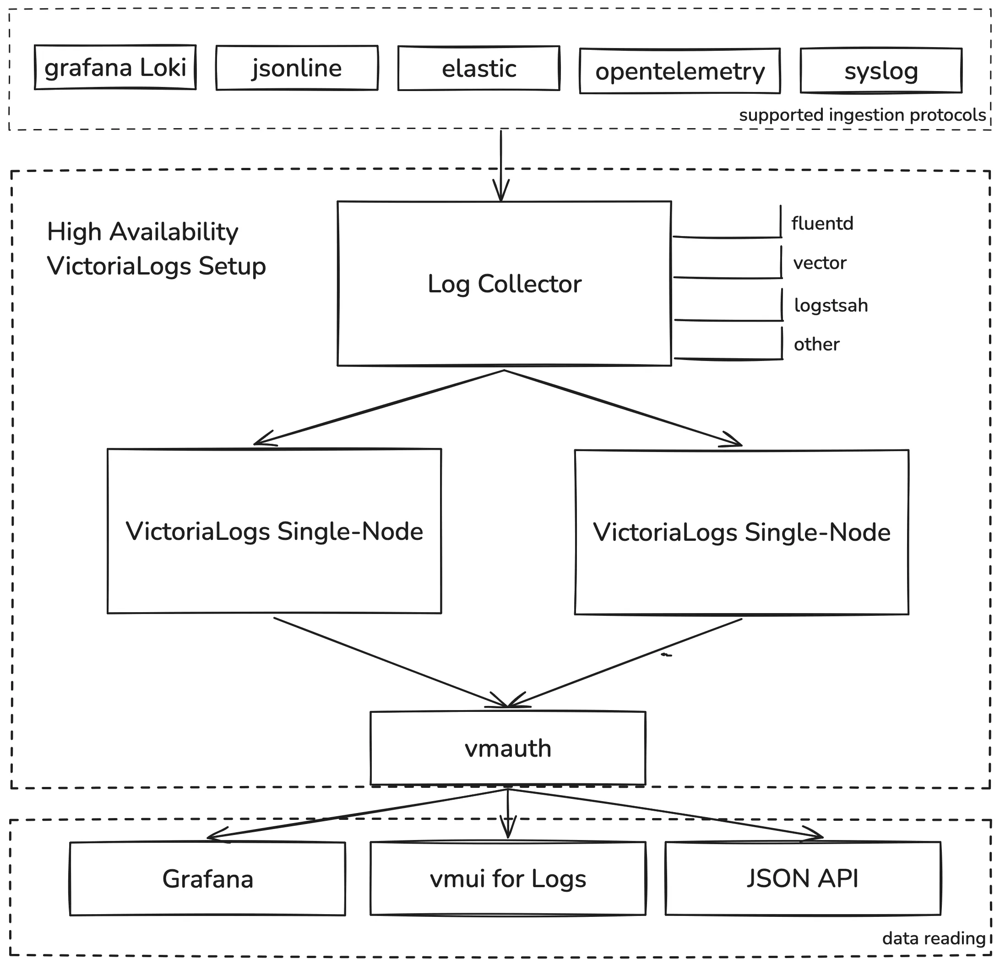

VictoriaLogs is [open source](https://github.com/VictoriaMetrics/VictoriaMetrics/tree/master/app/victoria-logs) user-friendly database for logs
from [VictoriaMetrics](https://github.com/VictoriaMetrics/VictoriaMetrics/).

VictoriaLogs provides the following features:

- It can accept logs from popular log collectors. See [these docs](https://docs.victoriametrics.com/victorialogs/data-ingestion/).
- It is much easier to set up and operate compared to Elasticsearch and Grafana Loki.
  See [these docs](https://docs.victoriametrics.com/victorialogs/quickstart/).
- It provides easy yet powerful query language with full-text search across
  all the [log fields](https://docs.victoriametrics.com/victorialogs/keyconcepts/#data-model).
  See [LogsQL docs](https://docs.victoriametrics.com/victorialogs/logsql/).
- It provides interactive command-line tool for querying VictoriaLogs - [vlogscli](https://docs.victoriametrics.com/victorialogs/querying/vlogscli/).
- It can be seamlessly combined with good old Unix tools for log analysis such as `grep`, `less`, `sort`, `jq`, etc.
  See [these docs](https://docs.victoriametrics.com/victorialogs/querying/#command-line) for details.
- VictoriaLogs' capacity and performance scales linearly with the available resources (CPU, RAM, disk IO, disk space).
  It runs smoothly on Raspberry PI and on servers with hundreds of CPU cores and terabytes of RAM.
- It can handle up to 30x bigger data volumes than Elasticsearch and Grafana Loki when running on the same hardware.
  See [these docs](#benchmarks).
- It provides fast full-text search out of the box for [log fields](https://docs.victoriametrics.com/victorialogs/keyconcepts/#data-model)
  with high cardinality (e.g. high number of unique values) such as `trace_id`, `user_id` and `ip`.
- It supports multitenancy - see [these docs](#multitenancy).
- It supports out-of-order logs' ingestion aka backfilling.
- It supports live tailing for newly ingested logs. See [these docs](https://docs.victoriametrics.com/victorialogs/querying/#live-tailing).
- It supports selecting surrounding logs in front and after the selected logs. See [these docs](https://docs.victoriametrics.com/victorialogs/logsql/#stream_context-pipe).
- It provides web UI for querying logs - see [these docs](https://docs.victoriametrics.com/victorialogs/querying/#web-ui).
- It provides [Grafana plugin for querying logs](https://docs.victoriametrics.com/victorialogs/victorialogs-datasource/).

If you have questions about VictoriaLogs, then read [this FAQ](https://docs.victoriametrics.com/victorialogs/faq/).
Also feel free asking any questions at [VictoriaMetrics community Slack chat](https://victoriametrics.slack.com/), 
you can join it via [Slack Inviter](https://slack.victoriametrics.com/).

See [Quick start docs](https://docs.victoriametrics.com/victorialogs/quickstart/) for start working with VictoriaLogs.

## Monitoring

VictoriaLogs exposes internal metrics in Prometheus exposition format at `http://localhost:9428/metrics` page.
It is recommended to set up monitoring of these metrics via VictoriaMetrics
(see [these docs](https://docs.victoriametrics.com/#how-to-scrape-prometheus-exporters-such-as-node-exporter)),
vmagent (see [these docs](https://docs.victoriametrics.com/vmagent/#how-to-collect-metrics-in-prometheus-format)) or via Prometheus.

VictoriaLogs emits its own logs to stdout. It is recommended to investigate these logs during troubleshooting.

## Upgrading

It is safe upgrading VictoriaLogs to new versions unless [release notes](https://docs.victoriametrics.com/victorialogs/changelog/) say otherwise.
It is safe to skip multiple versions during the upgrade unless [release notes](https://docs.victoriametrics.com/victorialogs/changelog/) say otherwise.
It is recommended to perform regular upgrades to the latest version, since it may contain important bug fixes, performance optimizations or new features.

It is also safe to downgrade to older versions unless [release notes](https://docs.victoriametrics.com/victorialogs/changelog/) say otherwise.

The following steps must be performed during the upgrade / downgrade procedure:

* Send `SIGINT` signal to VictoriaLogs process in order to gracefully stop it.
  See [how to send signals to processes](https://stackoverflow.com/questions/33239959/send-signal-to-process-from-command-line).
* Wait until the process stops. This can take a few seconds.
* Start the upgraded VictoriaLogs.

## Retention

By default VictoriaLogs stores log entries with timestamps in the time range `[now-7d, now]`, while dropping logs outside the given time range.
E.g. it uses the retention of 7 days. The retention can be configured with `-retentionPeriod` command-line flag.
This flag accepts values starting from `1d` (one day) up to `100y` (100 years). See [these docs](https://prometheus.io/docs/prometheus/latest/querying/basics/#time-durations)
for the supported duration formats.

For example, the following command starts VictoriaLogs with the retention of 8 weeks:

```sh
/path/to/victoria-logs -retentionPeriod=8w
```

See also [retention by disk space usage](#retention-by-disk-space-usage).

VictoriaLogs stores the [ingested](https://docs.victoriametrics.com/victorialogs/data-ingestion/) logs in per-day partition directories.
It automatically drops partition directories outside the configured retention.

VictoriaLogs automatically drops logs at [data ingestion](https://docs.victoriametrics.com/victorialogs/data-ingestion/) stage
if they have timestamps outside the configured retention. A sample of dropped logs is logged with `WARN` message in order to simplify troubleshooting.
The `vl_rows_dropped_total` [metric](#monitoring) is incremented each time an ingested log entry is dropped because of timestamp outside the retention.
It is recommended to set up the following alerting rule at [vmalert](https://docs.victoriametrics.com/vmalert/) in order to be notified
when logs with wrong timestamps are ingested into VictoriaLogs:

```metricsql
rate(vl_rows_dropped_total[5m]) > 0
```

By default, VictoriaLogs doesn't accept log entries with timestamps bigger than `now+2d`, e.g. 2 days in the future.
If you need accepting logs with bigger timestamps, then specify the desired "future retention" via `-futureRetention` command-line flag.
This flag accepts values starting from `1d`. See [these docs](https://prometheus.io/docs/prometheus/latest/querying/basics/#time-durations)
for the supported duration formats.

For example, the following command starts VictoriaLogs, which accepts logs with timestamps up to a year in the future:

```sh
/path/to/victoria-logs -futureRetention=1y
```

## Retention by disk space usage

VictoriaLogs can be configured to automatically drop older per-day partitions if the total size of data at [`-storageDataPath` directory](#storage)
becomes bigger than the given threshold at `-retention.maxDiskSpaceUsageBytes` command-line flag. For example, the following command starts VictoriaLogs,
which drops old per-day partitions if the total [storage](#storage) size becomes bigger than `100GiB`:

```sh
/path/to/victoria-logs -retention.maxDiskSpaceUsageBytes=100GiB
```

VictoriaLogs usually compresses logs by 10x or more times. This means that VictoriaLogs can store more than a terabyte of uncompressed
logs when it runs with `-retention.maxDiskSpaceUsageBytes=100GiB`.

VictoriaLogs keeps at least two last days of data in order to guarantee that the logs for the last day can be returned in queries.
This means that the total disk space usage may exceed the `-retention.maxDiskSpaceUsageBytes` if the size of the last two days of data
exceeds the `-retention.maxDiskSpaceUsageBytes`.

The [`-retentionPeriod`](#retention) is applied independently to the `-retention.maxDiskSpaceUsageBytes`. This means that
VictoriaLogs automatically drops logs older than 7 days by default if only `-retention.maxDiskSpaceUsageBytes` command-line flag is set.
Set the `-retentionPeriod` to some big value (e.g. `100y` - 100 years) if logs shouldn't be dropped because of some small `-retentionPeriod`.
For example:

```sh
/path/to/victoria-logs -retention.maxDiskSpaceUsageBytes=10TiB -retention=100y
```

## Storage

VictoriaLogs stores all its data in a single directory - `victoria-logs-data`. The path to the directory can be changed via `-storageDataPath` command-line flag.
For example, the following command starts VictoriaLogs, which stores the data at `/var/lib/victoria-logs`:

```sh
/path/to/victoria-logs -storageDataPath=/var/lib/victoria-logs
```

VictoriaLogs automatically creates the `-storageDataPath` directory on the first run if it is missing.

## High Availability

### High Availability (HA) Setup with VictoriaLogs Single-Node Instances

This schema outlines how to configure a High Availability (HA) setup using VictoriaLogs Single-Node instances. The setup consists of the following components:

- **Log Collector**: The log collector should support multiplexing incoming data to multiple outputs (destinations). Popular log collectors like [Fluent Bit](https://docs.fluentbit.io/manual/concepts/data-pipeline/router), [Logstash](https://www.elastic.co/guide/en/logstash/current/output-plugins.html), [Fluentd](https://docs.fluentd.org/output/copy), and [Vector](https://vector.dev/docs/setup/configuration/sinks/) already offer this capability. Refer to their documentation for configuration details.

- **VictoriaLogs Single-Node Instances**: Use two or more instances to achieve HA.

- **[vmauth](https://docs.victoriametrics.com/vmauth/#load-balancing) or Load Balancer**: Used for reading data from one of the replicas to ensure balanced and redundant access.



Here are the working example of HA configuration for VictoriaLogs using Docker Compose:

- [Fluent Bit + VictoriaLogs Single-Node + vmauth](https://github.com/VictoriaMetrics/VictoriaMetrics/tree/master/deployment/docker/victorialogs/fluentbit-ha-single-node)
- [Logstash + VictoriaLogs Single-Node + vmauth](https://github.com/VictoriaMetrics/VictoriaMetrics/tree/master/deployment/docker/victorialogs/logstash-ha-single-node)
- [Vector + VictoriaLogs Single-Node + vmauth](https://github.com/VictoriaMetrics/VictoriaMetrics/tree/master/deployment/docker/victorialogs/vector-ha-single-node)

## Backup and restore

VictoriaLogs currently does not have a snapshot feature and a tool like vmbackup as VictoriaMetrics does.
So backing up VictoriaLogs requires manually executing the `rsync` command.

The files in VictoriaLogs have the following properties:
- All the data files are immutable. Small metadata files can be modified.
- Old data files are periodically merged into new data files.

Therefore, for a complete data **backup**, you need to run the `rsync` command **twice**.

```sh
# example of rsync to remote host
rsync -avh --progress <path-to-victorialogs-data> <username>@<host>:<path-to-victorialogs-backup>
```

The first `rsync` will sync the majority of the data, which can be time-consuming.
As VictoriaLogs continues to run, new data is ingested, potentially creating new data files and modifying metadata files.

```sh
# example output
sending incremental file list
victoria-logs-data/
victoria-logs-data/flock.lock
              0 100%    0.00kB/s    0:00:00 (xfr#1, to-chk=78/80)
              
...

victoria-logs-data/partitions/20240809/indexdb/17E9ED7EF89BF422/metaindex.bin
             51 100%    5.53kB/s    0:00:00 (xfr#64, to-chk=0/80)

sent 12.19K bytes  received 1.30K bytes  3.86K bytes/sec
total size is 7.31K  speedup is 0.54
```

The second `rsync` **requires a brief shutdown of VictoriaLogs** to ensure all data and metadata files are consistent and no longer changing.
This `rsync` will cover any changes that have occurred since the last `rsync` and should not take a significant amount of time.

To **restore** from a backup, simply `rsync` the backup files from a remote location to the original directory during downtime.
VictoriaLogs will automatically load this data upon startup.

```sh
# example of rsync from remote backup to local
rsync -avh --progress <username>@<host>:<path-to-victorialogs-backup> <path-to-victorialogs-data>
```

It is also possible to use **the disk snapshot** in order to perform a backup. This feature could be provided by your operating system,
cloud provider, or third-party tools. Note that the snapshot must be **consistent** to ensure reliable backup.

## Multitenancy

VictoriaLogs supports multitenancy. A tenant is identified by `(AccountID, ProjectID)` pair, where `AccountID` and `ProjectID` are arbitrary 32-bit unsigned integers.
The `AccountID` and `ProjectID` fields can be set during [data ingestion](https://docs.victoriametrics.com/victorialogs/data-ingestion/)
and [querying](https://docs.victoriametrics.com/victorialogs/querying/) via `AccountID` and `ProjectID` request headers.

If `AccountID` and/or `ProjectID` request headers aren't set, then the default `0` value is used.

VictoriaLogs has very low overhead for per-tenant management, so it is OK to have thousands of tenants in a single VictoriaLogs instance.

VictoriaLogs doesn't perform per-tenant authorization. Use [vmauth](https://docs.victoriametrics.com/vmauth/) or similar tools for per-tenant authorization.

## Benchmarks

Here is a [benchmark suite](https://github.com/VictoriaMetrics/VictoriaMetrics/tree/master/deployment/logs-benchmark) for comparing data ingestion performance
and resource usage between VictoriaLogs and Elasticsearch or Loki.

It is recommended [setting up VictoriaLogs](https://docs.victoriametrics.com/victorialogs/quickstart/) in production alongside the existing
log management systems and comparing resource usage + query performance between VictoriaLogs and your system such as Elasticsearch or Grafana Loki.

Please share benchmark results and ideas on how to improve benchmarks / VictoriaLogs
via [VictoriaMetrics community channels](https://docs.victoriametrics.com/#community-and-contributions).

## List of command-line flags

Pass `-help` to VictoriaLogs in order to see the list of supported command-line flags with their description:

```
  -blockcache.missesBeforeCaching int
    	The number of cache misses before putting the block into cache. Higher values may reduce indexdb/dataBlocks cache size at the cost of higher CPU and disk read usage (default 2)
  -cacheExpireDuration duration
    	Items are removed from in-memory caches after they aren't accessed for this duration. Lower values may reduce memory usage at the cost of higher CPU usage. See also -prevCacheRemovalPercent (default 30m0s)
  -elasticsearch.version string
    	Elasticsearch version to report to client (default "8.9.0")
  -enableTCP6
    	Whether to enable IPv6 for listening and dialing. By default, only IPv4 TCP and UDP are used
  -envflag.enable
    	Whether to enable reading flags from environment variables in addition to the command line. Command line flag values have priority over values from environment vars. Flags are read only from the command line if this flag isn't set. See https://docs.victoriametrics.com/#environment-variables for more details
  -envflag.prefix string
    	Prefix for environment variables if -envflag.enable is set
  -filestream.disableFadvise
    	Whether to disable fadvise() syscall when reading large data files. The fadvise() syscall prevents from eviction of recently accessed data from OS page cache during background merges and backups. In some rare cases it is better to disable the syscall if it uses too much CPU
  -flagsAuthKey value
    	Auth key for /flags endpoint. It must be passed via authKey query arg. It overrides -httpAuth.*
    	Flag value can be read from the given file when using -flagsAuthKey=file:///abs/path/to/file or -flagsAuthKey=file://./relative/path/to/file . Flag value can be read from the given http/https url when using -flagsAuthKey=http://host/path or -flagsAuthKey=https://host/path
  -fs.disableMmap
    	Whether to use pread() instead of mmap() for reading data files. By default, mmap() is used for 64-bit arches and pread() is used for 32-bit arches, since they cannot read data files bigger than 2^32 bytes in memory. mmap() is usually faster for reading small data chunks than pread()
  -futureRetention value
    	Log entries with timestamps bigger than now+futureRetention are rejected during data ingestion; see https://docs.victoriametrics.com/victorialogs/#retention
    	The following optional suffixes are supported: s (second), m (minute), h (hour), d (day), w (week), y (year). If suffix isn't set, then the duration is counted in months (default 2d)
  -http.connTimeout duration
    	Incoming connections to -httpListenAddr are closed after the configured timeout. This may help evenly spreading load among a cluster of services behind TCP-level load balancer. Zero value disables closing of incoming connections (default 2m0s)
  -http.disableResponseCompression
    	Disable compression of HTTP responses to save CPU resources. By default, compression is enabled to save network bandwidth
  -http.header.csp string
    	Value for 'Content-Security-Policy' header, recommended: "default-src 'self'"
  -http.header.frameOptions string
    	Value for 'X-Frame-Options' header
  -http.header.hsts string
    	Value for 'Strict-Transport-Security' header, recommended: 'max-age=31536000; includeSubDomains'
  -http.idleConnTimeout duration
    	Timeout for incoming idle http connections (default 1m0s)
  -http.maxGracefulShutdownDuration duration
    	The maximum duration for a graceful shutdown of the HTTP server. A highly loaded server may require increased value for a graceful shutdown (default 7s)
  -http.pathPrefix string
    	An optional prefix to add to all the paths handled by http server. For example, if '-http.pathPrefix=/foo/bar' is set, then all the http requests will be handled on '/foo/bar/*' paths. This may be useful for proxied requests. See https://www.robustperception.io/using-external-urls-and-proxies-with-prometheus
  -http.shutdownDelay duration
    	Optional delay before http server shutdown. During this delay, the server returns non-OK responses from /health page, so load balancers can route new requests to other servers
  -httpAuth.password value
    	Password for HTTP server's Basic Auth. The authentication is disabled if -httpAuth.username is empty
    	Flag value can be read from the given file when using -httpAuth.password=file:///abs/path/to/file or -httpAuth.password=file://./relative/path/to/file . Flag value can be read from the given http/https url when using -httpAuth.password=http://host/path or -httpAuth.password=https://host/path
  -httpAuth.username string
    	Username for HTTP server's Basic Auth. The authentication is disabled if empty. See also -httpAuth.password
  -httpListenAddr array
    	TCP address to listen for incoming http requests. See also -httpListenAddr.useProxyProtocol
    	Supports an array of values separated by comma or specified via multiple flags.
    	Value can contain comma inside single-quoted or double-quoted string, {}, [] and () braces.
  -httpListenAddr.useProxyProtocol array
    	Whether to use proxy protocol for connections accepted at the given -httpListenAddr . See https://www.haproxy.org/download/1.8/doc/proxy-protocol.txt . With enabled proxy protocol http server cannot serve regular /metrics endpoint. Use -pushmetrics.url for metrics pushing
    	Supports array of values separated by comma or specified via multiple flags.
    	Empty values are set to false.
  -inmemoryDataFlushInterval duration
    	The interval for guaranteed saving of in-memory data to disk. The saved data survives unclean shutdowns such as OOM crash, hardware reset, SIGKILL, etc. Bigger intervals may help increase the lifetime of flash storage with limited write cycles (e.g. Raspberry PI). Smaller intervals increase disk IO load. Minimum supported value is 1s (default 5s)
  -insert.maxFieldsPerLine int
    	The maximum number of log fields per line, which can be read by /insert/* handlers (default 1000)
  -insert.maxLineSizeBytes size
    	The maximum size of a single line, which can be read by /insert/* handlers
    	Supports the following optional suffixes for size values: KB, MB, GB, TB, KiB, MiB, GiB, TiB (default 262144)
  -insert.maxQueueDuration duration
    	The maximum duration to wait in the queue when -maxConcurrentInserts concurrent insert requests are executed (default 1m0s)
  -internStringCacheExpireDuration duration
    	The expiry duration for caches for interned strings. See https://en.wikipedia.org/wiki/String_interning . See also -internStringMaxLen and -internStringDisableCache (default 6m0s)
  -internStringDisableCache
    	Whether to disable caches for interned strings. This may reduce memory usage at the cost of higher CPU usage. See https://en.wikipedia.org/wiki/String_interning . See also -internStringCacheExpireDuration and -internStringMaxLen
  -internStringMaxLen int
    	The maximum length for strings to intern. A lower limit may save memory at the cost of higher CPU usage. See https://en.wikipedia.org/wiki/String_interning . See also -internStringDisableCache and -internStringCacheExpireDuration (default 500)
  -logIngestedRows
    	Whether to log all the ingested log entries; this can be useful for debugging of data ingestion; see https://docs.victoriametrics.com/victorialogs/data-ingestion/ ; see also -logNewStreams
  -logNewStreams
    	Whether to log creation of new streams; this can be useful for debugging of high cardinality issues with log streams; see https://docs.victoriametrics.com/victorialogs/keyconcepts/#stream-fields ; see also -logIngestedRows
  -loggerDisableTimestamps
    	Whether to disable writing timestamps in logs
  -loggerErrorsPerSecondLimit int
    	Per-second limit on the number of ERROR messages. If more than the given number of errors are emitted per second, the remaining errors are suppressed. Zero values disable the rate limit
  -loggerFormat string
    	Format for logs. Possible values: default, json (default "default")
  -loggerJSONFields string
    	Allows renaming fields in JSON formatted logs. Example: "ts:timestamp,msg:message" renames "ts" to "timestamp" and "msg" to "message". Supported fields: ts, level, caller, msg
  -loggerLevel string
    	Minimum level of errors to log. Possible values: INFO, WARN, ERROR, FATAL, PANIC (default "INFO")
  -loggerMaxArgLen int
    	The maximum length of a single logged argument. Longer arguments are replaced with 'arg_start..arg_end', where 'arg_start' and 'arg_end' is prefix and suffix of the arg with the length not exceeding -loggerMaxArgLen / 2 (default 1000)
  -loggerOutput string
    	Output for the logs. Supported values: stderr, stdout (default "stderr")
  -loggerTimezone string
    	Timezone to use for timestamps in logs. Timezone must be a valid IANA Time Zone. For example: America/New_York, Europe/Berlin, Etc/GMT+3 or Local (default "UTC")
  -loggerWarnsPerSecondLimit int
    	Per-second limit on the number of WARN messages. If more than the given number of warns are emitted per second, then the remaining warns are suppressed. Zero values disable the rate limit
  -maxConcurrentInserts int
    	The maximum number of concurrent insert requests. Set higher value when clients send data over slow networks. Default value depends on the number of available CPU cores. It should work fine in most cases since it minimizes resource usage. See also -insert.maxQueueDuration (default 32)
  -memory.allowedBytes size
    	Allowed size of system memory VictoriaMetrics caches may occupy. This option overrides -memory.allowedPercent if set to a non-zero value. Too low a value may increase the cache miss rate usually resulting in higher CPU and disk IO usage. Too high a value may evict too much data from the OS page cache resulting in higher disk IO usage
    	Supports the following optional suffixes for size values: KB, MB, GB, TB, KiB, MiB, GiB, TiB (default 0)
  -memory.allowedPercent float
    	Allowed percent of system memory VictoriaMetrics caches may occupy. See also -memory.allowedBytes. Too low a value may increase cache miss rate usually resulting in higher CPU and disk IO usage. Too high a value may evict too much data from the OS page cache which will result in higher disk IO usage (default 60)
  -metrics.exposeMetadata
    	Whether to expose TYPE and HELP metadata at the /metrics page, which is exposed at -httpListenAddr . The metadata may be needed when the /metrics page is consumed by systems, which require this information. For example, Managed Prometheus in Google Cloud - https://cloud.google.com/stackdriver/docs/managed-prometheus/troubleshooting#missing-metric-type
  -metricsAuthKey value
    	Auth key for /metrics endpoint. It must be passed via authKey query arg. It overrides -httpAuth.*
    	Flag value can be read from the given file when using -metricsAuthKey=file:///abs/path/to/file or -metricsAuthKey=file://./relative/path/to/file . Flag value can be read from the given http/https url when using -metricsAuthKey=http://host/path or -metricsAuthKey=https://host/path
  -pprofAuthKey value
    	Auth key for /debug/pprof/* endpoints. It must be passed via authKey query arg. It overrides -httpAuth.*
    	Flag value can be read from the given file when using -pprofAuthKey=file:///abs/path/to/file or -pprofAuthKey=file://./relative/path/to/file . Flag value can be read from the given http/https url when using -pprofAuthKey=http://host/path or -pprofAuthKey=https://host/path
  -prevCacheRemovalPercent float
    	Items in the previous caches are removed when the percent of requests it serves becomes lower than this value. Higher values reduce memory usage at the cost of higher CPU usage. See also -cacheExpireDuration (default 0.1)
  -pushmetrics.disableCompression
    	Whether to disable request body compression when pushing metrics to every -pushmetrics.url
  -pushmetrics.extraLabel array
    	Optional labels to add to metrics pushed to every -pushmetrics.url . For example, -pushmetrics.extraLabel='instance="foo"' adds instance="foo" label to all the metrics pushed to every -pushmetrics.url
    	Supports an array of values separated by comma or specified via multiple flags.
    	Value can contain comma inside single-quoted or double-quoted string, {}, [] and () braces.
  -pushmetrics.header array
    	Optional HTTP request header to send to every -pushmetrics.url . For example, -pushmetrics.header='Authorization: Basic foobar' adds 'Authorization: Basic foobar' header to every request to every -pushmetrics.url
    	Supports an array of values separated by comma or specified via multiple flags.
    	Value can contain comma inside single-quoted or double-quoted string, {}, [] and () braces.
  -pushmetrics.interval duration
    	Interval for pushing metrics to every -pushmetrics.url (default 10s)
  -pushmetrics.url array
    	Optional URL to push metrics exposed at /metrics page. See https://docs.victoriametrics.com/#push-metrics . By default, metrics exposed at /metrics page aren't pushed to any remote storage
    	Supports an array of values separated by comma or specified via multiple flags.
    	Value can contain comma inside single-quoted or double-quoted string, {}, [] and () braces.
  -retention.maxDiskSpaceUsageBytes size
    	The maximum disk space usage at -storageDataPath before older per-day partitions are automatically dropped; see https://docs.victoriametrics.com/victorialogs/#retention-by-disk-space-usage ; see also -retentionPeriod
    	Supports the following optional suffixes for size values: KB, MB, GB, TB, KiB, MiB, GiB, TiB (default 0)
  -retentionPeriod value
    	Log entries with timestamps older than now-retentionPeriod are automatically deleted; log entries with timestamps outside the retention are also rejected during data ingestion; the minimum supported retention is 1d (one day); see https://docs.victoriametrics.com/victorialogs/#retention ; see also -retention.maxDiskSpaceUsageBytes
    	The following optional suffixes are supported: s (second), m (minute), h (hour), d (day), w (week), y (year). If suffix isn't set, then the duration is counted in months (default 7d)
  -search.maxConcurrentRequests int
    	The maximum number of concurrent search requests. It shouldn't be high, since a single request can saturate all the CPU cores, while many concurrently executed requests may require high amounts of memory. See also -search.maxQueueDuration (default 16)
  -search.maxQueryDuration duration
    	The maximum duration for query execution. It can be overridden on a per-query basis via 'timeout' query arg (default 30s)
  -search.maxQueueDuration duration
    	The maximum time the search request waits for execution when -search.maxConcurrentRequests limit is reached; see also -search.maxQueryDuration (default 10s)
  -storage.minFreeDiskSpaceBytes size
    	The minimum free disk space at -storageDataPath after which the storage stops accepting new data
    	Supports the following optional suffixes for size values: KB, MB, GB, TB, KiB, MiB, GiB, TiB (default 10000000)
  -storageDataPath string
    	Path to directory where to store VictoriaLogs data; see https://docs.victoriametrics.com/victorialogs/#storage (default "victoria-logs-data")
  -syslog.compressMethod.tcp array
    	Compression method for syslog messages received at the corresponding -syslog.listenAddr.tcp. Supported values: none, gzip, deflate. See https://docs.victoriametrics.com/victorialogs/data-ingestion/syslog/#compression
    	Supports an array of values separated by comma or specified via multiple flags.
    	Value can contain comma inside single-quoted or double-quoted string, {}, [] and () braces.
  -syslog.compressMethod.udp array
    	Compression method for syslog messages received at the corresponding -syslog.listenAddr.udp. Supported values: none, gzip, deflate. See https://docs.victoriametrics.com/victorialogs/data-ingestion/syslog/#compression
    	Supports an array of values separated by comma or specified via multiple flags.
    	Value can contain comma inside single-quoted or double-quoted string, {}, [] and () braces.
  -syslog.listenAddr.tcp array
    	Comma-separated list of TCP addresses to listen to for Syslog messages. See https://docs.victoriametrics.com/victorialogs/data-ingestion/syslog/
    	Supports an array of values separated by comma or specified via multiple flags.
    	Value can contain comma inside single-quoted or double-quoted string, {}, [] and () braces.
  -syslog.listenAddr.udp array
    	Comma-separated list of UDP address to listen to for Syslog messages. See https://docs.victoriametrics.com/victorialogs/data-ingestion/syslog/
    	Supports an array of values separated by comma or specified via multiple flags.
    	Value can contain comma inside single-quoted or double-quoted string, {}, [] and () braces.
  -syslog.tenantID.tcp array
    	TenantID for logs ingested via the corresponding -syslog.listenAddr.tcp. See https://docs.victoriametrics.com/victorialogs/data-ingestion/syslog/
    	Supports an array of values separated by comma or specified via multiple flags.
    	Value can contain comma inside single-quoted or double-quoted string, {}, [] and () braces.
  -syslog.tenantID.udp array
    	TenantID for logs ingested via the corresponding -syslog.listenAddr.udp. See https://docs.victoriametrics.com/victorialogs/data-ingestion/syslog/
    	Supports an array of values separated by comma or specified via multiple flags.
    	Value can contain comma inside single-quoted or double-quoted string, {}, [] and () braces.
  -syslog.timezone string
    	Timezone to use when parsing timestamps in RFC3164 syslog messages. Timezone must be a valid IANA Time Zone. For example: America/New_York, Europe/Berlin, Etc/GMT+3 . See https://docs.victoriametrics.com/victorialogs/data-ingestion/syslog/ (default "Local")
  -syslog.tls array
    	Whether to enable TLS for receiving syslog messages at the corresponding -syslog.listenAddr.tcp. The corresponding -syslog.tlsCertFile and -syslog.tlsKeyFile must be set if -syslog.tls is set. See https://docs.victoriametrics.com/victorialogs/data-ingestion/syslog/#security
    	Supports array of values separated by comma or specified via multiple flags.
    	Empty values are set to false.
  -syslog.tlsCertFile array
    	Path to file with TLS certificate for the corresponding -syslog.listenAddr.tcp if the corresponding -syslog.tls is set. Prefer ECDSA certs instead of RSA certs as RSA certs are slower. The provided certificate file is automatically re-read every second, so it can be dynamically updated. See https://docs.victoriametrics.com/victorialogs/data-ingestion/syslog/#security
    	Supports an array of values separated by comma or specified via multiple flags.
    	Value can contain comma inside single-quoted or double-quoted string, {}, [] and () braces.
  -syslog.tlsCipherSuites array
    	Optional list of TLS cipher suites for -syslog.listenAddr.tcp if -syslog.tls is set. See the list of supported cipher suites at https://pkg.go.dev/crypto/tls#pkg-constants . See also https://docs.victoriametrics.com/victorialogs/data-ingestion/syslog/#security
    	Supports an array of values separated by comma or specified via multiple flags.
    	Value can contain comma inside single-quoted or double-quoted string, {}, [] and () braces.
  -syslog.tlsKeyFile array
    	Path to file with TLS key for the corresponding -syslog.listenAddr.tcp if the corresponding -syslog.tls is set. The provided key file is automatically re-read every second, so it can be dynamically updated. See https://docs.victoriametrics.com/victorialogs/data-ingestion/syslog/#security
    	Supports an array of values separated by comma or specified via multiple flags.
    	Value can contain comma inside single-quoted or double-quoted string, {}, [] and () braces.
  -syslog.tlsMinVersion string
    	The minimum TLS version to use for -syslog.listenAddr.tcp if -syslog.tls is set. Supported values: TLS10, TLS11, TLS12, TLS13. See https://docs.victoriametrics.com/victorialogs/data-ingestion/syslog/#security (default "TLS13")
  -syslog.useLocalTimestamp.tcp array
    	Whether to use local timestamp instead of the original timestamp for the ingested syslog messages at the corresponding -syslog.listenAddr.tcp. See https://docs.victoriametrics.com/victorialogs/data-ingestion/syslog/#log-timestamps
    	Supports array of values separated by comma or specified via multiple flags.
    	Empty values are set to false.
  -syslog.useLocalTimestamp.udp array
    	Whether to use local timestamp instead of the original timestamp for the ingested syslog messages at the corresponding -syslog.listenAddr.udp. See https://docs.victoriametrics.com/victorialogs/data-ingestion/syslog/#log-timestamps
    	Supports array of values separated by comma or specified via multiple flags.
    	Empty values are set to false.
  -tls array
    	Whether to enable TLS for incoming HTTP requests at the given -httpListenAddr (aka https). -tlsCertFile and -tlsKeyFile must be set if -tls is set. See also -mtls
    	Supports array of values separated by comma or specified via multiple flags.
    	Empty values are set to false.
  -tlsCertFile array
    	Path to file with TLS certificate for the corresponding -httpListenAddr if -tls is set. Prefer ECDSA certs instead of RSA certs as RSA certs are slower. The provided certificate file is automatically re-read every second, so it can be dynamically updated. See also -tlsAutocertHosts
    	Supports an array of values separated by comma or specified via multiple flags.
    	Value can contain comma inside single-quoted or double-quoted string, {}, [] and () braces.
  -tlsCipherSuites array
    	Optional list of TLS cipher suites for incoming requests over HTTPS if -tls is set. See the list of supported cipher suites at https://pkg.go.dev/crypto/tls#pkg-constants
    	Supports an array of values separated by comma or specified via multiple flags.
    	Value can contain comma inside single-quoted or double-quoted string, {}, [] and () braces.
  -tlsKeyFile array
    	Path to file with TLS key for the corresponding -httpListenAddr if -tls is set. The provided key file is automatically re-read every second, so it can be dynamically updated. See also -tlsAutocertHosts
    	Supports an array of values separated by comma or specified via multiple flags.
    	Value can contain comma inside single-quoted or double-quoted string, {}, [] and () braces.
  -tlsMinVersion array
    	Optional minimum TLS version to use for the corresponding -httpListenAddr if -tls is set. Supported values: TLS10, TLS11, TLS12, TLS13
    	Supports an array of values separated by comma or specified via multiple flags.
    	Value can contain comma inside single-quoted or double-quoted string, {}, [] and () braces.
  -version
    	Show VictoriaMetrics version
```
