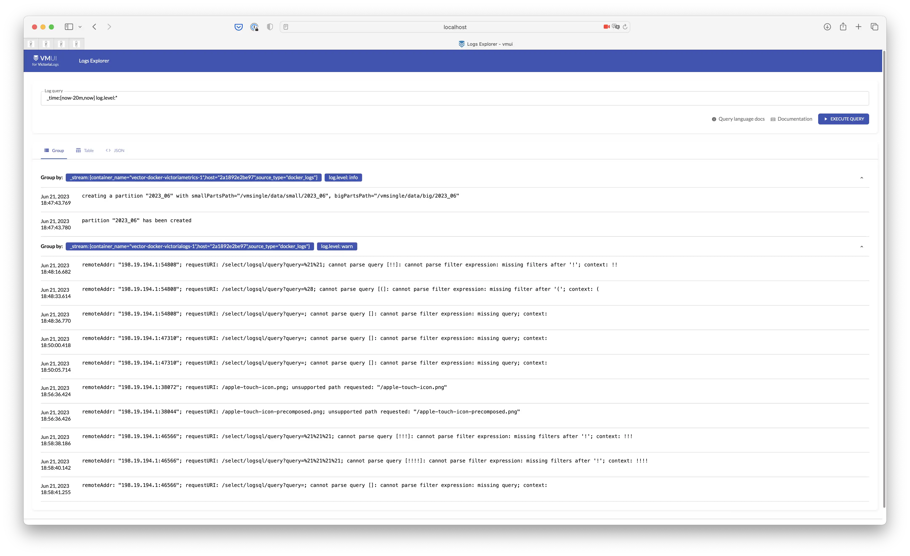

# Querying

[VictoriaLogs](https://docs.victoriametrics.com/VictoriaLogs/) can be queried with [LogsQL](https://docs.victoriametrics.com/VictoriaLogs/LogsQL.html)
via the following ways:

- [Web UI](#web-ui) - a web-based UI for querying logs
- [HTTP API](#http-api)
- [Command-line interface](#command-line)

## HTTP API

VictoriaLogs can be queried at the `/select/logsql/query` HTTP endpoint.
The [LogsQL](https://docs.victoriametrics.com/VictoriaLogs/LogsQL.html) query must be passed via `query` argument.
For example, the following query returns all the log entries with the `error` word:

```sh
curl http://localhost:9428/select/logsql/query -d 'query=error'
```

The response by default contains [`_msg`](https://docs.victoriametrics.com/VictoriaLogs/keyConcepts.html#message-field),
[`_stream`](https://docs.victoriametrics.com/VictoriaLogs/keyConcepts.html#stream-fields) and
[`_time`](https://docs.victoriametrics.com/VictoriaLogs/keyConcepts.html#time-field) fields plus the explicitly mentioned fields.
See [these docs](https://docs.victoriametrics.com/VictoriaLogs/LogsQL.html#querying-specific-fields) for details.

The `query` argument can be passed either in the request url itself (aka HTTP GET request) or via request body
with the `x-www-form-urlencoded` encoding (aka HTTP POST request). The HTTP POST is useful for sending long queries
when they do not fit the maximum url length of the used clients and proxies.

See [LogsQL docs](https://docs.victoriametrics.com/VictoriaLogs/LogsQL.html) for details on what can be passed to the `query` arg.
The `query` arg must be properly encoded with [percent encoding](https://en.wikipedia.org/wiki/URL_encoding) when passing it to `curl`
or similar tools.

The `/select/logsql/query` endpoint returns [a stream of JSON lines](http://ndjson.org/),
where each line contains JSON-encoded log entry in the form `{field1="value1",...,fieldN="valueN"}`.
Example response:

```
{"_msg":"error: disconnect from 19.54.37.22: Auth fail [preauth]","_stream":"{}","_time":"2023-01-01T13:32:13Z"}
{"_msg":"some other error","_stream":"{}","_time":"2023-01-01T13:32:15Z"}
```

The matching lines are sent to the response stream as soon as they are found in VictoriaLogs storage.
This means that the returned response may contain billions of lines for queries matching too many log entries.
The response can be interrupted at any time by closing the connection to VictoriaLogs server.
This allows post-processing the returned lines at the client side with the usual Unix commands such as `grep`, `jq`, `less`, `head`, etc.
See [these docs](#command-line) for more details.

The returned lines are sorted by [`_time` field](https://docs.victoriametrics.com/VictoriaLogs/keyConcepts.html#time-field)
if their total size doesn't exceed `-select.maxSortBufferSize` command-line flag value (by default it is set to one megabyte).
Otherwise the returned lines aren't sorted, since sorting disables the ability to send matching log entries to response stream as soon as they are found.
Query results can be sorted either at VictoriaLogs side according [to these docs](https://docs.victoriametrics.com/VictoriaLogs/LogsQL.html#sorting)
or at client side with the usual `sort` command according to [these docs](#command-line).

By default the `(AccountID=0, ProjectID=0)` [tenant](https://docs.victoriametrics.com/VictoriaLogs/#multitenancy) is queried.
If you need querying other tenant, then specify the needed tenant via http request headers. For example, the following query searches
for log messages at `(AccountID=12, ProjectID=34)` tenant:

```sh
curl http://localhost:9428/select/logsql/query -H 'AccountID: 12' -H 'ProjectID: 34' -d 'query=error'
```

The number of requests to `/select/logsql/query` can be [monitored](https://docs.victoriametrics.com/VictoriaLogs/#monitoring)
with `vl_http_requests_total{path="/select/logsql/query"}` metric.

## Web UI

VictoriaLogs provides a simple Web UI for logs [querying](https://docs.victoriametrics.com/VictoriaLogs/LogsQL.html) and exploration
at `http://localhost:9428/select/vmui`. The UI allows exploring query results:



There are three modes of displaying query results:

- `Group` - results are displayed as a table with rows grouped by stream and fields for filtering.
- `Table` - displays query results as a table.
- `JSON` - displays raw JSON response from [HTTP API](#http-api).

This is the first version that has minimal functionality. It comes with the following limitations:

- The number of query results is always limited to 1000 lines. Iteratively add
  more specific [filters](https://docs.victoriametrics.com/VictoriaLogs/LogsQL.html#filters) to the query
  in order to get full response with less than 1000 lines.
- Queries are always executed against [tenant](https://docs.victoriametrics.com/VictoriaLogs/#multitenancy) `0`.

These limitations will be removed in future versions.

To get around the current limitations, you can use an alternative - the [command line interface](#command-line).

## Command-line

VictoriaLogs integrates well with `curl` and other command-line tools during querying because of the following features:

- VictoriaLogs sends the matching log entries to the response stream as soon as they are found.
  This allows forwarding the response stream to arbitrary [Unix pipes](https://en.wikipedia.org/wiki/Pipeline_(Unix)).
- VictoriaLogs automatically adjusts query execution speed to the speed of the client, which reads the response stream.
  For example, if the response stream is piped to `less` command, then the query is suspended
  until the `less` command reads the next block from the response stream.
- VictoriaLogs automatically cancels query execution when the client closes the response stream.
  For example, if the query response is piped to `head` command, then VictoriaLogs stops executing the query
  when the `head` command closes the response stream.

These features allow executing queries at command-line interface, which potentially select billions of rows,
without the risk of high resource usage (CPU, RAM, disk IO) at VictoriaLogs server.

For example, the following query can return very big number of matching log entries (e.g. billions) if VictoriaLogs contains
many log messages with the `error` [word](https://docs.victoriametrics.com/VictoriaLogs/LogsQL.html#word):

```sh
curl http://localhost:9428/select/logsql/query -d 'query=error'
```

If the command returns "never-ending" response, then just press `ctrl+C` at any time in order to cancel the query.
VictoriaLogs notices that the response stream is closed, so it cancels the query and instantly stops consuming CPU, RAM and disk IO for this query.

Then just use `head` command for investigating the returned log messages and narrowing down the query:

```sh
curl http://localhost:9428/select/logsql/query -d 'query=error' | head -10
```

The `head -10` command reads only the first 10 log messages from the response and then closes the response stream.
This automatically cancels the query at VictoriaLogs side, so it stops consuming CPU, RAM and disk IO resources.

Sometimes it may be more convenient to use `less` command instead of `head` during the investigation of the returned response:

```sh
curl http://localhost:9428/select/logsql/query -d 'query=error' | less
```

The `less` command reads the response stream on demand, when the user scrolls down the output.
VictoriaLogs suspends query execution when `less` stops reading the response stream.
It doesn't consume CPU and disk IO resources during this time. It resumes query execution
when the `less` continues reading the response stream.

Suppose that the initial investigation of the returned query results helped determining that the needed log messages contain
`cannot open file` [phrase](https://docs.victoriametrics.com/VictoriaLogs/LogsQL.html#phrase-filter).
Then the query can be narrowed down to `error AND "cannot open file"`
(see [these docs](https://docs.victoriametrics.com/VictoriaLogs/LogsQL.html#logical-filter) about `AND` operator).
Then run the updated command in order to continue the investigation:

```sh
curl http://localhost:9428/select/logsql/query -d 'query=error AND "cannot open file"' | head
```

Note that the `query` arg must be properly encoded with [percent encoding](https://en.wikipedia.org/wiki/URL_encoding) when passing it to `curl`
or similar tools.

The `pipe the query to "head" or "less" -> investigate the results -> refine the query` iteration
can be repeated multiple times until the needed log messages are found.

The returned VictoriaLogs query response can be post-processed with any combination of Unix commands,
which are usually used for log analysis - `grep`, `jq`, `awk`, `sort`, `uniq`, `wc`, etc.

For example, the following command uses `wc -l` Unix command for counting the number of log messages
with the `error` [word](https://docs.victoriametrics.com/VictoriaLogs/LogsQL.html#word)
received from [streams](https://docs.victoriametrics.com/VictoriaLogs/keyConcepts.html#stream-fields) with `app="nginx"` field
during the last 5 minutes:

```sh
curl http://localhost:9428/select/logsql/query -d 'query=_stream:{app="nginx"} AND _time:5m AND error' | wc -l
```

See [these docs](https://docs.victoriametrics.com/VictoriaLogs/LogsQL.html#stream-filter) about `_stream` filter,
[these docs](https://docs.victoriametrics.com/VictoriaLogs/LogsQL.html#time-filter) about `_time` filter
and [these docs](https://docs.victoriametrics.com/VictoriaLogs/LogsQL.html#logical-filter) about `AND` operator.

The following example shows how to sort query results by the [`_time` field](https://docs.victoriametrics.com/VictoriaLogs/keyConcepts.html#time-field):

```sh
curl http://localhost:9428/select/logsql/query -d 'query=error' | jq -r '._time + " " + ._msg' | sort | less
```

This command uses `jq` for extracting [`_time`](https://docs.victoriametrics.com/VictoriaLogs/keyConcepts.html#time-field)
and [`_msg`](https://docs.victoriametrics.com/VictoriaLogs/keyConcepts.html#message-field) fields from the returned results,
and piping them to `sort` command.

Note that the `sort` command needs to read all the response stream before returning the sorted results. So the command above
can take non-trivial amounts of time if the `query` returns too many results. The solution is to narrow down the `query`
before sorting the results. See [these tips](https://docs.victoriametrics.com/VictoriaLogs/LogsQL.html#performance-tips)
on how to narrow down query results.

The following example calculates stats on the number of log messages received during the last 5 minutes
grouped by `log.level` [field](https://docs.victoriametrics.com/VictoriaLogs/keyConcepts.html#data-model):

```sh
curl http://localhost:9428/select/logsql/query -d 'query=_time:5m log.level:*' | jq -r '."log.level"' | sort | uniq -c 
```

The query selects all the log messages with non-empty `log.level` field via ["any value" filter](https://docs.victoriametrics.com/VictoriaLogs/LogsQL.html#any-value-filter),
then pipes them to `jq` command, which extracts the `log.level` field value from the returned JSON stream, then the extracted `log.level` values
are sorted with `sort` command and, finally, they are passed to `uniq -c` command for calculating the needed stats.

See also:

- [Key concepts](https://docs.victoriametrics.com/VictoriaLogs/keyConcepts.html).
- [LogsQL docs](https://docs.victoriametrics.com/VictoriaLogs/LogsQL.html).
