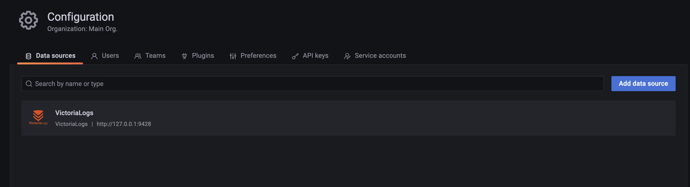

The VictoriaLogs datasource plugin allows you to query and visualize
[VictoriaLogs](https://docs.victoriametrics.com/victorialogs/) data in [Grafana](https://grafana.com).

* [Installation](#installation)
* [How to make new release](#how-to-make-new-release)
* [Notes](#notes)
* [License](#license)

## Installation

Installing VictoriaLogs datasource 
[requires](https://grafana.com/docs/grafana/latest/setup-grafana/configure-grafana/#allow_loading_unsigned_plugins) 
the following changes to Grafana's `grafana.ini` config:

``` ini
[plugins]
allow_loading_unsigned_plugins = victorialogs-datasource
```

If using `grafana-operator`, adjust `config` section in your `kind=Grafana` resource as below:

```
  config:
    plugins:
      allow_loading_unsigned_plugins: "victorialogs-datasource"
```

For detailed instructions on how to install the plugin in Grafana Cloud or locally,
please checkout the [Plugin installation docs](https://grafana.com/docs/grafana/latest/plugins/installation/).

### Grafana Provisioning

Provisioning of Grafana plugin requires creating [datasource config file](http://docs.grafana.org/administration/provisioning/#datasources):

```yaml
apiVersion: 1
datasources:
    # <string, required> Name of the VictoriaLogs datasource
    # displayed in Grafana panels and queries.
  - name: VictoriaLogs
    # <string, required> Sets the data source type.
    type: victorialogs-datasource
    # <string, required> Sets the access mode, either
    # proxy or direct (Server or Browser in the UI).
    access: proxy
    # <string> Sets URL for sending queries to VictoriaLogs server.
    # see https://docs.victoriametrics.com/victorialogs/querying/
    url: http://victorialogs:9428
    # <string> Sets the pre-selected datasource for new panels.
    # You can set only one default data source per organization.
    isDefault: true
```

Please find the example of provisioning Grafana instance with VictoriaLogs datasource below:

1. Create a file at `./provisioning/datasources/vm.yml` with datasource example file.

1. Define Grafana installation via docker-compose:

   ```yaml
    version: '3.0'
    services:
       grafana:
         image: grafana/grafana:11.0.0
         environment:
         - GF_INSTALL_PLUGINS=https://github.com/VictoriaMetrics/victorialogs-datasource/releases/download/v0.2.1/victorialogs-datasource-v0.2.1.zip;victorialogs-datasource
         - GF_PLUGINS_ALLOW_LOADING_UNSIGNED_PLUGINS=victorialogs-datasource
         ports:
         - 3000:3000/tcp
         volumes:
         - ./provisioning:/etc/grafana/provisioning
   ```

1. Run docker-compose file:

```
docker-compose -f docker-compose.yaml up
```

After Grafana starts successfully, datasource should be available in the datasources tab



### Install in Kubernetes

#### Grafana helm chart

Example with Grafana [helm chart](https://github.com/grafana/helm-charts/blob/main/charts/grafana/README.md):

Option 1. Using Grafana provisioning:

``` yaml
env:
  GF_INSTALL_PLUGINS: "https://github.com/VictoriaMetrics/victorialogs-datasource/releases/download/v0.2.1/victorialogs-datasource-v0.2.1.zip;victorialogs-datasource"
  GF_PLUGINS_ALLOW_LOADING_UNSIGNED_PLUGINS: "victorialogs-datasource"
```

Option 2. Using Grafana plugins section in `values.yaml`:

``` yaml
plugins:
  - https://github.com/VictoriaMetrics/victorialogs-datasource/releases/download/v0.2.1/victorialogs-datasource-v0.2.1.zip;victorialogs-datasource
```

Option 3. Using init container:

``` yaml
extraInitContainers:
  - name: "load-vm-ds-plugin"
    image: "curlimages/curl:7.85.0"
    command: [ "/bin/sh" ]
    workingDir: "/var/lib/grafana"
    securityContext:
      runAsUser: 472
      runAsNonRoot: true
      runAsGroup: 472
    args:
     - "-c"
     - |
       set -ex
       mkdir -p /var/lib/grafana/plugins/
       ver=$(curl -s -L https://api.github.com/repos/VictoriaMetrics/victorialogs-datasource/releases/latest | grep -oE 'v[0-9]+\.[0-9]+\.[0-9]+' | head -1)
       curl -L https://github.com/VictoriaMetrics/victorialogs-datasource/releases/download/$ver/victorialogs-datasource-$ver.tar.gz -o /var/lib/grafana/plugins/vl-plugin.tar.gz
       tar -xf /var/lib/grafana/plugins/vl-plugin.tar.gz -C /var/lib/grafana/plugins/
       rm /var/lib/grafana/plugins/vl-plugin.tar.gz
    volumeMounts:
      # For grafana-operator users, change `name: storage` to `name: grafana-data`
      - name: storage
        mountPath: /var/lib/grafana
```

For `grafana-operator` users, the above configuration should be done for the part `/spec/deployment/spec/template/spec/initContainers` of your `kind=Grafana` resource.

This example uses init container to download and install plugin. To allow Grafana using this container as a sidecar set the following config:

```yaml
sidecar:
  datasources:
    initDatasources: true
    enabled: true
```

See more about chart settings [here](https://github.com/grafana/helm-charts/blob/541d97051de87a309362e02d08741ffc868cfcd6/charts/grafana/values.yaml)

Option 4 would be to build custom Grafana image with plugin based on same installation instructions.

#### Grafana operator

Example with Grafana [operator](https://github.com/grafana-operator/grafana-operator):

```yaml
apiVersion: grafana.integreatly.org/v1beta1
kind: Grafana
metadata:
  name: grafana-vm
spec:
  persistentVolumeClaim:
    spec:
      accessModes:
        - ReadWriteOnce
      resources:
        requests:
          storage: 200Mi
  deployment:
    spec:
      template:
        spec:
          initContainers:
            - name: "load-vm-ds-plugin"
              image: "curlimages/curl:7.85.0"
              command: [ "/bin/sh" ]
              workingDir: "/var/lib/grafana"
              securityContext:
                runAsUser: 472 
                runAsNonRoot: true
                runAsGroup: 472 
              args:
                - "-c"
                - |
                  set -ex
                  mkdir -p /var/lib/grafana/plugins/
                  ver=$(curl -s https://api.github.com/repos/VictoriaMetrics/victorialogs-datasource/releases/latest | grep -oE 'v[0-9]+\.[0-9]+\.[0-9]+' | head -1)
                  curl -L https://github.com/VictoriaMetrics/victorialogs-datasource/releases/download/$ver/victorialogs-datasource-$ver.tar.gz -o /var/lib/grafana/plugins/vl-plugin.tar.gz
                  tar -xf /var/lib/grafana/plugins/vl-plugin.tar.gz -C /var/lib/grafana/plugins/
                  rm /var/lib/grafana/plugins/vl-plugin.tar.gz
              volumeMounts:
                - name: grafana-data
                  mountPath: /var/lib/grafana
  config:
    plugins:
      allow_loading_unsigned_plugins: victorialogs-datasource
```

See [Grafana operator reference](https://grafana-operator.github.io/grafana-operator/docs/grafana/) to find more about Grafana operator.
This example uses init container to download and install plugin.

### Dev release installation

1. To download plugin build and move contents into Grafana plugins directory:

   ``` bash
   ver=$(curl -s https://api.github.com/repos/VictoriaMetrics/victorialogs-datasource/releases/latest | grep -oE 'v[0-9]+\.[0-9]+\.[0-9]+' | head -1)
   curl -L https://github.com/VictoriaMetrics/victorialogs-datasource/releases/download/$ver/victorialogs-datasource-$ver.tar.gz -o /var/lib/grafana/plugins/vl-plugin.tar.gz
   tar -xf /var/lib/grafana/plugins/vl-plugin.tar.gz -C /var/lib/grafana/plugins/
   rm /var/lib/grafana/plugins/vl-plugin.tar.gz
   ```

1. Restart Grafana

## Getting started development

### 1. Configure Grafana

Installing dev version of Grafana plugin requires to change `grafana.ini` config to allow loading unsigned plugins:

``` ini
# Directory where Grafana will automatically scan and look for plugins
plugins = {{path to directory with plugin}}
```

``` ini
[plugins]
allow_loading_unsigned_plugins = victorialogs-datasource
```

### 2. Run the plugin

In the project directory, you can run:

```sh
# install dependencies
yarn install

# run the app in the development mode
yarn dev

# build the plugin for production to the `victorialogs-datasource` folder and zip build
yarn build:zip
```

### 3. How to build backend plugin

From the root folder of the project run the following command:

```
make victorialogs-backend-plugin-build
```

This command will build executable multi-platform files to the `victorialogs-datasource` folder for the following platforms:

* linux/amd64
* linux/arm64
* linux/arm
* linux/386
* amd64
* arm64
* windows

### 4.How to build frontend plugin

From the root folder of the project run the following command:

```
make victorialogs-frontend-plugin-build
```

This command will build all frontend app into `victorialogs-datasource` folder.

### 5. How to build frontend and backend parts of the plugin:

When frontend and backend parts of the plugin is required, run the following command from the root folder of the project:

```
make victorialogs-datasource-plugin-build
```

This command will build frontend part and backend part or the plugin and locate both parts into `victorialogs-datasource` folder.

## How to make new release

1. Make sure there are no open security issues.
1. Create a release tag:
   * `git tag -s v1.xx.y` in `master` branch
1. Run `TAG=v1.xx.y make build-release` to build and package binaries in `*.tar.gz` release archives.
1. Run `git push origin v1.xx.y` to push the tag created `v1.xx.y` at step 2 to public GitHub repository
1. Go to <https://github.com/VictoriaMetrics/victorialogs-datasource/releases> and verify that draft release with the name `TAG` has been created and this release contains all the needed binaries and checksums.
1. Remove the `draft` checkbox for the `TAG` release and manually publish it.

## Notes

In the `plugin.json` file of our plugin, the `metrics` field is set to `true`. This is not to support metric queries in the classical sense but to ensure our plugin can be selected in the Grafana panel editor.

For more information on the fields in `plugin.json`, please refer to the [Grafana documentation](https://grafana.com/developers/plugin-tools/reference-plugin-json#properties).

## License

This project is licensed under
the [Apache 2.0 license](https://github.com/VictoriaMetrics/victorialogs-datasource/blob/main/LICENSE).
