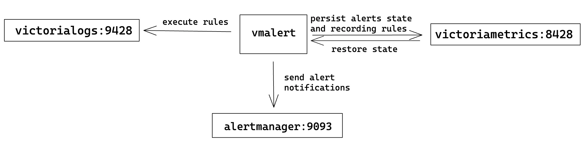

VictoriaLogs provides log stats APIs [`/select/logsql/stats_query`](https://docs.victoriametrics.com/victorialogs/querying/#querying-log-stats)  and [`/select/logsql/stats_query_range`](https://docs.victoriametrics.com/victorialogs/querying/#querying-log-range-stats), which return the log stats in the format compatible with [Prometheus querying API](https://prometheus.io/docs/prometheus/latest/querying/api/#instant-queries). This allows users using VictoriaLogs as the datasource of [vmalert](https://docs.victoriametrics.com/vmalert/) and creating alerting and recording rules using [LogsQL](https://docs.victoriametrics.com/victorialogs/logsql/).

Note: This page only provides integration instructions for vmalert with VictoriaLogs, see full textbook of vmalert [here](https://docs.victoriametrics.com/vmalert).

## Configuration

Run vmalert with the `-rule.defaultRuleType=vlogs` flag.
```
./bin/vmalert -rule=alert.rules \            # Path to the file with rules configuration.
    -datasource.url=http://localhost:9428 \  # VictoriaLogs address.
    -rule.defaultRuleType=vlogs \                 # Change default rule type to VictoriaLogs.
    -notifier.url=http://localhost:9093 \    # AlertManager URL (required if alerting rules are used)
    -remoteWrite.url=http://localhost:8428 \ # Remote write compatible storage to persist rules and alerts state info (required if recording rules are used)
    -remoteRead.url=http://localhost:8428 \  # Prometheus HTTP API compatible datasource to restore alerts state from

```


{width="500"}

For a complete list of command-line flags, visit https://docs.victoriametrics.com/vmalert/#configuration. The following flags are specifically related to the VictoriaLogs datasource:

```
-datasource.applyIntervalAsTimeFilter
  Only works for VictoriaLogs rules. Whether to apply the evaluation interval as a time filter for the rules. (default false)
-rule.defaultRuleType
  Default type for rule expressions, can be overridden by type parameter inside the rule group. Supported values: "graphite", "prometheus" and "vlogs". 
  Default is "prometheus", change it to "vlogs" if all of the rules are written with LogsQL.
-rule.evalDelay time
   Adjustment of the time parameter for rule evaluation requests to compensate intentional data delay from the datasource. Normally, should be equal to `-search.latencyOffset` (cm d-line flag configured for VictoriaMetrics single-node or vmselect).
   Since there is no intentional search delay in VictoriaLogs, `-rule.evalDelay` can be reduced to a few seconds to accommodate network and ingestion time.
```

### rule file

Check how to write the rule file [here](https://docs.victoriametrics.com/vmalert/#groups).

## Use cases

### Alerting rules

Examples:
```
groups:
  - name: ServiceLog
    interval: 5m
    rules:
      - alert: HasErrorLog
        expr: '_time: 5m AND env: "prod" AND status:~"error|warn" | stats by (service) count(*) as errorLog | filter errorLog:>0'
        annotations:
          description: "Service {{$labels.service}} generated {{$labels.errorLog}} error logs in the last 5 minutes"

  - name: ServiceRequest
    interval: 5m
    rules:
      - alert: TooManyFailedRequest
        expr: '*_time: 5m| extract "ip=<ip> " | extract "status_code=<code>;" | stats by (ip, code) count() if (code:!~200) as failed, count() as total| math failed / total as failed_percentage| filter failed_percentage :> 0.01 | fields ip,failed_percentage'
        annotations:
          description: "Connection from address {{$labels.ip}} has {{$value}} failed requests ratio in last 5 minutes"
```

### Recording rules

Examples:
```
groups:
  - name: RequestCount
    interval: 5m
    rules:
      - record: nginxRequestCount
        expr: '_time: 5m AND env: "test" AND service: "nginx" | stats count(*) as requests'
        annotations:
          description: "Service nginx on env test accepted {{$labels.requests}} requests in the last 5 minutes"
      - record: prodRequestCount
        expr: '_time: 5m AND env: "prod" | stats by (service) count(*) as requests'
        annotations:
          description: "Service {{$labels.service}} on env prod accepted {{$labels.requests}} requests in the last 5 minutes"
```

### Time filter

vmalert can automatically append the time filter `_time: <group_interval>` to the rule expression by enabling command-line flag `-datasource.applyIntervalAsTimeFilter=true`.
For instance:
```
./bin/vmalert -rule=alert.rules -datasource.applyIntervalAsTimeFilter=true ...
```

User now can omit the time filter in rule's expression. For example, below rule will be evaluated every 5 minutes, and count all the logs from the last 5 minutes.

```
groups:
    interval: 5m
    rules:
      - alert: TooManyFailedRequest
        expr: '* | extract "ip=<ip> " | extract "status_code=<code>;" | stats by (ip, code) count() if (code:!~200) as failed, count() as total| math failed / total as failed_percentage| filter failed_percentage :> 0.01 | fields ip,failed_percentage'
        annotations: "Connection from address {{$labels.ip}} has {{$$value}} failed requests ratio in last 5 minutes"
```

## Rules backfilling

vmalert supports alerting and recording rules backfilling (aka replay) against VictoriaLogs as the datasource.
In this mode, `-datasource.applyIntervalAsTimeFilter` is enabled. And rule expression can't contain any [time filter](https://docs.victoriametrics.com/victorialogs/logsql/#time-filter), since vmalert will automatically append the time filter `_time: <group_interval>`.  (might be changed in future)

```
./bin/vmalert -rule=path/to/your.rules \        # path to files with rules you usually use with vmalert
    -datasource.url=http://localhost:9428 \     # VictoriaLogs address.
    -rule.defaultRuleType=vlogs \                    # Change default rule type to VictoriaLogs.
    -remoteWrite.url=http://localhost:8428 \    # Remote write compatible storage to persist rules and alerts state info
    -replay.timeFrom=2021-05-11T07:21:43Z \     # to start replay from
    -replay.timeTo=2021-05-29T18:40:43Z         # to finish replay by, is optional
```

## Performance tip

LogsQL allows users to obtain multiple statistics from a single expression.
For instance, the following query calculates 50th, 90th and 99th percentiles for the `request_duration_seconds` field over logs for the last 5 minutes:

```
_time:5m | stats
  quantile(0.5, request_duration_seconds) p50,
  quantile(0.9, request_duration_seconds) p90,
  quantile(0.99, request_duration_seconds) p99
```

This expression can also be used in recording rules as follows:
```
groups:
  - name: requestDuration
    interval: 5m
    rules:
      - record: requestDurationQuantile
        expr: '_time:5m | stats by (service) quantile(0.5, request_duration_seconds) p50, quantile(0.9, request_duration_seconds) p90, quantile(0.99, request_duration_seconds) p99'
```
This creates three metrics for each service:
```
requestDurationQuantile{stats_result="p50", service="service-1"}
requestDurationQuantile{stats_result="p90", service="service-1"}
requestDurationQuantile{stats_result="p99", service="service-1"}

requestDurationQuantile{stats_result="p50", service="service-2"}
requestDurationQuantile{stats_result="p90", service="service-2"}
requestDurationQuantile{stats_result="p00", service="service-2"}
...
```

For additional tips on writing LogsQL, refer to this [doc](https://docs.victoriametrics.com/victorialogs/logsql/#performance-tips).

## Limitations

In [rules backfilling](#rules-backfilling) mode, the time filter in the rule expression must match the group evaluation interval.