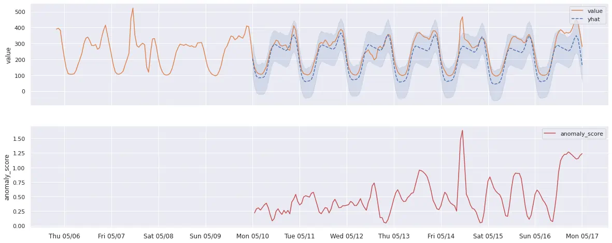

## What is VictoriaMetrics Anomaly Detection (vmanomaly)?
VictoriaMetrics Anomaly Detection, also known as `vmanomaly`, is a service for detecting unexpected changes in time series data. Utilizing machine learning models, it computes and pushes back an ["anomaly score"](https://docs.victoriametrics.com/anomaly-detection/components/models/#vmanomaly-output) for user-specified metrics. This hands-off approach to anomaly detection reduces the need for manual alert setup and can adapt to various metrics, improving your observability experience.

Please refer to [our QuickStart section](https://docs.victoriametrics.com/anomaly-detection/#practical-guides-and-installation) to find out more.

> **`vmanomaly` is a part of [enterprise package](https://docs.victoriametrics.com/victoriametrics/enterprise/). You need to get a [free trial license](https://victoriametrics.com/products/enterprise/trial/) for evaluation.**

## What is anomaly score?
Among the metrics produced by `vmanomaly` (as detailed in [vmanomaly output metrics](https://docs.victoriametrics.com/anomaly-detection/components/models/#vmanomaly-output)), `anomaly_score` is a pivotal one. It is **a continuous score > 0**, calculated in such a way that **scores ranging from 0.0 to 1.0 usually represent normal data**, while **scores exceeding 1.0 are typically classified as anomalous**. However, it's important to note that the threshold for anomaly detection can be customized in the alert configuration settings.

The decision to set the changepoint at `1.0` is made to ensure consistency across various models and alerting configurations, such that a score above `1.0` consistently signifies an anomaly, thus, alerting rules are maintained more easily.

> `anomaly_score` is a metric itself, which preserves all labels found in input data and (optionally) appends [custom labels, specified in writer](https://docs.victoriametrics.com/anomaly-detection/components/writer/#metrics-formatting) - follow the link for detailed output example.

## How is anomaly score calculated?
For most of the [univariate models](https://docs.victoriametrics.com/anomaly-detection/components/models/#univariate-models) that can generate `yhat`, `yhat_lower`, and `yhat_upper` time series in [their output](https://docs.victoriametrics.com/anomaly-detection/components/models/#vmanomaly-output) (such as [Prophet](https://docs.victoriametrics.com/anomaly-detection/components/models/#prophet) or [Z-score](https://docs.victoriametrics.com/anomaly-detection/components/models/#z-score)), the anomaly score is calculated as follows:
- If `yhat` (expected series behavior) equals `y` (actual value observed), then the anomaly score is 0.
- If `y` (actual value observed) falls within the `[yhat_lower, yhat_upper]` confidence interval, the anomaly score will gradually approach 1, the closer `y` is to the boundary.
- If `y` (actual value observed) strictly exceeds the `[yhat_lower, yhat_upper]` interval, the anomaly score will be greater than 1, increasing as the margin between the actual value and the expected range grows.

Please see example graph illustrating this logic below:



> p.s. please note that additional post-processing logic might be applied to produced anomaly scores, if common arguments like [`min_dev_from_expected`](https://docs.victoriametrics.com/anomaly-detection/components/models/#minimal-deviation-from-expected) or [`detection_direction`](https://docs.victoriametrics.com/anomaly-detection/components/models/#detection-direction) are enabled for a particular model. Follow the links above for the explanations.


## How does vmanomaly work?
`vmanomaly` applies built-in (or custom) [anomaly detection algorithms](https://docs.victoriametrics.com/anomaly-detection/components/models/), specified in a config file. 

- All the models generate a metric called [anomaly_score](#what-is-anomaly-score)
- All produced anomaly scores are unified in a way that values lower than 1.0 mean “likely normal”, while values over 1.0 mean “likely anomalous”
- Simple rules for alerting: start with `anomaly_score{“key”=”value”} > 1`
- Models are retrained continuously, based on `schedulers` section in a config, so that threshold=1.0 remains actual
- Produced scores are stored back to VictoriaMetrics TSDB and can be used for various observability tasks (alerting, visualization, debugging).


## What data does vmanomaly operate on?

`vmanomaly` operates on timeseries (metrics) data, and supports both **VictoriaMetrics** and **VictoriaLogs** as data sources. Choose the source depending on the use case.

**VictoriaMetrics (metrics):** use full [MetricsQL](https://docs.victoriametrics.com/victoriametrics/metricsql/) for selection, sampling, and processing; [global filters](https://docs.victoriametrics.com/victoriametrics/single-server-victoriametrics/#prometheus-querying-api-enhancements) are also supported. See the [VmReader](https://docs.victoriametrics.com/anomaly-detection/components/reader/#vm-reader) for the details.

**VictoriaLogs (logs → metrics):** {} use [LogsQL](https://docs.victoriametrics.com/victorialogs/logsql/) via the [`VLogsReader`](https://docs.victoriametrics.com/anomaly-detection/components/reader/#vlogs-reader) to create log-derived metrics for anomaly detection (e.g., error rates, request latencies). 

> Please note that only LogsQL queries with [stats pipe](https://docs.victoriametrics.com/victorialogs/logsql/#stats-pipe)  functions [subset](https://docs.victoriametrics.com/anomaly-detection/components/reader/#valid-stats-functions) are supported, as they produce **numeric** time series.


## Using offsets
`vmanomaly` supports {} the use of offsets in the [`reader`](https://docs.victoriametrics.com/anomaly-detection/components/reader/#vm-reader) section to adjust the time range of the data being queried. This can be particularly useful for correcting for data collection delays or other timing issues. It can be also defined or overridden on [per-query basis](https://docs.victoriametrics.com/anomaly-detection/components/reader/#per-query-parameters).

For example, if you want to query data with a 60-second delay (e.g. data collection happened 1 sec ago, however, timestamps written to VictoriaMetrics are 60 seconds in the past), you can set the `offset` argument to `-60s` in the reader section:

```yaml
reader:
  class: 'vm'
  datasource_url: 'http://localhost:8428'
  sampling_period: '10s'
  offset: '-60s'
  queries:
    vmb:
      expr: 'avg(vm_blocks)'
    cpu_custom_offset:
      expr: 'avg(rate(vm_cpu_usage[5m]))'
      offset: '-30s'  # this will override the global offset for this query only
```

## Handling timezones

`vmanomaly` supports timezone-aware anomaly detection {} through a `tz` argument, available both at the [reader level](https://docs.victoriametrics.com/anomaly-detection/components/reader/#vm-reader) and at the [query level](https://docs.victoriametrics.com/anomaly-detection/components/reader/#per-query-parameters).

For models that depend on seasonality, such as [`ProphetModel`](https://docs.victoriametrics.com/anomaly-detection/components/models/#prophet) and [`OnlineQuantileModel`](https://docs.victoriametrics.com/anomaly-detection/components/models/#online-seasonal-quantile), handling timezone shifts is crucial. Changes like Daylight Saving Time (DST) can disrupt seasonality patterns learned by models, resulting in inaccurate anomaly predictions as the periodic patterns shift with time. Proper timezone configuration ensures that seasonal cycles align with expected intervals, even as DST changes occur.

To enable timezone handling:
1. **Reader-level**: Set `tz` in the [`reader`](https://docs.victoriametrics.com/anomaly-detection/components/reader/#vm-reader) section to a specific timezone (e.g., `Europe/Berlin`) to apply this setting to all queries.
2. **Query-level**: Override the reader-level setting by specifying `tz` at the individual [query level](https://docs.victoriametrics.com/anomaly-detection/components/reader/#per-query-parameters) for targeted adjustments.

**Example:**

```yaml
reader:
  datasource_url: 'your_victoriametrics_url'
  tz: 'America/New_York'  # global setting for all queries
  queries:
    your_query:
      expr: 'avg(your_metric)'
      tz: 'Europe/London'  # per-query override
models:
  seasonal_model:
    class: 'prophet'
    queries: ['your_query']
    # other model params ...
```

## Output produced by vmanomaly

`vmanomaly` models generate [metrics](https://docs.victoriametrics.com/anomaly-detection/components/models/#vmanomaly-output) like `anomaly_score`, `yhat`, `yhat_lower`, `yhat_upper`, and `y`. These metrics provide a comprehensive view of the detected anomalies. The service also produces [health check metrics](https://docs.victoriametrics.com/anomaly-detection/components/monitoring/#metrics-generated-by-vmanomaly) for monitoring its performance.

## Visualizations  

To visualize and interact with both [self-monitoring metrics](https://docs.victoriametrics.com/anomaly-detection/components/monitoring/) and [produced anomaly scores](#what-is-anomaly-score), `vmanomaly` provides respective Grafana dashboards:

- For guidance on using the `vmanomaly` Grafana dashboard and drilling down into anomaly score visualizations, refer to the [default preset section](https://docs.victoriametrics.com/anomaly-detection/presets/#default).  
- To monitor `vmanomaly` health, operational performance, and potential issues in real time, visit the [self-monitoring section](https://docs.victoriametrics.com/anomaly-detection/self-monitoring/).
- {} For rapid exploration of how different models, their configurations and included domain knowledge impacts the results of anomaly detection, use the built-in [vmanomaly UI](https://docs.victoriametrics.com/anomaly-detection/ui/).


## Is vmanomaly stateful?
By default, `vmanomaly` is **stateless**, meaning it does not retain any state between service restarts. However, it can be configured {} to be **stateful** by enabling the `restore_state` setting in the [settings section](https://docs.victoriametrics.com/anomaly-detection/components/settings/). This allows the service to restore its state from a previous run (training data, trained models), ensuring that models continue to produce [anomaly scores](#what-is-anomaly-score) right after restart and without requiring a full retraining process or re-querying training data from VictoriaMetrics. This is particularly useful for long-running services that need to maintain continuity in anomaly detection without losing previously learned patterns, especially when using [online models](https://docs.victoriametrics.com/anomaly-detection/components/models/#online-models) that continuously adapt to new data and update their internal state. Also, [hot-reloading](https://docs.victoriametrics.com/anomaly-detection/components/#hot-reload) works well with state restoration, allowing for on-the-fly configuration changes without losing the current state of the models and reusing unchanged models/data/scheduler combinations.

Please refer to the [state restoration section](https://docs.victoriametrics.com/anomaly-detection/components/settings/#state-restoration) for more details on how it works and how to configure it.

## Config hot-reloading

`vmanomaly` supports [hot-reloading](https://docs.victoriametrics.com/anomaly-detection/components/#hot-reload) {} to automatically reload configurations on config files changes. It can be enabled via the `--watch` [CLI argument](https://docs.victoriametrics.com/anomaly-detection/quickstart/#command-line-arguments) and allows for configuration updates without explicit service restarts.

## Environment variables

`vmanomaly` supports {} an option to reference environment variables in [configuration files](https://docs.victoriametrics.com/anomaly-detection/components/) using scalar string placeholders `%{ENV_NAME}`. This feature is particularly useful for managing sensitive information like API keys or database credentials while still making it accessible to the service. Please refer to the [environment variables section](https://docs.victoriametrics.com/anomaly-detection/components/#environment-variables) for more details and examples.

## Deploying vmanomaly

`vmanomaly` can be deployed in various environments, including Docker, Kubernetes, and VM Operator. For detailed deployment instructions, refer to the [QuickStart section](https://docs.victoriametrics.com/anomaly-detection/quickstart/#how-to-install-and-run-vmanomaly).

## Choosing the right model for vmanomaly
Selecting the best model for `vmanomaly` depends on the data's nature and the [types of anomalies](https://victoriametrics.com/blog/victoriametrics-anomaly-detection-handbook-chapter-2/#categories-of-anomalies) to detect. For instance, [Z-score](https://docs.victoriametrics.com/anomaly-detection/components/models/#online-z-score) is suitable for data without trends or seasonality, while more complex patterns might require models like [Prophet](https://docs.victoriametrics.com/anomaly-detection/components/models/#prophet).

Also, there is an option to auto-tune the most important (hyper)parameters of selected model class {}, find [the details here](https://docs.victoriametrics.com/anomaly-detection/components/models/#autotuned).

Please refer to [respective blogpost on anomaly types and alerting heuristics](https://victoriametrics.com/blog/victoriametrics-anomaly-detection-handbook-chapter-2/) for more details.

Still not 100% sure what to use? We are [here to help](https://docs.victoriametrics.com/anomaly-detection/#get-in-touch).

## Incorporating domain knowledge

Anomaly detection models can significantly improve when incorporating business-specific assumptions about the data and what constitutes an anomaly. `vmanomaly` supports various [business-side configuration parameters](https://docs.victoriametrics.com/anomaly-detection/components/models/#common-args) across all built-in models to **reduce [false positives](https://victoriametrics.com/blog/victoriametrics-anomaly-detection-handbook-chapter-1/#false-positive)** and **align model behavior with business needs**, for example:

- **Setting `detection_direction`** – use [`detection_direction`](https://docs.victoriametrics.com/anomaly-detection/components/models/#detection-direction) to specify whether anomalies occur **above or below expectations**:
  - Set to `above_expected` for metrics like error rates, where spikes indicate anomalies.
  - Set to `below_expected` for metrics like customer satisfaction scores or SLAs, where drops indicate anomalies.

- **Defining a `data_range`** – configure [`data_range`](https://docs.victoriametrics.com/anomaly-detection/components/reader/#config-parameters) for the model’s input query to **automatically assign anomaly scores > 1** for values (`y`) that fall outside the defined range.

- **Filtering minor fluctuations with `min_dev_from_expected`** – use [`min_dev_from_expected`](https://docs.victoriametrics.com/anomaly-detection/components/models/#minimal-deviation-from-expected) to **ignore insignificant deviations** and prevent small fluctuations from triggering [false positives](https://victoriametrics.com/blog/victoriametrics-anomaly-detection-handbook-chapter-1/#false-positive).

- **Applying `scale` for asymmetric confidence adjustments** – use [`scale`](https://docs.victoriametrics.com/anomaly-detection/components/models/#scale) to adjust confidence intervals **differently for spikes and drops**, ensuring more appropriate anomaly detection.

**Example:**

Consider a metric tracking the percentage of HTTP 4xx status codes for a specific endpoint. Hypothetical business expectations for anomaly detection may be defined as follows:

- **Expected data range**: The percentage naturally falls between `0%` and `100%` (`[0, 1]`).
- **Threshold-based anomaly detection**: If the error rate exceeds `5%`, it should be **automatically flagged as an anomaly** ([anomaly score](#what-is-anomaly-score) > 1), encouraging an incident investigation.
- **Regime shift detection**: A **continuous increase** in error rates (e.g., from `1.5%` to `3%`) should also be considered **anomalous**, as regime change may indicate underlying system problem, e.g. with a new release.
- **Avoiding false positives**: **Small, infrequent deviations** (e.g., from `1%` to `1.3%`) should **not** trigger alerts to **prevent unnecessary SRE escalations**. Let it be on the level of 0.5%.

Then, the following config may be used to benefit from incorporating domain knowledge into model behavior:

```yaml
# other sections, like writer, monitoring ...
schedulers:
  periodic_http:
    class: periodic
    fit_every: 12w
    fit_window: 1w
    infer_every: 1m
  # other schedulers ...
reader:
  # other reader args, like datasource_url, tenant_id ...
  queries:
    percentage_4xx:
      expr: respective_metricsQL_expr
      data_range: [0, 0.05]  # to automatically trigger anomaly score > 1 for error rates > 5%
      step: 1m
models:
  # other models ...
  zscore:  # let it be online Z-score, for simplicity
    class: zscore_online  # online model update itself each infer call, resulting in resource-efficient setups
    z_threshold: 3.0
    schedulers: ['periodic_http']
    queries: ['percentage_4xx']
    detection_direction: 'above_expected'  # as interested only in spikes, drops are OK
    min_dev_from_expected: 0.005  # <0.5% deviations vs expected values should be neglected, generating anomaly score == 0
    # to align predictions to be within [0, 5%] interval, defined in reader.queries.percentage_4xx.data_range
    clip_predictions: True
    # specify output series produced by vmanomaly to be written to VictoriaMetrics in `writer`
    provide_series: ['anomaly_score', 'y', 'yhat', 'yhat_lower', 'yhat_upper']
```

## Alert generation in vmanomaly
While `vmanomaly` detects anomalies and produces scores, it *does not directly generate alerts*. The anomaly scores are written back to VictoriaMetrics, where respective alerting tool, like [`vmalert`](https://docs.victoriametrics.com/victoriametrics/vmalert/), can be used to create alerts based on these scores for integrating it with your alerting management system. See an example diagram of how `vmanomaly` integrates into observability pipeline for anomaly detection on `node_exporter` metrics:


Once anomaly scores are written back to VictoriaMetrics, you can use [MetricsQL](https://docs.victoriametrics.com/victoriametrics/metricsql/) expressions subset in `vmalert` to define alerting rules based on these scores. Reasonable defaults are `anomaly_score > 1`:

```yaml
groups:
- name: vmanomaly_alerts
  rules:
  - alert: HighAnomalyScore
    expr: anomaly_score > 1  # or similar expressions, like `min(anomaly_score{...}) by (...) > 1`
    for: 5m
    labels:
      severity: warning
    annotations:
      summary: "Anomaly score > 1 for {{ $labels.for }} query"
      description: "Anomaly score is {{ $value }} for query {{ $labels.for }}. Value: {{ $value }}."
```

## Preventing alert fatigue
Produced anomaly scores are designed in such a way that values from 0.0 to 1.0 indicate non-anomalous data, while a value greater than 1.0 is generally classified as an anomaly. However, there are no perfect models for anomaly detection, that's why reasonable defaults expressions like `anomaly_score > 1` may not work 100% of the time. However, anomaly scores, produced by `vmanomaly` are written back as metrics to VictoriaMetrics, where tools like [`vmalert`](https://docs.victoriametrics.com/victoriametrics/vmalert/) can use [MetricsQL](https://docs.victoriametrics.com/victoriametrics/metricsql/) expressions to fine-tune alerting thresholds and conditions, balancing between avoiding [false negatives](https://victoriametrics.com/blog/victoriametrics-anomaly-detection-handbook-chapter-1/#false-negative) and reducing [false positives](https://victoriametrics.com/blog/victoriametrics-anomaly-detection-handbook-chapter-1/#false-positive).

## How to backtest particular configuration on historical data?

> {} You can use the [vmanomaly UI](https://docs.victoriametrics.com/anomaly-detection/ui/) to backtest particular configuration on historical data with easy-to-use [preset](https://docs.victoriametrics.com/anomaly-detection/presets/#ui).


Anomaly scores for historical ([backtesting](https://wikipedia.org/wiki/Backtesting)) data can be produced using [`backtesting` scheduler](https://docs.victoriametrics.com/anomaly-detection/components/scheduler/#backtesting-scheduler) in `vmanomaly` config. This scheduler allows you to define a historical period for which the models will be trained and then used to produce anomaly scores, imitating the behavior of the [PeriodicScheduler](https://docs.victoriametrics.com/anomaly-detection/components/scheduler/#periodic-scheduler) for that period. Especially useful for testing new models or configurations on historical data before deploying them in production, around labelled incidents.

```yaml
schedulers:
  scheduler_alias:
    class: 'backtesting' # or "scheduler.backtesting.BacktestingScheduler" until v1.13.0
    # define historical (inference) period to backtest on
    from_iso: '2024-01-01T00:00:00Z'
    to_iso: '2024-01-15T00:00:00Z'
    inference_only: True  # to treat from-to as inference period, with automated fit intervals construction
    # copy these from your PeriodicScheduler args
    fit_window: 'P14D'
    fit_every: 'PT1H'
    # number of parallel jobs to run. Default is 1, each job is a separate OneOffScheduler fit/inference run.
    n_jobs: 1

models:
  model_alias1:
    # ...
    schedulers: ['scheduler_alias']  # if omitted, all the defined schedulers will be attached
    queries: ['query_alias1']  # if omitted, all the defined queries will be attached
    # https://docs.victoriametrics.com/anomaly-detection/components/models/#provide-series
    provide_series: ['anomaly_score']  
  # ... other models

reader:
  datasource_url: 'some_url_to_read_data_from'
  queries:
    query_alias1: 'some_metricsql_query'
  sampling_frequency: '1m'  # change to whatever you need in data granularity
  # other params if needed
  # https://docs.victoriametrics.com/anomaly-detection/components/reader/#vm-reader

writer:
  datasource_url: 'some_url_to_write_produced_data_to'
  # other params if needed
  # https://docs.victoriametrics.com/anomaly-detection/components/writer/#vm-writer

# optional monitoring section if needed
# https://docs.victoriametrics.com/anomaly-detection/components/monitoring/
```

Configuration above will produce N intervals of full length (`fit_window`=14d + `fit_every`=1h) until `to_iso` timestamp is reached to run N consecutive `fit` calls to train models; Then these models will be used to produce `M = [fit_every / sampling_frequency]` infer datapoints for `fit_every` range at the end of each such interval, imitating M consecutive calls of `infer_every` in `PeriodicScheduler` [config](https://docs.victoriametrics.com/anomaly-detection/components/scheduler/#periodic-scheduler). These datapoints then will be written back to VictoriaMetrics TSDB, defined in `writer` [section](https://docs.victoriametrics.com/anomaly-detection/components/writer/#vm-writer) for further visualization (i.e. in VMUI or Grafana)

## Forecasting

Not intended for forecasting in its core, `vmanomaly` can still be used to produce forecasts using [ProphetModel](https://docs.victoriametrics.com/anomaly-detection/components/models/#prophet) {}, which can be helpful in scenarios like capacity planning, resource allocation, or trend analysis, if the underlying data is complex and can't be handled by inline MetricsQL queries, including [predict_linear](https://docs.victoriametrics.com/victoriametrics/metricsql/#predict_linear).

> However, please note that this mode should be used with care, as the model will produce `yhat_{h}` (and probably `yhat_lower_{h}`, and `yhat_upper_{h}`) time series **for each timeseries returned by input queries and for each forecasting horizon specified in `forecast_at` argument, which can lead to a significant increase in the number of active timeseries in VictoriaMetrics TSDB**.

Here's an example of how to produce forecasts using `vmanomaly` and combine it with the regular model, e.g. to estimate daily outcomes for a disk usage metric:

```yaml
# https://docs.victoriametrics.com/anomaly-detection/components/scheduler/#periodic-scheduler
schedulers:
  periodic_5m:  # this scheduler will be used to produce anomaly scores each 5 minutes using "regular" simple model
    class: 'periodic'
    fit_every: '30d'
    fit_window: '3d'
    infer_every: '5m'
  periodic_forecast:  # this scheduler will be used to produce forecasts each 24h using "daily" model
    class: 'periodic'
    fit_every: '7d'
    fit_window: '730d' # to fit the model on 2 years of data to account for seasonality and holidays
    infer_every: '24h'
# https://docs.victoriametrics.com/anomaly-detection/components/reader/#vm-reader
reader:
  class: 'vm'
  datasource_url: 'http://play.victoriametrics.com'
  tenant_id: '0:0'
  sampling_period: '5m'
  # other reader params ...
  queries:
    disk_usage_perc_5m:
      expr: |
        max_over_time(
          1 - (node_filesystem_avail_bytes{mountpoint="/",fstype!="rootfs"} 
          / 
          node_filesystem_size_bytes{mountpoint="/",fstype!="rootfs"}),
          1h
        )
      data_range: [0, 1]
      # step: '1m'  # default will be inherited from sampling_period
    disk_usage_perc_1d:
      expr: |
        max_over_time(
          1 - (node_filesystem_avail_bytes{mountpoint="/",fstype!="rootfs"} 
          / 
          node_filesystem_size_bytes{mountpoint="/",fstype!="rootfs"}),
          24h
        )
      step: '1d'  # override default step to 1d, as we want to produce daily forecasts
      data_range: [0, 1]
# https://docs.victoriametrics.com/anomaly-detection/components/models/
models:
  quantile_5m:
    class: 'quantile_online'  # online model, which updates itself each infer call
    queries: ['disk_usage_perc_5m']
    schedulers: ['periodic_5m']
    clip_predictions: True
    detection_direction: 'above_expected'  # as we are interested in spikes in capacity planning
    quantiles: [0.25, 0.5, 0.75]  # to produce median and upper quartiles
    iqr_threshold: 2.0

  prophet_1d:
    class: 'prophet'
    queries: ['disk_usage_perc_1d']
    schedulers: ['periodic_forecast']
    clip_predictions: True
    detection_direction: 'above_expected'  # as we are interested in spikes in capacity planning
    forecast_at: ['3d', '7d']  # this will produce forecasts for 3 and 7 days ahead
    provide_series: ['yhat', 'yhat_upper']  # to write forecasts back to VictoriaMetrics, omitting `yhat_lower` as it is not needed in this example
    # other model params, yearly_seasonality may stay
    # https://facebook.github.io/prophet/docs/quick_start#python-api
    args:
      interval_width: 0.98  # see https://facebook.github.io/prophet/docs/uncertainty_intervals
      country_holidays: 'US'
# https://docs.victoriametrics.com/anomaly-detection/components/writer/#vm-writer
writer:
  class: 'vm'
  datasource_url: '{your_victoriametrics_url_for_writing}'
  # tenant_id: '0:0' # or your tenant ID if using clustered VictoriaMetrics
  # other writer params ...
  # https://docs.victoriametrics.com/anomaly-detection/components/writer/#metrics-formatting
  metric_format:
    __name__: $VAR
    for: $QUERY_KEY
```

Then, respective alerts can be configured in [`vmalert`](https://docs.victoriametrics.com/victoriametrics/vmalert/) to notify disk exhaustion risks, e.g. if the forecasted disk usage exceeds 90% in the next 3 days:

```yaml
groups:
- name: disk_usage_alerts
  rules:
  - alert: DiskUsageHigh
    expr: |
      yhat_7d{for="disk_usage_perc_1d"} > 0.9
    for: 24h
    labels:
      severity: critical
    annotations:
      summary: "Disk usage is forecasted to exceed 90% in the next 3 days"
      description: "Disk usage is forecasted to exceed 90% in the next 3 days for instance {{ $labels.instance }}. Forecasted value: {{ $value }}."
  - alert: DiskUsageCritical
    expr: |
      yhat_3d{for="disk_usage_perc_1d"} > 0.95
    for: 24h
    labels:
      severity: critical
    annotations:
      summary: "Disk usage is forecasted to exceed 95% in the next 3 days"
      description: "Disk usage is forecasted to exceed 95% in the next 3 days for instance {{ $labels.instance }}. Forecasted value: {{ $value }}."
```

## Resource consumption of vmanomaly
`vmanomaly` itself is a lightweight service, resource usage is primarily dependent on [scheduling](https://docs.victoriametrics.com/anomaly-detection/components/scheduler/) (how often and on what data to fit/infer your models), [# and size of timeseries returned by your queries](https://docs.victoriametrics.com/anomaly-detection/components/reader/#vm-reader), and the complexity of the employed [models](https://docs.victoriametrics.com/anomaly-detection/components/models/). Its resource usage is directly related to these factors, making it adaptable to various operational scales. Various optimizations are available to balance between RAM usage, processing speed, and model capacity. These options are described in the sections below.

### On-disk mode

> {} There is an option to save anomaly detection models to the host filesystem after the `fit` stage (instead of keeping them in memory by default). This is particularly useful for **resource-intensive setups** (e.g., many models, many metrics, or larger [`fit_window` argument](https://docs.victoriametrics.com/anomaly-detection/components/scheduler/#periodic-scheduler-config-example)) and for 3rd-party models that store fit data (such as [ProphetModel](https://docs.victoriametrics.com/anomaly-detection/components/models/#prophet) or [HoltWinters](https://docs.victoriametrics.com/anomaly-detection/components/models/#holt-winters)). This reduces RAM consumption significantly, though at the cost of slightly slower `infer` stages. To enable this, set the environment variable `VMANOMALY_MODEL_DUMPS_DIR` to the desired location. If using [Helm charts](https://github.com/VictoriaMetrics/helm-charts/blob/master/charts/victoria-metrics-anomaly/README.md), starting from chart version `1.3.0` `.persistentVolume.enabled` should be set to `true` in [values.yaml](https://github.com/VictoriaMetrics/helm-charts/blob/master/charts/victoria-metrics-anomaly/values.yaml). Similar optimization is available for data read from VictoriaMetrics TSDB {}. To use this, set the environment variable `VMANOMALY_DATA_DUMPS_DIR` to the desired location.

> {} This feature is best used in conjunction with [stateful mode](https://docs.victoriametrics.com/anomaly-detection/components/settings/#state-restoration) to ensure that the model state is preserved across service restarts.

Here's an example of how to set it up in docker-compose using volumes:
```yaml
services:
  # ...
  vmanomaly:
    container_name: vmanomaly
    image: victoriametrics/vmanomaly:v1.26.2
    # ...
    ports:
      - "8490:8490"
    restart: always
    volumes:
      - ./vmanomaly_config.yml:/config.yaml
      - ./vmanomaly_license:/license
      # map the host directory to the container directory
      - vmanomaly_model_dump_dir:/vmanomaly/tmp/models
      - vmanomaly_data_dump_dir:/vmanomaly/tmp/data
    environment:
      # set the environment variable for the model dump directory
      - VMANOMALY_MODEL_DUMPS_DIR=/vmanomaly/tmp/models/
      - VMANOMALY_DATA_DUMPS_DIR=/vmanomaly/tmp/data/
    platform: "linux/amd64"
    command:
      - "/config.yaml"
      - "--licenseFile=/license"

volumes:
  # ...
  vmanomaly_model_dump_dir: {}
  vmanomaly_data_dump_dir: {}
```

For Helm chart users, refer to the `persistentVolume` [section](https://github.com/VictoriaMetrics/helm-charts/blob/7f5a2c00b14c2c088d7d8d8bcee7a440a5ff11c6/charts/victoria-metrics-anomaly/values.yaml#L183) in the [`values.yaml`](https://github.com/VictoriaMetrics/helm-charts/blob/master/charts/victoria-metrics-anomaly/values.yaml) file. Ensure that the boolean flags `dumpModels` and `dumpData` are set as needed (both are *enabled* by default).

### Online models

With the introduction of [online models](https://docs.victoriametrics.com/anomaly-detection/components/models/#online-models) {} , you can additionally reduce resource consumption (e.g., flatten `fit` stage peaks by querying less data from VictoriaMetrics at once).

- **Reduced latency**: Online models update incrementally, which can lead to faster response times for anomaly detection since the model continuously adapts to new data without waiting for a batch `fit`.
- **Scalability**: Handling smaller data chunks at a time reduces memory and computational overhead, making it easier to scale the anomaly detection system.
- **Optimized resource utilization**: By spreading the computational load over time and reducing peak demands, online models make more efficient use of resources and inducing less data transfer from VictoriaMetrics TSDB, improving overall system performance.
- **Faster convergence**: Online models can adapt {} to changes in data patterns more quickly, which is particularly beneficial in dynamic environments where data characteristics may shift frequently. See `decay` argument description [here](https://docs.victoriametrics.com/anomaly-detection/components/models/#decay).

> {} Online models are best used in conjunction with [stateful mode](https://docs.victoriametrics.com/anomaly-detection/components/settings/#state-restoration) to preserve the model state across service restarts. This allows the model to continue adapting to new data without losing previously learned patterns, thus avoiding the need for a full `fit` stage to start working again.

Here's an example of how we can switch from (offline) [Z-score model](https://docs.victoriametrics.com/anomaly-detection/components/models/#z-score) to [Online Z-score model](https://docs.victoriametrics.com/anomaly-detection/components/models/#online-z-score):

```yaml
schedulers:
  periodic:
    class: 'periodic'
    fit_every: '1h'
    fit_window: '2d'
    infer_every: '1m'
  # other schedulers ...
models:
  zscore_example:
    class: 'zscore'
    schedulers: ['periodic']
    # other model params ...
# other config sections ...
```

to something like

```yaml
settings:
  restore_state: True  # to restore model state from previous runs if restarted, available since v1.24.0

schedulers:
  periodic:
    class: 'periodic'
    fit_every: '180d'  # we need only initial fit to start
    fit_window: '4h'  # reduced window, especially if the data doesn't have strong seasonality
    infer_every: '1m'  # the model will be updated during each infer call
  # other schedulers ...
models:
  zscore_example:
    class: 'zscore_online'
    min_n_samples_seen: 120  # i.e. minimal relevant seasonality or (initial) fit_window / sampling_frequency
    decay: 0.999  # decay factor to control how fast the model adapts to new data, the lower, the faster it adapts
    schedulers: ['periodic']
    # other model params ...
# other config sections ...
```

As a result, switching from the offline Z-score model to the Online Z-score model results in significant data volume reduction, i.e. over one week:

**Old configuration**: 
- `fit_window`: 2 days
- `fit_every`: 1 hour

**New configuration**: 
- `fit_window`: 4 hours
- `fit_every`: 180 days ( >1 week)

The old configuration would perform 168 (hours in a week) `fit` calls, each using 2 days (48 hours) of data, totaling 168 * 48 = 8064 hours of data for each timeseries returned.

The new configuration performs only 1 `fit` call in 180 days, using 4 hours of data initially, totaling 4 hours of data, which is **magnitudes smaller**.

P.s. `infer` data volume will remain the same for both models, so it does not affect the overall calculations.

**Data volume reduction**:
- Old: 8064 hours/week (fit) + 168 hours/week (infer)
- New:    4 hours/week (fit) + 168 hours/week (infer)

## Handling large queries in vmanomaly

If you're dealing with a large query in the `queries` argument of [VmReader](https://docs.victoriametrics.com/anomaly-detection/components/reader/#vm-reader) (especially when running [within a scheduler using a long](https://docs.victoriametrics.com/anomaly-detection/components/scheduler/#periodic-scheduler) `fit_window`), you may encounter issues such as query timeouts (due to the `search.maxQueryDuration` server limit) or rejections (if the `search.maxPointsPerTimeseries` server limit is exceeded). 

We recommend upgrading to [v1.17.2](https://docs.victoriametrics.com/anomaly-detection/changelog/#v1171) (or newer), which introduced the `max_points_per_query` argument (both global and [query-specific](https://docs.victoriametrics.com/anomaly-detection/components/reader/#per-query-parameters)) for the [VmReader](https://docs.victoriametrics.com/anomaly-detection/components/reader/#vm-reader). This argument overrides how `search.maxPointsPerTimeseries` flag handling (introduced in [v1.14.1](https://docs.victoriametrics.com/anomaly-detection/changelog/#v1141)) is used in `vmanomaly` for splitting long `fit_window` queries into smaller sub-intervals. This helps users avoid hitting the `search.maxQueryDuration` limit for individual queries by distributing initial query across multiple subquery requests with minimal overhead.

By splitting long `fit_window` queries into smaller sub-intervals, this helps avoid hitting the `search.maxQueryDuration` limit, distributing the load across multiple subquery requests with minimal overhead. To resolve the issue, reduce `max_points_per_query` to a value lower than `search.maxPointsPerTimeseries` until the problem is gone:

```yaml
reader:
  # other reader args
  max_points_per_query: 10000  # reader-level constraint
  queries:
    sum_alerts:
      expr: 'sum(ALERTS{alertstate=~'(pending|firing)'}) by (alertstate)'
      max_points_per_query: 5000  # query-level override
models:
    prophet:
      # other model args
      queries: [
        'sum_alerts',
      ]
# other config sections
```

### Alternative workaround for older versions

If upgrading is not an option, you can partially address the issue by splitting your large query into smaller ones using appropriate label filters:

For example, such query

```yaml
reader:
  # other reader args
  queries:
    sum_alerts:
      expr: 'sum(ALERTS{alertstate=~'(pending|firing)'}) by (alertstate)'
models:
    prophet:
      # other model args
      queries: [
        'sum_alerts',
      ]
# other config sections
```

can be modified to:

```yaml
reader:
  # other reader args
  queries:
    sum_alerts_pending:
      expr: 'sum(ALERTS{alertstate='pending'}) by ()'
    sum_alerts_firing:
      expr: 'sum(ALERTS{alertstate='firing'}) by ()'
models:
    prophet:
      # other model args
      queries: [
        'sum_alerts_pending',
        'sum_alerts_firing',
      ]
# other config sections
```

Please note that this approach may not fully resolve the issue if subqueries are not evenly distributed in terms of returned timeseries. Additionally, this workaround is not suitable for queries used in [multivariate models](https://docs.victoriametrics.com/anomaly-detection/components/models/#multivariate-models) (especially when using the [groupby](https://docs.victoriametrics.com/anomaly-detection/components/models/#group-by) argument).


## Scaling vmanomaly

> {} `vmanomaly` supports [horizontal scalability](https://docs.victoriametrics.com/anomaly-detection/scaling-vmanomaly/#horizontal-scalability) via sub-config sharding and [high availability](https://docs.victoriametrics.com/anomaly-detection/scaling-vmanomaly/#high-availability) through sub-config replication. Please find the instructions on [dedicated page](https://docs.victoriametrics.com/anomaly-detection/scaling-vmanomaly/). Prior to [v1.21.0](https://docs.victoriametrics.com/anomaly-detection/changelog/#v1210) it should be addressed *manually* e.g. with the help of `config_splitting` util, follow the intuition [below](#splitting-the-config).

`vmanomaly` supports **vertical** scalability, benefiting from additional CPU cores (resulting in faster processing times) and increased RAM (allowing more models to be trained and larger volumes of timeseries data to be processed efficiently).

For **horizontal** scalability, `vmanomaly` can be deployed as multiple independent instances, each configured with its own [MetricsQL](https://docs.victoriametrics.com/victoriametrics/metricsql/) queries and [configurations](https://docs.victoriametrics.com/anomaly-detection/components/):

- Splitting by **queries** [defined in the reader section](https://docs.victoriametrics.com/anomaly-detection/components/reader/#vm-reader) and assigning each subset to a separate service instance should be used when having *a single query returning a large number of timeseries*. This can be further split by applying global MetricsQL filters using the `extra_filters` [parameter in the reader](https://docs.victoriametrics.com/anomaly-detection/components/reader/#vm-reader). See example below.

- Splitting by **models** should be used when running multiple models on the same query. This is commonly done to reduce [false positives](https://victoriametrics.com/blog/victoriametrics-anomaly-detection-handbook-chapter-1/#false-positive) by alerting only if multiple models detect an anomaly. See the `queries` argument in the [model configuration](https://docs.victoriametrics.com/anomaly-detection/components/models/#queries). Additionally, this approach is useful when you just have a large set of resource-intensive independent models.

- Splitting by **schedulers** should be used when the same models needs to be trained or inferred under different schedules. Refer to the `schedulers` argument in the [model section](https://docs.victoriametrics.com/anomaly-detection/components/models/#schedulers) and the `scheduler` [component documentation](https://docs.victoriametrics.com/anomaly-detection/components/scheduler/).

### Splitting the config

> Use this approach for versions older than `v1.21.0` (or if you prefer manual control over the splitting process). Prefer the newer approach described on [dedicated page](https://docs.victoriametrics.com/anomaly-detection/scaling-vmanomaly/) for horizontal scalability and high availability.

CLI utility named `config_splitter` is available in `vmanomaly` {}. The config splitter tool enables splitting a parent vmanomaly YAML configuration file into multiple sub-configurations based on logical entities  such as `schedulers`, `queries`, `models`, `extra_filters` and `complete` {}. The resulting sub-configurations are fully validated, functional, account for many-to-many relationships between models and their associated queries, and the schedulers they are linked to. These sub-configurations can then be saved to a specified directory for further use:

```shellhelp
usage: config_splitter.py [-h] --splitBy {schedulers,models,queries,extra_filters,complete} --outputDir OUTPUT_DIR [--fileNameFormat {raw,hash,int}] [--loggerLevel {WARNING,ERROR,FATAL,INFO,DEBUG}]
                          config [config ...]

Splits the configuration of VictoriaMetrics Anomaly Detection service by a logical entity.

positional arguments:
  config                YAML config files to be combined into a single configuration.

options:
  -h                    show this help message and exit
  --splitBy {schedulers,models,queries,extra_filters,complete}
                        The logical entity to split by. Choices: ['schedulers', 'models', 'queries', 'extra_filters', 'complete']. `complete` produces configurations based on combinations of
                        (scheduler, model, queries). Default: complete.
  --outputDir output_dir
                        Directory where the split configuration files will be saved.
  --fileNameFormat {raw,hash,int}
                        The naming format for the output configuration files. Choices: raw (use the entity alias), hash (use hashed alias), int (use a sequential integer from 0 to N for N produced
                        sub-configs). Default: raw.
  --loggerLevel {WARNING,ERROR,FATAL,INFO,DEBUG}
                        Minimum level to log. Default: INFO
```

Here’s an example of using the config splitter to divide configurations based on the `extra_filters` argument from the reader section:

```sh
docker pull victoriametrics/vmanomaly:v1.26.2 && docker image tag victoriametrics/vmanomaly:v1.26.2 vmanomaly
```

```sh
export INPUT_CONFIG_PATH=/absolute/path/to/input/config.yml
export OUTPUT_DIR_PATH=/absolute/path/to/output/directory

docker run -it --rm \
    --user="$(id -u):$(id -g)" \
    --cap-drop=ALL \
    -e "VM_LICENSE_FILE=/.secret/license" \
    -v "$PWD/.secret/license":/.secret/license \
    -v "$INPUT_CONFIG_PATH":/vmanomaly/input_config.yml \
    -v "$OUTPUT_DIR_PATH":/vmanomaly/output \
    --entrypoint python3 \
    vmanomaly:latest \
    -m config_splitter \
    /vmanomaly/input_config.yml \
    --splitBy=extra_filters \
    --outputDir=/vmanomaly/output \
    --fileNameFormat=raw \
    --loggerLevel=INFO
```

After running the command, the output directory (specified by `OUTPUT_DIR_PATH`) will contain 1+ split configuration files like the examples below. Each file can be used to launch a separate vmanomaly instance. Use similar approach to split on other entities, like `models`, `queries` or `schedulers`.

```yaml
# config file #1, for 1st vmanomaly instance
# ...
reader:
  # ...
  queries:
    extra_big_query: metricsql_expression_returning_too_many_timeseries
    extra_filters:
      # suppose you have a label `region` with values to deterministically define such subsets
      - '{env="region_name_1"}'
      # ...
```

```yaml
# config file #2, for 2nd vmanomaly instance
# ...
reader:
  # ...
  queries:
    extra_big_query: metricsql_expression_returning_too_many_timeseries
    extra_filters:
      # suppose you have a label `region` with values to deterministically define such subsets
      - '{region="region_name_2"}'
      # ...
```

## Monitoring vmanomaly

`vmanomaly` includes self-monitoring features that allow you to track its health, performance, and detect arising issues. Metrics related to resource usage, model runs, errors, and I/O operations are visualized using a Grafana Dashboard and are complemented by alerting rules that notify you of critical conditions. These monitoring tools help ensure stability and efficient troubleshooting of the service.

For detailed instructions on setting up self-monitoring, dashboards, and alerting rules, refer to the [self-monitoring documentation](https://docs.victoriametrics.com/anomaly-detection/self-monitoring/).
