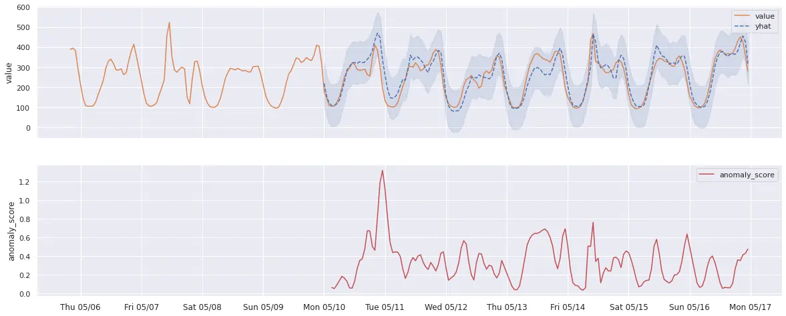

## About

**VictoriaMetrics Anomaly Detection** (or shortly, `vmanomaly`) is a service that continuously scans VictoriaMetrics time
series and detects unexpected changes within data patterns in real-time. It does so by utilizing
user-configurable machine learning models.

It periodically queries user-specified metrics, computes an “anomaly score” for them, based on how
well they fit a predicted distribution, taking into account periodical data patterns with trends,
and pushes back the computed “anomaly score” to VictoriaMetrics. Then, users can enable alerting
rules based on the “anomaly score”.

Compared to classical alerting rules, anomaly detection is more “hands-off” i.e. it allows users to
avoid setting up manual alerting rules set up and catching anomalies that were not expected to happen.
In other words, by setting up alerting rules, a user must know what to look for, ahead of time,
while anomaly detection looks for any deviations from past behavior.

In addition to that, setting up alerting rules manually has been proven to be tedious and
error-prone, while anomaly detection can be easier to set up, and use the same model for different
metrics.

`vmanomaly` can be used as a helper to set up your own alerting. You can rely on the spikes you see in anomaly scores to form the metric queries for alerting rules.

> **Note: `vmanomaly` is a part of [enterprise package](https://docs.victoriametrics.com/enterprise/). You need to get a [free trial license](https://victoriametrics.com/products/enterprise/trial/) for evaluation.**

## How?

VictoriaMetrics Anomaly Detection service (**vmanomaly**) allows you to apply several built-in
anomaly detection algorithms. You can also plug in your own detection models, code doesn’t make any
distinction between built-in models or external ones.

All the service parameters (model, schedule, input-output) are defined in a config file.

Single config file supports only one model, but it’s totally OK to run multiple **vmanomaly**
processes in parallel, each using its own config.

## Models

Currently, vmanomaly ships with a set of built-in models:
> For a detailed overview, see [model section](https://docs.victoriametrics.com/anomaly-detection/components/models/)

1. [**ZScore**](https://docs.victoriametrics.com/anomaly-detection/components/models/#z-score)

   _(useful for testing)_

   Simplistic model, that detects outliers as all the points that lie farther than a certain amount
   from time-series mean (straight line). Keeps only two model parameters internally:
   `mean` and `std` (standard deviation).

1. [**Prophet**](https://docs.victoriametrics.com/anomaly-detection/components/models/#prophet)

   _(simplest in configuration, recommended for getting started)_

   Uses Facebook Prophet for forecasting. The _anomaly score_ is computed of how close the actual time
   series values follow the forecasted values (_yhat_), and whether it’s within forecasted bounds
   (_yhat_lower_, _yhat_upper_). The _anomaly score_ reaches 1.0 if the actual data values
   are equal to
   _yhat_lower_ or _yhat_upper_. The _anomaly score_ is above 1.0 if the actual data values are
   outside
   the _yhat_lower_/_yhat_upper_ bounds.

   See [Prophet documentation](https://facebook.github.io/prophet/)

1. [**Holt-Winters**](https://docs.victoriametrics.com/anomaly-detection/components/models/#holt-winters)

   Very popular forecasting algorithm. See [statsmodels.org documentation](
   https://www.statsmodels.org/stable/generated/statsmodels.tsa.holtwinters.ExponentialSmoothing.html)
   for Holt-Winters exponential smoothing.

1. [**Seasonal-Trend Decomposition**](https://docs.victoriametrics.com/anomaly-detection/components/models/#seasonal-trend-decomposition)

   Extracts three components: season, trend, and residual, that can be plotted individually for
   easier debugging. Uses LOESS (locally estimated scatterplot smoothing).
   See [statsmodels.org documentation](https://www.statsmodels.org/dev/examples/notebooks/generated/stl_decomposition.html)
   for LOESS STD.

1. [**Rolling Quantile**](https://docs.victoriametrics.com/anomaly-detection/components/models/#rolling-quantile)

   A simple moving window of quantiles. Easy to use, easy to understand, but not as powerful as
   other models.

1. [**Isolation Forest**](https://docs.victoriametrics.com/anomaly-detection/components/models/#isolation-forest-multivariate)

   Detects anomalies using binary trees. It works for both univariate and multivariate data. Be aware of [the curse of dimensionality](https://en.wikipedia.org/wiki/Curse_of_dimensionality) in the case of multivariate data - we advise against using a single model when handling multiple time series *if the number of these series significantly exceeds their average length (# of data points)*.

   The algorithm has a linear time complexity and a low memory requirement, which works well with high-volume data. See [scikit-learn.org documentation](https://scikit-learn.org/stable/modules/generated/sklearn.ensemble.IsolationForest.html) for Isolation Forest.

1. [**MAD (Median Absolute Deviation)**](https://docs.victoriametrics.com/anomaly-detection/components/models/#mad-median-absolute-deviation)

   A robust method for anomaly detection that is less sensitive to outliers in data compared to standard deviation-based models. It considers a point as an anomaly if the absolute deviation from the median is significantly large.

1. [**AutoTuned**](https://docs.victoriametrics.com/anomaly-detection/components/models/#autotuned) 

   Designed to take the cognitive load off the user, allowing any of built-in models below to be re-tuned for best params on data seen during each `fit` phase of the algorithm. Tradeoff is between increased computational time and optimized results / simpler maintenance.

1. [**Online Z-score**](https://docs.victoriametrics.com/anomaly-detection/components/models/#online-z-score) 

   [Online](https://docs.victoriametrics.com/anomaly-detection/components/models/#online-models) alternative to [Z-score](https://docs.victoriametrics.com/anomaly-detection/components/models/#z-score) model with exact same behavior and use cases.

1. [**Online MAD**](https://docs.victoriametrics.com/anomaly-detection/components/models/#online-mad) 

   Approximate [online](https://docs.victoriametrics.com/anomaly-detection/components/models/#online-models) alternative to [MAD model](https://docs.victoriametrics.com/anomaly-detection/components/models/#mad-median-absolute-deviation), appropriate for the same use cases.

1. [**Online Seasonal Quantile**](https://docs.victoriametrics.com/anomaly-detection/components/models/#online-seasonal-quantile)

   Best used on [de-trended](https://victoriametrics.com/blog/victoriametrics-anomaly-detection-handbook-chapter-1/#trend) data with strong (possibly multiple) [seasonalities](https://victoriametrics.com/blog/victoriametrics-anomaly-detection-handbook-chapter-1/#seasonality). Can act as a (slightly less powerful) [online](#online-models) replacement to [`ProphetModel`](https://docs.victoriametrics.com/anomaly-detection/components/models/#prophet).

> Note: The full list of models can be found [here](https://docs.victoriametrics.com/anomaly-detection/components/models/#overview)
### Examples
For example, here’s how Prophet predictions could look like on a real-data example  
(Prophet auto-detected seasonality interval):


And here’s what Holt-Winters predictions real-world data could look like (seasonality manually
set to 1 week). Notice that it predicts anomalies in
different places than Prophet because the model noticed there are usually spikes on Friday
morning, so it accounted for that:



## Process
Upon starting, vmanomaly queries the initial range of data, and trains its model (“fit” by convention).

Then, reads new data from VictoriaMetrics, according to schedule, and invokes its model to compute
“anomaly score” for each data point. The anomaly score ranges from 0 to positive infinity.
Values less than 1.0 are considered “not an anomaly”, values greater or equal than 1.0 are
considered “anomalous”, with greater values corresponding to larger anomaly.
Then, vmanomaly pushes the metric to vminsert (under the user-configured metric name,
optionally preserving labels).


## Usage
> Starting from [v1.5.0](https://docs.victoriametrics.com/anomaly-detection/changelog/#v150), vmanomaly requires a license key to run. You can obtain a trial license key [here](https://victoriametrics.com/products/enterprise/trial/).

> See [Quickstart](https://docs.victoriametrics.com/anomaly-detection/quickstart/).

> See [Integration guide: vmanomaly and vmalert](https://docs.victoriametrics.com/anomaly-detection/guides/guide-vmanomaly-vmalert/).

### Config file
There are 4 required sections in config file:

* [`schedulers`](https://docs.victoriametrics.com/anomaly-detection/components/scheduler/) - defines how often to run and make inferences, as well as what timerange to use to train the model.
* [`models`](https://docs.victoriametrics.com/anomaly-detection/components/models/) - specific model parameters and configurations.
* [`reader`](https://docs.victoriametrics.com/anomaly-detection/components/reader/) - how to read data and where it is located
* [`writer`](https://docs.victoriametrics.com/anomaly-detection/components/writer/) - where and how to write the generated output.

[`monitoring`](#monitoring) - defines how to monitor work of *vmanomaly* service. This config section is *optional*.

> For a detailed description, see [config sections](https://docs.victoriametrics.com/anomaly-detection/components/)

#### Config example
Here is an example of config file that will run [Facebook's Prophet model](https://docs.victoriametrics.com/anomaly-detection/components/models/#prophet), that will be retrained every 2 hours on 14 days of previous data. It will generate inference results (including `anomaly_score` metric) every 1 minute.


You need to specify your datasource urls to use it:

```yaml
schedulers:
  periodic:
    infer_every: "1m"
    fit_every: "2h"
    fit_window: "14d"

models:
  prophet:  # or use a model alias of your choice here
    class: "prophet"  # or "model.prophet.ProphetModel" until v1.13.0
    args:
      interval_width: 0.98

reader:
  datasource_url: [YOUR_DATASOURCE_URL] #Example: "http://victoriametrics:8428/"
  queries:
    cache: "sum(rate(vm_cache_entries))"

writer:
  datasource_url: [YOUR_DATASOURCE_URL] # Example: "http://victoriametrics:8428/"
```

### Monitoring

*vmanomaly* can be monitored by using push or pull approach.
It can push metrics to VictoriaMetrics or expose metrics in Prometheus exposition format.

> For a detailed description, see [monitoring section](https://docs.victoriametrics.com/anomaly-detection/components/monitoring/)

#### Push approach

*vmanomaly* can push metrics to VictoriaMetrics single-node or cluster version.
In order to enable push approach, specify `push` section in config file:

```yaml
monitoring:
   push:
      url: [YOUR_DATASOURCE_URL] #Example: "http://victoriametrics:8428/"
      extra_labels:
         job: "vmanomaly-push"
```

#### Pull approach

*vmanomaly* can export internal metrics in Prometheus exposition format at `/metrics` page.
These metrics can be scraped via [vmagent](https://docs.victoriametrics.com/vmagent/) or Prometheus.

In order to enable pull approach, specify `pull` section in config file:

```yaml
monitoring:
   pull:
      enable: true
      port: 8080
```

This will expose metrics at `http://0.0.0.0:8080/metrics` page.

### Run vmanomaly Docker Container

To use *vmanomaly* you need to pull docker image:

```sh
docker pull victoriametrics/vmanomaly:v1.16.3
```

> Note: please check what is latest release in [CHANGELOG](https://docs.victoriametrics.com/anomaly-detection/changelog/)

> Note: `us-docker.pkg.dev/victoriametrics-test/public/vmanomaly-trial` is deprecated since [v1.6.0](https://docs.victoriametrics.com/anomaly-detection/changelog/#v160). Use [DockerHub repo](https://hub.docker.com/r/victoriametrics/vmanomaly/tags) instead

You can put a tag on it for your convenience:

```sh
docker image tag victoriametrics/vmanomaly:v1.16.3 vmanomaly
```
Here is an example of how to run *vmanomaly* docker container with [license file](#licensing):

```sh
export YOUR_LICENSE_FILE_PATH=path/to/license/file
export YOUR_CONFIG_FILE_PATH=path/to/config/file
docker run -it --net [YOUR_NETWORK] \
               -v YOUR_LICENSE_FILE_PATH:/license \
               -v YOUR_CONFIG_FILE_PATH:/config.yml \
               vmanomaly /config.yml \
               --licenseFile=/license
```

### Licensing

The license key can be passed via the following command-line flags:
```
  --license     STRING  License key for VictoriaMetrics Enterprise.
                        See https://victoriametrics.com/products/enterprise/trial/ to obtain a trial license.
  --licenseFile STRING  Path to file with license key for VictoriaMetrics Enterprise.
                        See https://victoriametrics.com/products/enterprise/trial/ to obtain a trial license.
  --license.forceOffline 
                        Whether to force offline verification for VictoriaMetrics Enterprise license key, 
                        which has been passed either via -license or via -licenseFile command-line flag. 
                        The issued license key must support offline verification feature. 
                        Contact info@victoriametrics.com if you need offline license verification.
```


In order to make it easier to monitor the license expiration date, the following metrics are exposed(see
[Monitoring](#monitoring) section for details on how to scrape them):

```promtextmetric
# HELP vm_license_expires_at When the license expires as a Unix timestamp in seconds
# TYPE vm_license_expires_at gauge
vm_license_expires_at 1.6963776e+09
# HELP vm_license_expires_in_seconds Amount of seconds until the license expires
# TYPE vm_license_expires_in_seconds gauge
vm_license_expires_in_seconds 4.886608e+06
```

Example alerts for [vmalert](https://docs.victoriametrics.com/vmalert/):

```yaml
groups:
  - name: vm-license
    # note the `job` label and update accordingly to your setup
    rules:
      - alert: LicenseExpiresInLessThan30Days
        expr: vm_license_expires_in_seconds < 30 * 24 * 3600
        labels:
          severity: warning
        annotations:
          summary: "{{ $labels.job }} instance {{ $labels.instance }} license expires in less than 30 days"
          description: "{{ $labels.instance }} of job {{ $labels.job }} license expires in {{ $value | humanizeDuration }}. 
            Please make sure to update the license before it expires."

      - alert: LicenseExpiresInLessThan7Days
        expr: vm_license_expires_in_seconds < 7 * 24 * 3600
        labels:
          severity: critical
        annotations:
          summary: "{{ $labels.job }} instance {{ $labels.instance }} license expires in less than 7 days"
          description: "{{ $labels.instance }} of job {{ $labels.job }} license expires in {{ $value | humanizeDuration }}. 
            Please make sure to update the license before it expires."
```
