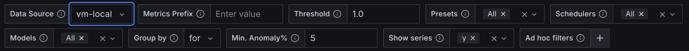
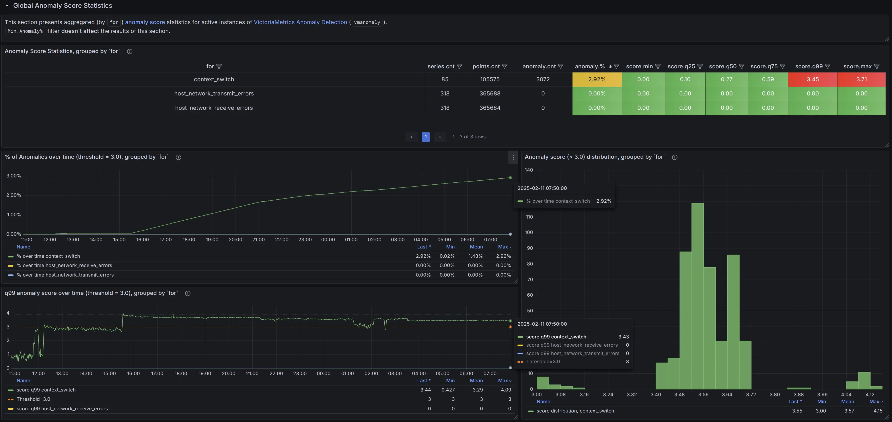
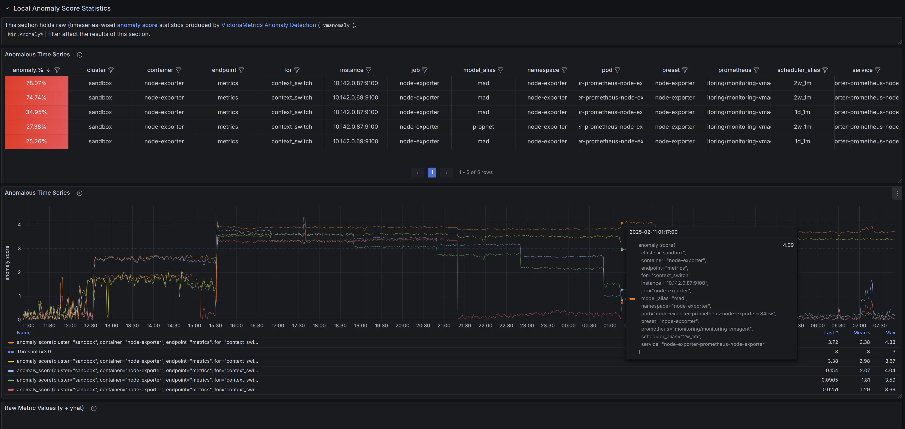
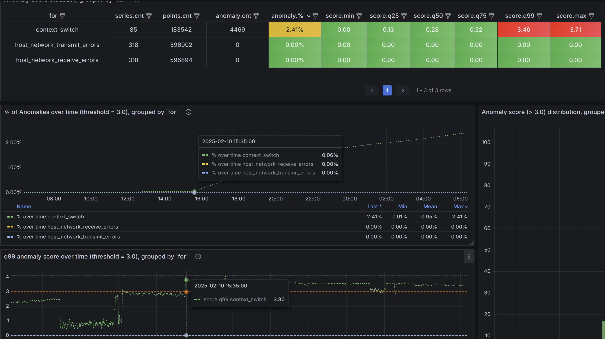
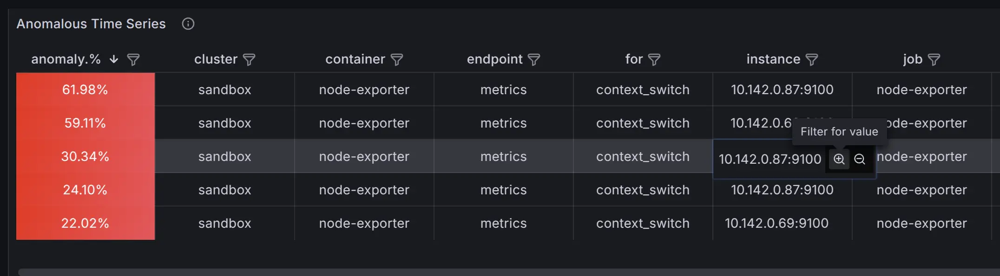
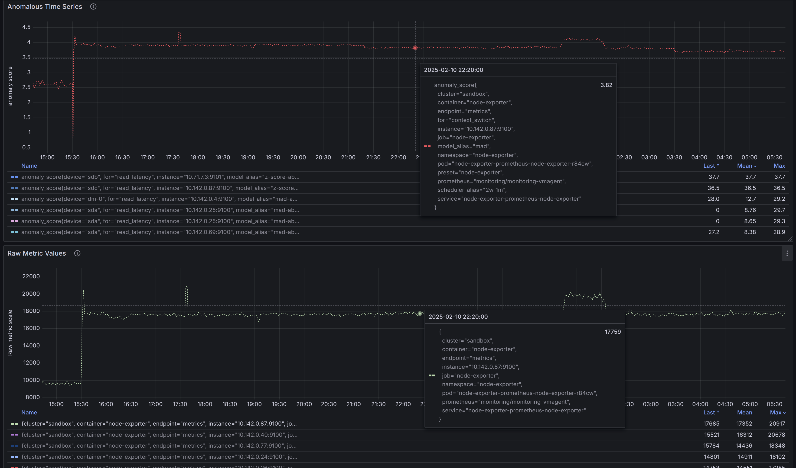
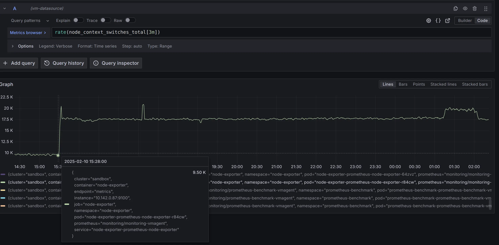
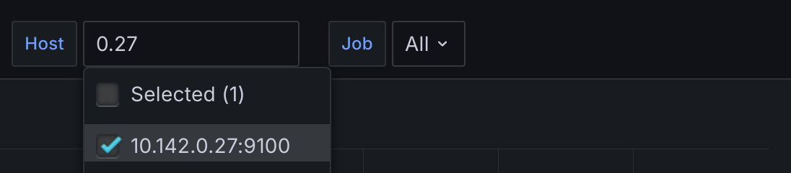
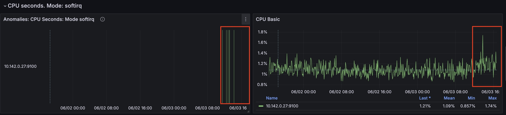

> Please check the [Quick Start Guide](https://docs.victoriametrics.com/anomaly-detection/quickstart/) to install and run `vmanomaly`

**Preset**{} mode allows for simpler configuration and anomaly detection with `vmanomaly` on widely-recognized metrics, such as those generated by [node_exporter](https://github.com/prometheus/node_exporter), which are typically challenging to monitor using static threshold-based alerting rules.

This approach represents a paradigm shift from traditional [static threshold-based alerting rules](https://victoriametrics.com/blog/victoriametrics-anomaly-detection-handbook-chapter-1/#rule-based-alerting), focused on *raw metric values*, to *static* rules based on [`anomaly_scores`](https://docs.victoriametrics.com/anomaly-detection/faq/#what-is-anomaly-score). These scores offer a consistent, default threshold that remains stable over time, being adjusted for trends, seasonality, data scale, thus, reducing the engineering effort required for maintenance. Anomaly scores are produced by [machine learning models](https://docs.victoriametrics.com/anomaly-detection/components/models/), which are regularly retrained on varying time frames, ensuring alerts remain current and responsive to evolving data patterns.

Additionally, **preset mode** minimizes user input needed to run the service - `vmanomaly` service can be configured by specifying only the preset name and data sources in the [`reader`](https://docs.victoriametrics.com/anomaly-detection/components/reader/) and [`writer`](https://docs.victoriametrics.com/anomaly-detection/components/writer/) sections of the configuration file. All other parameters are already preconfigured.

Each preset, including the [default](#default), comes with premade downstream assets such as **alerting rules** or **Grafana dashboards**, making integration even more straightforward.


**Available presets:**
- [UI](#ui)
- [Default](#default)
- [Node-Exporter](#node-exporter)

To enable preset mode, `preset` arg should be set to particular preset name:

```yaml
preset: "chosen_preset_name"  # i.e. "node-exporter", "ui", etc.
```

Also, additional minimal set of arguments may be required from user to run the preset. See corresponding preset sections below for the details.

Run a service using config file with one of the [available options](https://docs.victoriametrics.com/anomaly-detection/quickstart/#how-to-install-and-run-vmanomaly).

## UI

The UI preset is the easiest to start from and is designed for users who want to quickly experiment with `vmanomaly` in [UI mode](https://docs.victoriametrics.com/anomaly-detection/ui/). It requires minimal configuration and provides a user-friendly interface for exploring anomaly detection capabilities:

```yaml
preset: "ui"
```

Please refer to the [UI documentation](https://docs.victoriametrics.com/anomaly-detection/ui/) for detailed instructions on how to use the interface and [backtest your anomaly detection configurations guide](https://docs.victoriametrics.com/anomaly-detection/ui/#example-usage).


## Default

The default preset indicates that the `vmanomaly` service is running in its standard mode — either because the `preset` section is not specified in the configuration or is explicitly set to `default` or `default:vX.Y`.

Since this mode is designed to support **any** configuration, it requires the user to fully define all [necessary configuration sections](https://docs.victoriametrics.com/anomaly-detection/components/), including:  
- [Reader](https://docs.victoriametrics.com/anomaly-detection/components/reader/) (with the required `queries` section)  
- [Writer](https://docs.victoriametrics.com/anomaly-detection/components/writer/)  
- [Models](https://docs.victoriametrics.com/anomaly-detection/components/models/)  
- [Schedulers](https://docs.victoriametrics.com/anomaly-detection/components/scheduler/)

Although this mode is designed to be as flexible as possible, it includes a pre-built [Grafana dashboard](https://grafana.com/grafana/dashboards/22922). This dashboard is based on the [service output](https://docs.victoriametrics.com/anomaly-detection/components/models/#vmanomaly-output), specifically [anomaly scores](https://docs.victoriametrics.com/anomaly-detection/faq/#what-is-anomaly-score), and helps streamline the anomaly drill-down process.  

### Grafana Dashboard

> [For additional benefits](https://docs.victoriametrics.com/victoriametrics/victoriametrics-datasource/#motivation), this dashboard is based on [VictoriaMetrics datasource](https://docs.victoriametrics.com/victoriametrics/victoriametrics-datasource/) rather than on `Prometheus` datasource. Please follow [these instructions](https://docs.victoriametrics.com/victoriametrics/victoriametrics-datasource/#installation) to enable datasource in Grafana.

You can find the Grafana dashboard `.json` file either [here](https://github.com/VictoriaMetrics/VictoriaMetrics/tree/master/deployment/docker/vmanomaly/vmanomaly-default/dashboard.json) or, for already running `vmanomaly` instance: `http://localhost:8490/presets/dashboard.json`. 

Alternatively, you can [download it from Grafana cloud](https://grafana.com/grafana/dashboards/22922) or import directly in Grafana by ID `22922`. Below is the navigation guide.

#### Filters



**P.S.** Expand the **"Dashboard Hints"** panel to view suggested usage tips.

- Hover over the **(i) icons** in the top-right corner of each visualization and variable to see a detailed description of its specifics.
- **Dashboard-level filters** apply to all visualizations, unless otherwise stated
  - The most generic filters are already added, e.g.`preset`, `model_alias`, `scheduler_alias`, which are the labels that all `anomaly_score` metrics have by default
  - To **apply additional filters** on one or more labels, use `Ad hoc filters` [ad hoc Grafana filter](https://grafana.com/docs/grafana/latest/dashboards/use-dashboards/#filter-dashboard-data).
- Adjust `Metrics prefix` (by default - no prefix) according to output format, defined in `writer.metric_format` [config section](https://docs.victoriametrics.com/anomaly-detection/components/writer/#config-parameters). <br>Example: `__name__: 'vmanomaly_$VAR'` will result in metric names 'vmanomaly_anomaly_score', 'vmanomaly_y', 'vmanomaly_yhat', 'vmanomaly_yhat_upper', etc. - put `vmanomaly_` in the field for such metrics to be properly fetched in visualizations
- The **`Group by`** dashboard filter allows you to segment visualizations based on selected label (applicable to [Global Anomaly Score Statistics](#global-anomaly-score-statistics) section).
  - For example, setting it to `model_alias` will create separate sub-visualizations for each unique model alias.
  - This helps in analyzing anomaly patterns across different dimensions.
  - It's recommended to start with `for` label (which stands for query alias defined in `reader.queries` and can be also configured in `writer.metric_format` [config section](https://docs.victoriametrics.com/anomaly-detection/components/writer/#config-parameters))
- The **`Threshold`** dashboard constant (default: `1.0`) determines anomaly classification:
  - **Non-anomalous** data points: `anomaly_score` ≤ `Threshold`
  - **Anomalous** data points: `anomaly_score` > `Threshold`
  - Set the threshold value consistently with your **alerting rules** for accurate anomaly detection visualizations.
- The **`Min. Anomaly%`** dashboard constant (from `[0,1]` range) helps to filter the visualizations in [Local Anomaly Score Statistics](#local-anomaly-score-statistics) dashboard section, leaving only timeseries with **% of anomalies over time > selected threshold**. <br>Set it to 0 to disable filtering on anomaly percentage.
- The **`Show series`** dashboard custom multi-valued list allows to specify what [vmanomaly output](https://docs.victoriametrics.com/anomaly-detection/components/models/#vmanomaly-output) series to plot on [Local Anomaly Score Statistics](#local-anomaly-score-statistics) dashboard section. Defaults to `y` - raw metric values model saw during prediction phase. Setting it to (`y`, `yhat`, `yhat_lower`, `yhat_upper`) may ease the debugging of produced anomaly scores.

#### Global Anomaly Score Statistics



This section provides aggregated anomaly score statistics, grouped by the selected `Group by` filter label (e.g. by `for`):

- A table summarizing key statistics over the selected data range, including:
  - The number of unique time series in each group
  - The total number of data points
  - The total number of anomalies (data points where the anomaly score exceeds the selected `Threshold` filter)
  - The percentage of anomalous data points (as % of the total number of data points)
  - The minimum, maximum, and key quantiles (25th, 50th, 75th, and 99th percentiles) of anomaly scores

- A time series graphs for the respective group, displaying:
  - The percentage of anomalies over time
  - The 99th percentile (`q99`) of anomaly scores over time

- A histogram visualizing the distribution of individual anomaly scores (for scores exceeding the `Threshold` filter), helping to identify a suitable cutoff for alerting rules and distinguish real business anomalies from minor noise.

#### Local Anomaly Score Statistics



This section provides anomaly score statistics at the individual time series level:

- A table displaying raw time series data, including:
  - The percentage of anomalies over time
  - The associated label set (each row represents an individual time series, with columns for label names and values)
  - Sorted in descending order by anomaly percentage, with the most anomalous time series at the top

- A time series graph visualizing anomaly scores over time, allowing you to pinpoint when and where anomalies occurred.

- A time series graph with respective raw metric values over time. 

> This panel **has data if these conditions were met**:
>  - [univariate models](https://docs.victoriametrics.com/anomaly-detection/components/models/#univariate-models) were used under respective `model_alias` label
>  - The `provide_series` [argument](https://docs.victoriametrics.com/anomaly-detection/components/models/#provide-series) explicitly or implicitly included `y` <br>(input data of original timeseries, observed by the model at prediction time).
>  - In `writer.metric_format` special label `for` was configured to point out to query alias used in `reader.queries` section. <br>See `metric_format` argument description on [writer page](https://docs.victoriametrics.com/anomaly-detection/components/writer/#config-parameters) for the details.

Use **`Show series`** dashboard variable to specify what [vmanomaly output](https://docs.victoriametrics.com/anomaly-detection/components/models/#vmanomaly-output) series to plot on [Local Anomaly Score Statistics](#local-anomaly-score-statistics) dashboard section corresponding to raw metrics scale. Defaults to `y` - raw metric values model saw during prediction phase. Setting it to (`y`, `yhat`, `yhat_lower`, `yhat_upper`) may ease the debugging of produced anomaly scores.

### Example

To analyze anomalies effectively, start from a high-level overview and progressively narrow down to specific time series.

1. **Select a time range:**  
   Choose the relevant time window (e.g., the last `12h`) on dashboard's time range filter.

2. **Apply grouping:**  
   Use an appropriate `Group by` label (e.g., `for` to group by `reader.queries`). See the [filters section](#filters) for details.

3. **Sort groups:**  
   - Sort the table by `q99` or the maximum anomaly percentage in descending order (if not already).  
   - Identify groupings with the highest values.

4. **Analyze visual trends:**  
   - Observe patterns within grouped anomalies.  
   - For example, the `context_switch` metric in the anomaly percentage graph shows a steady increase over time.

5. **Zoom in on the most anomalous groups:**  
   - Focus on the most affected category (`context_switch` in this case).  
   - Notice when the anomaly score first exceeded the threshold—around 15:35 in the example.

   

6. **Refine the view:**  
   - Before switching to the [Local Anomaly Score Statistics](#local-anomaly-score-statistics) section, apply an ad-hoc filter (e.g., `for=context_switch`) to exclude unrelated data.

   

---

In the **Local View** section, identify the most anomalous time series by:  
- Checking the table, which is sorted in descending order by anomaly percentage.  
- Analyzing the graph to observe anomaly scores over time.  

To focus on the most significant anomalies, set the `Min anomaly %` dashboard constant (e.g., `5%` in this example). This will filter the table and graph to display only time series with anomaly percentages over selected range above the threshold.


To further refine the results, you can:  

- **(Global effect)** Filter table columns (e.g., by a specific `instance`).  
  > This applies an additional ad-hoc filter at the dashboard level, so remember to remove it after your investigation.  
    

- **(Local effect)** Click on legend values to isolate specific series (`CTRL` or `CMD` + click to select multiple items).  


For 1 or more filtered timeseries, explore the label set directly in the table or via the popup.<br>
To determine whether the anomaly is a true or [false positive](https://victoriametrics.com/blog/victoriametrics-anomaly-detection-handbook-chapter-1/#false-positive), check the raw metric values:  
- **(Preferred method)** Directly within the dashboard, if [univariate models](https://docs.victoriametrics.com/anomaly-detection/components/models/#univariate-models) were used and the `provide_series` [argument](https://docs.victoriametrics.com/anomaly-detection/components/models/#provide-series) explicitly or implicitly included `y` (i.e., the original values observed by the model at prediction time). Also, using **Show series** filter to add `yhat`, `yhat_lower`, `yhat_upper` to the visualizations (if respective columns were defined in `provide_series`) might help to understand model behavior and the magnitude of produced anomaly scores.
 

- **(Alternative method)** Use the `Explore` tab in Grafana:

  - Copy the corresponding `for` query MetricsQL expression from the `reader.queries` section of the `vmanomaly` config (e.g., `rate(node_context_switches_total[3m])` in this particular example).  
  - Paste that expression into the `Metrics browser` field.  
  - Apply filters to isolate specific series, either by adding `{label=value}` filters to the query or by clicking on legend items as shown in the screenshot.

**Final Analysis:** This anomaly appears to be a **pattern shift**, potentially caused by:  
- **Application-related factors**: Increased time series ingestion by `vmagent`, a higher number of scrapers, or more remote write activity.  
- **Instance-level factors**: Increased CPU contention from other processes, higher soft interrupts, or changes in CPU affinity affecting `vmagent`.  
- **Business-related factors**: Scheduled workloads or expected operational changes that should be accounted for. If confirmed as non-anomalous, these patterns can be excluded from detection by adjusting the configuration for seasonality or refining alerting rules to ignore predefined time ranges from triggering actual alerts.  

Further investigation is needed to determine the exact cause.

---

## Node-Exporter

The Node-Exporter preset simplifies the monitoring and anomaly detection of key system metrics collected by [`node_exporter`](https://github.com/prometheus/node_exporter). This preset reduces the need for manual configuration and detects anomalies in metrics such as CPU usage, network errors, and disk latency, ensuring timely identification of potential issues. Below are detailed instructions on enabling and using the Node-Exporter preset, along with a list of included assets like alerting rules and Grafana dashboard.

> **Node-Exporter preset assets can be also found [here](https://github.com/VictoriaMetrics/VictoriaMetrics/tree/master/deployment/docker/vmanomaly/vmanomaly-node-exporter-preset/)**

For enabling Node-Exporter in config file set the `preset` arg accordingly. Also, include at least `datasource_url`-s (and `tenant_id` if using [cluster version of VictoriaMetrics](https://docs.victoriametrics.com/victoriametrics/cluster-victoriametrics/)) in `reader` and `writer` sections, like that:

```yaml
preset: "node-exporter"
reader:
  datasource_url: "http://victoriametrics:8428/" # source victoriametrics/prometheus
  # tenant_id: '0:0'  # specify for cluster version
writer:
  datasource_url: "http://victoriametrics:8428/" # destination victoriametrics/prometheus
  # tenant_id: '0:0'  # specify for cluster version
```

Run a service using such config file with one of the [available options](https://docs.victoriametrics.com/anomaly-detection/quickstart/#how-to-install-and-run-vmanomaly).

### Generated anomaly scores
Machine learning models will be fit for each timeseries, returned by underlying [MetricsQL](https://docs.victoriametrics.com/victoriametrics/metricsql/) queries.
In addition to preset label, anomaly score metric labels will also contain [model](https://docs.victoriametrics.com/anomaly-detection/components/models/) and [scheduler](https://docs.victoriametrics.com/anomaly-detection/components/scheduler/) aliases for labelset uniqueness (`preset`, `model_alias`, `scheduler_alias` labels, respectively).

Here's an example of produced metrics:

```promtextmetric
anomaly_score{for="cpu_seconds_total", instance="node-exporter:9100", preset="node-exporter", mode="system", model_alias="prophet", scheduler_alias="1d_1m"} 0.23451242720277776
anomaly_score{for="cpu_seconds_total", instance="node-exporter:9100", preset="node-exporter", mode="user", model_alias="prophet", scheduler_alias="1d_1m"} 0.2637952255694444
anomaly_score{for="page_faults", instance="node-exporter:9100", job="node-exporter", preset="node-exporter", model_alias="prophet", scheduler_alias="1d_1m"} 0.00593712535
anomaly_score{for="read_latency", instance="node-exporter:9100", preset="node-exporter", model_alias="mad", scheduler_alias="1d_1m"} 0.27773362795333334
anomaly_score{for="receive_bytes", instance="node-exporter:9100", preset="node-exporter", model_alias="mad", scheduler_alias="1d_1m"} 0.037753486136666674
anomaly_score{for="transmit_bytes", instance="node-exporter:9100", preset="node-exporter", model_alias="mad", scheduler_alias="1d_1m"} 0.17633085235
anomaly_score{for="write_latency", instance="node-exporter:9100", preset="node-exporter", model_alias="mad", scheduler_alias="1d_1m"} 0.019314370926666668
anomaly_score{for="cpu_seconds_total", instance="node-exporter:9100", preset="node-exporter", mode="idle", model_alias="mad", scheduler_alias="1d_1m"} 4.2323617935
anomaly_score{for="cpu_seconds_total", instance="node-exporter:9100", preset="node-exporter", mode="idle", model_alias="mad", scheduler_alias="2w_1m"} 1.5261359215
anomaly_score{for="cpu_seconds_total", instance="node-exporter:9100", preset="node-exporter", mode="idle", model_alias="prophet", scheduler_alias="2w_1m"} 0.5850743651
anomaly_score{for="cpu_seconds_total", instance="node-exporter:9100", preset="node-exporter", mode="idle", model_alias="z-score", scheduler_alias="1d_1m"} 1.6496064663
anomaly_score{for="cpu_seconds_total", instance="node-exporter:9100", preset="node-exporter", mode="idle", model_alias="z-score", scheduler_alias="2w_1m"} 0.924392581
anomaly_score{for="cpu_seconds_total", instance="node-exporter:9100", preset="node-exporter", mode="iowait", model_alias="mad", scheduler_alias="1d_1m"} 0.8571428657
...
```

### Alerts
> For optimal alerting experience, we include [Awesome alerts](https://github.com/samber/awesome-prometheus-alerts) to cover indicators not addressed by the preset, as static thresholds can effectively complement our machine learning approach.

> Provided `vmanomaly` alerts are set to fire only if *all anomaly detection models* vote that the datapoint is anomalous.

You can find corresponding alerting rules here:
- `vmanomaly` [Anomaly Detection alerts](https://github.com/VictoriaMetrics/VictoriaMetrics/tree/master/deployment/docker/vmanomaly/vmanomaly-node-exporter-preset/vmanomaly_alerts.yml): `http://localhost:8490/presets/vmanomaly_alerts.yml`
- [Modified Awesome Alerts](https://github.com/VictoriaMetrics/VictoriaMetrics/tree/master/deployment/docker/vmanomaly/vmanomaly-node-exporter-preset/awesome_alerts.yml): `http://localhost:8490/presets/awesome_alerts.yml`

#### Awesome Alerts replaced by Machine Learning alerts
- HostMemoryUnderMemoryPressure
- HostContextSwitching
- HostHighCpuLoad
- HostCpuIsUnderutilized
- HostCpuStealNoisyNeighbor
- HostCpuHighIowait
- HostNetworkReceiveErrors
- HostNetworkTransmitErrors
- HostUnusualNetworkThroughputIn
- HostUnusualNetworkThroughputOut

### Grafana dashboard
Grafana dashboard `.json` file can be found [here](https://github.com/VictoriaMetrics/VictoriaMetrics/tree/master/deployment/docker/vmanomaly/vmanomaly-node-exporter-preset/dashboard.json): `http://localhost:8490/presets/dashboard.json`

### Indicators monitored by preset

The produced anomaly scores will have a label `for` containing the name of corresponding indicator.

<table class="params">
    <thead>
        <tr>
            <th>Indicator</th>
            <th>Based on metrics</th>
            <th>Description</th>  
        </tr>
    </thead>
    <tbody>
        <tr>
            <td>

`page_faults`
            </td>
            <td>

`node_vmstat_pgmajfault`
            </td>
            <td>

Number of major faults that have occurred since the last update. Major faults occur when a process tries to access a page in memory that is not currently mapped in the process's address space, and it requires loading data from the disk.
            </td>
        </tr>
        <tr>
            <td>

`context_switch`
            </td>
            <td>

`node_context_switches_total`
            </td>
            <td>

This metric represents the total number of context switches across all CPUs.
            </td>
        </tr>
        <tr>
            <td>

`cpu_seconds_total`
            </td>
            <td>

`node_cpu_seconds_total`
            </td>
            <td>

Total amount of CPU time consumed by the system in seconds by CPU processing mode (e.g., user, system, idle).
            </td>
        </tr>
        <tr>
            <td>

<span style="white-space: nowrap;">`host_network_transmit_errors`</span>
& `host_network_receive_errors`
            </td>
            <td>

`node_network_receive_errs_total`, 
`node_network_receive_packets_total`, 
`node_network_transmit_errs_total`,
<span style="white-space: nowrap;">`node_network_transmit_packets_total`</span>
            <td>

Total number of errors encountered while receiving/transmitting packets on the network interfaces of a node.
            </td>
        </tr>
        <tr>
            <td>

`receive_bytes` & `transmit_bytes`
            </td>
            <td>

`node_network_receive_bytes_total`, 
`node_network_transmit_bytes_total`
            </td>
            <td>

Total number of bytes received/transmitted on network interfaces of a node.
            </td>
        </tr>
        <tr>
            <td>

`read_latency` & `write_latency`
            </td>
            <td>

`node_disk_read_time_seconds_total`, 
`node_disk_reads_completed_total`, 
`node_disk_write_time_seconds_total`, 
`node_disk_writes_completed_total`
            </td>
            <td>

Disk latency. The total read/write time spent in seconds. / The total number of reads/writes completed successfully.
            </td>
        </tr>
    </tbody>
</table>

### Example

Here's how attached [Grafana dashboard](https://github.com/VictoriaMetrics/VictoriaMetrics/tree/master/deployment/docker/vmanomaly/vmanomaly-node-exporter-preset/dashboard.json) can be used to drill down anomalies:

On the (global) graph **'Percentage of Anomalies'**, you can see a spike 8.75% of anomalies at the timestamp '2024-06-03 10:35:00'. The (global) graph **'Anomalies per Indicator'** shows the indicators that were anomalous at the corresponding time.


At this timestamp on the **'Number of Anomalous Indicators by Node'** graph we can identify the node that had the most anomalies: `10.142.0.27`


Now you can select anomalous node to drill down further (local):




For this node from the timestamp `2024-06-03 10:35:00` CPU time spent handling software interrupts started to grow.
(`cpu_seconds_total{mode="softirq"}`)




At the same time `cpu_seconds_total` for `steal` mode started to grow as well.


