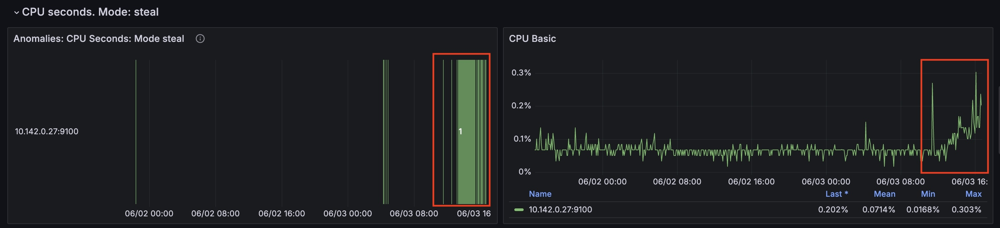

# Anomaly detection presets
> Please check the [Quick Start Guide](/anomaly-detection/quickstart/) to install and run `vmanomaly`

> Presets are available starting from [v1.13.0](/anomaly-detection/CHANGELOG/#v1130)


**Preset** mode allows for simpler configuration and anomaly detection with `vmanomaly` on widely-recognized metrics, such as those generated by [node_exporter](https://github.com/prometheus/node_exporter), which are typically challenging to monitor using static threshold-based alerting rules.

This approach represents a paradigm shift from traditional [static threshold-based alerting rules](https://victoriametrics.com/blog/victoriametrics-anomaly-detection-handbook-chapter-1/#rule-based-alerting), focused on *raw metric values*, to *static* rules based on [`anomaly_scores`](/anomaly-detection/faq/#what-is-anomaly-score). These scores offer a consistent, default threshold that remains stable over time, being adjusted for trends, seasonality, data scale, thus, reducing the engineering effort required for maintenance. Anomaly scores are produced by [machine learning models](/anomaly-detection/components/models), which are regularly retrained on varying time frames, ensuring alerts remain current and responsive to evolving data patterns.

Additionally, **preset mode** minimizes user input needed to run the service. You can configure `vmanomaly` by specifying only the preset name and data sources in the [`reader`](/anomaly-detection/components/reader/) and [`writer`](/anomaly-detection/components/writer/) sections of the configuration file. All other parameters are already preconfigured.


Available presets:
- [Node-Exporter](#node-exporter)

Here is an example config file to enable [Node-Exporter](#node-exporter) preset:

```yaml
preset: "node-exporter"
reader:
  datasource_url: "http://victoriametrics:8428/" # your datasource url
  # tenant_id: '0:0'  # specify for cluster version
writer:
  datasource_url: "http://victoriametrics:8428/" # your datasource url
  # tenant_id: '0:0'  # specify for cluster version
```
Run a service using config file with one of the [available options](/anomaly-detection/quickstart/#how-to-install-and-run-vmanomaly).

After you run `vmanomaly` with `preset` arg specified, available assets can be viewed, copied and downloaded at `http://localhost:8490/presets/` endpoint.


## Node-Exporter

> **Note: Preset assets can be also found [here](https://github.com/VictoriaMetrics/VictoriaMetrics/tree/master/deployment/docker/vmanomaly/vmanomaly-node-exporter-preset/)**

For enabling Node-Exporter in config file use `preset` parameter:
```yaml
preset: "node-exporter"
```

### Generated anomaly scores
Machine learning models will be fit for each timeseries, returned by underlying [MetricsQL](https://docs.victoriametrics.com/metricsql/) queries.
Anomaly score metric labels will also contain [model classes](/anomaly-detection/components/models/) and [schedulers](/anomaly-detection/components/scheduler/) for labelset uniqueness.

Here's an example of produced metrics:

```shell
anomaly_score{for="cpu_seconds_total", instance="node-exporter:9100", preset="node-exporter", mode="system", model_alias="prophet", scheduler_alias="1d_1m"} 0.23451242720277776
anomaly_score{for="cpu_seconds_total", instance="node-exporter:9100", preset="node-exporter", mode="user", model_alias="prophet", scheduler_alias="1d_1m"} 0.2637952255694444
anomaly_score{for="page_faults", instance="node-exporter:9100", job="node-exporter", preset="node-exporter", model_alias="prophet", scheduler_alias="1d_1m"} 0.00593712535
anomaly_score{for="read_latency", instance="node-exporter:9100", preset="node-exporter", model_alias="mad", scheduler_alias="1d_1m"} 0.27773362795333334
anomaly_score{for="receive_bytes", instance="node-exporter:9100", preset="node-exporter", model_alias="mad", scheduler_alias="1d_1m"} 0.037753486136666674
anomaly_score{for="transmit_bytes", instance="node-exporter:9100", preset="node-exporter", model_alias="mad", scheduler_alias="1d_1m"} 0.17633085235
anomaly_score{for="write_latency", instance="node-exporter:9100", preset="node-exporter", model_alias="mad", scheduler_alias="1d_1m"} 0.019314370926666668
anomaly_score{for="cpu_seconds_total", instance="node-exporter:9100", preset="node-exporter", mode="idle", model_alias="mad", scheduler_alias="1d_1m"} 4.2323617935
anomaly_score{for="cpu_seconds_total", instance="node-exporter:9100", preset="node-exporter", mode="idle", model_alias="mad", scheduler_alias="2w_1m"} 1.5261359215
anomaly_score{for="cpu_seconds_total", instance="node-exporter:9100", preset="node-exporter", mode="idle", model_alias="prophet", scheduler_alias="2w_1m"} 0.5850743651
anomaly_score{for="cpu_seconds_total", instance="node-exporter:9100", preset="node-exporter", mode="idle", model_alias="z-score", scheduler_alias="1d_1m"} 1.6496064663
anomaly_score{for="cpu_seconds_total", instance="node-exporter:9100", preset="node-exporter", mode="idle", model_alias="z-score", scheduler_alias="2w_1m"} 0.924392581
anomaly_score{for="cpu_seconds_total", instance="node-exporter:9100", preset="node-exporter", mode="iowait", model_alias="mad", scheduler_alias="1d_1m"} 0.8571428657
...
```

### Alerts
> For optimal alerting experience, we include [Awesome alerts](https://github.com/samber/awesome-prometheus-alerts) to cover indicators not addressed by the preset, as static thresholds can effectively complement our machine learning approach.

> Provided `vmanomaly` alerts are set to fire only if *all anomaly detection models* vote that the datapoint is anomalous.

You can find corresponding alerting rules here:
- `vmanomaly` [Anomaly Detection alerts](https://github.com/VictoriaMetrics/VictoriaMetrics/tree/master/deployment/docker/vmanomaly/vmanomaly-node-exporter-preset/vmanomaly_alerts.yml): `http://localhost:8490/presets/vmanomaly_alerts.yml`
- [Modified Awesome Alerts](https://github.com/VictoriaMetrics/VictoriaMetrics/tree/master/deployment/docker/vmanomaly/vmanomaly-node-exporter-preset/awesome_alerts.yml): `http://localhost:8490/presets/awesome_alerts.yml`

#### Awesome Alerts replaced by Machine Learning alerts
- HostMemoryUnderMemoryPressure
- HostContextSwitching
- HostHighCpuLoad
- HostCpuIsUnderutilized
- HostCpuStealNoisyNeighbor
- HostCpuHighIowait
- HostNetworkReceiveErrors
- HostNetworkTransmitErrors
- HostUnusualNetworkThroughputIn
- HostUnusualNetworkThroughputOut

### Grafana dashboard
Grafana dashboard `.json` file can be found [here](https://github.com/VictoriaMetrics/VictoriaMetrics/tree/master/deployment/docker/vmanomaly/vmanomaly-node-exporter-preset/dashboard.json): `http://localhost:8490/presets/dashboard.json`

### Indicators monitored by preset

The produced anomaly scores will have a label `for` containing the name of corresponding indicator.

<table>
    <thead>
        <tr>
            <th>Indicator</th>
            <th>Based on metrics</th>
            <th>Description</th>  
        </tr>
    </thead>
    <tbody>
        <tr>
            <td><code>page_faults</code></td>
            <td><code>node_vmstat_pgmajfault</code></td>
            <td>Number of major faults that have occurred since the last update. Major faults occur when a process tries to access a page in memory that is not currently mapped in the process's address space, and it requires loading data from the disk.</td>
        </tr>
        <tr>
            <td><code>context_switch</code></td>
            <td><code>node_context_switches_total</code></td>
            <td>This metric represents the total number of context switches across all CPUs.</td>
        </tr>
        <tr>
            <td><code>cpu_seconds_total</code></td>
            <td><code>node_cpu_seconds_total</code></td>
            <td>Total amount of CPU time consumed by the system in seconds by CPU processing mode (e.g., user, system, idle).</td>
        </tr>
        <tr>
            <td><code>host_network_receive_errors</code> & <code>host_network_transmit_errors</code></td>
            <td><code>node_network_receive_errs_total</code>, <code>node_network_receive_packets_total</code>, <code>node_network_transmit_errs_total</code>, <code>node_network_transmit_packets_total</code>
            <td>Total number of errors encountered while receiving/transmitting packets on the network interfaces of a node.</td>
        </tr>
        <tr>
            <td><code>receive_bytes</code> & <code>transmit_bytes</code></td>
            <td><code>node_network_receive_bytes_total</code>, <code>node_network_transmit_bytes_total</code></td>
            <td>Total number of bytes received/transmitted on network interfaces of a node.</td>
        </tr>
        <tr>
            <td><code>read_latency</code> & <code>write_latency</code></td>
            <td><code>node_disk_read_time_seconds_total</code>, <code>node_disk_reads_completed_total</code>, <code>node_disk_write_time_seconds_total</code>, <code>node_disk_writes_completed_total</code></td>
            <td>Disk latency. The total read/write time spent in seconds. / The total number of reads/writes completed successfully.</td>
        </tr>
    </tbody>
</table>

## Example

Here's how attached [Grafana dashboard](https://github.com/VictoriaMetrics/VictoriaMetrics/tree/master/deployment/docker/vmanomaly/vmanomaly-node-exporter-preset/dashboard.json) can be used to drill down anomalies:

On the (global) graph **'Percentage of Anomalies'**, you can see a spike 8.75% of anomalies at the timestamp '2024-06-03 10:35:00'. The (global) graph **'Anomalies per Indicator'** shows the indicators that were anomalous at the corresponding time.


At this timestamp on the **'Number of Anomalous Indicators by Node'** graph we can identify the node that had the most anomalies: `10.142.0.27`


Now you can select anomalous node to drill down further (local):


For this node from the timestamp `2024-06-03 10:35:00` CPU time spent handling software interrupts started to grow.
(`cpu_seconds_total{mode="softirq"}`)


At the same time `cpu_seconds_total` for `steal` mode started to grow as well.


