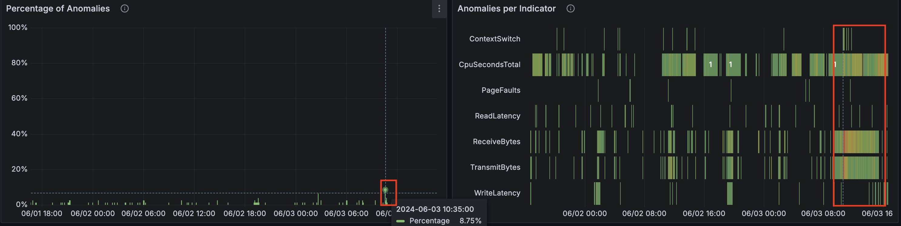
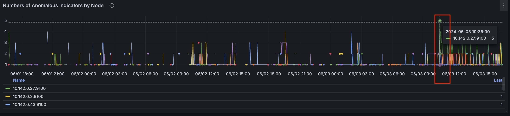

# Anomaly Detection Presets
> Please check the [Quick Start Guide](/anomaly-detection/quickstart/) to install and run `vmanomaly`

> Presets are available from v1.13.0

Presets enable anomaly detection in indicators that are hard to monitor using alerts based on static thresholds.
So, the anomaly detection alerting rules based on the [`anomaly_scores`](https://docs.victoriametrics.com/anomaly-detection/faq/#what-is-anomaly-score) stay the same over time, and we generate the anomaly scores using predefined machine learning models.
Models are constantly retraining on different time frames which helps to keep alerts up to date and to consider underlying data patterns.

You can set up the simplified configuration file for `vmanomaly` just specifying the type of preset and data sources in [`reader`](https://docs.victoriametrics.com/anomaly-detection/components/reader/) and [`writer`](https://docs.victoriametrics.com/anomaly-detection/components/writer/) sections of the config.
The rest of the parameters are already set up for you.

Available presets:
- [Node-Exporter](#node-exporter)

Here is an example config file to enable Node-Exporter preset:

```yaml
preset: "node-exporter"
reader:
  datasource_url: "http://victoriametrics:8428/" # your datasource url
  # tenant_id: '0:0'  # specify for cluster version
writer:
  datasource_url: "http://victoriametrics:8428/" # your datasource url
  # tenant_id: '0:0'  # specify for cluster version
```
Run a service using config file with one of the [available options](/anomaly-detection/quickstart/#how-to-install-and-run-vmanomaly).

After you run `vmanomaly`, the available assets can be found here: `http://localhost:8490/presets/`


## Node-Exporter

> **Note: Configurations for presets can be found [here](https://github.com/VictoriaMetrics/VictoriaMetrics/tree/master/deployment/docker/vmanomaly/vmanomaly-node-exporter-preset/)**

For enabling Node-Exporter in config file use `preset` parameter:
```yaml
preset: "node-exporter"
```

### Generated Anomaly scores
Machine learning models will be fit for each timeseries, returned by underlying [MetricsQL](https://docs.victoriametrics.com/metricsql/).
Anomaly score metric labels will also contain underlying [model classes](/anomaly-detection/components/models/) and [schedulers](/anomaly-detection/components/scheduler/).
Here's an example of produced metrics:

```shell
anomaly_score{for="cpu_seconds_total", instance="node-exporter:9100", preset="node-exporter", mode="system", model_alias="holt-winters", scheduler_alias="1d_1m"} 0.23451242720277776
anomaly_score{for="cpu_seconds_total", instance="node-exporter:9100", preset="node-exporter", mode="user", model_alias="holt-winters", scheduler_alias="1d_1m"} 0.2637952255694444
anomaly_score{for="page_faults", instance="node-exporter:9100", job="node-exporter", preset="node-exporter", model_alias="holt-winters", scheduler_alias="1d_1m"} 0.00593712535
anomaly_score{for="read_latency", instance="node-exporter:9100", preset="node-exporter", model_alias="mad", scheduler_alias="1d_1m"} 0.27773362795333334
anomaly_score{for="receive_bytes", instance="node-exporter:9100", preset="node-exporter", model_alias="mad", scheduler_alias="1d_1m"} 0.037753486136666674
anomaly_score{for="transmit_bytes", instance="node-exporter:9100", preset="node-exporter", model_alias="mad", scheduler_alias="1d_1m"} 0.17633085235
anomaly_score{for="write_latency", instance="node-exporter:9100", preset="node-exporter", model_alias="mad", scheduler_alias="1d_1m"} 0.019314370926666668
anomaly_score{for="cpu_seconds_total", instance="node-exporter:9100", preset="node-exporter", mode="idle", model_alias="mad", scheduler_alias="1d_1m"} 4.2323617935
anomaly_score{for="cpu_seconds_total", instance="node-exporter:9100", preset="node-exporter", mode="idle", model_alias="mad", scheduler_alias="2w_1m"} 1.5261359215
anomaly_score{for="cpu_seconds_total", instance="node-exporter:9100", preset="node-exporter", mode="idle", model_alias="prophet", scheduler_alias="2w_1m"} 0.5850743651
anomaly_score{for="cpu_seconds_total", instance="node-exporter:9100", preset="node-exporter", mode="idle", model_alias="z-score", scheduler_alias="1d_1m"} 1.6496064663
anomaly_score{for="cpu_seconds_total", instance="node-exporter:9100", preset="node-exporter", mode="idle", model_alias="z-score", scheduler_alias="2w_1m"} 0.924392581
anomaly_score{for="cpu_seconds_total", instance="node-exporter:9100", preset="node-exporter", mode="iowait", model_alias="mad", scheduler_alias="1d_1m"} 0.8571428657
...
```

### Alerts
> We recommend to use [Awesome Prometheus alerts](https://github.com/samber/awesome-prometheus-alerts) for alerts not covered by presets.

Provided alerts are set to fire every time all models vote that the datapoint is anomalous.

You can find alerting rules here:
- `vmanomaly` [Anomaly Detection alerts](http://localhost:8490/presets/vmanomaly_alerts.yml): `http://localhost:8490/presets/vmanomaly_alerts.yml`
- [Modified Awesome Alerts](http://localhost:8490/presets/awesome_alerts.yml): `http://localhost:8490/presets/awesome_alerts.yml`

#### Awesome Alerts replaced by Machine Learning alerts
- HostMemoryUnderMemoryPressure
- HostContextSwitching
- HostHighCpuLoad
- HostCpuIsUnderutilized
- HostCpuStealNoisyNeighbor
- HostCpuHighIowait
- HostNetworkReceiveErrors
- HostNetworkTransmitErrors
- HostUnusualNetworkThroughputIn
- HostUnusualNetworkThroughputOut

### Grafana dashboard
Grafana dashboard `.json` file can be found [here](http://localhost:8490/presets/dashboard.json): `http://localhost:8490/presets/dashboard.json`

### Indicators monitored by preset

The produced anomaly scores will contain label `for` with the name of corresponding indicator.

<table>
    <thead>
        <tr>
            <th>Indicator</th>
            <th>Based on metrics</th>
            <th>Description</th>  
        </tr>
    </thead>
    <tbody>
        <tr>
            <td><code>page_faults</code></td>
            <td><code>node_vmstat_pgmajfault</code></td>
            <td>Number of major faults that have occurred since the last update. Major faults occur when a process tries to access a page in memory that is not currently mapped in the process's address space, and it requires loading data from the disk.</td>
        </tr>
        <tr>
            <td><code>context_switch</code></td>
            <td><code>node_context_switches_total</code></td>
            <td>This metric represents the total number of context switches across all CPUs.</td>
        </tr>
        <tr>
            <td><code>cpu_seconds_total</code></td>
            <td><code>node_cpu_seconds_total</code></td>
            <td>Total amount of CPU time consumed by the system in seconds by CPU processing mode (e.g., user, system, idle).</td>
        </tr>
        <tr>
            <td><code>host_network_receive_errors</code> & <code>host_network_transmit_errors</code></td>
            <td><code>node_network_receive_errs_total</code>, <code>node_network_receive_packets_total</code>, <code>node_network_transmit_errs_total</code>, <code>node_network_transmit_packets_total</code>
            <td>Total number of errors encountered while receiving/transmitting packets on the network interfaces of a node.</td>
        </tr>
        <tr>
            <td><code>receive_bytes</code> & <code>transmit_bytes</code></td>
            <td><code>node_network_receive_bytes_total</code>, <code>node_network_transmit_bytes_total</code></td>
            <td>Total number of bytes received/transmitted on network interfaces of a node.</td>
        </tr>
        <tr>
            <td><code>read_latency</code> & <code>write_latency</code></td>
            <td><code>node_disk_read_time_seconds_total</code>, <code>node_disk_reads_completed_total</code>, <code>node_disk_write_time_seconds_total</code>, <code>node_disk_writes_completed_total</code></td>
            <td>Disk latency. The total read/write time spent in seconds. / The total number of reads/writes completed successfully.</td>
        </tr>
    </tbody>
</table>

## Example
On the graph 'Percentage of Anomalies,' you can see a spike to 8.75% of anomalies at the timestamp '2024-06-03 10:35:00'. The graph 'Anomalies per Indicator' shows the indicators that were anomalous at the corresponding time.

At this timestamp on the 'Number of Anomalous Indicators by Node,' we can identify the node that had the most anomalies: `10.142.0.27`

For this node from the timestamp `2024-06-03 10:35:00` CPU time spent handling software interrupts started to grow.
(`cpu_seconds_total{mode="softirq"}`)

At the same time `cpu_seconds_total` for `steal` mode started to grow as well.

