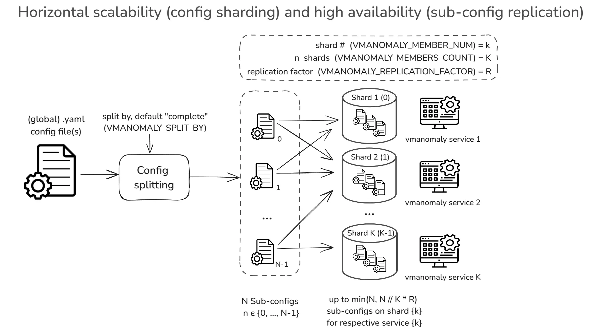

## Overview

Ensuring [high availability](#high-availability) and [horizontal scalability](#horizontal-scalability) is important for maintaining reliable anomaly detection in distributed environments. **Horizontal scalability** allows `vmanomaly` to distribute workloads across multiple nodes by **sharding** configuration entities, preventing performance bottlenecks. **High availability** ensures redundancy by replicating [sub-configurations](#sub-configuration) across multiple nodes, reducing the risk of data loss or service disruption due to node failures.

This document explains how `vmanomaly` achieves **scalability through sharding** and **redundancy through replication**, covering configurations for Docker, Docker Compose, and Helm deployments.

## Global Configuration

`vmanomaly` service operations are configured using YAML files that define various [components](https://docs.victoriametrics.com/anomaly-detection/components/), as shown in the example below. These (global) configurations can be divided into smaller, fully functional [sub-configurations](#sub-configuration), which can be used for [horizontal scalability](#horizontal-scalability) through sharding or for [high availability](#high-availability) by enabling replication.

### Configuration example

```yaml
# https://docs.victoriametrics.com/anomaly-detection/components/scheduler/
schedulers:
  periodic_1d:  # alias
    class: 'periodic' # scheduler class
    infer_every: "30s"
    fit_every: "1h"
    fit_window: "24h"

# https://docs.victoriametrics.com/anomaly-detection/components/models/
models:
  zscore:  # we can set up alias for model
    class: 'zscore'  # model class
    z_threshold: 3.5
    queries: ['cpu_seconds_total', 'host_network_receive_errors']

# https://docs.victoriametrics.com/anomaly-detection/components/reader/#vm-reader
reader:
  datasource_url: "https://play.victoriametrics.com/"
  tenant_id: "0:0"
  class: 'vm'
  sampling_period: "30s"  # what data resolution to fetch from VictoriaMetrics' /query_range endpoint
  queries:  # aliases to MetricsQL expressions
    cpu_seconds_total:
      expr: 'avg(rate(node_cpu_seconds_total[5m])) by (mode)'
    host_network_receive_errors:
      expr: 'rate(node_network_receive_errs_total[3m]) / rate(node_network_receive_packets_total[3m])'

# https://docs.victoriametrics.com/anomaly-detection/components/writer/
writer:
  datasource_url: "http://victoriametrics:8428/"
```

## Sub-configuration

[Global configuration](#global-configuration) file can be split into `N` >= 1 validated **sub-configurations** based on logical entities such as [schedulers](https://docs.victoriametrics.com/anomaly-detection/components/scheduler/), [queries](https://docs.victoriametrics.com/anomaly-detection/components/models/#queries), [models](https://docs.victoriametrics.com/anomaly-detection/components/models/), and [extra_filters](https://docs.victoriametrics.com/anomaly-detection/components/reader/#config-parameters). Each sub-configuration remains functional and respects the many-to-many relationships between models, queries, and schedulers. A minimal valid sub-configuration consists of a single [model type](https://docs.victoriametrics.com/anomaly-detection/components/models/) running on a single [query](https://docs.victoriametrics.com/anomaly-detection/components/models/#queries) and attached to a single [scheduler](https://docs.victoriametrics.com/anomaly-detection/components/scheduler/).

[Example config above](#configuration-example) can be split into 2 sub-configurations (by queries):

- 1 model type (`zscore`), attached to 1 scheduler (`periodic_1d`) which is run on 1st query (`cpu_seconds_total`)
- 1 model type (`zscore`), attached to 1 scheduler (`periodic_1d`) which is run on 2nd query (`host_network_receive_errors`)

## Horizontal Scalability

`vmanomaly` supports **horizontal scalability** {} by sharding [sub-config entities](#sub-configuration), enabling workload distribution across multiple nodes while preserving consistency and maintaining a single global configuration entry point.

A `vmanomaly` [global YAML configuration](#global-configuration) can be split into `N` validated [sub-configurations](#sub-configuration) based on logical entities such as [schedulers](https://docs.victoriametrics.com/anomaly-detection/components/scheduler/), [queries](https://docs.victoriametrics.com/anomaly-detection/components/models/#queries), [models](https://docs.victoriametrics.com/anomaly-detection/components/models/), and [extra_filters](https://docs.victoriametrics.com/anomaly-detection/components/reader/#config-parameters).

These [sub-configurations](#sub-configuration) can be assigned to a specific shard (node) indexed from `{0, K-1}` across `K` available nodes. 

Additionally, a replication factor `R ≥ 1` ensures [high availability](#high-availability) by enforcing redundancy across shards.

<p></p>



> Please [refer to deployment options section](#deployment-options) for the examples (Docker, Docker Compose, Helm). To avoid duplicate metrics being reported from each vmanomaly service used in sharded mode, make sure that [deduplication](https://docs.victoriametrics.com/victoriametrics/single-server-victoriametrics/#deduplication) is configured on vmsingle or vmselect and vmstorage for the VictoriaMetrics instance used in the [writer section of the configuration](https://docs.victoriametrics.com/anomaly-detection/components/writer/).

Sharding configuration can be controlled by using the following environment variables:

- **`VMANOMALY_MEMBERS_COUNT`**: Defines the total number of shards (i.e., available nodes to distribute [sub-configurations](#sub-configuration) to). <br>Defaults to `1` for backward compatibility.
- **`VMANOMALY_MEMBER_NUM`**: Specifies the shard index (`0` to `VMANOMALY_MEMBERS_COUNT - 1`), determining the subset of [sub-configurations](#sub-configuration) to run on a specific node. Defaults to `0`. Supports automatic **pod name discovery** in Kubernetes [StatefulSets](https://kubernetes.io/docs/concepts/workloads/controllers/statefulset/) (e.g., if set to `vmanomaly-node-exporter-7`, shard `7` will be extracted).
- **`VMANOMALY_REPLICATION_FACTOR`**: If `R > 1`, enables [high availability](#high-availability) by ensuring each [sub-configuration](#sub-configuration) is assigned to exactly `R` shards. Defaults to `1` (no replication).
- **`VMANOMALY_SPLIT_BY`**: Defines the logical entity used to split the global config into [sub-configurations](#sub-configuration). Defaults to `complete`, which provides the most granular distribution (1 model per [sub-config](#sub-configuration), mapped to 1 query and attached to 1 scheduler) for balanced workloads.

---

The total number of **available** and **assigned** [sub-configurations](#sub-configuration) per shard can be found using the following [self-monitoring](https://docs.victoriametrics.com/anomaly-detection/self-monitoring/) metric:

```shellhelp
# HELP vmanomaly_config_entities Number of sub-configs (entities) in the configuration available for sharding.
Scope: total - total number of entities, shard - number of entities used on the current shard.
# TYPE vmanomaly_config_entities gauge
vmanomaly_config_entities{preset="default",scope="total"} 8.0
vmanomaly_config_entities{preset="default",scope="shard"} 4.0
```

Meaning, `vmanomaly` runs in sharded mode, where this particular shard uses 4 out of 8 [sub-configurations](#sub-configuration), received after [global config](#global-configuration) split.

For more details, refer to the `vmanomaly_config_entities` [self-monitoring metric](https://docs.victoriametrics.com/anomaly-detection/components/monitoring/#startup-metrics).

---

### Example

For a [global configuration](#global-configuration) that is split into **9 [sub-configs](#sub-configuration)** `[1, 2, 3, ..., 9]`, setting:

- **`VMANOMALY_MEMBERS_COUNT = 3`** (3 shards)
- **`VMANOMALY_REPLICATION_FACTOR = 1`** (default, no replication)

results in the following distribution of [sub-configs](#sub-configuration) across the shards (nodes):

- **Node 1 (index 0):** `[1, 4, 7]`
- **Node 2 (index 1):** `[2, 5, 8]`
- **Node 3 (index 2):** `[3, 6, 9]`

Since the replication factor is set to `1`, each [sub-config](#sub-configuration) is assigned to **exactly one node**, meaning there is **no redundancy** in the distribution.

## High Availability

Similar to other VictoriaMetrics ecosystem components, like [VMAgent](https://docs.victoriametrics.com/operator/resources/vmagent/#high-availability) or [VMAlert](https://docs.victoriametrics.com/operator/resources/vmalert/#high-availability), there exists a support for high availability in `vmanomaly` through [sub-config](#sub-configuration) replication {}.

When `VMANOMALY_REPLICATION_FACTOR` > 1, each [sub-config](#sub-configuration) `n` from `{0, N-1}` is assigned to exactly `R` nodes. This ensures redundancy, preventing single-node failures from causing data loss.

<p></p>


> Please [refer to deployment options section](#deployment-options) for the examples (Docker, Docker Compose, Helm). To avoid duplicate metrics being reported from each vmanomaly service used in sharded mode, make sure that [deduplication](https://docs.victoriametrics.com/victoriametrics/single-server-victoriametrics/#deduplication) is configured on vmsingle or vmselect and vmstorage for the VictoriaMetrics instance used in the [writer section of the configuration](https://docs.victoriametrics.com/anomaly-detection/components/writer/).

### Example

For a [global configuration](#global-configuration) split into **9 [sub-configs](#sub-configuration)** `[1, 2, 3, ..., 9]`, with:

- **`VMANOMALY_MEMBERS_COUNT = 3`** (3 shards)
- **`VMANOMALY_REPLICATION_FACTOR = 2`** (each [sub-config](#sub-configuration) is assigned to exactly 2 nodes)

the resulting **replicated sharded distribution** is:

- **Node 1 (index 0):** `[1, 3, 4, 6, 7, 9]`
- **Node 2 (index 1):** `[1, 2, 4, 5, 7, 8]`
- **Node 3 (index 2):** `[2, 3, 5, 6, 8, 9]`

Now, each [sub-config](#sub-configuration) (1–9) is **present on exactly 2 nodes**, ensuring redundancy:

- **Sub-config 5** appears on **nodes 2 & 3**
- **Sub-config 7** appears on **nodes 1 & 2**
- **Sub-config 9** appears on **nodes 1 & 3**, etc.

## Deployment Options

To enable horizontal scalability (HS) or high availability (HA) in `vmanomaly`, deployment settings should be accordingly configured. Below are examples for running `vmanomaly` with sharding and replication using [Docker](#docker), [Docker Compose](#docker-compose), and [Helm](#helm-charts).

### Docker

To run `vmanomaly` in a Docker container with sharding enabled (e.g., setting `VMANOMALY_MEMBERS_COUNT=2` for two shards and `VMANOMALY_REPLICATION_FACTOR=1` for no replication), specify the shard index using `VMANOMALY_MEMBER_NUM`. Indexing starts from `0` up to `VMANOMALY_MEMBERS_COUNT - 1`. The example below runs the first shard (`VMANOMALY_MEMBER_NUM=0`):

```bash
#!/usr/bin/env bash
set -x -e
cd "$(dirname "$0")/.." || exit 1

# run the first shard (VMANOMALY_MEMBER_NUM=0) in a two-shard setup (VMANOMALY_MEMBERS_COUNT=2)
docker run -i -t --rm \
    --user="$(id -u):$(id -g)" \
    --cap-drop=ALL \
    -e "VM_LICENSE_FILE=/.secret/license" \
    -e "VMANOMALY_MEMBERS_COUNT=2" \
    -e "VMANOMALY_MEMBER_NUM=0" \
    -e "VMANOMALY_REPLICATION_FACTOR=1"
    -e "VMANOMALY_SPLIT_BY=COMPLETE" \
    -v "$PWD/global_config.yaml":/global_config.yaml \
    -v "$PWD/.secret/license":/.secret/license \
    -p 8080:8080 \
    -p 8490:8490 \
    vmanomaly:v1.21.0 \
    /global_config.yaml \
    --loggerLevel=INFO
```

### Docker Compose

Sharded `vmanomaly` can be set up using **Docker Compose**, enabling easier orchestration of multiple shards. Each shard runs a subset `N_k` out of `N` split [sub-configurations](#sub-configuration) of the global configuration. No replication is set in this example, meaning `VMANOMALY_REPLICATION_FACTOR` is set to 1.

The following example demonstrates how to deploy `vmanomaly` with **two shards**, each assigned a unique subset of the global config:

```yaml
# other sections ...

services:
  # other services ...
  vmanomaly-1:
    image: victoriametrics/vmanomaly:v1.21.0
    user: "1000:1000"
    restart: always
    healthcheck:
      test: ["CMD", "curl", "-f", "http://127.0.0.1:8490/health"]
      interval: 30s
      timeout: 10s
      retries: 5
    volumes:
      - ./vmanomaly-config:/config
    command:
      - "/config/global_config.yml"
      - "--license=YOUR_LICENSE"
    environment:
      VMANOMALY_MEMBERS_COUNT: 2
      VMANOMALY_MEMBER_NUM: 0
      VMANOMALY_REPLICATION_FACTOR: 1
      VMANOMALY_SPLIT_BY: "COMPLETE"

  vmanomaly-2:
    image: victoriametrics/vmanomaly:v1.21.0
    user: "1000:1000"
    restart: always
    healthcheck:
      test: ["CMD", "curl", "-f", "http://127.0.0.1:8490/health"]
      interval: 30s
      timeout: 10s
      retries: 5
    volumes:
      - ./vmanomaly-config:/config
    command:
      - "/config/global_config.yml"  # Fixed to match vmanomaly-1
      - "--license=YOUR_LICENSE"
    environment:
      VMANOMALY_MEMBERS_COUNT: 2
      VMANOMALY_MEMBER_NUM: 1
      VMANOMALY_REPLICATION_FACTOR: 1
      VMANOMALY_SPLIT_BY: "COMPLETE"
```

### Helm Charts

To deploy `vmanomaly` with `N > 1` shards using Helm, ensure **chart version [1.9.0](https://github.com/VictoriaMetrics/helm-charts/blob/master/charts/victoria-metrics-anomaly/CHANGELOG.md#190) or newer** is used. Configure the following settings in `values.yaml`:

- Set shard count **(`.Values.shardsCount`)**: Defines the number of shards (`N > 1`) to enable horizontal scaling. Configure it [here](https://github.com/VictoriaMetrics/helm-charts/blob/207dd54f90919f0159b950dbd29bf2f57abf38f1/charts/victoria-metrics-anomaly/values.yaml#L187).
- *(Optional)* Enable [high availability](#high-availability) **(`.Values.replicationFactor`)**: If `R > 1`, each [sub-config](#sub-configuration) is assigned to exactly `R` shards. Configure it [here](https://github.com/VictoriaMetrics/helm-charts/blob/207dd54f90919f0159b950dbd29bf2f57abf38f1/charts/victoria-metrics-anomaly/values.yaml#L189).

With **StatefulSet enabled**, `vmanomaly` automatically extracts shard numbers from pod names. For example, if the pod is named `vmanomaly-node-exporter-0`, then `VMANOMALY_MEMBER_NUM=0` is assigned automatically.
