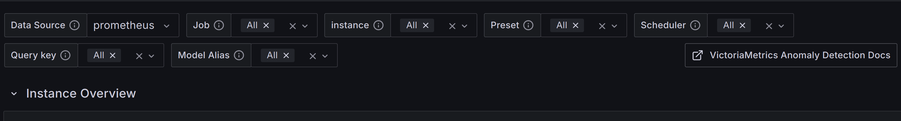
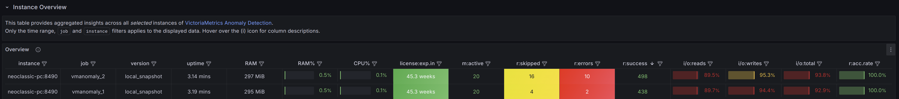
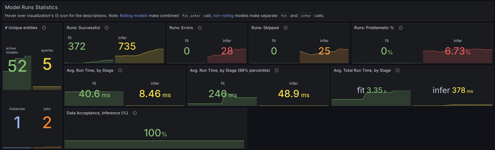
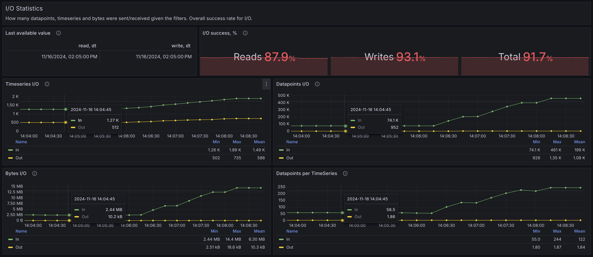
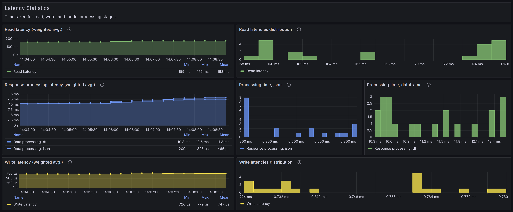
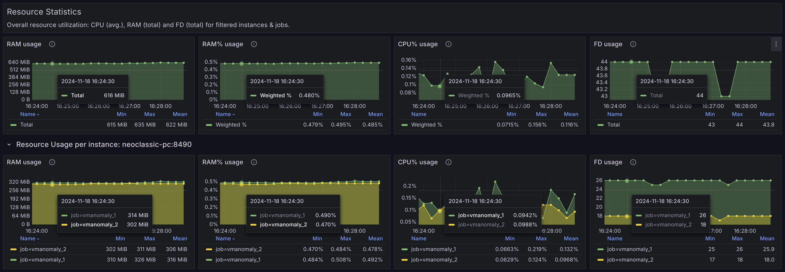
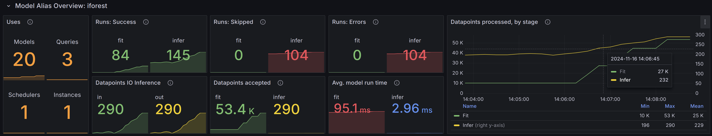
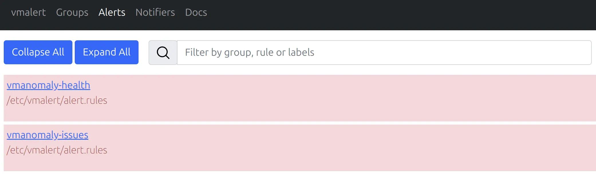
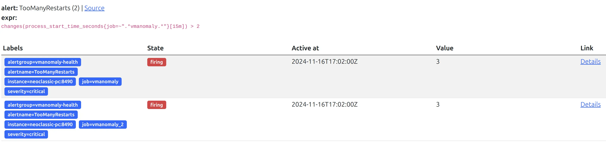
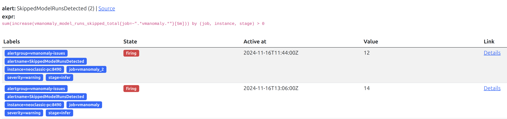

## What is Self-Monitoring

Self-monitoring refers to the ability of the service to track and report its own health, operational performance, and any potential issues in real time. This process enables proactive maintenance and problem identification, making it easier for administrators and users to maintain system stability and performance.

VictoriaMetrics Anomaly Detection (`vmanomaly`) supports self-monitoring by generating metrics related to different operational aspects of the service, including model execution, reader behavior, writer behavior, and overall service health. These metrics provide insights into system bottlenecks, errors, or unusual behavior, and allow for data-driven decisions on tuning performance and reliability.

Self-monitoring metrics are available in both the [push](https://docs.victoriametrics.com/victoriametrics/keyconcepts/#push-model) and [pull](https://docs.victoriametrics.com/victoriametrics/keyconcepts/#pull-model) models, providing flexibility to fit into different monitoring environments. By specifying relevant parameters in the `monitoring` section of the configuration, `vmanomaly` components can seamlessly integrate with VictoriaMetrics, Prometheus or other monitoring solutions, enabling centralized visibility into both service and anomaly detection outcomes.

> For the detailed overview of self-monitoring metrics that are produced by `vmanomaly` and how to enable their tracking for push/pull models, please refer to [monitoring](https://docs.victoriametrics.com/anomaly-detection/components/monitoring/) section docs.

The self-monitoring assets of `vmanomaly` include Grafana dashboard and accompanying alerting rules.

## Grafana Dashboard

> Recent revision of Grafana dashboard is designed to work with metrics produced by `vmanomaly` version [v1.18.4](https://docs.victoriametrics.com/anomaly-detection/changelog/#v1184) or higher.

### Overview

To visualize and interact with the self-monitoring metrics, `vmanomaly` provides a [Grafana Dashboard](https://grafana.com/grafana/dashboards/22337). It offers an overview of service health (per job, instance) and performance metrics from different operational stages, including model behavior, reader, and writer components.

The Grafana Dashboard is helpful for:

- Monitoring common metrics such as uptime, RAM, and CPU usage.
- Tracking key metrics like skipped model runs, request errors, and stage timings across `vmanomaly` components.
- Identifying service-specific bottlenecks or performance issues at a glance.

### Navigating the Dashboard

> Use the **top-level dashboard filters** to refine metrics by job, instance, or specific components for more focused monitoring. The time range filter, along with `job` and `instance` filters, is applied across all components. All other filters apply to all dashboard sections except "Instance Overview." Hover over the (i) icon for detailed filter descriptions.

The Grafana Dashboard for `vmanomaly` is organized into various panels that offer insights into different components and their operational metrics. The main sections are as follows:

### Instance Overview

This panel provides general information about the state at individual `instance` level, including metrics such as uptime, restarts, errors, license expiration, and overall status. It serves as a critical starting point for assessing the health of the anomaly detection service. If any issues are identified with a particular instance — such as a low success rate, a high number of skipped or erroneous runs, or increased resource consumption — you can drill down further by using the dashboard filter `instance={{instance}}` for more detailed analysis.

**Healthy scenario**:
- **I/O: Reads, Writes, Total**: These should all be close to 100%, indicating successful data handling.
- **Acceptance Rate (`r:acc.rate`)**: Should be close to 100%, meaning there is no invalid data (e.g., `Inf` or `NaN`).
- **Resource Usage (CPU, RAM)**: CPU and RAM usage should be within expected limits.
- **Errors (`r:errors`)**: Should be zero, indicating no major faults in operations.
- **Skipped Runs (`r:skipped`)**: Should be close to zero, reflecting minimal disruptions in data processing.

### Global Statistics

#### Models
This global panel holds statistics related to models, filtered by the dashboard settings, including:
- The number of unique models in use and the entities they interact with (e.g., queries, schedulers, instances).
- Counts of successful, skipped, or erroneous model runs.
- Average timings for different model stages.

**Healthy scenario**:
- **Data Acceptance**: Should be consistently high, ideally close to 100%. This indicates that the system is successfully processing the majority of incoming data without issues (e.g., no NaNs or Inf values).
- **Erroneous Runs**: There should be zero erroneous runs. Any errors suggest potential issues with the service or uncaught corner cases that need immediate attention.
- **Skipped Runs**: Should be minimal, ideally none. A significant number of skipped runs may indicate missing data, configuration problems, high churn rate (resulting in no models trained yet for new time series), or other underlying issues.
- **Problematic Runs Percentage**: This should be close to 0%. A higher percentage warrants further investigation into potential bottlenecks or misconfigurations.
- **Timings**: Processing time sparklines should remain stable over time without significant peaks.

#### I/O
This global panel holds statistics related to I/O operations and data processing, filtered by the dashboard settings.

**Healthy scenario**:
- **I/O success, %**: Should be close to 100%.
- **Timeseries graphs**: Should appear stable over time, without significant spikes or drops.

#### Latency
This global panel holds latency statistics (reads, writes, response processing by stages), filtered by the dashboard settings.

**Healthy scenario**:
- **Timeseries graphs**: Should appear stable over time, without significant spikes or drops.
- **Histograms**: Should not have right-hand buckets significantly higher than all the other buckets, indicating the absence of consecutive latency spikes.

#### Resource

This global panel holds resource utilization (CPU, RAM, File Descriptors) on both an overall and per-`instance` level, filtered by the dashboard settings.

**Healthy scenario**:
- **Timeseries graphs**: Should appear stable over time, without significant spikes or drops. An absence of upward trends (e.g., trends in RAM usage may indicate a [high churn rate](https://docs.victoriametrics.com/victoriametrics/faq/#what-is-high-churn-rate) in your input data).

### Model Statistics

These panels contain repeated blocks for each unique `model_alias` (a distinct entity defined in the `models` [configuration section](https://docs.victoriametrics.com/anomaly-detection/components/models/)), filtered according to the current dashboard settings. They provide information on the number of unique entities (such as queries, schedulers, and instances) that a particular `model_alias` interacts with, as well as the count of active model instances available for inferring new data.

**Healthy scenario**:
- **Erroneous Runs**: There should be zero erroneous runs. Any errors suggest potential issues with the service or uncaught corner cases that need immediate attention.
- **Skipped Runs**: Should be minimal, ideally none. A significant number of skipped runs may indicate missing data, configuration problems, high churn rate (resulting in no models trained yet for new time series), or other underlying issues.
- **Timeseries graphs**: Should remain stable over time, without significant spikes or drops. An absence of upward trends (e.g., in RAM usage) could indicate normal operation without excessive [churn rate](https://docs.victoriametrics.com/victoriametrics/faq/#what-is-high-churn-rate).

---

## Alerting Rules

### Overview

Alerting rules for `vmanomaly` are a critical part of ensuring that any severe issues are promptly detected, so the users can be timely notified of problems such as service downtime, excessive error rates, or insufficient system resources.

The alerting rules are provided in a YAML file called [`alerts-vmanomaly.yml`](https://github.com/VictoriaMetrics/VictoriaMetrics/tree/master/deployment/docker/rules/alerts-vmanomaly.yml).

### Using the Alerting Rules

These alerting rules complements the [dashboard](#grafana-dashboard) to monitor the health of `vmanomaly`. Each alert has annotations to help understand the issue and guide troubleshooting efforts. Below are the key alerts included, grouped into 2 sections:

`vmanomaly-health` alerting group:
- **`TooManyRestarts`**: Triggers if an instance restarts more than twice within 15 minutes, suggesting the process might be crashlooping and needs investigation.
- **`ServiceDown`**: Alerts if an instance is down for more than 5 minutes, indicating a service outage.
- **`ProcessNearFDLimits`**: Alerts when the number of available file descriptors falls below 100, which could lead to severe degradation if the limit is exhausted.
- **`TooHighCPUUsage`**: Alerts when CPU usage exceeds 90% for a continuous 5-minute period, indicating possible resource exhaustion and the need to adjust resource allocation or load.
- **`TooHighMemoryUsage`**: Alerts when RAM usage exceeds 85% for a continuous 5-minute period and the need to adjust resource allocation or load.
- **`NoSelfMonitoringMetrics`**: Alerts when vmanomaly up time metric has not been seen in Victoriametrics for 15 minutes, indicating the service is down or unable to push metrics to Victoriametrics.
- **`LastConfigReloadFailed`**: Alerts if the last configuration [reload](https://docs.victoriametrics.com/anomaly-detection/components/#hot-reload) failed, which could indicate issues with the configuration or the service's ability to apply changes.

`vmanomaly-issues` alerting group:
- **`ServiceErrorsDetected`**: Alerts if model run errors are detected, indicating problems with the anomaly detection service or its dependencies.
- **`SkippedModelRunsDetected`**: Alerts if model runs are skipped, potentially due to no new valid data, absence of trained ML models for new time series, or invalid data points (like `Inf` or `NaN`).
- **`HighReadErrorRate`**: Alerts when the error rate for read operations exceeds 5% in a 5-minute window, suggesting issues with the data source, server constraints, or network.
- **`HighWriteErrorRate`**: Alerts when the error rate for write operations exceeds 5% in a 5-minute window, indicating issues with data writing, potential server-side violations, or network problems.

