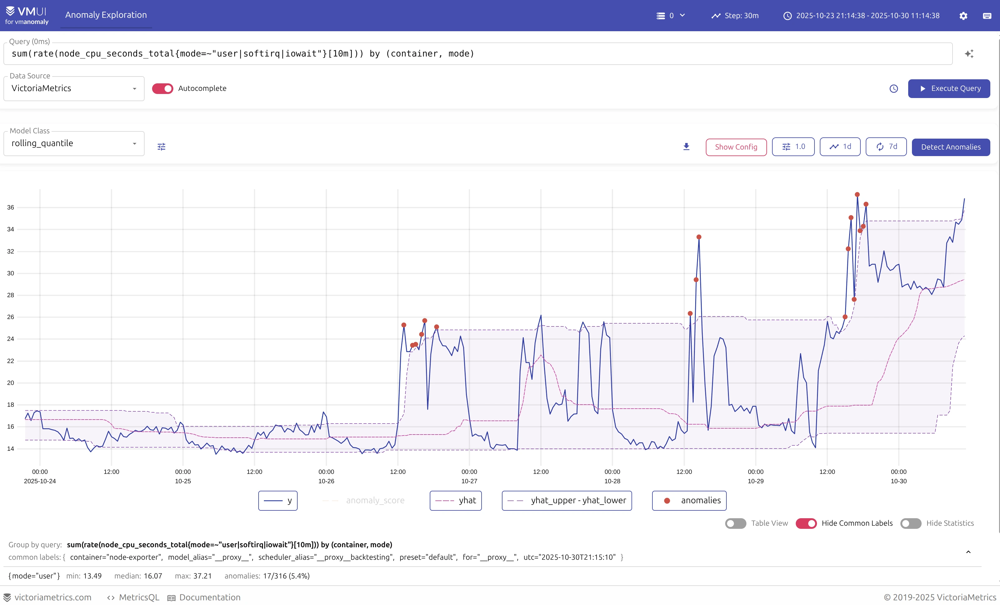
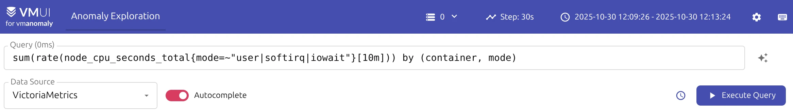
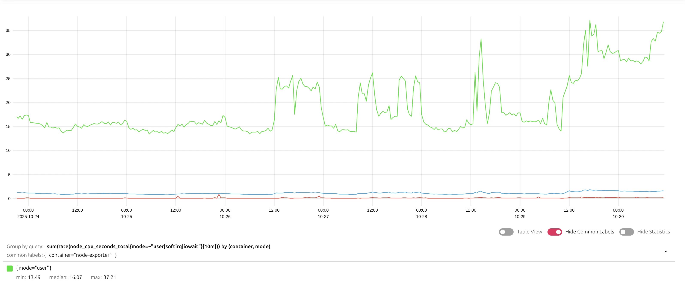
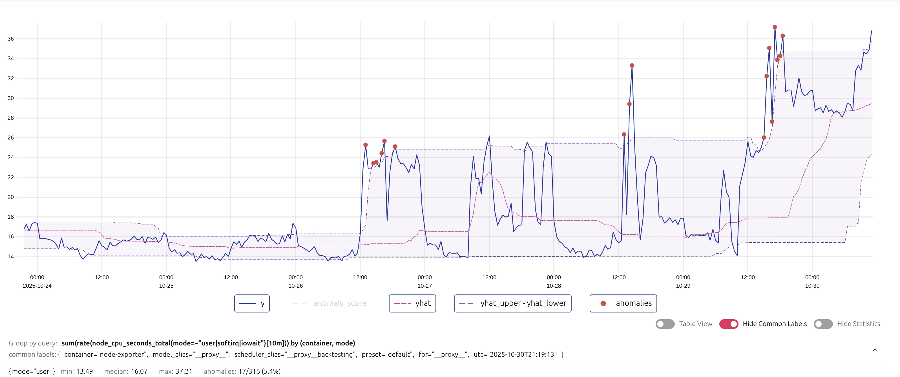
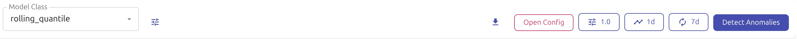
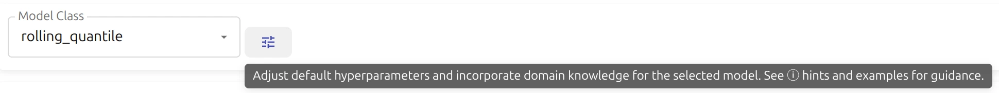
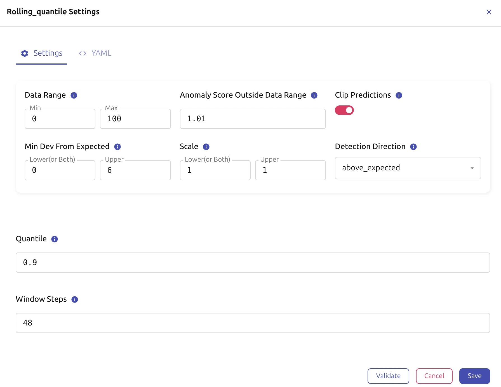
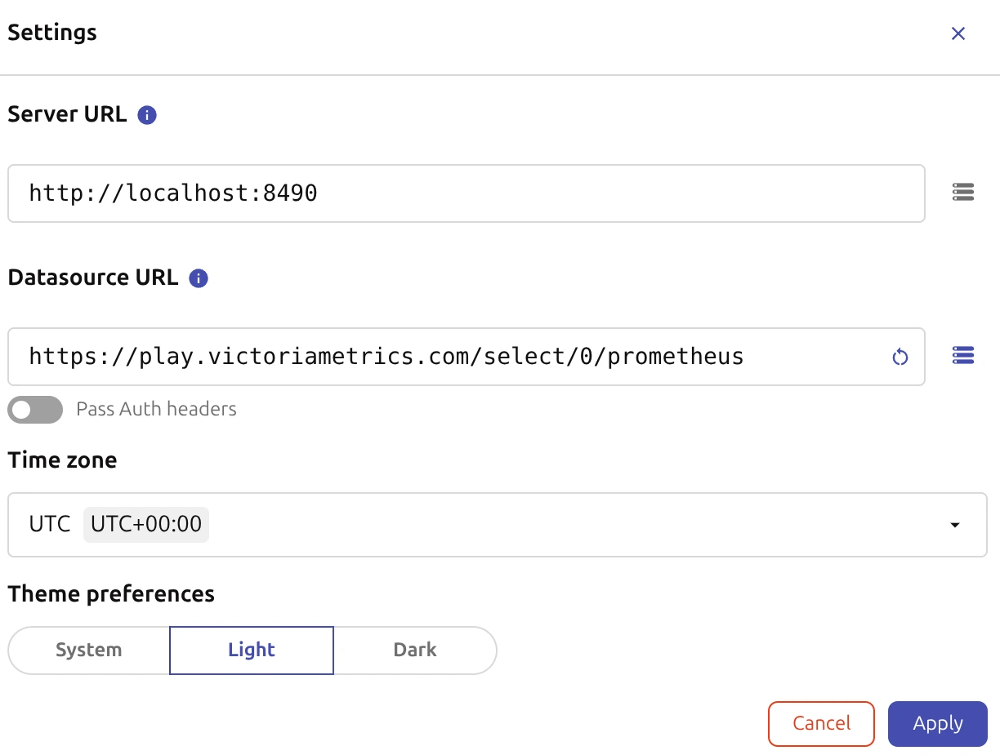
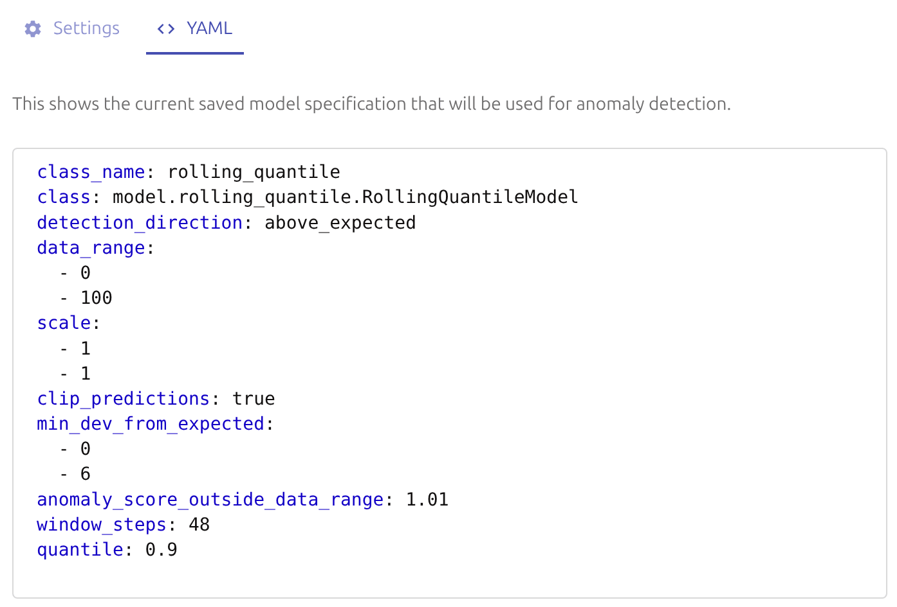
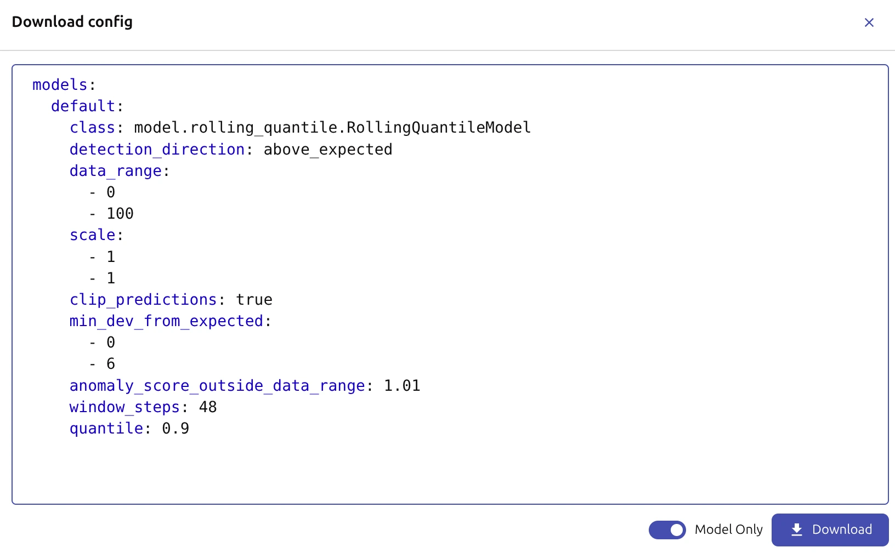

## Introduction

{} `vmanomaly` is shipped with a built-in [vmui-like](https://docs.victoriametrics.com/victoriametrics/single-server-victoriametrics/#vmui) [UI](https://en.wikipedia.org/wiki/Graphical_user_interface) that provides an intuitive interface for rapid exploration of how anomaly detection models, their configurations and included domain knowledge impacts the results of anomaly detection, before such configurations are deployed in production.



## Accessing the UI

The UI is available at `http://<vmanomaly-host>:8490` by default, however, the port can be changed in `server` section of the [configuration file](https://docs.victoriametrics.com/anomaly-detection/components/) using the `port` parameter:

```yaml
server:
  port: 8490

# other vmanomaly configuration sections, e.g. schedulers, models, reader, writer, etc.
```

For impactful parameters please refer to [optimize resource usage](#optimize-resource-usage) section of this page.

## Preset

Vmanomaly can be deployed in efficient "UI mode" [preset](https://docs.victoriametrics.com/anomaly-detection/presets/#ui), with as simple configuration as:

```yaml
preset: ui
```

This will start vmanomaly instance with a no-operation schedulers, readers, models and the other components, and **will only enable the UI for interactive exploration of anomaly detection models**, so all the resources are dedicated to the UI and no resources are wasted on other components, such as production jobs of anomaly detection (retrieving metrics, running models, writing results, etc.).

The best applications of this mode are:
- Deploy vmanomaly UI as a service to hide the deployment complexity and allow internal users to explore anomaly detection models and their configurations, without the need to run any production jobs of anomaly detection.
- When there is a quick need to explore and validate anomaly detection models and their configurations before deploying them in production jobs, at minimal resource usage.


> However, the UI can be **combined with existing production jobs of anomaly detection, as it is available in non-blocking mode for all running vmanomaly instances** {}, regardless of the preset or configuration used, just at a cost of increased resource usage.

## UI Navigation

The vmanomaly UI provides a user-friendly interface for exploring and configuring anomaly detection models. The main components of the UI include:

- [**Query Explorer**](#query-explorer): A vmui-like interface for typing and executing MetricsQL/LogsQL queries to visualize data.
- [**Model Panel**](#model-panel): A form for editing anomaly detection model hyperparameters and applying domain knowledge settings.
- [**Visualization Panel**](#visualization-panel): A space for visualizing model performance and anomalies.
- [**Settings Panel**](#settings-panel): A section for configuring global settings and preferences for the vmanomaly UI, including data source configuration.

### Query Explorer

The Query Explorer provides a vmui-like interface for typing and executing MetricsQL/LogsQL queries to visualize data. 



Users can:
- Enter, autocomplete, prettify and execute queries to retrieve and plot the data from the configured data source (see [settings panel](#settings-panel) for data source configuration).
- Adjust the (inference) time range and resolution (step) for data visualization and anomaly detection purposes.
- Access query history and saved queries for quick access to frequently used queries.
- Switch tenants (if data source supports multi-tenancy) and access [settings panel](#settings-panel) for global UI configuration.

[Back to UI navigation](#ui-navigation)

### Visualization Panel

The Visualization Panel has 2 modes of displaying data - either raw queried data or data with detected anomalies, depending on the action taken in the Model Panel.

**Visualizations of the queried data** ("Execute Query" button)



> All the metrics are shown in a single plot, similar to vmui, with zooming and panning capabilities.

**Initial data with detected anomalies** ("Detect Anomalies" button)



> The plot shows the queried data, **grouped by individual series**, iterated over legend, with the actual values (`y`) compared to the expected values (model predictions, `y_hat`), confidence intervals (`y_hat_lower`, `y_hat_upper`), and detected anomalies. The anomalies are marked with red circles, and hovering over them provides additional information such as the anomaly score and associated labels.

Also, timeseries (such as `y`, `y_hat`, etc.) can be toggled on/off by clicking on the legend items.

[Back to UI navigation](#ui-navigation)

### Model Panel



The Model Panel provides:

Parameters, such as "Fit Every" and "Fit Window", to control how often and over what time window the model is retrained on new data to imitate production behavior, as well as overriding default anomaly detection thresholds (1.0).

Controls for running/canceling anomaly detection on the queried data, downloading the results as CSV/JSON, accessing and downloading the model configuration in YAML format.

A form-based menu for finetuning model hyperparameters and applying domain knowledge settings:

- Model type selection (e.g., rolling quantile, Prophet, etc.)

- Wizard with **model-agnostic parameters** (e.g., detection direction, data range, scale, clipping, minimum deviation from expected, etc.) and **model-specific hyperparameters** for chosen model type (e.g., quantile and window steps for [rolling quantile](https://docs.victoriametrics.com/anomaly-detection/components/models/#rolling-quantile) model).


[Back to UI navigation](#ui-navigation)

### Settings Panel

The vmui-like "Settings" panel allows users to configure global settings and preferences for the vmanomaly UI, including:

- Server URL (vmanomaly)
- Datasource URL (VictoriaMetrics, VictoriaLogs)
- Timezone
- UI Theme



[Back to navigation](#ui-navigation)

## Configuration Sharing

Based on the needs, either 
- Full UI state can be [shared via URL](#url-sharing)
- Or model part / full service configuration can be [viewed and exported in production-ready YAML format](#yaml-configuration).

### URL Sharing

Similarly to vmui, vmanomaly UI supports **configuration sharing via URL**. This allows users to share their UI state (including queries, time ranges, model type and hyperparameters, and other settings) by copying and sharing the URL from the browser's address bar.


<p></p>
<p>Example URL content:</p>

```shellhelp
http://localhost:8490/vmui/#/?anomaly_threshold=1.0&fit_window=1d&fit_every=7d&g0.range_input=7d&g0.end_input=2025-09-30T16%3A56%3A13&g0.relative_time=last_7_days&g0.tab=0&g0.tenantID=0&datasourceUrl=https%3A%2F%2Fplay.victoriametrics.com%2Fselect%2F0%2Fprometheus&g0.expr=sum%28rate%28node_cpu_seconds_total%7Bmode%3D%7E%22%28softirq%7Cuser%7Ciowait%29%22%7D%5B10m%5D%29%29+by+%28container%2C+mode%29&g0.step_input=30m&model_config=%257B%2522modelType%2522%253A%2522rolling_quantile%2522%252C%2522settings%2522%253A%257B%2522detection_direction%2522%253A%2522above_expected%2522%252C%2522data_range%2522%253A%255B0%252C100%255D%252C%2522scale%2522%253A%255B1%252C1%255D%252C%2522clip_predictions%2522%253Atrue%252C%2522min_dev_from_expected%2522%253A%255B0%252C6%255D%252C%2522anomaly_score_outside_data_range%2522%253A1.01%252C%2522quantile%2522%253A0.9%252C%2522window_steps%2522%253A48%257D%252C%2522modelSpec%2522%253A%257B%2522class_name%2522%253A%2522rolling_quantile%2522%252C%2522class%2522%253A%2522model.rolling_quantile.RollingQuantileModel%2522%252C%2522detection_direction%2522%253A%2522above_expected%2522%252C%2522data_range%2522%253A%255B0%252C100%255D%252C%2522scale%2522%253A%255B1%252C1%255D%252C%2522clip_predictions%2522%253Atrue%252C%2522min_dev_from_expected%2522%253A%255B0%252C6%255D%252C%2522anomaly_score_outside_data_range%2522%253A1.01%252C%2522window_steps%2522%253A48%252C%2522quantile%2522%253A0.9%257D%252C%2522isValidated%2522%253Atrue%257D
```

### YAML Configuration

Once the configuration is set up and saved in the UI (selected model type and validated hyperparameters), equivalent configuration in production-ready YAML format can be obtained by:

Accessing the "YAML" Tab in the model configuration section




Clicking the "Open Config" button to access (model-only or full) configuration and hitting "Download" button to get the configuration as a YAML file.




## Optimize Resource Usage

Based on expected usage patterns (quick experiments, internal team serving, number of users, etc.) it is recommended to tune resource usage by adjusting the following parameters in the `server` and `settings` sections of the configuration file:

```yaml
server:
  # Port for the UI server (default: 8490)
  port: 8490
  # Limit on concurrent tasks to manage UI load (default: 2) 
  max_concurrent_tasks: 2

settings:
  # Number of workers for single job speed-ups (default: 1)
  n_workers: 2
  # Adjust logging levels to reduce verbosity  
  logger_levels: 
    vmanomaly: WARNING
    reader: INFO
    model: INFO
    # ...
```

`max_concurrent_tasks` limits the number of concurrent tasks (e.g. running anomaly detection on queried data) to avoid overloading the UI when multiple users are using it simultaneously, and `n_workers` [option](https://docs.victoriametrics.com/anomaly-detection/components/settings/#parallelization) controls the number of workers for parallel processing of single tasks (e.g. running anomaly detection on queried data faster).

Please note that numbers <= 0 for `n_workers` mean number of available CPU cores, and these workers would be shared with other components of vmanomaly, such as production jobs of anomaly detection (retrieving metrics, running models, writing results, etc.), if they are enabled.

### Preset Usage

If using the `ui` preset, just specify:

```yaml
preset: ui

server:
  # Port for the UI server (default: 8490)
  port: 8490
  # Limit on concurrent tasks to manage UI load (default: 2)
  max_concurrent_tasks: 5

settings:
  # Number of workers for single job speed-ups (default: 1)
  n_workers: 2
  # Adjust logging levels to reduce verbosity
  logger_levels:
    vmanomaly: WARNING
    # ...
```

in instance configuration file, it will be recursively merged with preset pre-filled configuration to produce the final configuration.

### Mixed Usage

If mixing the UI alongside production jobs of anomaly detection is expected, it is recommended to adjust the parameters to optimize resource usage, as well as configuring the `reader` and `writer` components appropriately for the production jobs.

```yaml

settings:
  # Number of workers for mixed usage (numbers <= 0 mean number of available CPU cores)
  n_workers: -1        
  # Adjust logging levels to reduce verbosity
  logger_levels:
    vmanomaly: WARNING
    reader: INFO
    model: INFO
    writer: INFO
    # ...

server:
  # Port for the UI server (default: 8490)
  port: 8490
  # Limit on concurrent tasks to manage UI load (default: 2)
  max_concurrent_tasks: 5

# other production components, e.g. schedulers, models, reader, writer, etc.
```

## Example Usage

Run vmanomaly in `ui` preset mode (experimenting) with a configuration file `config.yaml` (see [preset usage](#preset-usage) section for details):

```yaml
preset: ui

# other optional server/settings parameters, e.g. port, max_concurrent_tasks, n_workers, logger_levels, etc.
```

using one of the [deployment methods](https://docs.victoriametrics.com/anomaly-detection/quickstart/#how-to-install-and-run-vmanomaly) in a [QuickStart guide](https://docs.victoriametrics.com/anomaly-detection/quickstart/#quickstart), e.g. via Docker.

Retrieve the UI at `http://<vmanomaly-host>:<port>` (e.g. at `http://localhost:8490` if running locally with default port) and start exploring anomaly detection models and their configurations interactively.

### Explore Input Data

Start by entering valid MetricsQL/LogsQL queries in the Query Explorer to visualize the data from the configured data source (see [settings panel](#settings-panel) for data source configuration) - that's the data on which anomaly detection models will be applied.

Set appropriate tenants (if data source supports multi-tenancy) and access [settings panel](#settings-panel) for global UI configuration, if needed.

Set up the time range and resolution (step) for data visualization and anomaly detection purposes - e.g. last 7 days with 30m step, especially if the data has daily/weekly seasonality. Also, set the step according to the desired granularity of anomaly detection results (e.g. 30m step for 30m granularity) which itself is based on alerting needs and latency requirements.


Pay attention to trends, seasonality, noise, outliers, and other patterns in the data, which can influence the choice of anomaly detection model and its hyperparameters (e.g. use seasonal models for seasonal data - like `Prophet`, robust models for noisy de-seasonalized data - like `MAD`, etc.).


### Select and Configure Model

Choose an appropriate anomaly detection model from the Model Panel based on the characteristics of the data and the specific requirements (domain knowledge) of the use case.


Set the "Fit Every" and "Fit Window" parameters to control how often and over what time window the model is retrained on new data to imitate production behavior - e.g. fit every 7 days on a rolling window of last 14 days.

Tune the model hyperparameters and apply domain knowledge settings using the form-based menu in the Model Panel. See (i) tooltips for parameter descriptions and [model documentation](https://docs.victoriametrics.com/anomaly-detection/components/models/) link for recommended values and guidelines.


For example, for a `rolling quantile` [model](https://docs.victoriametrics.com/anomaly-detection/components/models/#rolling-quantile), that should be run on a query, returning per-mode CPU utilization (as fractions of 1, data range `[0, 1]`), where you are interested in capturing **spikes of at least 5% deviations** from expected behavior:

Set the **model-agnostic** parameters to encode the domain knowledge:
- [detection direction](https://docs.victoriametrics.com/anomaly-detection/components/models/#detection-direction) to `above expected` for capturing high anomalies (spikes)
- data range to `[0, 1]` for CPU utilization fractions and proper prediction clipping
- [minimum deviation from expected](https://docs.victoriametrics.com/anomaly-detection/components/models/#minimal-deviation-from-expected) to `[0, 0.05]` for capturing spikes of at least 5% deviations in magnitude
- [anomaly score outside data range](https://docs.victoriametrics.com/anomaly-detection/components/models/#score-outside-data-range) to `5.0` for automatically marking values outside data range as anomalies (e.g. to catch improper query returning CPU > 100% or < 0%)
- [clip predictions](https://docs.victoriametrics.com/anomaly-detection/components/models/#clip-predictions) to `true` for avoiding nonsensical predictions outside data range
- [scale](https://docs.victoriametrics.com/anomaly-detection/components/models/#scale) to `[1, 1]` unless you will see improper width of confidence intervals from the experiments (e.g. too wide/narrow) given the model-specific hyperparameters and false positives/negatives observed in the results.

Set the **model-specific** hyperparameters:
- quantile to `0.9` for detecting high anomalies
- window steps to `48` for capturing 1 day of active history with 30m step data (24/0.5 = 48)

Check the parameters for validity and consistency by hitting the "Validate" button, which will also provide warnings if some parameters seem inconsistent (e.g. quantile is set outside of `[0, 1]` range or window steps is set to a negative value), then hit "Save" to apply the changes.

### Detect Anomalies

Hit the "Detect Anomalies" button to run anomaly detection on the queried data with the selected model and its configuration.

> The long running task (e.g. detection on misconfigured query returning too much metrics) can be canceled by hitting the "Cancel" button.


Iterate over the legend to view **individual output series** (e.g. actual values, expected values, confidence intervals, anomalies, etc.) for different series returned by the query.

Iterate over **returned timeseries by query** to see how the model performed on different series, and whether the detected anomalies make sense in the context of the data and the use case (their % of total points, magnitude, duration, etc.).

Until satisfied with the results, finetune the model hyperparameters and domain knowledge settings in the Model Panel (or change the model type), and rerun anomaly detection on the queried data.

Once satisfied with the results, do the following.

>  Many tabs can be opened in parallel in the browser, so multiple experiments can be run in parallel, and the results can be compared by switching between tabs. Local settings (e.g. queries, time ranges, model configurations, etc.) are preserved in each tab, so different experiments do not interfere with each other.

### Work with Results

If the **results** do not look good, the model hyperparameters and domain knowledge settings can be further finetuned in the Model Panel, and anomaly detection can be [rerun on the queried](#detect-anomalies) data until satisfactory results are achieved.

If the **results** look good, but should be shared with others first, timeseries can be downloaded as files by hitting the respective button in the Model Panel. See also [configuration sharing](#configuration-sharing) section for details.

If the **results** look good and the **model configuration should be deployed in production jobs of anomaly detection**, the equivalent configuration in production-ready YAML format can be obtained by accessing the "YAML" Tab in the model configuration section and hitting the "Open Config" button to access (model-only or full) configuration and hitting "Download" button to get the configuration as a YAML file.

