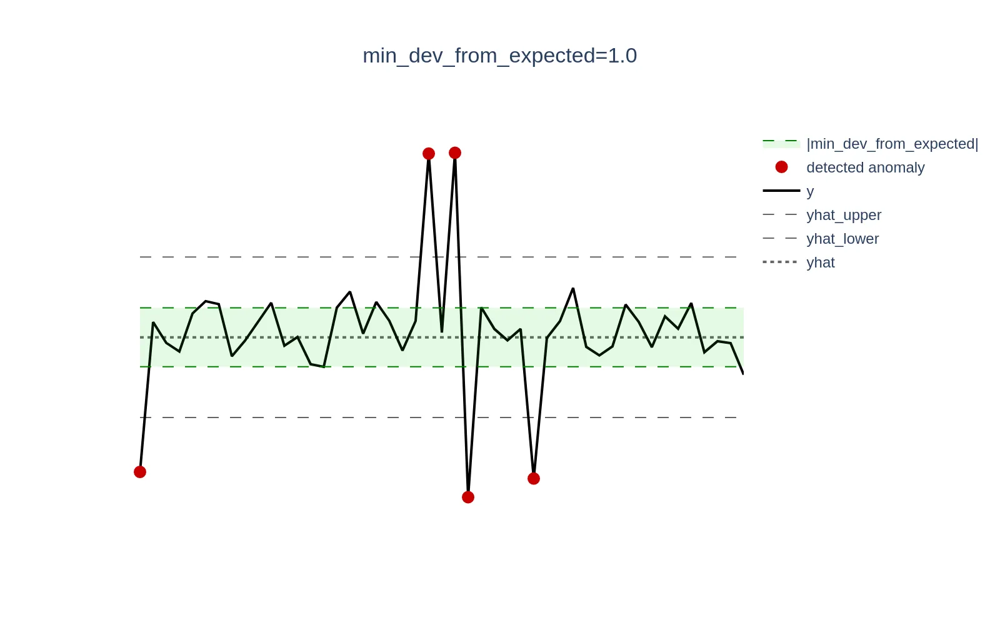

This section covers the `Models` component of VictoriaMetrics Anomaly Detection (commonly referred to as [`vmanomaly`](https://docs.victoriametrics.com/anomaly-detection/)) and provides a guide on how to configure the service.

- `vmanomaly` includes various **[built-in models](#built-in-models)**.
- You can also integrate a **custom model**—see the [custom model guide](#custom-model-guide) for more details.
- Models have **different types and properties**—refer to the [model types section](#model-types) for more information.

> Models can be dumped to disk {} instead of being stored in RAM. This option **slightly reduces inference speed but significantly decreases RAM usage**, particularly useful for larger setups. For more details, see the [relevant FAQ section](https://docs.victoriametrics.com/anomaly-detection/faq/#on-disk-mode).

> Model section in config supports multiple models via aliasing{}. <br>Also, `vmanomaly` expects model section to be named `models`. Using old (flat) format with `model` key is deprecated and will be removed in future versions. Having `model` and `models` sections simultaneously in a config will result in only `models` being used:

```yaml
models:
  model_univariate_1:
    class: 'zscore' # or 'model.zscore.ZscoreModel' until v1.13.0
    z_threshold: 2.5
    queries: ['query_alias2']  # referencing queries defined in `reader` section
  model_multivariate_1:
    class: 'isolation_forest_multivariate'  # or model.isolation_forest.IsolationForestMultivariateModel until v1.13.0
    contamination: 'auto'
    args:
      n_estimators: 100
      # i.e. to assure reproducibility of produced results each time model is fit on the same input
      random_state: 42
    # if there is no explicit `queries` arg, then the model will be run on ALL queries found in reader section
# ...
```  

Old-style configs (< [1.10.0](https://docs.victoriametrics.com/anomaly-detection/changelog/#1100))

```yaml
model:
    class: "zscore"  # or 'model.zscore.ZscoreModel' until v1.13.0
    z_threshold: 3.0
    # no explicit `queries` arg is provided
# ...
```

will be **implicitly** converted to

```yaml
models:
  default_model:  # default model alias, backward compatibility
    class: "model.zscore.ZscoreModel"
    z_threshold: 3.0
    # queries arg is created and propagated with all query aliases found in `queries` arg of `reader` section
    queries: ['q1', 'q2', 'q3']  # i.e., if your `queries` in `reader` section has exactly q1, q2, q3 aliases
# ...
```


## Common args

From [1.10.0](https://docs.victoriametrics.com/anomaly-detection/changelog/#1100), **common args**, supported by *every model (and model type)* were introduced.

### Queries

As a part to support multi-model configs{}, `queries` arg is meant to define [queries from VmReader](https://docs.victoriametrics.com/anomaly-detection/components/reader/#config-parameters) particular model should be run on (meaning, all the series returned by each of these queries will be used in such model for fitting and inferencing).

`queries` arg is supported for all [the built-in](#built-in-models) (as well as for [custom](#custom-model-guide)) models.

This arg is **backward compatible** - if there is no explicit `queries` arg, then the model, defined in a config, will be run on ALL queries found in reader section:

```yaml
models:
  model_alias_1:
    # ...
    # no explicit `queries` arg is provided
```

will be implicitly converted to

```yaml
models:
  model_alias_1:
    # ...
    # if not set, `queries` arg is created and propagated with all query aliases found in `queries` arg of `reader` section
    queries: ['q1', 'q2', 'q3']  # i.e., if your `queries` in `reader` section has exactly q1, q2, q3 aliases
```

### Schedulers

As a part to support multi-scheduler configs{}, `schedulers` arg is meant to define [schedulers](https://docs.victoriametrics.com/anomaly-detection/components/scheduler/) particular model should be attached to.

`schedulers` arg is supported for all [the built-in](#built-in-models) (as well as for [custom](#custom-model-guide)) models.

This arg is **backward compatible** - if there is no explicit `schedulers` arg, then the model, defined in a config, will be attached to ALL the schedulers found in scheduler section:

```yaml
models:
  model_alias_1:
    # ...
    # no explicit `schedulers` arg is provided
```

will be implicitly converted to

```yaml
models:
  model_alias_1:
    # ...
    # if not set, `schedulers` arg is created and propagated with all scheduler aliases found in `schedulers` section
    schedulers: ['s1', 's2', 's3']  # i.e., if your `schedulers` section has exactly s1, s2, s3 aliases
```

### Provide series

`provide_series`{} arg limit the [output generated](#vmanomaly-output) by `vmanomaly` for writing. I.e. if the model produces default output series `['anomaly_score', 'yhat', 'yhat_lower', 'yhat_upper']` by specifying `provide_series` section as below, you limit the data being written to only `['anomaly_score']` for each metric received as a subject to anomaly detection.

```yaml
models:
  model_alias_1:
    # ...
    provide_series: ['anomaly_score']  # only `anomaly_score` metric will be available for writing back to the database
```

> If `provide_series` is not specified in model config, the model will produce its default [model-dependent output](#vmanomaly-output). The output can't be less than `['anomaly_score']`. Even if `timestamp` column is omitted, it will be implicitly added to `provide_series` list, as it's required for metrics to be properly written.

### Detection direction
`detection_direction`{} arg can help in reducing the number of [false positives](https://victoriametrics.com/blog/victoriametrics-anomaly-detection-handbook-chapter-1/#false-positive) and increasing the accuracy, when domain knowledge suggest to identify anomalies occurring when actual values (`y`) are *above, below, or in both directions* relative to the expected values (`yhat`). Available choices are: `both`, `above_expected`, `below_expected`.

Here's how default (backward-compatible) behavior looks like - anomalies will be tracked in `both` directions (`y > yhat` or `y < yhat`). This is useful when there is no domain expertise to filter the required direction.


When set to `above_expected`, anomalies are tracked only when `y > yhat`.

*Example metrics*: Error rate, response time, page load time, number of failed transactions - metrics where *lower values are better*, so **higher** values are typically tracked.


When set to `below_expected`, anomalies are tracked only when `y < yhat`. 

*Example metrics*: Service Level Agreement (SLA) compliance, conversion rate, Customer Satisfaction Score (CSAT) - metrics where *higher values are better*, so **lower** values are typically tracked.


Config with a split example:

```yaml
models:
  model_above_expected:
    class: 'zscore' # or 'model.zscore.ZscoreModel' until v1.13.0
    z_threshold: 3.0
    # track only cases when y > yhat, otherwise anomaly_score would be explicitly set to 0
    detection_direction: 'above_expected'
    # for this query we do not need to track lower values, thus, set anomaly detection tracking for y > yhat (above_expected)
    queries: ['query_values_the_lower_the_better']
  model_below_expected:
    class: 'zscore' # or 'model.zscore.ZscoreModel' until v1.13.0
    z_threshold: 3.0
    # track only cases when y < yhat, otherwise anomaly_score would be explicitly set to 0
    detection_direction: 'below_expected'
    # for this query we do not need to track higher values, thus, set anomaly detection tracking for y < yhat (above_expected)
    queries: ['query_values_the_higher_the_better']
  model_bidirectional_default:
    class: 'zscore' # or 'model.zscore.ZscoreModel' until v1.13.0
    z_threshold: 3.0
    # track in both direction, same backward-compatible behavior in case this arg is missing
    detection_direction: 'both'
    # for this query both directions can be equally important for anomaly detection, thus, setting it bidirectional (both)
    queries: ['query_values_both_direction_matters']
reader:
  # ...
  queries:
    query_values_the_lower_the_better: metricsql_expression1
    query_values_the_higher_the_better: metricsql_expression2
    query_values_both_direction_matters: metricsql_expression3
# other components like writer, schedule, monitoring
```

### Minimal deviation from expected

`min_dev_from_expected`{} argument is designed to **reduce [false positives](https://victoriametrics.com/blog/victoriametrics-anomaly-detection-handbook-chapter-1/#false-positive)** in scenarios where deviations between the actual value (`y`) and the expected value (`yhat`) are **relatively** high. Such deviations can cause models to generate high [anomaly scores](https://docs.victoriametrics.com/anomaly-detection/faq/#what-is-anomaly-score). However, these deviations may not be significant enough in **absolute values** from a business perspective to be considered anomalies. This parameter ensures that anomaly scores for data points where `|y - yhat| < min_dev_from_expected` are explicitly set to 0. By default, if this parameter is not set, it is set to `0` to maintain backward compatibility.

> {} The `min_dev_from_expected` argument can be a list of two float values, allowing separate thresholds for upper and lower deviations. This is useful when the acceptable deviation varies in different directions (e.g., `min_dev_from_expected: [0.01, 0.02]` means that the lower bound is `0.01` when `y` is less than `yhat` and the upper bound is `0.02` when `y` is greater than `yhat`). If only one value is provided, it is broadcasted to both directions, meaning that the same threshold is applied for both upper and lower deviations (e.g., `min_dev_from_expected: 0.01` means that the lower bound is `0.01` when `y` is less than `yhat` and the upper bound is also `0.01` when `y` is greater than `yhat`).

> `min_dev_from_expected` must be >= 0. The higher the value of `min_dev_from_expected`, the more significant the deviation must be to generate an anomaly score > 1. This helps in filtering out small deviations that may not be meaningful in the context of the monitored metric.

*Example*: Consider a scenario where CPU utilization is low and oscillates around 0.3% (0.003). A sudden spike to 1.3% (0.013) represents a +333% increase in **relative** terms, but only a +1 percentage point (0.01) increase in **absolute** terms, which may be negligible and not warrant an alert. Setting the `min_dev_from_expected` argument to `0.01` (1%) will ensure that all anomaly scores for deviations <= `0.01` are set to 0.

Visualizations below demonstrate this concept; the green zone defined as the `[yhat - min_dev_from_expected, yhat + min_dev_from_expected]` range excludes actual data points (`y`) from generating anomaly scores if they fall within that range.





Example config of how to use this param based on query results:

```yaml
# other components like writer, schedulers, monitoring ...
reader:
  # ...
  queries:
    # the usage of min_dev should reduce false positives here
    need_to_include_min_dev: small_abs_values_metricsql_expression
    # min_dev is not really needed here
    normal_behavior: no_need_to_exclude_small_deviations_metricsql_expression
models:
  zscore_with_min_dev:
    class: 'zscore' # or 'model.zscore.ZscoreModel' until v1.13.0
    z_threshold: 3
    min_dev_from_expected: [5.0, 5.0]
    queries: ['need_to_include_min_dev']  # use such models on queries where domain experience confirm usefulness
  zscore_wo_min_dev:
    class: 'zscore' # or 'model.zscore.ZscoreModel' until v1.13.0
    z_threshold: 3
    # if not set, equals to setting min_dev_from_expected == 0 (meaning no filtering is applied)
    # min_dev_from_expected: [0.0, 0.0]
    queries: ['normal_behavior']  # use the default where it's not needed
```

### Group by

> The `groupby` argument works only in combination with [multivariate models](#multivariate-models).

The `groupby` argument{} (`list[string]`) enables logical grouping within [multivariate models](#multivariate-models). When specified, **a separate multivariate model is trained for each unique combination of label values present in the `groupby` columns**.

For example, to perform multivariate anomaly detection at the machine level while avoiding interference between different entities, you can set `groupby: [host]` or `groupby: [instance]`. This ensures that a **separate multivariate** model is trained for each individual entity (e.g., per host). Below is a simplified example illustrating how to track multivariate anomalies using CPU, RAM, and network data for each host.

```yaml
# other config sections ...
reader:
  # other reader params ...
  # assume there are M unique hosts identified by the `host` label
  queries:
    # return one timeseries for each CPU mode per host, total = N*M timeseries
    cpu: sum(rate(node_cpu_seconds_total[5m])) by (host, mode)
    # return one timeseries per host, total = 1*M timeseries
    ram: | 
      (
       (node_memory_MemTotal_bytes - node_memory_MemAvailable_bytes) 
       / node_memory_MemTotal_bytes
      ) * 100 by (host)
    # return one timeseries per host for both network receive and transmit data, total = 1*M timeseries
    network: |
      sum(rate(node_network_receive_bytes_total[5m])) by (host) 
      + sum(rate(node_network_transmit_bytes_total[5m])) by (host)

models:
  iforest: # alias for the model
    class: isolation_forest_multivariate
    contamination: 0.01
    # the multivariate model can be trained on 2+ timeseries returned by 1+ queries
    queries: [cpu, ram, network]
    # train a distinct multivariate model for each unique value found in the `host` label
    # a single multivariate model will be trained on (N + 1 + 1) timeseries, total = M models
    groupby: [host]
```

### Scale

Previously available only to [ProphetModel](#prophet) and [OnlineQuantileModel](#online-seasonal-quantile),  the `scale` {} parameter is now applicable to all models that support generating predictions (`yhat`, `yhat_lower`, `yhat_upper`). Also, it is **two-sided** now, represented as a list of two positive float values, allowing separate scaling for the intervals `[yhat, yhat_upper]` and `[yhat_lower, yhat]`. The new margins are calculated as:

- **Upper margin:** `|yhat_upper - yhat| * scale_upper`
- **Lower margin:** `|yhat - yhat_lower| * scale_lower`

For backward compatibility, the previous format (`scale: x`) remains supported and will be automatically converted to `scale: [x, x]`.

For example, setting `scale: [1.2, 0.75]` for particular model will:
- **Increase** the width of the lower confidence interval by **20%**.
- **Decrease** the width of the upper confidence boundary by **25%**.

The most common **use case** is when there is a preference to **widen one side** to blacklist smaller false positives (which otherwise would have [anomaly scores](https://docs.victoriametrics.com/anomaly-detection/faq/#how-is-anomaly-score-calculated) **only slightly higher than 1.0**, still making such data points **anomalous**), while **tightening the other side** to avoid missing true positives due to an overly loose margin (leading to [anomaly scores](https://docs.victoriametrics.com/anomaly-detection/faq/#how-is-anomaly-score-calculated) being slightly less than 1.0, making such data points **non-anomalous**).

```yaml
# other components like reader, writer, schedulers, monitoring ...
models:
  zscore_no_scale:
    class: 'zscore' # or 'model.zscore.ZscoreModel' until v1.13.0
    z_threshold: 3
    # if not set, equals to [1.0, 1.0], meaning no scaling is applied
    # scale: [1.0, 1.0]
  zscore_scaled:
    class: 'zscore' # or 'model.zscore.ZscoreModel' until v1.13.0
    z_threshold: 3
    # vs `zscore_no_scale`, increase lower confidence interval width by 1.2x, decrease upper confidence width by 25%
    scale: [1.2, 0.75]
```

### Clip predictions

A post-processing step to **clip model predictions** (`yhat`, `yhat_lower`, and `yhat_upper` series) to the configured [`data_range` values](https://docs.victoriametrics.com/anomaly-detection/components/reader/#config-parameters) in `VmReader` is available.

This behavior is controlled by the boolean argument `clip_predictions` {}:
- **Disabled by default** for backward compatibility.
- **Works** for models that generate predictions and estimates (e.g., [`ProphetModel`](#prophet)) by setting `clip_predictions` to `True` for respective model in `models` section.

The primary use case is to **align domain knowledge** about data behavior (defined via `data_range`) with what is shown in visualizations, such as in the [Grafana dashboard](https://docs.victoriametrics.com/anomaly-detection/presets/#grafana-dashboard). This ensures that predictions (`yhat`, `yhat_lower`, `yhat_upper`) are plotted consistently alongside real metric values (`y`) and remain within reasonable expected bounds.

> This parameter does not impact the generation of anomaly scores > 1 for datapoints where `y` falls outside the defined `data_range`.

```yaml
# other components like writer, schedulers, monitoring ...
reader:
  # ...
  queries:
    q1_clipped: 
      expr: 'q1_metricsql'
      data_range: [0, "inf"]
    q2_no_clip:
      expr: 'q2_metricsql'
      # if no data range defined, it will be implicitly converted to ["-inf", "inf"]
models:
  zscore_mixed:
    class: 'zscore' # or 'model.zscore.ZscoreModel' until v1.13.0
    z_threshold: 3
    clip_predictions: True
    queries: [
      # `yhat`, `yhat_lower`, `yhat_upper` will be within [0, inf]
      # for all `zscore_mixed` instances that are fit on series returned by `q1_clipped` query
      # anomaly scores > 1 will still be produced for `y` outside of data_range
      'q1_clipped',
      # there will be no (explicit) clip of `yhat`, `yhat_lower`, `yhat_upper`
      # for all `zscore_mixed` instances that are fit on series returned by `q2_no_clip` query
      # even when `clip_predictions` arg is set, because data_range was not set for `q2_no_clip`
      'q2_no_clip',
    ]
  zscore_no_clip:
    class: 'zscore' # or 'model.zscore.ZscoreModel' until v1.13.0
    z_threshold: 3
    # if not set, by default resolved to `clip_predictions: False`
    queries: [
      # `yhat`, `yhat_lower`, `yhat_upper` won't be clipped to [0, inf] 
      # even though `data_range` for `q1_clipped` is set
      # however, anomaly scores > 1 will still be produced for y outside of data_range
      'q1_clipped',
      # there will be no (explicit) clip of yhat, yhat_lower, yhat_upper  
      # for all `zscore_mixed` instances that are fit on series returned by `q2_no_clip` query
      # as `clip_predictions` arg is not set, regardless of data_range for `q2_no_clip`
      'q2_no_clip',
    ]
```

### Score outside data range

The `anomaly_score_outside_data_range` {} parameter allows overriding the default **anomaly score (`1.01`)** assigned when actual values (`y`) fall **outside the defined `data_range` if defined in [reader](https://docs.victoriametrics.com/anomaly-detection/components/reader/)**. This provides greater flexibility for **alerting rule configurations** and enables **clearer visual differentiation** between different types of anomalies:

- By default, `y` values **outside `data_range`** trigger an anomaly score of `1.01`, which serves as a basic alerting rule.
- However, some users may require **higher anomaly scores** (e.g., `> 1.2`) to **trigger alerts reliably** in their monitoring setups.

**How it works**
- If **not set**, the **default value (`1.01`)** is used for backward compatibility.
- If defined at the **service level** (`settings` [section](https://docs.victoriametrics.com/anomaly-detection/components/settings/#anomaly-score-outside-data-range)), it applies to all models **unless overridden at the model level**.
- If set **per model**, it takes **priority over the global setting**.

**Example (override)**

```yaml
settings:
  # other parameters ...
  # all the models in `models` section will inherit this value unless overridden at the model level
  anomaly_score_outside_data_range: 1.2

models:
  model_score_override:
    class: 'zscore_online'
    # explicitly set, takes priority over `settings`'s value
    anomaly_score_outside_data_range: 1.5
  model_score_from_settings_level:
    class: 'zscore_online'
    # inherits from `settings`, will be `1.2`, same as setting
    # anomaly_score_outside_data_range: 1.2
```

**Example (default vs custom)**

```yaml
models:
  model_default_score:
    class: 'zscore_online'
    # default anomaly score (1.01) is applied when y is outside data_range, same as setting
    # anomaly_score_outside_data_range: 1.01
  model_higher_out_of_data_range_score:
    class: 'zscore_online'
    # explicitly set, takes priority over `settings`'s value
    anomaly_score_outside_data_range: 3.0  
```

### Decay

> The `decay` argument works only in combination with [online models](#online-models) like [`ZScoreOnlineModel`](#online-z-score) or [`OnlineQuantileModel`](#online-seasonal-quantile).

The `decay` {} argument is used to control the (exponential) **decay factor** for online models, which determines how quickly the model adapts to new data. It is a float value between `0.0` and `1.0`, where:
- `1.0` means no decay (the model treats all data equally, without giving more weight to recent data). This is the default value for backward compatibility.
- Less than `1.0` means that the model will give more weight to recent data, effectively "forgetting" older data over time.

Roughly speaking, for the recent N datapoints model processes `decay` = `d` means that these datapoints will contribute to the model as [1 - d^X] percent of total importance, for example decay of
- `0.99` means that 100 recent datapoints will contribute as [1 - 0.99^100] = 63.23% of total importance
- `0.999` means that 1000 recent datapoints will contribute as [1 - 0.999^1000] = 63.23% of total importance

For example, if the model is updated every 5 minutes (`scheduler.infer_every`), on five 1-minute datapoints and there is a need to keep the last 1 day of data as the most impactful, setting `decay: 0.996` will ensure that the model has the last (86400/60) = 1440 datapoints contributing as [1 - 0.996^1440] = 99.6% of total importance, without the need to re-train the model on all 1440 datapoints every day with `fit_every: 1d` (which would be the limitation for [offline models](#offline-models)).

Example config:

```yaml
# other components like writer, schedulers, monitoring ...
reader:
  # ...
  queries:
    q1: metricsql_expression1
    # ...

models:
  online_zscore:
    class: 'zscore_online'
    z_threshold: 3.0
    decay: 0.996  # decay factor for online model, default is 1.0
    queries: ['q1']
```


## Model types

There are **2 model types**, supported in `vmanomaly`, resulting in **4 possible combinations**:

- [Univariate models](#univariate-models)
- [Multivariate models](#multivariate-models)

Each of these models can be of type
- [Rolling](#rolling-models)
- [Non-rolling](#non-rolling-models)

Moreover, {}, there exist **[online (incremental) models](#online-models)** subclass. Please refer to the [correspondent section](#online-models) for more details.

### Univariate Models

For a univariate type, **one separate model** is fit/used for inference per **each time series**, defined in its [queries](#queries) arg.

For example, if you have some **univariate** model, defined to use 3 [MetricQL queries](https://docs.victoriametrics.com/victoriametrics/metricsql/), each returning 5 time series, there will be 3*5=15 models created in total. Each such model produce **individual [output](#vmanomaly-output)** for each of time series. 

If during an inference, you got a series having **new labelset** (not present in any of fitted models), the inference will be skipped until you get a model, trained particularly for such labelset during forthcoming re-fit step.

**Implications:** Univariate models are a go-to default, when your queries returns **changing** amount of **individual** time series of **different** magnitude, [trend](https://victoriametrics.com/blog/victoriametrics-anomaly-detection-handbook-chapter-1/#trend) or [seasonality](https://victoriametrics.com/blog/victoriametrics-anomaly-detection-handbook-chapter-1/#seasonality), so you won't be mixing incompatible data with different behavior within a single fit model (context isolation).

**Examples:** [Prophet](#prophet), [Holt-Winters](#holt-winters)


### Multivariate Models

For a multivariate type, **one shared model** is fit/used for inference on **all time series** simultaneously, defined in its [queries](#queries) arg. 

For example, if you have some **multivariate** model to use 3 [MetricQL queries](https://docs.victoriametrics.com/victoriametrics/metricsql/), each returning 5 time series, there will be one shared model created in total. Once fit, this model will expect **exactly 15 time series with exact same labelsets as an input**. This model will produce **one shared [output](#vmanomaly-output)**.

> {} N models — one for each N unique combinations of label values specified in the `groupby` [common argument](#group-by) — can be trained. This allows for context separation (e.g., one model per host, region, or other relevant grouping label), leading to improved accuracy and faster training. See an example [here](#group-by).

If during an inference, you got a **different amount of series** or some series having a **new labelset** (not present in any of fitted models), the inference will be skipped until you get a model, trained particularly for such labelset during forthcoming re-fit step. 

**Implications:** Multivariate models are a go-to default, when your queries returns **fixed** amount of **individual** time series (say, some aggregations), to be used for adding cross-series (and cross-query) context, useful for catching [collective anomalies](https://victoriametrics.com/blog/victoriametrics-anomaly-detection-handbook-chapter-2/#collective-anomalies) or [novelties](https://victoriametrics.com/blog/victoriametrics-anomaly-detection-handbook-chapter-2/#novelties) (expanded to multi-input scenario). For example, you may set it up for anomaly detection of CPU usage in different modes (`idle`, `user`, `system`, etc.) and use its cross-dependencies to detect **unseen (in fit data)** behavior.

**Examples:** [IsolationForest](#isolation-forest-multivariate)


### Rolling Models

A rolling model is a model that, once trained, **cannot be (naturally) used to make inference on data, not seen during its fit phase**.

An instance of rolling model is **simultaneously fit and used for inference** during its `infer` method call.

As a result, such model instances are **not stored** between consecutive re-fit calls (defined by `fit_every` [arg](https://docs.victoriametrics.com/anomaly-detection/components/scheduler/#periodic-scheduler) in `PeriodicScheduler`), leading to **lower RAM** consumption.

Such models put **more pressure** on your reader's source, i.e. if your model should be fit on large amount of data (say, 14 days with 1-minute resolution) and at the same time you have **frequent inference** (say, once per minute) on new chunks of data - that's because such models require (fit + infer) window of data to be fit first to be used later in each inference call.

> Rolling models require `fit_every` either to be missing or explicitly set equal to `infer_every` in your [PeriodicScheduler](https://docs.victoriametrics.com/anomaly-detection/components/scheduler/#periodic-scheduler).

**Examples:** [RollingQuantile](#rolling-quantile)


### Non-Rolling Models

Everything that is not classified as [rolling](#rolling-models). 

Produced models can be explicitly used to **infer on data, not seen during its fit phase**, thus, it **doesn't require re-fit procedure**.

Such models put **less pressure** on your reader's source, i.e. if you fit on large amount of data (say, 14 days with 1-minute resolution) but do it occasionally (say, once per day), at the same time you have **frequent inference**(say, once per minute) on new chunks of data

> However, it's still highly recommended, to keep your model up-to-date with tendencies found in your data as it evolves in time.

Produced model instances are **stored in-memory** between consecutive re-fit calls (defined by `fit_every` [arg](https://docs.victoriametrics.com/anomaly-detection/components/scheduler/#periodic-scheduler) in `PeriodicScheduler`), leading to **higher RAM** consumption.

**Examples:** [Prophet](#prophet)


### Online Models

> Online models are best used **in combination with [stateful service](https://docs.victoriametrics.com/anomaly-detection/components/settings/#state-restoration) {} to ensure that the model state is preserved if the service restarts and any aggregated model updates are not lost**. E.g. if the model was already trained on many weeks of data and is being updated on new datapoints every minute, there is no need to re-train it from scratch on the same data after each restart, as it can continue to update restored state on new datapoints.

Online (incremental) models {} allow defining a smaller frame `fit_window` and less frequent `fit` calls to reduce the data burden from VictoriaMetrics. They make incremental updates to model parameters during each `infer_every` call, even on a single datapoint.
If the model doesn't support online mode, it's called **offline** (its parameters are only updated during `fit` calls).

Main differences between offline and online:

**Fit stage**
- Both types have a `fit` stage, run on the `fit_window` data frame.
- For offline models, `fit_window` should contain enough data to train the model (e.g., 2 seasonal periods).
- For online models, training can start gradually from smaller chunks (e.g., 1 hour).

**Infer stage**
- Both types have an `infer` stage, run on new datapoints (timestamps > last seen timestamp of the previous `infer` call).
- Offline models use a pre-trained (during `fit` call) *static* model to make every `infer` call until the next `fit` call, when the model is completely re-trained.
- Online models use a pre-trained (during `fit` call) *dynamic* model, which is gradually updated during each `infer` call with new datapoints. However, to prevent the model from accumulating outdated behavior, each `fit` call resets the model from scratch.

**Strengths**:

- The ability to distribute the data load evenly between the initial `fit` and subsequent `infer` calls. For example, an online model can be fit on 10 `1m` datapoints during the initial `fit` stage once per month and then be gradually updated on the same 10 `1m` datapoints during each `infer` call each 10 minutes.
- The model can adapt to new data patterns (gradually updating itself during each `infer` call) without needing to wait for the next `fit` call and one big re-training.
- Slightly faster training/updating times compared to similar offline models.
- Please refer to additional benefits for data-intensive setups in correspondent [FAQ](https://docs.victoriametrics.com/anomaly-detection/faq/#online-models) section.

**Limitations**:

- Until the online model sees enough data (especially if the data shows strong seasonality), its predictions might be unstable, producing more [false positives](https://victoriametrics.com/blog/victoriametrics-anomaly-detection-handbook-chapter-1/#false-positive) (`anomaly_score > 1`) or making [false negative predictions, skipping real anomalies](https://victoriametrics.com/blog/victoriametrics-anomaly-detection-handbook-chapter-1/#false-negative).
- Not all models (e.g., complex ones like [Prophet](#prophet)) have a direct online alternative, thus their applicability can be somewhat limited.

Each of the ([built-in](#built-in-models) or [custom](#custom-model-guide)) online models (like [`OnlineZscoreModel`](#online-z-score)) shares the following common parameters and properties:
- `n_samples_seen_` (int) - this model *property* refers to the number of datapoints the model was trained on and increases from 0 (before the first `fit`) with each consecutive `infer` call.
- `min_n_samples_seen` (int), optional - this *parameter* defines the minimum number of samples to be seen before reliably computing the [anomaly score](https://docs.victoriametrics.com/anomaly-detection/faq/#what-is-anomaly-score). Otherwise, the anomaly score will be 0 until `n_samples_seen_` > `min_n_samples_seen`, as there is not enough data to trust the model's predictions. For example, if your data has hourly seasonality and '1m' frequency, setting `min_n_samples_seen_` to 288 (1440 minutes in a day / 5 minutes) should be sufficient.


### Offline models

Every other model that isn't [online](#online-models). Offline models are completely re-trained during `fit` call and aren't updated during consecutive `infer` calls.


## Built-in Models 

### Overview
Built-in models support 2 groups of arguments:

- **`vmanomaly`-specific** arguments - please refer to *Parameters specific for vmanomaly* and *Default model parameters* subsections for each of the models below.
- Arguments to **inner model** (say, [Facebook's Prophet](https://facebook.github.io/prophet/docs/quick_start#python-api)), passed inside `args` argument as key-value pairs, that will be directly given to the model during initialization to allow granular control. Optional.

> For users who may not be familiar with Python data types such as `list[dict]`, a [dictionary](https://www.w3schools.com/python/python_dictionaries.asp) in Python is a data structure that stores data values in key-value pairs. This structure allows for efficient data retrieval and management.


**Models**:
* [AutoTuned](#autotuned) - designed to take the cognitive load off the user, allowing any of built-in models below to be re-tuned for best hyperparameters on data seen during each `fit` phase of the algorithm. Tradeoff is between increased computational time and optimized results / simpler maintenance.
* [Prophet](#prophet) - the most versatile one for production usage, especially for complex data ([trends](https://victoriametrics.com/blog/victoriametrics-anomaly-detection-handbook-chapter-1/#trend), [change points](https://victoriametrics.com/blog/victoriametrics-anomaly-detection-handbook-chapter-2/#novelties), [multi-seasonality](https://victoriametrics.com/blog/victoriametrics-anomaly-detection-handbook-chapter-1/#seasonality))
* [Z-score](#z-score) - useful for initial testing and for simpler data ([de-trended](https://victoriametrics.com/blog/victoriametrics-anomaly-detection-handbook-chapter-1/#trend) data without strict [seasonality](https://victoriametrics.com/blog/victoriametrics-anomaly-detection-handbook-chapter-1/#seasonality) and with anomalies of similar magnitude as your "normal" data)
* [Online Z-score](#online-z-score) - [online](#online-models) alternative to [Z-score](#z-score) model with exact same behavior and use cases.
* [Holt-Winters](#holt-winters) - well-suited for **data with moderate complexity**, exhibiting distinct [trends](https://victoriametrics.com/blog/victoriametrics-anomaly-detection-handbook-chapter-1/#trend) and/or [single seasonal pattern](https://victoriametrics.com/blog/victoriametrics-anomaly-detection-handbook-chapter-1/#seasonality).
* [MAD (Median Absolute Deviation)](#mad-median-absolute-deviation) - similarly to [Z-score](#z-score), is effective for **identifying outliers in relatively consistent data** (useful for detecting sudden, stark deviations from the median).
* [Online MAD](#online-mad) - approximate [online](#online-models) alternative to [MAD model](#mad-median-absolute-deviation), appropriate for the same use cases.
* [Rolling Quantile](#rolling-quantile) - best for **data with evolving patterns**, as it adapts to changes over a rolling window.
* [Online Seasonal Quantile](#online-seasonal-quantile) - best used on **[de-trended](https://victoriametrics.com/blog/victoriametrics-anomaly-detection-handbook-chapter-1/#trend) data with strong (possibly multiple) [seasonalities](https://victoriametrics.com/blog/victoriametrics-anomaly-detection-handbook-chapter-1/#seasonality)**. Can act as a (slightly less powerful) [online](#online-models) replacement to [`ProphetModel`](#prophet).
* [Seasonal Trend Decomposition](#seasonal-trend-decomposition) - similarly to Holt-Winters, is best for **data with pronounced [seasonal](https://victoriametrics.com/blog/victoriametrics-anomaly-detection-handbook-chapter-1/#seasonality) and [trend](https://victoriametrics.com/blog/victoriametrics-anomaly-detection-handbook-chapter-1/#trend) components**
* [Isolation forest (Multivariate)](#isolation-forest-multivariate) - useful for **metrics data interaction** (several queries/metrics -> single anomaly score) and **efficient in detecting anomalies in high-dimensional datasets**
* [Custom model](#custom-model-guide) - benefit from your own models and expertise to better support your **unique use case**.


### AutoTuned
Tuning [hyperparameters](https://en.wikipedia.org/wiki/Hyperparameter_(machine_learning)) of a model can be tricky and often requires in-depth knowledge of Machine Learning or underlying model specific. `AutoTunedModel` wrapper is designed specifically to take off the cognitive load from the user, allowing any of built-in models below to be re-tuned for best hyperparameters on data seen during each `fit` phase of the algorithm - specify as little as `anomaly_percentage` param from `[0, 0.5)` interval and `tuned_model_class` (i.e. [`zscore`](https://docs.victoriametrics.com/anomaly-detection/components/models/#z-score)) to get it working with best settings that match your expectations.

> Using autotune on `tuned_model_class` if run on a [query](#queries) that returns more than 1 timeseries, will result in **one model per each unique labelset** with **probably different [hyperparameters](https://en.wikipedia.org/wiki/Hyperparameter_(machine_learning))** found for each of them. This is useful for further context separation in contrast to using `tuned_model_class` directly, which will result in the same amount of models as there are timeseries returned by the query, but with **the same hyperparameters** for each of them. E.g.
> ```yaml
> models:
>   # this may result in 1 model per each unique labelset with different hyperparameters, such as z_threshold
>   autotuned_model:
>     class: 'auto'
>     tuned_class_name: 'zscore'
>     optimization_params:
>       anomaly_percentage: 0.01
>     queries: ['your_query']
> ```
> will produce **one model per each unique labelset** found in `your_query` results, with different hyperparameters, such as `z_threshold`, while
> ```yaml
> models:
>   # this will result in 1 model per each timeseries returned by the query,
>   # with the same hyperparameters, such as z_threshold
>   zscore_model:
>     class: 'zscore'
>     z_threshold: 3  # all models will have the same z_threshold, but different parameters, such as mean, std, etc.
>     queries: ['your_query']
> ```
> will produce **one model per each timeseries** returned by `your_query`, with the same hyperparameters, such as `z_threshold`, but different parameters, such as mean, std, etc.

*Parameters specific for vmanomaly*:

* `class` (string) - model class name `"model.auto.AutoTunedModel"` (or `auto` with class alias support{})
* `tuned_class_name` (string) - [Built-in model class](#built-in-models) to wrap, i.e. `model.zscore.ZscoreModel` (or `zscore` with class alias support{}).
* `optimization_params` (dict) - Optimization parameters for *unsupervised* model tuning. Control percentage of found anomalies, as well as a tradeoff between time spent and the accuracy. The higher `timeout` and `n_trials` are, the better model configuration can be found for `tuned_class_name`, but the longer it takes and vice versa. Set `n_jobs` to `-1` to use all the CPUs available, it makes sense if only you have a big dataset to train on during `fit` calls, otherwise overhead isn't worth it.
  - `anomaly_percentage` (float) - Expected percentage of anomalies that can be seen in training data, from `[0, 0.5)` interval (i.e. 0.01 means it's expected ~ 1% of anomalies to be present in training data). This is a *required* parameter.
  - `optimized_business_params` (list[string]) - {} this argument allows particular [business-specific parameters](#common-args) such as [`detection_direction`](https://docs.victoriametrics.com/anomaly-detection/components/models/#detection-direction) or [`min_dev_from_expected`](https://docs.victoriametrics.com/anomaly-detection/components/models/#minimal-deviation-from-expected) to remain **unchanged during optimizations, retaining their initial values**. I.e. setting `optimized_business_params` to  `['detection_direction']` will allow to optimize only `detection_direction` business-specific arg, while `min_dev_from_expected` will retain its default value of (e.g. [1, 2] if set to that value in model config). By default and if not set, will be equal to `[]` (empty list), meaning no business params will be optimized. **A recommended option is to leave it empty** as this feature is still experimental and may lead to unexpected results.
  - `seed` (int) - Random seed for reproducibility and deterministic nature of underlying optimizations.
  - `validation_scheme` (string) - {} the validation scheme to use for hyperparameter tuning, either `regular` (time-based default) or `leaky` (regular cross-validation with  `n_splits` folds, where each fold is a time-based split of the data). The `leaky` scheme is recommended for `anomaly_percentage` ~ 0%, as it allows the model to "see" all the datapoints at least once during the optimization process, which can lead to better results in such cases. Defaults to `regular`.
  - `n_splits` (int) - How many folds to create for hyperparameter tuning out of your data. The higher, the longer it takes but the better the results can be. Defaults to 3.
  - `train_val_ratio` (float) - {} the ratio of training to validation data size when constructing folds, e.g. setting it to 2 will result in 2/3 of the data being used for training and 1/3 for validation in each of the splits. Defaults to 3 (3/4 of the data for training and 1/4 for validation). Isn't used when `validation_scheme` is set to `leaky`.
  - `n_trials` (int) - How many trials to sample from hyperparameter search space. The higher, the longer it takes but the better the results can be. Defaults to 128.
  - `timeout` (float) - How many seconds in total can be spent on each model to tune hyperparameters. The higher, the longer it takes, allowing to test more trials out of defined `n_trials`, but the better the results can be.


```yaml
# ...
models:
  your_desired_alias_for_a_model:
    class: 'auto'  # or 'model.auto.AutoTunedModel' until v1.13.0
    tuned_class_name: 'zscore'  # or 'model.zscore.ZscoreModel' until v1.13.0
    optimization_params:
      anomaly_percentage: 0.004  # required. i.e. we expect <= 0.4% of anomalies to be present in training data
      seed: 42  # fix reproducibility & determinism
      n_splits: 3  # how much folds are created for internal cross-validation
      validation_scheme: 'regular'  # either 'regular' (time-based default) or 'leaky' (cross-validation with n_splits folds)
      train_val_ratio: 3  # how much training data to use in each fold vs validation, e.g. 3 means 3/4 of the data for fit and 1/4 for infer

      n_trials: 128  # how many configurations to sample from search space during optimization
      timeout: 10  # how many seconds to spend on optimization for each trained model during `fit` phase call
      n_jobs: 1  # how many jobs in parallel to launch. Consider making it > 1 only if you have fit window containing > 10000 datapoints for each series
      optimized_business_params: []  # business-specific params to include in optimization, if not set is empty list
  # ...
```

> There are some expected limitations of Autotune mode:
> - It can't be made on your [custom model](#custom-model-guide).
> - It can't be applied to itself (like `tuned_class_name: 'model.auto.AutoTunedModel'`)
> - `AutoTunedModel` can't be used on [rolling models](https://docs.victoriametrics.com/anomaly-detection/components/models/#rolling-models) like [`RollingQuantile`](https://docs.victoriametrics.com/anomaly-detection/components/models/#rolling-quantile) in combination with [on-disk model storage mode](https://docs.victoriametrics.com/anomaly-detection/faq/#on-disk-mode), as the rolling models exists only during `infer` calls and aren't persisted neither in RAM, nor on disk.


### [Prophet](https://facebook.github.io/prophet/)
`vmanomaly` uses the Facebook Prophet implementation for time series forecasting, with detailed usage provided in the [Prophet library documentation](https://facebook.github.io/prophet/docs/quick_start#python-api). All original Prophet parameters are supported and can be directly passed to the model via `args` argument.

> `ProphetModel` is a [univariate](#univariate-models), [non-rolling](#non-rolling-models), [offline](#offline-models) model.

> {} Producing forecasts for future timestamps is now supported. To enable this, set the `forecast_at` argument to a list of relative future offsets (e.g., `['1h', '1d']`). The model will then generate forecasts for these future timestamps, which can be useful for planning and resource allocation. Output series are affected by [provide_series](#provide-series) argument, which need to include at least `yhat` for point-wise forecasts (and `yhat_lower` or/and `yhat_upper` for respective confidence intervals). See the example below for more details.

*Parameters specific for vmanomaly*:

- `class` (string) - model class name `"model.prophet.ProphetModel"` (or `prophet` with class alias support{})
- `seasonalities` (list[dict], optional): Additional seasonal components to include in Prophet. See Prophet’s [`add_seasonality()`](https://facebook.github.io/prophet/docs/seasonality,_holiday_effects,_and_regressors#modeling-holidays-and-special-events:~:text=modeling%20the%20cycle-,Specifying,-Custom%20Seasonalities) documentation for details.
- `scale`{} (float): Is used to adjust the margins between `yhat` and [`yhat_lower`, `yhat_upper`]. New margin = `|yhat_* - yhat_lower| * scale`. Defaults to 1 (no scaling is applied). See `scale`[common arg](https://docs.victoriametrics.com/anomaly-detection/components/models/#scale) section for detailed instructions and 2-sided option.
- `tz_aware`{} (bool): Enables handling of timezone-aware timestamps. Default is `False`. Should be used with `tz_seasonalities` and `tz_use_cyclical_encoding` parameters.
- `tz_seasonalities`{} (list[dict]): Specifies timezone-aware seasonal components. Requires `tz_aware=True`. Supported options include `minute`, `hod` (hour of day), `dow` (day of week), and `month` (month of year). {} users can configure additional parameters for each seasonality, such as `fourier_order`, `prior_scale`, and `mode`. For more details, please refer to the **Timezone-unaware** configuration example below.
  > {} the format for `tz_seasonalities` has been updated to enhance flexibility. Previously, it accepted a list of strings (e.g., `['hod', 'minute']`). Now, it follows the same structure as custom seasonalities defined in the `seasonalities` argument (e.g., `{"name": "hod", "fourier_order": 5, "mode": "additive"}`). This change is backward-compatible, so older configurations will be automatically converted to the new format using default values.
- `tz_use_cyclical_encoding`{} (bool): If set to `True`, applies [cyclical encoding technique](https://www.kaggle.com/code/avanwyk/encoding-cyclical-features-for-deep-learning) to timezone-aware seasonalities. Should be used with `tz_aware=True` and `tz_seasonalities`.
- `forecast_at`{} (list[str]): Specifies future relative offsets for which forecasts should be generated (e.g., `['1h', '1d']`). Works similarly to [predict_linear](https://docs.victoriametrics.com/victoriametrics/metricsql/#predict_linear) in MetricQL, but with more flexibility and seasonality support - produced series will have *the same timestamp* as the other [output](#vmanomaly-output) series, but with the forecasted value for the *future timestamp*. Defaults to `[]` (empty list, meaning no future forecasts are produced). If set, `provide_series` must include at least `yhat` for point-wise forecasts (and `yhat_lower` or/and `yhat_upper` for respective confidence intervals). For example, if `forecast_at` is set to `['1h', '1d']`, the model will produce forecasts for both the next hour and the next day, and these series can be accessed by `yhat_1h`, `yhat_lower_1h`, `yhat_upper_1h`, `yhat_1d`, `yhat_lower_1d`, and `yhat_upper_1d` in the output, respectively. See [FAQ](https://docs.victoriametrics.com/anomaly-detection/faq/#forecasting) for more details.

> `forecast_at` parameter can lead to **significant increase in active timeseries** if you have a lot of time series returned by your queries, as it will produce additional series for each of the future timestamps specified in `forecast_at` (optionally multiplied by 1-3 if interval forecasts are included). For example, if you have 1000 time series returned by your query and set `forecast_at` to `[1h, 1d, 1w]`, and `provide_series` includes `yhat_lower` and `yhat_upper`, it will produce 1000 (series) * 3 (intervals) * 3 (predictions, point + interval) = 9000 additional timeseries. Consider using it only on small subset of metrics (e.g. grouped by `host` or `region`) to avoid this issue, as it also **proportionally (to the number of `forecast_at` elements) increases the timings of inference calls**.

> Apart from standard [`vmanomaly` output](#vmanomaly-output), Prophet model can provide additional metrics.

**Additional output metrics produced by FB Prophet**
Depending on chosen `seasonality` parameter FB Prophet can return additional metrics such as:
- `trend`, `trend_lower`, `trend_upper`
- `additive_terms`, `additive_terms_lower`, `additive_terms_upper`,
- `multiplicative_terms`, `multiplicative_terms_lower`, `multiplicative_terms_upper`,
- `daily`, `daily_lower`, `daily_upper`,
- `hourly`, `hourly_lower`, `hourly_upper`,
- `holidays`, `holidays_lower`, `holidays_upper`,
- and a number of columns for each holiday if `holidays` param is set

*Config Example*

Timezone-unaware example:

```yaml
models:
  your_desired_alias_for_a_model:
    class: 'prophet'  # or 'model.prophet.ProphetModel' until v1.13.0
    provide_series: ['anomaly_score', 'yhat', 'yhat_lower', 'yhat_upper', 'trend']
    # Common arguments for built-in model, if not set, default to
    # See https://docs.victoriametrics.com/anomaly-detection/components/models/#common-args
    #
    # provide_series: ['anomaly_score', 'yhat', 'yhat_lower', 'yhat_upper', 'trend']
    # schedulers: [all scheduler aliases defined in `scheduler` section]
    # queries: [all query aliases defined in `reader.queries` section]
    # detection_direction: 'both'  # meaning both drops and spikes will be captured
    # min_dev_from_expected: [0.0, 0.0]  # meaning, no minimal threshold is applied to prevent smaller anomalies
    # scale: [1.0, 1.0]  # if needed, prediction intervals' width can be increased (>1) or narrowed (<1)
    # clip_predictions: False  # if data_range for respective `queries` is set in reader, `yhat.*` columns will be clipped
    # anomaly_score_outside_data_range: 1.01  # auto anomaly score (1.01) if `y` (real value) is outside of data_range, if set
    seasonalities:
      - name: 'hourly'
        period: 0.04166666666
        fourier_order: 30
        prior_scale: 20
    # inner model args (key-value pairs) accepted by
    # https://facebook.github.io/prophet/docs/quick_start#python-api
    args:
      interval_width: 0.98  # see https://facebook.github.io/prophet/docs/uncertainty_intervals
      country_holidays: 'US'
```

Timezone-aware example:

```yaml
models:
  your_desired_alias_for_a_model:
    class: 'prophet'  # or 'model.prophet.ProphetModel' until v1.13.0
    provide_series: ['anomaly_score', 'yhat', 'yhat_lower', 'yhat_upper', 'trend']
    # Common arguments for built-in model, if not set, default to
    # See https://docs.victoriametrics.com/anomaly-detection/components/models/#common-args
    #
    # provide_series: ['anomaly_score', 'yhat', 'yhat_lower', 'yhat_upper', 'trend']
    # schedulers: [all scheduler aliases defined in `scheduler` section]
    # queries: [all query aliases defined in `reader.queries` section]
    # detection_direction: 'both'  # meaning both drops and spikes will be captured
    # min_dev_from_expected: [0.0, 0.0]  # meaning, no minimal threshold is applied to prevent smaller anomalies
    # scale: [1.0, 1.0]  # if needed, prediction intervals' width can be increased (>1) or narrowed (<1)
    # clip_predictions: False  # if data_range for respective `queries` is set in reader, `yhat.*` columns will be clipped
    # anomaly_score_outside_data_range: 1.01  # auto anomaly score (1.01) if `y` (real value) is outside of data_range, if set
    tz_aware: True
    tz_use_cyclical_encoding: True
    tz_seasonalities: # intra-day + intra-week seasonality, no intra-year / sub-hour seasonality
      - name: 'hod'  # intra-day seasonality, hour of the day
        fourier_order: 5  # keep it 3-8 based on intraday pattern complexity
        prior_scale: 10
      - name: 'dow'  # intra-week seasonality, time of the week
        fourier_order: 2  # keep it 2-4, as dependencies are learned separately for each weekday
    # inner model args (key-value pairs) accepted by
    # https://facebook.github.io/prophet/docs/quick_start#python-api
    args:
      interval_width: 0.98  # see https://facebook.github.io/prophet/docs/uncertainty_intervals
      country_holidays: 'US'
```


Resulting metrics of the model are described [here](#vmanomaly-output)

### [Z-score](https://en.wikipedia.org/wiki/Standard_score)

> `ZScoreModel` is a [univariate](#univariate-models), [non-rolling](#non-rolling-models), [offline](#offline-models) model.

Model is useful for initial testing and for simpler data ([de-trended](https://victoriametrics.com/blog/victoriametrics-anomaly-detection-handbook-chapter-1/#trend) data without strict [seasonality](https://victoriametrics.com/blog/victoriametrics-anomaly-detection-handbook-chapter-1/#seasonality) and with anomalies of similar magnitude as your "normal" data).

*Parameters specific for vmanomaly*:

* `class` (string) - model class name `"model.zscore.ZscoreModel"` (or `zscore` with class alias support{})
* `z_threshold` (float, optional) - [standard score](https://en.wikipedia.org/wiki/Standard_score) for calculation boundaries and anomaly score. Defaults to `2.5`.

*Config Example*

```yaml
models:
  your_desired_alias_for_a_model:
    class: "zscore"  # or 'model.zscore.ZscoreModel' until v1.13.0
    z_threshold: 3.5
    # Common arguments for built-in model, if not set, default to
    # See https://docs.victoriametrics.com/anomaly-detection/components/models/#common-args
    #
    # provide_series: ['anomaly_score', 'yhat', 'yhat_lower', 'yhat_upper']
    # schedulers: [all scheduler aliases defined in `scheduler` section]
    # queries: [all query aliases defined in `reader.queries` section]
    # detection_direction: 'both'  # meaning both drops and spikes will be captured
    # min_dev_from_expected: [0.0, 0.0]  # meaning, no minimal threshold is applied to prevent smaller anomalies
    # scale: [1.0, 1.0]  # if needed, prediction intervals' width can be increased (>1) or narrowed (<1)
    # clip_predictions: False  # if data_range for respective `queries` is set in reader, `yhat.*` columns will be clipped
    # anomaly_score_outside_data_range: 1.01  # auto anomaly score (1.01) if `y` (real value) is outside of data_range, if set
```

Resulting metrics of the model are described [here](#vmanomaly-output).

### Online Z-score

> `OnlineZScoreModel` is a [univariate](#univariate-models), [non-rolling](#non-rolling-models), [online](#online-models) model.

Online version of existing [Z-score](#z-score) implementation with the same exact behavior and implications{}.

*Parameters specific for vmanomaly*:

* `class` (string) - model class name `"model.online.OnlineZscoreModel"` (or `zscore_online`with class alias support{})
* `z_threshold` (float, optional) - [standard score](https://en.wikipedia.org/wiki/Standard_score) for calculation boundaries and anomaly score. Defaults to `2.5`.
* `min_n_samples_seen` (int, optional) - the minimum number of samples to be seen (`n_samples_seen_` property) before computing the anomaly score. Otherwise, the **anomaly score will be 0**, as there is not enough data to trust the model's predictions. Defaults to 16.

*Config Example*

```yaml
models:
  your_desired_alias_for_a_model:
    class: "zscore_online"  # or 'model.online.OnlineZscoreModel'
    z_threshold: 3.5
    min_n_samples_seen: 128  # i.e. calculate it as full seasonality / data freq
    provide_series: ['anomaly_score', 'yhat']  # common arg example
    # Common arguments for built-in model, if not set, default to
    # See https://docs.victoriametrics.com/anomaly-detection/components/models/#common-args
    #
    # provide_series: ['anomaly_score', 'yhat', 'yhat_lower', 'yhat_upper']
    # schedulers: [all scheduler aliases defined in `scheduler` section]
    # queries: [all query aliases defined in `reader.queries` section]
    # detection_direction: 'both'  # meaning both drops and spikes will be captured
    # min_dev_from_expected: [0.0, 0.0]  # meaning, no minimal threshold is applied to prevent smaller anomalies
    # scale: [1.0, 1.0]  # if needed, prediction intervals' width can be increased (>1) or narrowed (<1)
    # clip_predictions: False  # if data_range for respective `queries` is set in reader, `yhat.*` columns will be clipped
    # anomaly_score_outside_data_range: 1.01  # auto anomaly score (1.01) if `y` (real value) is outside of data_range, if set
```

Resulting metrics of the model are described [here](#vmanomaly-output).


### [Holt-Winters](https://en.wikipedia.org/wiki/Exponential_smoothing)

> `HoltWinters` is a [univariate](#univariate-models), [non-rolling](#non-rolling-models), [offline](#offline-models) model.

Here we use Holt-Winters Exponential Smoothing implementation from `statsmodels` [library](https://www.statsmodels.org/dev/generated/statsmodels.tsa.holtwinters.ExponentialSmoothing). All parameters from this library can be passed to the model.

*Parameters specific for vmanomaly*:

* `class` (string) - model class name `"model.holtwinters.HoltWinters"` (or `holtwinters` with class alias support{})

* `frequency` (string) - Must be set equal to sampling_period. Model needs to know expected data-points frequency (e.g. '10m'). If omitted, frequency is guessed during fitting as **the median of intervals between fitting data timestamps**. During inference, if incoming data doesn't have the same frequency, then it will be interpolated.  E.g. data comes at 15 seconds resolution, and our resample_freq is '1m'. Then fitting data will be downsampled to '1m' and internal model is trained at '1m' intervals. So, during inference, prediction data would be produced at '1m' intervals, but interpolated to "15s" to match with expected output, as output data must have the same timestamps. As accepted by pandas.Timedelta (e.g. '5m').

* `seasonality` (string, optional) - As accepted by pandas.Timedelta.

* If `seasonal_periods` is not specified, it is calculated as `seasonality` / `frequency`
Used to compute "seasonal_periods" param for the model (e.g. '1D' or '1W').

* `z_threshold` (float, optional) - [standard score](https://en.wikipedia.org/wiki/Standard_score) for calculating boundaries to define anomaly score. Defaults to 2.5.


*Default model parameters*:

* If [parameter](https://www.statsmodels.org/dev/generated/statsmodels.tsa.holtwinters.ExponentialSmoothing#statsmodels.tsa.holtwinters.ExponentialSmoothing-parameters) `seasonal` is not specified, default value will be `add`.

* If [parameter](https://www.statsmodels.org/dev/generated/statsmodels.tsa.holtwinters.ExponentialSmoothing#statsmodels.tsa.holtwinters.ExponentialSmoothing-parameters) `initialization_method` is not specified, default value will be `estimated`.

* `args` (dict, optional) - Inner model args (key-value pairs). See accepted params in [model documentation](https://www.statsmodels.org/dev/generated/statsmodels.tsa.holtwinters.ExponentialSmoothing#statsmodels.tsa.holtwinters.ExponentialSmoothing-parameters). Defaults to empty (not provided). Example:  {"seasonal": "add", "initialization_method": "estimated"}

*Config Example*

```yaml
models:
  your_desired_alias_for_a_model:
    class: "holtwinters"  # or 'model.holtwinters.HoltWinters' until v1.13.0
    seasonality: '1d'
    frequency: '1h'
    # Inner model args (key-value pairs) accepted by statsmodels.tsa.holtwinters.ExponentialSmoothing
    args:
      seasonal: 'add'
      initialization_method: 'estimated'
    # Common arguments for built-in model, if not set, default to
    # See https://docs.victoriametrics.com/anomaly-detection/components/models/#common-args
    #
    # provide_series: ['anomaly_score', 'yhat', 'yhat_lower', 'yhat_upper']
    # schedulers: [all scheduler aliases defined in `scheduler` section]
    # queries: [all query aliases defined in `reader.queries` section]
    # detection_direction: 'both'  # meaning both drops and spikes will be captured
    # min_dev_from_expected: [0.0, 0.0]  # meaning, no minimal threshold is applied to prevent smaller anomalies
    # scale: [1.0, 1.0]  # if needed, prediction intervals' width can be increased (>1) or narrowed (<1)
    # clip_predictions: False  # if data_range for respective `queries` is set in reader, `yhat.*` columns will be clipped
    # anomaly_score_outside_data_range: 1.01  # auto anomaly score (1.01) if `y` (real value) is outside of data_range, if set
```


Resulting metrics of the model are described [here](#vmanomaly-output).


### [MAD (Median Absolute Deviation)](https://en.wikipedia.org/wiki/Median_absolute_deviation)

> `MADModel` is a [univariate](#univariate-models), [non-rolling](#non-rolling-models), [offline](#offline-models) model.

The MAD model is a robust method for anomaly detection that is *less sensitive* to outliers in data compared to standard deviation-based models. It considers a point as an anomaly if the absolute deviation from the median is significantly large.

*Parameters specific for vmanomaly*:

* `class` (string) - model class name `"model.mad.MADModel"` (or `mad` with class alias support{})
* `threshold` (float, optional) - The threshold multiplier for the MAD to determine anomalies. Defaults to `2.5`. Higher values will identify fewer points as anomalies.

*Config Example*


```yaml
models:
  your_desired_alias_for_a_model:
    class: "mad"  # or 'model.mad.MADModel' until v1.13.0
    threshold: 2.5
    # Common arguments for built-in model, if not set, default to
    # See https://docs.victoriametrics.com/anomaly-detection/components/models/#common-args
    #
    # provide_series: ['anomaly_score', 'yhat', 'yhat_lower', 'yhat_upper']
    # schedulers: [all scheduler aliases defined in `scheduler` section]
    # queries: [all query aliases defined in `reader.queries` section]
    # detection_direction: 'both'  # meaning both drops and spikes will be captured
    # min_dev_from_expected: [0.0, 0.0]  # meaning, no minimal threshold is applied to prevent smaller anomalies
    # scale: [1.0, 1.0]  # if needed, prediction intervals' width can be increased (>1) or narrowed (<1)
    # clip_predictions: False  # if data_range for respective `queries` is set in reader, `yhat.*` columns will be clipped
    # anomaly_score_outside_data_range: 1.01  # auto anomaly score (1.01) if `y` (real value) is outside of data_range, if set
```

Resulting metrics of the model are described [here](#vmanomaly-output).


### Online MAD

> `OnlineMADModel` is a [univariate](#univariate-models), [non-rolling](#non-rolling-models), [online](#online-models) model.

The MAD model is a robust method for anomaly detection that is *less sensitive* to outliers in data compared to standard deviation-based models. It considers a point as an anomaly if the absolute deviation from the median is significantly large. This is the online approximate version, based on [t-digests](https://www.sciencedirect.com/science/article/pii/S2665963820300403) for online quantile estimation{}.

*Parameters specific for vmanomaly*:

* `class` (string) - model class name `"model.online.OnlineMADModel"` (or `mad_online` with class alias support{})
* `threshold` (float, optional) - The threshold multiplier for the MAD to determine anomalies. Defaults to `2.5`. Higher values will identify fewer points as anomalies.
* `min_n_samples_seen` (int, optional) - the minimum number of samples to be seen (`n_samples_seen_` property) before computing the anomaly score. Otherwise, the **anomaly score will be 0**, as there is not enough data to trust the model's predictions. Defaults to 16.
* `compression` (int, optional) - the compression parameter for  underlying [t-digest](https://www.sciencedirect.com/science/article/pii/S2665963820300403). Higher values mean higher accuracy but higher memory usage. By default 100.

*Config Example*


```yaml
models:
  your_desired_alias_for_a_model:
    class: "mad_online"  # or 'model.online.OnlineMADModel'
    threshold: 2.5
    min_n_samples_seen: 128  # i.e. calculate it as full seasonality / data freq
    compression: 100  # higher values mean higher accuracy but higher memory usage
    provide_series: ['anomaly_score', 'yhat']  # common arg example
    # Common arguments for built-in model, if not set, default to
    # See https://docs.victoriametrics.com/anomaly-detection/components/models/#common-args
    #
    # provide_series: ['anomaly_score', 'yhat', 'yhat_lower', 'yhat_upper']
    # schedulers: [all scheduler aliases defined in `scheduler` section]
    # queries: [all query aliases defined in `reader.queries` section]
    # detection_direction: 'both'  # meaning both drops and spikes will be captured
    # min_dev_from_expected: [0.0, 0.0]  # meaning, no minimal threshold is applied to prevent smaller anomalies
    # scale: [1.0, 1.0]  # if needed, prediction intervals' width can be increased (>1) or narrowed (<1)
    # clip_predictions: False  # if data_range for respective `queries` is set in reader, `yhat.*` columns will be clipped
    # anomaly_score_outside_data_range: 1.01  # auto anomaly score (1.01) if `y` (real value) is outside of data_range, if set
```

Resulting metrics of the model are described [here](#vmanomaly-output).


### [Rolling Quantile](https://en.wikipedia.org/wiki/Quantile)

> `RollingQuantileModel` is a [univariate](#univariate-models), [rolling](#rolling-models), [offline](#offline-models) model.

This model is best used on **data with short evolving patterns** (i.e. 10-100 datapoints of particular frequency), as it adapts to changes over a rolling window.

*Parameters specific for vmanomaly*:

* `class` (string) - model class name `"model.rolling_quantile.RollingQuantileModel"` (or `rolling_quantile` with class alias support{})
* `quantile` (float) - quantile value, from 0.5 to 1.0. This constraint is implied by 2-sided confidence interval.
* `window_steps` (integer) - size of the moving window. (see 'sampling_period')

*Config Example*

```yaml
models:
  your_desired_alias_for_a_model:
    class: "rolling_quantile" # or 'model.rolling_quantile.RollingQuantileModel' until v1.13.0
    quantile: 0.9
    window_steps: 96
    # Common arguments for built-in model, if not set, default to
    # See https://docs.victoriametrics.com/anomaly-detection/components/models/#common-args
    #
    # provide_series: ['anomaly_score', 'yhat', 'yhat_lower', 'yhat_upper']
    # schedulers: [all scheduler aliases defined in `scheduler` section]
    # queries: [all query aliases defined in `reader.queries` section]
    # detection_direction: 'both'  # meaning both drops and spikes will be captured
    # min_dev_from_expected: [0.0, 0.0]  # meaning, no minimal threshold is applied to prevent smaller anomalies
    # scale: [1.0, 1.0]  # if needed, prediction intervals' width can be increased (>1) or narrowed (<1)
    # clip_predictions: False  # if data_range for respective `queries` is set in reader, `yhat.*` columns will be clipped
    # anomaly_score_outside_data_range: 1.01  # auto anomaly score (1.01) if `y` (real value) is outside of data_range, if set
```

Resulting metrics of the model are described [here](#vmanomaly-output).


### Online Seasonal Quantile

> `OnlineQuantileModel` is a [univariate](#univariate-models), [non-rolling](#non-rolling-models), [online](#online-models) model.

Online (seasonal) quantile utilizes a set of approximate distributions, based on [t-digests](https://www.sciencedirect.com/science/article/pii/S2665963820300403) for online quantile estimation{}.

Best used on **[de-trended](https://victoriametrics.com/blog/victoriametrics-anomaly-detection-handbook-chapter-1/#trend) data with strong (possibly multiple) [seasonalities](https://victoriametrics.com/blog/victoriametrics-anomaly-detection-handbook-chapter-1/#seasonality)**. Can act as a (slightly less powerful) replacement to [`ProphetModel`](#prophet).

It uses the `quantiles` triplet to calculate `yhat_lower`, `yhat`, and `yhat_upper` [output](#vmanomaly-output), respectively, for each of the `min_subseasons` sub-intervals contained in `seasonal_interval`. For example, with '4d' + '2h' seasonality patterns (multiple), it will hold and update 24*4 / 2 = 48 consecutive estimates (each 2 hours long).

*Parameters specific for vmanomaly*:

* `class` (string) - model class name `"model.online.OnlineQuantileModel"` (or `quantile_online` with class alias support{})
* `quantiles` (list[float], optional) - The quantiles to estimate. `yhat_lower`, `yhat`, `yhat_upper` are the quantile order. By default (0.01, 0.5, 0.99).
* `iqr_threshold` (float, optional) - {} The [interquartile range (IQR)](https://en.wikipedia.org/wiki/Interquartile_range) multiplier to increase the width of the prediction intervals. Defaults to 0 (no adjustment) for backward compatibility. If set > 0, the model will add IQR * `iqr_threshold` to `yhat_lower` and  `yhat_upper` (respecting `min_subseason` seasonal buckets). This is useful for data with high variance or outliers, as it helps to avoid false positives in anomaly detection. Best used with **robust** `quantiles` set to (0.25, 0.5, 0.75) or similar.
* `seasonal_interval` (string, optional) - the interval for the seasonal adjustment. If not set, the model will equal to a simple online quantile model. By default not set.
* `min_subseason` (str, optional) - the minimum interval to estimate quantiles for. By default not set. Note that the minimum interval should be a multiple of the seasonal interval, i.e. if seasonal_interval='2h', then min_subseason='15m' is valid, but '37m' is not.
* `use_transform` (bool, optional) - whether to internally apply a `log1p(abs(x)) * sign(x)` transformation to the data to stabilize internal quantile estimation. Does not affect the scale of produced output (i.e. `yhat`) By default False.
* `global_smoothing` (float, optional) - the smoothing parameter for the global quantiles. i.e. the output is a weighted average of the global and seasonal quantiles (if `seasonal_interval` and `min_subseason` args are set). Should be from `[0, 1]` interval, where 0 means no smoothing and 1 means using only global quantile values.
* `scale` (float, optional) - Is used to adjust the margins between `yhat` and [`yhat_lower`, `yhat_upper`]. New margin = `|yhat_* - yhat_lower| * scale`. Defaults to 1 (no scaling is applied). See `scale`[common arg](https://docs.victoriametrics.com/anomaly-detection/components/models/#scale) section for detailed instructions and 2-sided option.
* `season_starts_from` (str, optional) - the start date for the seasonal adjustment, as a reference point to start counting the intervals. By default '1970-01-01'.
* `min_n_samples_seen` (int, optional) - the minimum number of samples to be seen (`n_samples_seen_` property) before computing the anomaly score. Otherwise, the **anomaly score will be 0**, as there is not enough data to trust the model's predictions. Defaults to 16.
* `compression` (int, optional) - the compression parameter for the underlying [t-digests](https://www.sciencedirect.com/science/article/pii/S2665963820300403). Higher values mean higher accuracy but higher memory usage. By default 100.

*Config Example*

Suppose we have a data with strong intra-day (hourly) and intra-week (daily) seasonality, data granularity is '5m' with up to 5% expected outliers present in data. Then you can apply similar config:

```yaml
models:
  your_desired_alias_for_a_model:
    class: "quantile_online"  # or 'model.online.OnlineQuantileModel'
    quantiles: [0.25, 0.5, 0.75]  # lowered to exclude anomalous edges, can be compensated by `scale` param > 1 and `iqr_threshold` > 0
    iqr_threshold: 2.5  # to increase prediction intervals' width to avoid false positives while still keeping the model robust
    seasonal_interval: '7d'  # longest seasonality (week, day) = week, starting from `season_starts_from`
    min_subseason: '1h'  # smallest seasonality (week, day, hour) = hour, will have its own quantile estimates
    min_n_samples_seen: 288 # 1440 / 5 - at least 1 full day, ideal = 1440 / 5 * 7 - one full week (seasonal_interval)
    scale: 1.1  # to compensate lowered quantile boundaries with wider intervals
    season_starts_from: '2024-01-01'  # interval calculation starting point, especially for uncommon seasonalities like '36h' or '12d'
    compression: 100  # higher values mean higher accuracy but higher memory usage
    provide_series: ['anomaly_score', 'yhat']  # common arg example
    # Common arguments for built-in model, if not set, default to
    # See https://docs.victoriametrics.com/anomaly-detection/components/models/#common-args
    #
    # provide_series: ['anomaly_score', 'yhat', 'yhat_lower', 'yhat_upper']
    # schedulers: [all scheduler aliases defined in `scheduler` section]
    # queries: [all query aliases defined in `reader.queries` section]
    # detection_direction: 'both'  # meaning both drops and spikes will be captured
    # min_dev_from_expected: [0.0, 0.0]  # meaning, no minimal threshold is applied to prevent smaller anomalies
    # scale: [1.0, 1.0]  # if needed, prediction intervals' width can be increased (>1) or narrowed (<1)
    # clip_predictions: False  # if data_range for respective `queries` is set in reader, `yhat.*` columns will be clipped
    # anomaly_score_outside_data_range: 1.01  # auto anomaly score (1.01) if `y` (real value) is outside of data_range, if set
```

Resulting metrics of the model are described [here](#vmanomaly-output).


### [Seasonal Trend Decomposition](https://en.wikipedia.org/wiki/Seasonal_adjustment)

> `StdModel` is a [univariate](#univariate-models), [rolling](#rolling-models), [offline](#offline-models) model.

Here we use Seasonal Decompose implementation from `statsmodels` [library](https://www.statsmodels.org/dev/generated/statsmodels.tsa.seasonal.seasonal_decompose). Parameters from this library can be passed to the model. Some parameters are specifically predefined in `vmanomaly` and can't be changed by user(`model`='additive', `two_sided`=False).

*Parameters specific for vmanomaly*:

* `class` (string) - model class name `"model.std.StdModel"` (or `std` with class alias support{})
* `period` (integer) -  Number of datapoints in one season.
* `z_threshold` (float, optional) - [standard score](https://en.wikipedia.org/wiki/Standard_score) for calculating boundaries to define anomaly score. Defaults to `2.5`.


*Config Example*


```yaml
models:
  your_desired_alias_for_a_model:
    class: "std"  # or 'model.std.StdModel' starting from v1.13.0
    period: 2
    # Common arguments for built-in model, if not set, default to
    # See https://docs.victoriametrics.com/anomaly-detection/components/models/#common-args
    #
    # provide_series: ['anomaly_score', 'yhat', 'yhat_lower', 'yhat_upper']
    # schedulers: [all scheduler aliases defined in `scheduler` section]
    # queries: [all query aliases defined in `reader.queries` section]
    # detection_direction: 'both'  # meaning both drops and spikes will be captured
    # min_dev_from_expected: [0.0, 0.0]  # meaning, no minimal threshold is applied to prevent smaller anomalies
    # scale: [1.0, 1.0]  # if needed, prediction intervals' width can be increased (>1) or narrowed (<1)
    # clip_predictions: False  # if data_range for respective `queries` is set in reader, `yhat.*` columns will be clipped
    # anomaly_score_outside_data_range: 1.01  # auto anomaly score (1.01) if `y` (real value) is outside of data_range, if set
```


Resulting metrics of the model are described [here](#vmanomaly-output).

**Additional output metrics produced by Seasonal Trend Decomposition model**
* `resid` - The residual component of the data series.
* `trend` - The trend component of the data series.
* `seasonal` - The seasonal component of the data series.


### [Isolation forest](https://en.wikipedia.org/wiki/Isolation_forest) (Multivariate)

> `IsolationForestModel` is a [univariate](#univariate-models), [non-rolling](#non-rolling-models), [offline](#offline-models) model.

> `IsolationForestMultivariateModel` is a [multivariate](#multivariate-models), [non-rolling](#non-rolling-models), [offline](#offline-models) model.

Detects anomalies using binary trees. The algorithm has a linear time complexity and a low memory requirement, which works well with high-volume data. It can be used on both univariate and multivariate data, but it is more effective in multivariate case.

**Important**: Be aware of [the curse of dimensionality](https://en.wikipedia.org/wiki/Curse_of_dimensionality). Don't use single multivariate model if you expect your queries to return many time series of less datapoints that the number of metrics. In such case it is hard for a model to learn meaningful dependencies from too sparse data hypercube.

Here we use Isolation Forest implementation from `scikit-learn` [library](https://scikit-learn.org/stable/modules/generated/sklearn.ensemble.IsolationForest). All parameters from this library can be passed to the model.

*Parameters specific for vmanomaly*:

* `class` (string) - model class name `"model.isolation_forest.IsolationForestMultivariateModel"` (or `isolation_forest_multivariate` with class alias support{})

* `contamination` (float or string, optional) - The amount of contamination of the data set, i.e. the proportion of outliers in the data set. Used when fitting to define the threshold on the scores of the samples. Default value - "auto". Should be either `"auto"` or be in the range (0.0, 0.5].

* `seasonal_features` (list of string) - List of seasonality to encode through [cyclical encoding](https://towardsdatascience.com/cyclical-features-encoding-its-about-time-ce23581845ca), i.e. `dow` (day of week). **Introduced in [1.12.0](https://docs.victoriametrics.com/anomaly-detection/changelog/#v1120)**. 
  - Empty by default for backward compatibility.
  - Example: `seasonal_features: ['dow', 'hod']`.
  - Supported seasonalities:
    - "minute" - minute of hour (0-59)
    - "hod" - hour of day (0-23)
    - "dow" - day of week (1-7)
    - "month" - month of year (1-12)

* `args` (dict, optional) - Inner model args (key-value pairs). See accepted params in [model documentation](https://scikit-learn.org/stable/modules/generated/sklearn.ensemble.IsolationForest). Defaults to empty (not provided). Example:  {"random_state": 42, "n_estimators": 100}

*Config Example*


```yaml
models:
  your_desired_alias_for_a_model:
    # To use univariate model, substitute class argument with "model.isolation_forest.IsolationForestModel".
    class: "isolation_forest_multivariate" # or 'model.isolation_forest.IsolationForestMultivariateModel' until v1.13.0
    contamination: "0.01"
    provide_series: ['anomaly_score']
    seasonal_features: ['dow', 'hod']
    args:
      n_estimators: 100
      # i.e. to assure reproducibility of produced results each time model is fit on the same input
      random_state: 42
    # Common arguments for built-in model, if not set, default to
    # See https://docs.victoriametrics.com/anomaly-detection/components/models/#common-args
    #
    # provide_series: ['anomaly_score', 'yhat', 'yhat_lower', 'yhat_upper']
    # schedulers: [all scheduler aliases defined in `scheduler` section]
    # queries: [all query aliases defined in `reader.queries` section]
    # anomaly_score_outside_data_range: 1.01  # auto anomaly score (1.01) if `y` (real value) is outside of data_range, if set
```


Resulting metrics of the model are described [here](#vmanomaly-output).

## vmanomaly output

When `vmanomaly` is executed, it generates various metrics, the specifics of which depend on the model employed.
These metrics can be renamed in the writer's section.

The default metrics produced by `vmanomaly` include:

- `anomaly_score`: This is the *primary* metric.
    - It is designed in such a way that values from 0.0 to 1.0 indicate non-anomalous data.
    - A value greater than 1.0 is generally classified as an anomaly, although this threshold can be adjusted in the alerting configuration.
    - The decision to set the changepoint at 1 was made to ensure consistency across various models and alerting configurations, such that a score above 1 consistently signifies an anomaly.

- `yhat`: This represents the predicted expected value.

- `yhat_lower`: This indicates the predicted lower boundary.

- `yhat_upper`: This refers to the predicted upper boundary.

- `y`: This is the original value obtained from the query result.

**Important**: Be aware that if `NaN` (Not a Number) or `Inf` (Infinity) values are present in the input data during `infer` model calls, the model will produce `NaN` as the `anomaly_score` for these particular instances.


## vmanomaly monitoring metrics

Each model exposes [several monitoring metrics](https://docs.victoriametrics.com/anomaly-detection/components/monitoring/#models-behaviour-metrics) to its `health_path` endpoint:


## Custom Model Guide

Apart from `vmanomaly` [built-in models](https://docs.victoriametrics.com/anomaly-detection/components/models/#built-in-models), users can create their own custom models for anomaly detection.

Here in this guide, we will
- Make a file containing our custom model definition
- Define VictoriaMetrics Anomaly Detection config file to use our custom model
- Run service

> The file containing the model should be written in [Python language](https://www.python.org/) (3.11+)

### 1. Custom model

> By default, each custom model is created as [**univariate**](#univariate-models) / [**non-rolling**](#non-rolling-models) model. If you want to override this behavior, define models inherited from `RollingModel` (to get a rolling model), or having `is_multivariate` class arg set to `True` (please refer to the code example below).

We'll create `custom_model.py` file with `CustomModel` class that will inherit from `vmanomaly`'s `Model` base class.
In the `CustomModel` class, the following methods are required: - `__init__`, `fit`, `infer`, `serialize` and `deserialize`:
* `__init__` method should initiate parameters for the model.

  if your model relies on configs that have `arg` [key-value pair argument, like Prophet](#prophet), do not forget to use Python's `**kwargs` in method's signature and to explicitly call

  ```python 
  super().__init__(**kwargs)
  ``` 
  to initialize the base class each model derives from
* `fit` method should contain the model training process. Please be aware that for `RollingModel` defining `fit` method is not needed, as the whole fit/infer process should be defined completely in `infer` method.
* `infer` should return Pandas.DataFrame object with model's inferences.
* `serialize` method that saves the model on disk.
* `deserialize` load the saved model from disk.

For the sake of simplicity, the model in this example will return one of two values of `anomaly_score` - 0 or 1 depending on input parameter `percentage`.


```python
import numpy as np
import pandas as pd
import scipy.stats as st
import logging
from pickle import dumps

from model.model import (
  PICKLE_PROTOCOL,
  Model,
  deserialize_basic
)
# from model.model import RollingModel  # inherit from it for your model to be of rolling type
logger = logging.getLogger(__name__)


class CustomModel(Model):
  """
  Custom model implementation.
  """
  # by default, each `Model` will be created as a univariate one
  # uncomment line below for it to be of multivariate type
  # is_multivariate = True
  # by default, each `Model` will be created as offline
  # uncomment line below for it to be of type online
  # is_online = True
  
  def __init__(self, percentage: float = 0.95, **kwargs):
    super().__init__(**kwargs)
    self.percentage = percentage
    self._mean = np.nan
    self._std = np.nan

  def fit(self, df: pd.DataFrame):
    # Model fit process:
    y = df['y']
    self._mean = np.mean(y)
    self._std = np.std(y)
    if self._std == 0.0:
      self._std = 1 / 65536

  def infer(self, df: pd.DataFrame) -> np.array:
    # Inference process:
    y = df['y']
    zscores = (y - self._mean) / self._std
    anomaly_score_cdf = st.norm.cdf(np.abs(zscores))
    df_pred = df[['timestamp', 'y']].copy()
    df_pred['anomaly_score'] = anomaly_score_cdf > self.percentage
    df_pred['anomaly_score'] = df_pred['anomaly_score'].astype('int32', errors='ignore')

    return df_pred

    def serialize(self) -> None:
      return dumps(self, protocol=PICKLE_PROTOCOL)

    @staticmethod
    def deserialize(model: str | bytes) -> 'CustomModel':
      return deserialize_basic(model)
```


### 2. Configuration file

Next, we need to create `config.yaml` file with `vmanomaly` configuration and model input parameters.
In the config file's `models` section we need to set our model class to `model.custom.CustomModel` (or `custom` with class alias support{}) and define all parameters used in `__init__` method.
You can find out more about configuration parameters in `vmanomaly` [config docs](https://docs.victoriametrics.com/anomaly-detection/components/).

```yaml
schedulers:
  s1:
    infer_every: "1m"
    fit_every: "1m"
    fit_window: "1d"

models:
  custom_model:
    class: "custom"  # or 'model.model.CustomModel' until v1.13.0
    percentage: 0.9


reader:
  datasource_url: "http://victoriametrics:8428/"
  sampling_period: '1m'
  queries:
    ingestion_rate: 'sum(rate(vm_rows_inserted_total)) by (type)'
    churn_rate: 'sum(rate(vm_new_timeseries_created_total[5m]))'

writer:
  datasource_url: "http://victoriametrics:8428/"
  metric_format:
    __name__: "custom_$VAR"
    for: "$QUERY_KEY"
    run: "test-format"

monitoring:
  # /metrics server.
  pull:
    port: 8080
  push:
    url: "http://victoriametrics:8428/"
    extra_labels:
      job: "vmanomaly-develop"
      config: "custom.yaml"
```


### 3. Running custom model
Let's pull the docker image for `vmanomaly`:

```sh
docker pull victoriametrics/vmanomaly:v1.26.2
```

Now we can run the docker container putting as volumes both config and model file:

> place the model file to `/model/custom.py` path when copying

./custom_model.py:/vmanomaly/model/custom.py

```sh
docker run -it \
-v $(PWD)/license:/license \
-v $(PWD)/custom_model.py:/vmanomaly/model/custom.py \
-v $(PWD)/custom.yaml:/config.yaml \
victoriametrics/vmanomaly:v1.26.2 /config.yaml \
--licenseFile=/license
--watch
```

Please find more detailed instructions (license, etc.) [here](https://docs.victoriametrics.com/anomaly-detection/quickstart/#docker)


### Output
As the result, this model will return metric with labels, configured previously in `config.yaml`.
In this particular example, 2 metrics will be produced. Also, there will be added other labels from input query result.

```text
{__name__="custom_anomaly_score", for="ingestion_rate", model_alias="custom_model", scheduler_alias="s1", run="test-format"},
{__name__="custom_anomaly_score", for="churn_rate",     model_alias="custom_model", scheduler_alias="s1", run="test-format"}
```
