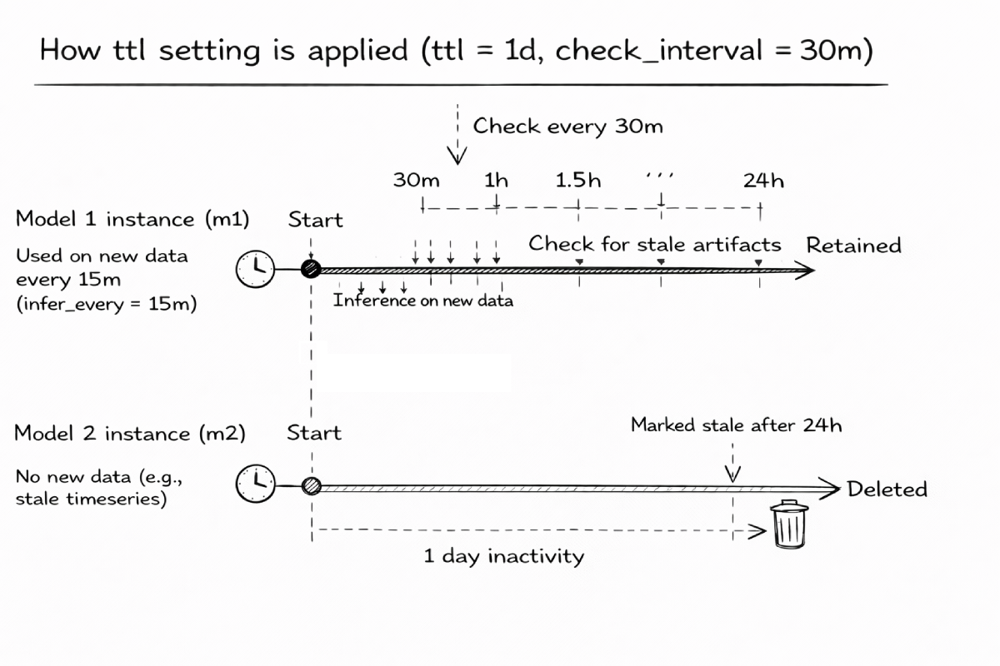

Through the **Settings** section of a config, you can configure the following parameters of the anomaly detection service:

- [Anomaly score outside data range](#anomaly-score-outside-data-range) - specific anomaly score fo values outside the expected data range of particular query
- [Parallelization](#parallelization) - process workers and native numerical-library threads used by each worker
- [State restoration](#state-restoration) - whether to restore models' state in between runs if the service is restarted or stopped

## Anomaly Score Outside Data Range

This argument allows you to override the anomaly score for anomalies that are caused by values outside the expected **data range** of particular [query](https://docs.victoriametrics.com/anomaly-detection/components/models/#queries). The reasons for such anomalies can be various, such as improperly constructed metricsQL queries, sensor malfunctions, or other issues that lead to unexpected values in the data and require investigation.

> If not set, the [anomaly score](https://docs.victoriametrics.com/anomaly-detection/faq/#what-is-anomaly-score) for such anomalies defaults to `1.01` for backward compatibility, however, it is recommended to set it to a higher value, such as `5.0`, to better reflect the severity of anomalies that fall outside the expected data range to catch them faster and check the query for correctness and underlying data for potential issues.

Here's an example configuration that sets default anomaly score outside expected data range to `5.0` and overrides it for a specific model to `1.5`:

```yaml
settings:
  n_workers: 4
  restore_state: True  # restore state from previous run, if available
  anomaly_score_outside_data_range: 5.0

schedulers:
  periodic:
    class: periodic
    fit_every: 1000d  # bootstrap-only schedule; use a finite cadence if accumulated state must be reset
    fit_window: 3h
    infer_every: 30s
  # other schedulers

models:
  zscore_online_inherited:
    class: zscore_online
    z_threshold: 3.5
    decay: 0.99  # give more weight to recent data while using the bootstrap-only fit schedule
    clip_predictions: True
    # will be inherited from settings.anomaly_score_outside_data_range
    # anomaly_score_outside_data_range: 5.0
  zscore_online_override:
    class: zscore_online
    z_threshold: 3.5
    decay: 0.99  # give more weight to recent data while using the bootstrap-only fit schedule
    clip_predictions: True
    anomaly_score_outside_data_range: 1.5  # will override settings.anomaly_score_outside_data_range
  # other models

reader:
  class: vm
  datasource_url: 'https://play.victoriametrics.com'
  tenant_id: "0"
  queries:
    error_rate:
      expr: 'rand()*100 + rand()'  # example query that generates values between 1 and 100 and sometimes exceeds 100
      data_range: [0., 100.]  # expected data range for the underlying query and business logic
    # other queries
  sampling_period: 30s
  latency_offset: 10ms
  query_from_last_seen_timestamp: False
  verify_tls: False
  # other reader settings

writer:
  class: "vm"
  datasource_url: http://localhost:8428
  tenant_id: "0"
  metric_format:
    __name__: "$VAR"
    for: "$QUERY_KEY"
  # other writer settings

monitoring:
  push:
    url: http://localhost:8428
    push_frequency: 1m
  # other monitoring settings
```

The examples on this page use `fit_every: 1000d` as an effectively bootstrap-only schedule. This is appropriate when an online model has a suitable forgetting or reactivity mechanism, such as `zscore_online` with `decay < 1`. If outdated history must be discarded explicitly, choose a finite fit cadence instead; each fit resets the online model state from the configured `fit_window`.

## Parallelization

The `n_workers` argument allows you to explicitly specify the number of process workers for internal parallelization of the service. This can help improve performance on multicore systems by allowing the service to process multiple tasks in parallel. For backward compatibility, it is set to `1` by default. It should be an integer greater than or equal to `-1`; values `-1` and `0` use the number of CPU cores available to the service, including container CPU limits.

The `native_threads_per_worker` argument {} limits [native numerical-library threads](https://scikit-learn.org/stable/computing/parallelism.html#oversubscription-spawning-too-many-threads), such as OpenBLAS threads, inside each model worker. Its default `0` divides the CPU capacity available to the service across effective workers automatically. A positive integer requests an explicit per-worker limit, capped by the CPU share available to that worker. This avoids oversubscription and CPU throttling when every process would otherwise start its own multi-threaded numerical workload. Both `n_workers` and `native_threads_per_worker` are startup settings and require a service restart to change.

- **Increasing** the number can be particularly useful when dealing with a high volume of queries returning many (long) timeseries.
- **Decreasing** the number can be useful when running the service on a system with limited resources or when you want to reduce the load on the system.

Here's an example configuration that uses 4 workers for service's internal parallelization:

```yaml
settings:
  n_workers: 4
  native_threads_per_worker: 0  # automatically divide available CPU capacity across workers
  restore_state: False  # do not restore state from previous run

schedulers:
  periodic:
    class: periodic
    fit_every: 1000d  # bootstrap-only schedule; use a finite cadence if accumulated state must be reset
    fit_window: 3h
    infer_every: 30s
  # other schedulers

models:
  zscore_online_override:
    class: zscore_online
    z_threshold: 3.5
    decay: 0.99  # give more weight to recent data while using the bootstrap-only fit schedule
    clip_predictions: True
  # other models

reader:
  class: vm
  datasource_url: 'https://play.victoriametrics.com'
  tenant_id: "0"
  queries:
    example_query:
      expr: 'rand() + 1'  # example query that generates random values between 1 and 2
      data_range: [1., 2.]
    # other queries
  sampling_period: 30s
  latency_offset: 10ms
  query_from_last_seen_timestamp: False
  verify_tls: False
  # other reader settings

writer:
  class: "vm"
  datasource_url: http://localhost:8428
  metric_format:
    __name__: "$VAR"
    for: "$QUERY_KEY"
  # other writer settings

monitoring:
  push:
    url: http://localhost:8428
    push_frequency: 1m
  # other monitoring settings
```

## State Restoration

> This feature is best used with config [hot-reloading](https://docs.victoriametrics.com/anomaly-detection/components/#hot-reload) {} for increased deployment flexibility.

The `restore_state` argument {} makes `vmanomaly` service **stateful** by persisting and restoring service metadata and fitted model state between runs, allowing seamless continuation after service restarts.

By default, `restore_state` is set to `false`, meaning the service will start fresh on each restart, to maintain backward compatibility.

> [!WARNING]
> This feature requires enabling [on-disk mode](https://docs.victoriametrics.com/anomaly-detection/faq/#on-disk-mode) for the models and data. If not enabled, the service will exit with an error when `restore_state` is set to `true`.

### Benefits

This feature improves the experience of using the anomaly detection service in several ways:
- **Operational continuity**: Production of anomaly scores is resumed from the last known state, minimizing downtime, especially useful in combination with [periodic schedulers](https://docs.victoriametrics.com/anomaly-detection/components/scheduler/#periodic-scheduler) with `start_from` argument explicitly defined.
- **Resource efficiency**: Avoids unnecessary resource and time consumption by not retraining models that have already been trained and remain actual, or querying redundant data from VictoriaMetrics TSDB.
- **Config hot-reloading**: Allows for on-the-fly configuration changes with the reuse of unchanged models/data/scheduler combinations, avoiding unnecessary retraining, additional resource utilization and manual service restarts. Please refer to the [hot-reload](https://docs.victoriametrics.com/anomaly-detection/components/#hot-reload) section for more details on how to use this feature.

### How it works

**Storage**: The service dumps its state into a database file located at `$VMANOMALY_MODEL_DUMPS_DIR/vmanomaly.db`. This database contains metadata about model configurations and schedulers, together with references to trained model artifacts. Scheduler-managed Parquet data is temporary fit input rather than durable model state.

**State restoration**: When the service starts with `restore_state` set to `true`, it will:
1. Check for the existence of the database file in the specified directory.
2. If the file does not exist, it will create a new database file and initialize the state with the current configuration, training models as needed. If the file exists, then it compares the loaded state with the current configuration to determine what can be reused and what needs to be retrained (for example, a changed model class, hyperparameter, scheduler, or reader query invalidates the affected state). Compatible model configurations and trained model instances are restored.
3. Subsequently, it checks model "staleness" and retrains models if necessary, based on the current configuration and the last training time stored in the database versus the next scheduled training time. If the model is **actual**, it continues to use the previously trained model instance. If the model is **stale** (for example, `fit_every` has passed since the last training), it reads the latest `fit_window` from VictoriaMetrics and retrains the model.

**State update**: The service periodically saves the updated state after each "atomic" operations, such as (model_alias, query_alias)-based training or inference. This ensures that the state is always up-to-date and can be restored in case of a service restart. [Online models](https://docs.victoriametrics.com/anomaly-detection/components/models/#online-models) are also updated after each inference, while [offline models](https://docs.victoriametrics.com/anomaly-detection/components/models/#offline-models) are only saved after each training operation as they do not change the state during consecutive fit calls.

**Fit-data cleanup**: {} Each scheduler-managed Parquet generation is removed after all dependent univariate or multivariate models finish fitting and commit their state. Failed or overlapping fits retain their own generation until it is safe to clean up. This keeps the initial bootstrap window available while it is in use without retaining it for the full `fit_every` interval.

**Cleanup behavior**: When `restore_state` is switched from `true` to `false`, the database file is automatically removed on the next service startup to prevent inconsistent behavior. All the artifacts (such as model dumps and data dumps) will be removed as well, so the service will start fresh without any previous state.

Here's an example configuration that enables state restoration:

```yaml
settings:
  restore_state: true
  n_workers: 4

schedulers:
  periodic:
    class: periodic
    fit_every: 1000d  # bootstrap-only schedule; use a finite cadence if accumulated state must be reset
    fit_window: 3h
    infer_every: 30s
  # other schedulers

models:
  zscore_online:
    class: zscore_online
    z_threshold: 3.5
    decay: 0.99  # give more weight to recent data while using the bootstrap-only fit schedule
    clip_predictions: True
  # other models

reader:
  class: vm
  datasource_url: 'https://play.victoriametrics.com'
  tenant_id: "0"
  queries:
    example_query:
      expr: 'rand() + 1'  # example query that generates random values between 1 and 2
      data_range: [1., 2.]
    # other queries
  sampling_period: 30s
  latency_offset: 10ms
  query_from_last_seen_timestamp: False
  verify_tls: False
  # other reader settings

writer:
  class: "vm"
  datasource_url: http://localhost:8428
  metric_format:
    __name__: "$VAR"
    for: "$QUERY_KEY"
  # other writer settings

monitoring:
  push:
    url: http://localhost:8428
    push_frequency: 1m
  # other monitoring settings
```

<div class="collapse-group">

{}

### Example

For a configuration with the following models, queries and schedulers:

```yaml
settings:
  n_workers: 4
  restore_state: True  # enables state restoration
schedulers:
  periodic_1d:
    class: periodic
    fit_every: 1000d  # bootstrap-only schedule; use a finite cadence if accumulated state must be reset
    infer_every: 30s
    fit_window: 24h
models:
  zscore_online:
    class: zscore_online
    z_threshold: 3.5
    decay: 0.99  # give more weight to recent data while using the bootstrap-only fit schedule
    schedulers: ['periodic_1d']
  temporal_envelope:
    class: temporal_envelope
    alpha: 0.005  # adapt the trend while using the bootstrap-only fit schedule
    loss_reactivity: 5  # allow new deviations to update the envelope
    schedulers: ['periodic_1d']
    queries: ['q1', 'q2']
    seasonalities: ['hod_smooth', 'dow_smooth']
reader:
  class: vm
  datasource_url: 'https://play.victoriametrics.com'
  tenant_id: "0"
  queries:
    q1:
      expr: 'some_metricsql_query_1'
    q2:
      expr: 'some_metricsql_query_2'
  sampling_period: 30s
# other components like writer, monitoring, etc.
```

if the service is restarted before the next scheduled fit, it will restore the state of the `zscore_online` and `temporal_envelope` models if their signature (class, hyperparameters, schedulers, etc.) has not changed. It loads trained model instances from disk and continues producing [anomaly scores](https://docs.victoriametrics.com/anomaly-detection/faq/#what-is-anomaly-score) without retraining. If there are changes or new queries added to the configuration, the service will add these to scheduled jobs for fit and infer. That's what is changed and what is restored in a config below:

```yaml
settings:
  n_workers: 2  # changed, but does not affect state restoration
  restore_state: True  # enables state restoration, still enabled
schedulers:
  periodic_1d:  # can be fully reused, no changes
    class: periodic
    fit_every: 1000d  # unchanged bootstrap-only schedule
    infer_every: 30s  # unchanged, still infers every 30 seconds
    fit_window: 24h  # unchanged, still fits on the last 24 hours of data
models:
  zscore_online:  # can't be reused, because its `z_threshold` has changed
    class: zscore_online  # unchanged, still the same model class
    z_threshold: 3.0 # changed, needs retraining!
    decay: 0.99  # unchanged forgetting factor
    schedulers: ['periodic_1d']  # unchanged, still attached to the same scheduler
  temporal_envelope:  # can be partially reused, because its class and schedulers are unchanged but queries have changed
    class: temporal_envelope  # unchanged, still the same model class
    alpha: 0.005  # unchanged trend reactivity
    loss_reactivity: 5  # unchanged envelope reactivity
    schedulers: ['periodic_1d']  # unchanged, still attached to the same scheduler
    queries: ['q1', 'q3']  # changed, added new query 'q3', drops 'q2', so (temporal_envelope, q2) should be trained from scratch
    seasonalities: ['hod_smooth', 'dow_smooth']  # unchanged
reader:  # can be partially reused, because its class and datasource URL are unchanged, but queries have changed
  class: vm  # unchanged, still the same reader class
  datasource_url: 'https://play.victoriametrics.com'  # unchanged, still the same datasource URL
  tenant_id: "0"  # unchanged, still the same tenant ID
  queries:
    q1:
      expr: 'some_metricsql_query_1'  # unchanged, still the same query
    q2:
      expr: 'some_metricsql_query_2'  # will be removed, no longer used by any model
    q3:
      expr: 'some_metricsql_query_3'  # new query, added to the reader, and used by the `temporal_envelope` model
  sampling_period: 30s  # unchanged, still the same sampling period
# other components like writer, monitoring, etc. remain unchanged
```
This means that the service upon restart:
1. Won't restore the state of `zscore_online` model, because its `z_threshold` argument **has changed**, retraining from scratch is needed on the last `fit_window` = 24 hours of data for `q1`, `q2` and `q3` (as model's `queries` arg is not set so it defaults to all queries found in the reader).
2. Will **partially** restore the state of `temporal_envelope` model, because its class and schedulers are unchanged, but **only instances trained on timeseries returned by `q1` query**. New fit/infer jobs will be set for new query `q3`. The old query `q2` artifacts will be dropped upon restart - all respective models and data for (`temporal_envelope`, `q2`) combination will be removed from the database file and from the disk.

{}

</div>

## Retention

{} The `retention` argument sets a [time to live](https://en.wikipedia.org/wiki/Time_to_live) (TTL) for stored model instances. At each `check_interval`, the service removes instances that have not been used for inference or refitting within `ttl`. This bounds stale resource usage in long-running deployments. Temporary scheduler-managed fit data follows the [fit-data cleanup lifecycle](#how-it-works) independently.

### Use Cases
- With **[online models](https://docs.victoriametrics.com/anomaly-detection/components/models/#online-models)** as they continuously create model instances for new timeseries over time during inference calls, especially when combined with [periodic schedulers](https://docs.victoriametrics.com/anomaly-detection/components/scheduler/#periodic-scheduler) with infrequent `fit_every` (say, `90d`).
- In deployments where **the set of monitored timeseries changes frequently**, leading to accumulation of unused model instances due to high churn rate or relabeling of metrics.
- When using **[state restoration](https://docs.victoriametrics.com/anomaly-detection/components/settings/#state-restoration)**, which improves fault tolerance but can retain inactive model instances unless retention is configured.

### Configuration

The section is **backward-compatible and disabled by default**, meaning that model instances are retained unless:
- The service is restarted with `restore_state` set to `false`, which triggers a cleanup of all stored artifacts.
- The models are marked as outdated once scheduled re-fitting is due, leading to retraining and replacement of previous artifacts.

`ttl` defines the time-to-live period for model instances. It should be a valid period string (e.g., `7d` for 7 days or `30d` for 30 days). If a model instance has not been used for inference or refitting within this period, it is considered stale and eligible for cleanup.

> If `ttl` is greater than a scheduler's `fit_every`, the model is refitted before it becomes stale and the TTL has no effect.

`check_interval` defines how often the service should check for stale artifacts. It should be a valid period string (e.g., `1h` for 1 hour or `24h` for 24 hours). During each check, the service evaluates stored model instances against the defined `ttl` and removes those that are stale.

> Check interval should be set to a value smaller than `ttl` and smaller than the smallest `fit_every` period among all schedulers used in the config to ensure timely cleanup of stale artifacts, otherwise stale artifacts may persist longer than intended.

### Example

Here's an example configuration that enables retention with a TTL of 1 day and a check interval of 30 minutes, where inference is performed every 15 minutes.
- Model instances that have not been used for inference or refitting within the last day will be cleaned up every 30 minutes (m2 example on a diagram)
- While model instances used for inference within the last day at least 1 time will be retained (m1 example on a diagram)



```yaml
schedulers:
  s1:
    class: periodic
    infer_every: 15m
    # other scheduler args
  # other schedulers

reader:
  class: vm
  datasource_url: 'https://play.victoriametrics.com'
  tenant_id: "0"
  queries:
    q1:
      expr: 'some_metricsql_query_1'  # returns active timeseries
    q2:
      expr: 'some_metricsql_query_2'  # returns high-churn timeseries
  sampling_period: 30s
  # other reader args

models:
  m1:  # model instances will be retained due to stable data returned by q1
    class: zscore_online
    schedulers: ['s1']
    queries: ['q1']
    # other model args
  m2:  # model instances will be likely dropped during retention checks due to high churn rate
    class: temporal_envelope
    schedulers: ['s1']
    queries: ['q2']
    # other model args
  # other models

# other sections like schedulers, models, reader, writer, monitoring, etc.

settings:
  # other settings
  restore_state: True  # enables state restoration
  retention:
    ttl: 24h  # time-to-live for inactive model instances
    check_interval: 30m  # interval to check for stale artifacts
```


## Logger Levels

{} `vmanomaly` service supports per-component logger levels, allowing to control the verbosity of logs for each component independently. This can be useful for debugging or monitoring specific components without overwhelming the logs with information from other components. Prefixes are also supported, allowing to set the logger level for all components with a specific prefix.

The logger levels can be set in the `settings` section of the config file under `logger_levels` key, where the key is the component name or prefix and the value is the desired logger level. The available logger levels are: `debug`, `info`, `warning`, `error`, and `critical`.

> Best used in combination with [hot-reload](https://docs.victoriametrics.com/anomaly-detection/components/#hot-reload) to change the logger levels *on-the-fly* without restarting the service through a short-circuit config check than doesn't even trigger the state restoration logic.

Here's an example configuration that sets the logger level for the `reader` component to `debug` and for the `writer` component to `critical`, while `--loggerLevel` [command line argument](https://docs.victoriametrics.com/anomaly-detection/quickstart/#command-line-arguments) sets the default logger level to `INFO` for all (the other) components, unless overridden by the config:

> If commented out in hot-reload mode during hot-reload event, the logger level for the component will be set back to what `--loggerLevel` command line argument is set to, which defaults to `info` if not specified.

```yaml
settings:
  n_workers: 4
  restore_state: True  # enables state restoration
  logger_levels:
    reader.vm: DEBUG  # affects only VmReader logs
    model: WARNING  # applies to all components with 'model' prefix, such as 'model.zscore_online', 'model.online.temporal_envelope', etc.
    # once commented out in hot-reload mode, will use the default logger level set by --loggerLevel command line argument
    # monitoring.push: critical
```
