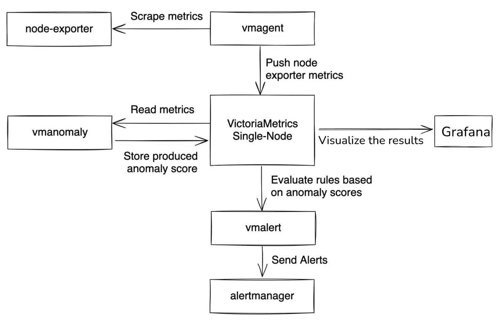

**Prerequisites**:

- To use *vmanomaly*, part of the enterprise package, a license key is required. Obtain your key [here](https://victoriametrics.com/products/enterprise/trial/) for this tutorial or for enterprise use.
- In the tutorial, we'll be using the following VictoriaMetrics components:
  -  [VictoriaMetrics Single-Node](https://docs.victoriametrics.com/single-server-victoriametrics) (v1.102.0)
  -  [vmalert](https://docs.victoriametrics.com/vmalert/) (v1.102.0)
  -  [vmagent](https://docs.victoriametrics.com/vmagent/) (v1.102.0)
- [Grafana](https://grafana.com/) (v.10.2.1)
- [Docker](https://docs.docker.com/get-docker/) and [Docker Compose](https://docs.docker.com/compose/)
- [Node exporter](https://github.com/prometheus/node_exporter#node-exporter) (v1.7.0) and [Alertmanager](https://prometheus.io/docs/alerting/latest/alertmanager/) (v0.27.0)



> **Note: Configurations used throughout this guide can be found [here](https://github.com/VictoriaMetrics/VictoriaMetrics/tree/master/deployment/docker/vmanomaly/vmanomaly-integration/)**

> **Note:** Starting from [v1.13.0](https://docs.victoriametrics.com/anomaly-detection/changelog/#v1130) `node-exporter` observability preset is available for `vmanomaly`. Please find the guide [here](https://docs.victoriametrics.com/anomaly-detection/presets/#node-exporter).

## 1. What is vmanomaly?

*VictoriaMetrics Anomaly Detection* ([vmanomaly](https://docs.victoriametrics.com/anomaly-detection/overview/)) is a service that continuously scans time series stored in VictoriaMetrics and detects unexpected changes within data patterns in real-time. It does so by utilizing user-configurable machine learning models.

All the service parameters are defined in a config file.

> **Note**: Starting from [1.10.0](https://docs.victoriametrics.com/anomaly-detection/changelog/#v1100), each `vmanomaly` configuration file can support more that one model type. To utilize *different models* on your data, it is no longer necessary to run multiple instances of the `vmanomaly` process. Please refer to [model](https://docs.victoriametrics.com/anomaly-detection/components/models/) config section for more details.

> **Note**: Starting from [1.11.0](https://docs.victoriametrics.com/anomaly-detection/changelog/#v1110), each `vmanomaly` configuration file can support more that one model type, each attached to one (or more) schedulers. To utilize *different models* with *different schedulers* on your data, it is no longer necessary to run multiple instances of the `vmanomaly` process. Please refer to [model](https://docs.victoriametrics.com/anomaly-detection/components/models/#schedulers) and [scheduler](https://docs.victoriametrics.com/anomaly-detection/components/scheduler/) config sections for more details.


**vmanomaly** does the following:
- periodically queries user-specified metrics
- computes an **anomaly score** for them
- pushes back the computed **anomaly score** to VictoriaMetrics.

### What is anomaly score?

**Anomaly score** is a calculated non-negative (in interval [0, +inf)) numeric value. It takes into account  how well data fit a predicted distribution, periodical  patterns, trends, seasonality, etc.

The value is designed to:

- *fall between 0 and 1* if model consider that datapoint is following usual pattern
- *exceed 1* if the datapoint is abnormal

Then, users can enable alerting rules based on the **anomaly score** with [vmalert](#what-is-vmalert).

## 2. What is vmalert?

[vmalert](https://docs.victoriametrics.com/vmalert/) is an alerting tool for VictoriaMetrics. It executes a list of the given alerting or recording rules against configured `-datasource.url`.

[Alerting rules](https://docs.victoriametrics.com/vmalert/#alerting-rules) allow you to define conditions that, when met, will notify the user. The alerting condition is defined in a form of a query expression via [MetricsQL query language](https://docs.victoriametrics.com/metricsql/). For example, in our case, the expression `anomaly_score > 1.0` will notify a user when the calculated anomaly score exceeds a threshold of `1.0`.

## 3. How does vmanomaly works with vmalert?

Compared to classical alerting rules, anomaly detection is more "hands-off" and data-aware. Instead of thinking of critical conditions to define, user can rely on catching anomalies that were not expected to happen. In other words, by setting up alerting rules, a user must know what to look for, ahead of time, while anomaly detection looks for any deviations from past behavior. 

Practical use case is to put anomaly score generated by vmanomaly into alerting rules with some threshold. 

**In this tutorial we are going to:**
  - Configure docker-compose file with all needed services ([VictoriaMetrics Single-Node](https://docs.victoriametrics.com/single-server-victoriametrics), [vmalert](https://docs.victoriametrics.com/vmalert/), [vmagent](https://docs.victoriametrics.com/vmagent/), [Grafana](https://grafana.com/), [Node Exporter](https://prometheus.io/docs/guides/node-exporter/) and [vmanomaly](https://docs.victoriametrics.com/anomaly-detection/overview/) ).
  - Explore configuration files for [vmanomaly](https://docs.victoriametrics.com/anomaly-detection/overview/) and [vmalert](https://docs.victoriametrics.com/vmalert/).
  - Run our own [VictoriaMetrics](https://docs.victoriametrics.com/single-server-victoriametrics) database with data scraped from [Node Exporter](https://prometheus.io/docs/guides/node-exporter/).
  - Explore data for analysis in [Grafana](https://grafana.com/).
  - Explore `vmanomaly` results.
  - Explore `vmalert` alerts


## 4. Data to analyze

Let's talk about data used for anomaly detection in this tutorial. 
We are going to collect our own CPU usage data with [Node Exporter](https://prometheus.io/docs/guides/node-exporter/)  into the VictoriaMetrics database.

On a Node Exporter's metrics page, part of the output looks like this:

```text
# HELP node_cpu_seconds_total Seconds the CPUs spent in each mode.
# TYPE node_cpu_seconds_total counter
node_cpu_seconds_total{cpu="0",mode="idle"} 94965.14
node_cpu_seconds_total{cpu="0",mode="iowait"} 51.25
node_cpu_seconds_total{cpu="0",mode="irq"} 0
node_cpu_seconds_total{cpu="0",mode="nice"} 0
node_cpu_seconds_total{cpu="0",mode="softirq"} 1682.18
node_cpu_seconds_total{cpu="0",mode="steal"} 0
node_cpu_seconds_total{cpu="0",mode="system"} 995.37
node_cpu_seconds_total{cpu="0",mode="user"} 12378.05
node_cpu_seconds_total{cpu="1",mode="idle"} 94386.53
node_cpu_seconds_total{cpu="1",mode="iowait"} 51.22
...
```

In this context, the metric `node_cpu_seconds_total` provides a comprehensive breakdown of the time each CPU core has spent in various operational modes. These modes include: _user_, _system_, _iowait_, _idle_, _irq&softirq_, _guest_, and _steal_. Each of these eight modes is mutually exclusive, offering distinct insights into CPU activity. For instance, a predominant _iowait_ suggests disk or network bottlenecks, while elevated levels in _user_ or _system_ indicate significant CPU utilization.

The `node_cpu_seconds_total` metric is classified as a [counter](https://docs.victoriametrics.com/keyconcepts/#counter) type. To analyze the duration each CPU core spends in these modes, it is necessary to compute the rate of change per second using the [rate function](https://docs.victoriametrics.com/metricsql/#rate): `rate(node_cpu_seconds_total)`. For a more refined and smoother aggregation of data by mode, we apply the sum function. The resulting query is formulated as follows: `sum(rate(node_cpu_seconds_total[5m])) by (mode, instance, job)`.

Below is an illustrative example of how this query might be visualized in Grafana:


This query will yield a total of eight time series, each corresponding to a CPU mode. The number of series is unaffected by the number of CPU cores, due to the `by` aggregation applied. These series serve as the input for `vmanomaly`, where the service independently fits a separate instance of the configured model type to each of time series.


## 5. vmanomaly configuration and parameter description

**Parameter description**:
The configuration file for `vmanomaly` comprises 4 essential sections:

1. [`scheduler`](https://docs.victoriametrics.com/anomaly-detection/components/scheduler/) - This section determines the frequency of model inferences and training, including the time range for model training. Starting from [v1.11.0](https://docs.victoriametrics.com/anomaly-detection/changelog/#v1110), multiple individual schedulers are supported for each model type in a single config.

2. [`models`](https://docs.victoriametrics.com/anomaly-detection/components/models/) - Here, you define specific parameters and configurations for the models being used for anomaly detection. Starting from [v1.10.0](https://docs.victoriametrics.com/anomaly-detection/changelog/#v1100), multiple model configurations are supported in a single config.

3. [`reader`](https://docs.victoriametrics.com/anomaly-detection/components/reader/) - This section outlines the methodology for data reading, including the data source location.

4. [`writer`](https://docs.victoriametrics.com/anomaly-detection/components/writer/) - Specifies the destination and method for writing the generated output.

5. [`monitoring`](https://docs.victoriametrics.com/anomaly-detection/components/monitoring/) (optional) - Describes how to monitor and expose health check metrics of `vmanomaly`.

Detailed parameters in each section:

* `schedulers` ([PeriodicScheduler](https://docs.victoriametrics.com/anomaly-detection/components/scheduler/#periodic-scheduler) is used here)
  * `infer_every` - Specifies the frequency at which the trained models perform inferences on new data, essentially determining how often new anomaly score data points are generated. Format examples: 30s, 4m, 2h, 1d (time units: 's' for seconds, 'm' for minutes, 'h' for hours, 'd' for days). This parameter essentially asks, at regular intervals (e.g., every 1 minute), whether the latest data points appear abnormal based on historical data.
  * `fit_every` - Sets the frequency for retraining the models. A higher frequency ensures more updated models but requires more CPU resources. If omitted, models are retrained in each `infer_every` cycle. Format is similar to `infer_every`.
  * `fit_window` - Defines the data interval for training the models. Longer intervals allow for capturing extensive historical behavior and better seasonal pattern detection but may slow down the model's response to permanent metric changes and increase resource consumption. A minimum of two full seasonal cycles is recommended. Example format: 3h for three hours of data.

* `models`
  * `class` - Specifies the model to be used. Options include custom models ([guide here](https://docs.victoriametrics.com/anomaly-detection/components/models/#custom-model-guide)) or a selection from [built-in models](https://docs.victoriametrics.com/anomaly-detection/components/models/#built-in-models), such as the [Facebook Prophet](https://docs.victoriametrics.com/anomaly-detection/components/models/#prophet) (`model.prophet.ProphetModel`).
  * `args` - Model-specific parameters, formatted as a YAML dictionary in the `key: value` structure. Parameters available in [FB Prophet](https://facebook.github.io/prophet/docs/quick_start.html) can be used as an example.

* `reader`
  * `datasource_url` - The URL for the data source, typically an HTTP endpoint serving `/api/v1/query_range`.
  * `queries` - MetricsQL (an extension of PromQL) expressions for anomaly detection. Multiple queries can be formatted as `<QUERY_ALIAS>: "QUERY"`, where QUERY_ALIAS is used as a label in the generated metrics and anomaly scores.

* `writer`
  * `datasource_url` - Specifies the endpoint for output data, typically an HTTP endpoint serving `/api/v1/import`.

Below is an illustrative example of a `vmanomaly_config.yml` configuration file.


``` yaml
schedulers:
  periodic:
    # class: 'periodic'  # or "scheduler.periodic.PeriodicScheduler" until v1.13.0
    infer_every: "1m"
    fit_every: "2m"
    fit_window: "3h"

models:
  prophet:
    class: "prophet"  # or "model.prophet.ProphetModel" until v1.13.0
    args:
      interval_width: 0.98

reader:
  datasource_url: "http://victoriametrics:8428/"
  sampling_period: "60s" 
  queries:
    node_cpu_rate: "sum(rate(node_cpu_seconds_total[5m])) by (mode, instance, job)"

writer:
  datasource_url: "http://victoriametrics:8428/"


monitoring:
  pull: # Enable /metrics endpoint.
    addr: "0.0.0.0"
    port: 8490
```


## 6. vmanomaly output

As the result of running vmanomaly, it produces the following metrics:
- `anomaly_score` - the main one. Ideally, if it is between 0.0 and 1.0 it is considered to be a non-anomalous value. If it is greater than 1.0, it is considered an anomaly (but you can reconfigure that in alerting config, of course), 
- `yhat` - predicted expected value, 
- `yhat_lower` - predicted lower boundary, 
- `yhat_upper` - predicted upper boundary, 
- `y` - initial query result value.

Here is an example of how output metric will be written into VictoriaMetrics:
`anomaly_score{for="node_cpu_rate", instance="node-exporter:9100", job="node-exporter", mode="idle"} 0.85`


## 7. vmalert configuration
Here we provide an example of the config for vmalert `vmalert_config.yml`.


``` yaml
groups:
- name: AnomalyExample
  rules:
  - alert: HighAnomalyScore
    expr: 'anomaly_score > 1.0'
    labels:
      severity: warning
    annotations:
      summary: Anomaly Score exceeded 1.0. `sum(rate(node_cpu_seconds_total))` is showing abnormal behavior. 
```

In the query expression `expr`, it's crucial to establish a criterion based on the generated anomaly scores. Typically, an [anomaly score](https://docs.victoriametrics.com/anomaly-detection/faq/#what-is-anomaly-score) ranging from 0.0 to 1.0 indicates that the analyzed value falls within normal behavior. Scores exceeding 1.0 signal increasing confidence from our model that the observed value is anomalous.

Selecting an appropriate threshold for the anomaly score depends on your specific requirements and the context of the data. One effective method for determining this threshold is through visual analysis. By plotting the `anomaly_score` metric in conjunction with the predicted 'expected' range, delineated by `yhat_lower` and `yhat_upper`, you can make a more informed decision. Later in this tutorial, we will demonstrate this process with a practical example.


## 8. Docker Compose configuration

You can find the `docker-compose.yml` and all configs in this [folder](https://github.com/VictoriaMetrics/VictoriaMetrics/tree/master/deployment/docker/vmanomaly/vmanomaly-integration/)

Now we are going to configure the `docker-compose.yml` file to run all needed services.
Here are all services we are going to run:

* vmanomaly - VictoriaMetrics Anomaly Detection service.
* victoriametrics - VictoriaMetrics Time Series Database
* vmagent - is an agent which helps you collect metrics from various sources, relabel and filter the collected metrics and store them in VictoriaMetrics or any other storage systems via Prometheus remote_write protocol.
* [grafana](https://grafana.com/) - visualization tool.
* node-exporter - Prometheus [Node Exporter](https://prometheus.io/docs/guides/node-exporter/) exposes a wide variety of hardware- and kernel-related metrics.
* vmalert - VictoriaMetrics Alerting service.
* alertmanager - Notification services that handles alerts from vmalert.

### Grafana setup

#### Create a data source manifest
In the `provisioning/datasources/` directory, create a file called `datasource.yml` with the following content:


> The default username/password pair is `admin:admin`


``` yaml
apiVersion: 1

datasources:
    - name: VictoriaMetrics
      type: prometheus
      access: proxy
      url: http://victoriametrics:8428
      isDefault: true
      jsonData:
        prometheusType: Prometheus
        prometheusVersion: 2.24.0

```


#### Define a dashboard provider
In the` provisioning/dashboards/` directory, create a file called `dashboard.yml` with the following content:


``` yaml
apiVersion: 1

providers:
- name: Prometheus
  orgId: 1
  folder: ''
  type: file
  options:
    path: /var/lib/grafana/dashboards

```


### Scrape config

Let's create `prometheus.yml` file for `vmagent` configuration.


``` yaml
global:
  scrape_interval: 10s

scrape_configs:
  - job_name: 'vmagent'
    static_configs:
      - targets: ['vmagent:8429']
  - job_name: 'vmalert'
    static_configs:
      - targets: ['vmalert:8880']
  - job_name: 'victoriametrics'
    static_configs:
      - targets: ['victoriametrics:8428']
  - job_name: 'node-exporter'
    static_configs:
      - targets: ['node-exporter:9100']
  - job_name: 'vmanomaly'
    static_configs:
      - targets: [ 'vmanomaly:8490' ]
```


### vmanomaly licensing

We will utilize the license key stored locally in the file `vmanomaly_license`.

For additional licensing options, please refer to the [VictoriaMetrics Anomaly Detection documentation on licensing](https://docs.victoriametrics.com/anomaly-detection/overview/#licensing).


### Alertmanager setup 

Let's create `alertmanager.yml` file for `alertmanager` configuration.

```yaml
route:
  receiver: blackhole

receivers:
  - name: blackhole
```

### Docker-compose

Let's wrap it all up together into the `docker-compose.yml` file.


``` yaml
services:
  vmagent:
    container_name: vmagent
    image: victoriametrics/vmagent:v1.102.0
    depends_on:
      - "victoriametrics"
    ports:
      - 8429:8429
    volumes:
      - vmagentdata-guide-vmanomaly-vmalert:/vmagentdata
      - ./prometheus.yml:/etc/prometheus/prometheus.yml
    command:
      - "--promscrape.config=/etc/prometheus/prometheus.yml"
      - "--remoteWrite.url=http://victoriametrics:8428/api/v1/write"
    networks:
      - vm_net
    restart: always

  victoriametrics:
    container_name: victoriametrics
    image: victoriametrics/victoria-metrics:v1.102.0
    ports:
      - 8428:8428
    volumes:
      - vmdata-guide-vmanomaly-vmalert:/storage
    command:
      - "--storageDataPath=/storage"
      - "--httpListenAddr=:8428"
      - "--vmalert.proxyURL=http://vmalert:8880"
      - "-search.disableCache=1" # for guide only, do not use in production
    networks:
      - vm_net
    restart: always

  grafana:
    container_name: grafana
    image: grafana/grafana-oss:10.2.1
    depends_on:
      - "victoriametrics"
    ports:
      - 3000:3000
    volumes:
      - grafanadata-guide-vmanomaly-vmalert:/var/lib/grafana
      - ./provisioning/datasources:/etc/grafana/provisioning/datasources
      - ./provisioning/dashboards:/etc/grafana/provisioning/dashboards
      - ./vmanomaly_guide_dashboard.json:/var/lib/grafana/dashboards/vmanomaly_guide_dashboard.json
    networks:
      - vm_net
    restart: always


  vmalert:
    container_name: vmalert
    image: victoriametrics/vmalert:v1.102.0
    depends_on:
      - "victoriametrics"
    ports:
      - 8880:8880
    volumes:
      - ./vmalert_config.yml:/etc/alerts/alerts.yml
    command:
      - "--datasource.url=http://victoriametrics:8428/"
      - "--remoteRead.url=http://victoriametrics:8428/"
      - "--remoteWrite.url=http://victoriametrics:8428/"
      - "--notifier.url=http://alertmanager:9093/"
      - "--rule=/etc/alerts/*.yml"
      # display source of alerts in grafana
      - "--external.url=http://127.0.0.1:3000" #grafana outside container
      # when copypaste the line be aware of '$$' for escaping in '$expr'
      - '--external.alert.source=explore?orgId=1&left=["now-1h","now","VictoriaMetrics",{"expr": },{"mode":"Metrics"},{"ui":[true,true,true,"none"]}]'
    networks:
      - vm_net
    restart: always
  vmanomaly:
    container_name: vmanomaly
    image: victoriametrics/vmanomaly:v1.16.3
    depends_on:
      - "victoriametrics"
    ports:
      - "8490:8490"
    networks:
      - vm_net
    restart: always
    volumes:
      - ./vmanomaly_config.yml:/config.yaml
      - ./vmanomaly_license:/license
    platform: "linux/amd64"
    command:
      - "/config.yaml"
      - "--licenseFile=/license"
  alertmanager:
    container_name: alertmanager
    image: prom/alertmanager:v0.25.0
    volumes:
      - ./alertmanager.yml:/config/alertmanager.yml
    command:
      - "--config.file=/config/alertmanager.yml"
    ports:
      - 9093:9093
    networks:
      - vm_net
    restart: always

  node-exporter:
    image: quay.io/prometheus/node-exporter:v1.7.0
    container_name: node-exporter
    ports:
      - 9100:9100
    pid: host
    restart: unless-stopped
    networks:
      - vm_net

volumes:
  vmagentdata-guide-vmanomaly-vmalert: {}
  vmdata-guide-vmanomaly-vmalert: {}
  grafanadata-guide-vmanomaly-vmalert: {}
networks:
  vm_net:

```


Before running our docker-compose make sure that your directory contains all required files:


This docker-compose file will pull docker images,  set up each service and run them all together with the command:


```sh
docker-compose up -d
```


To check if vmanomaly is up and running you can check docker logs:


```sh
docker logs vmanomaly -f
```


## 9. Model results

To look at model results we need to go to grafana on the `localhost:3000`. Data
vmanomaly need some time to generate more data to visualize.
Let's investigate model output visualization in Grafana.
On the Grafana Dashboard `Vmanomaly Guide` for each mode of CPU you can investigate:
* initial query result - `sum(rate(node_cpu_seconds_total[5m])) by (mode, instance, job)`
* `anomaly_score` 
* `yhat` - Predicted value
* `yhat_lower` - Predicted lower boundary
* `yhat_upper` - Predicted upper boundary

Each of these metrics will contain same labels our query `sum(rate(node_cpu_seconds_total[5m])) by (mode, instance, job)` returns.

### Anomaly scores for each metric with its according labels. 

Query: `anomaly_score`


<br>Check out if the anomaly score is high for datapoints you think are anomalies. If not, you can try other parameters in the config file or try other model type.

As you may notice a lot of data shows anomaly score greater than 1. It is expected as we just started to scrape and store data and there are not enough datapoints to train on. Just wait for some more time for gathering more data to see how well this particular model can find anomalies. In our configs we put 2 weeks of data needed to fit the model properly.


### Lower and upper boundaries and predicted values. 

Queries: `yhat_lower`, `yhat_upper` and `yhat`


Boundaries of 'normal' metric values according to model inference. 

### Alerting

On the page `http://localhost:8880/vmalert/groups` you can find our configured Alerting rule:


According to the rule configured for vmalert we will see Alert when anomaly score exceed 1. You will see an alert on Alert tab. `http://localhost:8880/vmalert/alerts`:


## 10. Conclusion

We've explored the integration and practical application of *VictoriaMetrics Anomaly Detection* (`vmanomaly`) in conjunction with `vmalert`. This tutorial has taken you through the necessary prerequisites, setup, and configurations required for anomaly detection in time series data.

Key takeaways include:

1. **Understanding vmanomaly and vmalert**: We've discussed the functionalities of `vmanomaly` and `vmalert`, highlighting how they work individually and in tandem to detect anomalies in time series data.

2. **Practical Configuration and Setup**: By walking through the setup of a docker-compose environment, we've demonstrated how to configure and run VictoriaMetrics along with its associated services, including `vmanomaly` and `vmalert`.

3. **Data Analysis and Monitoring**: The guide provided insights on how to collect, analyze, and visualize data using Grafana, interpreting the anomaly scores and other metrics generated by `vmanomaly`.

4. **Alert Configuration**: We've shown how to set up and customize alerting rules in `vmalert` based on produced anomaly scores, enabling proactive monitoring and timely response to potential issues.

As you continue to use VictoriaMetrics Anomaly Detection and `vmalert`, remember that the effectiveness of anomaly detection largely depends on the appropriateness of the model chosen, the accuracy of configurations and the data patterns observed. This guide serves as a starting point, and we encourage you to experiment with different configurations and models to best suit your specific data needs and use cases. In case you need a helping hand - [contact us](https://victoriametrics.com/contact-us/).

> **Note:** Starting from [v1.13.0](https://docs.victoriametrics.com/anomaly-detection/changelog/#v1130) `node-exporter` observability preset is available for `vmanomaly`. Please find the guide [here](https://docs.victoriametrics.com/anomaly-detection/presets/#node-exporter).
