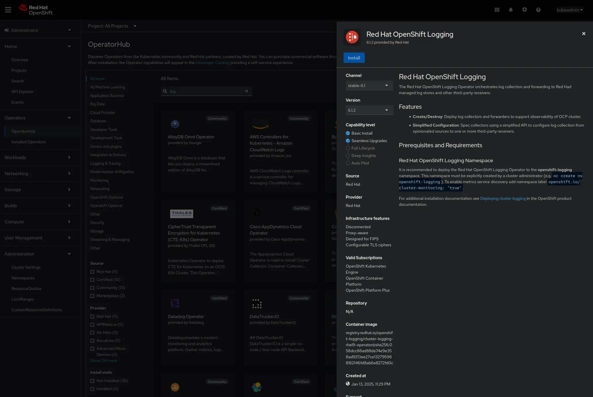
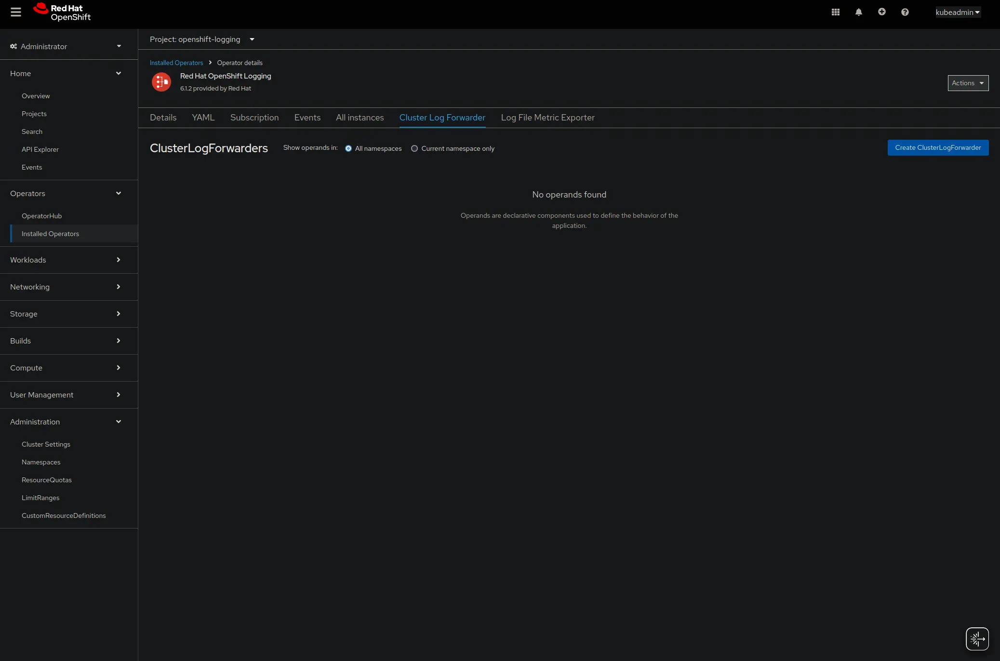
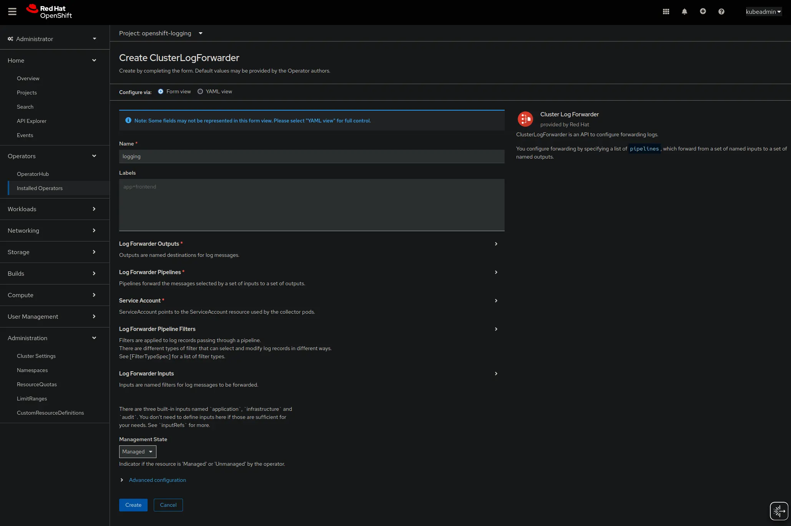
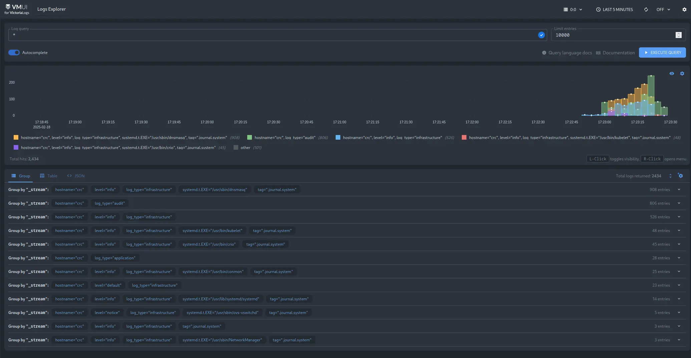

This guide covers OpenShift cluster configuration for collecting and storing logs in Victoria Logs.

## Pre-Requirements

* [OpenShift cluster](https://www.redhat.com/en/technologies/cloud-computing/openshift)
* Admin access to OpenShift cluster
* [kubectl installed](https://kubernetes.io/docs/tasks/tools/install-kubectl) and configured to access OpenShift cluster
* [Helm installed](https://helm.sh/docs/intro/install)

## Install Red Hat OpenShift Logging operator 

[Cluster logging operator](https://github.com/openshift/cluster-logging-operator) is a logging solution to support aggregated cluster logging. It is using [Vector](https://vector.dev/) for logs collection and shipping to remote storage.

In order to install the operator, navigate to the OpenShift web console and select the `Operators` tab. Then, click on `OperatorHub` and search for `Red Hat OpenShift Logging`. Click on the `Red Hat OpenShift Logging` operator and then click on `Install`.




## RBAC configuration

Create a service account and cluster role binding for the service account to access the logs. 
OpenShift provides separate `ClusterRoles` for monitoring of different types of logs: `audit`, `infrastructure` and `application`. 

The following configuration will allow the service account to collect all types of logs:
```yaml
kind: ServiceAccount
apiVersion: v1
metadata:
  name: victorialogs
  namespace: openshift-logging
---
kind: ClusterRoleBinding
apiVersion: rbac.authorization.k8s.io/v1
metadata:
  name: vl-collect-infra
subjects:
  - kind: ServiceAccount
    name: victorialogs
    namespace: openshift-logging
roleRef:
  apiGroup: rbac.authorization.k8s.io
  kind: ClusterRole
  name: collect-infrastructure-logs
---
kind: ClusterRoleBinding
apiVersion: rbac.authorization.k8s.io/v1
metadata:
  name: vl-collect-audit
subjects:
  - kind: ServiceAccount
    name: victorialogs
    namespace: openshift-logging
roleRef:
  apiGroup: rbac.authorization.k8s.io
  kind: ClusterRole
  name: collect-audit-logs
---
kind: ClusterRoleBinding
apiVersion: rbac.authorization.k8s.io/v1
metadata:
  name: vl-collect-application
subjects:
  - kind: ServiceAccount
    name: victorialogs
    namespace: openshift-logging
roleRef:
  apiGroup: rbac.authorization.k8s.io
  kind: ClusterRole
  name: collect-application-logs
```

Alternatively, you can use OpenShift console to create the service account and cluster role binding. 
Navigate to `ServiceAccounts` and click on `Create Service Account`. Fill in the name `victorialogs` and namespace `openshift-logging` and click on `Create`. 
Then, navigate to `RoleBindings` and create a binding for each `ClusterRole` for subject `victorialogs` in `openshift-logging` namespace.


## Install Victoria Logs

Add Victoria Metrics Helm [repository](https://github.com/VictoriaMetrics/helm-charts):
```bash
helm repo add vm https://victoriametrics.github.io/helm-charts/
```

Minimal configuration for VictoriaLogs running in OpenShift:
```yaml
securityContext:
  enabled: true
  allowPrivilegeEscalation: false
  capabilities:
    drop:
      - ALL
  readOnlyRootFilesystem: true

podSecurityContext:
  enabled: true
  runAsNonRoot: true
```
Save the configuration to `vl.yaml`.

> Note, that depending on the OpenShift cluster configuration, additional security settings might be required.

Create namespace for VictoriaLogs:
```bash
kubectl create namespace vl
```

Install VictoriaLogs with the following command:
```bash
helm upgrade --namespace vl --install vl vm/victoria-logs-single -f vl.yaml
```

## Configure logs forwarding

Cluster logging operator uses `ClusterLogForwarder` resource for logs forwarding configuration.

Here is an example configuration to forward all cluster logs to VictoriaLogs:
```yaml
apiVersion: observability.openshift.io/v1
kind: ClusterLogForwarder
metadata:
  name: logging
  namespace: openshift-logging
spec:
  managementState: Managed
  outputs:
    - elasticsearch:
        index: logs
        url: "http://vl-victoria-logs-single-server.vl.svc.cluster.local:9428/insert/elasticsearch/_bulk?_stream_fields=log_type,hostname,stream,kubernetes.pod_name,kubernetes.container_name,kubernetes.pod_namespace&_time_field=@timestamp&_msg_field=message,msg,_msg,log.msg,log.message,log&fake_field=1"
        version: 8
        tuning:
          compression: gzip
      name: victorialogs
      type: elasticsearch
    - elasticsearch:
        index: logs
        url: "http://vl-victoria-logs-single-server.vl.svc.cluster.local:9428/insert/elasticsearch/_bulk?_stream_fields=log_type,hostname,annotations.authorization.k8s.io/decision,hostname,verb&_time_field=@timestamp&_msg_field=annotations.authorization.k8s.io/reason&fake_field=1"
        version: 8
        tuning:
          compression: gzip
      name: victorialogs-audit
      type: elasticsearch
    - elasticsearch:
        index: logs
        url: "http://vl-victoria-logs-single-server.vl.svc.cluster.local:9428/insert/elasticsearch/_bulk?_stream_fields=log_type,hostname,tag,systemd.t.EXE,level&_time_field=@timestamp&_msg_field=message,msg,_msg,log.msg,log.message,log&fake_field=1"
        version: 8
        tuning:
          compression: gzip
      name: victorialogs-infrastructure
      type: elasticsearch
  pipelines:
    - inputRefs:
        - application
      name: application
      outputRefs:
        - victorialogs-audit
    - inputRefs:
        - infrastructure
      name: infrastructure
      outputRefs:
        - victorialogs-infrastructure
    - inputRefs:
        - audit
      name: audit
      outputRefs:
        - victorialogs
  serviceAccount:
    name: victorialogs
```

It is also possible to configure logs forwarding using OpenShift console. Navigate to `Operators` tab and click on `Installed Operators`. Then, click on `Red Hat OpenShift Logging` and navigate to `ClusterLogForwarders`. Click on `Create ClusterLogForwarder`. 
Configure the forwarding to VictoriaLogs using the provided form and click on `Create`.



## Verify logs collection

To verify that logs are collected and stored in VictoriaLogs, navigate to the VictoriaLogs web interface.



Logs will be available in the interface and can be queried using [LogsQL](https://docs.victoriametrics.com/victorialogs/logsql/).
Note that logs will have `log_type` attached to them to distinguish between different types of logs.
