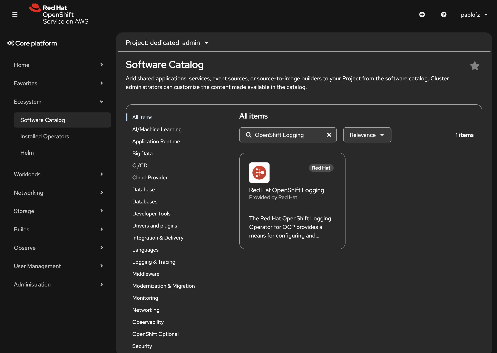
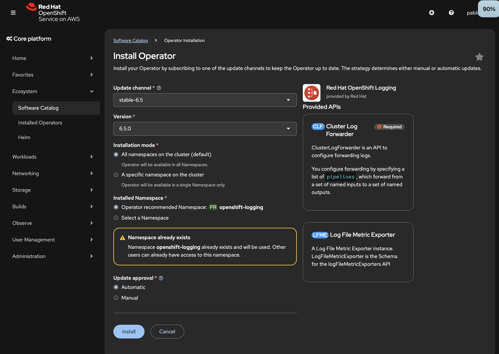
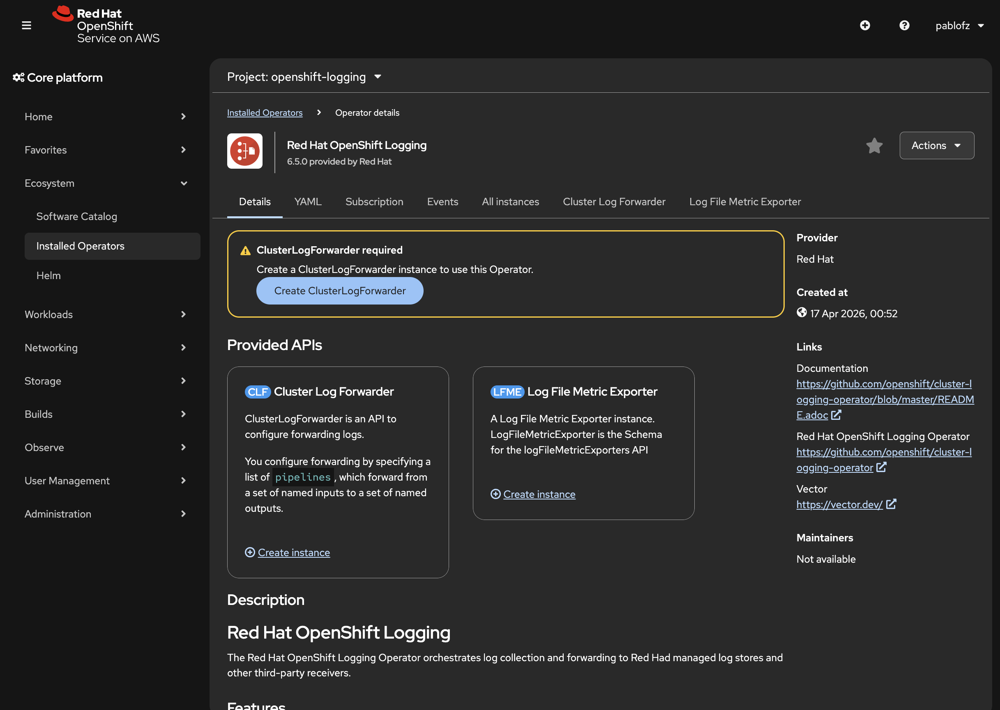
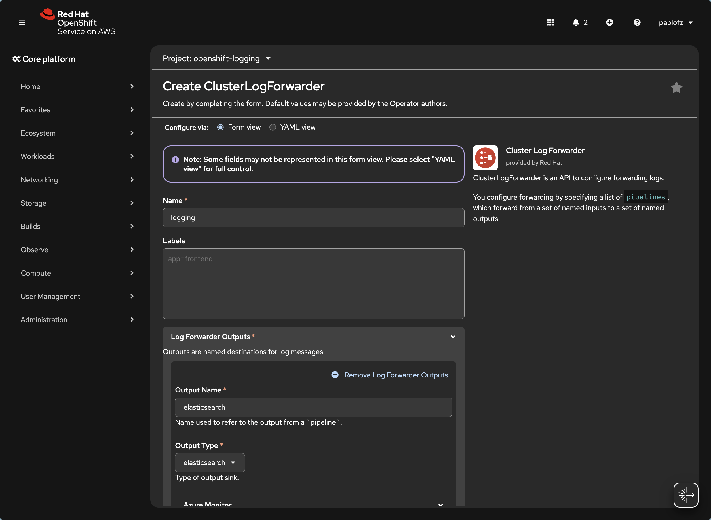
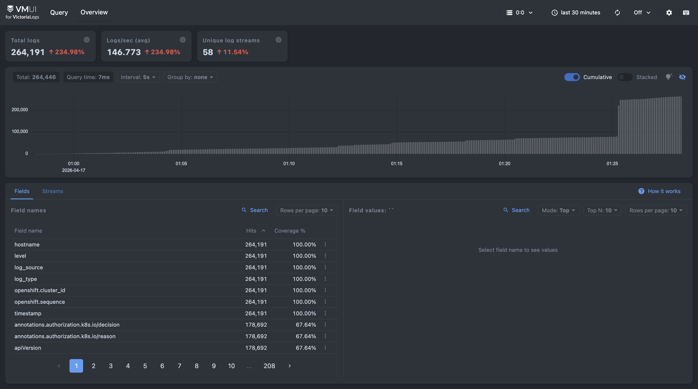
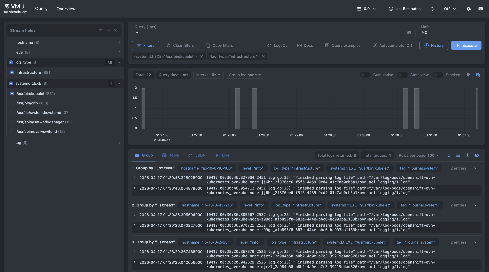

---
build:
  list: never
  publishResources: false
  render: never
sitemap:
  disable: true
---

This guide explains how to collect and store logs from an OpenShift cluster in VictoriaLogs.

## Pre-Requirements

* [OpenShift cluster](https://www.redhat.com/en/technologies/cloud-computing/openshift)
* Admin access to OpenShift cluster
* [kubectl](https://kubernetes.io/docs/tasks/tools/install-kubectl) or [oc](https://github.com/openshift/oc) installed and configured to access OpenShift cluster
* [Helm installed](https://helm.sh/docs/intro/install)

> [!NOTE] Note
> You can replace every `kubectl` command in this guide with `oc`. They are interchangeable in most cases on OpenShift clusters.

## Overview

To collect OpenShift logs, we're going to:

1. [Install VictoriaLogs](https://docs.victoriametrics.com/guides/collecting-openshift-logs-with-victoria-logs/#install-victoria-logs) in the OpenShift Cluster
2. [Configure a service account](https://docs.victoriametrics.com/guides/collecting-openshift-logs-with-victoria-logs/#rbac-configuration) to access the logs
3. [Install the OpenShift Logging operator](https://docs.victoriametrics.com/guides/collecting-openshift-logs-with-victoria-logs/#install-red-hat-openshift-logging-operator)
4. [Configure a Log Forwarder](https://docs.victoriametrics.com/guides/collecting-openshift-logs-with-victoria-logs/#configure-logs-forwarding)
5. [Test log ingestion](https://docs.victoriametrics.com/guides/collecting-openshift-logs-with-victoria-logs/#verify-logs-ingestion) in VictoriaLogs

## Install VictoriaLogs {#install-victoria-logs}

Run the following command to add the [VictoriaMetrics Helm repository](https://github.com/VictoriaMetrics/helm-charts):

```shell
helm repo add vm https://victoriametrics.github.io/helm-charts/
helm repo update
```

To verify that everything is set up correctly, you may run this command:

```shell
helm search repo vm/
```

You should get a list similar to this:

```text
NAME                                    CHART VERSION   APP VERSION     DESCRIPTION
vm/victoria-logs-agent                  0.1.1           v1.50.0         VictoriaLogs Agent - accepts logs from various ...
vm/victoria-logs-collector              0.3.1           v1.50.0         VictoriaLogs Collector - collects logs from Kub...
vm/victoria-logs-single                 0.12.2          v1.50.0         The VictoriaLogs single Helm chart deploys Vict...
...
```

Create a minimal configuration file to run VictoriaLogs in OpenShift:

```shell
cat <<EOF >vl-values.yml
securityContext:
  enabled: true
  allowPrivilegeEscalation: false
  capabilities:
    drop:
      - ALL
  readOnlyRootFilesystem: true

podSecurityContext:
  enabled: true
  runAsNonRoot: true
EOF
```

> Note that, depending on the OpenShift cluster configuration, additional security settings might be required.

Create a namespace for VictoriaLogs called `vl`:

```shell
kubectl create namespace vl
```

Install VictoriaLogs with the following command:

```shell
helm upgrade --namespace vl --install vl vm/victoria-logs-single -f vl-values.yml
```

You should see a message like this:

```text
Release "vl" does not exist. Installing it now.
NAME: vl
LAST DEPLOYED: Fri Apr 17 01:05:42 2026
NAMESPACE: vl
STATUS: deployed
REVISION: 1
DESCRIPTION: Install complete
TEST SUITE: None
NOTES:
The VictoriaLogs write api can be accessed via port 9428 on the following DNS name from within your cluster:
    vl-victoria-logs-single-server-0.vl-victoria-logs-single-server.vl.svc.cluster.local.

Logs Ingestion:
  Get the VictoriaLogs service URL by running these commands in the same shell:
    kubectl --namespace vl port-forward svc/vl-victoria-logs-single-server 9428:9428
    echo http://localhost:9428

  Write URL inside the kubernetes cluster:
    http://vl-victoria-logs-single-server.vl.svc.cluster.local.:9428<protocol-specific-write-endpoint>

  See the documentation for log ingestion and supported write endpoints at https://docs.victoriametrics.com/victorialogs/data-ingestion/.

Read Data:
  The following URL can be used to query data:
    http://vl-victoria-logs-single-server.vl.svc.cluster.local.:9428

  See the documentation for log querying UI at https://docs.victoriametrics.com/victorialogs/querying/#web-ui or HTTP API at https://docs.victoriametrics.com/victorialogs/querying/#http-api
```

Note the "Write URL" value as you'll need it later. In the example above, the value is:

```text
http://vl-victoria-logs-single-server.vl.svc.cluster.local.:9428
```

## RBAC Configuration

Create a service account and cluster role binding for the service account to collect and forward the logs.
OpenShift provides separate `ClusterRoles` for monitoring of different types of logs: `audit`, `infrastructure`, and `application`. 

Create a file to configure the service account and cluster role bindings:

```shell
cat <<EOF >vl-rbac.yml
kind: ServiceAccount
apiVersion: v1
metadata:
  name: victorialogs
  namespace: openshift-logging
---
kind: ClusterRoleBinding
apiVersion: rbac.authorization.k8s.io/v1
metadata:
  name: vl-collect-infra
subjects:
  - kind: ServiceAccount
    name: victorialogs
    namespace: openshift-logging
roleRef:
  apiGroup: rbac.authorization.k8s.io
  kind: ClusterRole
  name: collect-infrastructure-logs
---
kind: ClusterRoleBinding
apiVersion: rbac.authorization.k8s.io/v1
metadata:
  name: vl-collect-audit
subjects:
  - kind: ServiceAccount
    name: victorialogs
    namespace: openshift-logging
roleRef:
  apiGroup: rbac.authorization.k8s.io
  kind: ClusterRole
  name: collect-audit-logs
---
kind: ClusterRoleBinding
apiVersion: rbac.authorization.k8s.io/v1
metadata:
  name: vl-collect-application
subjects:
  - kind: ServiceAccount
    name: victorialogs
    namespace: openshift-logging
roleRef:
  apiGroup: rbac.authorization.k8s.io
  kind: ClusterRole
  name: collect-application-logs
```

Install the roles in OpenShift with:

```shell
kubectl apply -f vl-rbac.yml
```

Alternatively, you can use the OpenShift web console to create the service account and cluster role binding. To do this:

1. Navigate to **ServiceAccounts**.
2. Click on **Create Service Account**.
3. Fill in the name `victorialogs` and namespace `openshift-logging`.
4. Click on **Create**. 
5. Navigate to **RoleBindings**.
6. Create a binding for each `ClusterRole` for subject `victorialogs` in `openshift-logging` namespace.

## Install Red Hat OpenShift Logging operator 

The [Cluster logging operator](https://github.com/openshift/cluster-logging-operator) is a logging solution to support aggregated cluster logging. It is using [Vector](https://vector.dev/) for log collection and shipping to remote storage.

To install the operator:

1. Navigate to **Ecosystem** > **Software Catalog**
2. Search for "OpenShift Logging" and select the operator.
    
3. Press **Install**.
4. Confirm the settings and press **Install** again.
    

## Configure logs forwarding

We need to create a `ClusterLogForwarder` resource to forward logs from the OpenShift Logging operator to VictoriaLogs.

Run the following command to create the resource file:

```shell
cat <<EOF > vl-forwarder.yml
apiVersion: observability.openshift.io/v1
kind: ClusterLogForwarder
metadata:
  name: logging
  namespace: openshift-logging
spec:
  managementState: Managed
  outputs:
    - elasticsearch:
        index: logs
        url: "http://vl-victoria-logs-single-server.vl.svc.cluster.local:9428/insert/elasticsearch/_bulk?_stream_fields=log_type,hostname,stream,kubernetes.pod_name,kubernetes.container_name,kubernetes.pod_namespace&_time_field=@timestamp&_msg_field=message,msg,_msg,log.msg,log.message,log&fake_field=1"
        version: 8
        tuning:
          compression: gzip
      name: victorialogs
      type: elasticsearch
    - elasticsearch:
        index: logs
        url: "http://vl-victoria-logs-single-server.vl.svc.cluster.local:9428/insert/elasticsearch/_bulk?_stream_fields=log_type,hostname,annotations.authorization.k8s.io/decision,hostname,verb&_time_field=@timestamp&_msg_field=annotations.authorization.k8s.io/reason&fake_field=1"
        version: 8
        tuning:
          compression: gzip
      name: victorialogs-audit
      type: elasticsearch
    - elasticsearch:
        index: logs
        url: "http://vl-victoria-logs-single-server.vl.svc.cluster.local:9428/insert/elasticsearch/_bulk?_stream_fields=log_type,hostname,tag,systemd.t.EXE,level&_time_field=@timestamp&_msg_field=message,msg,_msg,log.msg,log.message,log&fake_field=1"
        version: 8
        tuning:
          compression: gzip
      name: victorialogs-infrastructure
      type: elasticsearch
  pipelines:
    - inputRefs:
        - application
      name: application
      outputRefs:
        - victorialogs
    - inputRefs:
        - infrastructure
      name: infrastructure
      outputRefs:
        - victorialogs-infrastructure
    - inputRefs:
        - audit
      name: audit
      outputRefs:
        - victorialogs-audit
  serviceAccount:
    name: victorialogs
EOF
```

Then install the resource with:

```shell
kubectl apply -f vl-forwarder.yml
```

Alternatively, you can configure log forwarding in the OpenShift web console. To do this:
1. Navigate to **Operators** tab
2. Click on **Installed Operators**.
3. Find **Red Hat OpenShift Logging**
4. Navigate to **ClusterLogForwarders**.
5. Click on **Create ClusterLogForwarder**.
    
6. Use the form to configure each type of forwarder.
    
7. Click **Create**

## Verify logs ingestion

We can verify that logs are being collected using the VictoriaLogs VMUI.

First, find the service name for the VMUI with:

```shell
kubectl get svc -n vl -l app.kubernetes.io/instance=vl
```

You should get a result similar to this. Note the name of the service:

```text
NAME                             TYPE        CLUSTER-IP   EXTERNAL-IP   PORT(S)    AGE
vl-victoria-logs-single-server   ClusterIP   None         <none>        9428/TCP   113s
```

Then, port-forward the VMUI service console with:

```shell
kubectl -n vl port-forward svc/vl-victoria-logs-single-server 9428:9428
```

Open your browser in `http://localhost:9428/select/vmui/#/overview` and verify that logs are being collected. This overview page shows the number of log entries being consumed in real time.


<figcaption style="text-align: center; font-style: italic;">Overview pane in VMUI</figcaption>

You can query your logs in the **Query** tab, found in `http://localhost:9428/select/vmui`. 
You can filter streams on the left side pane to filter logs and use [LogsQL](https://docs.victoriametrics.com/victorialogs/logsql/) to search for entries. Note that logs will have `log_type` attached to them to distinguish between different types of logs.


<figcaption style="text-align: center; font-style: italic;">Query pane in VMUI</figcaption>

## See also

- [VictoriaLogs Quickstart](https://docs.victoriametrics.com/victorialogs/quickstart/)
- [Logs Reference](https://docs.victoriametrics.com/victorialogs/logsql/)
- [LogsQL Examples](https://docs.victoriametrics.com/victorialogs/logsql-examples/)

