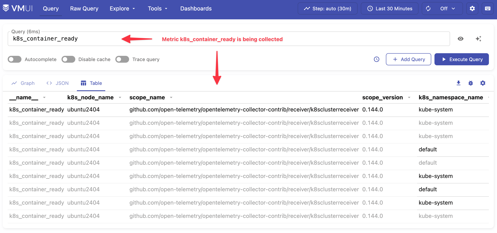
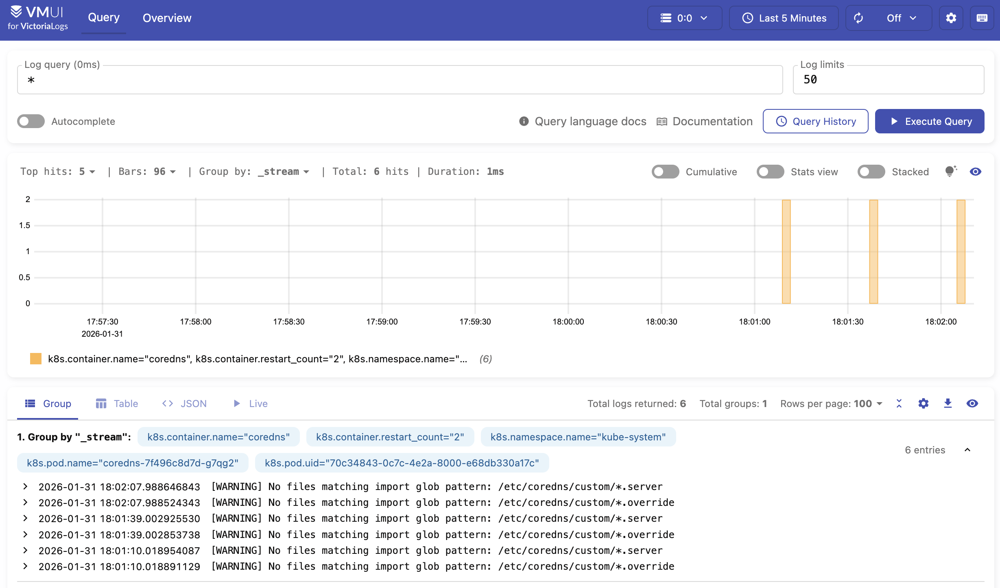

---
build:
  list: never
  publishResources: false
  render: never
sitemap:
  disable: true
---

This guide walks you through deploying VictoriaMetrics and VictoriaLogs on Kubernetes, and collecting [metrics](https://docs.victoriametrics.com/victoriametrics/data-ingestion/opentelemetry-collector/) and [logs](https://docs.victoriametrics.com/victorialogs/data-ingestion/opentelemetry/) from a Go application either directly or via the [OpenTelemetry Collector](https://opentelemetry.io/docs/collector/).

## Pre-Requirements

- [Kubernetes cluster](https://kubernetes.io/docs/tasks/tools/#kind)
- [kubectl](https://kubernetes.io/docs/tasks/tools/#kubectl)
- [helm](https://helm.sh/docs/intro/install/)

## Installation

In order to collect metrics and logs, install the following components:

- [VictoriaMetrics](#victoriametrics)
- [VictoriaLogs](#victorialogs)

### VictoriaMetrics Installation {#victoriametrics}

Create a config file for the VictoriaMetrics chart. The following enables conversion of OpenTelemetry (OTEL) metric names into the Prometheus canonical format:

```sh
cat << EOF > vm-values.yaml
server:
  extraArgs:
    opentelemetry.usePrometheusNaming: true
EOF
```

Install the VictoriaMetrics Helm repo:

```sh
helm repo add vm https://victoriametrics.github.io/helm-charts/
helm repo update
```

Install the VictoriaMetrics single-server version:

```sh
helm install victoria-metrics vm/victoria-metrics-single -f vm-values.yaml
```

Verify it's up and running:

```sh
kubectl get pods
# NAME                                                READY   STATUS    RESTARTS   AGE
# victoria-metrics-victoria-metrics-single-server-0   1/1     Running   0          3m1s
```

The VictoriaMetrics Helm chart provides the following URL for writing data:

```text
Write URL inside the kubernetes cluster:
  http://victoria-metrics-victoria-metrics-single-server.default.svc.cluster.local.:8428/<protocol-specific-write-endpoint>

All supported write endpoints can be found at https://docs.victoriametrics.com/victoriametrics/single-server-victoriametrics/#how-to-import-time-series-data.
```

For OpenTelemetry, the VictoriaMetrics write endpoint is:

```text
http://victoria-metrics-victoria-metrics-single-server.default.svc.cluster.local.:8428/opentelemetry/v1/metrics
```

### VictoriaLogs Installation {#victorialogs}

Install VictoriaLogs:

```sh
helm install victoria-logs vm/victoria-logs-single
```

Verify it's up and running:

```sh
kubectl get pods
# NAME                                            READY   STATUS    RESTARTS   AGE
# victoria-logs-victoria-logs-single-server-0     1/1     Running   0          1m10s
```

The VictoriaLogs Helm chart provides the following URL for writing data:

```text
Write URL inside the kubernetes cluster:
  http://victoria-logs-victoria-logs-single-server.default.svc.cluster.local.:9428/<protocol-specific-write-endpoint>

All supported write endpoints can be found at https://docs.victoriametrics.com/victorialogs/data-ingestion/
```

For OpenTelemetry, the VictoriaLogs write endpoint is:

```text
http://victoria-logs-victoria-logs-single-server.default.svc.cluster.local.:9428/insert/opentelemetry/v1/logs
```

## OpenTelemetry Collector with VictoriaMetrics and VictoriaLogs

The [OpenTelemetry Collector](https://opentelemetry.io/docs/collector/) can be configured to route incoming metrics and logs from applications to the VictoriaMetrics and VictoriaLogs services running in the Kubernetes cluster.


{width="500"}

Add the OpenTelemetry Collector Helm repo:

```sh
helm repo add open-telemetry https://open-telemetry.github.io/opentelemetry-helm-charts
helm repo update
```

Create a config file for the OpenTelemetry Collector:

```sh
cat << EOF > otel-values.yaml
mode: deployment
image:
  repository: "otel/opentelemetry-collector-contrib"
presets:
  clusterMetrics:
    enabled: true
  logsCollection:
    enabled: true
config:
  # deltatocumulative processor is needed to convert metrics with delta temporality to cumulative temporality.
  # VictoriaMetrics doesn't support delta temporality. Skip this processor if you don't use delta temporality.
  processors:
    deltatocumulative:
      max_stale: 5m
  receivers:
    otlp:
      protocols:
        grpc:
          endpoint: 0.0.0.0:4317
        http:
          endpoint: 0.0.0.0:4318
  exporters:
    otlphttp/victoriametrics:
      compression: gzip
      encoding: proto
      # Setting below will work for sending data to VictoriaMetrics single-node version.
      # Cluster version of VictoriaMetrics will require a different URL - https://docs.victoriametrics.com/victoriametrics/cluster-victoriametrics/#url-format
      metrics_endpoint: http://victoria-metrics-victoria-metrics-single-server.default.svc.cluster.local:8428/opentelemetry/v1/metrics
      logs_endpoint: http://victoria-logs-victoria-logs-single-server.default.svc.cluster.local:9428/insert/opentelemetry/v1/logs
      tls:
        insecure: true
  service:
    pipelines:
      logs:
        receivers: [otlp]
        processors: []
        exporters: [otlphttp/victoriametrics]
      metrics:
        receivers: [otlp]
        processors: [deltatocumulative]
        exporters: [otlphttp/victoriametrics]
EOF
```

Install the OpenTelemetry Collector:

```sh
helm upgrade -i otel open-telemetry/opentelemetry-collector -f otel-values.yaml
```

Check that the OpenTelemetry Collector pod is up and running:

```sh
kubectl get pods
# NAME                                            READY   STATUS    RESTARTS   AGE
# otel-opentelemetry-collector-7467bbb559-2pq2n   1/1     Running   0          23m
```

## Confirm that metrics and logs are being ingested

To confirm metrics are being ingested by the Collector, port forward the VictoriaMetrics service:

```sh
kubectl port-forward svc/victoria-metrics-victoria-metrics-single-server 8428
```

Visit [http://localhost:8428/vmui/#/?g0.expr=k8s_container_ready&g0.tab=1](http://localhost:8428/vmui/#/?g0.expr=k8s_container_ready&g0.tab=1) to check if metric `k8s_container_ready` is present.


<figcaption style="text-align: center; font-style: italic;">VictoriaMetrics UI (VMUI) showing the <code>k8s_container_ready</code> metric</figcaption>

> [!NOTE] Tip
> Use the [cardinality explorer](https://docs.victoriametrics.com/victoriametrics/single-server-victoriametrics/#cardinality-explorer) to inspect all available metrics.

To confirm that logs are being ingested by the Collector, port forward the VictoriaLogs service with the following command:

```sh
kubectl port-forward svc/victoria-logs-victoria-logs-single-server 9428
```

Visit [http://localhost:9428/select/vmui](http://localhost:9428/select/vmui) to check if logs ingested by Collector are present.


<figcaption style="text-align: center; font-style: italic;">VMUI for VictoriaLogs showing ingested log entries</figcaption>

See the [OpenTelemetry docs](https://opentelemetry.io/docs/collector/configuration/) for all configuration options.

## Sending metrics and logs from Go application

Metrics and logs can be sent via OpenTelemetry instrumentation libraries. You can use any compatible OpenTelemetry [instrumentation clients](https://opentelemetry.io/docs/languages/) in your application.

In our example, we'll create a web server in [Go](https://go.dev/), with metrics and logs instrumented and sent over the OpenTelemetry Collector. The Collector then forwards the received data to either VictoriaMetrics or VictoriaLogs.

### Sending to OpenTelemetry Collector

Download the [example code](app.go-collector.example) and rename it as `main.go`. The example code implements a dice roll web server that uses the OpenTelemetry SDK to send data to the OpenTelemetry Collector at `http://localhost:4318`.

> [!NOTE] Tip
> See how to set up and run OpenTelemetry Collector [here](#opentelemetry-collector-with-victoriametrics-and-victorialogs).

First, port forward the OpenTelemetry Collector service in your cluster:

```sh
kubectl port-forward svc/otel-opentelemetry-collector 4318
```

Next, open a terminal in the same directory as the example code and execute the following commands:

```sh
go mod init vm/otel
go mod tidy
```

Now try running the application:

```sh
go run .
```

By default, the application in the example listens on `http://localhost:8080`. Start sending requests
to the `http://localhost:8080/rolldice` endpoint to generate some metrics.

Run the following command to send 20 requests to the dice roll example application:

```sh
for i in `seq 1 20`; do curl http://localhost:8080/rolldice; done
```

After a few seconds, you should start seeing metrics sent to VictoriaMetrics by visiting [http://localhost:8428/vmui/#/?g0.expr=dice_rolls_total](http://localhost:8428/vmui/#/?g0.expr=dice_rolls_total)
in your browser or by querying the metric `dice_rolls_total` in the UI interface.


<figcaption style="text-align: center; font-style: italic;">VMUI showing collected metrics for <code>dice_rolls_total</code></figcaption>

Logs should be available by visiting [http://localhost:9428/select/vmui](http://localhost:9428/select/vmui)
using query `service.name: unknown_service:otel`.


<figcaption style="text-align: center; font-style: italic;">VMUI for VictoriaLogs showing collected logs for <code>service.name: unknown_service:otel</code></figcaption>

### Sending without OpenTelemetry Collector

You can send telemetry directly from your application to VictoriaMetrics and VictoriaLogs; the Collector is optional. You may use any OpenTelemetry [instrumentation client](https://opentelemetry.io/docs/languages/) to communicate directly with VictoriaMetrics and VictoriaLogs.


{width="500"}

This time, we'll run a different web server, also in [Go](https://go.dev/) and instrumented with metrics and logs. This demo application sends telemetry data directly to VictoriaMetrics and VictoriaLogs services.

Download the [example code](app.go.example) and rename it as `main.go`. In the same directory, execute the following commands:

```sh
go mod init vm/otel
go mod tidy
```

The example implements a web server with two HTTP handlers: `/api/slow` and `/api/fast`. Start the application with:

```sh
go run main.go 
2024/03/25 19:27:41 Starting web server...
2024/03/25 19:27:41 web server started at localhost:8081.
```

Make sure that VictoriaMetrics and VictoriaLogs are available locally at their default ports. In a separate terminal, port forward the VictoriaMetrics and VictoriaLogs services:

```sh
# port-forward victoriametrics to ingest metrics
kubectl port-forward svc/victoria-metrics-victoria-metrics-single-server 8428
# port-forward victorialogs to ingest logs
kubectl port-forward svc/victoria-logs-victoria-logs-single-server 9428
```

Generate a few HTTP requests to both routes so the application sends metrics and logs to VictoriaMetrics and VictoriaLogs.

```sh
for i in `seq 1 20`; do curl http://localhost:8081/api/fast; done
for i in `seq 1 5`; do curl http://localhost:8081/api/slow; done
```

After a few seconds, you should start seeing metrics sent to VictoriaMetrics by visiting [http://localhost:8428/vmui/#/?g0.expr=http_requests_total](http://localhost:8428/vmui/#/?g0.expr=http_requests_total).


<figcaption style="text-align: center; font-style: italic;">VMUI showing metrics for <code>http_requests_total</code></figcaption>

> [!NOTE] Tip
> Check other available metrics by visiting the [cardinality explorer](https://docs.victoriametrics.com/victoriametrics/single-server-victoriametrics/#cardinality-explorer) page.

Logs should be available by visiting [http://localhost:9428/select/vmui](http://localhost:9428/select/vmui)
using query `service.name: unknown_service:otel`.


<figcaption style="text-align: center; font-style: italic;">VMUI for VictoriaLogs showing logs for <code>service.name: unknown_service:otel</code></figcaption>

## Limitations

- VictoriaMetrics and VictoriaLogs do not support experimental JSON encoding [format](https://github.com/open-telemetry/opentelemetry-proto/blob/main/examples/metrics.json).
- VictoriaMetrics supports only the `AggregationTemporalityCumulative` type for [histogram](https://opentelemetry.io/docs/specs/otel/metrics/data-model/#histogram) and [summary](https://opentelemetry.io/docs/specs/otel/metrics/data-model/#summary-legacy). Either consider using cumulative temporality or use the [`delta-to-cumulative processor`](https://github.com/open-telemetry/opentelemetry-collector-contrib/tree/main/processor/deltatocumulativeprocessor) to convert to cumulative temporality in OpenTelemetry Collector.
