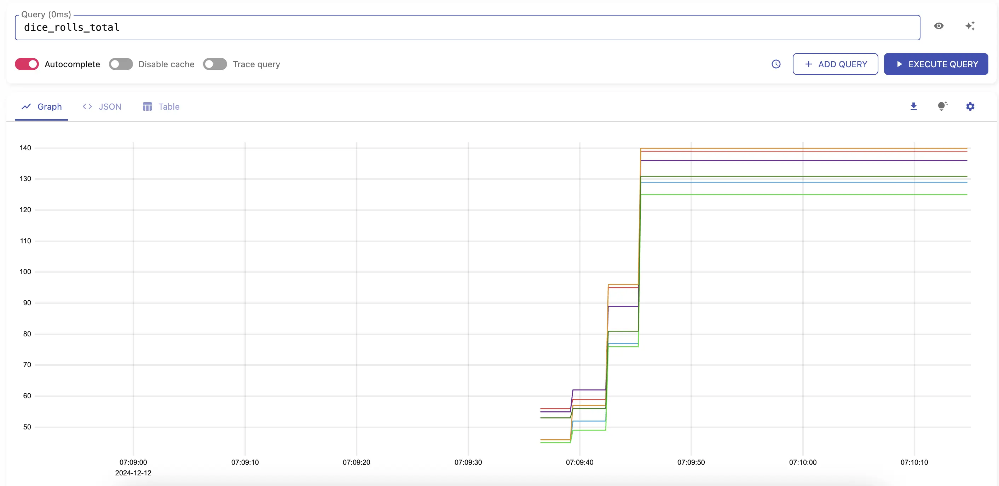
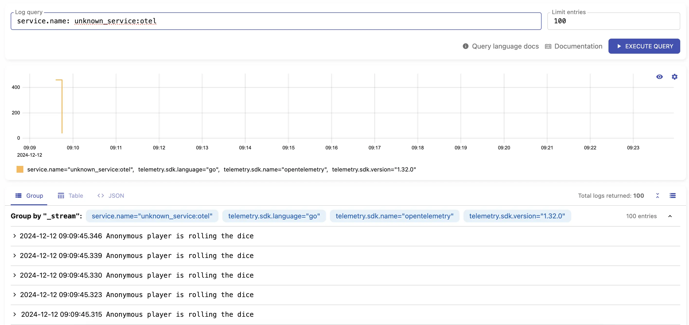
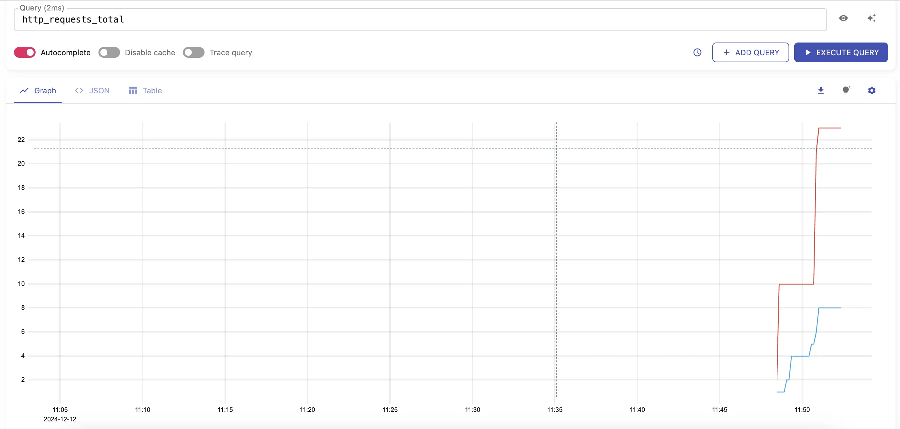
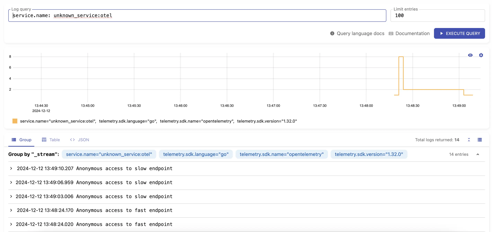

VictoriaMetrics and VictoriaLogs support ingestion [metrics](https://docs.victoriametrics.com/single-server-victoriametrics/#sending-data-via-opentelemetry)
and [logs](https://docs.victoriametrics.com/victorialogs/data-ingestion/opentelemetry/) in OpenTelemetry format.
This guide covers examples of using [opentelemetry-collector](https://opentelemetry.io/docs/collector/) and direct pushing of metrics and logs from the Go application.

## Pre-Requirements

* [kubernetes cluster](https://kubernetes.io/docs/tasks/tools/#kind)
* [kubectl](https://kubernetes.io/docs/tasks/tools/#kubectl)
* [helm](https://helm.sh/docs/intro/install/)

## Installation

### VictoriaMetrics

Install VictoriaMetrics helm repo:
```sh
helm repo add vm https://victoriametrics.github.io/helm-charts/
helm repo update
```

Add VictoriaMetrics chart values to convert OTEL metric names to Prometheus canonical format:
```sh
cat << EOF > vm-values.yaml
server:
  extraArgs:
    opentelemetry.usePrometheusNaming: true
EOF
```

Install VictoriaMetrics single-server version:
```sh
helm install victoria-metrics vm/victoria-metrics-single -f vm-values.yaml
```

Verify it's up and running:
```sh
kubectl get pods
# NAME                                                READY   STATUS    RESTARTS   AGE
# victoria-metrics-victoria-metrics-single-server-0   1/1     Running   0          3m1s
```

VictoriaMetrics helm chart provides the following URL for writing data:
```text
Write URL inside the kubernetes cluster:
  http://victoria-metrics-victoria-metrics-single-server.default.svc.cluster.local.:8428/<protocol-specific-write-endpoint>

All supported write endpoints can be found at https://docs.victoriametrics.com/single-server-victoriametrics/#how-to-import-time-series-data.
```

For OpenTelemetry VictoriaMetrics write endpoint is:
```text
http://victoria-metrics-victoria-metrics-single-server.default.svc.cluster.local.:8428/opentelemetry/v1/metrics
```

### VictoriaLogs

Install VictoriaLogs:
```sh
helm install victoria-logs vm/victoria-logs-single
```

Verify it's up and running:
```sh
kubectl get pods
# NAME                                            READY   STATUS    RESTARTS   AGE
# victoria-logs-victoria-logs-single-server-0     1/1     Running   0          1m10s
```

VictoriaLogs helm chart provides the following URL for writing data:
```text
Write URL inside the kubernetes cluster:
  http://victoria-logs-victoria-logs-single-server.default.svc.cluster.local.:9428/<protocol-specific-write-endpoint>

All supported write endpoints can be found at https://docs.victoriametrics.com/victorialogs/data-ingestion/
```

For OpenTelemetry VictoriaLogs write endpoint is:
```text
http://victoria-logs-victoria-logs-single-server.default.svc.cluster.local.:9428/insert/opentelemetry/v1/logs
```

## OpenTelemetry collector with VictoriaMetrics and VictoriaLogs


{width="500"}

Add OpenTelemetry helm repo:
```sh
helm repo add open-telemetry https://open-telemetry.github.io/opentelemetry-helm-charts
helm repo update
```

Add OpenTelemetry Collector values:
```sh
cat << EOF > otel-values.yaml
mode: deployment
image:
  repository: "otel/opentelemetry-collector-contrib"
presets:
  clusterMetrics:
    enabled: true
  logsCollection:
    enabled: true
config:
  # deltatocumulative processor is needed to convert metrics with delta temporality to cumulative temporality.
  # VictoriaMetrics doesn't support delta temporality. Skip this processor if you don't use delta temporality.
  processors:
    deltatocumulative:
      max_stale: 5m
  receivers:
    otlp:
      protocols:
        grpc:
          endpoint: 0.0.0.0:4317
        http:
          endpoint: 0.0.0.0:4318
  exporters:
    otlphttp/victoriametrics:
      compression: gzip
      encoding: proto
      # Setting below will work for sending data to VictoriaMetrics single-node version.
      # Cluster version of VictoriaMetrics will require a different URL - https://docs.victoriametrics.com/cluster-victoriametrics/#url-format
      metrics_endpoint: http://victoria-metrics-victoria-metrics-single-server.default.svc.cluster.local:8428/opentelemetry/v1/metrics
      logs_endpoint: http://victoria-logs-victoria-logs-single-server.default.svc.cluster.local:9428/insert/opentelemetry/v1/logs
      tls:
        insecure: true
  service:
    pipelines:
      logs:
        processors: []
        exporters: [otlphttp/victoriametrics]
      metrics:
        receivers: [otlp]
        processors: [deltatocumulative]
        exporters: [otlphttp/victoriametrics]
EOF
```

Install OpenTelemetry Collector helm chart:
```sh
helm upgrade -i otel open-telemetry/opentelemetry-collector -f otel-values.yaml
```

Check if OpenTelemetry Collector pod is up and running:
```sh
kubectl get pod
# NAME                                            READY   STATUS    RESTARTS   AGE
# otel-opentelemetry-collector-7467bbb559-2pq2n   1/1     Running   0          23m
```

Forward VictoriaMetrics port to local machine to explore metrics ingested by the collector:
```sh
kubectl port-forward svc/victoria-metrics-victoria-metrics-single-server 8428
```

Visit [http://localhost:8428/vmui/#/?g0.expr=k8s_container_ready](http://localhost:8428/vmui/#/?g0.expr=k8s_container_ready) to check if metric `k8s_container_ready` is present.
Check other available metrics by visiting [cardinality explorer](https://docs.victoriametrics.com/#cardinality-explorer) page.

Forward VictoriaLogs port to local machine to explore logs ingested by the collector:
```sh
kubectl port-forward svc/victoria-logs-victoria-logs-single-server 9428
```

Visit [http://localhost:9428/select/vmui](http://localhost:9428/select/vmui) to check if logs ingested by collector are present.

The full version of possible configuration options for the collector can be found in [OpenTelemetry docs](https://opentelemetry.io/docs/collector/configuration/).

## Sending metrics and logs from Go application

Metrics and logs can be sent via OpenTelemetry instrumentation libraries. You can use any compatible OpenTelemetry
instrumentation [clients](https://opentelemetry.io/docs/languages/).
In our example, we'll create a WEB server in [Golang](https://go.dev/), instrument it with metrics and logs and configure
it to send telemetry data to OpenTelemetry collector. The collector will then forward received data to
VictoriaMetrics or VictoriaLogs.

### Sending to OpenTelemetry collector

Create file `main.go` from [example](app.go-collector.example) that implements a dice roll WEB server instrumented with
OpenTelemetry SDK and is configured to send data to OpenTelemetry collector at http://localhost:4318 address.
See how to setup and run OpenTelemetry collector [here](#OpenTelemetry-collector-with-VictoriaMetrics-and-VictoriaLogs).

In the same directory with the file create the `go.mod` file and execute following commands:
```sh
go mod init vm/otel
go mod tidy
```

Now try running the application:
```sh
go run .
```

By default, the application from example is listening at `http://localhost:8080`. Start sending requests 
to http://localhost:8080/rolldice endpoint to generate some metrics. The following command will send 20 requests:
```sh
for i in `seq 1 20`; do curl http://localhost:8080/rolldice; done
```

After a few seconds you should start seeing metrics sent to VictoriaMetrics by visiting [http://localhost:8428/vmui/#/?g0.expr=dice_rolls_total](http://localhost:8428/vmui/#/?g0.expr=dice_rolls_total)
in your browser or by querying the metric `dice_rolls_total` in the UI interface.


Logs should be available by visiting [http://localhost:9428/select/vmui](http://localhost:9428/select/vmui) 
using query `service.name: unknown_service:otel`.


### Sending without OpenTelemetry collector

Metrics and logs can be ingested into VictoriaMetrics and VictoriaLogs directly via HTTP requests. 
Use any compatible OpenTelemetry instrumentation [clients](https://opentelemetry.io/docs/languages/).


{width="500"}

In our example, we'll create a WEB server in [Golang](https://go.dev/), instrument it with metrics and logs and configure
it to send this telemetry data to VictoriaMetrics and VictoriaLogs.

Create file `main.go` from [example](app.go.example). In the same directory with the file create the `go.mod` file and execute following commands:
```sh
go mod init vm/otel
go mod tidy
```

The example implements WEB server with two HTTP handlers: `/api/slow` and `/api/fast`. Start the application:
```sh
go run main.go 
2024/03/25 19:27:41 Starting web server...
2024/03/25 19:27:41 web server started at localhost:8081.
```

Make sure that VictoriaMetrics and VictoriaLogs are available locally at their default ports:
```sh
# port-forward victoriametrics to ingest metrics
kubectl port-forward victoria-metrics-victoria-metrics-single-server-0 8428
# port-forward victorialogs to ingest logs
kubectl port-forward victoria-logs-victoria-logs-single-server-0 9428
```

Visit application links [http://localhost:8081/api/fast](http://localhost:8081/api/fast) or [http://localhost:8081/api/slow](http://localhost:8081/api/slow)
couple of times. The application will generate metrics and logs and will send them to VictoriaMetrics and VictoriaLogs.

After a few seconds you should start seeing metrics sent to VictoriaMetrics by visiting 
[http://localhost:8428/vmui/#/?g0.expr=http_requests_total](http://localhost:8428/vmui/#/?g0.expr=http_requests_total).



Check other available metrics by visiting [cardinality explorer](https://docs.victoriametrics.com/#cardinality-explorer) page.

Logs should be available by visiting [http://localhost:9428/select/vmui](http://localhost:9428/select/vmui)
using query `service.name: unknown_service:otel`.



## Limitations

* VictoriaMetrics and VictoriaLogs do not support experimental JSON encoding [format](https://github.com/open-telemetry/opentelemetry-proto/blob/main/examples/metrics.json).
* VictoriaMetrics supports only `AggregationTemporalityCumulative` type for [histogram](https://opentelemetry.io/docs/specs/otel/metrics/data-model/#histogram) and [summary](https://opentelemetry.io/docs/specs/otel/metrics/data-model/#summary-legacy). Either consider using cumulative temporality or try [`delta-to-cumulative processor`](https://github.com/open-telemetry/opentelemetry-collector-contrib/tree/main/processor/deltatocumulativeprocessor) to make conversion to cumulative temporality in OTEL Collector.
