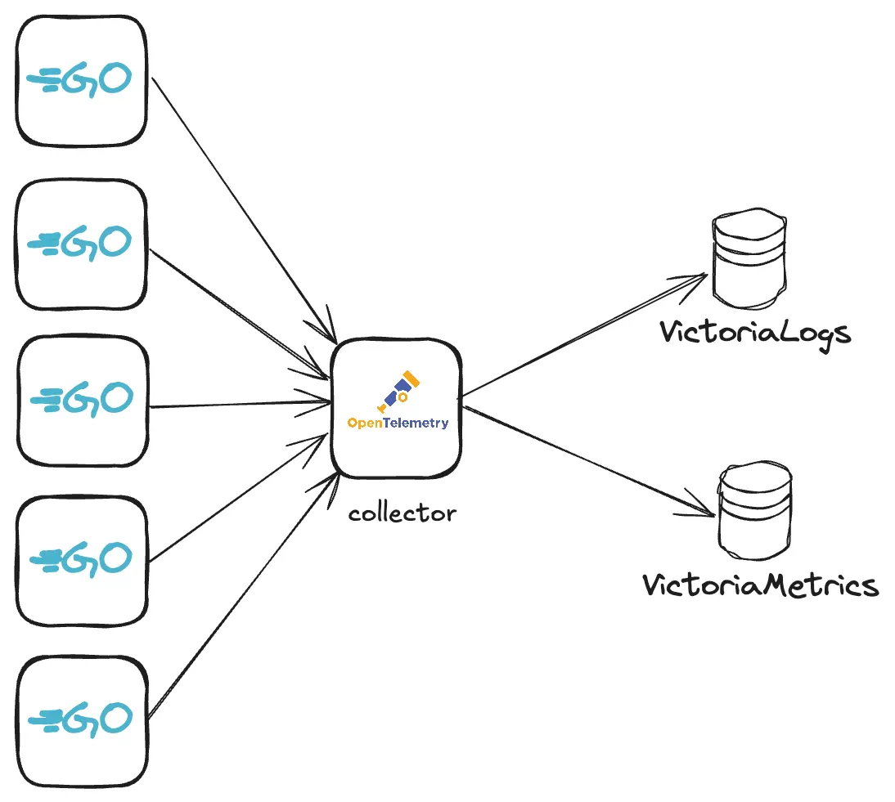
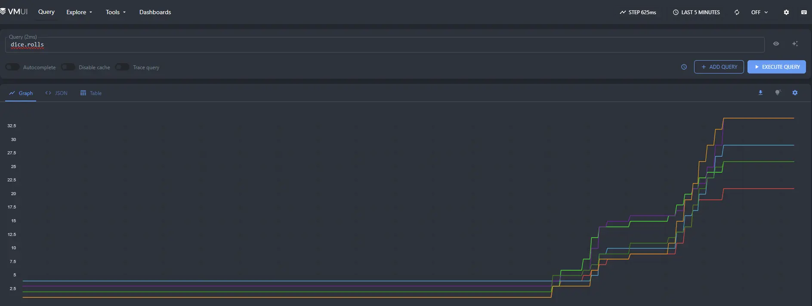
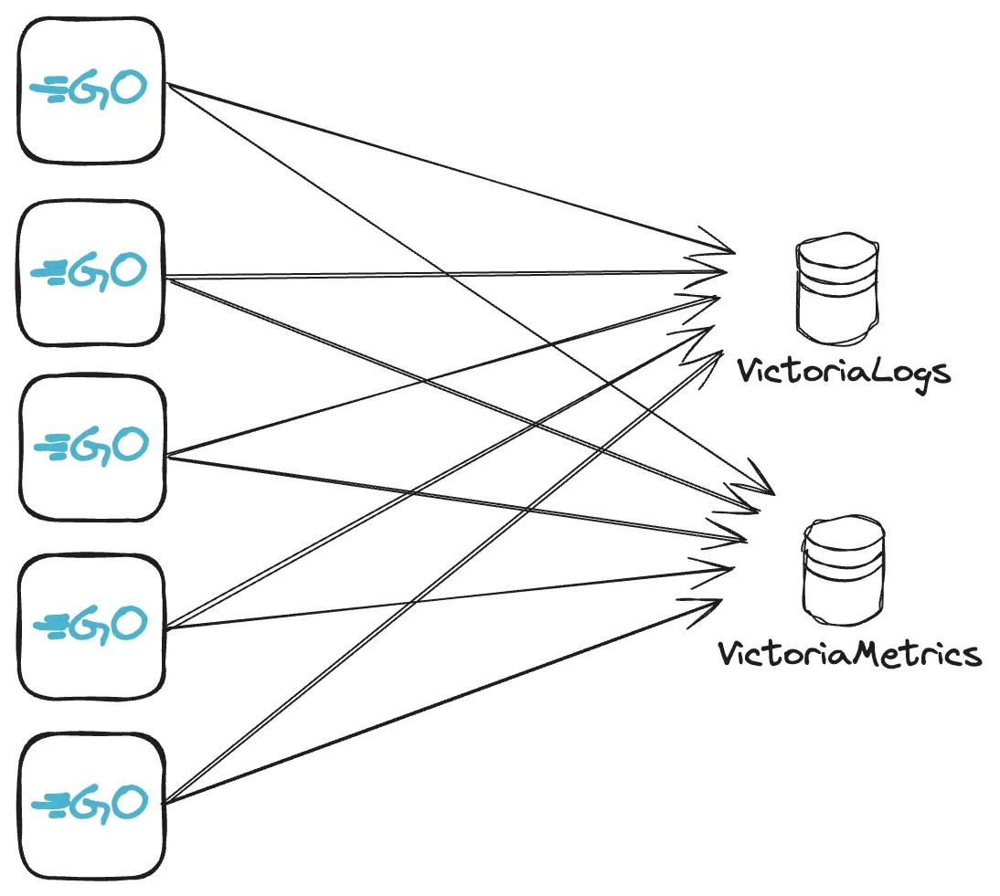
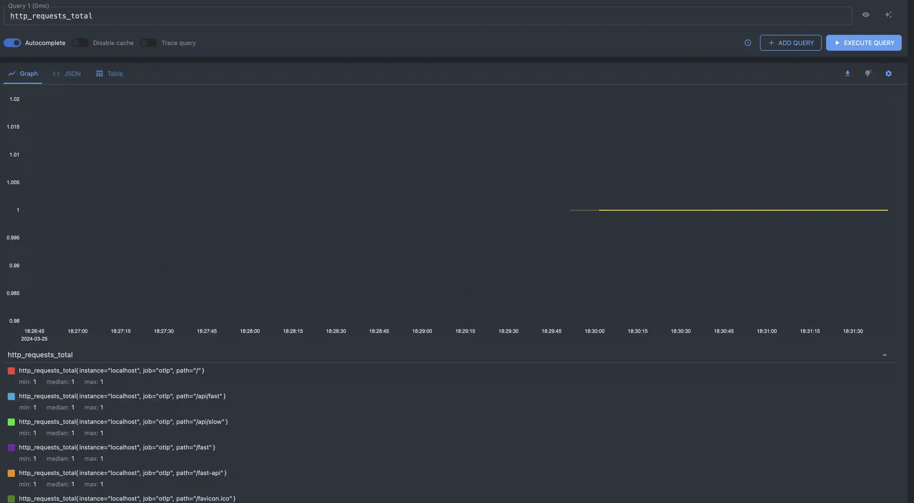

VictoriaMetrics supports metrics ingestion with [OpenTelemetry metrics format](https://opentelemetry.io/docs/specs/otel/metrics/).
This guide covers data ingestion via [opentelemetry-collector](https://opentelemetry.io/docs/collector/) and direct metrics push from application.

## Pre-Requirements  

* [kubernetes cluster](https://kubernetes.io/docs/tasks/tools/#kind)
* [kubectl](https://kubernetes.io/docs/tasks/tools/#kubectl)
* [helm](https://helm.sh/docs/intro/install/)

### Install VictoriaMetrics single-server via helm chart

Install single-server version:
```sh
helm repo add vm https://victoriametrics.github.io/helm-charts/
helm repo update 
helm install victoria-metrics vm/victoria-metrics-single
```

Verify it's up and running:

```sh
kubectl get pods
# victoria-metrics-victoria-metrics-single-server-0   1/1     Running   0          3m1s
```

Helm chart provides the following urls for reading and writing data:

 ```text
Write url inside the kubernetes cluster:
    http://victoria-metrics-victoria-metrics-single-server.default.svc.cluster.local:8428

Read Data:
  The following url can be used as the datasource url in Grafana:
    http://victoria-metrics-victoria-metrics-single-server.default.svc.cluster.local:8428
```

## Using opentelemetry-collector with VictoriaMetrics



### Deploy opentelemetry-collector and configure metrics forwarding

```sh
helm repo add open-telemetry https://open-telemetry.github.io/opentelemetry-helm-charts
helm repo update 

# add values
cat << EOF > values.yaml
mode: deployment
image:
  repository: "otel/opentelemetry-collector-contrib"
presets:
  clusterMetrics:
    enabled: true
config:
  receivers:
    otlp:
      protocols:
        grpc:
          endpoint: 0.0.0.0:4317
        http:
          endpoint: 0.0.0.0:4318
  exporters:
   otlphttp/victoriametrics:
     compression: gzip
     encoding: proto
     endpoint: http://victoria-metrics-victoria-metrics-single-server.default.svc.cluster.local:8428/opentelemetry
     tls:
        insecure: true
  service:
    pipelines:
      metrics:
        receivers: [otlp]
        processors: []
        exporters: [otlphttp/victoriametrics]
EOF

# install helm chart
helm upgrade -i otl-collector open-telemetry/opentelemetry-collector -f values.yaml

# check if pod is healthy
kubectl get pod
NAME                                                     READY   STATUS    RESTARTS   AGE
otl-collector-opentelemetry-collector-7467bbb559-2pq2n   1/1     Running   0          23m

# forward port to local machine to verify metrics are ingested
kubectl port-forward service/victoria-metrics-victoria-metrics-single-server 8428

# check metric `k8s_container_ready` via browser http://localhost:8428/vmui/#/?g0.expr=k8s_container_ready

# forward port to local machine to setup opentelemetry-collector locally
kubectl port-forward otl-collector-opentelemetry-collector 4318

```

The full version of possible configuration options could be found in [OpenTelemetry docs](https://opentelemetry.io/docs/collector/configuration/).

## Sending to VictoriaMetrics via OpenTelemetry
Metrics could be sent to VictoriaMetrics via OpenTelemetry instrumentation libraries. You can use any compatible OpenTelemetry instrumentation [clients](https://opentelemetry.io/docs/languages/).
In our example, we'll create a WEB server in [Golang](https://go.dev/) and instrument it with metrics.

### Building the Go application instrumented with metrics
Copy the go file from [here](app.go-collector.example). This will give you a basic implementation of a dice roll WEB server with the urls for opentelemetry-collector pointing to localhost:4318. 
In the same directory run the following command to create the `go.mod` file:
```sh
go mod init vm/otel
```

For demo purposes, we'll add the following dependencies to `go.mod` file:
```go

require (
	go.opentelemetry.io/contrib/instrumentation/net/http/otelhttp v0.52.0
	go.opentelemetry.io/otel v1.27.0
	go.opentelemetry.io/otel/exporters/otlp/otlpmetric/otlpmetrichttp v1.27.0
	go.opentelemetry.io/otel/exporters/otlp/otlptrace/otlptracehttp v1.27.0
	go.opentelemetry.io/otel/metric v1.27.0
	go.opentelemetry.io/otel/sdk v1.27.0
	go.opentelemetry.io/otel/sdk/metric v1.27.0
)

require (
	github.com/cenkalti/backoff/v4 v4.3.0 // indirect
	github.com/felixge/httpsnoop v1.0.4 // indirect
	github.com/go-logr/logr v1.4.1 // indirectdice.rolls
	github.com/go-logr/stdr v1.2.2 // indirect
	github.com/grpc-ecosystem/grpc-gateway/v2 v2.20.0 // indirect
	go.opentelemetry.io/otel/exporters/otlp/otlptrace v1.27.0 // indirect
	go.opentelemetry.io/otel/trace v1.27.0 // indirect
	go.opentelemetry.io/proto/otlp v1.2.0 // indirect
	golang.org/x/net v0.25.0 // indirect
	golang.org/x/sys v0.20.0 // indirect
	golang.org/x/text v0.15.0 // indirect
	google.golang.org/genproto/googleapis/api v0.0.0-20240520151616-dc85e6b867a5 // indirect
	google.golang.org/genproto/googleapis/rpc v0.0.0-20240515191416-fc5f0ca64291 // indirect
	google.golang.org/grpc v1.64.0 // indirect
	google.golang.org/protobuf v1.34.1 // indirect
)
```

Once you have these in your `go.mod` file, you can run the following command to download the dependencies:
```sh
go mod tidy
```

Now you can run the application:
```sh
go run .
```

### Test metrics ingestion
By default, the application will be available at `localhost:8080`. You can start sending requests to /rolldice endpoint to generate metrics. The following command will send 20 requests to the /rolldice endpoint:
```sh
for i in `seq 1 20`; do curl http://localhost:8080/rolldice; done
```

After a few seconds you should start to see metrics sent over to the vmui interface by visiting `http://localhost:8428/vmui/#/?g0.expr=dice.rolls` in your browser or by querying the metric `dice.rolls` in the vmui interface.

## Direct metrics push

Metrics could be ingested into VictoriaMetrics directly with HTTP requests. You can use any compatible OpenTelemetry 
instrumentation [clients](https://opentelemetry.io/docs/languages/).
In our example, we'll create a WEB server in [Golang](https://go.dev/) and instrument it with metrics.




### Building the Go application instrumented with metrics

See the full source code of the example [here](app.go.example).

The list of OpenTelemetry dependencies for `go.mod` is the following:

```go
go 1.20

require (
	go.opentelemetry.io/otel v1.7.0
	go.opentelemetry.io/otel/exporters/otlp/otlpmetric v0.30.0
	go.opentelemetry.io/otel/exporters/otlp/otlpmetric/otlpmetrichttp v0.30.0
	go.opentelemetry.io/otel/metric v0.30.0
	go.opentelemetry.io/otel/sdk v1.7.0
	go.opentelemetry.io/otel/sdk/metric v0.30.0
)
```

Let's create a new file `main.go` with basic implementation of the WEB server:
```go
package main

func main() {
  mux := http.NewServeMux()
  mux.HandleFunc("/api/fast", func(writer http.ResponseWriter, request *http.Request) {
    writer.WriteHeader(http.StatusOK)
    writer.Write([]byte(`fast ok`))
  })
  mux.HandleFunc("/api/slow", func(writer http.ResponseWriter, request *http.Request) {
    time.Sleep(time.Second * 2)
    writer.WriteHeader(http.StatusOK)
    writer.Write([]byte(`slow ok`))
  })

  mw, err := newMetricsMiddleware(mux)
  if err != nil {
    panic(fmt.Sprintf("cannot build metricMiddleWare: %q", err))
  }

  go func() {
    http.ListenAndServe("localhost:8081", mw)
  }()
}
```

In the code above, we used `newMetricsMiddleware` function to create a `handler` for our server.
Let's define it below:
```go

type metricMiddleWare struct {
	h               http.Handler
	requestsCount   syncint64.Counter
	requestsLatency syncfloat64.Histogram
	activeRequests  int64
}

func newMetricsMiddleware(h http.Handler) (*metricMiddleWare, error) {
	mw := &metricMiddleWare{h: h}
	mc, err := newMetricsController(ctx)
	if err != nil {
		return nil, fmt.Errorf("cannot build metrics collector: %w", err)
	}
	global.SetMeterProvider(mc)

	prov := mc.Meter("")

	mw.requestsLatency, err = prov.SyncFloat64().Histogram("http_request_latency_seconds")
	if err != nil {
		return nil, fmt.Errorf("cannot create histogram: %w", err)
	}
	mw.requestsCount, err = prov.SyncInt64().Counter("http_requests_total")
	if err != nil {
		return nil, fmt.Errorf("cannot create syncInt64 counter: %w", err)
	}
	ar, err := prov.AsyncInt64().Gauge("http_active_requests")
	if err != nil {
		return nil, fmt.Errorf("cannot create AsyncInt64 gauge: %w", err)
	}
	if err := prov.RegisterCallback([]instrument.Asynchronous{ar}, func(ctx context.Context) {
		ar.Observe(ctx, atomic.LoadInt64(&mw.activeRequests))
	}); err != nil {
		return nil, fmt.Errorf("cannot Register int64 gauge: %w", err)
	}

	return mw, nil
}
```

The new type `metricMiddleWare` is instrumented with 3 [metrics](https://opentelemetry.io/docs/specs/otel/metrics/data-model/#timeseries-model)
initialized in `newMetricsMiddleware` method:
* counter `http_requests_total`
* histogram `http_request_latency_seconds`
* gauge `http_active_requests`

Let's implement http.Handler interface for `metricMiddleWare` by adding `ServeHTTP` method:
```go
func (m *metricMiddleWare) ServeHTTP(w http.ResponseWriter, r *http.Request) {
	t := time.Now()
	path := r.URL.Path
	m.requestsCount.Add(nil, 1, attribute.String("path", path))
	atomic.AddInt64(&m.activeRequests, 1)
	defer func() {
		atomic.AddInt64(&m.activeRequests, -1)
		m.requestsLatency.Record(nil, time.Since(t).Seconds(), attribute.String("path", path))
	}()
	m.h.ServeHTTP(w, r)
}
```

In method above, our middleware processes received HTTP requests and updates metrics with each new request. 
But for these metrics to be shipped we need to add a new method `newMetricsController` to organize metrics collection:
```go
func newMetricsController(ctx context.Context) (*controller.Controller, error) {
	options := []otlpmetrichttp.Option{
		otlpmetrichttp.WithEndpoint("<VictoriaMetrics endpoint - host:port>"),
		otlpmetrichttp.WithURLPath("/opentelemetry/api/v1/push"),
	}

	metricExporter, err := otlpmetrichttp.New(ctx, options...)
	if err != nil {
		return nil, fmt.Errorf("cannot create otlphttp exporter: %w", err)
	}

	resourceConfig, err := resource.New(ctx, resource.WithAttributes(attribute.String("job", "otlp"), attribute.String("instance", "localhost")))
	if err != nil {
		return nil, fmt.Errorf("cannot create meter resource: %w", err)
	}
	meterController := controller.New(
		processor.NewFactory(
			selector.NewWithHistogramDistribution(
				histogram.WithExplicitBoundaries([]float64{0.01, 0.05, 0.1, 0.5, 0.9, 1.0, 5.0, 10.0, 100.0}),
			),
			aggregation.CumulativeTemporalitySelector(),
			processor.WithMemory(true),
		),
		controller.WithExporter(metricExporter),
		controller.WithCollectPeriod(time.Second * 10),
		controller.WithResource(resourceConfig),
	)
	if err := meterController.Start(ctx); err != nil {
		return nil, fmt.Errorf("cannot start meter controller: %w", err)
	}
	return meterController, nil
}
```

This controller will collect and push collected metrics to VictoriaMetrics address with interval of `10s`.

See the full source code of the example [here](app.go.example).

### Test metrics ingestion

In order to push metrics of our WEB server to VictoriaMetrics it is necessary to ensure that VictoriaMetrics ingestion
endpoint is available locally.
In previous steps we already deployed a single-server VictoriaMetrics, so let's make it available locally:
```sh
# port-forward victoriametrics to ingest metrics
kubectl port-forward victoria-metrics-victoria-metrics-single-server-0 8428
```

Now let's run our WEB server and call its APIs:
```sh
# build and run the app
go run main.go 
2024/03/25 19:27:41 Starting web server...
2024/03/25 19:27:41 web server started at localhost:8081.

# execute few queries with curl
curl http://localhost:8081/api/fast
curl http://localhost:8081/api/slow
```

Open [vmui](https://docs.victoriametrics.com/#vmui) and query `http_requests_total` or `http_active_requests`
with [metricsql](https://docs.victoriametrics.com/metricsql/).



## Limitations

* VictoriaMetrics doesn't support experimental JSON encoding [format](https://github.com/open-telemetry/opentelemetry-proto/blob/main/examples/metrics.json).
* VictoriaMetrics supports only `AggregationTemporalityCumulative` type for [histogram](https://opentelemetry.io/docs/specs/otel/metrics/data-model/#histogram) and [summary](https://opentelemetry.io/docs/specs/otel/metrics/data-model/#summary-legacy)
