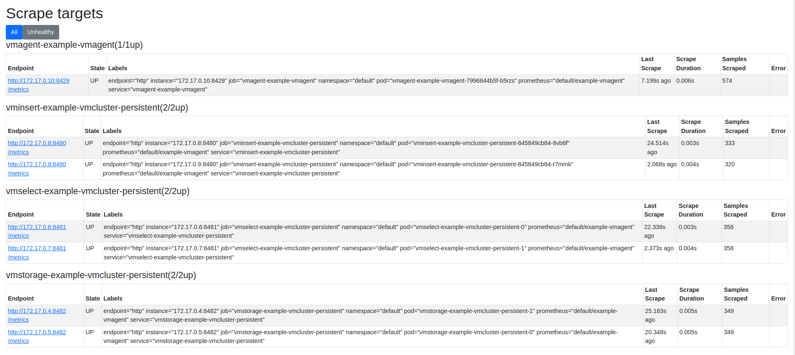
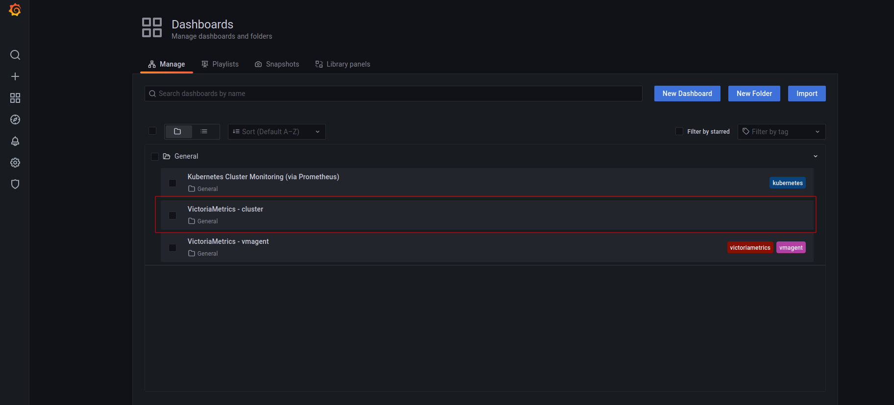

# Getting started with VM Operator

**The guide covers:**

* The setup of a [VM Operator](https://github.com/VictoriaMetrics/helm-charts/tree/master/charts/victoria-metrics-operator) via Helm in [Kubernetes](https://kubernetes.io/) with Helm charts.
* The setup of a [VictoriaMetrics Cluster](https://docs.victoriametrics.com/Cluster-VictoriaMetrics.html) via [VM Operator](https://github.com/VictoriaMetrics/helm-charts/tree/master/charts/victoria-metrics-operator).
* How to add CRD for [VictoriaMetrics Cluster](https://docs.victoriametrics.com/Cluster-VictoriaMetrics.html) via [VM Operator](https://github.com/VictoriaMetrics/helm-charts/tree/master/charts/victoria-metrics-operator). 
* How to visualize stored data 
* How to store metrics in [VictoriaMetrics](https://victoriametrics.com)

**Preconditions**

* [Kubernetes cluster 1.20.9-gke.1001](https://cloud.google.com/kubernetes-engine). We use GKE cluster from [GCP](https://cloud.google.com/) but this guide also applies to any Kubernetes cluster. For example, [Amazon EKS](https://aws.amazon.com/ru/eks/).
* [Helm 3](https://helm.sh/docs/intro/install).
* [kubectl 1.21+](https://kubernetes.io/docs/tasks/tools/install-kubectl).

## 1. VictoriaMetrics Helm repository

See how to work with [VictoriaMetrics Helm repository in previous guide](https://docs.victoriametrics.com/guides/k8s-monitoring-via-vm-cluster.html#1-victoriametrics-helm-repository). 

## 2. Install VictoriaMetrics Operator from the Helm chart

<div class="with-copy" markdown="1">

```bash
helm install operator vm/victoria-metrics-operator
```

</div>

The expected output is:

```bash
NAME: vmoperator
LAST DEPLOYED: Thu Sep 30 17:30:30 2021
NAMESPACE: default
STATUS: deployed
REVISION: 1
TEST SUITE: None
NOTES:
victoria-metrics-operator has been installed. Check its status by running:
  kubectl --namespace default get pods -l "app.kubernetes.io/instance=vmoperator"

Get more information on https://github.com/VictoriaMetrics/helm-charts/tree/master/charts/victoria-metrics-operator.
See "Getting started guide for VM Operator" on https://docs.victoriametrics.com/guides/getting-started-with-vm-operator.html.
```

Run the following command to check that VictoriaMetrics Operator is up and running:

<div class="with-copy" markdown="1">

```bash
kubectl --namespace default get pods -l "app.kubernetes.io/instance=vmoperator"
```
</div>

The expected output:
```bash
NAME                                                    READY   STATUS    RESTARTS   AGE
vmoperator-victoria-metrics-operator-67cff44cd6-s47n6   1/1     Running   0          77s
```

## 3. Install VictoriaMetrics Cluster

Run the following command to install [VictoriaMetrics Cluster](https://docs.victoriametrics.com/Cluster-VictoriaMetrics.html) via [VM Operator](https://github.com/VictoriaMetrics/helm-charts/tree/master/charts/victoria-metrics-operator):

<div class="with-copy" markdown="1">

```bash
cat << EOF | kubectl apply -f -
apiVersion: operator.victoriametrics.com/v1beta1
kind: VMCluster
metadata:
  name: example-vmcluster-persistent
spec:
  # Add fields here
  retentionPeriod: "4"
  replicationFactor: 2
  vmstorage:
    replicaCount: 2
    storageDataPath: "/vm-data"
    storage:
      volumeClaimTemplate:
        spec:
          storageClassName: standard
          resources:
            requests:
              storage: 10Gi
    resources:
      limits:
        cpu: "0.5"
        memory: 500Mi
  vmselect:
    replicaCount: 2
    cacheMountPath: "/select-cache"
    storage:
      volumeClaimTemplate:
        spec:
          resources:
            requests:
              storage: 2Gi
    resources:
      limits:
        cpu: "0.3"
        memory: "300Mi"
  vminsert:
    replicaCount: 2
EOF
```
</div>


The expected output:

```bash
vmcluster.operator.victoriametrics.com/example-vmcluster-persistent created
```

* By applying this CRD we install [VictoriaMetrics cluster](https://docs.victoriametrics.com/Cluster-VictoriaMetrics.html) to default [namespace](https://kubernetes.io/docs/concepts/overview/working-with-objects/namespaces/) inside your cluster.
* `retentionPeriod: "4"` defines [retention](https://docs.victoriametrics.com/Single-server-VictoriaMetrics.html#retention) to 4 month.
* `replicationFactor: 2` replication factor for the ingested data, i.e. how many copies should be made among distinct `-storageNode` instances. If the replication factor is greater than one, the deduplication must be enabled on the remote storage side.
* `replicaCount: 2` creates two replicas of vmselect, vminsert and vmstorage.
* `storageDataPath: "/vm-data"` will create volume for `vmstorage` at `/vm-data` folder.
* `resources: ` configures resources for pod. See [k8s resource configuration docs](https://kubernetes.io/docs/concepts/configuration/manage-resources-containers) to get more infomation.


Note, that it may take some time for pods to start. To check that pods are started run the following command:
<div class="with-copy" markdown="1" id="services">

```bash
kubectl get pods | grep vmcluster
```
</div>

The expected output:
```bash
NAME                                                     READY   STATUS    RESTARTS   AGE
vminsert-example-vmcluster-persistent-845849cb84-9vb6f   1/1     Running   0          5m15s
vminsert-example-vmcluster-persistent-845849cb84-r7mmk   1/1     Running   0          5m15s
vmoperator-victoria-metrics-operator-67cff44cd6-s47n6    1/1     Running   0          7m16s
vmselect-example-vmcluster-persistent-0                  1/1     Running   0          5m21s
vmselect-example-vmcluster-persistent-1                  1/1     Running   0          5m21s
vmstorage-example-vmcluster-persistent-0                 1/1     Running   0          5m25s
vmstorage-example-vmcluster-persistent-1                 1/1     Running   0          5m25s
```

There is an extra command to get information about cluster state:
<div class="with-copy" markdown="1" id="services">

```bash
kubectl get vmclusters
```
</div>

The expected output:
```bash
NAME                           INSERT COUNT   STORAGE COUNT   SELECT COUNT   AGE     STATUS
example-vmcluster-persistent   2              2               2              5m53s   operational
```

To scrape metrics from Kubernetes with a VictoriaMetrics Cluster we will need to install [vmagent](https://docs.victoriametrics.com/vmagent.html) with some additional configurations. To do so, please run the following command:

<div class="with-copy" markdown="1" id="services">

```bash
kubectl get svc
```
</div>

The expected output:

```bash
NAME                                     TYPE        CLUSTER-IP      EXTERNAL-IP   PORT(S)                      AGE
kubernetes                               ClusterIP   10.96.0.1       <none>        443/TCP                      30d
vminsert-example-vmcluster-persistent    ClusterIP   10.107.47.136   <none>        8480/TCP                     5m58s
vmoperator-victoria-metrics-operator     ClusterIP   10.99.57.242    <none>        8080/TCP,443/TCP             7m59s
vmselect-example-vmcluster-persistent    ClusterIP   None            <none>        8481/TCP                     6m4s
vmstorage-example-vmcluster-persistent   ClusterIP   None            <none>        8482/TCP,8400/TCP,8401/TCP   6m6s
```

Copy `vminsert-example-vmcluster-persistent` service name and add it to `remoteWrite` URL from [quick-start example](https://github.com/VictoriaMetrics/operator/blob/master/docs/quick-start.MD#vmagent). 
Here is a full configuration example that we need to apply:

`remoteWrite.url` for VMAgent consists of the following parts:
> service_name + VMCLuster_namespace + svc + kubernetes_cluster_domain that in our case will look as vminsert-example-vmcluster-persistent.default.svc.cluster.local

<div class="with-copy" markdown="1">

```bash
cat <<EOF | kubectl apply -f -
apiVersion: operator.victoriametrics.com/v1beta1
kind: VMAgent
metadata:
  name: example-vmagent
spec:
  serviceScrapeNamespaceSelector: {}
  podScrapeNamespaceSelector: {}
  podScrapeSelector: {}
  serviceScrapeSelector: {}
  nodeScrapeSelector: {}
  nodeScrapeNamespaceSelector: {}
  staticScrapeSelector: {}
  staticScrapeNamespaceSelector: {}
  replicaCount: 1
  remoteWrite:
    - url: "http://vminsert-example-vmcluster-persistent.default.svc.cluster.local:8480/insert/0/prometheus/api/v1/write"
EOF
```
</div>


The expected output:
```bash
vmagent.operator.victoriametrics.com/example-vmagent created
```

Verify that the `VMAgent` is up and running by executing the following command:

<div class="with-copy" markdown="1">

```bash
kubectl get pods | grep vmagent
```
</div>

The expected output is:

```bash
vmagent-example-vmagent-7996844b5f-b5rzs                 2/2     Running   0          9s
```

Run the following command to make `VMAgent`'s port accessable from the local machine:

<div class="with-copy" markdown="1">

</div>

```bash
kubectl port-forward svc/vmagent-example-vmagent 8429:8429
```

The expected output is:

```bash
Forwarding from 127.0.0.1:8429 -> 8429
Forwarding from [::1]:8429 -> 8429
```

To check that `VMAgent` collects metrics from k8s cluster open in browser [http://127.0.0.1:8429/targets](http://127.0.0.1:8429/targets) .
You will see something like this:

<p align="center">
  
</p>

## 4. Verifing VictoriaMetrics cluster

See [how to install and connect Grafana to VictoriaMetrics](https://docs.victoriametrics.com/guides/k8s-monitoring-via-vm-cluster.html#4-install-and-connect-grafana-to-victoriametrics-with-helm) but with one addition - we should get the name of `vmselect` service from freshly installed VictoriaMetrics Cluster because it will be different.

To get those service name please run the following command:

<div class="with-copy" markdown="1" id="services">

```bash
kubectl get svc | grep vmselect
```
</div>

The expected output:

```bash
vmselect-example-vmcluster-persistent    ClusterIP   None             <none>        8481/TCP                     7m
```

The final config will look like this:

<div class="with-copy" markdown="1">

```yaml
cat <<EOF | helm install my-grafana grafana/grafana -f -
  datasources:
    datasources.yaml:
      apiVersion: 1
      datasources:
        - name: victoriametrics
          type: prometheus
          orgId: 1
          url: http://vmselect-example-vmcluster-persistent.default.svc.cluster.local:8481/select/0/prometheus/
          access: proxy
          isDefault: true
          updateIntervalSeconds: 10
          editable: true

  dashboardProviders:
   dashboardproviders.yaml:
     apiVersion: 1
     providers:
     - name: 'default'
       orgId: 1
       folder: ''
       type: file
       disableDeletion: true
       editable: true
       options:
         path: /var/lib/grafana/dashboards/default

  dashboards:
    default:
      victoriametrics:
        gnetId: 11176
        revision: 16
        datasource: victoriametrics
      vmagent:
        gnetId: 12683
        revision: 6
        datasource: victoriametrics
      kubernetes:
        gnetId: 14205
        revision: 1
        datasource: victoriametrics
EOF
```
</div>


## 5. Check the result you obtained in your browser

To check that [VictoriaMetrics](https://victoriametrics.com) collects metrics from k8s cluster open in browser [http://127.0.0.1:3000/dashboards](http://127.0.0.1:3000/dashboards) and choose the `VictoriaMetrics - cluster` dashboard. Use `admin` for login and `password` that you previously got from kubectl. 

<p align="center">
  
</p>

The expected output is:

<p align="center">
  
</p>

## 6. Final thoughts

* We set up Kubernetes Operator for VictoriaMetrics.
* We collected metrics from running services and stored them in the VictoriaMetrics database.
* We configured `dedup.minScrapeInterval` and `replicationFactor: 2` for VictoriaMetrics cluster for high availability purposes.
* We tested and made sure that metrics are available even if one of `vmstorages` nodes was turned off.
Please see the relevant [VictoriaMetrics Helm repository](https://docs.victoriametrics.com/guides/k8s-monitoring-via-vm-cluster.html#1-victoriametrics-helm-repository) section in previous guides. 