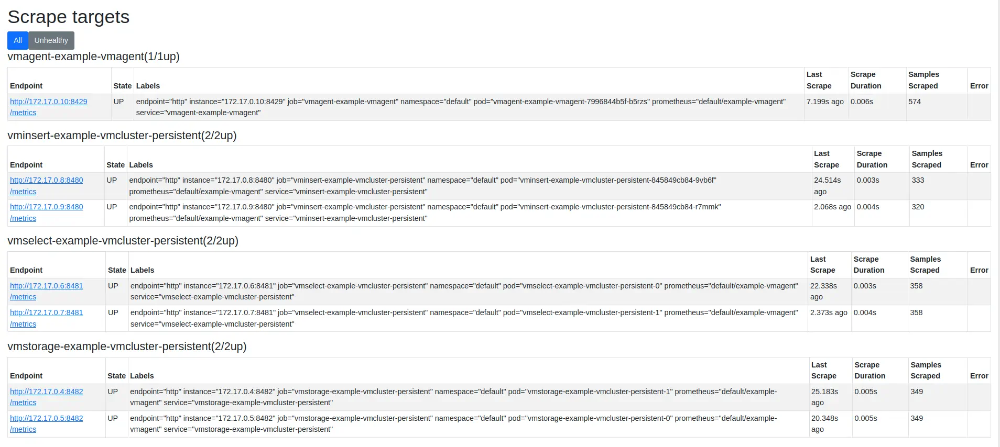
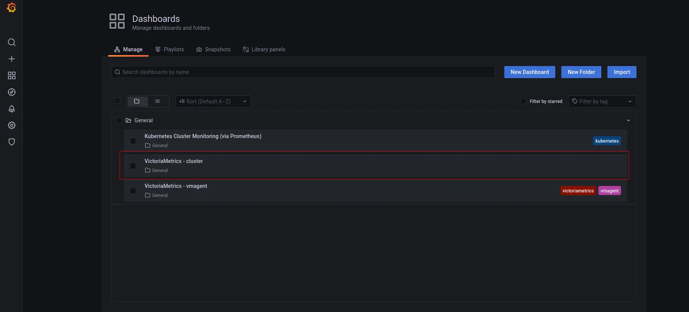
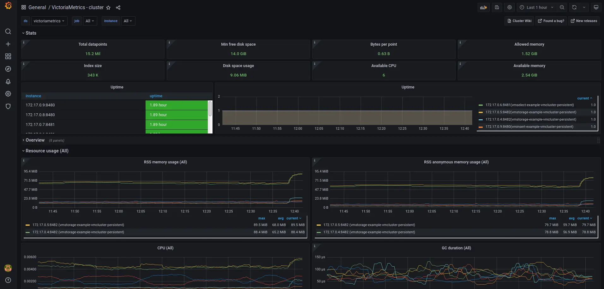

# Getting started with VM Operator

**The guide covers:**

* The setup of a [VM Operator](https://github.com/VictoriaMetrics/helm-charts/tree/master/charts/victoria-metrics-operator) via Helm in [Kubernetes](https://kubernetes.io/) with Helm charts.
* The setup of a [VictoriaMetrics Cluster](https://docs.victoriametrics.com/cluster-victoriametrics/) via [VM Operator](https://github.com/VictoriaMetrics/helm-charts/tree/master/charts/victoria-metrics-operator).
* How to add CRD for a [VictoriaMetrics Cluster](https://docs.victoriametrics.com/cluster-victoriametrics/) via [VM Operator](https://github.com/VictoriaMetrics/helm-charts/tree/master/charts/victoria-metrics-operator).
* How to visualize stored data
* How to store metrics in [VictoriaMetrics](https://victoriametrics.com)

**Preconditions**

* [Kubernetes cluster 1.20.9-gke.1001](https://cloud.google.com/kubernetes-engine). We use a GKE cluster from [GCP](https://cloud.google.com/) but this guide also applies to any Kubernetes cluster. For example, [Amazon EKS](https://aws.amazon.com/ru/eks/).
* [Helm 3](https://helm.sh/docs/intro/install).
* [kubectl 1.21+](https://kubernetes.io/docs/tasks/tools/install-kubectl).

## 1. VictoriaMetrics Helm repository

See how to work with a [VictoriaMetrics Helm repository in previous guide](https://docs.victoriametrics.com/guides/k8s-monitoring-via-vm-cluster.html#1-victoriametrics-helm-repository).

## 2. Install the VM Operator from the Helm chart


```sh
helm install vmoperator vm/victoria-metrics-operator
```


The expected output is:

```sh
NAME: vmoperator
LAST DEPLOYED: Thu Sep 30 17:30:30 2021
NAMESPACE: default
STATUS: deployed
REVISION: 1
TEST SUITE: None
NOTES:
victoria-metrics-operator has been installed. Check its status by running:
  kubectl --namespace default get pods -l "app.kubernetes.io/instance=vmoperator"

Get more information on https://github.com/VictoriaMetrics/helm-charts/tree/master/charts/victoria-metrics-operator.
See "Getting started guide for VM Operator" on https://docs.victoriametrics.com/guides/getting-started-with-vm-operator.html.
```

Run the following command to check that VM Operator is up and running:


```sh
kubectl --namespace default get pods -l "app.kubernetes.io/instance=vmoperator"
```

The expected output:
```sh
NAME                                                    READY   STATUS    RESTARTS   AGE
vmoperator-victoria-metrics-operator-67cff44cd6-s47n6   1/1     Running   0          77s
```

## 3. Install VictoriaMetrics Cluster

> For this example we will use default value for `name: example-vmcluster-persistent`. Change it value up to your needs.

Run the following command to install [VictoriaMetrics Cluster](https://docs.victoriametrics.com/cluster-victoriametrics/) via [VM Operator](https://github.com/VictoriaMetrics/helm-charts/tree/master/charts/victoria-metrics-operator):

<p id="example-cluster-config"></p>

```sh
cat << EOF | kubectl apply -f -
apiVersion: operator.victoriametrics.com/v1beta1
kind: VMCluster
metadata:
  name: example-vmcluster-persistent
spec:
  # Add fields here
  retentionPeriod: "12"
  vmstorage:
    replicaCount: 2
  vmselect:
    replicaCount: 2
  vminsert:
    replicaCount: 2
EOF
```

The expected output:

```sh
vmcluster.operator.victoriametrics.com/example-vmcluster-persistent created
```

* By applying this CRD we install the [VictoriaMetrics cluster](https://docs.victoriametrics.com/cluster-victoriametrics/) to the default [namespace](https://kubernetes.io/docs/concepts/overview/working-with-objects/namespaces/) of your k8s cluster with following params:
* `retentionPeriod: "12"` defines the [retention](https://docs.victoriametrics.com/single-server-victoriametrics/#retention) to 12 months.
* `replicaCount: 2` creates two replicas of vmselect, vminsert and vmstorage.

Please note that it may take some time for the pods to start. To check that the pods are started, run the following command:
<p id="example-cluster-config"></p>

```sh
kubectl get pods | grep vmcluster
```

The expected output:
```sh
NAME                                                     READY   STATUS    RESTARTS   AGE
vminsert-example-vmcluster-persistent-845849cb84-9vb6f   1/1     Running   0          5m15s
vminsert-example-vmcluster-persistent-845849cb84-r7mmk   1/1     Running   0          5m15s
vmselect-example-vmcluster-persistent-0                  1/1     Running   0          5m21s
vmselect-example-vmcluster-persistent-1                  1/1     Running   0          5m21s
vmstorage-example-vmcluster-persistent-0                 1/1     Running   0          5m25s
vmstorage-example-vmcluster-persistent-1                 1/1     Running   0          5m25s
```

There is an extra command to get information about the cluster state:

```sh
kubectl get vmclusters
```

The expected output:
```text
NAME                           INSERT COUNT   STORAGE COUNT   SELECT COUNT   AGE     STATUS
example-vmcluster-persistent   2              2               2              5m53s   operational
```

Internet traffic goes through the Kubernetes Load balancer which use the set of Pods targeted by a [Kubernetes Service](https://kubernetes.io/docs/concepts/services-networking/service/). The service in [VictoriaMetrics Cluster architecture](https://docs.victoriametrics.com/cluster-victoriametrics/#architecture-overview) which accepts the ingested data named `vminsert` and in Kubernetes it is a `vminsert ` service. So we need to use it for remote_write url.

To get the name of `vminsert` services, please run the following command:


```sh
kubectl get svc | grep vminsert
```

The expected output:

```sh
vminsert-example-vmcluster-persistent    ClusterIP   10.107.47.136   <none>        8480/TCP                     5m58s
```

To scrape metrics from Kubernetes with a VictoriaMetrics Cluster we will need to install [VMAgent](https://docs.victoriametrics.com/vmagent/) with some additional configurations.
Copy `vminsert-example-vmcluster-persistent` (or whatever user put into metadata.name field [https://docs.victoriametrics.com/guides/getting-started-with-vm-operator.html#example-cluster-config](https://docs.victoriametrics.com/guides/getting-started-with-vm-operator.html#example-cluster-config)) service name and add it to the `remoteWrite` URL from [quick-start example](https://github.com/VictoriaMetrics/operator/blob/master/docs/quick-start.MD#vmagent).
Here is an example of the full configuration that we need to apply:


```sh
cat <<EOF | kubectl apply -f -
apiVersion: operator.victoriametrics.com/v1beta1
kind: VMAgent
metadata:
  name: example-vmagent
spec:
  serviceScrapeNamespaceSelector: {}
  podScrapeNamespaceSelector: {}
  podScrapeSelector: {}
  serviceScrapeSelector: {}
  nodeScrapeSelector: {}
  nodeScrapeNamespaceSelector: {}
  staticScrapeSelector: {}
  staticScrapeNamespaceSelector: {}
  replicaCount: 1
  remoteWrite:
    - url: "http://vminsert-example-vmcluster-persistent.default.svc.cluster.local:8480/insert/0/prometheus/api/v1/write"
EOF
```


The expected output:

```text
vmagent.operator.victoriametrics.com/example-vmagent created
```

>`remoteWrite.url` for VMAgent consists of the following parts:
> "service_name.VMCluster_namespace.svc.kubernetes_cluster_domain" that in our case will look like vminsert-example-vmcluster-persistent.default.svc.cluster.local

Verify that `VMAgent` is up and running by executing the following command:


```sh
kubectl get pods | grep vmagent
```

The expected output is:

```text
vmagent-example-vmagent-7996844b5f-b5rzs                 2/2     Running   0          9s
```

> There are two containers for VMagent: the first one is a VMagent and the second one is a sidecar with a secret. VMagent use a secret with configuration which is mounted to the special sidecar. It observes the changes with configuration and send a signal to reload configuration for the VMagent.

Run the following command to make `VMAgent`'s port accessible from the local machine:


```sh
kubectl port-forward svc/vmagent-example-vmagent 8429:8429
```

The expected output is:

```text
Forwarding from 127.0.0.1:8429 -> 8429
Forwarding from [::1]:8429 -> 8429
```

To check that `VMAgent` collects metrics from the k8s cluster open in the browser [http://127.0.0.1:8429/targets](http://127.0.0.1:8429/targets) .
You will see something like this:



`VMAgent` connects to [kubernetes service discovery](https://kubernetes.io/docs/concepts/services-networking/service/) and gets targets which needs to be scraped. This service discovery is controlled by [VictoriaMetrics Operator](https://github.com/VictoriaMetrics/operator)

## 4. Verifying VictoriaMetrics cluster

See [how to install and connect Grafana to VictoriaMetrics](https://docs.victoriametrics.com/guides/k8s-monitoring-via-vm-cluster.html#4-install-and-connect-grafana-to-victoriametrics-with-helm) but with one addition - we should get the name of `vmselect` service from the freshly installed VictoriaMetrics Cluster because it will now be different.

To get the new service name, please run the following command:


```sh
kubectl get svc | grep vmselect
```

The expected output:

```sh
vmselect-example-vmcluster-persistent    ClusterIP   None             <none>        8481/TCP                     7m
```

The final config will look like this:


```sh
cat <<EOF | helm install my-grafana grafana/grafana -f -
  datasources:
    datasources.yaml:
      apiVersion: 1
      datasources:
        - name: victoriametrics
          type: prometheus
          orgId: 1
          url: http://vmselect-example-vmcluster-persistent.default.svc.cluster.local:8481/select/0/prometheus/
          access: proxy
          isDefault: true
          updateIntervalSeconds: 10
          editable: true

  dashboardProviders:
   dashboardproviders.yaml:
     apiVersion: 1
     providers:
     - name: 'default'
       orgId: 1
       folder: ''
       type: file
       disableDeletion: true
       editable: true
       options:
         path: /var/lib/grafana/dashboards/default

  dashboards:
    default:
      victoriametrics:
        gnetId: 11176
        revision: 18
        datasource: victoriametrics
      vmagent:
        gnetId: 12683
        revision: 7
        datasource: victoriametrics
      kubernetes:
        gnetId: 14205
        revision: 1
        datasource: victoriametrics
EOF
```


## 5. Check the result you obtained in your browser

To check that [VictoriaMetrics](https://victoriametrics.com) collecting metrics from the k8s cluster open in your browser [http://127.0.0.1:3000/dashboards](http://127.0.0.1:3000/dashboards) and choose the `VictoriaMetrics - cluster` dashboard. Use `admin` for login and the `password` that you previously got from kubectl.



The expected output is:



## 6. Summary

* We set up Kubernetes Operator for VictoriaMetrics with using CRD.
* We collected metrics from all running services and stored them in the VictoriaMetrics database.
