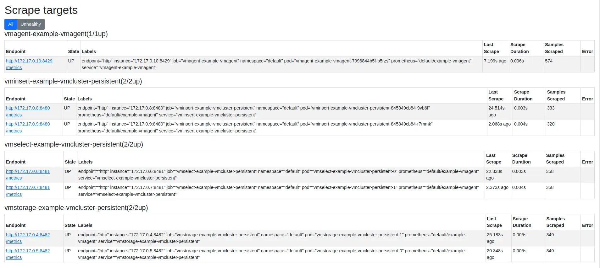
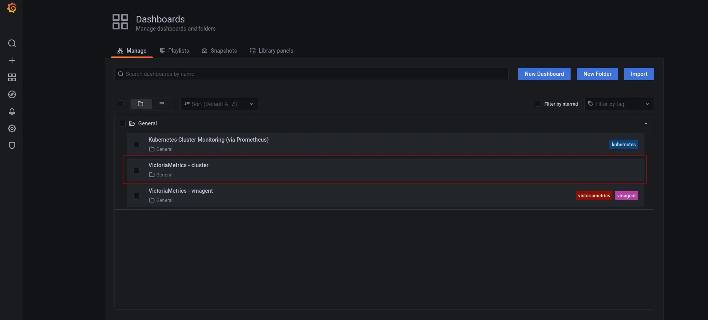

---
build:
  list: never
  publishResources: false
  render: never
sitemap:
  disable: true
---

CHANGELOG:

- Add introduction with brief explanation of operator and its benefits as an intro
- Make some step more explicit, instead of just linking to the VM cluster guide
- Separate config/chart values files from kubectl apply (instead of using heredoc and in-line yaml)
- Update screenshots and add figcaptions where needed
- Update Kubernetes and tools versions to newer releases
- Remove revision numbers from the Grafana config to install the latest revision
- Added a section to configure scraping of kubernetes resources (nodes, pods, etc.)
- Updated guide to more modern Helm and Kubectl versions
- Tested updated instructions on GKE 1.34.1-gke.3971001 (and a local k3s instance) successfully
- Removed revision from Grafana values for helm chart (confirmed it pulls the latest revision)
- Added and updated expected outputs. Some were missing and others were outdated
- Updated Grafana dashboards screenshots since they changed from the last revision
- Updated Grafana repo to use community org (old grafana chart was deprecated
on Jan 30th - [source](https://community.grafana.com/t/helm-repository-migration-grafana-community-charts/160983))
- Minor corrections and typo fixes. Improved flow
- Added a section at the end pointing readers where they can go next.

The [VictoriaMetrics Kubernetes Operator](https://docs.victoriametrics.com/operator/) simplifies running every component in the VictoriaMetrics Stack on Kubernetes and OpenShift clusters. It extends the Kubernetes API with [custom resources](https://kubernetes.io/docs/concepts/extend-kubernetes/api-extension/custom-resources/) so you can configure and manage VictoriaMetrics components declaratively using YAML manifests.

After you read this guide, you'll know:

- How to install and configure [VictoriaMetrics cluster](https://docs.victoriametrics.com/helm/victoria-logs-cluster/) using the Operator.
- How to scrape metrics from Kubernetes components.
- How to store metrics in [VictoriaMetrics](https://victoriametrics.com) time-series database.
- How to visualize metrics in Grafana.

**Preconditions**

- [Kubernetes cluster 1.34+](https://cloud.google.com/kubernetes-engine)
- [Helm 4.1+](https://helm.sh/docs/intro/install)
- [kubectl 1.34+](https://kubernetes.io/docs/tasks/tools/install-kubectl)

> [!NOTE] Tip
> We use a GKE cluster from [GCP](https://cloud.google.com/), but this guide can also be applied to any Kubernetes cluster. For example, [Amazon EKS](https://aws.amazon.com/ru/eks/) or an on-premises cluster.

## 1. VictoriaMetrics Helm repository

To start, add the VictoriaMetrics Helm repository with the following commands:

```shell
helm repo add vm https://victoriametrics.github.io/helm-charts/
helm repo update
```

To verify that everything is set up correctly, you may run this command:

```shell
helm search repo vm/
```

You should see a list similar to this:

```text
NAME                                    CHART VERSION   APP VERSION     DESCRIPTION
vm/victoria-metrics-operator            0.58.1          v0.67.0         VictoriaMetrics Operator
vm/victoria-metrics-operator-crds       0.7.0           v0.67.0         VictoriaMetrics Operator CRDs
...(list continues)...
```

## 2. Install the VM Operator from the Helm chart

```sh
helm install vmoperator vm/victoria-metrics-operator
```

The expected output is:

```sh
NAME: vmoperator
LAST DEPLOYED: Fri Mar 21 12:01:52 2025
NAMESPACE: default
STATUS: deployed
REVISION: 1
TEST SUITE: None
NOTES:
victoria-metrics-operator has been installed. Check its status by running:
  kubectl --namespace default get pods -l "app.kubernetes.io/instance=vmoperator"

Get more information on https://github.com/VictoriaMetrics/helm-charts/tree/master/charts/victoria-metrics-operator.
See "Getting started guide for VM Operator" on https://docs.victoriametrics.com/guides/getting-started-with-vm-operator
```

Run the following command to check that VM Operator is up and running:

```sh
kubectl get pods -l "app.kubernetes.io/instance=vmoperator"
```

Wait until `STATUS` is "Running" and `Ready` is "1/1":

```sh
NAME                                                    READY   STATUS    RESTARTS   AGE
vmoperator-victoria-metrics-operator-67cff44cd6-s47n6   1/1     Running   0          77s
```

## 3. Install VictoriaMetrics Cluster

> [!NOTE]
> For this example, we use default name for the operator (`name: example-vmcluster-persistent`). Change the name to suit your needs.

First, create a YAML file to configure the deployment of VictoriaMetrics cluster version:

<p id="example-cluster-config"></p>

```sh
cat << EOF > vmcluster-config.yml
apiVersion: operator.victoriametrics.com/v1beta1
kind: VMCluster
metadata:
  # define the name of the VM cluster
  name: example-vmcluster-persistent
spec:
  # define retention period (i.e. 12 months)
  retentionPeriod: "12"
  # define the number of pods for each of the services in the VM cluster
  vmstorage:
    replicaCount: 2
  vmselect:
    replicaCount: 2
  vminsert:
    replicaCount: 2
EOF
```

Let's break down the config file:

- `metadata: name` defines the name for the VictoriaMetrics cluster.
- `spec: retentionPeriod` defines for how long VictoriaMetrics should keep the metrics. See [retention](https://docs.victoriametrics.com/victoriametrics/single-server-victoriametrics/#retention) for more options.
- `spec: vmstorage: replicaCount` defines how many pods to run for the `vmstorage` service. A VictoriaMetrics cluster is comprised of three services, `vmstorage`, `vminsert`, and `vmselect`. You can customize the number of replicas for each service separately.

The example configuration above defines these values:

- Cluster name: `example-vmcluster-persistent`
- Retention period: 12 months
- Number of replicas: 2 replicas for each the three of VictoriaMetrics services

Once you have defined on the name, retention period, and number of replicas for your cluster, run the following command to deploy the VictoriaMetrics cluster in the default namespace:

```sh
kubectl apply -f vmcluster-config.yml
```

The command should output something like this:

```text
vmcluster.operator.victoriametrics.com/example-vmcluster-persistent created
```

Please note that it may take some time for the pods to start. To check that the pods are started, run the following command:
<p id="example-cluster-config"></p>

```sh
kubectl get pods -l managed-by=vm-operator
```

The expected output is:

```text
NAME                                                     READY   STATUS    RESTARTS   AGE
vminsert-example-vmcluster-persistent-845849cb84-9vb6f   1/1     Running   0          5m15s
vminsert-example-vmcluster-persistent-845849cb84-r7mmk   1/1     Running   0          5m15s
vmselect-example-vmcluster-persistent-0                  1/1     Running   0          5m21s
vmselect-example-vmcluster-persistent-1                  1/1     Running   0          5m21s
vmstorage-example-vmcluster-persistent-0                 1/1     Running   0          5m25s
vmstorage-example-vmcluster-persistent-1                 1/1     Running   0          5m25s
```

The VictoriaMetrics Operator adds an extra command to get information about the state of the cluster:

```sh
kubectl get vmclusters
```

The expected output is:

```text
NAME                           INSERT COUNT   STORAGE COUNT   SELECT COUNT   AGE     STATUS
example-vmcluster-persistent   2              2               2              5m53s   operational
```

### Install vmagent

In order to send metrics to the VictoriaMetrics database, we need to install [vmagent](https://docs.victoriametrics.com/victoriametrics/vmagent/). This service scrapes, relabels, and sends metrics to the `vminsert` service running in the cluster.

First, we need to determine the URL for the `vminsert` service. Run the following command to obtain the service name of the service:

```sh
kubectl get svc -l app.kubernetes.io/name=vminsert
```

The expected output is:

```text
NAME                                    TYPE        CLUSTER-IP     EXTERNAL-IP   PORT(S)    AGE
vminsert-example-vmcluster-persistent   ClusterIP   10.43.42.217   <none>        8480/TCP   2d
```

The write URL for the `vminsert` service takes the form of `http://<service-name>.<namespace>.svc.cluster.local:<port-number>`. Thus, in our example the URL is:

```text
http://vminsert-example-vmcluster-persistent.default.svc.cluster.local:8480
```

Create a YAML file to configure vmagent. Ensure that `spec: remoteWrite: url` matches the `vminsert` service URL:

```sh
cat <<EOF > vmagent-config.yml
apiVersion: operator.victoriametrics.com/v1beta1
kind: VMAgent
metadata:
  # you may change the name of the vmagent service here
  name: example-vmagent
spec:
  serviceScrapeNamespaceSelector: {}
  podScrapeNamespaceSelector: {}
  podScrapeSelector: {}
  serviceScrapeSelector: {}
  nodeScrapeSelector: {}
  nodeScrapeNamespaceSelector: {}
  staticScrapeSelector: {}
  staticScrapeNamespaceSelector: {}
  replicaCount: 1
  remoteWrite:
    # url must be "http://<service-name>.<namespace>.svc.cluster.local:<port-number>/insert/0/prometheus/api/v1/write"
    - url: "http://vminsert-example-vmcluster-persistent.default.svc.cluster.local:8480/insert/0/prometheus/api/v1/write"
EOF
```

Let's break down the main settings in the config:

- `metadata: name` defines the name of the vmagent service (e.g. `example-vmagent`)
- `spec: remoteWrite: url` defines the fully qualified URL for the `vminsert` service. Ensure the URL is correct and ends with `/insert/0/prometheus/api/v1/write`.

Install `vmagent` with:

```sh
kubectl apply -f vmagent-config.yml
```

The expected output is:

```text
vmagent.operator.victoriametrics.com/example-vmagent created
```

Verify that `vmagent` is operational:

```sh
kubectl get vmagent
```

The expected output is:

```text
NAME              SHARDS COUNT   REPLICA COUNT   STATUS        AGE
example-vmagent                  1               operational   21h
```

Run the following command to make `vmagent`'s port accessible from the local machine:

```sh
kubectl port-forward svc/vmagent-example-vmagent 8429:8429
```

The expected output is:

```text
Forwarding from 127.0.0.1:8429 -> 8429
Forwarding from [::1]:8429 -> 8429
```

To check that `vmagent` is collecting metrics by browsing `http://127.0.0.1:8429/targets`. You will see something like this:


<figcaption style="text-align: center; font-style: italic;">vmagent's status for discovered targets</figcaption>

Notice that only the VictoriaMetrics services are being targeted. By default, `vmagent` does not scrape Kubernetes cluster metrics. The next section explains how to turn on scraping for Kubernetes.

### Enable Kubernetes metrics scraping {#kubernetes-scraping}

> [!NOTE] Tip
> This step is optional. You can skip to the next section if you don't want to gather telemetry from the Kubernetes cluster system itself.

To enable metric collection from the Kubernetes system, we need to update the configuration of `vmagent` and set up various [Scrape CRDs](https://docs.victoriametrics.com/operator/resources/).

Update the `vmagent-config.yml` file as follows. Ensure you define `spec: remoteWrite: url:` value is still correct as in the previous step.

```sh
cat <<EOF >vmagent-config.yml
apiVersion: operator.victoriametrics.com/v1beta1
kind: VMAgent
metadata:
  name: example-vmagent
  namespace: default
spec:
  replicaCount: 1
  # Enable CRD-based scraping
  selectAllByDefault: true
  remoteWrite:
      # url takes the form of "http://<service-name>.<namespace>.svc.cluster.local:<port-number>/insert/0/prometheus/api/v1/write"
    - url: "http://vminsert-example-vmcluster-persistent.default.svc.cluster.local:8480/insert/0/prometheus/api/v1/write"
EOF
```

Update `vmagent`:

```sh
kubectl apply -f vmagent-config.yml
```

Download the [vmscrape-config.yml-example](vmscrape-config.yml-example) file and rename it to `vmscrape-config.yml`. This config set up scrape CRDs for key Kubernetes components such as nodes, pods, APIs, and services.

Apply the scrape CRDs:

```sh
kubectl apply -f vmscrape-config.yml

The expected output is:

```text
vmnodescrape.operator.victoriametrics.com/kubelet-cadvisor created
vmnodescrape.operator.victoriametrics.com/kubelet-metrics created
vmscrapeconfig.operator.victoriametrics.com/kubernetes-apiservers created
vmscrapeconfig.operator.victoriametrics.com/kubernetes-pods created
vmscrapeconfig.operator.victoriametrics.com/kubernetes-service-endpoints created
```

Go back to the `vmagent` target page by browsing `http://127.0.0.1:8429/targets`. This time, you should find targets such as `nodeScrape/default/kubelet-cadvisor` and `nodeScrape/default/kubelet-metrics` with up status:


<figcaption style="text-align: center; font-style: italic;">You should find Kubernetes-specific targets now</figcaption>

## 4. Verifying VictoriaMetrics cluster

The next step is to install Grafana to visualize collected metrics. But first, we need to determine the URL for the `vmselect` service.

To get the new service name, please run the following command:
```sh
kubectl get svc -l app.kubernetes.io/name=vmselect
```

The expected output is:

```sh
NAME                                     TYPE        CLUSTER-IP       EXTERNAL-IP   PORT(S)    AGE
vmselect-example-vmcluster-persistent    ClusterIP   None             <none>        8481/TCP   7m
```

Create a config file for the Grafana Helm chart. The read URL takes the form `http://<service-name>.<namespace>.svc.cluster.local:<port-number>`. Thus, in our example the URL is:

```text
http://vmselect-example-vmcluster-persistent.default.svc.cluster.local:8481/select/0/prometheus/
```

Create a values file for the Grafana Helm chart:

```
cat << EOF > grafana-values.yml
  datasources:
    datasources.yaml:
      apiVersion: 1
      datasources:
        - name: victoriametrics
          type: prometheus
          orgId: 1
          # url takes the form of 'http://<vmselect-service-name>.<namespace>.svc.cluster.local:<port-number>/select/0/prometheus'
          # replace 'vmselect-example-vmcluster-persistent' with the name of the vmselect service
          url: http://vmselect-example-vmcluster-persistent.default.svc.cluster.local:8481/select/0/prometheus/
          access: proxy
          isDefault: true
          updateIntervalSeconds: 10
          editable: true

  dashboardProviders:
   dashboardproviders.yaml:
     apiVersion: 1
     providers:
     - name: 'default'
       orgId: 1
       folder: ''
       type: file
       disableDeletion: true
       editable: true
       options:
         path: /var/lib/grafana/dashboards/default

  dashboards:
    default:
      victoriametrics:
        gnetId: 11176
        datasource: victoriametrics
      vmagent:
        gnetId: 12683
        datasource: victoriametrics
      kubernetes:
        gnetId: 14205
        datasource: victoriametrics
EOF
```

Let's break down the main parts of the config file:

- `datasources: datasources.yaml: datasources: url` defines the URL for the `vminsert` service. This endpoint is the datasource Grafana uses to query the metrics database.
- `dashboards: default:` loads three starter dashboards to monitor the Kubernetes cluster, the VictoriaMetrics services, and the `vmagent` service.

Add the Grafana Helm repository with:

```sh
helm repo add grafana-community https://grafana-community.github.io/helm-charts
helm repo update
```

Install Grafana into the Kubernetes cluster with the name `my-grafana` in the default namespace with the following command:

```shell
helm install my-grafana grafana-community/grafana -f grafana-values.yml
```

The output should look similar to this:

```text
NAME: my-grafana
LAST DEPLOYED: Fri Feb  6 19:00:15 2026
NAMESPACE: default
STATUS: deployed
REVISION: 1
DESCRIPTION: Install complete
NOTES:
1. Get your 'admin' user password by running:

   kubectl get secret --namespace default my-grafana -o jsonpath="{.data.admin-password}" | base64 --decode ; echo


2. The Grafana server can be accessed via port 80 on the following DNS name from within your cluster:

   my-grafana.default.svc.cluster.local

   Get the Grafana URL to visit by running these commands in the same shell:
     export POD_NAME=$(kubectl get pods --namespace default -l "app.kubernetes.io/name=grafana,app.kubernetes.io/instance=my-grafana" -o jsonpath="{.items[0].metadata.name}")
     kubectl --namespace default port-forward $POD_NAME 3000

3. Login with the password from step 1 and the username: admin
#################################################################################
######   WARNING: Persistence is disabled!!! You will lose your data when   #####
######            the Grafana pod is terminated.                            #####
#################################################################################
```

Use the first command in the output to obtain the password for the `admin` user:

```shell
kubectl get secret --namespace default my-grafana -o jsonpath="{.data.admin-password}" | base64 --decode ; echo

```

The second part of the output shows how to port-forward the Grafana service in order to access it locally on `127.0.0.1:3000`:

```shell
export pod_name=$(kubectl get pods --namespace default -l "app.kubernetes.io/name=grafana,app.kubernetes.io/instance=my-grafana" -o jsonpath="{.items[0].metadata.name}")

kubectl --namespace default port-forward $pod_name 3000
```

## 5. Check the result you obtained in your browser

To check that [VictoriaMetrics](https://victoriametrics.com) collecting metrics from the Kubernetes cluster open in your browser `http://127.0.0.1:3000/dashboards` and choose the `VictoriaMetrics - cluster` dashboard. 

Use `admin` for login and the `password` obtained with `kubectl get secret ...`.


<figcaption style="text-align: center; font-style: italic;">List of pre-installed dashboards in Grafana</figcaption>

The "VictoriaMetrics - cluster" dashboard shows activity of the VictoriaMetrics services.


<figcaption style="text-align: center; font-style: italic;">Grafana dashboard showing metrics for the VictoriaMetrics cluster services</figcaption>

There is a separate dashboard for the activity of the `vmagent` service. This shows ingestion rate and resource utilization.


<figcaption style="text-align: center; font-style: italic;">Grafana dashboard showing metrics for the vmagent service</figcaption>

If you [added the scrape configs](#kubernetes-scraping), the Kubernetes dashboard should be populated with metrics. If not, the dashboard will be empty.


<figcaption style="text-align: center; font-style: italic;">Grafana dashboard showing Kubernetes cluster metrics</figcaption>


## 6. Summary

- We set up Kubernetes Operator for VictoriaMetrics with using CRDs.
- We collected metrics from all running services and stored them in the VictoriaMetrics database.
- We installed Grafana to visualize metrics

Consider reading these resources to complete your setup:

- [VictoriaMetrics Operator Quickstart](https://docs.victoriametrics.com/operator/quick-start/)
- See [VictoriaMetrics K8s Stack](https://docs.victoriametrics.com/helm/victoria-metrics-k8s-stack/) for an all-in-one solution for Kubernetes monitoring
- Grafana
  - [Enable persistent storage](https://grafana.com/docs/grafana/latest/setup-grafana/installation/helm/#enable-persistent-storage-recommended)
  - [Configure private TLS authority](https://grafana.com/docs/grafana/latest/setup-grafana/installation/helm/#configure-a-private-ca-certificate-authority)

