Using [Grafana](https://grafana.com/) with [vmauth](https://docs.victoriametrics.com/victoriametrics/vmauth/) is a great way to provide [multi-tenant](https://docs.victoriametrics.com/victoriametrics/cluster-victoriametrics/#multitenancy) access to your metrics, logs and traces.
vmauth provides a way to authenticate users using [JWT tokens](https://en.wikipedia.org/wiki/JSON_Web_Token) issued by an external identity provider.
Those tokens can include information about the user and the tenant they belong to, which can be used to restrict access to metrics to only those that belong to the tenant.
This guide provides step-by-step instruction of how to setup querying metrics from VictoriaMetrics single and cluster using Grafana and writing metrics using vmagent through vmauth with OIDC authorization enabled.

## Prerequisites

* An active license key. You can obtain a trial license key [here](https://victoriametrics.com/products/enterprise/trial/).
* [Docker](https://docs.docker.com/engine/install/) and `docker compose` must be installed.
* Add `grafana` and `keycloak` hosts to the `/etc/hosts` file, pointing to `127.0.0.1`.

```
# /etc/hosts

# Setup vmauth - Multi-Tenant Access with Grafana & OIDC
# https://docs/victoriametrics.com/guides/grafana-vmauth-openid-configuration/#prerequisites
127.0.0.1 keycloak grafana
```

## Identity provider

The identity service must be able to issue JWT tokens with the following `vm_access` claim:

```json
{
  "vm_access": {
    "tenant_id": {
      "account_id": 0,
      "project_id": 0
    },
    "query_args": {
      "vm_extra_label": [
        "team=dev"
      ],
      "vm_extra_filters": [
        "{env=~\"aws|gcp\",cluster!=\"production\"}"
      ]
    }
  }
}
```
> Note: if `project_id` is not specified, the default value `0` is used.

> Note: the `query_args` and `tenant_id` properties are required if you reference them in your `vm-auth.yaml` configuration. If you don't use them, they can be omitted.

Some identity providers only support string claim values. vmauth also supports string claim values:
```json
{
  "vm_access": "{\"tenant_id\": {\"account_id\": 0, \"project_id\": 0}}"
}
```

See details about all supported options in the [vmauth - oidc authorization](https://docs.victoriametrics.com/victoriametrics/vmauth/#oidc-authorization).

### Setup Keycloak

[Keycloak](https://www.keycloak.org/) is an open source identity service that can be used to issue JWT tokens.

Add the following section to your `compose.yaml` file to configure Keycloak:

```yaml
# compose.yaml
services:
  keycloak:
    image: quay.io/keycloak/keycloak:26.3
    command:
      - start-dev
      - --http-port=3001
    ports:
      - 127.0.0.1:3001:3001
    environment:
      KC_HOSTNAME_BACKCHANNEL_DYNAMIC: "true"
      KC_HOSTNAME: http://keycloak:3001/
      KC_BOOTSTRAP_ADMIN_USERNAME: admin
      KC_BOOTSTRAP_ADMIN_PASSWORD: change_me
    volumes:
      - keycloakdata:/opt/keycloak/data

volumes:
  keycloakdata: {}
```

Once Keycloak is available at `http://keycloak:3001`, follow the steps below to configure the OIDC client and users for Grafana:

### Create client

1. Log in with admin credentials to your Keycloak instance (if you just configured it using docker compose, Keycloak is available at `http://keycloak:3001`)
1. Go to `Clients` -> `Create client`.<br>
   Use `OpenID Connect` as `Client Type`.<br>
   Specify `grafana` as `Client ID`.<br>
   Click `Next`.<br>
   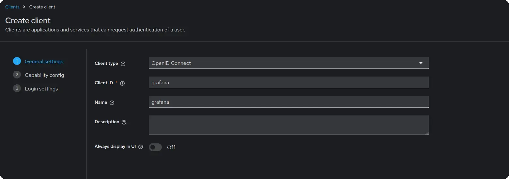
1. Enable `Client authentication`.<br>
   Enable `Authorization`.<br>
   Direct access is required for testing the token, but it can be disabled in production.<br>
   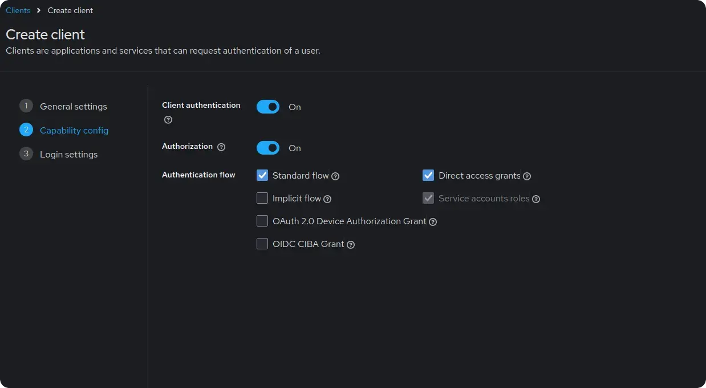
   Click `Next`.<br>
1. Add Grafana URL as `Root URL`. For example, `http://grafana:3000/`.<br>
   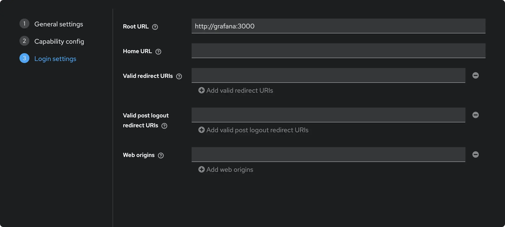
   Click `Save`.<br>
1. Go to `Clients` -> `grafana` -> `Client scopes`.<br>
   Click on `grafana-dedicated` -> `Configure a new mapper` -> `User attribute`.<br>
   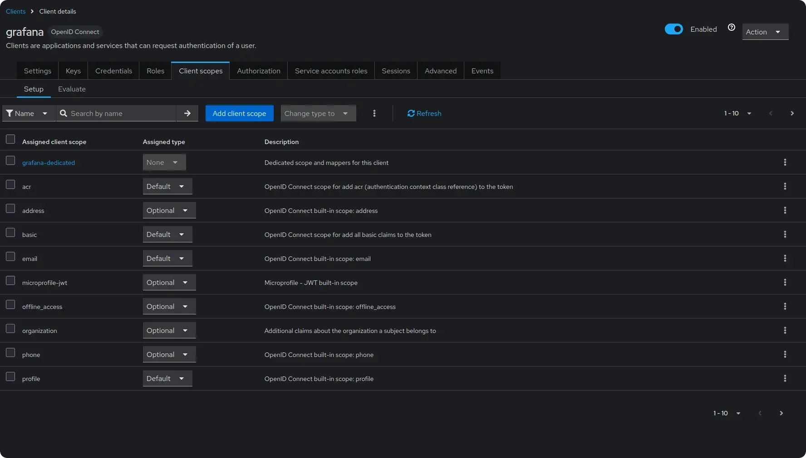
   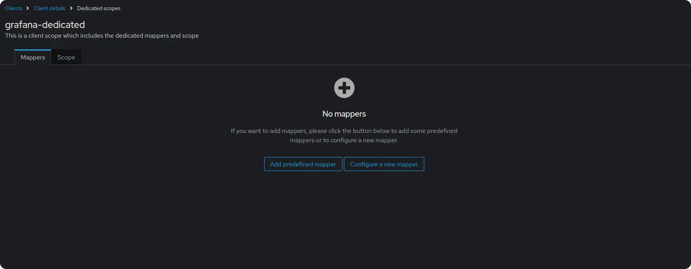
   Configure the mapper as follows:<br>
   - Set `Name` to `vm_access`.
   - Set `Token Claim Name` to `vm_access`.
   - Set `User Attribute` to `vm_access`.
   - Set `Claim JSON Type` to `JSON`.
   - Enable `Add to ID token` and `Add to access token`.<br>
   
   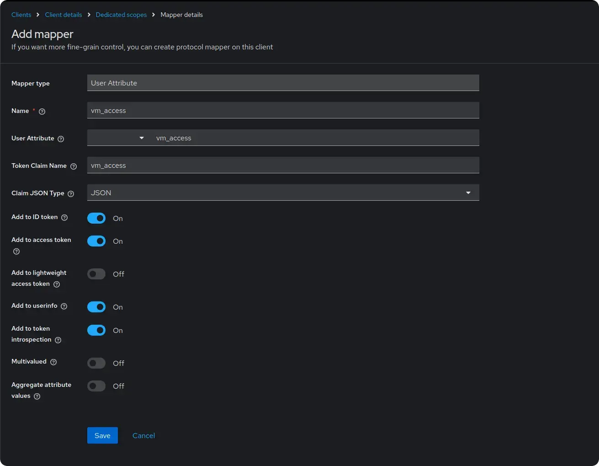
   Click `Save`.<br>

### Create user

1. Go to `Realm settings` -> `User profile`.<br>
   Click `Create attribute`.<br>
   Specify `vm_access` as `Attribute [Name]`.<br>
   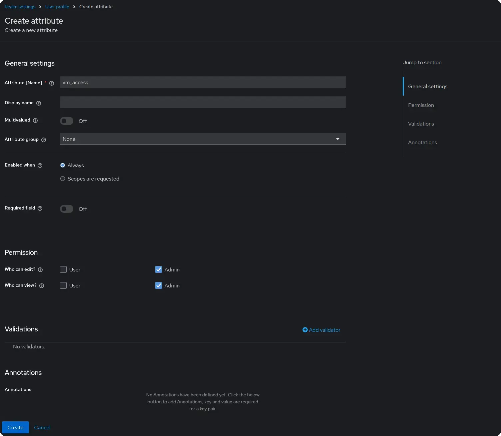
   Click `Save`.<br>
1. Go to `Users` -> select a user to configure.<br>
   Make sure the user has an email address set and it is verified.<br>
   Modify the value of the `vm_access` attribute.<br>
   For this example, we will use 2 users:<br>
   - For the first user, set the `Value` to `{"tenant_id": {"account_id": 0, "project_id": 0}, "query_args": {"vm_extra_label": ["team=admin"]}}`.
   - For the second user, set the `Value` to `{"tenant_id": {"account_id": 0, "project_id": 1}, "query_args": {"vm_extra_label": ["team=dev"]}}`.
   <br>
   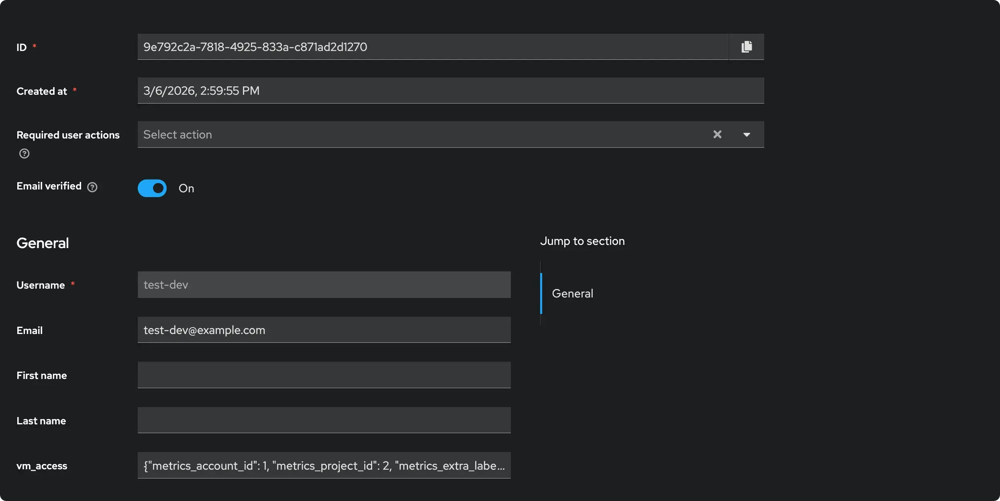
   Click `Save`.

### Test identity provider

Gather the following information needed to configure Grafana:

1. The Realm name must be `master`. To get the name, go to `Realm settings` -> `General` and copy the `Name`.
1. The Client ID must be `grafana`. To get the ID, go to `Clients` -> `grafana` -> `Settings` and copy the `Client ID`.
1. The Client Secret is dynamically generated. To get the secret, go to `Clients` -> `grafana` -> `Credentials` and copy the `Client Secret`.<br>
   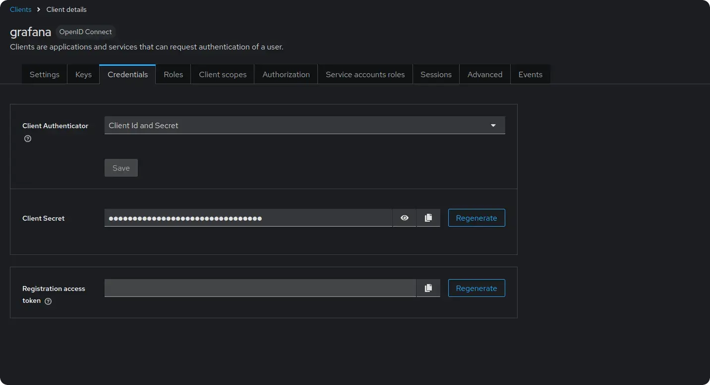
   <br>

Start the services:
```sh
docker compose up
```

Test that everything is working by requesting a token using `curl`:

```sh
TOKEN=$(curl -s -X POST "http://keycloak:3001/realms/master/protocol/openid-connect/token" \
    -H "Content-Type: application/x-www-form-urlencoded" \
    -d "client_id=grafana" \
    -d "client_secret={CLIENT_SECRET}" \
    -d "grant_type=password" \
    -d "username=test-dev" \
    -d "password=testpass" | jq -r '.access_token') && echo $TOKEN
```

The response should contain a valid JWT token with `vm_access` claim. 
Use [jwt.io](https://jwt.io/) to decode and inspect the token.

## VictoriaMetrics

### Storage and scraping

First, create a `scrape.yaml` file with vmagent scrape configuration to ingest data into vmsingle and vmstorage for testing purposes:

```yaml
# scrape.yaml
scrape_configs:
  - job_name: stat
    metric_relabel_configs:
      # The team label showcases extra_filter functionality used with vmsingle.
      - if: "{instance =~ 'vmauth.*'}"
        action: replace
        target_label: team
        replacement: admin
      - if: "{instance =~ 'vmagent.*'}"
        action: replace
        target_label: team
        replacement: dev

      # The vm_account_id and vm_project_id labels showcase tenant functionality used with vmcluster
      - if: "{instance =~ 'vmauth.*'}"
        action: replace
        target_label: vm_account_id
        replacement: '0'
      - if: "{instance =~ 'vmauth.*'}"
        action: replace
        target_label: vm_project_id
        replacement: '0'
      - if: "{instance =~ 'vmagent.*'}"
        action: replace
        target_label: vm_account_id
        replacement: '0'
      - if: "{instance =~ 'vmagent.*'}"
        action: replace
        target_label: vm_project_id
        replacement: '1'
    static_configs:
      - targets:
          - vmagent:8429
          - vmauth:8427

```

Add VictoriaMetrics single-node and cluster to the `compose.yaml` file.
These services will be used to store metrics scraped by vmagent and queried via Grafana through vmauth.

Relabeling rules will add the `team` label to the scraped metrics in order to test multi-tenant access.
Metrics from `vmagent` will be labeled with `team=dev` and metrics from `vmauth` will be labeled with `team=admin`.

vmagent will write data into VictoriaMetrics single-node and cluster(with tenant `0:0`).

```yaml
# compose.yaml
services:
  vmsingle:
    image: victoriametrics/victoria-metrics:v1.124.0

  vmstorage:
    image: victoriametrics/vmstorage:v1.124.0-cluster

  vminsert:
    image: victoriametrics/vminsert:v1.124.0-cluster
    command:
      - -storageNode=vmstorage:8400

  vmselect:
    image: victoriametrics/vmselect:v1.124.0-cluster
    command:
      - -storageNode=vmstorage:8401

  vmagent:
    image: victoriametrics/vmagent:v1.124.0
    volumes:
      - ./scrape.yaml:/etc/vmagent/config.yaml
    command:
      - -promscrape.config=/etc/vmagent/config.yaml
      - -remoteWrite.url=http://vminsert:8480/insert/multitenant/prometheus/api/v1/write
      - -remoteWrite.url=http://vmsingle:8428/api/v1/write
```

### Vmauth

Before we start, let's explore the concept of placeholders supported in vmauth configuration.
Placeholders can be used inside the `url_prefix` property to restrict access by setting the [tenant](https://docs.victoriametrics.com/victoriametrics/cluster-victoriametrics/#url-format) or [extra query filters](https://docs.victoriametrics.com/victoriametrics/single-server-victoriametrics/#prometheus-querying-api-enhancements).

A placeholder value is taken from the authenticated JWT token.
The following placeholders are supported:
- `{{tenantID}}` placeholder is substituted from `vm_access.tenant` claim property.
- `{{vm_extra_label}}` placeholder is substituted from `vm_access.query_args.vm_extra_label` claim property.
- `{{vm_extra_filters}}` placeholder is substituted from `vm_access.query_args.vm_extra_filters` claim property.

Now, let's create a vmauth configuration file `vm-auth.yaml` that enables OIDC authorization using the [identity provider](https://docs.victoriametrics.com/guides/grafana-vmauth-openid-configuration/#identity-provider).
For cluster access, we will use the `{{tenantID}}` placeholder to route requests to a specific tenant.
For single-node access, we will use `{{vm_extra_label}}`.

```yaml
# vm-auth.yaml
oidc:
  realms:
    - name: keycloak
      issuer_url: http://keycloak:3001/realms/master
      # It's recommended to enable discovery in production
      skip_discovery: true
users:
  - client:
      # The value should match "aud" claim from JWT token
      # Use oidc.claims.client_id to change the claim used as client ID
      client_id: account
      realm: keycloak
    url_map:
      - src_paths:
          - "/insert/.*"
        drop_src_path_prefix_parts: 1
        url_prefix: "http://vminsert:8480/insert/{{tenantID}}/prometheus/"
      - src_paths:
          - "/select/.*"
        drop_src_path_prefix_parts: 1
        url_prefix: "http://vmselect:8481/select/{{tenantID}}/prometheus/"
      - src_paths:
          - "/single/.*"
        drop_src_path_prefix_parts: 1
        url_prefix: "http://vmsingle:8428?extra_label={{vm_extra_label}}"
```

Now add the vmauth service to `compose.yaml`:

```yaml
# compose.yaml
services:
  vmauth:
    image: victoriametrics/vmauth:v1.124.0-enterprise
    ports:
      - 8427:8427
    volumes:
      - ./vm-license.key:/opt/vm-license.key
      - ./vm-auth.yaml:/etc/config.yaml
    command:
      - -licenseFile=/opt/vm-license.key
      - -auth.config=/etc/config.yaml
```

### Signature verification

It is also possible to enable [JWT token signature verification](https://docs.victoriametrics.com/victoriametrics/vmauth/#oidc-authorization) in vmauth.
To do this using the OpenID Connect discovery endpoint, either set `skip_discovery: false` or configure `public_keys`, `public_key_files`, or `jwks_url`. For example:

```yaml
# vm-auth.yaml
oidc:
  realms:
    - name: realm-1
      issuer_url: http://keycloak:3001/realms/realm-1
    - name: realm-2
      issuer_url: http://keycloak:3001/realms/realm-2
      skip_discovery: true
      public_keys:
        - |
           -----BEGIN PUBLIC KEY-----
           <public key 1 pem>
           -----END PUBLIC KEY-----
        - |
           -----BEGIN PUBLIC KEY-----
           <public key 2 pem>
           -----END PUBLIC KEY-----
    - name: realm-3
      issuer_url: http://keycloak:3001/realms/realm-3
      skip_discovery: true
      public_key_files:
        - /etc/public-key-1
        - /etc/public-key-2
    - name: realm-4
      issuer_url: http://keycloak:3001/realms/realm-4
      skip_discovery: true
      jwks_url: http://keycloak:3001/realms/realm-4/protocol/openid-connect/certs
```

Each of the above realms provides token signature verification:
- `realm-1` - automatically discovers JWKS URLs and downloads keys on vmauth start
- `realm-2` - uses static public keys defined in `public_keys` for signature verification
- `realm-3` - uses static public keys defined in `public_key_files` for signature verification
- `realm-4` - uses `jwks_url` to download keys for signature verification

### Test vmauth

Start the services:

```sh
docker compose up
```

Use the token obtained in [Test identity provider](https://docs.victoriametrics.com/guides/grafana-vmauth-openid-configuration/#test-identity-provider) section to test vmauth configuration.

Cluster select:
```sh
curl http://localhost:8427/select/api/v1/status/buildinfo -H "Authorization: Bearer ${TOKEN}"

# Output:
# {"status":"success","data":{"version":"2.24.0"}}
```

Cluster insert:
```sh
$curl http://localhost:8427/insert/api/v1/write -H "Authorization: Bearer ${TOKEN}" -i
# Output
# HTTP/1.1 204 No Content
# ...
```

Single:
```sh
curl http://localhost:8427/single/api/v1/status/buildinfo -H "Authorization: Bearer ${TOKEN}"

# Output:
# {"status":"success","data":{"version":"2.24.0"}}
```

## Grafana

### Setup

Add the grafana service to the `compose.yaml` file.
This configuration enables OAuth authentication using the previously configured Keycloak service as the identity provider.
Don't forget to replace the `{CLIENT_SECRET}` placeholder with the actual client secret gathered earlier.

```yaml
# compose.yaml
services:
  grafana:
    image: grafana/grafana:12.1.0
    ports:
      - 3000:3000
    environment:
      GF_SERVER_ROOT_URL: http://grafana:3000
      GF_AUTH_GENERIC_OAUTH_ENABLED: true
      GF_AUTH_GENERIC_OAUTH_ALLOW_SIGN_UP: true
      GF_AUTH_GENERIC_OAUTH_NAME: keycloak
      GF_AUTH_GENERIC_OAUTH_CLIENT_ID: grafana
      GF_AUTH_GENERIC_OAUTH_CLIENT_SECRET: {CLIENT_SECRET}
      GF_AUTH_GENERIC_OAUTH_EMAIL_ATTRIBUTE_PATH: email
      GF_AUTH_GENERIC_OAUTH_LOGIN_ATTRIBUTE_PATH: username
      GF_AUTH_GENERIC_OAUTH_NAME_ATTRIBUTE_PATH: full_name
      GF_AUTH_GENERIC_OAUTH_SCOPES: openid profile email
      GF_AUTH_GENERIC_OAUTH_USE_REFRESH_TOKEN: true
      GF_AUTH_GENERIC_OAUTH_AUTH_URL: http://keycloak:3001/realms/master/protocol/openid-connect/auth
      GF_AUTH_GENERIC_OAUTH_TOKEN_URL: http://keycloak:3001/realms/master/protocol/openid-connect/token
      GF_AUTH_GENERIC_OAUTH_API_URL: http://keycloak:3001/realms/master/protocol/openid-connect/userinfo
      GF_AUTH_GENERIC_OAUTH_ROLE_ATTRIBUTE_PATH: contains(groups[*], 'grafana-editor') && 'Editor' || 'GrafanaAdmin'
    volumes:
      - grafanadata:/var/lib/grafana/

volumes:
  grafanadata:
```

Alternatively, OAuth authentication can be enabled via the `grafana.ini` configuration file.
Don't forget to mount it to the Grafana service at `/etc/grafana/grafana.ini`.

```ini
# grafana.ini

[server]
root_url = http://grafana:3000

[auth.generic_oauth]
enabled = true
allow_sign_up = true
name = keycloak
client_id = grafana
client_secret = {CLIENT_SECRET}
scopes = openid profile email
auth_url = http://keycloak:3001/realms/master/protocol/openid-connect/auth
token_url = http://keycloak:3001/realms/master/protocol/openid-connect/token
api_url = http://keycloak:3001/realms/master/protocol/openid-connect/userinfo
use_refresh_token = true
```

After starting Grafana with the new config you should be able to log in using your [identity provider](https://docs.victoriametrics.com/guides/grafana-vmauth-openid-configuration/#identity-provider).

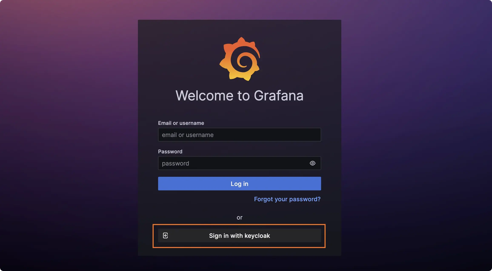

### Datasource

Create two Prometheus datasources in Grafana with the following URLs: `http://vmauth:8427/select` and `http://vmauth:8427/single`, pointing to the `vmselect` and `vmsingle` services respectively. Make sure the authentication method is set to `Forward OAuth identity`.


You can also use VictoriaMetrics [Grafana datasource](https://github.com/VictoriaMetrics/victoriametrics-datasource) plugin.
See installation instructions in [Grafana datasource - Installation](https://docs.victoriametrics.com/victoriametrics/victoriametrics-datasource/#installation).

Users with the `vm_access` claim will be able to query metrics from the specified tenant with extra filters applied.

### Test access

The Grafana datasources configuration should be as follows:

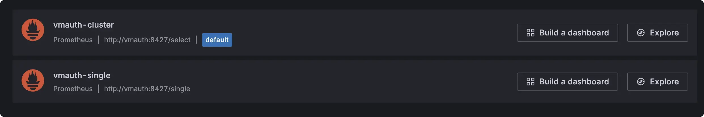

Let's log in as a dev user.
Both data sources should return the same metrics.
The only difference is the filter: `vmauth-cluster` data source must restrict results by `tenant=0:1`, while `vmauth-single` must apply the `team=dev` label filter instead.

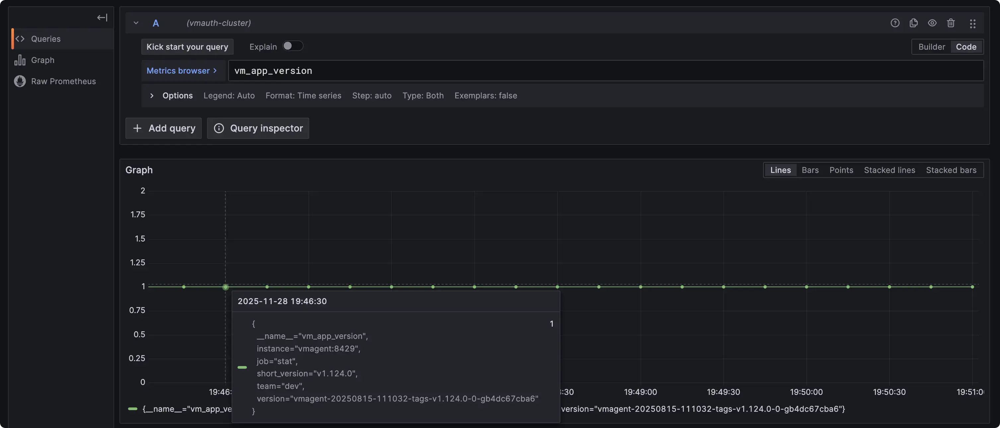

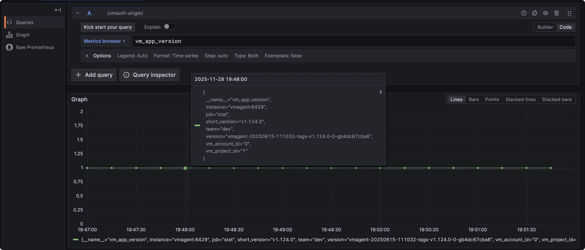

Let's log in as an admin user.
Both data sources should return the same metrics but different from the previous user.
The only difference is the filter: `vmauth-cluster` data source must restrict results by `tenant=0:0`, while `vmauth-single` must apply the `team=admin` label filter instead.


## Summary

In this guide, we demonstrated how to set up vmauth with OIDC authorization using Keycloak as the identity provider.
We also showed how to provide multi-tenant access to your metrics stored in VictoriaMetrics single-node or cluster 
using Grafana and vmauth with OIDC authorization enabled.
