Using [Grafana](https://grafana.com/) with [vmauth](https://docs.victoriametrics.com/victoriametrics/vmauth/) is an effective way to provide [multi-tenant](https://docs.victoriametrics.com/victoriametrics/cluster-victoriametrics/#multitenancy) access to your metrics, logs, and traces.
vmauth provides a way to authenticate users using [JWT tokens](https://en.wikipedia.org/wiki/JSON_Web_Token) issued by an external identity provider.
Those tokens can include information about the user and their tenant, which vmauth can use to restrict access so users only see metrics in their own tenant.

This guide walks through configuring Grafana with OIDC to query metrics from both single-node and cluster deployments of VictoriaMetrics.

## Prerequisites

* [Docker](https://docs.docker.com/engine/install/) and [docker compose](https://docs.docker.com/compose/) must be installed.
* Add `grafana` and `keycloak` hosts to the `/etc/hosts` file, pointing to `127.0.0.1`.

```
# /etc/hosts

# Setup vmauth - Multi-Tenant Access with Grafana & OIDC
# https://docs.victoriametrics.com/guides/grafana-vmauth-openid-configuration/#prerequisites
127.0.0.1 keycloak grafana
```

## Identity provider

The identity provider must be able to issue JWT tokens with the following `vm_access` claim:

```json
{
  "exp": 1772019469,
  "vm_access": {
    "metrics_account_id": 0,
    "metrics_project_id": 0,
    "metrics_extra_labels": [
      "team=dev"
    ],
    "metrics_extra_filters": [
     "{env=~\"aws|gcp\",cluster!=\"production\"}"
    ]
  }
}
```
> Note: all properties inside `vm_access` are optional and could be omitted. `vm_access: {}` is a valid claim value.

Some identity providers support only string-based claim values, and vmauth supports these as well:
```json
{
  "exp": 1772019469,
  "vm_access": "{\"metrics_account_id\": 0, \"metrics_project_id\": 0}"
}
```

See details about all supported options in the [vmauth - JWT token auth proxy](https://docs.victoriametrics.com/victoriametrics/vmauth/#jwt-token-auth-proxy).

### Setup Keycloak

[Keycloak](https://www.keycloak.org/) is an open-source identity provider that can issue JWT tokens.

Add the following section to your `compose.yaml` file to configure Keycloak:

```yaml
# compose.yaml
services:
  keycloak:
    image: quay.io/keycloak/keycloak:26.3
    command:
      - start-dev
      - --http-port=3001
    ports:
      - 127.0.0.1:3001:3001
    environment:
      KC_HOSTNAME_BACKCHANNEL_DYNAMIC: "true"
      KC_HOSTNAME: http://keycloak:3001/
      KC_BOOTSTRAP_ADMIN_USERNAME: admin
      KC_BOOTSTRAP_ADMIN_PASSWORD: change_me
    volumes:
      - keycloakdata:/opt/keycloak/data

volumes:
  keycloakdata: {}
```

Start the services:
```sh
docker compose up
```

Once Keycloak is available, follow the steps below to configure the OIDC client and users for Grafana:

### Create client

1. Open [http://keycloak:3001](http://keycloak:3001).
1. Log in with credentials.
    - Username: `admin`
    - Password: `change_me`
1. Go to `Clients` -> `Create client`.
    - Use `OpenID Connect` as `Client Type`.
    - Specify `grafana` as `Client ID`.
    - Click `Next`.
   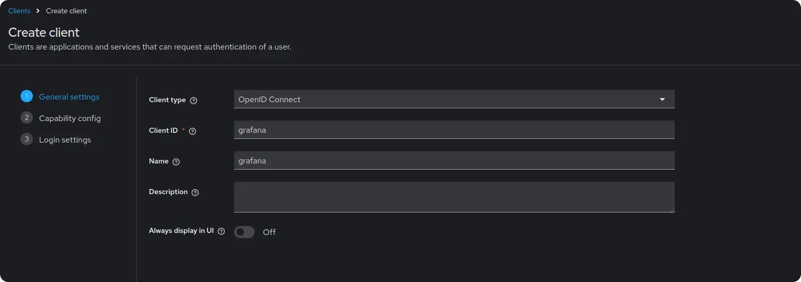
1. Enable `Client authentication`
    - Enable `Authorization`.
    - Enable `Direct access grants` (this is only required for testing the token but it can be disabled in production)
   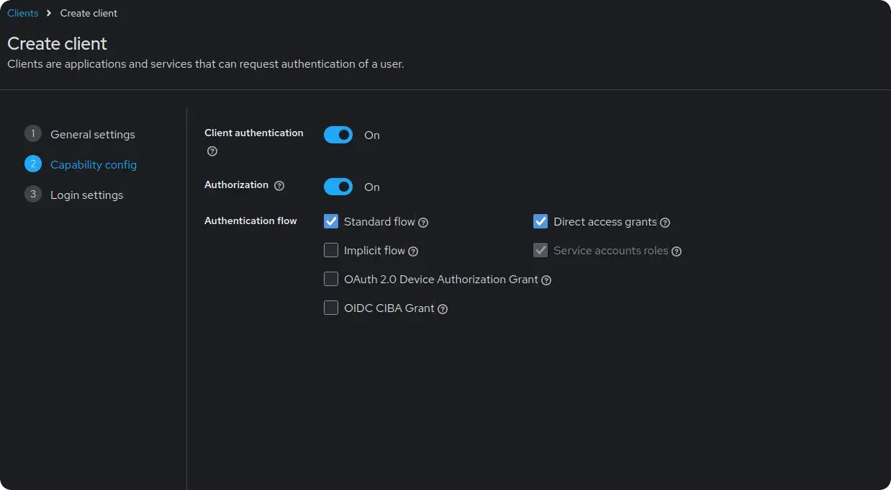
    - Click `Next`.
1. Add the Grafana URL as `Root URL`. For example, `http://grafana:3000`.
   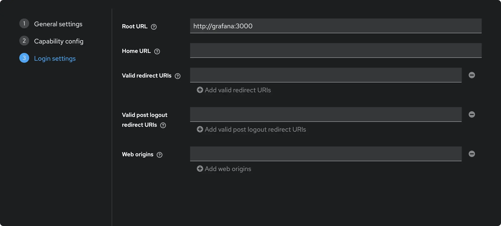
    - Click `Save`.
1. Go to `Clients` -> `grafana` -> `Client scopes`.
   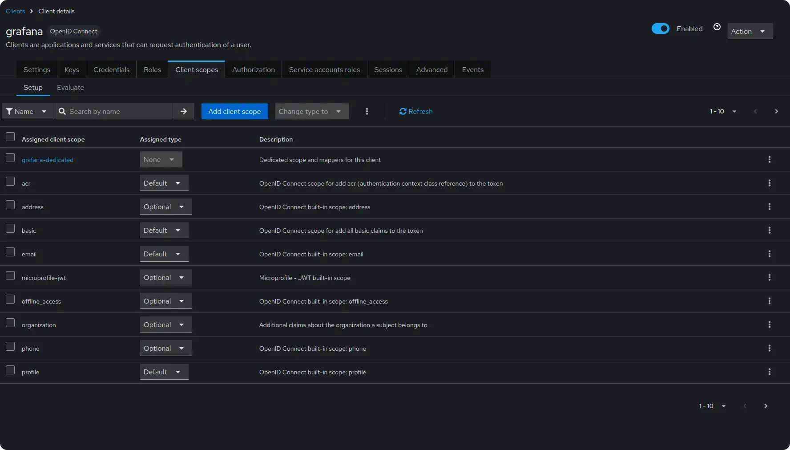
   - Click on `grafana-dedicated` -> `Configure a new mapper` -> `User attribute`.
   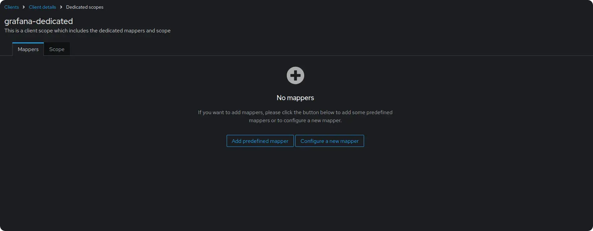
1. Configure the mapper as follows:
   - Set `Name` to `vm_access`.
   - Set `User Attribute` to `vm_access`.
   - Set `Token Claim Name` to `vm_access`.
   - Set `Claim JSON Type` to `JSON`.
   - Enable `Add to ID token` and `Add to access token`.
   
   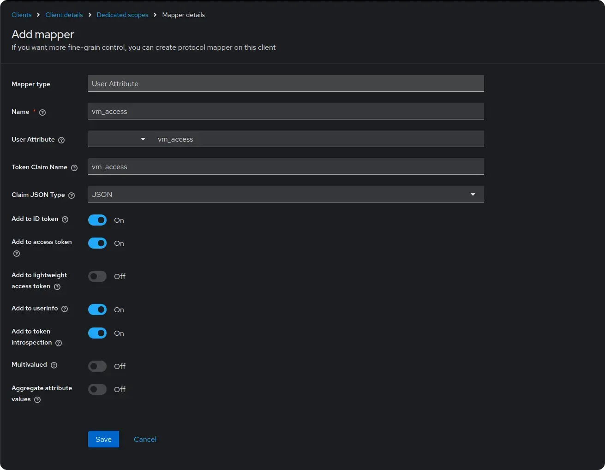
   - Click `Save`.

### Create users

1. Go to `Realm settings` -> `User profile`.
   - Click `Create attribute`.<br>
   - Specify `vm_access` as `Attribute [Name]`.
   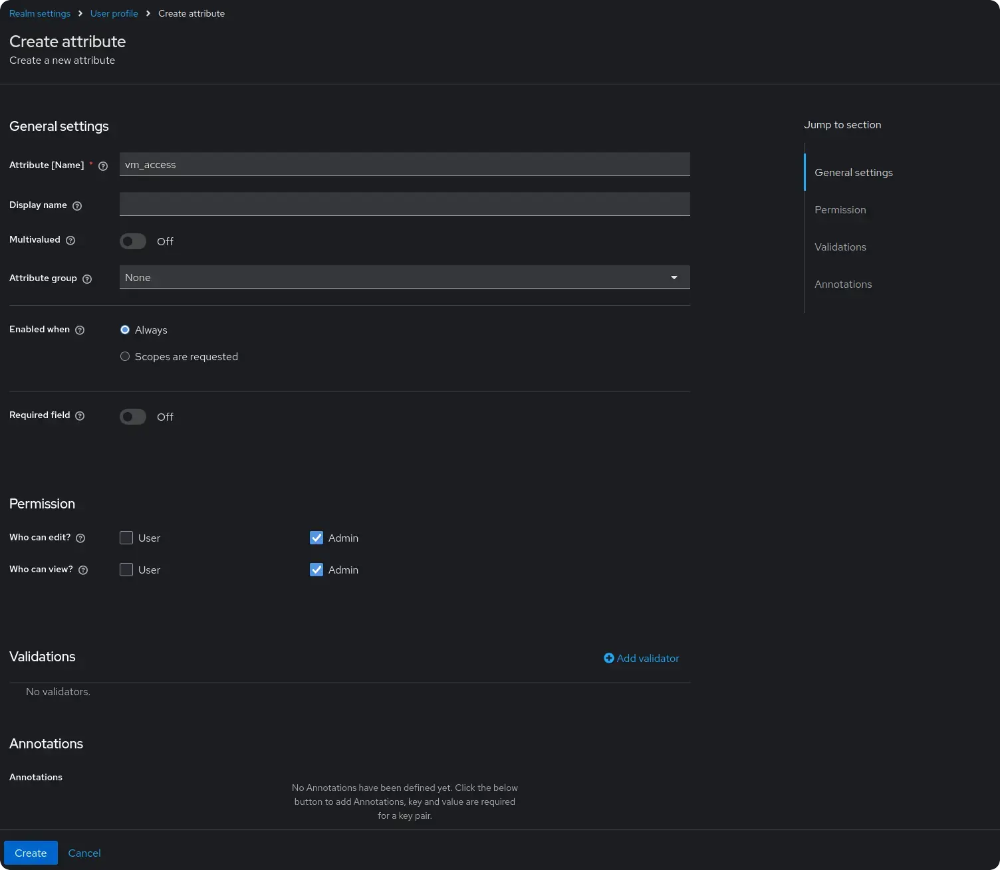
   - Click `Create`.
1. Go to `Users` -> `Add user`.
   - Mark email as verified.
   - Specify `test-dev` as `Username`.
   - Specify `test-dev@example.com` as `Email`.
   - Specify `vm_access` as `{"metrics_account_id": 1, "metrics_project_id": 2, "metrics_extra_labels": ["team=dev"]}`.
   - Press `Create`
   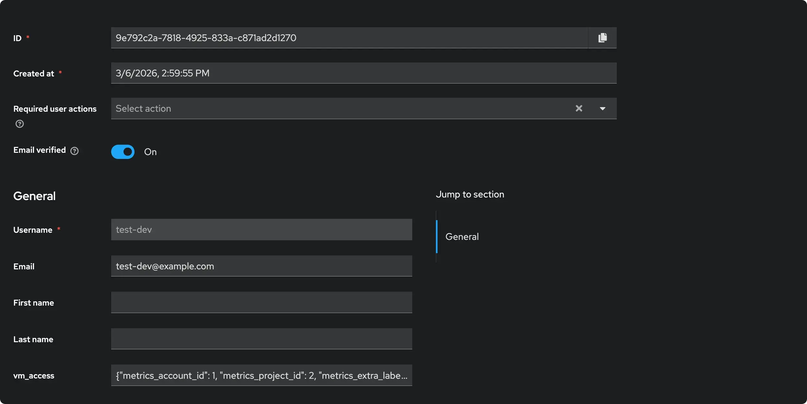
   - Go to `Users` -> `test-dev` user -> `Credentials` tab.
   - Press `Set Password`.
   - Type the password `testpass`.
   - Disable `Temporary` option 
   - Press `Save` and confirm.

1. Go to `Users` -> `admin` user.
   - Mark email as verified.
   - Specify `admin@example.com` as `Email`.
   - Specify `vm_access` as `{"metrics_account_id": 1, "metrics_project_id": 2, "metrics_extra_labels": ["team=admin"]}`.
   - Click `Save`.

### Test identity provider

Gather the following information needed to configure Grafana:

1. The Realm name must be `master`. To get the name, go to `Realm settings` -> `General` and copy the `Name`.
1. The Client ID must be `grafana`. To get the ID, go to `Clients` -> `grafana` -> `Settings` and copy the `Client ID`.
1. The Client Secret is dynamically generated. To get the secret, go to `Clients` -> `grafana` -> `Credentials` and copy the `Client Secret`.<br>
   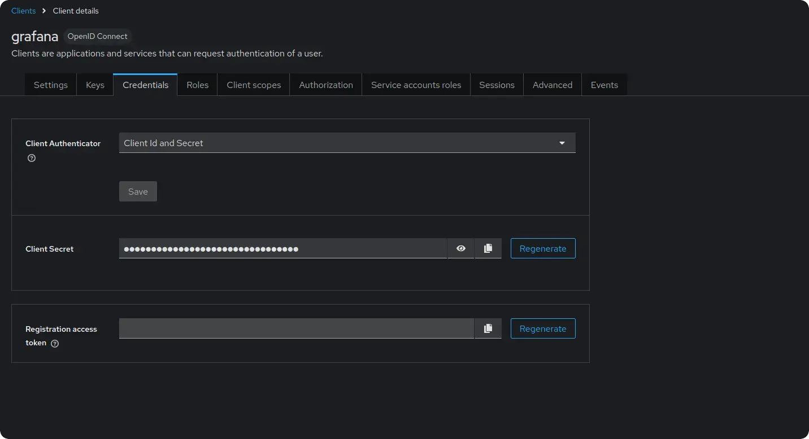
   <br>

Test that everything is working by requesting a token using `curl`:

```sh
TOKEN=$(curl --fail -s -X POST "http://keycloak:3001/realms/master/protocol/openid-connect/token" \
    -H "Content-Type: application/x-www-form-urlencoded" \
    -d "client_id=grafana" \
    -d "client_secret={CLIENT_SECRET}" \
    -d "grant_type=password" \
    -d "username=test-dev" \
    -d "password=testpass" | jq -r '.access_token') && echo $TOKEN
```

<!--
fish example:
set TOKEN (curl --fail -s -X POST "http://keycloak:3001/realms/master/protocol/openid-connect/token" \
  -H "Content-Type: application/x-www-form-urlencoded" \
  -d "client_id=grafana" \
  -d "client_secret={CLIENT_SECRET}" \
  -d "grant_type=password" \
  -d "username=test-dev" \
  -d "password=testpass" | jq -r '.access_token'); and echo $TOKEN
-->

The response should contain a valid JWT token with the `vm_access` claim. 
Use [jwt.io](https://jwt.io/) to decode and verify that the vm_access claim is present with the expected values.

> Please note that the issued token is short-lived, so you might need to refresh it before use in later chapters. 

## VictoriaMetrics

### Storage and scraping

First, create a `scrape.yaml` file with vmagent scrape configuration to ingest data into vmsingle and vmstorage for testing purposes:

```yaml
# scrape.yaml
scrape_configs:
  - job_name: stat
    metric_relabel_configs:
      # The team label showcases extra_filter functionality used with vmsingle.
      - if: "{instance =~ 'vmauth.*'}"
        action: replace
        target_label: team
        replacement: admin
      - if: "{instance =~ 'vmagent.*'}"
        action: replace
        target_label: team
        replacement: dev

      # The vm_account_id and vm_project_id labels showcase tenant functionality used with vmcluster
      - if: "{instance =~ 'vmauth.*'}"
        action: replace
        target_label: vm_account_id
        replacement: '1'
      - if: "{instance =~ 'vmauth.*'}"
        action: replace
        target_label: vm_project_id
        replacement: '2'
      - if: "{instance =~ 'vmagent.*'}"
        action: replace
        target_label: vm_account_id
        replacement: '1'
      - if: "{instance =~ 'vmagent.*'}"
        action: replace
        target_label: vm_project_id
        replacement: '2'
    static_configs:
      - targets:
          - vmagent:8429
          - vmauth:8427

```

Add VictoriaMetrics single-node and cluster to the `compose.yaml` file.
These services will be used to store metrics scraped by vmagent and to query them via Grafana using vmauth.

Relabeling rules will add the `team` label to the scraped metrics in order to test multi-tenant access.
Metrics from `vmagent` will be labeled with `team=dev` and metrics from `vmauth` will be labeled with `team=admin`.

vmagent will write data into VictoriaMetrics single-node and cluster (with tenant `1:2`).

```yaml
# compose.yaml
services:
  vmsingle:
    image: victoriametrics/victoria-metrics:v1.136.0

  vmstorage:
    image: victoriametrics/vmstorage:v1.136.0-cluster

  vminsert:
    image: victoriametrics/vminsert:v1.136.0-cluster
    command:
      - -storageNode=vmstorage:8400

  vmselect:
    image: victoriametrics/vmselect:v1.136.0-cluster
    command:
      - -storageNode=vmstorage:8401

  vmagent:
    image: victoriametrics/vmagent:v1.136.0
    volumes:
      - ./scrape.yaml:/etc/vmagent/config.yaml
    command:
      - -promscrape.config=/etc/vmagent/config.yaml
      - -remoteWrite.url=http://vminsert:8480/insert/multitenant/prometheus/api/v1/write
      - -remoteWrite.url=http://vmsingle:8428/api/v1/write
```

### Vmauth

Before we start, let's explore the concept of placeholders supported in the vmauth configuration.
Placeholders can be used inside the `url_prefix` property to restrict access by setting the [tenant](https://docs.victoriametrics.com/victoriametrics/cluster-victoriametrics/#url-format) or [extra filters](https://docs.victoriametrics.com/victoriametrics/single-server-victoriametrics/#prometheus-querying-api-enhancements).

A placeholder value is taken from the authenticated JWT token.
The following placeholders are supported:
- `{{.MetricsTenant}}` placeholder is a combination of `vm_access.metrics_account_id` and `vm_access.metrics_project_id` delimited by `:`.
- `{{.MetricsExtraLabels}}` placeholder is substituted from `vm_access.metrics_extra_labels` claim property.
- `{{.MetricsExtraFilters}}` placeholder is substituted from `vm_access.metrics_extra_filters` claim property.

Now, let's create a vmauth configuration file `auth.yaml` that enables OIDC authorization using the [identity provider](https://docs.victoriametrics.com/guides/grafana-vmauth-openid-configuration/#identity-provider).
For cluster access, we use the `{{.MetricsTenant}}` placeholder to route requests to a specific tenant.
For single-node access, we use `{{.MetricsExtraLabels}}`. 
Read more about templating in vmauth [docs](https://docs.victoriametrics.com/victoriametrics/vmauth/#jwt-claim-based-request-templating).

```yaml
# auth.yaml
users:
  - jwt:
      oidc:
        issuer: 'http://keycloak:3001/realms/master'
    url_map:
      - src_paths:
          - "/insert/.*"
        drop_src_path_prefix_parts: 1
        url_prefix: "http://vminsert:8480/insert/{{.MetricsTenant}}/prometheus/"
      - src_paths:
          - "/select/.*"
        drop_src_path_prefix_parts: 1
        url_prefix: "http://vmselect:8481/select/{{.MetricsTenant}}/prometheus/"
      - src_paths:
          - "/single/.*"
        drop_src_path_prefix_parts: 1
        url_prefix: "http://vmsingle:8428?extra_label={{.MetricsExtraLabels}}"
```

Now add the vmauth service to `compose.yaml`:

```yaml
# compose.yaml
services:
  vmauth:
    image: docker.io/victoriametrics/vmauth:heads-vmauth-jwt-oidc-0-g5b053c9bbb-dirty-c2e46287
    ports:
      - 8427:8427
    volumes:
      - ./auth.yaml:/auth.yaml
    command:
      - -auth.config=/auth.yaml
```

### Test vmauth

Start the services:

```sh
docker compose up
```

Use the token obtained in the [Test identity provider](https://docs.victoriametrics.com/guides/grafana-vmauth-openid-configuration/#test-identity-provider) section to test vmauth configuration.

Cluster select:
```sh
curl --fail http://localhost:8427/select/api/v1/status/buildinfo -H "Authorization: Bearer $TOKEN"

# Output:
# {"status":"success","data":{"version":"2.24.0"}}
```

Cluster insert:
```sh
curl --fail http://localhost:8427/insert/api/v1/write -H "Authorization: Bearer $TOKEN" -i
# Output
# HTTP/1.1 204 No Content
# ...
```

Single select:
```sh
curl --fail http://localhost:8427/single/api/v1/status/buildinfo -H "Authorization: Bearer $TOKEN"

# Output:
# {"status":"success","data":{"version":"2.24.0"}}
```

## Grafana

### Setup

Add the Grafana service to the `compose.yaml` file.
This configuration enables OAuth authentication using the previously configured Keycloak service as the identity provider.
Don't forget to replace the `{CLIENT_SECRET}` placeholder with the actual client secret gathered earlier.

```yaml
# compose.yaml
services:
  grafana:
    image: grafana/grafana:12.1.0
    ports:
      - 3000:3000
    environment:
      GF_SERVER_ROOT_URL: http://grafana:3000
      GF_AUTH_GENERIC_OAUTH_ENABLED: true
      GF_AUTH_GENERIC_OAUTH_ALLOW_SIGN_UP: true
      GF_AUTH_GENERIC_OAUTH_NAME: keycloak
      GF_AUTH_GENERIC_OAUTH_CLIENT_ID: grafana
      GF_AUTH_GENERIC_OAUTH_CLIENT_SECRET: '{CLIENT_SECRET}'
      GF_AUTH_GENERIC_OAUTH_EMAIL_ATTRIBUTE_PATH: email
      GF_AUTH_GENERIC_OAUTH_LOGIN_ATTRIBUTE_PATH: username
      GF_AUTH_GENERIC_OAUTH_NAME_ATTRIBUTE_PATH: full_name
      GF_AUTH_GENERIC_OAUTH_SCOPES: openid profile email
      GF_AUTH_GENERIC_OAUTH_USE_REFRESH_TOKEN: true
      GF_AUTH_GENERIC_OAUTH_AUTH_URL: http://keycloak:3001/realms/master/protocol/openid-connect/auth
      GF_AUTH_GENERIC_OAUTH_TOKEN_URL: http://keycloak:3001/realms/master/protocol/openid-connect/token
      GF_AUTH_GENERIC_OAUTH_API_URL: http://keycloak:3001/realms/master/protocol/openid-connect/userinfo
      GF_AUTH_GENERIC_OAUTH_ROLE_ATTRIBUTE_PATH: contains(groups[*], 'grafana-editor') && 'Editor' || 'GrafanaAdmin'
    volumes:
      - grafanadata:/var/lib/grafana/

volumes:
  grafanadata: {}
```

Alternatively, OAuth authentication can be enabled via the `grafana.ini` configuration file.
Don't forget to mount it to the Grafana service at `/etc/grafana/grafana.ini`.

```ini
# grafana.ini

[server]
root_url = http://grafana:3000

[auth.generic_oauth]
enabled = true
allow_sign_up = true
name = keycloak
client_id = grafana
client_secret = {CLIENT_SECRET}
scopes = openid profile email
auth_url = http://keycloak:3001/realms/master/protocol/openid-connect/auth
token_url = http://keycloak:3001/realms/master/protocol/openid-connect/token
api_url = http://keycloak:3001/realms/master/protocol/openid-connect/userinfo
use_refresh_token = true
```

After starting Grafana with the new config, you should be able to log in [http://grafana:3000](http://grafana:3000) using your [identity provider](https://docs.victoriametrics.com/guides/grafana-vmauth-openid-configuration/#identity-provider).

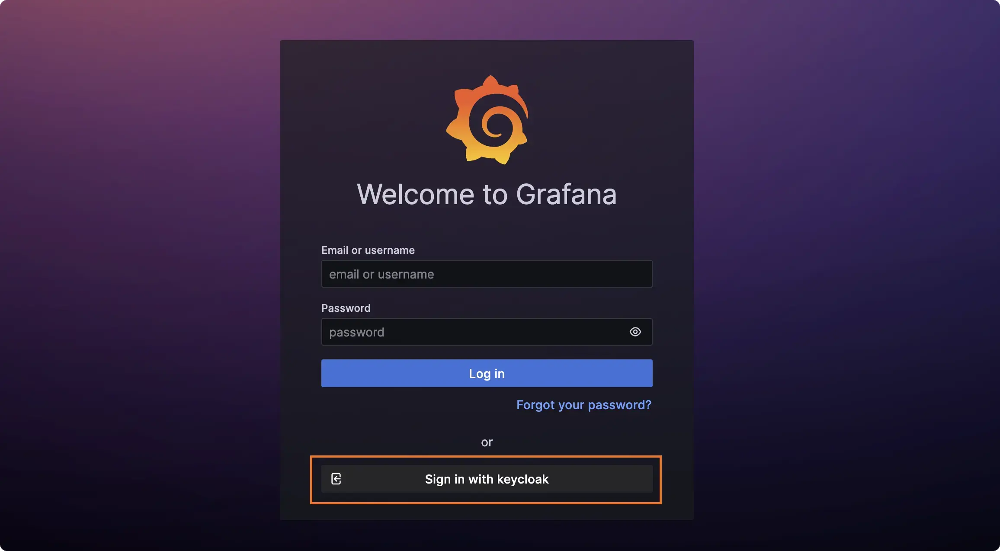

### Datasource

Create two Prometheus datasources in Grafana with the following URLs: `http://vmauth:8427/select` and `http://vmauth:8427/single`, pointing to the `vmselect` and `vmsingle` services, respectively. Make sure the authentication method is set to `Forward OAuth identity`.

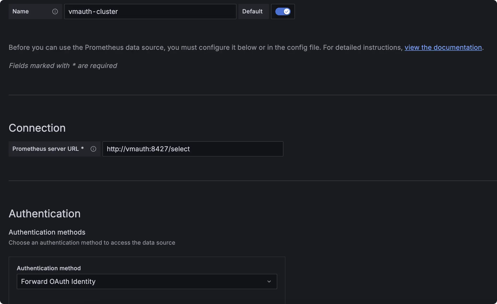

You can also use the VictoriaMetrics [Grafana datasource](https://github.com/VictoriaMetrics/victoriametrics-datasource) plugin.
See installation instructions in [Grafana datasource - Installation](https://docs.victoriametrics.com/victoriametrics/victoriametrics-datasource/#installation).

Users with the `vm_access` claim will be able to query metrics from the specified tenant with extra filters applied.

### Test access

The Grafana datasources configuration should be as follows:

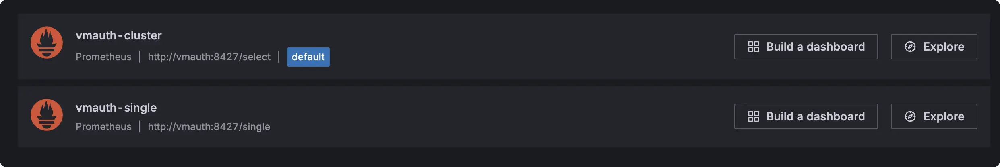
<figcaption style="text-align: center; font-style: italic;">Grafana vmauth datasources</figcaption>

Let's log in as a dev user in the VictoriaMetrics cluster and single versions.
Both data sources should return the same metrics.

The only difference is the filter: for the VictoriaMetrics cluster, the `vmauth-cluster` data source must restrict results by `tenant=1:2`.

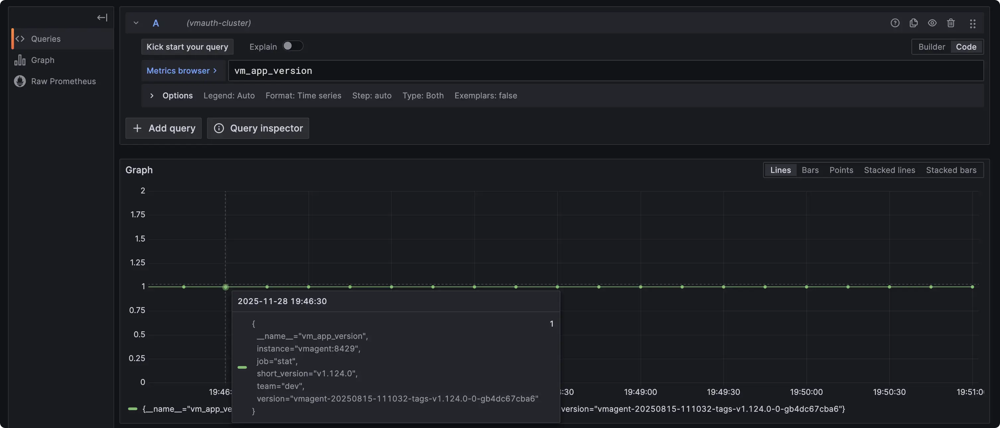
<figcaption style="text-align: center; font-style: italic;">Logged in as dev user to Grafana dashboard on VictoriaMetrics Cluster</figcaption>

While on VictoriaMetrics single `vmauth-single` must apply the `team=dev` label filter instead.

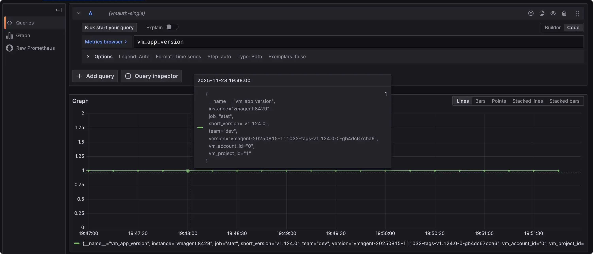
<figcaption style="text-align: center; font-style: italic;">Logged in as dev user to Grafana dashboard on VictoriaMetrics Single</figcaption>

Let's log in as an admin user. The `vmauth-single` data source should differ from the previous user, while `vmauth-cluster` should remain the same because both users use tenant `1:2`.

The only difference is the filter: in the VictoriaMetrics cluster `vmauth-cluster`, the data source must restrict results by `tenant=1:2`.


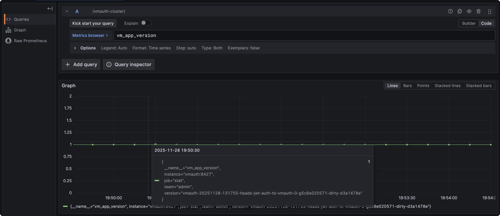
<figcaption style="text-align: center; font-style: italic;">Logged in as admin user to Grafana dashboard on VictoriaMetrics Cluster</figcaption>

While in VictoriaMetrics single `vmauth-single` must apply the `team=admin` label filter instead.

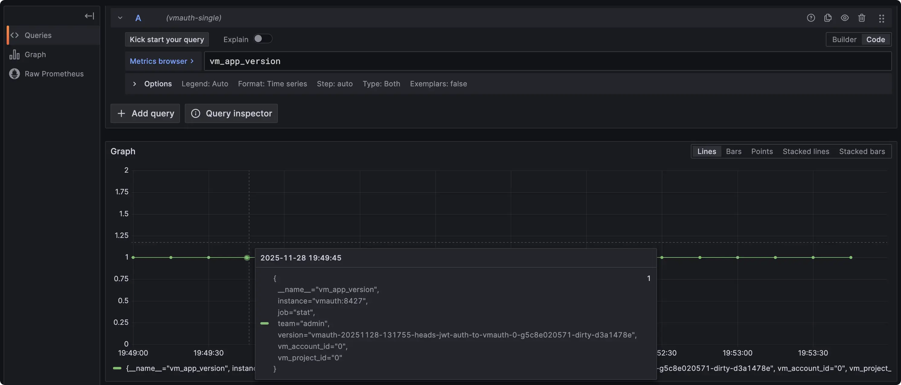
<figcaption style="text-align: center; font-style: italic;">Logged in as admin user to Grafana dashboard on VictoriaMetrics Single</figcaption>

## Summary

In this guide, we demonstrated how to set up vmauth with OIDC authorization using Keycloak as the identity provider. We also showed how to provide multi-tenant access to your metrics stored in VictoriaMetrics, single-node or cluster, using Grafana and vmauth with OIDC authorization enabled.

