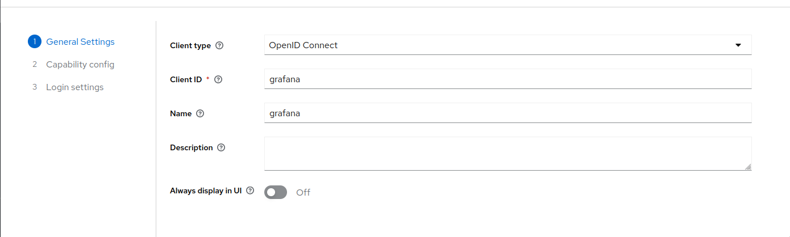
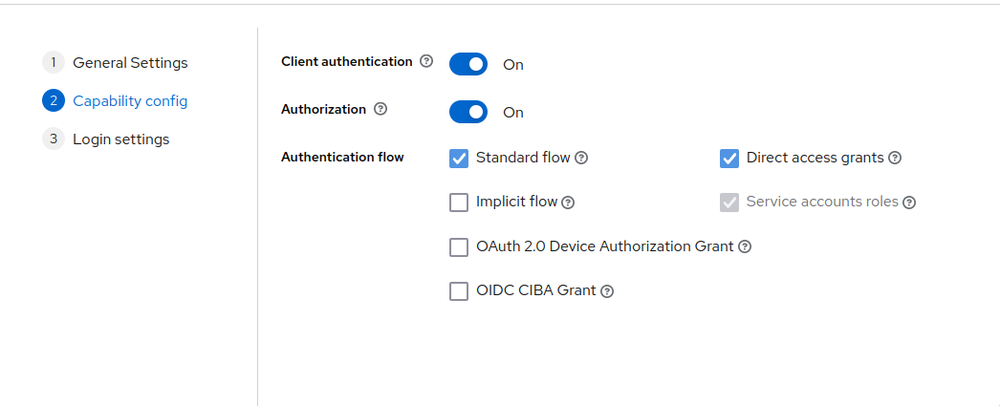
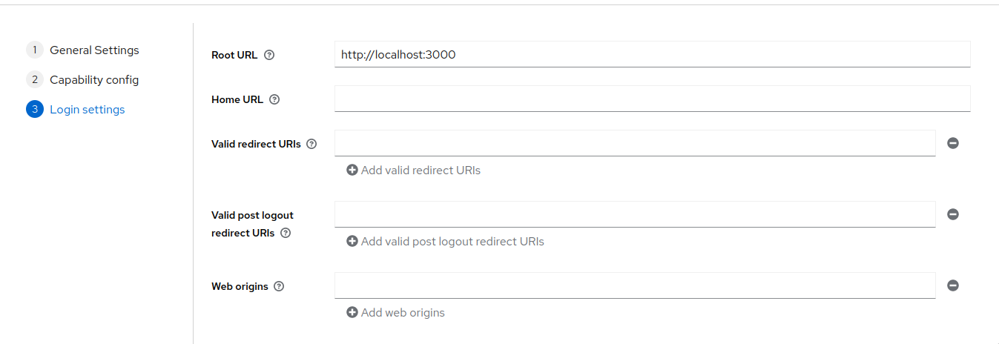
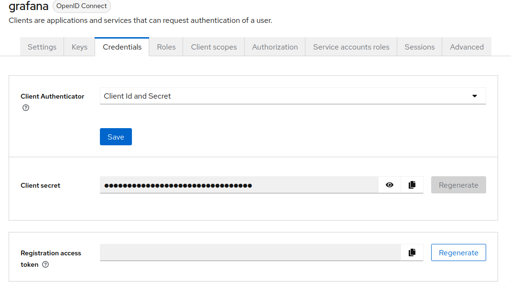
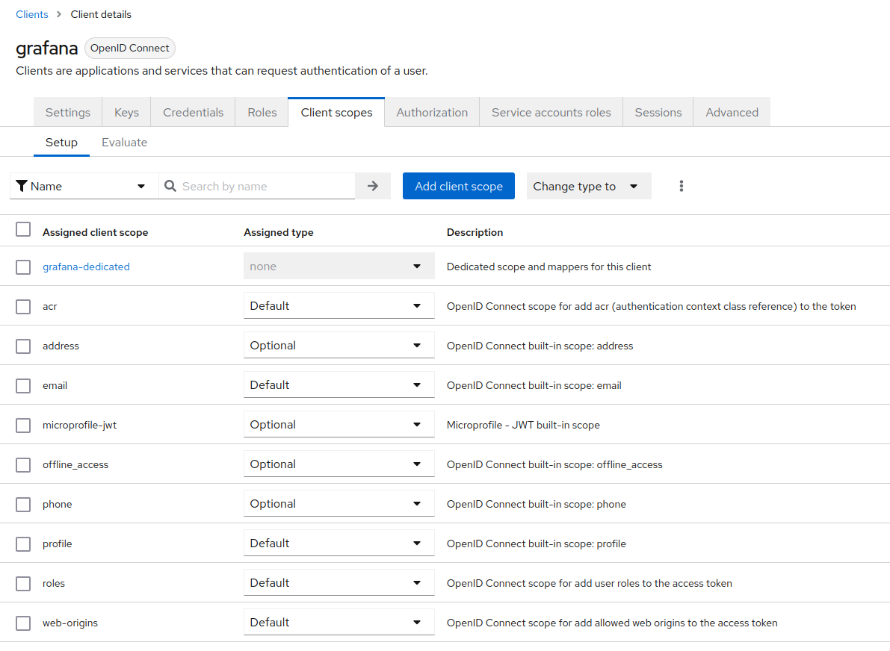
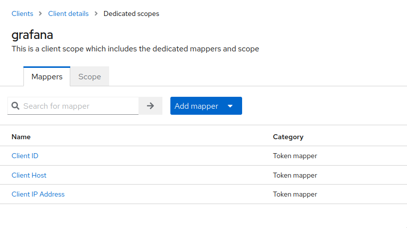
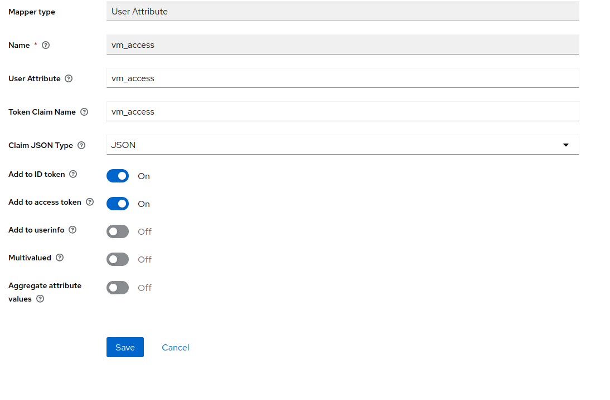
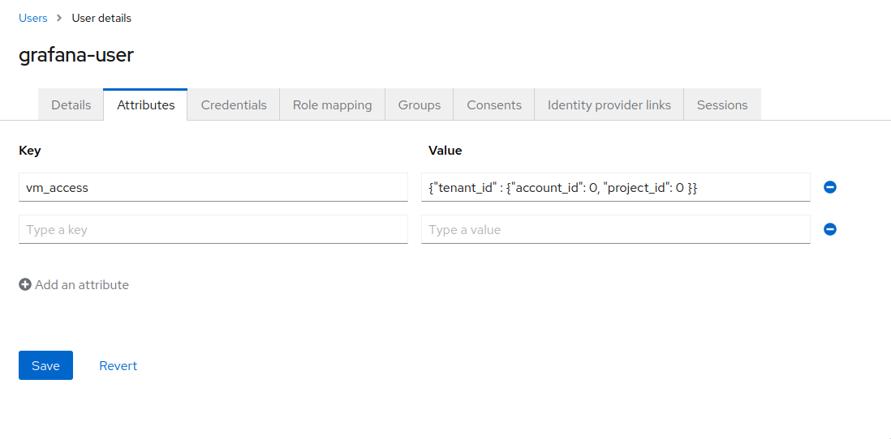
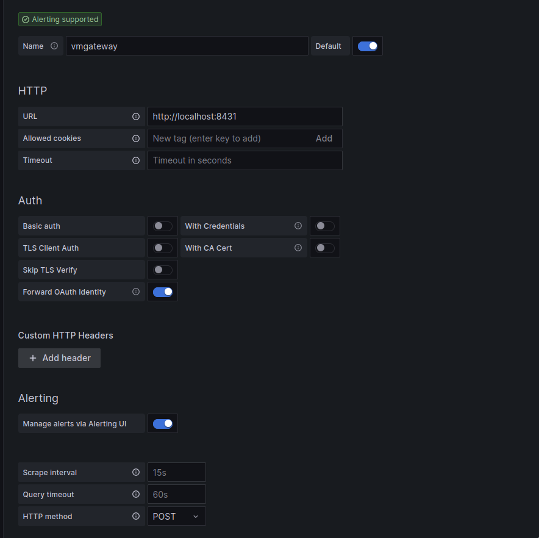

# How to configure vmgateway for multi-tenant access using Grafana and OpenID Connect

Using [Grafana](https://grafana.com/) with [vmgateway](https://docs.victoriametrics.com/vmgateway.html) is a great way to provide [multi-tenant](https://docs.victoriametrics.com/Cluster-VictoriaMetrics.html#multitenancy) access to your metrics.
vmgateway provides a way to authenticate users using [JWT tokens](https://en.wikipedia.org/wiki/JSON_Web_Token) issued by an external identity provider.
Those tokens can include information about the user and the tenant they belong to, which can be used
to restrict access to metrics to only those that belong to the tenant.

## Prerequisites

* Identity service that can issue [JWT tokens](https://en.wikipedia.org/wiki/JSON_Web_Token)
* [Grafana](https://grafana.com/)
* VictoriaMetrics single-node or cluster version
* [vmgateway](https://docs.victoriametrics.com/vmgateway.html)

## Configure identity service

The identity service must be able to issue JWT tokens with the following `vm_access` claim:

```json
{
  "vm_access": {
    "tenant_id": {
      "account_id": 0,
      "project_id": 0
    }
  }
}
```

See details about all supported options in the [vmgateway documentation](https://docs.victoriametrics.com/vmgateway.html#access-control).

### Configuration for Keycloak

1. Log in with admin credentials to your Keycloak instance
2. Go to `Clients` -> `Create`.
   Use `OpenID Connect` as `Client Type`.
   Specify `grafana` as `Client ID`.
   Click `Next`.
   
3. Enable `Client authentication`.
   Enable `Authorization`.
   
   Click `Next`.
4. Add Grafana URL as `Valid Redirect URIs`. For example, `http://localhost:3000/`.
   
   Click `Save`.
5. Go to `Clients` -> `grafana` -> `Credentials`.
   
   Copy the value of `Client secret`. It will be used later in Grafana configuration.
6. Go to `Clients` -> `grafana` -> `Client scopes`.
   Click at `grafana-dedicated` -> `Add mapper`.
   
   
   Configure the mapper as follows
    - `Mapper Type` as `User Attribute`.
    - `Name` as `vm_access`.
    - `Token Claim Name` as `vm_access`.
    - `User Attribute` as `vm_access`.
    - `Claim JSON Type` as `JSON`.
      Enable `Add to ID token` and `Add to access token`.
      
      Click `Save`.
7. Go to `Users` -> select user to configure claims -> `Attributes`.
   Specify `vm_access` as `Key`.
   Specify `{"tenant_id" : {"account_id": 0, "project_id": 0 }}` as `Value`.
   
   Click `Save`.

## Configure grafana

To forward JWT tokens Grafana must be configured to use OpenID Connect authentication as follows:

```ini
[auth.generic_oauth]
enabled = true
allow_sign_up = true
team_ids =
allowed_organizations =
name = keycloak
client_id = {CLIENT_ID_FROM_IDENTITY_PROVIDER}
client_secret = {SECRET_FROM_IDENTITY_PROVIDER}
scopes = openid profile email
auth_url = http://localhost:3001/realms/{KEYCLOACK_REALM}/protocol/openid-connect/auth
token_url = http://localhost:3001/realms/{KEYCLOACK_REALM}/protocol/openid-connect/token
api_url = http://localhost:3001/realms/{KEYCLOACK_REALM}/protocol/openid-connect/userinfo
```

After restarting Grafana with the new config you should be able to log in using your identity provider.

## Start vmgateway

### Multi-tenant access for VictoriaMetrics cluster

Now starting vmgateway with enabled authentication is as simple as adding the `-enable.auth=true` flag.
In order to enable multi-tenant access, you must also specify the `-clusterMode=true` flag.

```console
./bin/vmgateway -eula \
    -enable.auth=true \
    -clusterMode=true \
    -write.url=http://localhost:8480 \
    -read.url=http://localhost:8481
```

With this configuration vmgateway will use the `vm_access` claim from the JWT token to restrict access to metrics.
For example, if the JWT token contains the following `vm_access` claim:

```json
{
  "vm_access": {
    "tenant_id": {
      "account_id": 0,
      "project_id": 0
    }
  }
}
```
> Note: in case `project_id` is not specified, default value `0` is used.

Then vmgateway will proxy request to an endpoint with the following path:

```console
http://localhost:8480/select/0:0/
```

This allows to restrict access to specific tenants without having to create separate datasources in Grafana,
or manually managing access at another proxy level. 

### Multi-tenant access for single-node VictoriaMetrics

In order to use multi-tenant access with single-node VictoriaMetrics, you can use token claims such as `extra_labels`
or `extra_filters` filled dynamically by using Identity Provider's user information.
vmgateway uses those claims and [enhanced Prometheus querying API](https://docs.victoriametrics.com/Single-server-VictoriaMetrics.html#prometheus-querying-api-enhancements)
to provide additional filtering capabilities.

For example, the following claims can be used to restrict user access to specific metrics:

```json
{
  "vm_access": {
    "extra_labels": {
      "team": "dev"
    },
    "extra_filters": ["{env=~\"aws|gcp\",cluster!=\"production\"}"]
  }
}
```

This will add the following query args to the proxied request:

- `extra_labels=team=dev`
- `extra_filters={env=~"aws|gcp",cluster!="production"}`

With this configuration VictoriaMetrics will add the following filters to every query: `{team="dev", env=~"aws|gcp", cluster!="production"}`.
So when user will try to query `vm_http_requests_total` query will be transformed to `vm_http_requests_total{team="dev", env=~"aws|gcp", cluster!="production"}`.

### Token signature verification

It is also possible to enable [JWT token signature verification](https://docs.victoriametrics.com/vmgateway.html#jwt-signature-verification) at
vmgateway.
To do this by using OpenID Connect discovery endpoint you need to specify the `-auth.oidcDiscoveryEndpoints` flag. For example:

```console
./bin/vmgateway -eula \
    -enable.auth=true \
    -clusterMode=true \
    -write.url=http://localhost:8480 \
    -read.url=http://localhost:8481
    -auth.oidcDiscoveryEndpoints=http://localhost:3001/realms/master/.well-known/openid-configuration
```

Now vmgateway will print the following message on startup:

```console
2023-03-13T14:45:31.552Z        info    VictoriaMetrics/app/vmgateway/main.go:154  using 2 keys for JWT token signature verification
```

That means that vmgateway has successfully fetched the public keys from the OpenID Connect discovery endpoint.

It is also possible to provide the public keys directly via the `-auth.publicKeys` flag. See the [vmgateway documentation](https://docs.victoriametrics.com/vmgateway.html#jwt-signature-verification) for details.

## Use Grafana to query metrics

Create a new Prometheus datasource in Grafana with the following URL `http://<vmgateway>:8431`.
URL should point to the vmgateway instance.

You can also use VictoriaMetrics [Grafana datasource](https://github.com/VictoriaMetrics/grafana-datasource) plugin.
See installation instructions [here](https://github.com/VictoriaMetrics/grafana-datasource#installation).

Enable `Forward OAuth identity` flag.


Now you can use Grafana to query metrics from the specified tenant.
Users with `vm_access` claim will be able to query metrics from the specified tenant.
