Using [Grafana](https://grafana.com/) with [vmgateway](https://docs.victoriametrics.com/vmgateway/) is a great way to provide [multi-tenant](https://docs.victoriametrics.com/cluster-victoriametrics/#multitenancy) access to your metrics.
vmgateway provides a way to authenticate users using [JWT tokens](https://en.wikipedia.org/wiki/JSON_Web_Token) issued by an external identity provider.
Those tokens can include information about the user and the tenant they belong to, which can be used
to restrict access to metrics to only those that belong to the tenant.

## Prerequisites

* Identity service that can issue [JWT tokens](https://en.wikipedia.org/wiki/JSON_Web_Token)
* [Grafana](https://grafana.com/)
* VictoriaMetrics single-node or cluster version
* [vmgateway](https://docs.victoriametrics.com/vmgateway/)

## Configure identity service

The identity service must be able to issue JWT tokens with the following `vm_access` claim:

```json
{
  "vm_access": {
    "tenant_id": {
      "account_id": 0,
      "project_id": 0
    }
  }
}
```

See details about all supported options in the [vmgateway documentation](https://docs.victoriametrics.com/vmgateway/#access-control).

### Configuration example for Keycloak

[Keycloak](https://www.keycloak.org/) is an open source identity service that can be used to issue JWT tokens.

1. Log in with admin credentials to your Keycloak instance
1. Go to `Clients` -> `Create`.<br>
   Use `OpenID Connect` as `Client Type`.<br>
   Specify `grafana` as `Client ID`.<br>
   Click `Next`.<br>
   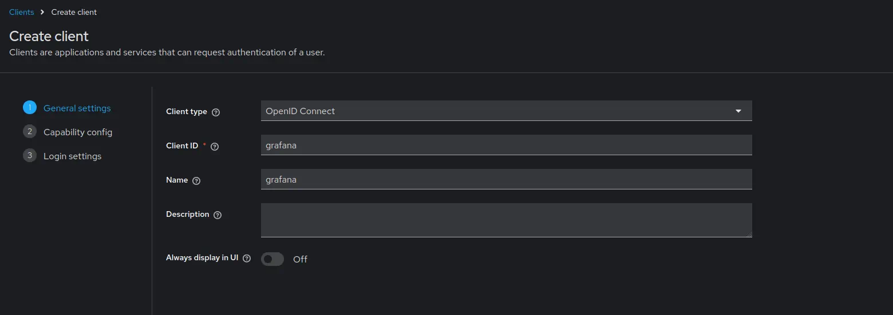
1. Enable `Client authentication`.<br>
   Enable `Authorization`.<br>
   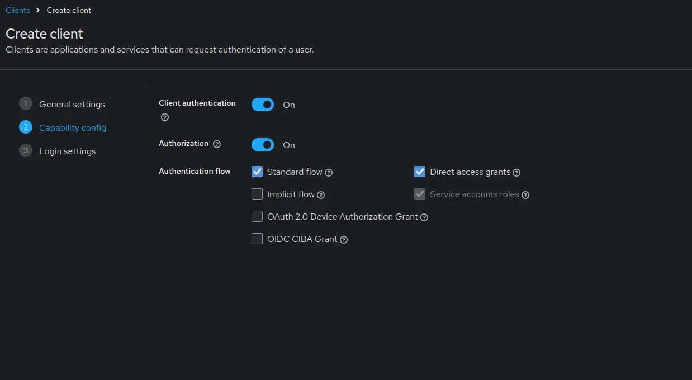
   Click `Next`.<br>
1. Add Grafana URL as `Root URL`. For example, `http://localhost:3000/`.<br>
   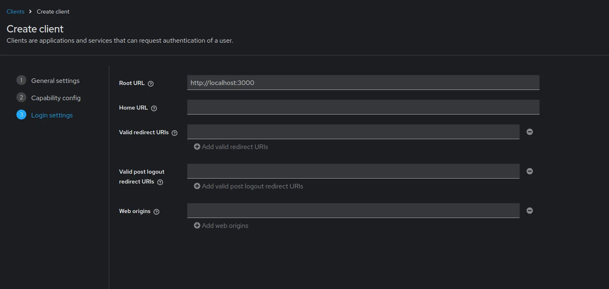
   Click `Save`.<br>
1. Go to `Clients` -> `grafana` -> `Credentials`.<br>
   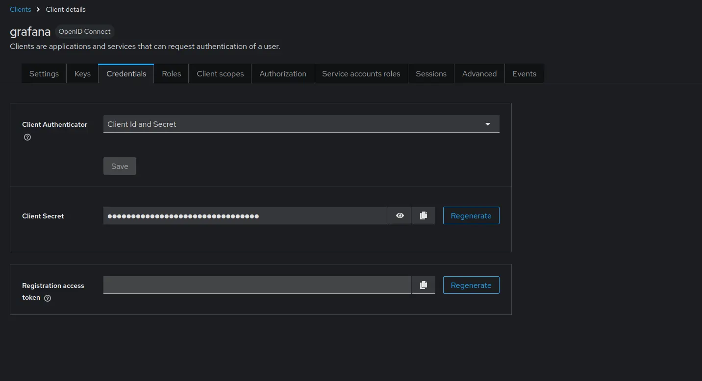
   Copy the value of `Client secret`. It will be used later in Grafana configuration.<br>
1. Go to `Clients` -> `grafana` -> `Client scopes`.<br>
   Click at `grafana-dedicated` -> `Add mapper` -> `By configuration` -> `User attribute`.<br>
   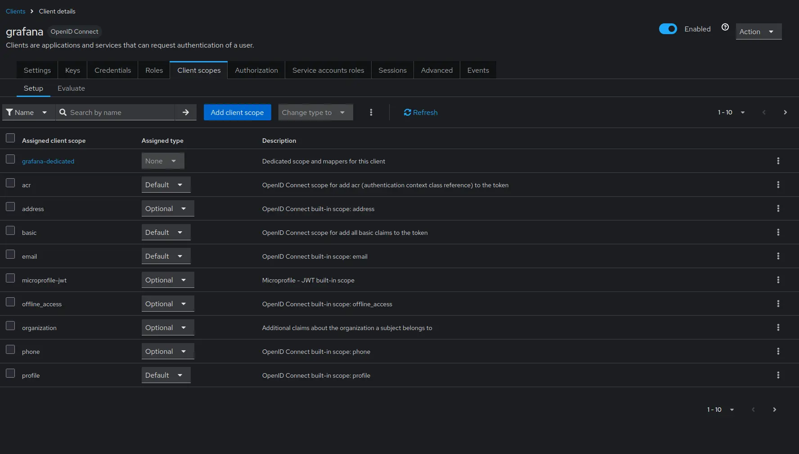
   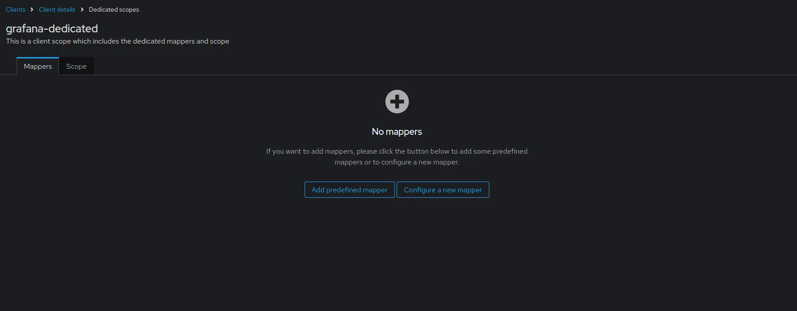
   Configure the mapper as follows<br>
   - `Name` as `vm_access`.
   - `Token Claim Name` as `vm_access`.
   - `User Attribute` as `vm_access`.
   - `Claim JSON Type` as `JSON`.
     Enable `Add to ID token` and `Add to access token`.<br>
   
   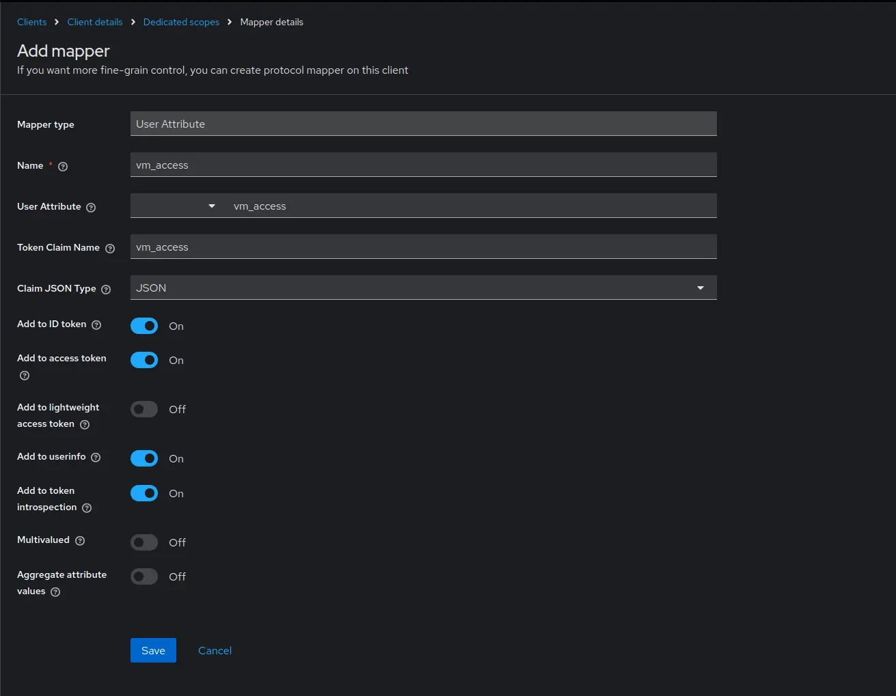
   Click `Save`.<br>
1. Go to `Users` -> select user to configure claims -> `Attributes`.<br>
   Specify `vm_access` as `Key`.<br>
   For the purpose of this example, we will use 2 users:<br>
   - for the first user we will specify `{"tenant_id" : {"account_id": 0, "project_id": 0 },"extra_labels":{ "team": "admin" }}` as `Value`.
   - for the second user we will specify `{"tenant_id" : {"account_id": 0, "project_id": 1 },"extra_labels":{ "team": "dev" }}` as `Value`.
   <br>
   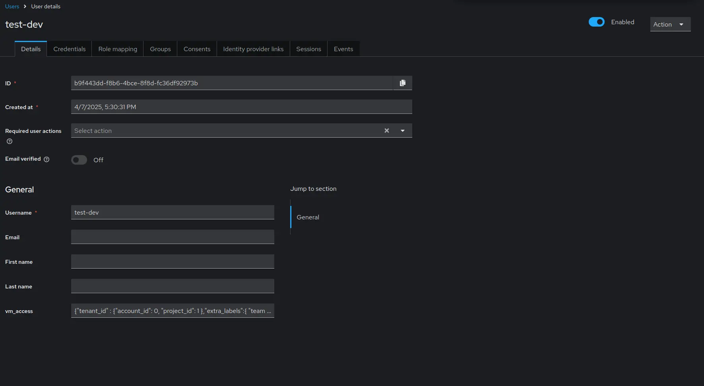
   Click `Save`.

## Configure grafana

To forward JWT tokens Grafana must be configured to use OpenID Connect authentication as follows:

```ini
[auth.generic_oauth]
enabled = true
allow_sign_up = true
name = keycloak
client_id = {CLIENT_ID_FROM_IDENTITY_PROVIDER}
client_secret = {SECRET_FROM_IDENTITY_PROVIDER}
scopes = openid profile email
auth_url = http://localhost:3001/realms/{KEYCLOAK_REALM}/protocol/openid-connect/auth
token_url = http://localhost:3001/realms/{KEYCLOAK_REALM}/protocol/openid-connect/token
api_url = http://localhost:3001/realms/{KEYCLOAK_REALM}/protocol/openid-connect/userinfo
```

After restarting Grafana with the new config you should be able to log in using your identity provider.

## Start vmgateway

### Multi-tenant access for VictoriaMetrics cluster

Now starting vmgateway with enabled authentication is as simple as adding the `-enable.auth=true` flag.
In order to enable multi-tenant access, you must also specify the `-clusterMode=true` flag.

```sh
./bin/vmgateway -eula \
    -enable.auth=true \
    -clusterMode=true \
    -write.url=http://localhost:8480 \
    -read.url=http://localhost:8481
```

With this configuration vmgateway will use the `vm_access` claim from the JWT token to restrict access to metrics.
For example, if the JWT token contains the following `vm_access` claim:

```json
{
  "vm_access": {
    "tenant_id": {
      "account_id": 0,
      "project_id": 0
    }
  }
}
```
> Note: in case `project_id` is not specified, default value `0` is used.

Then vmgateway will proxy request to an endpoint with the following path:

```sh
http://localhost:8480/select/0:0/
```

This allows to restrict access to specific tenants without having to create separate datasources in Grafana,
or manually managing access at another proxy level. 

### Multi-tenant access for single-node VictoriaMetrics

In order to use multi-tenant access with single-node VictoriaMetrics, you can use token claims such as `extra_labels`
or `extra_filters` filled dynamically by using Identity Provider's user information.
vmgateway uses those claims and [enhanced Prometheus querying API](https://docs.victoriametrics.com/single-server-victoriametrics/#prometheus-querying-api-enhancements)
to provide additional filtering capabilities.

For example, the following claims can be used to restrict user access to specific metrics:

```json
{
  "vm_access": {
    "extra_labels": {
      "team": "dev"
    },
    "extra_filters": ["{env=~\"aws|gcp\",cluster!=\"production\"}"]
  }
}
```

This will add the following query args to the proxied request:

- `extra_labels=team=dev`
- `extra_filters={env=~"aws|gcp",cluster!="production"}`

With this configuration VictoriaMetrics will add the following filters to every query: `{team="dev", env=~"aws|gcp", cluster!="production"}`.
So when user will try to query `vm_http_requests_total` query will be transformed to `vm_http_requests_total{team="dev", env=~"aws|gcp", cluster!="production"}`.

### Token signature verification

It is also possible to enable [JWT token signature verification](https://docs.victoriametrics.com/vmgateway/#jwt-signature-verification) at
vmgateway.
To do this by using OpenID Connect discovery endpoint you need to specify the `-auth.oidcDiscoveryEndpoints` flag. For example:

```sh
./bin/vmgateway -eula \
    -enable.auth=true \
    -clusterMode=true \
    -write.url=http://localhost:8480 \
    -read.url=http://localhost:8481
    -auth.oidcDiscoveryEndpoints=http://localhost:3001/realms/master/.well-known/openid-configuration
```

Now vmgateway will print the following message on startup:

```sh
2023-03-13T14:45:31.552Z        info    VictoriaMetrics/app/vmgateway/main.go:154  using 2 keys for JWT token signature verification
```

That means that vmgateway has successfully fetched the public keys from the OpenID Connect discovery endpoint.

It is also possible to provide the public keys directly via the `-auth.publicKeys` flag. See the [vmgateway documentation](https://docs.victoriametrics.com/vmgateway/#jwt-signature-verification) for details.

## Use Grafana to query metrics

Create a new Prometheus datasource in Grafana with the following URL `http://<vmgateway>:8431`.
URL should point to the vmgateway instance.

In the "Type and version" section it is recommended to set the type to "Prometheus" and the version to at least "2.24.x":


This allows Grafana to use a more efficient API to get label values.

You can also use VictoriaMetrics [Grafana datasource](https://github.com/VictoriaMetrics/victoriametrics-datasource) plugin.
See installation instructions [here](https://docs.victoriametrics.com/victoriametrics-datasource/#installation).

Enable `Forward OAuth identity` flag.<br>
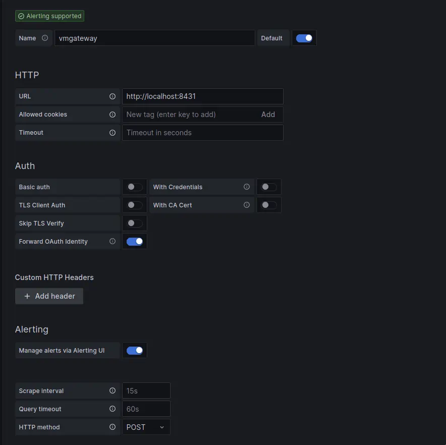

Now you can use Grafana to query metrics from the specified tenant.
Users with `vm_access` claim will be able to query metrics from the specified tenant.

## Test multi-tenant access

For the test purpose we will setup the following services as [docker-compose](https://docs.docker.com/compose/) manifest:
- Grafana
- Keycloak
- vmagent to generate test metrics
- VictoriaMetrics cluster
- vmgateway configured to work in cluster mode
- VictoriaMetrics single node
- vmgateway configured to work in single node mode

```yaml
version: '3'

services:
  keycloak:
    image: quay.io/keycloak/keycloak:21.0
    command:
      - start-dev
    ports:
      - 3001:8080
    environment:
      KEYCLOAK_ADMIN: admin
      KEYCLOAK_ADMIN_PASSWORD: change_me

  grafana:
    image: grafana/grafana-oss:9.4.3
    network_mode: host
    volumes:
      - ./grafana.ini:/etc/grafana/grafana.ini
      - grafana_data:/var/lib/grafana/

  vmsingle:
    image: victoriametrics/victoria-metrics:v1.91.0
    command:
      - -httpListenAddr=0.0.0.0:8429

  vmstorage:
    image: victoriametrics/vmstorage:v1.91.0-cluster

  vminsert:
    image: victoriametrics/vminsert:v1.91.0-cluster
    command:
      - -storageNode=vmstorage:8400
      - -httpListenAddr=0.0.0.0:8480

  vmselect:
    image: victoriametrics/vmselect:v1.91.0-cluster
    command:
      - -storageNode=vmstorage:8401
      - -httpListenAddr=0.0.0.0:8481

  vmagent:
    image: victoriametrics/vmagent:v1.91.0
    volumes:
      - ./scrape.yaml:/etc/vmagent/config.yaml
    command:
      - -promscrape.config=/etc/vmagent/config.yaml
      - -remoteWrite.url=http://vminsert:8480/insert/0/prometheus/api/v1/write
      - -remoteWrite.url=http://vmsingle:8429/api/v1/write

  vmgateway-cluster:
    image: victoriametrics/vmgateway:v1.91.0-enterprise
    ports:
      - 8431:8431
    command:
      - -eula
      - -enable.auth=true
      - -clusterMode=true
      - -write.url=http://vminsert:8480
      - -read.url=http://vmselect:8481
      - -httpListenAddr=0.0.0.0:8431
      - -auth.oidcDiscoveryEndpoints=http://keycloak:8080/realms/master/.well-known/openid-configuration

  vmgateway-single:
    image: victoriametrics/vmgateway:v1.91.0-enterprise
    ports:
      - 8432:8431
    command:
      - -eula
      - -enable.auth=true
      - -write.url=http://vmsingle:8429
      - -read.url=http://vmsingle:8429
      - -httpListenAddr=0.0.0.0:8431
      - -auth.oidcDiscoveryEndpoints=http://keycloak:8080/realms/master/.well-known/openid-configuration

volumes:
  grafana_data:
```

For the test purpose vmagent will be configured to scrape metrics from the following targets(`scrape.yaml` contents):

```yaml
scrape_configs:
  - job_name: stat
    metric_relabel_configs:
      - if: "{instance =~ 'vmgateway.*'}"
        action: replace
        target_label: team
        replacement: admin
      - if: "{instance =~ 'localhost.*'}"
        action: replace
        target_label: team
        replacement: dev
    static_configs:
      - targets:
          - localhost:8429
          - vmgateway-single:8431
          - vmgateway-cluster:8431
```

Relabeling rules will add the `team` label to the scraped metrics in order to test multi-tenant access.
Metrics from `localhost` will be labeled with `team=dev` and metrics from `vmgateway` will be labeled with `team=admin`.

vmagent will write data into VictoriaMetrics single-node and cluster(with tenant `0:0`).

Grafana datasources configuration will be the following:

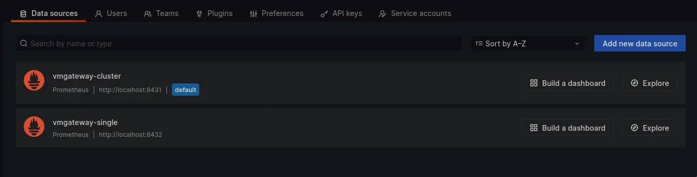

Let's login as user with `team=dev` labels limitation set via claims.

Using `vmgateway-cluster` results into `No data` response as proxied request will go to tenant `0:1`.
Since vmagent is only configured to write to `0:0` `No data` is an expected response.

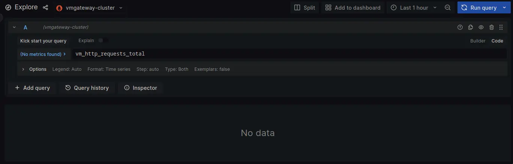

Switching to `vmgateway-single` does have data. Note that it is limited to metrics with `team=dev` label.

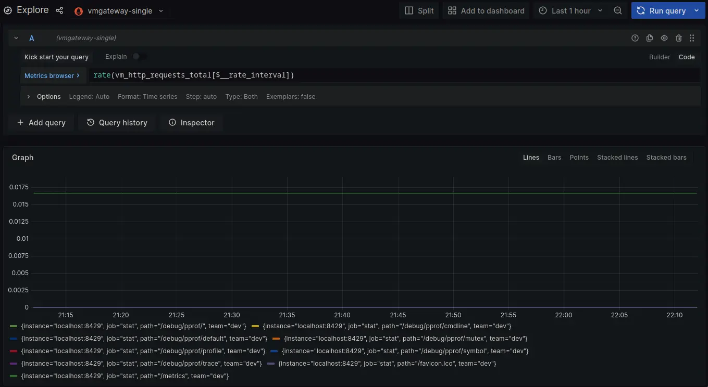

Now lets login as user with `team=admin`.

Both cluster and single node datasources now return metrics for `team=admin`.

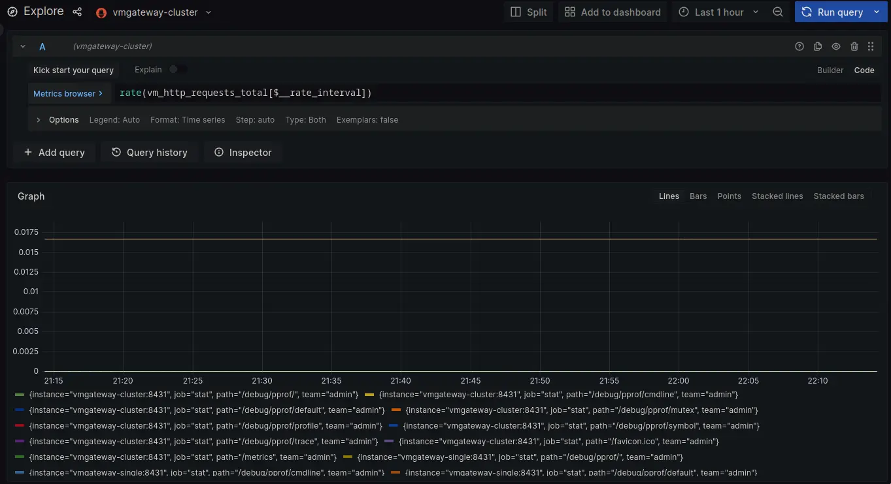
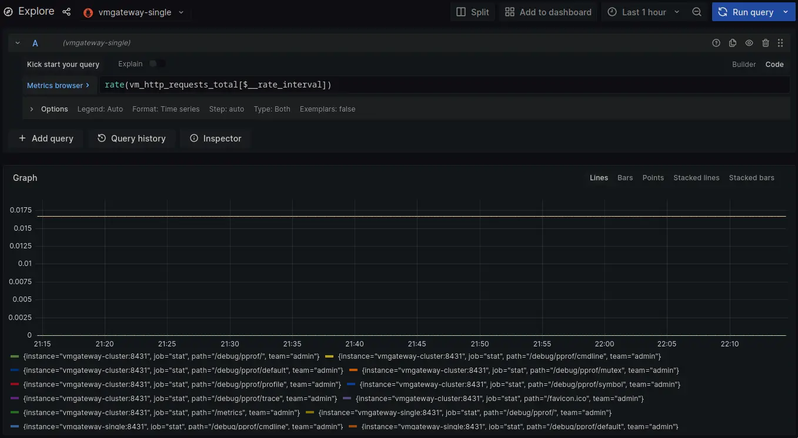
