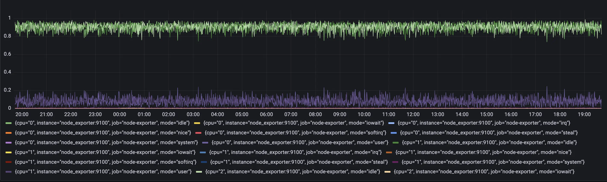
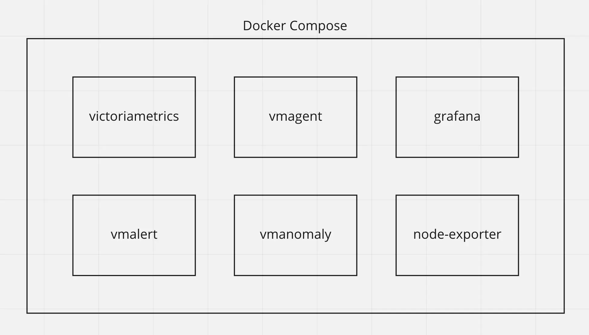
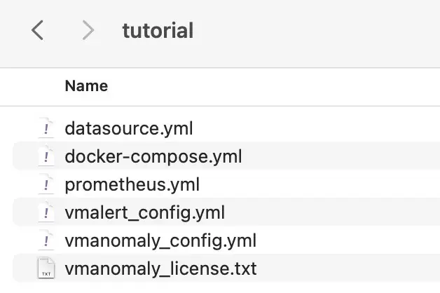
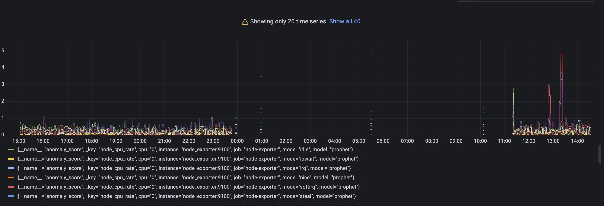
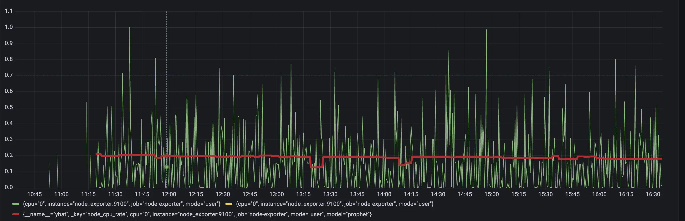
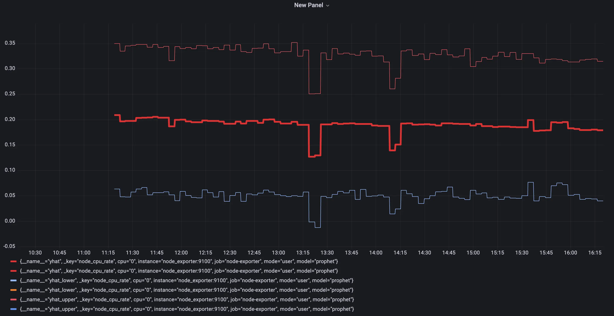
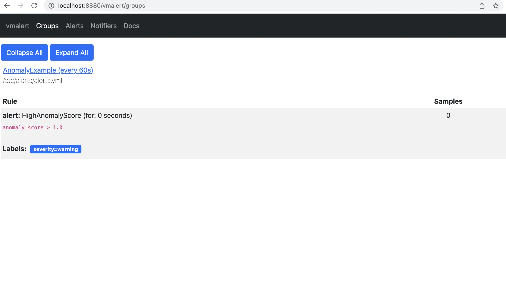
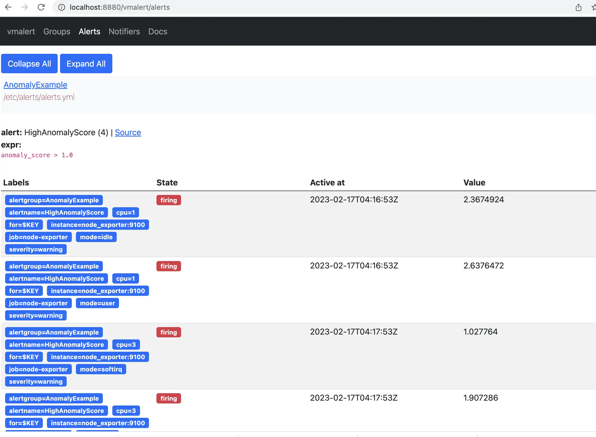

# Getting started with vmanomaly

**Prerequisites**
- *vmanomaly* is a part of enterprise package. You can get license key [here](https://victoriametrics.com/products/enterprise/trial) to try this tutorial.
- In the tutorial, we'll be using the following VictoriaMetrics components:
  -  [VictoriaMetrics](https://docs.victoriametrics.com/Single-server-VictoriaMetrics.html) (v.1.96.0)
  -  [vmalert](https://docs.victoriametrics.com/vmalert.html) (v.1.96.0)
  -  [vmagent](https://docs.victoriametrics.com/vmagent.html) (v.1.96.0)
  
  If you're unfamiliar with the listed components, please read [QuickStart](https://docs.victoriametrics.com/Quick-Start.html) first.
- It is assumed that you are familiar with [Grafana](https://grafana.com/)(v.10.2.1) and [Docker](https://docs.docker.com/get-docker/) and [Docker Compose](https://docs.docker.com/compose/).

## 1. What is vmanomaly?
*VictoriaMetrics Anomaly Detection* ([vmanomaly](https://docs.victoriametrics.com/vmanomaly.html)) is a service that continuously scans time series stored in VictoriaMetrics and detects unexpected changes within data patterns in real-time. It does so by utilizing user-configurable machine learning models.

All the service parameters are defined in a config file.

A single config file supports only one model. It is ok to run multiple vmanomaly processes, each using its own config.

**vmanomaly** does the following:
- periodically queries user-specified metrics
- computes an **anomaly score** for them
- pushes back the computed **anomaly score** to VictoriaMetrics.
### What is anomaly score?
**Anomaly score** is a calculated non-negative (in interval [0, +inf)) numeric value. It takes into account  how well data fit a predicted distribution, periodical  patterns, trends, seasonality, etc.

The value is designed to:
- *fall between 0 and 1* if model consider that datapoint is following usual pattern, 
 - *exceed 1* if the datapoint is abnormal.

Then, users can enable alerting rules based on the **anomaly score** with [vmalert](#what-is-vmalert).
## 2. What is vmalert?
[vmalert](https://docs.victoriametrics.com/vmalert.html) is an alerting tool for VictoriaMetrics. It executes a list of the given alerting or recording rules against configured `-datasource.url`.

[Alerting rules](https://docs.victoriametrics.com/vmalert.html#alerting-rules) allow you to define conditions that, when met, will notify the user. The alerting condition is defined in a form of a query expression via [MetricsQL query language](https://docs.victoriametrics.com/MetricsQL.html). For example, in our case, the expression `anomaly_score > 1.0` will notify a user when the calculated anomaly score exceeds a threshold of 1.
## 3. How does vmanomaly works with vmalert?
Compared to classical alerting rules, anomaly detection is more "hands-off" and data-aware. Instead of thinking of critical conditions to define, user can rely on catching anomalies that were not expected to happen. In other words, by setting up alerting rules, a user must know what to look for, ahead of time, while anomaly detection looks for any deviations from past behavior. 

Practical use case is to put anomaly score generated by vmanomaly into alerting rules with some threshold. 

**In this tutorial we are going to:**
  - Configure docker-compose file with all needed services ([VictoriaMetrics](https://docs.victoriametrics.com/Single-server-VictoriaMetrics.html), [vmalert](https://docs.victoriametrics.com/vmalert.html), [vmagent](https://docs.victoriametrics.com/vmagent.html), [Grafana](https://grafana.com/), [Node Exporter](https://prometheus.io/docs/guides/node-exporter/) and [vmanomaly](https://docs.victoriametrics.com/vmanomaly.html) ).
  - Explore configuration files for [vmanomaly](https://docs.victoriametrics.com/vmanomaly.html) and [vmalert](https://docs.victoriametrics.com/vmalert.html).
  - Run our own [VictoriaMetrics](https://docs.victoriametrics.com/Single-server-VictoriaMetrics.html) database with data scraped from [Node Exporter](https://prometheus.io/docs/guides/node-exporter/).
  - Explore data for analysis in [Grafana](https://grafana.com/).
  - Explore vmanomaly results.
  - Explore vmalert alerts
  
_____________________________

## 4. Data to analyze
Let's talk about data used for anomaly detection in this tutorial. 
We are going to collect our own CPU usage data with [Node Exporter](https://prometheus.io/docs/guides/node-exporter/)  into the VictoriaMetrics database.

On a Node Exporter's metrics page, part of the output looks like this:
```
# HELP node_cpu_seconds_total Seconds the CPUs spent in each mode.
# TYPE node_cpu_seconds_total counter
node_cpu_seconds_total{cpu="0",mode="idle"} 94965.14
node_cpu_seconds_total{cpu="0",mode="iowait"} 51.25
node_cpu_seconds_total{cpu="0",mode="irq"} 0
node_cpu_seconds_total{cpu="0",mode="nice"} 0
node_cpu_seconds_total{cpu="0",mode="softirq"} 1682.18
node_cpu_seconds_total{cpu="0",mode="steal"} 0
node_cpu_seconds_total{cpu="0",mode="system"} 995.37
node_cpu_seconds_total{cpu="0",mode="user"} 12378.05
node_cpu_seconds_total{cpu="1",mode="idle"} 94386.53
node_cpu_seconds_total{cpu="1",mode="iowait"} 51.22
...
```
Here, metric `node_cpu_seconds_total` tells us how many seconds each CPU spent in different modes: _user_, _system_, _iowait_, _idle_, _irq&softirq_, _guest_, or _steal_.
These modes are mutually exclusive. A high _iowait_ means that you are disk or network bound, high _user_ or _system_ means that you are CPU bound.

The metric `node_cpu_seconds_total` is a [counter](https://docs.victoriametrics.com/keyConcepts.html#counter) type of metric. If we'd like to see how much time CPU spent in each of the nodes, we need to calculate the per-second values change via [rate function](https://docs.victoriametrics.com/MetricsQL.html#rate): `rate(node_cpu_seconds_total)`.
Here is how this query may look like in Grafana:


This query result will generate 8 time series per each cpu, and we will use them as an input for our VM Anomaly Detection. vmanomaly will start learning configured model type separately for each of the time series.

______________________________

## 5. vmanomaly configuration and parameter description
**Parameter description**:
There are 4 required sections in config file:

`scheduler` - defines how often to run and make inferences, as well as what timerange to use to train the model. 

`model` - specific model parameters and configurations, 

`reader` - how to read data and where it is located

`writer` - where and how to write the generated output.

Let's look into parameters in each section:

* `scheduler` 

    * `infer_every` - how often trained models will make inferences on new data. Basically, how often to generate new datapoints for anomaly_score. Format examples: 30s, 4m, 2h, 1d. Time granularity ('s' - seconds, 'm' - minutes, 'h' - hours, 'd' - days). 
    You can look at this as how often a model will write its conclusions on newly added data. Here in example we are asking every 1 minute: based on the previous data, do these new datapoints look abnormal? 
  
    * `fit_every` - how often to retrain the models. The higher the frequency -- the fresher the model, but the more CPU it consumes. If omitted, the models will be retrained on each infer_every cycle. Format examples: 30s, 4m, 2h, 1d. Time granularity ('s' - seconds, 'm' - minutes, 'h' - hours, 'd' - days).

    * `fit_window` - what data interval to use for model training. Longer intervals capture longer historical behavior and detect seasonalities better, but is slower to adapt to permanent changes to metrics behavior. Recommended value is at least two full seasons. Format examples: 30s, 4m, 2h, 1d. Time granularity ('s' - seconds, 'm' - minutes, 'h' - hours, 'd' - days).
    Here is the previous 14 days of data to put into the model training. 

* `model`
    * `class` - what model to run. You can use your own model or choose from built-in models: Seasonal Trend Decomposition, Facebook Prophet, ZScore, Rolling Quantile, Holt-Winters, Isolation Forest and ARIMA.  Here we use Facebook Prophet (`model.prophet.ProphetModel`).
    
    * `args` - Model specific parameters, represented as YAML dictionary in a simple `key: value` form. For example, you can use parameters that are available in [FB Prophet](https://facebook.github.io/prophet/docs/quick_start.html).
    
* `reader`
  * `datasource_url` - Data source. An HTTP endpoint that serves `/api/v1/query_range`.
  * `queries`: - MetricsQL (extension of PromQL) expressions,  where you want to find anomalies.

  You can put several queries in a form:
  `<QUERY_ALIAS>: "QUERY"`. QUERY_ALIAS will be used as a `for` label in generated metrics and anomaly scores.

* `writer`
    * `datasource_url` - Output destination. An HTTP endpoint that serves `/api/v1/import`.

Here is an example of the config file `vmanomaly_config.yml`.

<div class="with-copy" markdown="1">

``` yaml
scheduler:
  infer_every: "1m"
  fit_every: "2h"
  fit_window: "14d"

model:
  class: "model.prophet.ProphetModel"
  args:
    interval_width: 0.98

reader:
  datasource_url: "http://victoriametrics:8428/"
  queries:
    node_cpu_rate: "rate(node_cpu_seconds_total)"

writer:
  datasource_url: "http://victoriametrics:8428/"

```

</div>

_____________________________________________
## 6. vmanomaly output
As the result of running vmanomaly, it produces the following metrics:
- `anomaly_score` - the main one. Ideally, if it is between 0.0 and 1.0 it is considered to be a non-anomalous value. If it is greater than 1.0, it is considered an anomaly (but you can reconfigure that in alerting config, of course), 
- `yhat` - predicted expected value, 
- `yhat_lower` - predicted lower boundary, 
- `yhat_upper` - predicted upper boundary, 
- `y` - initial query result value.

Here is an example of how output metric will be written into VictoriaMetrics:
`anomaly_score{for="node_cpu_rate", cpu="0", instance="node-xporter:9100", job="node-exporter", mode="idle"} 0.85`


____________________________________________

## 7. vmalert configuration
Here we provide an example of the config for vmalert `vmalert_config.yml`.

<div class="with-copy" markdown="1">

``` yaml
groups:
- name: AnomalyExample
  rules:
  - alert: HighAnomalyScore
    expr: 'anomaly_score > 1.0'
    labels:
      severity: warning
    annotations:
      summary: Anomaly Score exceeded 1.0. `rate(node_cpu_seconds_total)` is showing abnormal behavior. 
```

</div>

In the query expression we need to put a condition on the generated anomaly scores. Usually if the anomaly score is between 0.0 and 1.0, the analyzed value is not abnormal. The more anomaly score exceeded 1 the more our model is sure that value is an anomaly.
You can choose your threshold value that you consider reasonable based on the anomaly score metric, generated by vmanomaly. One of the best ways is to estimate it visually, by plotting the `anomaly_score` metric, along with predicted "expected" range of `yhat_lower` and `yhat_upper`. Later in this tutorial we will show an example
____________________________________________
## 8. Docker Compose configuration
Now we are going to configure the `docker-compose.yml` file to run all needed services.
Here are all services we are going to run:

<p align="center">
  
</p>

* victoriametrics - VictoriaMetrics Time Series Database
* vmagent - is an agent which helps you collect metrics from various sources, relabel and filter the collected metrics and store them in VictoriaMetrics or any other storage systems via Prometheus remote_write protocol.
* [grafana](https://grafana.com/) - visualization tool.
* node-exporter - Prometheus [Node Exporter](https://prometheus.io/docs/guides/node-exporter/) exposes a wide variety of hardware- and kernel-related metrics.
* vmalert - VictoriaMetrics Alerting service.
* vmanomaly - VictoriaMetrics Anomaly Detection service.

### Grafana setup
To enable VictoriaMetrics datasource as the default in Grafana we need to create a file `datasource.yml`

<div class="with-copy" markdown="1">

``` yaml
apiVersion: 1

datasources:
    - name: VictoriaMetrics
      type: prometheus
      access: proxy
      url: http://victoriametrics:8428
      isDefault: true

```

</div>

### Prometheus config
Let's create `prometheus.yml` file for `vmagent` configuration.

<div class="with-copy" markdown="1">

``` yaml
global:
  scrape_interval: 10s

scrape_configs:
  - job_name: 'vmagent'
    static_configs:
      - targets: ['vmagent:8429']
  - job_name: 'vmalert'
    static_configs:
      - targets: ['vmalert:8880']
  - job_name: 'victoriametrics'
    static_configs:
      - targets: ['victoriametrics:8428']
  - job_name: 'node-exporter'
    static_configs:
      - targets: ['node-exporter:9100']
  - job_name: 'vmanomaly'
    static_configs:
      - targets: [ 'vmanomaly:8500' ]
```

</div>

### vmanomaly licencing
We are going to use license stored locally in file `vmanomaly_licence.txt` with key in it.
You can explore other license options [here](https://docs.victoriametrics.com/vmanomaly.html#licensing)


### Docker-compose

Let's wrap it all up together into the `docker-compose.yml` file.

<div class="with-copy" markdown="1">

``` yaml
services:
  vmagent:
    container_name: vmagent
    image: victoriametrics/vmagent:latest
    depends_on:
      - "victoriametrics"
    ports:
      - 8429:8429
    volumes:
      - vmagentdata:/vmagentdata
      - ./prometheus.yml:/etc/prometheus/prometheus.yml
    command:
      - "--promscrape.config=/etc/prometheus/prometheus.yml"
      - "--remoteWrite.url=http://victoriametrics:8428/api/v1/write"
    networks:
      - vm_net
    restart: always
  
  victoriametrics:
    container_name: victoriametrics
    image: victoriametrics/victoria-metrics:v1.96.0
    ports:
      - 8428:8428
      - 8089:8089
      - 8089:8089/udp
      - 2003:2003
      - 2003:2003/udp
      - 4242:4242
    volumes:
      - vmdata:/storage
    command:
      - "--storageDataPath=/storage"
      - "--graphiteListenAddr=:2003"
      - "--opentsdbListenAddr=:4242"
      - "--httpListenAddr=:8428"
      - "--influxListenAddr=:8089"
      - "--vmalert.proxyURL=http://vmalert:8880"
    networks:
      - vm_net
    restart: always
  
  grafana:
    container_name: grafana
    image: grafana/grafana-oss:10.2.1
    depends_on:
      - "victoriametrics"
    ports:
      - 3000:3000
    volumes:
      - grafanadata:/var/lib/grafana
      - ./datasource.yml:/etc/grafana/provisioning/datasources/datasource.yml
    networks:
      - vm_net
    restart: always
      

  vmalert:
    container_name: vmalert
    image: victoriametrics/vmalert:latest
    depends_on:
      - "victoriametrics"
    ports:
      - 8880:8880
    volumes:
      - ./vmalert_config.yml:/etc/alerts/alerts.yml
    command:
      - "--datasource.url=http://victoriametrics:8428/"
      - "--remoteRead.url=http://victoriametrics:8428/"
      - "--remoteWrite.url=http://victoriametrics:8428/"
      - "--notifier.url=http://alertmanager:9093/"
      - "--rule=/etc/alerts/*.yml"
      # display source of alerts in grafana
      - "--external.url=http://127.0.0.1:3000" #grafana outside container
      # when copypaste the line be aware of '$$' for escaping in '$expr'
      - '--external.alert.source=explore?orgId=1&left=["now-1h","now","VictoriaMetrics",{"expr":{{$$expr|jsonEscape|queryEscape}} },{"mode":"Metrics"},{"ui":[true,true,true,"none"]}]'
    networks:
      - vm_net
    restart: always
  vmanomaly:
    container_name: vmanomaly
    image: us-docker.pkg.dev/victoriametrics-test/public/vmanomaly-trial:v1.7.2
    depends_on:
      - "victoriametrics"
    ports:
      - "8500:8500"
    networks:
      - vm_net
    restart: always
    volumes:
      - ./vmanomaly_config.yml:/config.yaml
      - ./vmanomaly_license.txt:/license.txt
    platform: "linux/amd64"
    command: 
      - "/config.yaml"
      - "--license-file=/license.txt"

  node-exporter:
    image: quay.io/prometheus/node-exporter:latest
    container_name: node-exporter
    ports:
      - 9100:9100
    pid: host
    restart: unless-stopped
    networks:
      - vm_net
    
volumes:
  vmagentdata: {}
  vmdata: {}
  grafanadata: {}
networks:
  vm_net:
```

</div>

Before running our docker-compose make sure that your directory contains all required files:

<p align="center">
  
</p>

This docker-compose file will pull docker images,  set up each service and run them all together with the command:

<div class="with-copy" markdown="1">

```
docker-compose up -d
```

</div>


To check if vmanomaly is up and running you can check docker logs:

<div class="with-copy" markdown="1">

```
docker logs vmanomaly
```

</div>


___________________________________________________________

## 9. Model results
To look at model results we need to go to grafana on the `localhost:3000`. Data
vmanomaly need some time to generate more data to visualize.
Let's investigate model output visualization in Grafana.
In the Grafana Explore tab enter queries:
* `anomaly_score` 
* `yhat`
* `yhat_lower`
* `yhat_upper`

Each of these metrics will contain same labels our query `rate(node_cpu_seconds_total)` returns.
### Anomaly scores for each metric with its according labels. 

Query: `anomaly_score`


<br>Check out if the anomaly score is high for datapoints you think are anomalies. If not, you can try other parameters in the config file or try other model type.

As you may notice a lot of data shows anomaly score greater than 1. It is expected as we just started to scrape and store data and there are not enough datapoints to train on. Just wait for some more time for gathering more data to see how well this particular model can find anomalies. In our configs we put 2 days of data required.
### Actual value from input query with predicted `yhat` metric. 
Query: `yhat`


<br>Here we are using one particular set of metrics for visualization. Check out the difference between model prediction and actual values. If values are very different from prediction, it can be considered as anomalous.

### Lower and upper boundaries that model predicted. 
Queries: `yhat_lower` and `yhat_upper`

Boundaries of 'normal' metric values according to model inference. 

### Alerting
On the page `http://localhost:8880/vmalert/groups` you can find our configured Alerting rule:



According to the rule configured for vmalert we will see Alert when anomaly score exceed 1. You will see an alert on Alert tab. `http://localhost:8880/vmalert/alerts`


## 10. Conclusion
Now we know how to set up Victoria Metric Anomaly Detection tool and use it together with vmalert. We also discovered core vmanomaly generated metrics and behaviour.
