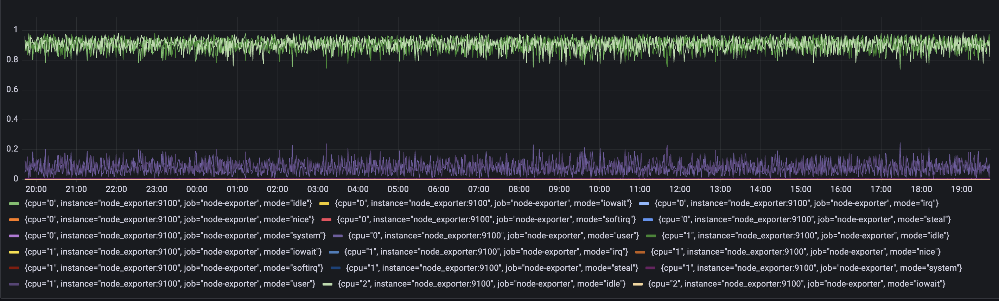
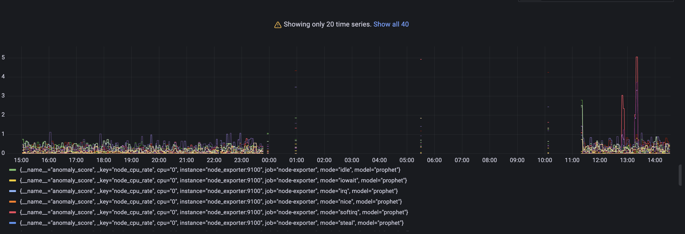
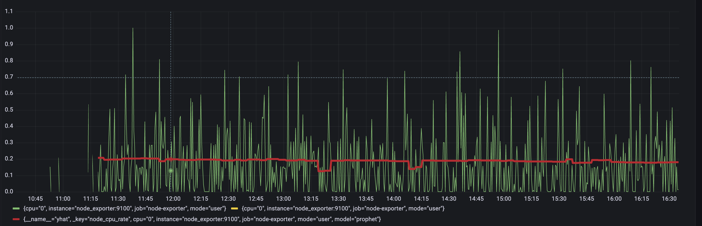
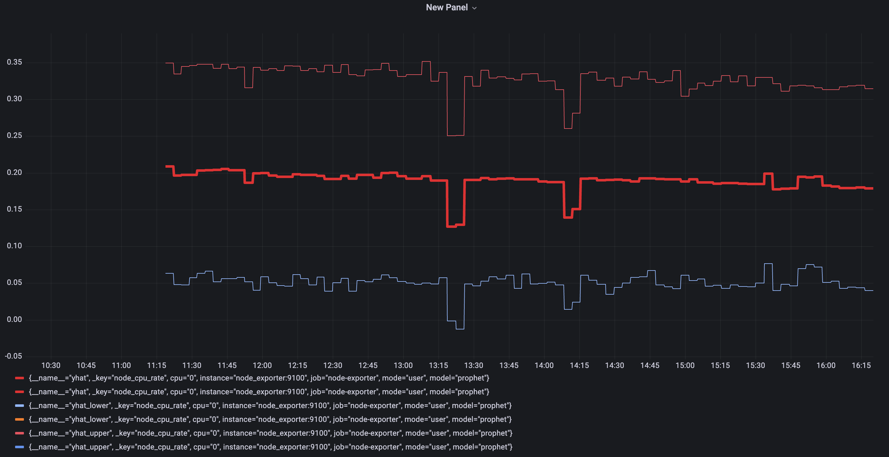

# VmAanomaly Quickstart

### Prerequisites
- In this tutorial it is assumed that you have VictoriaMetrics already running, and you are familiar with VictoriaMetrics ecosystem:
  -  [victoriametrics](https://docs.victoriametrics.com/Single-server-VictoriaMetrics.html)
  -  [VmAlert](https://docs.victoriametrics.com/vmalert.html)
  -  [vmagent](https://docs.victoriametrics.com/vmagent.html)
  
- It is assumed that you are familiar with Grafana and Docker
## What is VmAnomaly?
*VictoriaMetrics Anomaly Detection* is a service that continuously scans VictoriaMetrics time series and detects unexpected changes within data patterns in real-time. It does so by utilizing user-configurable machine learning models.

All the service parameters (model, schedule, input-output) are defined in a config file.

Single config file supports only one model, but it's totally OK to run multiple vmanomaly processes in parallel, each using its own config.

It periodically queries user-specified metrics, computes an **anomaly score** for them, based on how well they fit a predicted distribution, taking into account periodical data patterns with trends and/or seasonality, and pushes back the computed "anomaly score" to VictoriaMetrics. Then, users can enable alerting rules based on the "anomaly score" with VmAlert.


## What is VmAlert?
VMalert is an alerting tool for VictoriaMetrics. It executes a list of the given alerting or recording rules against configured `-datasource.url` compatible with Prometheus HTTP API.

Alerting rules allow you to define alert conditions based on Prometheus expression language expressions and to send notifications about firing alerts to an external service. Whenever the alert expression results in one or more vector elements at a given point in time, the alert counts as active for these elements' label sets.

## How does VmAnomaly works with VmAlert?
Compared to classical alerting rules, anomaly detection is more "hands-off" i.e. it allows users to avoid setting up manual alerting rules set up and catching anomalies that were not expected to happen. In other words, by setting up alerting rules, a user must know what to look for, ahead of time, while anomaly detection looks for any deviations from past behavior. In addition to that, setting up alerting rules manually has been proven to be tedious and error-prone, while anomaly detection can be easier to set up, and use the same model for different metrics.

Practical use case is to put anomaly score generated by VmAnomaly into alerting rules with some threshold. Anomaly score is designed to fall between 0 and 1 if model consider that datapoint is following usual pattern, and if it exceeded 1 the datapoint is abnormal.


### In this tutorial we are going to:
  - Configure docker-compose file with all needed services (VictoriaMetrics, VmAlert, VmAgent, Grafana, VmAnomaly, NodeExporter, and VmAnomaly).
  - Explore configuration files for VmAnomaly and VmAlert.
  - Run our own VictoriaMetrics database with data loaded from NodeExporter.
  - Explore data for analysis in Grafana.
  - Explore VmAnomaly dashboard and results.

 


_____________________________

## Data to analyze
Let's talk about data used for anomaly detection in this tutorial. 
We are going to send our own CPU usage data with node-exporter into the VictoriaMertics database.
On a Node exporters' metrics page, part of the output is:
```
# HELP node_cpu_seconds_total Seconds the CPUs spent in each mode.
# TYPE node_cpu_seconds_total counter
node_cpu_seconds_total{cpu="0",mode="idle"} 94965.14
node_cpu_seconds_total{cpu="0",mode="iowait"} 51.25
node_cpu_seconds_total{cpu="0",mode="irq"} 0
node_cpu_seconds_total{cpu="0",mode="nice"} 0
node_cpu_seconds_total{cpu="0",mode="softirq"} 1682.18
node_cpu_seconds_total{cpu="0",mode="steal"} 0
node_cpu_seconds_total{cpu="0",mode="system"} 995.37
node_cpu_seconds_total{cpu="0",mode="user"} 12378.05
node_cpu_seconds_total{cpu="1",mode="idle"} 94386.53
node_cpu_seconds_total{cpu="1",mode="iowait"} 51.22
node_cpu_seconds_total{cpu="1",mode="irq"} 0
node_cpu_seconds_total{cpu="1",mode="nice"} 0
node_cpu_seconds_total{cpu="1",mode="softirq"} 39.18
node_cpu_seconds_total{cpu="1",mode="steal"} 0
node_cpu_seconds_total{cpu="1",mode="system"} 1378.79
node_cpu_seconds_total{cpu="1",mode="user"} 14241.59
node_cpu_seconds_total{cpu="2",mode="idle"} 93929.1
node_cpu_seconds_total{cpu="2",mode="iowait"} 50.93
node_cpu_seconds_total{cpu="2",mode="irq"} 0
node_cpu_seconds_total{cpu="2",mode="nice"} 0
node_cpu_seconds_total{cpu="2",mode="softirq"} 30.41
node_cpu_seconds_total{cpu="2",mode="steal"} 0
node_cpu_seconds_total{cpu="2",mode="system"} 1368.52
node_cpu_seconds_total{cpu="2",mode="user"} 14722.17
node_cpu_seconds_total{cpu="3",mode="idle"} 93554.49
```
Here, `node_cpu_seconds_total` metric tells us how many seconds each CPU spent doing each type of work: _user_, _system_, _iowait_, _idle_, _irq&softirq_, _guest_, or _steal_.
These modes are mutually exclusive. A high _iowait_ means that you are disk or network bound, high user or system means that you are CPU bound.

These are all counters, so to calculate the per-second values we use the rate function: `rate(node_cpu_seconds_total)`.
Here is how this query may look like in Grafana:


This query result will generate 8 data vectors per each cpu, and we will use them as an input for our VM Anomaly Detection. VmAnomaly will start learning configured model type separately for each of the data vectors.


______________________________

## VmAnomaly configuration and parameter description
Here is an example of the config file `vmanomaly_config.yml`.
```
scheduler:
  infer_every: "30s"
  fit_window: "2d"

model:
  class: "model.prophet.ProphetModel"
  interval_width: 0.8

reader:
  datasource_url: "http://victoriametrics:8428/"
  queries:
    node_cpu_rate: "rate(node_cpu_seconds_total)"

writer:
  datasource_url: "http://victoriametrics:8428/"
  
```
**Parameter description**:
There are 4 main sections in config file:

`scheduler` - defines how often to run and make inferences, as well as what timerange to use to train the model. 

`model` - specific model parameters and configurations, 

`reader` - where and how to read data from,

`writer` - where and how to write the generated output.

Let's look into parameters in each section:

* `scheduler` 
    As we need to set an alert for it, we will use periodic "scheduler.periodic.PeriodicScheduler".
    
    * `fit_window` -  time frame of metric previously gathered, that you want to use for model training. 
    
    Here it is the previous 2 days of data to put into the model training. You can choose other time granularity ('s' - seconds, 'm' - minutes, 'h' - hours, 'd' - days). Examples: 30s, 4m, 2h, 1d.
    * `infer_every`- how often trained models will make inferences on new data. 
    
    You can look at this as how often a model will write its conclusions on newly added data. Here in example we are asking every 30 seconds: based on the previous data, do these new datapoints look abnormal? You can choose other time granularity ('s' - seconds, 'm' - minutes, 'h' - hours, 'd' - days). Examples: 30s, 4m, 2h, 1d.

* `model`
    * `class` - what model to run. You can use your own model or choose from built-in models: Seasonal Trend Decomposition, Facebook Prophet, ZScore, Rolling Quantile, Holt-Winters and ARIMA.
    
    Here we use Facebook Prophet with default parameters (`model.prophet.ProphetModel`). You can put parameters that are available in their [docs](https://facebook.github.io/prophet/docs/quick_start.html).
    
    Possible values: `anomaly_score`, `yhat`, `yhat_lower`, `yhat_upper`, `y`. You can choose all or some of them.

* `reader`
  * `datasource_url` - Data source. An HTTP endpoint that serves `/api/v1/query_range`.
  * `queries`: - MetricsQL (extension of PromQL) expressions,  where you want to find anomalies.

  You can put several queries in a form:
  `<QUERY_ALIAS>: "QUERY"`. QUERY_ALIAS will be used as a `_key` label in generated metrics and anomaly scores.

* `writer`
    * `datasource_url` - Output destination. An HTTP endpoint that serves `/api/v1/import`.

_____________________________________________
## VmAnomaly output
As the result of running VmAnomaly, it produces the following metrics:
- `anomaly_score` - the main one. Ideally, if it is between 0.0 and 1.0 it is considered to be a non-anomalous value. If it is greater than 1.0, it is considered an anomaly (but you can reconfigure that in alerting config, of course), 
- `yhat` - predicted expected value, 
- `yhat_lower` - predicted lower boundary, 
- `yhat_upper` - predicted upper boundary, 
- `y` - initial query result value.

Here is an example of how output metric will be written into VictoriaMetrics:
`anomaly_score{for="node_cpu_rate", cpu="0", instance="node_exporter:9100", job="node-exporter", mode="idle"}`

____________________________________________

## VmAlert congiguration
Here we provide an example of the config for VmAlert `vmalert_config.yml`.
```
groups:
- name: AnomalyExample
  rules:
  - alert: HighAnomalyScore
    expr: 'anomaly_score{for="node_cpu_rate", model="prophet"} > 1.0'
    labels:
      severity: warning
    annotations:
      summary: Anomaly Score exceeded 1.0. `rate(node_cpu_seconds_total)` is showing abnormal behavior. 
```

In the query expression we need to put a condition on the generated anomaly scores. Usually if the anomaly score is between 0.0 and 1.0, the analyzed value is not abnormal. The more anomaly score exceeded 1 the more our model is sure that value is an anomaly.
You can choose your threshold value that you consider reasonable based on the anomaly score metric, generated by VmAnomaly. One of the best ways is to estimate it visually, by plotting the `anomaly_score` metric, along with predicted "expected" range of `yhat_lower` and `yhat_upper`..
____________________________________________
## Docker Compose configuration
Now we are going to configure the `docker-compose.yml` file to run all needed services.
Here are all services we are going to run:


* VictoriaMetrics - VictoriaMetrics Time Series Database
* VmAgent - is an agent which helps you collect metrics from various sources, relabel and filter the collected metrics and store them in VictoriaMetrics or any other storage systems via Prometheus remote_write protocol.
* Grafana - visualization tool.
* Node exporter - Prometheus [Node Exporter](https://prometheus.io/docs/guides/node-exporter/) exposes a wide variety of hardware- and kernel-related metrics.
* VmAlert - VictoriaMetrics Alerting service.
* VmAnomaly - VictoriaMetrics Anomaly Detection service.


**Docker-compose**
```
services:
  vmagent:
    container_name: vmagent
    image: victoriametrics/vmagent:latest
    depends_on:
      - "victoriametrics"
    ports:
      - 8429:8429
    volumes:
      - vmagentdata:/vmagentdata
      - ./prometheus.yml:/etc/prometheus/prometheus.yml
    command:
      - "--promscrape.config=/etc/prometheus/prometheus.yml"
      - "--remoteWrite.url=http://victoriametrics:8428/api/v1/write"
    networks:
      - vm_net
    restart: always
  
  victoriametrics:
    container_name: victoriametrics
    image: victoriametrics/victoria-metrics:v1.83.1
    ports:
      - 8428:8428
      - 8089:8089
      - 8089:8089/udp
      - 2003:2003
      - 2003:2003/udp
      - 4242:4242
    volumes:
      - vmdata:/storage
    command:
      - "--storageDataPath=/storage"
      - "--graphiteListenAddr=:2003"
      - "--opentsdbListenAddr=:4242"
      - "--httpListenAddr=:8428"
      - "--influxListenAddr=:8089"
      - "--vmalert.proxyURL=http://vmalert:8880"
    networks:
      - vm_net
    restart: always
  
  grafana:
    container_name: grafana
    image: grafana/grafana-oss:9.3.1
    depends_on:
      - "victoriametrics"
    ports:
      - 3000:3000
    volumes:
      - grafanadata:/var/lib/grafana
    networks:
      - vm_net
    restart: always

  vmalert:
    container_name: vmalert
    image: victoriametrics/vmalert:latest
    depends_on:
      - "victoriametrics"
    ports:
      - 8880:8880
    volumes:
      - ./vmalert_config.yml:/etc/alerts/alerts.yml
    command:
      - "--datasource.url=http://victoriametrics:8428/"
      - "--remoteRead.url=http://victoriametrics:8428/"
      - "--remoteWrite.url=http://victoriametrics:8428/"
      - "--notifier.url=http://alertmanager:9093/"
      - "--rule=/etc/alerts/*.yml"
      # display source of alerts in grafana
      - "--external.url=http://127.0.0.1:3000" #grafana outside container
      # when copypaste the line be aware of '$$' for escaping in '$expr'
      - '--external.alert.source=explore?orgId=1&left=["now-1h","now","VictoriaMetrics",{"expr":{{$$expr|jsonEscape|queryEscape}} },{"mode":"Metrics"},{"ui":[true,true,true,"none"]}]'
    networks:
      - vm_net
    restart: always
  vmanomaly:
    container_name: vmanomaly_1
    image: us-docker.pkg.dev/victoriametrics-test/public/vmanomaly-trial:v1.0.0-beta
    depends_on:
      - "victoriametrics"
    ports:
      - "8500:8500"
    networks:
      - vm_net
    restart: always
    volumes:
      - ./vmanomaly_config.yml:/config.yaml
    command: [ "/config.yaml" ]

  node_exporter:
    image: quay.io/prometheus/node-exporter:latest
    container_name: node_exporter
    ports:
      - 9100:9100
    pid: host
    restart: unless-stopped
    networks:
      - vm_net
    
volumes:
  vmagentdata: {}
  vmdata: {}
  grafanadata: {}
networks:
  vm_net:
```

This file will pull docker images,  set up each service and run them all together with the comand:
```
docker-compose up -d
```
_________________________________________________________________

## Model Results
VmAnomaly need some time to generate more data to visualize.
Les't investigate model output visualization in Grafana.
### Anomaly scores for each metric with its according labels. 



<br>Check out if the anomaly score is high for datapoints you think are anomalies. If not, you can try other parameters in the config file or try other model type.
### Actual value from input query with predicted `yhat` metric. 




<br>Here we are using one particular set of metrics for visualization. Check out the difference between model prediction and actual values. If values are very different from prediction, it can be considered as anomalous.
### Lower and upper boundaries that model predicted. 

Boundaries of 'normal' metric values according to model inference. 

### Alerting
According to the rule configured for VmAlert we will see Alert when anomaly score exceed 1.
