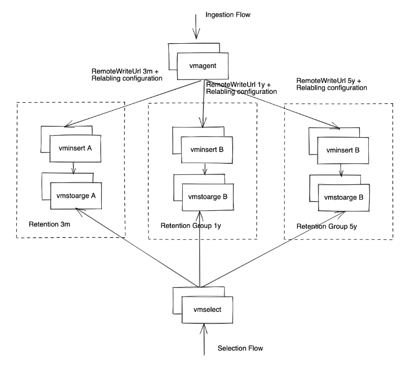

# Multi Retention Setup within VictoriaMetrics Cluster

**Objective**

Setup Victoria Metrics Cluster with support of multiple retention periods within one installation.

**Challenge**

If you use [VictoriaMetrics enterprise](https://docs.victoriametrics.com/enterprise.html), then you can use
[retention filters](https://docs.victoriametrics.com/Cluster-VictoriaMetrics.html#retention-filters) for applying multiple retentions
to distinct sets of time series and/or [tenants](https://docs.victoriametrics.com/Cluster-VictoriaMetrics.html#multitenancy).

Community version of VictoriaMetrics supports only one retention period via [-retentionPeriod](https://docs.victoriametrics.com/#retention) command-line flag.
The following solution allows supporting multiple retentions for community version of VictoriaMetrics.

**Enterprise Solution**

Enterprise version of VictoriaMetrics Single and Cluster support multi-retention from version [1.83.0](https://github.com/VictoriaMetrics/VictoriaMetrics/releases/tag/v1.83.0) via `-retentionFilters` command-line flag. For example:

* VictoriaMetrics Single - `-retentionFilter='{env=~"dev|staging"}:30d' -retentionPeriod=1y`
* VictoriaMetrics Cluster - `-retentionFilter='{vm_account_id=~"42.*"}:1d' -retentionFilter='{env=~"dev|staging"}:3d' -retentionPeriod=4w`. Labels `vm_account_id` and `vm_project_id` can be used to specify tenant and project respectively.

Multi-retention is explained in more detail in corresponding docs for [single-node](https://docs.victoriametrics.com/Single-server-VictoriaMetrics.html#multiple-retentions) and [cluster](https://docs.victoriametrics.com/Cluster-VictoriaMetrics.html#retention-filters) versions.

**Open Source Solution**

A multi-retention setup can be implemented by dividing a [victoriametrics cluster](https://docs.victoriametrics.com/Cluster-VictoriaMetrics.html) into logical groups with different retentions.

Example:
Setup should handle 3 different retention groups 3months, 1year and 3 years.
Solution contains 3 groups of vmstorages + vminserst and one group of vmselects. Routing is done by [vmagent](https://docs.victoriametrics.com/vmagent.html) and [relabeling configuration](https://docs.victoriametrics.com/vmagent.html#relabeling). The [-retentionPeriod](https://docs.victoriametrics.com/#retention) sets how long to keep the metrics. 

The diagram below shows a proposed solution

  

**Implementation Details**
  1. Groups of vminserts A know about only vmstorages A and this is explicitly specified via `-storageNode` [configuration](https://docs.victoriametrics.com/Cluster-VictoriaMetrics.html#cluster-setup). 
  2. Groups of vminserts B know about only vmstorages B and this is explicitly specified via `-storageNode` [configuration](https://docs.victoriametrics.com/Cluster-VictoriaMetrics.html#cluster-setup). 
  3. Groups of vminserts C know about only vmstorages A and this is explicitly specified via `-storageNode` [configuration](https://docs.victoriametrics.com/Cluster-VictoriaMetrics.html#cluster-setup). 
  4. Vmselect reads data from all vmstorage nodes via `-storageNode` [configuration](https://docs.victoriametrics.com/Cluster-VictoriaMetrics.html#cluster-setup). 
  5. Vmagent routes incoming metrics to the given set of `vminsert` nodes using relabeling rules specified at `-remoteWrite.urlRelabelConfig` [configuration](https://docs.victoriametrics.com/vmagent.html#relabeling).

**Multi-Tenant Setup**

Every group of vmstorages can handle one tenant or multiple one. Different groups can have overlapping tenants. As vmselect reads from all vmstorage nodes, the data is aggregated on its level.

**Additional Enhancements**

You can set up [vmauth](https://docs.victoriametrics.com/vmauth.html) for routing data to the given vminsert group depending on the needed retention.
