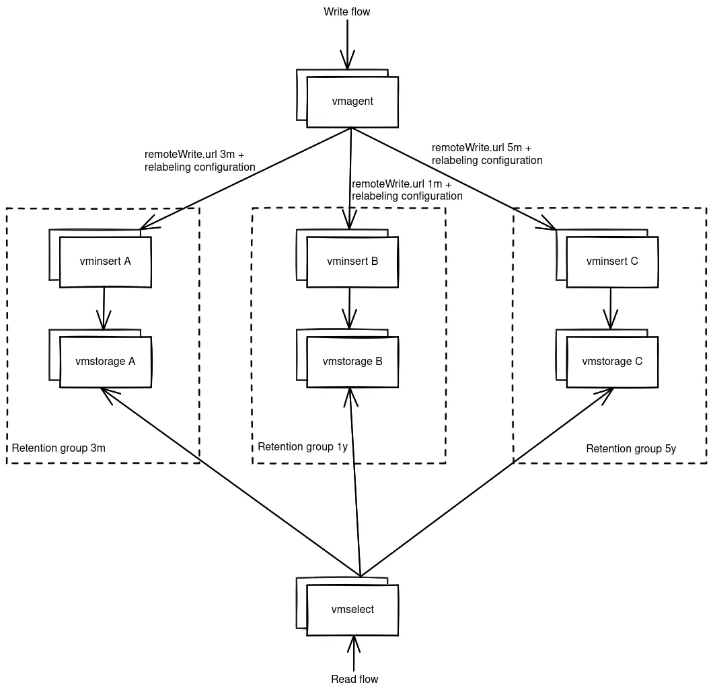

---
build:
  list: never
  publishResources: false
  render: never
sitemap:
  disable: true
---
**Objective**

Setup Victoria Metrics Cluster with support of multiple retention periods within one installation.

**Enterprise Solution**

[VictoriaMetrics Enterprise](https://docs.victoriametrics.com/victoriametrics/enterprise/) supports specifying multiple retentions
for distinct sets of time series and [tenants](https://docs.victoriametrics.com/victoriametrics/cluster-victoriametrics/#multitenancy)
via [retention filters](https://docs.victoriametrics.com/victoriametrics/cluster-victoriametrics/#retention-filters).

**Open Source Solution**

Community version of VictoriaMetrics supports only one retention period per `vmstorage` node via [-retentionPeriod](https://docs.victoriametrics.com/victoriametrics/single-server-victoriametrics/#retention) command-line flag.

A multi-retention setup can be implemented by dividing a [victoriametrics cluster](https://docs.victoriametrics.com/victoriametrics/cluster-victoriametrics/) into logical groups with different retentions.

Example:
Setup should handle 3 different retention groups 3months, 1year and 3 years.
Solution contains 3 groups of vmstorages + vminserts and one group of vmselects. Routing is done by [vmagent](https://docs.victoriametrics.com/victoriametrics/vmagent/)
by [splitting data streams](https://docs.victoriametrics.com/victoriametrics/vmagent/#splitting-data-streams-among-multiple-systems). 
The [-retentionPeriod](https://docs.victoriametrics.com/victoriametrics/single-server-victoriametrics/#retention) sets how long to keep the metrics.

The diagram below shows a proposed solution

**Implementation Details**

1. Groups of vminserts A know about only vmstorages A and this is explicitly specified via `-storageNode` [configuration](https://docs.victoriametrics.com/victoriametrics/cluster-victoriametrics/#cluster-setup). 
1. Groups of vminserts B know about only vmstorages B and this is explicitly specified via `-storageNode` [configuration](https://docs.victoriametrics.com/victoriametrics/cluster-victoriametrics/#cluster-setup). 
1. Groups of vminserts C know about only vmstorages C and this is explicitly specified via `-storageNode` [configuration](https://docs.victoriametrics.com/victoriametrics/cluster-victoriametrics/#cluster-setup). 
1. vmselect reads data from all vmstorage nodes via `-storageNode` [configuration](https://docs.victoriametrics.com/victoriametrics/cluster-victoriametrics/#cluster-setup) 
   with [deduplication](https://docs.victoriametrics.com/victoriametrics/cluster-victoriametrics/#deduplication) setting equal to vmagent's scrape interval or minimum interval between collected samples. 
1. vmagent routes incoming metrics to the given set of `vminsert` nodes using relabeling rules specified at `-remoteWrite.urlRelabelConfig` [configuration](https://docs.victoriametrics.com/victoriametrics/relabeling/).

**Multi-Tenant Setup**

Every group of vmstorages can handle one tenant or multiple one. Different groups can have overlapping tenants. As vmselect reads from all vmstorage nodes, the data is aggregated on its level.

**Additional Enhancements**

You can set up [vmauth](https://docs.victoriametrics.com/victoriametrics/vmauth/) for routing data to the given vminsert group depending on the needed retention.
