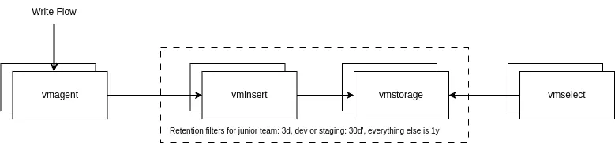

---
build:
  list: never
  publishResources: false
  render: never
sitemap:
  disable: true
---
**Objective**

Setup a VictoriaMetrics Cluster with support of multiple retention periods within one installation.

**Enterprise Solution**

[VictoriaMetrics Enterprise](/victoriametrics/enterprise/) supports multiple retention periods natively on both the [cluster](/victoriametrics/cluster-victoriametrics/#retention-filters) and the [single node](/victoriametrics/single-server-victoriametrics/#multiple-retentions) versions.
You can filter which metrics a retention filter applies to. Below you can see 3 retention filters. The first one matches any metrics with the `juniors` label and will be kept for 3 days. The second filter says anything with `dev` or `staging` should be kept for 30 days. And finally, the last filter is the default filter of 1 year.
```bash
-retentionFilter='{team="juniors"}:3d' -retentionFilter='{env=~"dev|staging"}:30d' -retentionPeriod=1y
```

When using the cluster version, it is also possible to set retention filters by tenant ID. Below is a retention filter that will keep metrics from tenant 5 for 5 days, keep tenant 10's for 1 month, and keep everyone else's for 1 year. This can be combined with labels to get even finer control.
```bash
-retentionFilter='{vm_account_id="5"}:5d,{vm_account_id="10"}:1m' -retentionPeriod=1y
```



**Open Source Solution**

Community version of VictoriaMetrics supports only one retention period per `vmstorage` node via [-retentionPeriod](/victoriametrics/single-server-victoriametrics/#retention) command-line flag.

A multi-retention setup can be implemented by dividing a [victoriametrics cluster](/victoriametrics/cluster-victoriametrics/) into logical groups with different retentions.

Example:
Setup should handle 3 different retention groups 3months, 1year and 3 years.
Solution contains 3 groups of vmstorages + vminserts and one group of vmselects. Routing is done by [vmagent](/victoriametrics/vmagent/)
by [splitting data streams](/victoriametrics/vmagent/#splitting-data-streams-among-multiple-systems). 
The [-retentionPeriod](/victoriametrics/single-server-victoriametrics/#retention) sets how long to keep the metrics.

The diagram below shows a proposed solution.


**Implementation Details**

1. Groups of vminserts A know about only vmstorages A, and this is explicitly specified via `-storageNode` [configuration](/victoriametrics/cluster-victoriametrics/#cluster-setup). 
1. Groups of vminserts B know about only vmstorages B, and this is explicitly specified via `-storageNode` [configuration](/victoriametrics/cluster-victoriametrics/#cluster-setup). 
1. Groups of vminserts C know about only vmstorages C, and this is explicitly specified via `-storageNode` [configuration](/victoriametrics/cluster-victoriametrics/#cluster-setup). 
1. vmselect reads data from all vmstorage nodes via `-storageNode` [configuration](/victoriametrics/cluster-victoriametrics/#cluster-setup) 
   with [deduplication](/victoriametrics/cluster-victoriametrics/#deduplication) setting equal to vmagent's scrape interval or minimum interval between collected samples. 
1. vmagent routes incoming metrics to the given set of `vminsert` nodes using relabeling rules specified at `-remoteWrite.urlRelabelConfig` [configuration](/victoriametrics/relabeling/).

**Multi-Tenant Setup**

Every group of vmstorages can handle one tenant or multiple one. Different groups can have overlapping tenants. As vmselect reads from all vmstorage nodes, the data is aggregated on its level.

**Additional Enhancements**

You can set up [vmauth](/victoriametrics/vmauth/) for routing data to the given vminsert group depending on the needed retention.

**Downsides Of This Approach**

This approach requires running multiple VictoriaMetrics instances, each storing their own separate index. With Enterprise, you only run one VictoriaMetrics instance, so you're only storing the index once, reducing storage space.
The index can be quite large on systems where they have time series that change frequently. In some cases, the index size can be larger than the space you're saving with separate retention periods. See [What is high churn rate](/victoriametrics/faq/#what-is-high-churn-rate)

Configuration complexity is also a concern; each retention period would have its own storage nodes and unique configurations. Adding a new retention policy requires:

1. Deploy a new set of vmstorage and VMInsert nodes with the desired retention period
2. Configure vmagent to route metrics to the new cluster based on relabeling rules
3. Update vmselect to include the new vmstorage nodes in its configuration
4. Restart vmselect to apply the changes

During the restart, queries may experience brief disruptions or return incomplete results.

Networking is also more complex; each retention period has its own write path, increasing network complexity.
