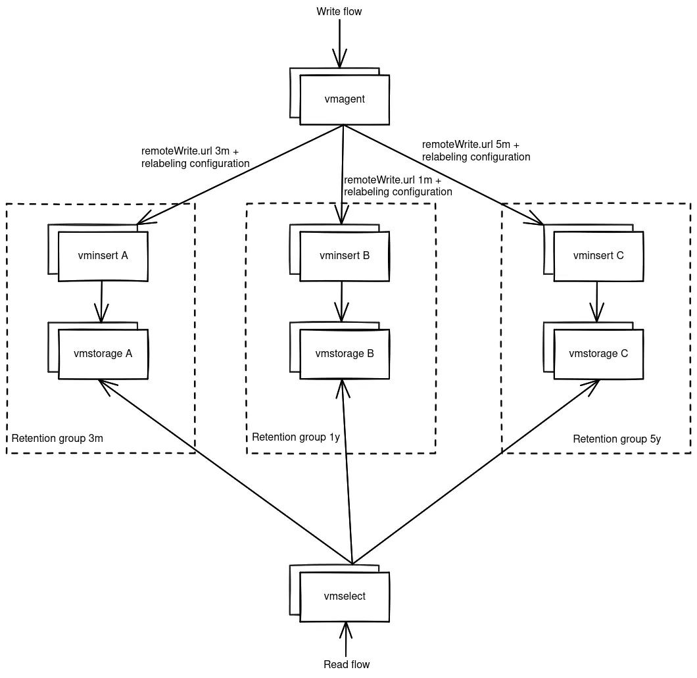

---
build:
  list: never
  publishResources: false
  render: never
sitemap:
  disable: true
---

[VictoriaMetrics Enterprise](https://docs.victoriametrics.com/victoriametrics/enterprise/) supports specifying multiple retentions for distinct sets of time series and tenants. If you are an Enterprise user, [configure multiple retentions directly through retention filters](https://docs.victoriametrics.com/victoriametrics/cluster-victoriametrics/#retention-filters) instead of following this guide.

This guide explains how to set up multiple retentions using an **open-source VictoriaMetrics Cluster**.

## Overview

VictoriaMetrics retains by default 1-month worth of metrics. You can change data retention with the [`-retentionPeriod` command-line flag](https://docs.victoriametrics.com/victoriametrics/single-server-victoriametrics/#retention), but this value applies to all time series stored on a given `vmstorage` node and cannot be customized per tenant or per metric in the open source version. 

## Multi-Retention Architecture

To obtain multiple retentions with the open source VictoriaMetrics Cluster, you can split the cluster into several logical groups of `vmstorage` nodes, where each group is configured with a different `-retentionPeriod` and receives only the data that must follow that retention. Each storage group is connected to a separate `vminsert`, while a shared `vmselect` layer queries across all storage groups so that dashboards and alerts continue to see a single logical VictoriaMetrics backend.



In the example used throughout this guide, the cluster is divided into three groups: 
- Group A: 3-month retention.
- Group B: 1-year retention.
- Group C: 3-year retention. 

Metrics are routed to the appropiate `vminsert` group by [splitting data streams](https://docs.victoriametrics.com/victoriametrics/vmagent/#splitting-data-streams-among-multiple-systems) with `vmagent`. An optional [vmauth](https://docs.victoriametrics.com/victoriametrics/vmauth/) rules can be added on top to enforce per-tenant routing or API access policies.

## Implementing Multi-Retention on Kubernetes

In this section, we'll install and configure the components for the VictoriaMetrics cluster. See [Kubernetes monitoring with VictoriaMetrics Cluster](https://docs.victoriametrics.com/guides/k8s-monitoring-via-vm-cluster/) for prerequisites and more details.

Run the following command to add the VictoriaMetrics Helm repository:

```shell
helm repo add vm https://victoriametrics.github.io/helm-charts/
helm repo update
```

### Step 1: Deploying storage groups

We'll create three retention groups, groups, each has a different retention period and disk size. Read [Understand Your Setup Size](https://docs.victoriametrics.com/guides/understand-your-setup-size/) to estimate how much space you will need for each retention.

| Group       | Retention Period | Disk Size |
|-------------|------------------|-----------|
| `vmcluster-a` | 3 months (`3M`)    | 80GB      |
| `vmcluster-b` | 1 year (`1Y`)      | 300 GB    |
| `vmcluster-c` | 3 years (`3Y`)     | 900 GB    |

Create a Helm values file for Group A. This creates two `vminsert` and `vmstorage` pods:

```shell
cat <<EOF > vmcluster-a.yaml
vmstorage:
  enabled: true
  persistence:
    size: 80Gi
  extraArgs:
    retentionPeriod: 3M
    storageDataPath: /vmstorage-data
    dedup.minScrapeInterval: 30s
  podLabels:
    retention-group: a
    retention-period: 3M

vminsert:
  enabled: true
  podLabels:
    retention-group: a

vmselect:
  enabled: false
EOF
```

The values file creates a `vminsert` and `vmstorage` services while disabling `vmselect`, as we'll deploy it separately. It also defines a 30-second [deduplication](https://docs.victoriametrics.com/victoriametrics/cluster-victoriametrics/#deduplication) window to handle possible duplicate metrics. The deduplication window must match the `vmagent` service scrape window (which we'll define it later in the guide).

Create the values files for Group B and Group C:

```shell
cat <<EOF > vmcluster-b.yaml
vmstorage:
  enabled: true
  persistence:
    size: 300Gi
  extraArgs:
    retentionPeriod: 1Y
    storageDataPath: /vmstorage-data
    dedup.minScrapeInterval: 30s
  podLabels:
    retention-group: b
    retention-period: 1Y

vminsert:
  enabled: true
  podLabels:
    retention-group: b

vmselect:
  enabled: false
EOF


cat <<EOF > vmcluster-c.yaml
vmstorage:
  enabled: true
  persistence:
    size: 900Gi
  extraArgs:
    retentionPeriod: 3Y
    storageDataPath: /vmstorage-data
    dedup.minScrapeInterval: 30s
  podLabels:
    retention-group: c
    retention-period: 3Y

vminsert:
  enabled: true
  podLabels:
    retention-group: c

vmselect:
  enabled: false
EOF
```

Create the three logical groups with:

```shell
helm upgrade --install vmcluster-a vm/victoria-metrics-cluster -f vmcluster-a.yaml
helm upgrade --install vmcluster-b vm/victoria-metrics-cluster -f vmcluster-b.yaml
helm upgrade --install vmcluster-c vm/victoria-metrics-cluster -f vmcluster-c.yaml

# Wait for all storage pods to be ready
kubectl rollout status statefulset/vmcluster-a-vmstorage
kubectl rollout status statefulset/vmcluster-b-vmstorage
kubectl rollout status statefulset/vmcluster-c-vmstorage
```

### Step 2: Deploying vmselect

Next, we'll deploy a `vmselect` service to route queries to the three storage groups.

Create a Helm values file with:

```shell
cat <<EOF >vmselect.yaml
vmstorage:
  enabled: false

vminsert:
  enabled: false

vmselect:
  enabled: true
  replicaCount: 2
  suppressStorageFQDNsRender: true
  extraArgs:
    # Each list item is a single -storageNode flag with comma-separated hosts
    # in the same group. The FQDN format is:
    #   <pod>.<svc>.default.svc
    # where pod = <release>-victoria-metrics-cluster-vmstorage-<N>
    # and   svc  = <release>-victoria-metrics-cluster-vmstorage
    storageNode:
      - "a/vmcluster-a-victoria-metrics-cluster-vmstorage-0.vmcluster-a-victoria-metrics-cluster-vmstorage.default.svc:8401,a/vmcluster-a-victoria-metrics-cluster-vmstorage-1.vmcluster-a-victoria-metrics-cluster-vmstorage.default.svc:8401"
      - "b/vmcluster-b-victoria-metrics-cluster-vmstorage-0.vmcluster-b-victoria-metrics-cluster-vmstorage.default.svc:8401,b/vmcluster-b-victoria-metrics-cluster-vmstorage-1.vmcluster-b-victoria-metrics-cluster-vmstorage.default.svc:8401"
      - "c/vmcluster-c-victoria-metrics-cluster-vmstorage-0.vmcluster-c-victoria-metrics-cluster-vmstorage.default.svc:8401,c/vmcluster-c-victoria-metrics-cluster-vmstorage-1.vmcluster-c-victoria-metrics-cluster-vmstorage.default.svc:8401"
    dedup.minScrapeInterval: 30s
  podLabels:
    component: vmselect-global
```

Let's break down the values file:

- Deploy `vmselect` as a separate Helm release disable `vminsert` and `vmstorage` as the storage groups are already deployed in Step 1.
- Normally the chart auto-generates `-storageNodes` flags, but since `vmstorage` has been disabled, we need to supply them in as `extraArgs`.
- In `extraArgs.storageNode:` we define the list of `vmstorage` services to reach for queries. The `storageNode` flags tell vmselect to query all 6 storage pods, which are organized into three groups: `a`, `b`, and `c`.

Deploy the `vmselect` release with:

```shell
helm upgrade --install vmselect vm/victoria-metrics-cluster -f vmselect.yaml
```

### Step 3: deploy vmagent

In this setup, `vmagent` routes incoming metrics to the cluster to the right retention group. In the following example, we use a `retention` label to map metrics to storage groups in the following way:

| `retention` label | Storage Group |
| ----------------| --------------|
| "3mo"           | `vmcluster-a`   | 
| "1yr"           | `vmcluster-b`   | 
| "3yr"           | `vmcluster-c`   | 

Create the values file for vmagent:

```shell
cat <<EOF >vmagent.yaml
service:
  enabled: true
remoteWrite:
  - url: http://vmcluster-a-victoria-metrics-cluster-vminsert:8480/insert/0/prometheus/api/v1/write
    urlRelabelConfig:
      - action: keep
        source_labels: [retention]
        regex: "3mo"
  - url: http://vmcluster-b-victoria-metrics-cluster-vminsert:8480/insert/0/prometheus/api/v1/write
    urlRelabelConfig:
      - action: keep
        source_labels: [retention]
        regex: "1yr"
  - url: http://vmcluster-c-victoria-metrics-cluster-vminsert:8480/insert/0/prometheus/api/v1/write
    urlRelabelConfig:
      - action: keep
        source_labels: [retention]
        regex: "3yr"
```

And install the release with:

```shell
helm upgrade --install vmagent vm/victoria-metrics-agent -f vmagent.yaml
```

## Alternative Routing by Existing Labels

The example setup above relies on a synthetic `retention` label to be appended to every metric. These labels should be added before pushing the data into the VictoriaMetrics cluster for it to work.

If appending a `retention` label isn't practical, you can, as an alternative, rely on existing labels to map data to the correct storage group. The following example configures `vmagent` to route metrics based on the `environment` and `team` labels:

```yaml
# vmagent.yaml
remoteWrite:
  # send dev and staging data to group a
  - url: "http://vmcluster-a-vminsert:8480/insert/0/prometheus"
    urlRelabelConfig:
      - action: keep
        source_labels: [environment]
        regex: "dev|staging"
  # send prod data to group b
  - url: "http://vmcluster-b-vminsert:8480/insert/0/prometheus"
    urlRelabelConfig:
      - action: keep
        source_labels: [environment]
        regex: "prod|production"
  # you can combine rules, for example routing based on a different label ("team")
  - url: "http://vmcluster-b-vminsert:8480/insert/0/prometheus"
    urlRelabelConfig:
      - action: keep
        source_labels: [team]
        regex: "infra|sre"
  # fallback rule: send everything else to group c
  - url: "http://vmcluster-c-vminsert:8480/insert/0/prometheus"
```

## Alternative Multi-Tenant Routing

VictoriaMetrics Cluster supports [multiple isolated tenants](https://docs.victoriametrics.com/victoriametrics/cluster-victoriametrics/#multitenancy) identified by `accountID` (and optionally `projectID`) in the URL path, e.g. `/insert/0/prometheus/...`. 

In a standard deployment, a single `vminsert` handles all tenants and distributes data across a shared pool of `vmstorage` nodes. In our current setup, each retention group deploys its own `vminsert`. This means tenant IDs are not required for routing as data is already isolated by which URL receives the write. You can safely use a single tenant (`/insert/0/prometheus`) for all groups and rely on the `retention` label or label-based routing to separate data at query time.

If you prefer tenant-level separation at the query layer, you can assign each group a distinct tenant ID, for instance:

| Group | Insert URL | Query URL |
|-------|------------|-----------|
| A (3mo) | `/insert/0/prometheus` | `/select/0/prometheus` |
| B (1yr) | `/insert/1/prometheus` | `/select/1/prometheus` |
| C (3yr) | `/insert/2/prometheus` | `/select/2/prometheus` |

This lets you query a single retention group directly, e.g. `/select/1/prometheus/api/v1/query?query=up` returns only data written to group B's `vminsert`. Queries to vmselect without a tenant prefix (or to tenant 0) aggregate across all groups, preserving the unified view for dashboards.

The tenant path does not affect where data is stored (routing is always determined by which `vminsert` receives the data). The tenant ID is purely a query-scoping convenience in this architecture.

## Additional Enhancements

You can set up [vmauth](https://docs.victoriametrics.com/victoriametrics/vmauth/) for routing data to the given vminsert group depending on the needed retention.

