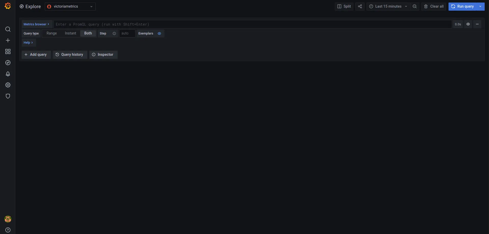
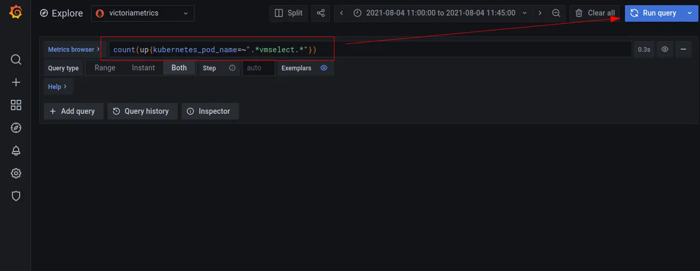
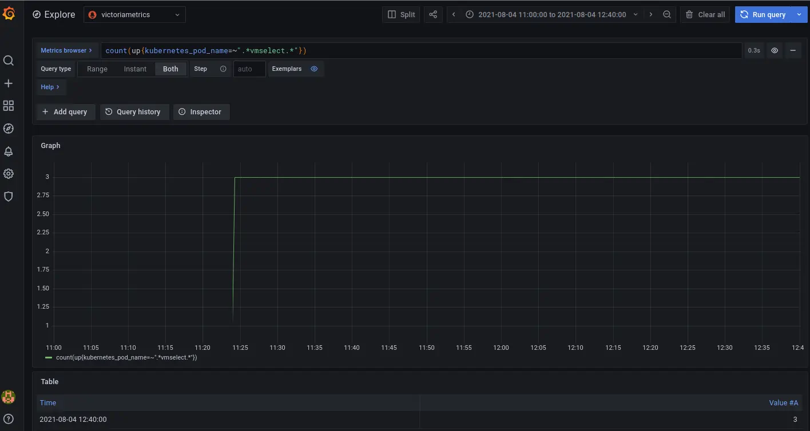
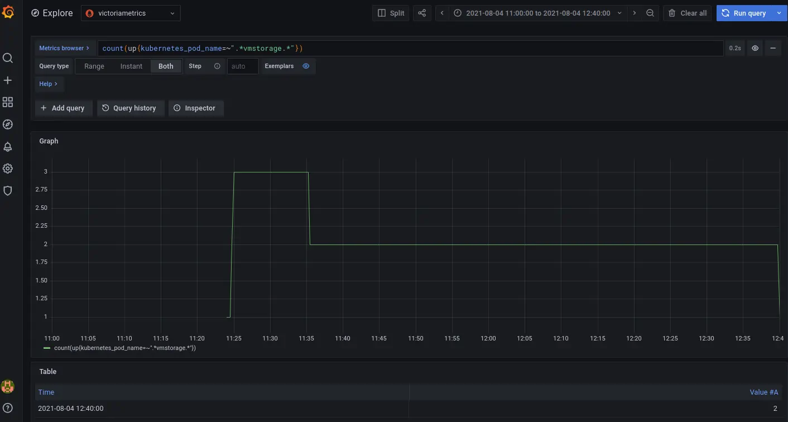

# HA monitoring setup in Kubernetes via VictoriaMetrics Cluster


**The guide covers:**

* High availability monitoring via [VictoriaMetrics cluster](https://docs.victoriametrics.com/cluster-victoriametrics/) in [Kubernetes](https://kubernetes.io/) with Helm charts
* How to store metrics 
* How to scrape metrics from k8s components using a service discovery 
* How to visualize stored data 
* How to store metrics in [VictoriaMetrics](https://victoriametrics.com)

**Preconditions**

* [Kubernetes cluster 1.19.12-gke.2100](https://cloud.google.com/kubernetes-engine). We use GKE cluster from [GCP](https://cloud.google.com/) but this guide also applies to any Kubernetes cluster. For example, [Amazon EKS](https://aws.amazon.com/ru/eks/).
* [Helm 3 ](https://helm.sh/docs/intro/install)
* [kubectl 1.21](https://kubernetes.io/docs/tasks/tools/install-kubectl)
* [jq](https://stedolan.github.io/jq/download/) tool

## 1. VictoriaMetrics Helm repository

Please see the relevant [VictoriaMetrics Helm repository](https://docs.victoriametrics.com/guides/k8s-monitoring-via-vm-cluster.html#1-victoriametrics-helm-repository) section in previous guides. 


## 2. Install VictoriaMetrics Cluster from the Helm chart

Execute the following command in your terminal:


```sh
cat <<EOF | helm install vmcluster vm/victoria-metrics-cluster -f -
vmselect:
  extraArgs:
    dedup.minScrapeInterval: 1ms
    replicationFactor: 2
  podAnnotations:
    prometheus.io/scrape: "true"
    prometheus.io/port: "8481"
  replicaCount: 3

vminsert:
  extraArgs:
    replicationFactor: 2
  podAnnotations:
    prometheus.io/scrape: "true"
    prometheus.io/port: "8480"
  replicaCount: 3

vmstorage:
  podAnnotations:
    prometheus.io/scrape: "true"
    prometheus.io/port: "8482"
  replicaCount: 3
EOF
```

* The `Helm install vmcluster vm/victoria-metrics-cluster` command installs [VictoriaMetrics cluster](https://docs.victoriametrics.com/cluster-victoriametrics/) to the default [namespace](https://kubernetes.io/docs/concepts/overview/working-with-objects/namespaces/).
* `dedup.minScrapeInterval: 1ms` configures [de-duplication](https://docs.victoriametrics.com/#deduplication) for the cluster that de-duplicates data points in the same time series if they fall within the same discrete 1ms bucket. The earliest data point will be kept. In the case of equal timestamps, an arbitrary data point will be kept.
* `replicationFactor: 2` Replication factor for the ingested data, i.e. how many copies should be made among distinct `-storageNode` instances. If the replication factor is greater than one, the deduplication must be enabled on the remote storage side.
* `podAnnotations: prometheus.io/scrape: "true"` enables the scraping of metrics from the vmselect, vminsert and vmstorage pods.
* `podAnnotations:prometheus.io/port: "some_port" ` enables the scraping of metrics from the vmselect, vminsert and vmstorage pods from corresponding ports.
* `replicaCount: 3` creates three replicas of vmselect, vminsert and vmstorage.


The expected result of the command execution is the following:

```text
NAME: vmcluster
LAST DEPLOYED: Thu Jul 29 13:33:51 2021
NAMESPACE: default
STATUS: deployed
REVISION: 1
TEST SUITE: None
NOTES:
Write API:

The VictoriaMetrics write api can be accessed via port 8480 via the following DNS name from within your cluster:
vmcluster-victoria-metrics-cluster-vminsert.default.svc.cluster.local

Get the VictoriaMetrics insert service URL by running these commands in the same shell:
  export POD_NAME=$(kubectl get pods --namespace default -l "app=vminsert" -o jsonpath="{.items[0].metadata.name}")
  kubectl --namespace default port-forward $POD_NAME 8480

You need to update your Prometheus configuration file and add the following lines to it:

prometheus.yml

    remote_write:
      - url: "http://<insert-service>/insert/0/prometheus/"


for example -  inside the Kubernetes cluster:

    remote_write:
      - url: "http://vmcluster-victoria-metrics-cluster-vminsert.default.svc.cluster.local:8480/insert/0/prometheus/"
Read API:

The VictoriaMetrics read api can be accessed via port 8481 with the following DNS name from within your cluster:
vmcluster-victoria-metrics-cluster-vmselect.default.svc.cluster.local

Get the VictoriaMetrics select service URL by running these commands in the same shell:
  export POD_NAME=$(kubectl get pods --namespace default -l "app=vmselect" -o jsonpath="{.items[0].metadata.name}")
  kubectl --namespace default port-forward $POD_NAME 8481

You need to specify select service URL into your Grafana:
 NOTE: you need to use the Prometheus Data Source

Input this URL field into Grafana

    http://<select-service>/select/0/prometheus/


for example - inside the Kubernetes cluster:

    http://vmcluster-victoria-metrics-cluster-vmselect.default.svc.cluster.local:8481/select/0/prometheus/"

```

Verify that the VictoriaMetrics cluster pods are up and running by executing the following command:


```sh
kubectl get pods | grep vmcluster
```

The expected output is:

```text
vmcluster-victoria-metrics-cluster-vminsert-78b84d8cd9-4mh9d   1/1     Running   0          2m28s
vmcluster-victoria-metrics-cluster-vminsert-78b84d8cd9-4ppl7   1/1     Running   0          2m28s
vmcluster-victoria-metrics-cluster-vminsert-78b84d8cd9-782qk   1/1     Running   0          2m28s
vmcluster-victoria-metrics-cluster-vmselect-69c5f48bc6-4v4ws   1/1     Running   0          2m27s
vmcluster-victoria-metrics-cluster-vmselect-69c5f48bc6-kwc7q   1/1     Running   0          2m28s
vmcluster-victoria-metrics-cluster-vmselect-69c5f48bc6-v7pmk   1/1     Running   0          2m28s
vmcluster-victoria-metrics-cluster-vmstorage-0                 1/1     Running   0          2m27s
vmcluster-victoria-metrics-cluster-vmstorage-1                 1/1     Running   0          2m3s
vmcluster-victoria-metrics-cluster-vmstorage-2                 1/1     Running   0          99s
```

## 3. Install vmagent from the Helm chart

To scrape metrics from Kubernetes with a VictoriaMetrics Cluster we will need to install [vmagent](https://docs.victoriametrics.com/vmagent/) with some additional configurations. To do so, please run the following command:

```yaml
helm install vmagent vm/victoria-metrics-agent -f https://docs.victoriametrics.com/guides/guide-vmcluster-vmagent-values.yaml
```

Here is full file content `guide-vmcluster-vmagent-values.yaml`

```yaml
remoteWriteUrls:
   - http://vmcluster-victoria-metrics-cluster-vminsert.default.svc.cluster.local:8480/insert/0/prometheus/
   
scrape_configs:
    - job_name: vmagent
      static_configs:
        - targets: ["localhost:8429"]
    - job_name: "kubernetes-apiservers"
      kubernetes_sd_configs:
        - role: endpoints
      scheme: https
      tls_config:
        ca_file: /var/run/secrets/kubernetes.io/serviceaccount/ca.crt
        insecure_skip_verify: true
      bearer_token_file: /var/run/secrets/kubernetes.io/serviceaccount/token
      relabel_configs:
        - source_labels:
            [
              __meta_kubernetes_namespace,
              __meta_kubernetes_service_name,
              __meta_kubernetes_endpoint_port_name,
            ]
          action: keep
          regex: default;kubernetes;https
    - job_name: "kubernetes-nodes"
      scheme: https
      tls_config:
        ca_file: /var/run/secrets/kubernetes.io/serviceaccount/ca.crt
        insecure_skip_verify: true
      bearer_token_file: /var/run/secrets/kubernetes.io/serviceaccount/token
      kubernetes_sd_configs:
        - role: node
      relabel_configs:
        - action: labelmap
          regex: __meta_kubernetes_node_label_(.+)
        - target_label: __address__
          replacement: kubernetes.default.svc:443
        - source_labels: [__meta_kubernetes_node_name]
          regex: (.+)
          target_label: __metrics_path__
          replacement: /api/v1/nodes/$1/proxy/metrics
    - job_name: "kubernetes-nodes-cadvisor"
      scheme: https
      tls_config:
        ca_file: /var/run/secrets/kubernetes.io/serviceaccount/ca.crt
        insecure_skip_verify: true
      bearer_token_file: /var/run/secrets/kubernetes.io/serviceaccount/token
      kubernetes_sd_configs:
        - role: node
      relabel_configs:
        - action: labelmap
          regex: __meta_kubernetes_node_label_(.+)
        - target_label: __address__
          replacement: kubernetes.default.svc:443
        - source_labels: [__meta_kubernetes_node_name]
          regex: (.+)
          target_label: __metrics_path__
          replacement: /api/v1/nodes/$1/proxy/metrics/cadvisor
      metric_relabel_configs:
        - action: replace
          source_labels: [pod]
          regex: '(.+)'
          target_label: pod_name
          replacement: '${1}'
        - action: replace
          source_labels: [container]
          regex: '(.+)'
          target_label: container_name
          replacement: '${1}'
        - action: replace
          target_label: name
          replacement: k8s_stub
        - action: replace
          source_labels: [id]
          regex: '^/system\.slice/(.+)\.service$'
          target_label: systemd_service_name
          replacement: '${1}'
```

* `remoteWriteUrls: - http://vmcluster-victoria-metrics-cluster-vminsert.default.svc.cluster.local:8480/insert/0/prometheus/` configures `vmagent` to write scraped metrics to the `vmselect service`.
* The `metric_relabel_configs` section allows you to process Kubernetes metrics for the Grafana dashboard.


Verify that `vmagent`'s pod is up and running by executing the following command:


```shell
kubectl get pods | grep vmagent
```


The expected output is:

```text
vmagent-victoria-metrics-agent-57ddbdc55d-h4ljb                1/1     Running   0          13s
```

## 4. Verifying HA of VictoriaMetrics Cluster

Run the following command to check that VictoriaMetrics services are up and running:

```shell
kubectl get pods | grep victoria-metrics
```

The expected output is:

```text
vmagent-victoria-metrics-agent-57ddbdc55d-h4ljb                1/1     Running   0          75s
vmcluster-victoria-metrics-cluster-vminsert-78b84d8cd9-s8v7x   1/1     Running   0          89s
vmcluster-victoria-metrics-cluster-vminsert-78b84d8cd9-xlm9d   1/1     Running   0          89s
vmcluster-victoria-metrics-cluster-vminsert-78b84d8cd9-xqxrh   1/1     Running   0          89s
vmcluster-victoria-metrics-cluster-vmselect-69c5f48bc6-7dg95   1/1     Running   0          89s
vmcluster-victoria-metrics-cluster-vmselect-69c5f48bc6-ck7qb   1/1     Running   0          89s
vmcluster-victoria-metrics-cluster-vmselect-69c5f48bc6-jjqsl   1/1     Running   0          89s
vmcluster-victoria-metrics-cluster-vmstorage-0                 1/1     Running   0          89s
vmcluster-victoria-metrics-cluster-vmstorage-1                 1/1     Running   0          63s
vmcluster-victoria-metrics-cluster-vmstorage-2                 1/1     Running   0          34s
```

To verify that metrics are present in the VictoriaMetrics send a curl request to the `vmselect` service from kubernetes or setup Grafana and check it via the web interface. 

Run the following command to see the list of services:

```shell
kubectl get svc | grep vmselect
```

The expected output:

```text
vmcluster-victoria-metrics-cluster-vmselect    ClusterIP   10.88.2.69    <none>        8481/TCP                     1m
```

Run the following command to make `vmselect`'s port accessible from the local machine:


```shell
kubectl port-forward svc/vmcluster-victoria-metrics-cluster-vmselect 8481:8481
```

Execute the following command to get metrics via `curl`:

```curl
curl -sg 'http://127.0.0.1:8481/select/0/prometheus/api/v1/query_range?query=count(up{kubernetes_pod_name=~".*vmselect.*"})&start=-10m&step=1m' | jq
```

The expected output is:

```json
{
  "status": "success",
  "isPartial": false,
  "data": {
    "resultType": "matrix",
    "result": [
      {
        "metric": {},
        "values": [
          [
            1628065480.657,
            "3"
          ],
          [
            1628065540.657,
            "3"
          ],
          [
            1628065600.657,
            "3"
          ],
          [
            1628065660.657,
            "3"
          ],
          [
            1628065720.657,
            "3"
          ],
          [
            1628065780.657,
            "3"
          ],
          [
            1628065840.657,
            "3"
          ]
        ]
      }
    ]
  }
}
```

* Query `http://127.0.0.1:8481/select/0/prometheus/api/v1/query_range` uses [VictoriaMetrics querying API](https://docs.victoriametrics.com/cluster-victoriametrics/#url-format) to fetch previously stored data points;
* Argument `query=count(up{kubernetes_pod_name=~".*vmselect.*"})` specifies the query we want to execute. Specifically, we calculate the number of `vmselect` pods.
* Additional arguments `start=-10m&step=1m'` set requested time range from -10 minutes (10 minutes ago) to now (default value if `end` argument is omitted) and step (the distance between returned data points) of 1 minute;
* By adding `| jq` we pass the output to the jq utility which outputs information in json format 

The expected result of the query `count(up{kubernetes_pod_name=~".*vmselect.*"})` should be equal to `3` - the number of replicas we set via `replicaCount` parameter.


To test via Grafana, we need to install it first. [Install and connect Grafana to VictoriaMetrics](https://docs.victoriametrics.com/guides/k8s-monitoring-via-vm-cluster.html#4-install-and-connect-grafana-to-victoriametrics-with-helm), login into Grafana and open the metrics [Explore](http://127.0.0.1:3000/explore) page.




Choose `victoriametrics` from the list of datasources and enter `count(up{kubernetes_pod_name=~".*vmselect.*"})` to the **Metric browser** field as shown on the screenshot, then press **Run query** button:



The expected output is:



## 5. High Availability

To test if High Availability works, we need to shutdown one of the `vmstorages`. To do this, run the following command:


```shell
kubectl scale sts vmcluster-victoria-metrics-cluster-vmstorage --replicas=2
```

Verify that now we have two running `vmstorages` in the cluster by executing the following command:


```shell
kubectl get pods  | grep vmstorage
```

The expected output is:
```text
vmcluster-victoria-metrics-cluster-vmstorage-0                 1/1     Running   0          44m
vmcluster-victoria-metrics-cluster-vmstorage-1                 1/1     Running   0          43m
```

Return to Grafana Explore and press the  **Run query** button again.

The expected output is:


As you can see, after we scaled down the `vmstorage` replicas number from three to two pods, metrics are still available and correct. The response is not partial as it was before scaling. Also we see that query `count(up{kubernetes_pod_name=~".*vmselect.*"})` returns the same value as before.

To confirm that the number of `vmstorage` pods is equivalent to two, execute the following request in Grafana Explore:




## 6. Final thoughts

* We set up VictoriaMetrics for Kubernetes cluster with HA.
* We collected metrics from running services and stored them in the VictoriaMetrics database.
* We configured `dedup.minScrapeInterval` and `replicationFactor: 2` for VictoriaMetrics cluster for high availability purposes.
* We tested and made sure that metrics are available even if one of `vmstorages` nodes was turned off.
