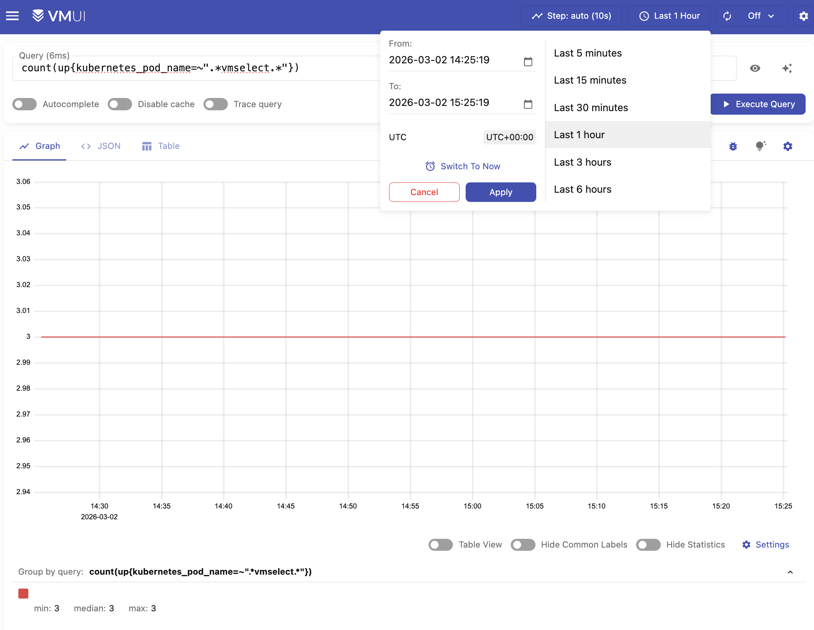
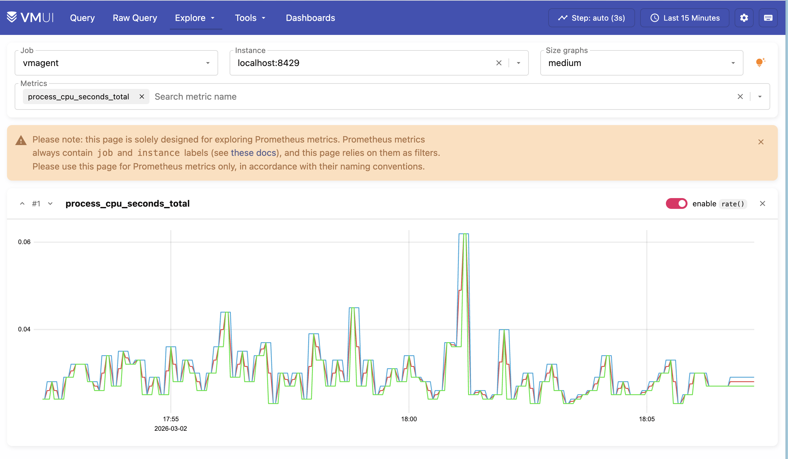

---
build:
  list: never
  publishResources: false
  render: never
sitemap:
  disable: true
---

This guide walks you through deploying a [VictoriaMetrics cluster](https://docs.victoriametrics.com/guides/k8s-monitoring-via-vm-cluster/) version on Kubernetes in high-availability mode.

By the end of this guide, you will know:

- How to install and configure [VictoriaMetrics cluster version](https://docs.victoriametrics.com/victoriametrics/cluster-victoriametrics/) using Helm.
- How high-availability mode works in VictoriaMetrics.
- How to scrape metrics from Kubernetes components using service discovery.

## Overview

In this guide, high availability is achieved by configuring [replication](https://docs.victoriametrics.com/victoriametrics/cluster-victoriametrics/#replication-and-data-safety) on `vminsert` to a value of 2. This means every incoming data point is written twice to separate `vmstorage` pods, so data remains available as long as at least one replica of a given time series is reachable.

This setup requires **twice as much storage** as a normal, non-replicating cluster because `vminsert` fans out each write into two `vmstorage` pods. 

Duplication causes `vmselect` to read back two copies of each sample, potentially skewing results. For example, in aggregations such as `sum` or `count`, this would double the result. To handle this, we must enable [de-duplication](https://docs.victoriametrics.com/victoriametrics/cluster-victoriametrics/#deduplication) in the `vmselect` pods to collapse the replicas into a single sample per scrape interval.

## Preconditions

> [!NOTE] Note
> We used a GKE cluster (v1.35) from [GCP](https://cloud.google.com/) in this guide, but it can also be applied to any Kubernetes cluster. For example, [Amazon EKS](https://aws.amazon.com/ru/eks/) or an on-premises cluster.

- [Kubernetes cluster](https://cloud.google.com/kubernetes-engine).
- [Helm](https://helm.sh/docs/intro/install)
- [kubectl](https://kubernetes.io/docs/tasks/tools/install-kubectl)
- [jq](https://stedolan.github.io/jq/download/) tool

## 1. VictoriaMetrics Helm repository

Run the following command to add the VictoriaMetrics Helm repository:

```sh
helm repo add vm https://victoriametrics.github.io/helm-charts/
helm repo update
```

Then, verify that VictoriaMetrics charts are available with:

```sh
helm search repo vm/
```

You should get a list of charts similar to this:

```text
NAME                                    CHART VERSION   APP VERSION     DESCRIPTION
vm/victoria-metrics-cluster             0.35.0          v1.136.0        VictoriaMetrics Cluster version - high-performa...
vm/victoria-metrics-agent               0.32.0          v1.136.0        VictoriaMetrics Agent - collects metrics from v...
vm/victoria-metrics-common              0.0.46                          VictoriaMetrics Common - contains shared templa...
...(list continues)...
```

## 2. Install VictoriaMetrics Cluster from the Helm chart

A [VictoriaMetrics cluster](https://docs.victoriametrics.com/victoriametrics/cluster-victoriametrics/) consists of three services:

- `vminsert`: receives incoming metrics and distributes them across vmstorage nodes via consistent hashing on metric names and labels.
- `vmstorage`: stores raw data and serves queries filtered by time range and labels.
- `vmselect`: executes queries by fetching data across all configured vmstorage nodes.

Create a high-availability configuration file for the VictoriaMetrics services:

```sh
cat <<EOF > victoria-metrics-cluster-values.yml
vmselect:
  extraArgs:
    dedup.minScrapeInterval: 1ms
    replicationFactor: 2
  podAnnotations:
    prometheus.io/scrape: "true"
    prometheus.io/port: "8481"
  replicaCount: 3

vminsert:
  extraArgs:
    replicationFactor: 2
  podAnnotations:
    prometheus.io/scrape: "true"
    prometheus.io/port: "8480"
  replicaCount: 3

vmstorage:
  podAnnotations:
    prometheus.io/scrape: "true"
    prometheus.io/port: "8482"
  replicaCount: 3
EOF
```


Let's break down how high availability is achieved:

- `replicaCount: 3` creates three replicas of vmselect, vminsert, and vmstorage each.
- `replicationFactor: 2` enables [replication](https://docs.victoriametrics.com/victoriametrics/cluster-victoriametrics/#replication-and-data-safety) for `vminsert` and `vmselect`.
  - `vminsert` uses `replicationFactor` to fan out writes. In this case, it creates two copies of the sample and distributes them among distinct `vmstorage` pods.
  - `vmselect` also gets a `replicationFactor` so it knows how many replicas to expect and when to treat a response as partial (more on this later).
- `dedup.minScrapeInterval`: 1ms configures [de-duplication](https://docs.victoriametrics.com/victoriametrics/single-server-victoriametrics/#deduplication) for `vmselect`, so it does not double-count samples when retrieving data from `vmstorage` pods.
- `podAnnotations: prometheus.io/scrape: "true"` enables metric scraping so you can monitor your VictoriaMetrics cluster.
- `podAnnotations: prometheus.io/port: "some_port" ` defines the scraping port.

Install the VictoriaMetrics cluster in high-availability mode. The following command deploys a VictoriaMetrics cluster in the default namespace:

```sh
helm install vmcluster vm/victoria-metrics-cluster -f victoria-metrics-cluster-values.yml
```

The expected output is:

```text
NAME: vmcluster
LAST DEPLOYED: Mon Mar  2 12:50:25 2026
NAMESPACE: default
STATUS: deployed
REVISION: 1
DESCRIPTION: Install complete
TEST SUITE: None
NOTES:
Write API:

The VictoriaMetrics write api can be accessed via port 8480 with the following DNS name from within your cluster:
vmcluster-victoria-metrics-cluster-vminsert.default.svc.cluster.local.

Get the Victoria Metrics insert service URL by running these commands in the same shell:
  export POD_NAME=$(kubectl get pods --namespace default -l "app=vminsert" -o jsonpath="{.items[0].metadata.name}")
  kubectl --namespace default port-forward $POD_NAME 8480

You need to update your Prometheus configuration file and add the following lines to it:

prometheus.yml

    remote_write:
      - url: "http://<insert-service>/insert/0/prometheus/"

for example -  inside the Kubernetes cluster:

    remote_write:
      - url: http://vmcluster-victoria-metrics-cluster-vminsert.default.svc.cluster.local:8480/insert/0/prometheus/
Read API:

The VictoriaMetrics read api can be accessed via port 8481 with the following DNS name from within your cluster:
vmcluster-victoria-metrics-cluster-vmselect.default.svc.cluster.local.

Get the VictoriaMetrics select service URL by running these commands in the same shell:
  export POD_NAME=$(kubectl get pods --namespace default -l "app=vmselect" -o jsonpath="{.items[0].metadata.name}")
  kubectl --namespace default port-forward $POD_NAME 8481

You need to specify the service URL in your Grafana:
 NOTE: you need to use the Prometheus Data Source

Input this URL field into Grafana

    http://<select-service>/select/0/prometheus/


for example - inside the Kubernetes cluster:

    http://vmcluster-victoria-metrics-cluster-vmselect.default.svc.cluster.local.:8481/select/0/prometheus/
```

Verify that the VictoriaMetrics cluster pods are up and running by executing the following command:

```sh
kubectl get pods -l app.kubernetes.io/instance=vmcluster
```

You should see:

```text
NAME                                                           READY   STATUS    RESTARTS   AGE
vmcluster-victoria-metrics-cluster-vminsert-788c76b69b-lphnn   1/1     Running   0          106s
vmcluster-victoria-metrics-cluster-vminsert-788c76b69b-lxg2w   1/1     Running   0          106s
vmcluster-victoria-metrics-cluster-vminsert-788c76b69b-qmtkp   1/1     Running   0          106s
vmcluster-victoria-metrics-cluster-vmselect-65796bc88d-29cwm   1/1     Running   0          106s
vmcluster-victoria-metrics-cluster-vmselect-65796bc88d-lz58p   1/1     Running   0          106s
vmcluster-victoria-metrics-cluster-vmselect-65796bc88d-t42pr   1/1     Running   0          106s
vmcluster-victoria-metrics-cluster-vmstorage-0                 1/1     Running   0          106s
vmcluster-victoria-metrics-cluster-vmstorage-1                 1/1     Running   0          91s
vmcluster-victoria-metrics-cluster-vmstorage-2                 1/1     Running   0          76s

```
## 3. Install vmagent from the Helm chart

To scrape metrics from Kubernetes with a VictoriaMetrics Cluster, we need to install [vmagent](https://docs.victoriametrics.com/victoriametrics/vmagent/) and configure it with additional settings. 

Install `vmagent` with the following command:

```yaml
helm install vmagent vm/victoria-metrics-agent -f https://docs.victoriametrics.com/guides/examples/guide-vmcluster-vmagent-values.yaml
```

You can obtain a copy of `guide-vmcluster-vmagent-values.yaml` to review with:

```sh
wget https://docs.victoriametrics.com/guides/examples/guide-vmcluster-vmagent-values.yaml
```

Here are the key settings in the chart file that we used to install `vmagent` with Helm earlier:

- `remoteWrite` defines the vminsert endpoint that receives telemetry from vmagent. This value should match exactly the URL for the `remote_write` in the output of the VictoriaMetrics cluster installation in [Step 2](https://docs.victoriametrics.com/guides/k8s-ha-monitoring-via-vm-cluster/#id-2-install-victoriametrics-cluster-from-the-helm-chart).

    ```yaml
    remoteWrite:
      - url: http://vmcluster-victoria-metrics-cluster-vminsert.default.svc.cluster.local:8480/insert/0/prometheus/
    ```

- `metric_relabel_configs` defines label-rewriting rules for the scraped metrics.

    ```yaml
          metric_relabel_configs:
            - action: replace
              source_labels: [pod]
              regex: '(.+)'
              target_label: pod_name
              replacement: '${1}'
            - action: replace
              source_labels: [container]
              regex: '(.+)'
              target_label: container_name
              replacement: '${1}'
            - action: replace
              target_label: name
              replacement: k8s_stub
            - action: replace
              source_labels: [id]
              regex: '^/system\.slice/(.+)\.service$'
              target_label: systemd_service_name
              replacement: '${1}'
    ```
```yaml
```

Verify that `vmagent`'s pod is up and running by executing the following command:


```shell
kubectl get pod -l app.kubernetes.io/instance=vmagent
```

Expected output:

```text
NAME                                              READY   STATUS    RESTARTS   AGE
vmagent-victoria-metrics-agent-6848c6b58d-87rf6   1/1     Running   0          32s
```

## 4. Verifying HA of VictoriaMetrics Cluster

Run the following command to check that VictoriaMetrics services are up and running:

```shell
kubectl get svc -l app.kubernetes.io/instance=vmcluster
```

The expected output is:

```text
NAME                                           TYPE        CLUSTER-IP      EXTERNAL-IP   PORT(S)                      AGE
vmcluster-victoria-metrics-cluster-vminsert    ClusterIP   10.43.157.170   <none>        8480/TCP                     4m41s
vmcluster-victoria-metrics-cluster-vmselect    ClusterIP   10.43.222.181   <none>        8481/TCP                     4m41s
vmcluster-victoria-metrics-cluster-vmstorage   ClusterIP   None            <none>        8482/TCP,8401/TCP,8400/TCP   4m41s
```

To verify that metrics are present in VictoriaMetrics, you can send a curl request to the `vmselect` service. Run the following command to make `vmselect`'s port accessible from the local machine:

```sh
kubectl port-forward svc/vmcluster-victoria-metrics-cluster-vmselect 8481:8481
```

Execute the following command to get metrics via `curl`:

```sh
curl -sg 'http://127.0.0.1:8481/select/0/prometheus/api/v1/query?query=count(up{kubernetes_pod_name=~".*vmselect.*"})' | jq
```

Let's break down the command:

* The request to `http://127.0.0.1:8481/select/0/prometheus/api/v1/query?query` uses the [VictoriaMetrics querying API](https://docs.victoriametrics.com/victoriametrics/cluster-victoriametrics/#url-format) to fetch metric data
* The argument `query=count(up{kubernetes_pod_name=~".*vmselect.*"})` specifies the query. Specifically, we want to count the number of `vmselect` pods.
* We pipe the output to `jq` to format the output in a more readable way.

You should see:

```json
{
  "status": "success",
  "isPartial": false,
  "data": {
    "resultType": "vector",
    "result": [
      {
        "metric": {},
        "value": [
          1773419630,
          "3"
        ]
      }
    ]
  },
  "stats": {
    "seriesFetched": "3",
    "executionTimeMsec": 3
  }
}
```

The value should be 3, which is the number of replicas we configured earlier.

You can also execute the query in VMUI by opening your browser in `http://localhost:8481/select/0/vmui/` (where 0 is the [default tenant ID](https://docs.victoriametrics.com/victoriametrics/cluster-victoriametrics/#multitenancy)).

Type `count(up{kubernetes_pod_name=~".*vmselect.*"})` and press **Execute query**



You can also try **Explore** > **Prometheus metrics** to discover metrics collected from the Kubernetes cluster.



## 5. High Availability

We can test that High Availability is working by simulating a failure. We can do this by shutting down one of the `vmstorage` pods.

Reduce the number of `vmstorage` pods from 3 to 2 with the following command:

```shell
kubectl scale sts vmcluster-victoria-metrics-cluster-vmstorage --replicas=2
```

Verify that now we have two running `vmstorage` pods in the cluster by executing the following command:

```shell
kubectl get pods -l app=vmstorage
```

The expected output is:

```text
NAME                                             READY   STATUS    RESTARTS   AGE
vmcluster-victoria-metrics-cluster-vmstorage-0   1/1     Running   0          3h20m
vmcluster-victoria-metrics-cluster-vmstorage-1   1/1     Running   0          3h20m
```

You can confirm that there are two `vmstorage` pods with this query:

```sh
curl -sg 'http://127.0.0.1:8481/select/0/prometheus/api/v1/query?query=count(up{kubernetes_pod_name=~".*vmstorage.*"})' | jq
```

This should output 2 nodes:

```json
{
  "status": "success",
  "isPartial": false,
  "data": {
    "resultType": "vector",
    "result": [
      {
        "metric": {},
        "value": [
          1773437033,
          "2"
        ]
      }
    ]
  },
  "stats": {
    "seriesFetched": "2",
    "executionTimeMsec": 5
  }
}
```

Since each data point is stored across two storage pods, losing a single pod does not affect query results, and data remains available as long as at least one replica per time series remains reachable.

You can also check if the query result is complete by examining the `isPartial` value in the response:
- When `isPartial: false`, the response is complete for the requested time range and series. This means that enough storage replicas have responded (according to the configured `replicationFactor`).
- When `isPartial: true`, it means `vmselect` could not fetch all the data it expected from `vmstorage`, so the returned series and values may be incomplete or incorrect. 

Running other queries such as `count(up{kubernetes_pod_name=~".*vmselect.*"})` should still return 3.

```sh
curl -sg 'http://127.0.0.1:8481/select/0/prometheus/api/v1/query?query=count(up{kubernetes_pod_name=~".*vmselect.*"})' | jq
```

This should print:

```json
{
  "status": "success",
  "isPartial": false,
  "data": {
    "resultType": "vector",
    "result": [
      {
        "metric": {},
        "value": [
          1773437137,
          "3"
        ]
      }
    ]
  },
  "stats": {
    "seriesFetched": "3",
    "executionTimeMsec": 5
  }
}
```

This means that queries and metric ingestion are not affected by the "failure" of a single storage pod.

Finally, you can scale the `vmstorage` pods back to 3 to resume normal operation:

```sh
kubectl scale sts vmcluster-victoria-metrics-cluster-vmstorage --replicas=3
```

## 6. Final thoughts

- We set up a highly available VictoriaMetrics cluster on Kubernetes
- We collected metrics from running services and stored them in the VictoriaMetrics database.
- We configured `dedup.minScrapeInterval` and `replicationFactor: 2` for the VictoriaMetrics cluster for high availability purposes.
- We tested and made sure that metrics are available even if one of the `vmstorage` nodes is turned off.

Next steps:
- [Learn more about the cluster version](https://docs.victoriametrics.com/victoriametrics/cluster-victoriametrics/)
- [Migrate existing metric data into VictoriaMetrics with vmctl](https://docs.victoriametrics.com/victoriametrics/vmctl/)
- [Install Grafana](https://docs.victoriametrics.com/guides/k8s-monitoring-via-vm-cluster/#id-4-install-and-connect-grafana-to-victoriametrics-with-helm)

