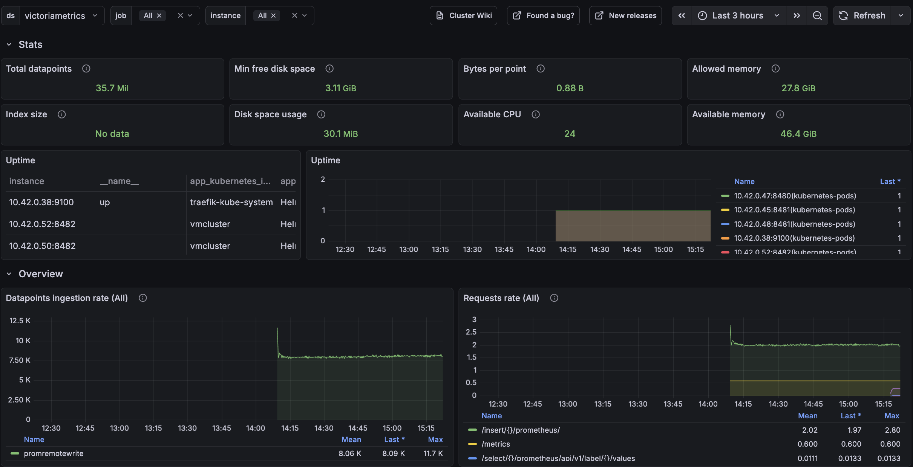
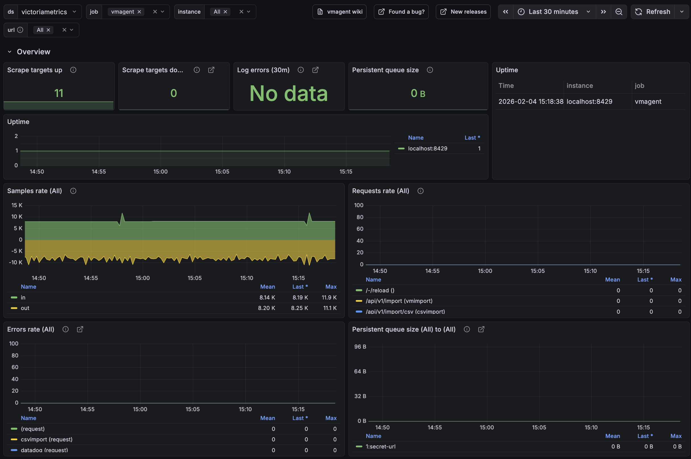

---
build:
  list: never
  publishResources: false
  render: never
sitemap:
  disable: true
---

This guide walks you through deploying a VictoriaMetrics cluster version on Kubernetes.

> [!NOTE] Important
> It is important to understand the trade-offs between single-node and cluster versions of VictoriaMetrics. A single node instance can handle [up to 100 million active time series](https://docs.victoriametrics.com/victoriametrics/faq/#what-are-scalability-limits-of-victoriametrics) while being easier to manage and requiring fewer resources. Unless you **really need** horizontal scalability or [features present only in the cluster version](https://docs.victoriametrics.com/victoriametrics/cluster-victoriametrics/#prominent-features), consider installing the [single-node version of VictoriaMetrics](https://docs.victoriametrics.com/guides/k8s-monitoring-via-vm-single/).

By the end of this guide, you will know:

- How to install and configure [VictoriaMetrics cluster version](https://docs.victoriametrics.com/victoriametrics/cluster-victoriametrics/) using Helm.
- How to scrape metrics from Kubernetes components using service discovery.
- How to store metrics in [VictoriaMetrics](https://victoriametrics.com) time-series database.
- How to visualize metrics in Grafana

We will use:

- [Kubernetes cluster 1.34+](https://cloud.google.com/kubernetes-engine)
- [Helm 4.1+](https://helm.sh/docs/intro/install)
- [kubectl 1.34+](https://kubernetes.io/docs/tasks/tools/install-kubectl)

> We use a GKE cluster from [GCP](https://cloud.google.com/), but this guide can also be applied to any Kubernetes cluster. For example, [Amazon EKS](https://aws.amazon.com/ru/eks/) or an on-premises cluster.

## 1. VictoriaMetrics Helm repository

To start, add the VictoriaMetrics Helm repository with the following commands:

```shell
helm repo add vm https://victoriametrics.github.io/helm-charts/
helm repo update
```

To verify that everything is set up correctly, you may run this command:

```shell
helm search repo vm/
```

You should see a list similar to this:

```text
NAME                                    CHART VERSION   APP VERSION     DESCRIPTION
vm/victoria-metrics-cluster             0.34.0          v1.135.0        VictoriaMetrics Cluster version - high-performa...
vm/victoria-metrics-agent               0.31.0          v1.135.0        VictoriaMetrics Agent - collects metrics from v...
...(the list continues)...
```

## 2. Install VictoriaMetrics Cluster from the Helm chart

A [VictoriaMetrics cluster](https://docs.victoriametrics.com/victoriametrics/cluster-victoriametrics/) consists of three services:

- `vminsert`: receives incoming metrics and distributes them across `vmstorage` nodes via consistent hashing on metric names and labels.
- `vmstorage`: stores raw data and serves queries filtered by time range and labels.
- `vmselect`: executes queries by fetching data across all configured `vmstorage` nodes.


To get started, create a config file for the VictoriaMetrics Helm chart:

```sh
cat <<EOF >victoria-metrics-cluster-values.yml
vmselect:
  podAnnotations:
      prometheus.io/scrape: "true"
      prometheus.io/port: "8481"

vminsert:
  podAnnotations:
      prometheus.io/scrape: "true"
      prometheus.io/port: "8480"

vmstorage:
  podAnnotations:
      prometheus.io/scrape: "true"
      prometheus.io/port: "8482"
EOF
```

The config file defines two settings for the VictoriaMetrics services:

- `podAnnotations: prometheus.io/scrape: "true"` enables automatic service discovery and metric scraping from the VictoriaMetrics pods.
- `podAnnotations:prometheus.io/port: "<port-number>"` defines which port numbers to target for scraping metrics from the VictoriaMetrics pods.

Next, install VictoriaMetrics cluster version with the following command:

```sh
helm install vmcluster vm/victoria-metrics-cluster -f victoria-metrics-cluster-values.yml
```

The expected output should look like this:

```text
NAME: vmcluster
LAST DEPLOYED: Wed Feb  4 12:00:55 2026
NAMESPACE: default
STATUS: deployed
REVISION: 1
DESCRIPTION: Install complete
TEST SUITE: None
NOTES:
Write API:

The Victoria Metrics write api can be accessed via port 8480 with the following DNS name from within your cluster:
vmcluster-victoria-metrics-cluster-vminsert.default.svc.cluster.local.

Get the Victoria Metrics insert service URL by running these commands in the same shell:
  export POD_NAME=$(kubectl get pods --namespace default -l "app=" -o jsonpath="{.items[0].metadata.name}")
  kubectl --namespace default port-forward $POD_NAME 8480

You need to update your Prometheus configuration file and add the following lines to it:

prometheus.yml

    remote_write:
      - url: "http://<insert-service>/insert/0/prometheus/"

for example -  inside the Kubernetes cluster:

    remote_write:
      - url: http://vmcluster-victoria-metrics-cluster-vminsert.default.svc.cluster.local.:8480/insert/0/prometheus/
Read API:

The VictoriaMetrics read api can be accessed via port 8481 with the following DNS name from within your cluster:
vmcluster-victoria-metrics-cluster-vmselect.default.svc.cluster.local.

Get the VictoriaMetrics select service URL by running these commands in the same shell:
  export POD_NAME=$(kubectl get pods --namespace default -l "app=" -o jsonpath="{.items[0].metadata.name}")
  kubectl --namespace default port-forward $POD_NAME 8481

You need to specify select service URL into your Grafana:
 NOTE: you need to use the Prometheus Data Source

Input this URL field into Grafana

    http://<select-service>/select/0/prometheus/


for example - inside the Kubernetes cluster:

    http://vmcluster-victoria-metrics-cluster-vmselect.default.svc.cluster.local.:8481/select/0/prometheus/
```

Note the following endpoint URLs:

- The `remote_write` URL will be required on [Step 3](#id-3-install-vmagent-from-the-helm-chart) to configure where the `vmagent` service sends telemetry data.

    ```text
        remote_write:
          - url: http://vmcluster-victoria-metrics-cluster-vminsert.default.svc.cluster.local.:8480/insert/0/prometheus/
    ```

- The `VictoriaMetrics read api` will be required on [Step 4](#id-4-install-and-connect-grafana-to-victoriametrics-with-helm) to configure the Grafana datasource.

    ```text
    The VictoriaMetrics read api can be accessed via port 8481 with the following DNS name from within your cluster:
    vmcluster-victoria-metrics-cluster-vmselect.default.svc.cluster.local.
    ```

Verify that [VictoriaMetrics cluster](https://docs.victoriametrics.com/victoriametrics/cluster-victoriametrics/) pods are up and running by executing the following command:

```sh
kubectl get pods
```

You should see a list of pods similar to this:

```text
NAME                                                           READY   STATUS    RESTARTS   AGE
vmcluster-victoria-metrics-cluster-vminsert-689cbc8f55-95szg   1/1     Running   0          16m
vmcluster-victoria-metrics-cluster-vminsert-689cbc8f55-f852l   1/1     Running   0          16m
vmcluster-victoria-metrics-cluster-vmselect-977d74cdf-bbgp5    1/1     Running   0          16m
vmcluster-victoria-metrics-cluster-vmselect-977d74cdf-vzp6z    1/1     Running   0          16m
vmcluster-victoria-metrics-cluster-vmstorage-0                 1/1     Running   0          16m
vmcluster-victoria-metrics-cluster-vmstorage-1                 1/1     Running   0          16m
```

## 3. Install vmagent from the Helm chart

In order to collect metrics from the Kubernetes cluster, we need to install [vmagent](https://docs.victoriametrics.com/victoriametrics/vmagent/). This service scrapes, relabels, and sends metrics to the `vminsert` service running in the cluster.

Run the following command to install the `vmagent` service in your cluster:

```shell
helm install vmagent vm/victoria-metrics-agent -f https://docs.victoriametrics.com/guides/examples/guide-vmcluster-vmagent-values.yaml
```

Here are the key settings in the chart values file `guide-vmcluster-vmagent-values.yaml`:

- `remoteWrite` defines the `vminsert` endpoint that receives telemetry from [vmagent](https://docs.victoriametrics.com/victoriametrics/vmagent/). This value should match exactly the URL for the `remote_write` in the output of [Step 2](#id-2-install-victoriametrics-cluster-from-the-helm-chart).

    ```yaml
    remoteWrite:
      - url: http://vmcluster-victoria-metrics-cluster-vminsert.default.svc.cluster.local:8480/insert/0/prometheus/
    ```

- `metric_relabel_configs` defines label-rewriting rules that help us show Kubernetes metrics in the Grafana dashboard later on.

    ```yaml
          metric_relabel_configs:
            - action: replace
              source_labels: [pod]
              regex: '(.+)'
              target_label: pod_name
              replacement: '${1}'
            - action: replace
              source_labels: [container]
              regex: '(.+)'
              target_label: container_name
              replacement: '${1}'
            - action: replace
              target_label: name
              replacement: k8s_stub
            - action: replace
              source_labels: [id]
              regex: '^/system\.slice/(.+)\.service$'
              target_label: systemd_service_name
              replacement: '${1}'
    ```

Verify that `vmagent`'s pod is up and running by executing the following command:

```shell
kubectl get pods | grep vmagent
```

Check that the pod is in `Running` state:

```text
vmagent-victoria-metrics-agent-69974b95b4-mhjph                1/1     Running   0          11m
```

## 4. Install and connect Grafana to VictoriaMetrics with Helm

Add the Grafana Community Helm repository:

```shell
helm repo add grafana-community https://grafana-community.github.io/helm-charts
helm repo update
```

> [!NOTE] Tip
> See more information on Grafana in [ArtifactHUB](https://artifacthub.io/packages/helm/grafana-community/grafana)

Create a values config file to define the data sources and dashboards for VictoriaMetrics in the Grafana service:

```sh
cat <<EOF > grafana-cluster-values.yml
  datasources:
    datasources.yaml:
      apiVersion: 1
      datasources:
        - name: victoriametrics
          type: prometheus
          orgId: 1
          url: http://vmcluster-victoria-metrics-cluster-vmselect.default.svc.cluster.local:8481/select/0/prometheus/
          access: proxy
          isDefault: true
          updateIntervalSeconds: 10
          editable: true

  dashboardProviders:
   dashboardproviders.yaml:
     apiVersion: 1
     providers:
     - name: 'default'
       orgId: 1
       folder: ''
       type: file
       disableDeletion: true
       editable: true
       options:
         path: /var/lib/grafana/dashboards/default

  dashboards:
    default:
      victoriametrics:
        gnetId: 11176
        datasource: victoriametrics
      vmagent:
        gnetId: 12683
        datasource: victoriametrics
      kubernetes:
        gnetId: 14205
        datasource: victoriametrics
EOF
```

The config file defines the following settings for Grafana:

- Provides a VictoriaMetrics data source. This value must match the `VictoriaMetrics read api` endpoint and port obtained in [Step 2](#id-2-install-victoriametrics-cluster-from-the-helm-chart) during the VictoriaMetrics cluster installation.
- Adds three starter dashboards:
  - [VictoriaMetrics - cluster](https://grafana.com/grafana/dashboards/11176-victoriametrics-cluster/) for the [VictoriaMetrics cluster](https://docs.victoriametrics.com/victoriametrics/cluster-victoriametrics/).
  - [VictoriaMetrics - vmagent](https://grafana.com/grafana/dashboards/12683-victoriametrics-vmagent/) for the [VictoriaMetrics agent](https://docs.victoriametrics.com/victoriametrics/vmagent/).
  - [Kubernetes cluster Monitoring (via Prometheus)](https://grafana.com/grafana/dashboards/14205-kubernetes-cluster-monitoring-via-prometheus/) to show Kubernetes cluster metrics.

Run the following command to install the Grafana chart with the name `my-grafana`:

```sh
helm install my-grafana grafana-community/grafana -f grafana-cluster-values.yml
```

You should get the following output:

```text
NAME: my-grafana
LAST DEPLOYED: Wed Feb  4 15:00:28 2026
NAMESPACE: default
STATUS: deployed
REVISION: 1
DESCRIPTION: Install complete
NOTES:
1. Get your 'admin' user password by running:

   kubectl get secret --namespace default my-grafana -o jsonpath="{.data.admin-password}" | base64 --decode ; echo


2. The Grafana server can be accessed via port 80 on the following DNS name from within your cluster:

   my-grafana.default.svc.cluster.local

   Get the Grafana URL to visit by running these commands in the same shell:
     export POD_NAME=$(kubectl get pods --namespace default -l "app.kubernetes.io/name=grafana,app.kubernetes.io/instance=my-grafana" -o jsonpath="{.items[0].metadata.name}")
     kubectl --namespace default port-forward $POD_NAME 3000

3. Login with the password from step 1 and the username: admin
#################################################################################
######   WARNING: Persistence is disabled!!! You will lose your data when   #####
######            the Grafana pod is terminated.                            #####
#################################################################################
```

Use the first command in the output to obtain the password for the `admin` user:

```shell
kubectl get secret --namespace default my-grafana -o jsonpath="{.data.admin-password}" | base64 --decode ; echo

```

The second part of the output shows how to port-forward the Grafana service in order to access it locally on `127.0.0.1:3000`:

```shell
export pod_name=$(kubectl get pods --namespace default -l "app.kubernetes.io/name=grafana,app.kubernetes.io/instance=my-grafana" -o jsonpath="{.items[0].metadata.name}")

kubectl --namespace default port-forward $pod_name 3000
```

## 5. Check the result you obtained in your browser

To check that [VictoriaMetrics](https://victoriametrics.com) collects metrics from the Kubernetes cluster, open in your browser `http://127.0.0.1:3000/dashboards`. Use `admin` for login and `password` obtained in the previous step.

You should see three dashboards installed. Select "Kubernetes Cluster Monitoring".


This is the main dashboard, which shows activity across your Kubernetes cluster:


The VictoriaMetrics cluster dashboard is also available to monitor telemetry ingestion and resource utilization:



And vmagent has a separate dashboard to monitor scraping and queue activity:



## 6. Final thoughts

- We set up a TimeSeries Database for your Kubernetes cluster.
- We collected metrics from all running pods, nodes, and services and stored them in a VictoriaMetrics database.
- We visualized resources used in the Kubernetes cluster by using Grafana dashboards.

Consider reading these resources to complete your setup:

- VictoriaMetrics
  - [Learn more about the cluster version](https://docs.victoriametrics.com/victoriametrics/cluster-victoriametrics/)
  - [Migrate existing metric data into VictoriaMetrics with vmctl](https://docs.victoriametrics.com/victoriametrics/vmctl/)
  - [Setup alerts](https://docs.victoriametrics.com/victoriametrics/vmalert/)
- Grafana
  - [Enable persistent storage](https://grafana.com/docs/grafana/latest/setup-grafana/installation/helm/#enable-persistent-storage-recommended)
  - [Configure private TLS authority](https://grafana.com/docs/grafana/latest/setup-grafana/installation/helm/#configure-a-private-ca-certificate-authority)
