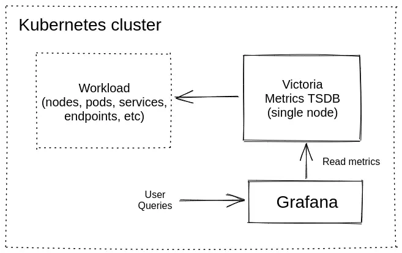
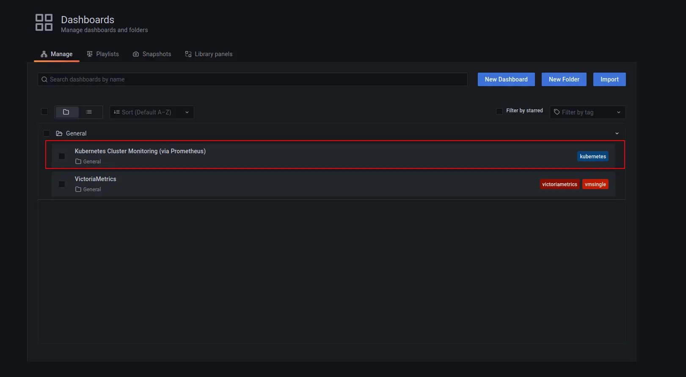
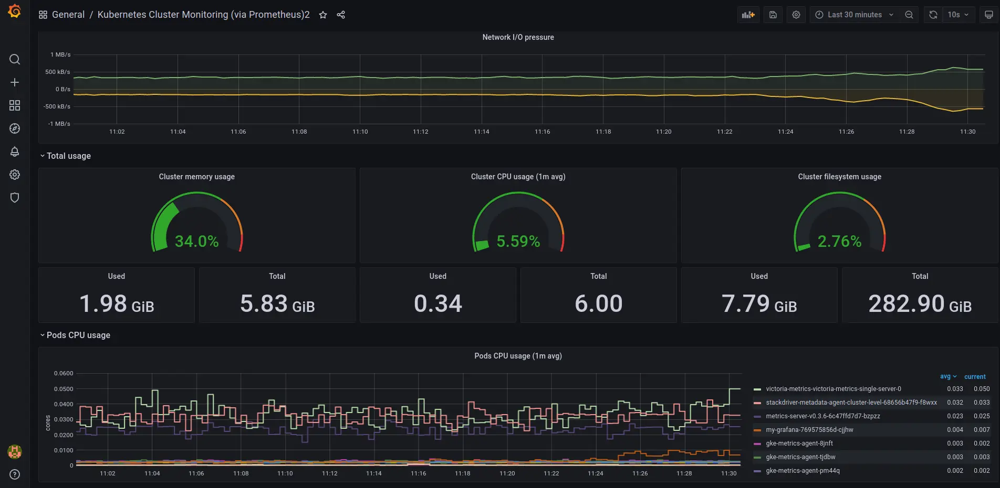
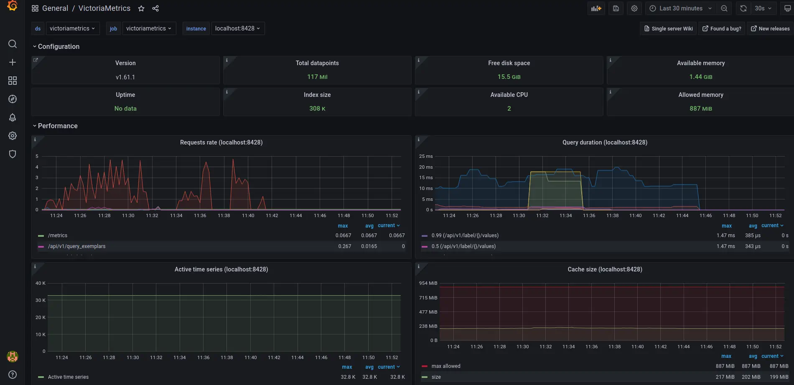

# Kubernetes monitoring via VictoriaMetrics Single


**This guide covers:**

* The setup of a [VictoriaMetrics Single](https://docs.victoriametrics.com/single-server-victoriametrics/) in [Kubernetes](https://kubernetes.io/) via Helm charts
* How to scrape metrics from k8s components using service discovery 
* How to visualize stored data 
* How to store metrics in [VictoriaMetrics](https://victoriametrics.com) tsdb

**Precondition**

We will use:
* [Kubernetes cluster 1.19.9-gke.1900](https://cloud.google.com/kubernetes-engine)
> We use GKE cluster from [GCP](https://cloud.google.com/) but this guide is also applied on any Kubernetes cluster. For example [Amazon EKS](https://aws.amazon.com/ru/eks/).
* [Helm 3 ](https://helm.sh/docs/intro/install)
* [kubectl 1.21](https://kubernetes.io/docs/tasks/tools/install-kubectl)



## 1. VictoriaMetrics Helm repository

> For this guide we will use Helm 3 but if you already use Helm 2 please see this [https://github.com/VictoriaMetrics/helm-charts#for-helm-v2](https://github.com/VictoriaMetrics/helm-charts#for-helm-v2)

You need to add the VictoriaMetrics Helm repository to install VictoriaMetrics components. We’re going to use [VictoriaMetrics Single](https://docs.victoriametrics.com/single-server-victoriametrics/). You can do this by running the following command:


```shell
helm repo add vm https://victoriametrics.github.io/helm-charts/
```


Update Helm repositories:

```shell
helm repo update
```

To verify that everything is set up correctly you may run this command:

```shell
helm search repo vm/
```

The expected output is:

```text
NAME                         	CHART VERSION	APP VERSION	DESCRIPTION                                       
vm/victoria-metrics-agent    	0.7.20       	v1.62.0    	Victoria Metrics Agent - collects metrics from ...
vm/victoria-metrics-alert    	0.3.34       	v1.62.0    	Victoria Metrics Alert - executes a list of giv...
vm/victoria-metrics-auth     	0.2.23       	1.62.0     	Victoria Metrics Auth - is a simple auth proxy ...
vm/victoria-metrics-cluster  	0.8.32       	1.62.0     	Victoria Metrics Cluster version - high-perform...
vm/victoria-metrics-k8s-stack	0.2.9        	1.16.0     	Kubernetes monitoring on VictoriaMetrics stack....
vm/victoria-metrics-operator 	0.1.17       	0.16.0     	Victoria Metrics Operator                         
vm/victoria-metrics-single   	0.7.5        	1.62.0     	Victoria Metrics Single version - high-performa...
```


## 2. Install [VictoriaMetrics Single](https://docs.victoriametrics.com/single-server-victoriametrics/) from Helm Chart

Run this command in your terminal:

```text
helm install vmsingle vm/victoria-metrics-single -f https://docs.victoriametrics.com/guides/guide-vmsingle-values.yaml
```

Here is full file content `guide-vmsingle-values.yaml`

```yaml
server:
  scrape:
    enabled: true
    configMap: ""
    config:
      global:
        scrape_interval: 15s
      scrape_configs:
        - job_name: victoriametrics
          static_configs:
            - targets: [ "localhost:8428" ]
        - job_name: "kubernetes-apiservers"
          kubernetes_sd_configs:
            - role: endpoints
          scheme: https
          tls_config:
            ca_file: /var/run/secrets/kubernetes.io/serviceaccount/ca.crt
            insecure_skip_verify: true
          bearer_token_file: /var/run/secrets/kubernetes.io/serviceaccount/token
          relabel_configs:
            - source_labels:
                [
                    __meta_kubernetes_namespace,
                    __meta_kubernetes_service_name,
                    __meta_kubernetes_endpoint_port_name,
                ]
              action: keep
              regex: default;kubernetes;https
        - job_name: "kubernetes-nodes"
          scheme: https
          tls_config:
            ca_file: /var/run/secrets/kubernetes.io/serviceaccount/ca.crt
            insecure_skip_verify: true
          bearer_token_file: /var/run/secrets/kubernetes.io/serviceaccount/token
          kubernetes_sd_configs:
            - role: node
          relabel_configs:
            - action: labelmap
              regex: __meta_kubernetes_node_label_(.+)
            - target_label: __address__
              replacement: kubernetes.default.svc:443
            - source_labels: [ __meta_kubernetes_node_name ]
              regex: (.+)
              target_label: __metrics_path__
              replacement: /api/v1/nodes/$1/proxy/metrics
        - job_name: "kubernetes-nodes-cadvisor"
          scheme: https
          tls_config:
            ca_file: /var/run/secrets/kubernetes.io/serviceaccount/ca.crt
            insecure_skip_verify: true
          bearer_token_file: /var/run/secrets/kubernetes.io/serviceaccount/token
          kubernetes_sd_configs:
            - role: node
          relabel_configs:
            - action: labelmap
              regex: __meta_kubernetes_node_label_(.+)
            - target_label: __address__
              replacement: kubernetes.default.svc:443
            - source_labels: [ __meta_kubernetes_node_name ]
              regex: (.+)
              target_label: __metrics_path__
              replacement: /api/v1/nodes/$1/proxy/metrics/cadvisor
          metric_relabel_configs:
            - action: replace
              source_labels: [pod]
              regex: '(.+)'
              target_label: pod_name
              replacement: '${1}'
            - action: replace
              source_labels: [container]
              regex: '(.+)'
              target_label: container_name
              replacement: '${1}'
            - action: replace
              target_label: name
              replacement: k8s_stub
            - action: replace
              source_labels: [id]
              regex: '^/system\.slice/(.+)\.service$'
              target_label: systemd_service_name
              replacement: '${1}'

```


* By running `helm install vmsingle vm/victoria-metrics-single` we install [VictoriaMetrics Single](https://docs.victoriametrics.com/single-server-victoriametrics/) to default [namespace](https://kubernetes.io/docs/concepts/overview/working-with-objects/namespaces/) inside your cluster
* By adding `scrape: enable: true` we add and enable autodiscovery scraping from kubernetes cluster to [VictoriaMetrics Single](https://docs.victoriametrics.com/single-server-victoriametrics/)
* On line 166 from [https://docs.victoriametrics.com/guides/guide-vmsingle-values.yaml](https://docs.victoriametrics.com/guides/guide-vmsingle-values.yaml) we added `metric_relabel_configs` section that will help us to show Kubernetes metrics on Grafana dashboard.


As a result of the command you will see the following output:

```text
NAME: victoria-metrics
LAST DEPLOYED: Fri Jun 25 12:06:13 2021
NAMESPACE: default
STATUS: deployed
REVISION: 1
TEST SUITE: None
NOTES:
The VictoriaMetrics write api can be accessed via port 8428 on the following DNS name from within your cluster:
    vmsingle-victoria-metrics-single-server.default.svc.cluster.local


Metrics Ingestion:
  Get the Victoria Metrics service URL by running these commands in the same shell:
    export POD_NAME=$(kubectl get pods --namespace default -l "app=server" -o jsonpath="{.items[0].metadata.name}")
    kubectl --namespace default port-forward $POD_NAME 8428

  Write url inside the kubernetes cluster:
    http://vmsingle-victoria-metrics-single-server.default.svc.cluster.local:8428/api/v1/write

Metrics Scrape:
  Pull-based scrapes are enabled
  Scrape config can be displayed by running this command::
    kubectl get cm vmsingle-victoria-metrics-single-server-scrapeconfig -n default

  The target’s information is accessible via api:
    Inside cluster:
      http://vmsingle-victoria-metrics-single-server.default.svc.cluster.local:8428/targets
    Outside cluster:
      You need to port-forward service (see instructions above) and call
      http://<service-host-port>/targets

Read Data:
  The following url can be used as the datasource url in Grafana::
    http://vmsingle-victoria-metrics-single-server.default.svc.cluster.local:8428

```

For us it’s important to remember the url for the datasource (copy lines from output).

Verify that VictoriaMetrics pod is up and running by executing the following command:


```shell
kubectl get pods
```

The expected output is:

```text
NAME                                                READY   STATUS    RESTARTS   AGE
vmsingle-victoria-metrics-single-server-0   1/1     Running   0          68s
```


## 3. Install and connect Grafana to VictoriaMetrics with Helm

Add the Grafana Helm repository. 


```shell
helm repo add grafana https://grafana.github.io/helm-charts
helm repo update
```


By installing the Chart with the release name `my-grafana`, you add the VictoriaMetrics datasource with official dashboard and kubernetes dashboard:

```yaml
cat <<EOF | helm install my-grafana grafana/grafana -f -
  datasources:
    datasources.yaml:
      apiVersion: 1
      datasources:
        - name: victoriametrics
          type: prometheus
          orgId: 1
          url: http://vmsingle-victoria-metrics-single-server.default.svc.cluster.local:8428
          access: proxy
          isDefault: true
          updateIntervalSeconds: 10
          editable: true

  dashboardProviders:
   dashboardproviders.yaml:
     apiVersion: 1
     providers:
     - name: 'default'
       orgId: 1
       folder: ''
       type: file
       disableDeletion: true
       editable: true
       options:
         path: /var/lib/grafana/dashboards/default

  dashboards:
    default:
      victoriametrics:
        gnetId: 10229
        revision: 22
        datasource: victoriametrics
      kubernetes:
        gnetId: 14205
        revision: 1
        datasource: victoriametrics
EOF
```


By running this command we:
* Install Grafana from Helm repository.
* Provision VictoriaMetrics datasource with the url from the output above which we copied before.
* Add [this dashboard](https://grafana.com/grafana/dashboards/10229) for VictoriaMetrics.
* Add [this dashboard](https://grafana.com/grafana/dashboards/14205) to see Kubernetes cluster metrics.


Check the output log in your terminal.
To see the password for Grafana `admin` user use the following command:

```shell
kubectl get secret --namespace default my-grafana -o jsonpath="{.data.admin-password}" | base64 --decode ; echo
```

Expose Grafana service on `127.0.0.1:3000`:

```shell
export POD_NAME=$(kubectl get pods --namespace default -l "app.kubernetes.io/name=grafana,app.kubernetes.io/instance=my-grafana" -o jsonpath="{.items[0].metadata.name}")

kubectl --namespace default port-forward $POD_NAME 3000
```

Now Grafana should be accessible on the [http://127.0.0.1:3000](http://127.0.0.1:3000) address.


## 4. Check the obtained result in your browser

To check that VictoriaMetrics has collects metrics from the k8s cluster open in browser [http://127.0.0.1:3000/dashboards](http://127.0.0.1:3000/dashboards) and choose `Kubernetes Cluster Monitoring (via Prometheus)` dashboard. Use `admin` for login and `password` that you previously obtained from kubectl. 



You will see something like this:



VictoriaMetrics dashboard also available to use:



## 5. Final thoughts

* We have set up TimeSeries Database for your k8s cluster.
* Collected metrics from all running pods,nodes, … and store them in VictoriaMetrics database.
* Visualize resources used in Kubernetes cluster by Grafana dashboards.
