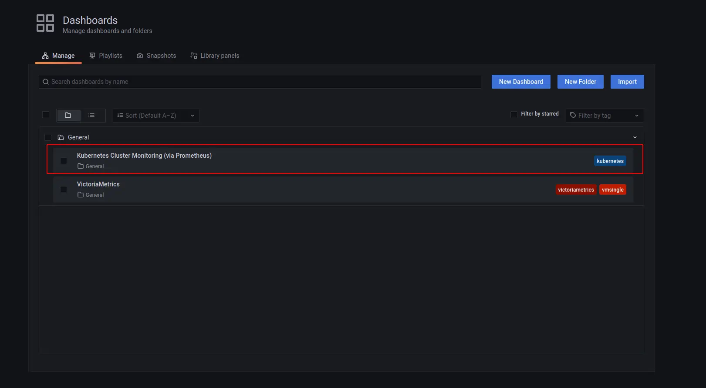

---
build:
  list: never
  publishResources: false
  render: never
sitemap:
  disable: true
---

**This guide covers:**

- The setup of a [VictoriaMetrics Single-Node Instance](https://docs.victoriametrics.com/victoriametrics/single-server-victoriametrics/) in [Kubernetes](https://kubernetes.io/) via Helm charts.
- How to scrape metrics from Kubernetes components using service discovery.
- How to visualize stored data.
- How to store metrics in [VictoriaMetrics](https://victoriametrics.com) time series database.

**Precondition**

We will use:

- [Kubernetes cluster 1.34.1-gke.3971001](https://cloud.google.com/kubernetes-engine)
  > We use a GKE cluster from [GCP](https://cloud.google.com/), but this guide also applies to any Kubernetes cluster. For example, [Amazon EKS](https://aws.amazon.com/ru/eks/) or an on-premises cluster.
- [Helm 4.1.0+](https://helm.sh/docs/intro/install)
- [kubectl 1.34.3](https://kubernetes.io/docs/tasks/tools/install-kubectl)


## 1. VictoriaMetrics Helm repository

You need to add the VictoriaMetrics Helm repository to install VictoriaMetrics components. We’re going to use [VictoriaMetrics Single](https://docs.victoriametrics.com/victoriametrics/single-server-victoriametrics/). You can do this by running the following command:

```shell
helm repo add vm https://victoriametrics.github.io/helm-charts/
```

Update Helm repositories:

```shell
helm repo update
```

To verify that everything is set up correctly, you may run this command:

```shell
helm search repo vm/
```

The expected output is:

```text
NAME                                    CHART VERSION   APP VERSION     DESCRIPTION
vm/victoria-logs-agent                  0.0.8           v1.44.0         VictoriaLogs Agent - accepts logs from various ...
vm/victoria-logs-cluster                0.0.26          v1.44.0         The VictoriaLogs cluster Helm chart deploys Vic...
vm/victoria-logs-collector              0.2.8           v1.44.0         VictoriaLogs Collector - collects logs from Kub...
vm/victoria-logs-multilevel             0.0.8           v1.44.0         The VictoriaLogs multilevel Helm chart deploys ...
vm/victoria-logs-single                 0.11.25         v1.44.0         The VictoriaLogs single Helm chart deploys Vict...
vm/victoria-metrics-agent               0.30.0          v1.134.0        VictoriaMetrics Agent - collects metrics from v...
vm/victoria-metrics-alert               0.30.0          v1.134.0        VictoriaMetrics Alert - executes a list of give...
vm/victoria-metrics-anomaly             1.12.9          v1.28.2         VictoriaMetrics Anomaly Detection - a service t...
vm/victoria-metrics-auth                0.23.0          v1.134.0        VictoriaMetrics Auth - is a simple auth proxy a...
vm/victoria-metrics-cluster             0.33.0          v1.134.0        VictoriaMetrics Cluster version - high-performa...
vm/victoria-metrics-common              0.0.46                          VictoriaMetrics Common - contains shared templa...
vm/victoria-metrics-distributed         0.28.0          v1.134.0        A Helm chart for Running VMCluster on Multiple ...
vm/victoria-metrics-gateway             0.21.0          v1.134.0        VictoriaMetrics Gateway - Auth & Rate-Limitting...
vm/victoria-metrics-Kubernetes-stack    0.69.0          v1.134.0        Kubernetes monitoring on VictoriaMetrics stack....
vm/victoria-metrics-operator            0.58.1          v0.67.0         VictoriaMetrics Operator
vm/victoria-metrics-operator-crds       0.7.0           v0.67.0         VictoriaMetrics Operator CRDs
vm/victoria-metrics-single              0.29.0          v1.134.0        VictoriaMetrics Single version - high-performan...
vm/victoria-traces-cluster              0.0.6           v0.7.0          The VictoriaTraces cluster Helm chart deploys V...
vm/victoria-traces-single               0.0.6           v0.7.0          The VictoriaTraces single Helm chart deploys Vi...
```

## 2. Install [VictoriaMetrics Single](https://docs.victoriametrics.com/victoriametrics/single-server-victoriametrics/) from Helm Chart

Run this command in your terminal:

```shell
helm install vmsingle vm/victoria-metrics-single -f https://docs.victoriametrics.com/guides/examples/guide-vmsingle-values.yaml
```

Here is the full file content of `guide-vmsingle-values.yaml`

```yaml
server:
  scrape:
    enabled: true
    configMap: ""
    config:
      global:
        scrape_interval: 15s
      scrape_configs:
        - job_name: victoriametrics
          static_configs:
            - targets: ["localhost:8428"]
        - job_name: "kubernetes-apiservers"
          kubernetes_sd_configs:
            - role: endpoints
          scheme: https
          tls_config:
            ca_file: /var/run/secrets/kubernetes.io/serviceaccount/ca.crt
            insecure_skip_verify: true
          bearer_token_file: /var/run/secrets/kubernetes.io/serviceaccount/token
          relabel_configs:
            - source_labels:
                [
                  __meta_kubernetes_namespace,
                  __meta_kubernetes_service_name,
                  __meta_kubernetes_endpoint_port_name,
                ]
              action: keep
              regex: default;kubernetes;https
        - job_name: "kubernetes-nodes"
          scheme: https
          tls_config:
            ca_file: /var/run/secrets/kubernetes.io/serviceaccount/ca.crt
            insecure_skip_verify: true
          bearer_token_file: /var/run/secrets/kubernetes.io/serviceaccount/token
          kubernetes_sd_configs:
            - role: node
          relabel_configs:
            - action: labelmap
              regex: __meta_kubernetes_node_label_(.+)
            - target_label: __address__
              replacement: kubernetes.default.svc:443
            - source_labels: [__meta_kubernetes_node_name]
              regex: (.+)
              target_label: __metrics_path__
              replacement: /api/v1/nodes/$1/proxy/metrics
        - job_name: "kubernetes-nodes-cadvisor"
          scheme: https
          tls_config:
            ca_file: /var/run/secrets/kubernetes.io/serviceaccount/ca.crt
            insecure_skip_verify: true
          bearer_token_file: /var/run/secrets/kubernetes.io/serviceaccount/token
          kubernetes_sd_configs:
            - role: node
          relabel_configs:
            - action: labelmap
              regex: __meta_kubernetes_node_label_(.+)
            - target_label: __address__
              replacement: kubernetes.default.svc:443
            - source_labels: [__meta_kubernetes_node_name]
              regex: (.+)
              target_label: __metrics_path__
              replacement: /api/v1/nodes/$1/proxy/metrics/cadvisor
          metric_relabel_configs:
            - action: replace
              source_labels: [pod]
              regex: "(.+)"
              target_label: pod_name
              replacement: "${1}"
            - action: replace
              source_labels: [container]
              regex: "(.+)"
              target_label: container_name
              replacement: "${1}"
            - action: replace
              target_label: name
              replacement: Kubernetes_stub
            - action: replace
              source_labels: [id]
              regex: '^/system\.slice/(.+)\.service$'
              target_label: systemd_service_name
              replacement: "${1}"
```

- With `helm install` we install [VictoriaMetrics Single](https://docs.victoriametrics.com/victoriametrics/single-server-victoriametrics/) to default [namespace](https://kubernetes.io/docs/concepts/overview/working-with-objects/namespaces/) inside your cluster.
- By adding `scrape: enabled: true`, we add and enable autodiscovery scraping from the Kubernetes cluster to [VictoriaMetrics Single](https://docs.victoriametrics.com/victoriametrics/single-server-victoriametrics/).
- On line 63 from [https://docs.victoriametrics.com/guides/examples/guide-vmsingle-values.yaml](https://docs.victoriametrics.com/guides/examples/guide-vmsingle-values.yaml), we added a `metric_relabel_configs` section that normalizes labels to correctly show the Kubernetes metrics on the Grafana dashboard.

As a result of the command, you will see the following output:

```text
NAME: vmsingle
LAST DEPLOYED: Wed Jan 28 13:04:36 2026
NAMESPACE: default
STATUS: deployed
REVISION: 1
DESCRIPTION: Install complete
TEST SUITE: None
NOTES:
The VictoriaMetrics write api can be accessed via port 8428 on the following DNS name from within your cluster:
    vmsingle-victoria-metrics-single-server.default.svc.cluster.local.

Metrics Ingestion:
  Get the Victoria Metrics service URL by running these commands in the same shell:
    export POD_NAME=$(kubectl get pods --namespace default -l "app=" -o jsonpath="{.items[0].metadata.name}")
    kubectl --namespace default port-forward $POD_NAME 8428

  Write the URL inside the Kubernetes cluster:
    http://vmsingle-victoria-metrics-single-server.default.svc.cluster.local.:8428/<protocol-specific-write-endpoint>

  All supported write endpoints can be found at https://docs.victoriametrics.com/victoriametrics/single-server-victoriametrics/#how-to-import-time-series-data

  E.g, for Prometheus:
    http://vmsingle-victoria-metrics-single-server.default.svc.cluster.local.:8428/api/v1/write

Metrics Scrape:
  Pull-based scrapes are enabled
  Scrape config can be displayed by running this command::
    kubectl get cm vmsingle-victoria-metrics-single-server-scrapeconfig -n default

  The target’s information is accessible via api:
    Inside cluster:
      http://vmsingle-victoria-metrics-single-server.default.svc.cluster.local.:8428/targets
    Outside cluster:
      You need to port-forward the service (see instructions above) and call
      http://<service-host-port>/targets

Read Data:
  The following URL can be used as the datasource URL in Grafana::
    http://vmsingle-victoria-metrics-single-server.default.svc.cluster.local.:8428
```

For us, it’s important to remember the URL of the datasource (copy the lines from the output). In the example above, we need to copy the "datasource URL in Grafana" near the end of the output:

```text
The following URL can be used as the datasource URL in Grafana::
http://vmsingle-victoria-metrics-single-server.default.svc.cluster.local.:8428

```

Verify that the VictoriaMetrics pod is up and running by executing the following command:

```shell
kubectl get pods
```

Wait until the STATUS is Running. The expected output is:

```text
NAME                                                READY   STATUS    RESTARTS   AGE
vmsingle-victoria-metrics-single-server-0   1/1     Running   0          68s
```

## 3. Install and connect Grafana to VictoriaMetrics with Helm

Add the Grafana Helm repository.

```shell
helm repo add grafana https://grafana.github.io/helm-charts
helm repo update
```

Run the following command to install Grafana with the release name `my-grafana`. Paste the URL copied from the previous step into the `url` key in the following chart:

```yaml
cat <<EOF | helm install my-grafana grafana/grafana -f -
  datasources:
    datasources.yaml:
      apiVersion: 1
      datasources:
        - name: victoriametrics
          type: prometheus
          orgId: 1
          # use the URL obtained from the VictoriaMetrics helm install output
          url: http://vmsingle-victoria-metrics-single-server.default.svc.cluster.local.:8428
          access: proxy
          isDefault: true
          updateIntervalSeconds: 10
          editable: true

  dashboardProviders:
   dashboardproviders.yaml:
     apiVersion: 1
     providers:
     - name: 'default'
       orgId: 1
       folder: ''
       type: file
       disableDeletion: true
       editable: true
       options:
         path: /var/lib/grafana/dashboards/default

  dashboards:
    default:
      victoriametrics:
        gnetId: 10229
        # tip: replace with the latest revision number at https://grafana.com/grafana/dashboards/10229-victoriametrics-single-node/
        revision: 48
        datasource: victoriametrics
      kubernetes:
        gnetId: 14205
        revision: 1
        datasource: victoriametrics
EOF
```

> [!NOTE] Tip
> Grafana Dashboard revisions may change. Check the [VictoriaMetrics Dashboards](https://grafana.com/grafana/dashboards/10229-victoriametrics-single-node/) on Grafana.com to obtain the latest revision number.

By running this command, we:

- Install Grafana from the Helm repository.
- Provision the VictoriaMetrics datasource with the `url` from the output above, which we copied before.
- Add [this dashboard](https://grafana.com/grafana/dashboards/10229) for VictoriaMetrics.
- Add [this dashboard](https://grafana.com/grafana/dashboards/14205) to see Kubernetes cluster metrics.

Check the output log in your terminal. You should see the following output:

```text
NAME: my-grafana
LAST DEPLOYED: Wed Jan 28 13:12:51 2026
NAMESPACE: default
STATUS: deployed
REVISION: 1
DESCRIPTION: Install complete
NOTES:
1. Get your 'admin' user password by running:

   kubectl get secret --namespace default my-grafana -o jsonpath="{.data.admin-password}" | base64 --decode ; echo


2. The Grafana server can be accessed via port 80 on the following DNS name from within your cluster:

   my-grafana.default.svc.cluster.local

   Get the Grafana URL to visit by running these commands in the same shell:
     export POD_NAME=$(kubectl get pods --namespace default -l "app.kubernetes.io/name=grafana,app.kubernetes.io/instance=my-grafana" -o jsonpath="{.items[0].metadata.name}")
     kubectl --namespace default port-forward $POD_NAME 3000

3. Login with the password from step 1 and the username: admin
#################################################################################
######   WARNING: Persistence is disabled!!! You will lose your data when   #####
######            the Grafana pod is terminated.                            #####
#################################################################################
```

To see the password for Grafana `admin` user use the command shown in the previous output:

```shell
kubectl get secret --namespace default my-grafana -o jsonpath="{.data.admin-password}" | base64 --decode ; echo
```

Wait until the Grafana pod Status is Running:

```text
NAME                                        READY   STATUS    RESTARTS   AGE
my-grafana-bc7796cf5-ffmln                  1/1     Running   0          8m40s
```

Expose the Grafana service on `127.0.0.1:3000` with:

```shell
export POD_NAME=$(kubectl get pods --namespace default -l "app.kubernetes.io/name=grafana,app.kubernetes.io/instance=my-grafana" -o jsonpath="{.items[0].metadata.name}")

kubectl --namespace default port-forward $POD_NAME 3000
```

Now Grafana should be accessible at `http://127.0.0.1:3000`.

## 4. View the dashboards in your browser

To check that VictoriaMetrics has collected metrics from the Kubernetes cluster, open the browser to `http://127.0.0.1:3000/dashboards` and choose the `Kubernetes Cluster Monitoring (via Prometheus)` dashboard. Use `admin` as the username and the password you obtained earlier using `kubectl get secret ...`.



You will see something like this:


The VictoriaMetrics dashboard is also available to use:


## 5. Final thoughts

- You now have a time series database for your Kubernetes cluster.
- VictoriaMetrics continuously collects and stores metrics from all running pods and nodes.
- Grafana dashboards give you a visual view of cluster resources.
