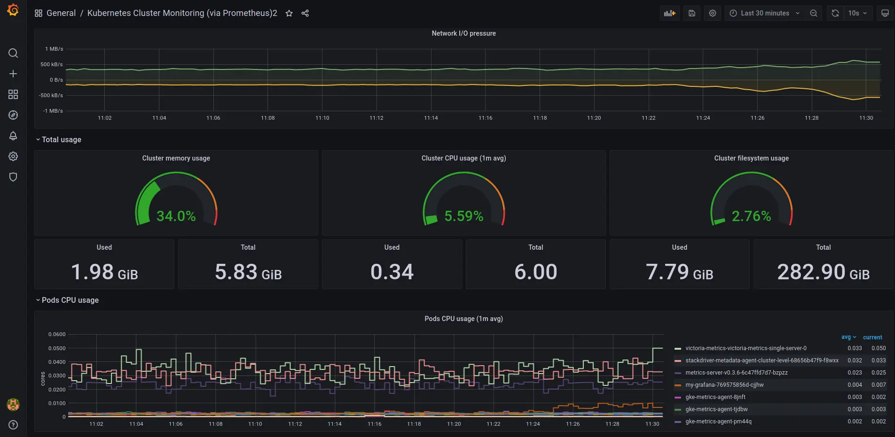

---
build:
  list: never
  publishResources: false
  render: never
sitemap:
  disable: true
---

This guide walks you through deploying a [single-node version of VictoriaMetrics](https://docs.victoriametrics.com/victoriametrics/single-server-victoriametrics/) on Kubernetes using Helm.

At the end of this guide, you will know:

- How to install VictoriaMetrics single node in Kubernetes.
- How to scrape metrics from Kubernetes components using service discovery.
- How to store metrics in [VictoriaMetrics](https://victoriametrics.com) time series database.
- How to visualize stored data with Grafana.

**Precondition**

We will use:

- [Kubernetes cluster 1.34](https://cloud.google.com/kubernetes-engine)
- [Helm 4.1.0+](https://helm.sh/docs/intro/install)
- [kubectl 1.34.3](https://kubernetes.io/docs/tasks/tools/install-kubectl)

  > We use a GKE cluster from [GCP](https://cloud.google.com/), but this guide also applies to any Kubernetes cluster. For example, [Amazon EKS](https://aws.amazon.com/ru/eks/) or an on-premises cluster.


## 1. VictoriaMetrics Helm repository

Run the following command to add the VictoriaMetrics Helm repository:

```shell
helm repo add vm https://victoriametrics.github.io/helm-charts/
helm repo update
```

To verify that everything is set up correctly, you may run this command:

```shell
helm search repo vm/
```

You should get a list of charts similar to this:

```text
NAME                                    CHART VERSION   APP VERSION     DESCRIPTION
vm/victoria-metrics-single              0.29.0          v1.134.0        VictoriaMetrics Single version - high-performan...
vm/victoria-metrics-agent               0.30.0          v1.134.0        VictoriaMetrics Agent - collects metrics from v...
vm/victoria-metrics-alert               0.30.0          v1.134.0        VictoriaMetrics Alert - executes a list of give...
vm/victoria-metrics-anomaly             1.12.9          v1.28.2         VictoriaMetrics Anomaly Detection - a service t...
...(list continues)...
```

## 2. Install [VictoriaMetrics single](https://docs.victoriametrics.com/victoriametrics/single-server-victoriametrics/) from Helm Chart

Run this command in your terminal to install [VictoriaMetrics single node](https://docs.victoriametrics.com/victoriametrics/single-server-victoriametrics/) to the default [namespace](https://kubernetes.io/docs/concepts/overview/working-with-objects/namespaces/) in your cluster:

```shell
helm install vmsingle vm/victoria-metrics-single -f https://docs.victoriametrics.com/guides/examples/guide-vmsingle-values.yaml
```

Below are the key sections in the chart values file [`guide-vmsingle-values.yaml`](https://docs.victoriametrics.com/guides/examples/guide-vmsingle-values.yaml):

- With `scrape: enabled: true`, we enable metric autodiscovery for the Kubernetes cluster.

    ```yaml
    server:
      scrape:
        enabled: true
        ...
    ```

- The `metric_relabel_configs` section normalizes Kubernetes metrics labels so they are shown correctly in the Grafana dashboard later on.

    ```yaml
              ...
              metric_relabel_configs:
                - action: replace
                  source_labels: [pod]
                  regex: '(.+)'
                  target_label: pod_name
                  replacement: '${1}'
                - action: replace
                  source_labels: [container]
                  regex: '(.+)'
                  target_label: container_name
                  replacement: '${1}'
                - action: replace
                  target_label: name
                  replacement: k8s_stub
                - action: replace
                  source_labels: [id]
                  regex: '^/system\.slice/(.+)\.service$'
                  target_label: systemd_service_name
                  replacement: '${1}'
              ...
    ```

The `helm install vmsingle vm/victoria-metrics-single` command should result in the following output:

```text
NAME: vmsingle
LAST DEPLOYED: Wed Jan 28 13:04:36 2026
NAMESPACE: default
STATUS: deployed
REVISION: 1
DESCRIPTION: Install complete
TEST SUITE: None
NOTES:
The VictoriaMetrics write api can be accessed via port 8428 on the following DNS name from within your cluster:
    vmsingle-victoria-metrics-single-server.default.svc.cluster.local.

Metrics Ingestion:
  Get the Victoria Metrics service URL by running these commands in the same shell:
    export POD_NAME=$(kubectl get pods --namespace default -l "app=" -o jsonpath="{.items[0].metadata.name}")
    kubectl --namespace default port-forward $POD_NAME 8428

  Write the URL inside the Kubernetes cluster:
    http://vmsingle-victoria-metrics-single-server.default.svc.cluster.local.:8428/<protocol-specific-write-endpoint>

  All supported write endpoints can be found at https://docs.victoriametrics.com/victoriametrics/single-server-victoriametrics/#how-to-import-time-series-data

  E.g, for Prometheus:
    http://vmsingle-victoria-metrics-single-server.default.svc.cluster.local.:8428/api/v1/write

Metrics Scrape:
  Pull-based scrapes are enabled
  Scrape config can be displayed by running this command::
    kubectl get cm vmsingle-victoria-metrics-single-server-scrapeconfig -n default

  The target’s information is accessible via api:
    Inside cluster:
      http://vmsingle-victoria-metrics-single-server.default.svc.cluster.local.:8428/targets
    Outside cluster:
      You need to port-forward the service (see instructions above) and call
      http://<service-host-port>/targets

Read Data:
  The following URL can be used as the datasource URL in Grafana::
    http://vmsingle-victoria-metrics-single-server.default.svc.cluster.local.:8428
```

Take note of the Grafana datasource URL near the end of the output, as we'll use it in the next step. In the example above, this is the datasource URL:

```text
The following URL can be used as the datasource URL in Grafana::
http://vmsingle-victoria-metrics-single-server.default.svc.cluster.local.:8428

```

Verify that the VictoriaMetrics pod is up and running by executing the following command:

```shell
kubectl get pods
```

Wait until the STATUS is Running. The expected output is:

```text
NAME                                                READY   STATUS    RESTARTS   AGE
vmsingle-victoria-metrics-single-server-0   1/1     Running   0          68s
```

## 3. Install and connect Grafana to VictoriaMetrics with Helm

Add the Grafana Helm repository.

```shell
helm repo add grafana-community https://grafana-community.github.io/helm-charts
helm repo update
```

> [!NOTE] Tip
> See more information on Grafana in [ArtifactHUB](https://artifacthub.io/packages/helm/grafana-community/grafana)

Create a config file for the Grafana service. Ensure that the `url` value matches the Grafana datasource URL from the previous step:

```yaml
cat <<EOF > grafana-single-values.yml
  datasources:
    datasources.yaml:
      apiVersion: 1
      datasources:
        - name: victoriametrics
          type: prometheus
          orgId: 1
          # use the URL obtained from the VictoriaMetrics helm install output
          url: http://vmsingle-victoria-metrics-single-server.default.svc.cluster.local.:8428
          access: proxy
          isDefault: true
          updateIntervalSeconds: 10
          editable: true

  dashboardProviders:
   dashboardproviders.yaml:
     apiVersion: 1
     providers:
     - name: 'default'
       orgId: 1
       folder: ''
       type: file
       disableDeletion: true
       editable: true
       options:
         path: /var/lib/grafana/dashboards/default

  dashboards:
    default:
      victoriametrics:
        gnetId: 10229
        datasource: victoriametrics
      kubernetes:
        gnetId: 14205
        datasource: victoriametrics
EOF
```

Run the following command to install Grafana with the release name `my-grafana`:

```shell
helm install my-grafana grafana-community/grafana -f grafana-single-values.yml
```

By running this command, we:

- Install Grafana from the Helm repository.
- Configure Grafana to use the VictoriaMetrics datasource URL.
- Add two starter dashboards:
  - [Kubernetes Cluster Monitoring (via Prometheus)](https://grafana.com/grafana/dashboards/14205-kubernetes-cluster-monitoring-via-prometheus/) to show the Kubernetes Cluster metrics.
  - [VictoriaMetrics - single-node](https://grafana.com/grafana/dashboards/10229-victoriametrics-single-node/) for VictoriaMetrics telemetry ingestion monitoring.

Check the output log in your terminal. You should see the following output:

```text
NAME: my-grafana
LAST DEPLOYED: Wed Jan 28 13:12:51 2026
NAMESPACE: default
STATUS: deployed
REVISION: 1
DESCRIPTION: Install complete
NOTES:
1. Get your 'admin' user password by running:

   kubectl get secret --namespace default my-grafana -o jsonpath="{.data.admin-password}" | base64 --decode ; echo


2. The Grafana server can be accessed via port 80 on the following DNS name from within your cluster:

   my-grafana.default.svc.cluster.local

   Get the Grafana URL to visit by running these commands in the same shell:
     export POD_NAME=$(kubectl get pods --namespace default -l "app.kubernetes.io/name=grafana,app.kubernetes.io/instance=my-grafana" -o jsonpath="{.items[0].metadata.name}")
     kubectl --namespace default port-forward $POD_NAME 3000

3. Login with the password from step 1 and the username: admin
#################################################################################
######   WARNING: Persistence is disabled!!! You will lose your data when   #####
######            the Grafana pod is terminated.                            #####
#################################################################################
```

To see the password for Grafana `admin` user use the command shown in the previous output:

```shell
kubectl get secret --namespace default my-grafana -o jsonpath="{.data.admin-password}" | base64 --decode ; echo
```

Wait until the Grafana pod Status is Running:

```text
NAME                                        READY   STATUS    RESTARTS   AGE
my-grafana-bc7796cf5-ffmln                  1/1     Running   0          8m40s
```

Expose the Grafana service on `127.0.0.1:3000` with:

```shell
export POD_NAME=$(kubectl get pods --namespace default -l "app.kubernetes.io/name=grafana,app.kubernetes.io/instance=my-grafana" -o jsonpath="{.items[0].metadata.name}")

kubectl --namespace default port-forward $POD_NAME 3000
```

Now Grafana should be accessible at `http://127.0.0.1:3000`.

## 4. View the dashboards in your browser

To check that VictoriaMetrics has collected metrics from the Kubernetes cluster, open the browser to `http://127.0.0.1:3000/dashboards` and choose the `Kubernetes Cluster Monitoring (via Prometheus)` dashboard.

Use `admin` as the username and the password you obtained earlier using `kubectl get secret ...`.


You should see the metrics for your Kubernetes dashboard:



The VictoriaMetrics dashboard shows metrics on telemetry ingestion and resource utilization:


## 5. Final thoughts

- You now have a time series database for your Kubernetes cluster.
- VictoriaMetrics continuously collects and stores metrics from all running pods and nodes.
- Grafana dashboards give you a visual view of cluster resources.

Consider reading these resources to complete your setup:

- VictoriaMetrics
  - [Learn more about the single-node version](http://localhost:1313/victoriametrics/single-server-victoriametrics/)
  - [Migrate existing metric data into VictoriaMetrics with vmctl](http://localhost:1313/victoriametrics/vmctl/)
  - [Setup alerts](http://localhost:1313/victoriametrics/vmalert/)
- Grafana
  - [Enable persistent storage](https://grafana.com/docs/grafana/latest/setup-grafana/installation/helm/#enable-persistent-storage-recommended)
  - [Configure private TLS authority](https://grafana.com/docs/grafana/latest/setup-grafana/installation/helm/#configure-a-private-ca-certificate-authority)
