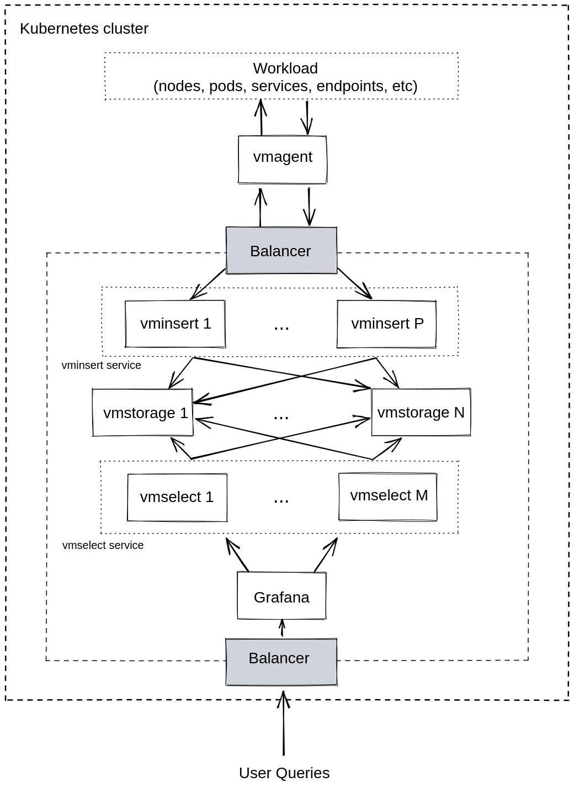
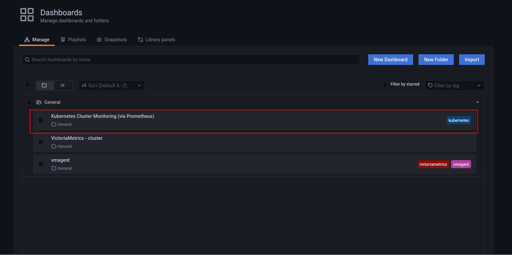
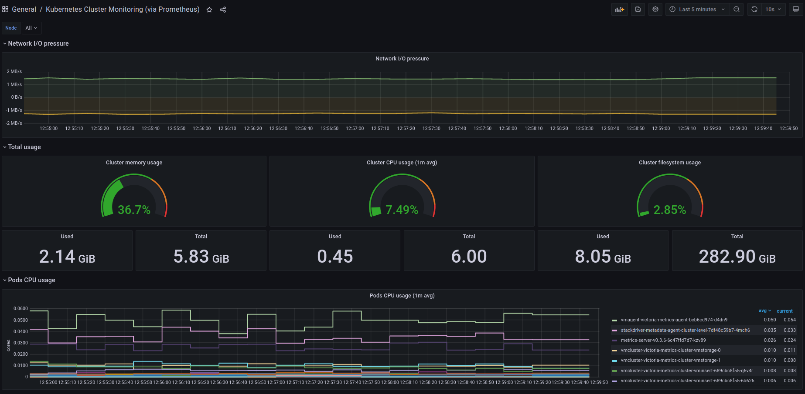
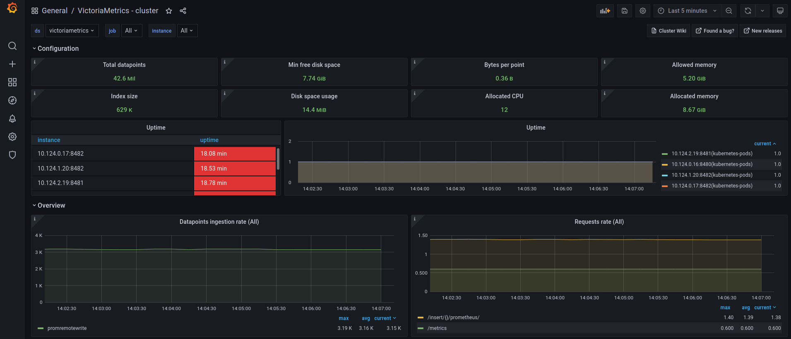
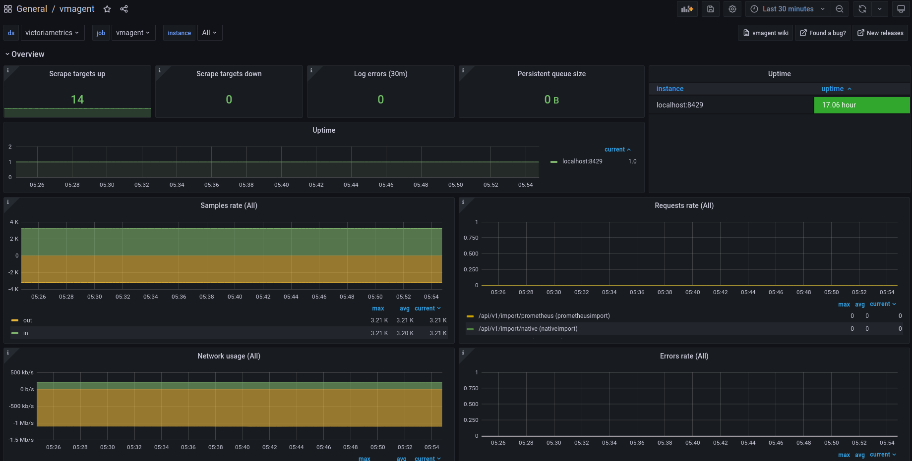

# Kubernetes monitoring with VictoriaMetrics Cluster


**This guide covers:**

* The setup of VictoriaMetrics cluster in Kubernetes via helm charts
* How to store metrics 
* How to scrape metrics from k8s components using service discovery 
* How to Visualize stored data 


**Precondition**


We will use:
* [Kubernetes cluster 1.19.9-gke.1900](https://cloud.google.com/kubernetes-engine)
> We use GKE cluster from GCP but if you have [Amazon EKS](https://aws.amazon.com/ru/eks/) this guide also applies.
* [helm 3 ](https://helm.sh/docs/intro/install)
* [kubectl 1.21](https://kubernetes.io/docs/tasks/tools/install-kubectl)

<p align="center">
  
</p>

**1. VictoriaMetrics helm repository**

> For this guide we will use helm 3 but if you already use helm 2 please see this [https://github.com/VictoriaMetrics/helm-charts#for-helm-v2](https://github.com/VictoriaMetrics/helm-charts#for-helm-v2)

You need to add the VictoriaMetrics helm repository to install VictoriaMetrics components. We’re going to use VictoriaMetrics single-node. You can do this by running the following command:

<div class="with-copy" markdown="1">

```bash
helm repo add vm https://victoriametrics.github.io/helm-charts/
```
</div>

Update helm repositories:

<div class="with-copy" markdown="1">

```bash
helm repo update
```
</div>

To verify that everything is set up correctly you may run this command:

<div class="with-copy" markdown="1">

```bash
helm search repo vm/
```
</div>

The expected output is:

```bash
NAME                         	CHART VERSION	APP VERSION	DESCRIPTION                                       
vm/victoria-metrics-agent    	0.7.20       	v1.62.0    	Victoria Metrics Agent - collects metrics from ...
vm/victoria-metrics-alert    	0.3.34       	v1.62.0    	Victoria Metrics Alert - executes a list of giv...
vm/victoria-metrics-auth     	0.2.23       	1.62.0     	Victoria Metrics Auth - is a simple auth proxy ...
vm/victoria-metrics-cluster  	0.8.32       	1.62.0     	Victoria Metrics Cluster version - high-perform...
vm/victoria-metrics-k8s-stack	0.2.9        	1.16.0     	Kubernetes monitoring on VictoriaMetrics stack....
vm/victoria-metrics-operator 	0.1.17       	0.16.0     	Victoria Metrics Operator                         
vm/victoria-metrics-single   	0.7.5        	1.62.0     	Victoria Metrics Single version - high-performa...
```

**2. Install VictoriaMetrics Cluster from helm chart**

Run this commands in your terminal:

<div class="with-copy" markdown="1">

```yaml
cat <<EOF | helm install vmcluster vm/victoria-metrics-cluster -f -
vmselect:
  podAnnotations:
      prometheus.io/scrape: "true"
      prometheus.io/port: "8481"

vminsert:
  podAnnotations:
      prometheus.io/scrape: "true"
      prometheus.io/port: "8480"

vmstorage:
  podAnnotations:
      prometheus.io/scrape: "true"
      prometheus.io/port: "8482"
EOF     
```
</div>

* By running `helm install vmcluster vm/victoria-metrics-cluster` we will install `VictoriaMetrics Cluster` to default namcespace inside your cluster.
* By adding `podAnnotations: prometheus.io/scrape: "true"` we will enable scrape metrics from vmselect,vminsert and vmstorage pods.
* By adding `podAnnotations:prometheus.io/port: "some_port" ` we will enable scrape metrics from vmselect,vminsert and vmstorage pods from their ports as well.


As a result of the command you will see the next output:

```bash
NAME: vmcluster
LAST DEPLOYED: Thu Jul  1 09:41:57 2021
NAMESPACE: default
STATUS: deployed
REVISION: 1
TEST SUITE: None
NOTES:
Write API:

The Victoria Metrics write api can be accessed via port 8480 on the following DNS name from within your cluster:
vmcluster-victoria-metrics-cluster-vminsert.default.svc.cluster.local

Get the Victoria Metrics insert service URL by running these commands in the same shell:
  export POD_NAME=$(kubectl get pods --namespace default -l "app=vminsert" -o jsonpath="{.items[0].metadata.name}")
  kubectl --namespace default port-forward $POD_NAME 8480

You need to update your prometheus configuration file and add next lines into it:

prometheus.yml

    remote_write:
      - url: "http://<insert-service>/insert/0/prometheus/"


for e.g. inside the kubernetes cluster:

    remote_write:
      - url: "http://vmcluster-victoria-metrics-cluster-vminsert.default.svc.cluster.local:8480/insert/0/prometheus/"
Read API:

The Victoria Metrics read api can be accessed via port 8481 on the following DNS name from within your cluster:
vmcluster-victoria-metrics-cluster-vmselect.default.svc.cluster.local

Get the Victoria Metrics select service URL by running these commands in the same shell:
  export POD_NAME=$(kubectl get pods --namespace default -l "app=vmselect" -o jsonpath="{.items[0].metadata.name}")
  kubectl --namespace default port-forward $POD_NAME 8481

You need to update specify select service URL in your Grafana:
 NOTE: you need to use Prometheus Data Source

Input for URL field in Grafana

    http://<select-service>/select/0/prometheus/


for e.g. inside the kubernetes cluster:

    http://vmcluster-victoria-metrics-cluster-vmselect.default.svc.cluster.local:8481/select/0/prometheus/"

```

For us it’s important to remember url for datasource (copy lines from output).

Verify that VictoriaMetrics cluster pods up and running by executing the following command:

<div class="with-copy" markdown="1">

```bash
kubectl get pods
```
</div>

The expected output:

```bash
NAME                                                           READY   STATUS    RESTARTS   AGE
vmcluster-victoria-metrics-cluster-vminsert-689cbc8f55-95szg   1/1     Running   0          16m
vmcluster-victoria-metrics-cluster-vminsert-689cbc8f55-f852l   1/1     Running   0          16m
vmcluster-victoria-metrics-cluster-vmselect-977d74cdf-bbgp5    1/1     Running   0          16m
vmcluster-victoria-metrics-cluster-vmselect-977d74cdf-vzp6z    1/1     Running   0          16m
vmcluster-victoria-metrics-cluster-vmstorage-0                 1/1     Running   0          16m
vmcluster-victoria-metrics-cluster-vmstorage-1                 1/1     Running   0          16m
```

**3. Install vmagent from helm chart**

To scrape metrics from Kubernetes with VictoriaMetrics cluster we need to install vmagent with additional configuration so run this commands in your terminal:

<div class="with-copy" markdown="1">

```yaml
helm install vmagent vm/victoria-metrics-agent -f https://docs.victoriametrics.com/guides/guide-vmcluster-vmagent-values.yaml
```
</div>

Here is full file content `guide-vmcluster-vmagent-values.yaml`

```yaml
remoteWriteUrls:
   - http://vmcluster-victoria-metrics-cluster-vminsert.default.svc.cluster.local:8480/insert/0/prometheus/
   
scrape_configs:
    - job_name: vmagent
      static_configs:
        - targets: ["localhost:8429"]
    - job_name: "kubernetes-apiservers"
      kubernetes_sd_configs:
        - role: endpoints
      scheme: https
      tls_config:
        ca_file: /var/run/secrets/kubernetes.io/serviceaccount/ca.crt
        insecure_skip_verify: true
      bearer_token_file: /var/run/secrets/kubernetes.io/serviceaccount/token
      relabel_configs:
        - source_labels:
            [
              __meta_kubernetes_namespace,
              __meta_kubernetes_service_name,
              __meta_kubernetes_endpoint_port_name,
            ]
          action: keep
          regex: default;kubernetes;https
    - job_name: "kubernetes-nodes"
      scheme: https
      tls_config:
        ca_file: /var/run/secrets/kubernetes.io/serviceaccount/ca.crt
        insecure_skip_verify: true
      bearer_token_file: /var/run/secrets/kubernetes.io/serviceaccount/token
      kubernetes_sd_configs:
        - role: node
      relabel_configs:
        - action: labelmap
          regex: __meta_kubernetes_node_label_(.+)
        - target_label: __address__
          replacement: kubernetes.default.svc:443
        - source_labels: [__meta_kubernetes_node_name]
          regex: (.+)
          target_label: __metrics_path__
          replacement: /api/v1/nodes/$1/proxy/metrics
    - job_name: "kubernetes-nodes-cadvisor"
      scheme: https
      tls_config:
        ca_file: /var/run/secrets/kubernetes.io/serviceaccount/ca.crt
        insecure_skip_verify: true
      bearer_token_file: /var/run/secrets/kubernetes.io/serviceaccount/token
      kubernetes_sd_configs:
        - role: node
      relabel_configs:
        - action: labelmap
          regex: __meta_kubernetes_node_label_(.+)
        - target_label: __address__
          replacement: kubernetes.default.svc:443
        - source_labels: [__meta_kubernetes_node_name]
          regex: (.+)
          target_label: __metrics_path__
          replacement: /api/v1/nodes/$1/proxy/metrics/cadvisor
      metric_relabel_configs:
        - action: replace
          source_labels: [pod]
          regex: '(.+)'
          target_label: pod_name
          replacement: '${1}'
        - action: replace
          source_labels: [container]
          regex: '(.+)'
          target_label: container_name
          replacement: '${1}'
        - action: replace
          target_label: name
          replacement: k8s_stub
```

* By adding `remoteWriteUrls: - http://vmcluster-victoria-metrics-cluster-vminsert.default.svc.cluster.local:8480/insert/0/prometheus/` we configure `vmagent` to write scraped metrics into `vmselect service`.
* The second part of this yaml file is need to add `metric_ralabel_configs` section that will help us to show Kubernetes metrics on Grafana dashboard.


Verify that `vmagent`'s pod up and running by executing the following command:

<div class="with-copy" markdown="1">

```bash
kubectl get pods | grep vmagent
```
</div>

The expected output:

```bash
vmagent-victoria-metrics-agent-69974b95b4-mhjph                1/1     Running   0          11m
```


**4. Install and connect Grafana to VictoriaMetrics with helm**

Add Grafana helm repository. 

<div class="with-copy" markdown="1">

```bash
helm repo add grafana https://grafana.github.io/helm-charts
helm repo update
```
</div>

See more info on Grafana ArtifactHUB [https://artifacthub.io/packages/helm/grafana/grafana](https://artifacthub.io/packages/helm/grafana/grafana)

Installing the Chart with the release name `my-grafana`, add VictoriaMetrics datasource with dashboard official dashboard and kubernetes dashboard:

<div class="with-copy" markdown="1">

```yaml
cat <<EOF | helm install my-grafana grafana/grafana -f -
  datasources:
    datasources.yaml:
      apiVersion: 1
      datasources:
        - name: victoriametrics
          type: prometheus
          orgId: 1
          url: http://vmcluster-victoria-metrics-cluster-vmselect.default.svc.cluster.local:8481/select/0/prometheus/
          access: proxy
          isDefault: true
          updateIntervalSeconds: 10
          editable: true

  dashboardProviders:
   dashboardproviders.yaml:
     apiVersion: 1
     providers:
     - name: 'default'
       orgId: 1
       folder: ''
       type: file
       disableDeletion: true
       editable: true
       options:
         path: /var/lib/grafana/dashboards/default

  dashboards:
    default:
      victoriametrics:
        gnetId: 11176
        revision: 15
        datasource: victoriametrics
      vmagent:
        gnetId: 12683
        revision: 5
        datasource: victoriametrics
      kubernetes:
        gnetId: 14205
        revision: 1
        datasource: victoriametrics
EOF
```
</div>

By running this command we:
* Install grafana from helm repository.
* Provision VictoriaMetrics datasource with url from the output above which we remembered.
* Add this [https://grafana.com/grafana/dashboards/11176](https://grafana.com/grafana/dashboards/11176) dashboard for VictoriaMetrics Cluster.
* Add this [https://grafana.com/grafana/dashboards/12683](https://grafana.com/grafana/dashboards/12683) dashboard for VictoriaMetrics Agent.
* Add this [https://grafana.com/grafana/dashboards/14205](https://grafana.com/grafana/dashboards/14205) dashboard to see Kubernetes cluster metrics.


See the output log in terminal. Copy, paste and run this commands. 
The first one will show `admin` password for Grafaba admin.
The second and the third will forward Grafana to `127.0.0.1:3000`:

<div class="with-copy" markdown="1">

```bash
kubectl get secret --namespace default my-grafana -o jsonpath="{.data.admin-password}" | base64 --decode ; echo

export POD_NAME=$(kubectl get pods --namespace default -l "app.kubernetes.io/name=grafana,app.kubernetes.io/instance=my-grafana" -o jsonpath="{.items[0].metadata.name}")

kubectl --namespace default port-forward $POD_NAME 3000
```
</div>

**5. Check the obtained result in browser**

To check that VictoriaMetrics collect metrics from k8s cluster open in browser [http://127.0.0.1:3000/dashboards](http://127.0.0.1:3000/dashboards) and choose `Kubernetes Cluster Monitoring (via Prometheus)` dashboard. Use `admin` for login and `password` that you got before from kubectl. 

<p align="center">
  
</p>

You will see something like this:
<p align="center">
  
</p>

VictoriaMetrics dashboard also available to use:
<p align="center">
  
</p>

vmagent has own dashboard:
<p align="center">
  
</p>

**6. Final thoughts**

* We set up TimeSeries Database for you k8s cluster.
* Collected metrics from all running pods,nodes, … and store them in VictoriaMetrics database.
* Visualize resources used in kubernetes cluster by Grafana dashboards.